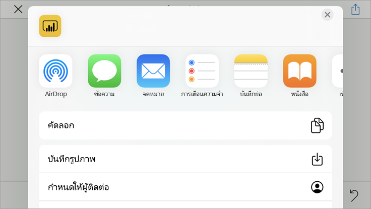
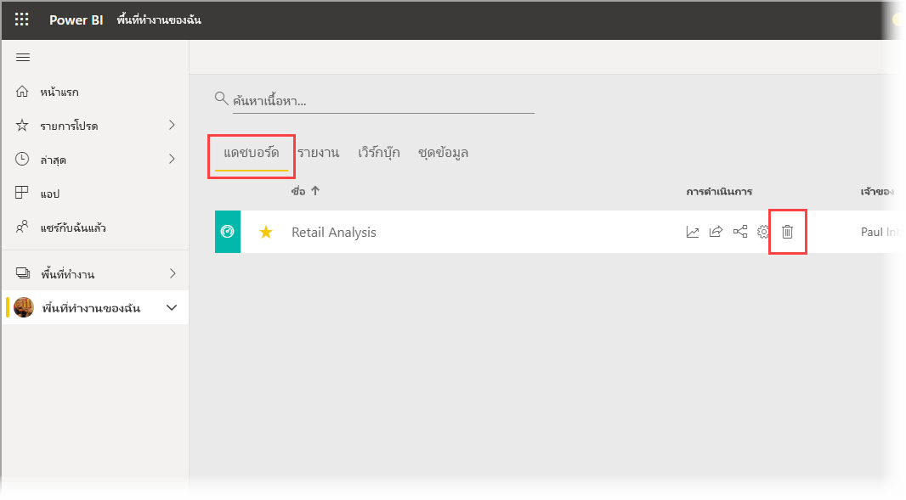

# เริ่มต้นใช้งานด่วน: สำรวจแดชบอร์ดและรายงานในแอป Power BI สำหรับอุปกรณ์เคลื่อนที่
ในการเริ่มต้นใช้งานด่วนนี้ คุณจะได้เข้าชมแอป Power BI สำหรับอุปกรณ์เคลื่อนที่และสำรวจตัวอย่างแดชบอร์ดและรายงานได้อย่างรวดเร็ว แอป Power BI สำหรับ iOS จะแสดงขึ้นมาแต่คุณสามารถทำตามบนอุปกรณ์อื่นๆ ได้อย่างง่ายดาย

นำไปใช้กับ:

|  |  |  |  |
|:--- |:--- |:--- |:--- |
| iPhone | iPad | Android | Windows 10 |

>[!NOTE]
>การสนับสนุนแอป Power BI สำหรับอุปกรณ์เคลื่อนที่ **เครื่องที่ใช้ Windows 10 Mobile** จะถูกยกเลิกในวันที่ 16 มีนาคม 2021 [ศึกษาเพิ่มเติม](https://go.microsoft.com/fwlink/?linkid=2121400)

แดชบอร์ดเป็นพอร์ทัลสำหรับอายุงานและกระบวนการของบริษัทของคุณ คือภาพรวมหรือสถานที่เดียวที่สามารถตรวจสอบสถานะปัจจุบันของธุรกิจได้ รายงาน คือ มุมมองแบบโต้ตอบของข้อมูลของคุณที่มีการแสดงผลด้วยภาพที่แสดงการค้นพบและข้อมูลเชิงลึกที่แตกต่างจากข้อมูลนั้น 

## ข้อกำหนดเบื้องต้น

* **ลงทะเบียนใช้งาน Power BI**: ถ้าคุณไม่ได้ลงทะเบียน Power BI ให้[ลงทะเบียนรุ่นทดลองใช้ฟรี](https://app.powerbi.com/signupredirect?pbi_source=web)ก่อนที่คุณจะเริ่มต้นใช้งาน
* **ติดตั้งแอป Power BI สำหรับอุปกรณ์ของคุณ**: ดาวน์โหลดแอป Power BI สำหรับอุปกรณ์เคลื่อนที่จาก [App store](https://apps.apple.com/app/microsoft-power-bi/id929738808) (iOS) และ [Google play](https://play.google.com/store/apps/details?id=com.microsoft.powerbim&amp;amp;clcid=0x409) (Android)
* **ดาวน์โหลดตัวอย่างการวิเคราะห์ร้านค้าปลีก**: ขั้นตอนแรกในการเริ่มต้นใช้งานด่วน คือ การดาวน์โหลดตัวอย่างการวิเคราะห์การค้าปลีกทางการขายในบริการของ Power BI [เรียนรู้วิธีการดาวน์โหลดตัวอย่าง](./mobile-apps-download-samples.md) ลงในบัญชี Power BI ของคุณเพื่อเริ่มต้นใช้งาน ตรวจสอบให้แน่ใจว่าได้เลือกตัวอย่างการวิเคราะห์ด้านการขายปลีก

หลังจากที่คุณเสร็จสิ้นข้อกำหนดเบื้องต้นและดาวน์โหลดตัวอย่างการวิเคราะห์ด้านการขายปลีกไปยังบัญชี Power BI ของคุณแล้ว คุณก็พร้อมที่จะเริ่มต้นทัวร์ด่วนนี้

## ดูแดชบอร์ดบนอุปกรณ์เคลื่อนที่ของคุณ
1. บนอุปกรณ์ของคุณ เปิดแอป Power BI แล้วลงชื่อเข้าใช้ด้วยข้อมูลประจำตัวของบัญชีผู้ใช้ Power BI เดียวกันกับที่คุณใช้ในบริการ Power BI ในเบราว์เซอร์
 
1. ในตอนนี้ให้แตะที่ไอคอน **พื้นที่ทำงาน**  เลือก **พื้นที่ทำงานของฉัน** แล้วแตะตัวอย่างการวิเคราะห์ด้านการขายปลีกเพื่อเปิด

    
   
    แดชบอร์ด Power BI บนอุปกรณ์เคลื่อนที่ของคุณจะมีลักษณะแตกต่างกันเล็กน้อยจากบริการ Power BI ไทล์ทั้งหมดจะปรากฏในขนาดเท่ากัน และถูกจัดเรียงทีละอันจากบนลงล่าง

5. แตะที่ไอคอนเครื่องหมายดอกจัน  ในแถบเครื่องมือด้านล่างเพื่อทำให้แดชบอร์ดนี้เป็นรายการโปรด เมื่อคุณทำรายการโปรดในแอปสำหรับอุปกรณ์เคลื่อนที่ รายการโปรดนั้นจะกลายเป็นรายการโปรดในบริการ Power BI และในทางกลับกันด้วย

6. เลื่อนลงแล้วแตะแผนภูมิเส้นทึบ "ยอดขายของปีนี้ ยอดขายของปีที่แล้ว"

    

    ไทล์จะเปิดขึ้นในโหมดโฟกัส

7. ในโหมดโฟกัส แตะ **เม.ย.** ในแผนภูมิ ค่าสำหรับเดือนเมษายนจะปรากฏที่ด้านบนของแผนภูมิ

    

8. แตะไอคอนรายงาน  ที่ด้านล่างของหน้าจอ (บนอุปกรณ์ Android รายการนี้อาจอยู่ด้านบนของหน้าจอ) รายงานที่เกี่ยวข้องกับไทล์นี้จะเปิดขึ้นในโหมดแนวนอน

    

9. แตะฟองสีเหลือง "Juniors 040 -" ในแผนภูมิฟอง สังเกตวิธีการไฮไลท์ค่าที่เกี่ยวข้องในแผนภูมิอื่น ๆ 

    

10. ปัดขึ้นเพื่อดูแถบเครื่องมือที่ด้านล่าง และแตะ **ตัวเลือกเพิ่มเติม (...)**

    

11. เลื่อนดูรายการ แล้วเลือก **ใส่คำอธิบายประกอบ**

    

12. บนแถบเครื่องมือใส่คำอธิบายประกอบ ให้แตะไอคอนรูปหน้ายิ้ม จากนั้นแตะหน้ารายงานที่คุณต้องการเพิ่มใบหน้ายิ้มบางรายการ
 
    

13. ในเวลานี้ ให้แตะ **แชร์** ที่มุมบนขวา

14. เลือกวิธีที่คุณต้องการแชร์รายงาน  

    

    คุณสามาราถแชร์สแนปช็อตนี้กับใครก็ได้ ทั้งภายในและภายนอกองค์กรของคุณ หากพวกเขาอยู่ในองค์กรของคุณและมีบัญชี Power BI ของตนเอง พวกเขาจะสามารถเปิดรายงานตัวอย่างการวิเคราะห์ด้านการขายปลีกได้ด้วยเช่นกัน

## ล้างแหล่งข้อมูล

หลังจากที่คุณดำเนินการเริ่มต้นด่วนนี้เสร็จสิ้นแล้ว คุณสามารถลบแดชบอร์ด รายงาน และชุดข้อมูลตัวอย่างการวิเคราะห์ด้านการขายปลีก ถ้าคุณต้องการ

1. เปิดบริการ Power BI ([บริการ Power BI](https://app.powerbi.com)) และลงชื่อเข้าใช้

2. ในบานหน้าต่างการนำทาง ให้เลือก **พื้นที่ทำงานของฉัน**

3. เลือกแท็บแดชบอร์ดและจากนั้นคลิกที่ถังขยะ

    

    ในเวลานี้ให้คลิกที่แท็บรายงานแล้วทำเหมือนกัน

4. ในเวลานี้ให้เลือกแท็บชุดข้อมูล คลิก **ตัวเลือกเพิ่มเติม** (...) แล้วเลือก **ลบ** 

    

## ขั้นตอนถัดไป

ในการเริ่มต้นใช้งานด่วนนี้ คุณสำรวจแดชบอร์ดและรายงานตัวอย่างได้ในอุปกรณ์เคลื่อนที่ของคุณ อ่านเพิ่มเติมเกี่ยวกับการทำงานในบริการ Power BI 

> [!div class="nextstepaction"]
> [เริ่มต้นใช้งานด่วน: สำรวจบริการ Power BI](../end-user-experience.md)

