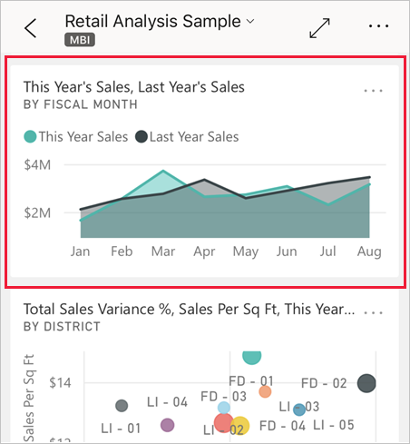

# การเริ่มต้นใช้งานด่วน: แดชบอร์ดและรายงานในแอป Power BI สำหรับอุปกรณ์เคลื่อนที่
ในการเริ่มต้นใช้งานด่วนนี้ คุณสำรวจแดชบอร์ดและรายงานตัวอย่างได้ในแอป Power BI สำหรับอุปกรณ์เคลื่อนที่บนโทรศัพท์ Android นอกจากนี้ คุณสามารถทำตามขั้นตอนในแอปสำหรับอุปกรณ์เคลื่อนอื่น ๆ ได้ 

นำไปใช้กับ:

|  |  |  |  |
|:--- |:--- |:--- |:--- |
| iPhone | iPad | Android | Windows 10 |

แดชบอร์ดเป็นพอร์ทัลสำหรับวงจรชีวิตและกระบวนการของบริษัทของคุณ แดชบอร์ดคือภาพรวมหรือสถานที่เดียวที่สามารถตรวจสอบสถานะปัจจุบันของธุรกิจได้ รายงาน คือ มุมมองแบบโต้ตอบของข้อมูลของคุณที่มีการแสดงผลด้วยภาพที่แสดงการค้นพบและข้อมูลเชิงลึกแตกต่างจากข้อมูลนั้น 

## ข้อกำหนดเบื้องต้น

### ลงทะเบียนใช้งาน Power BI
ถ้าคุณไม่ได้ลงทะเบียน Power BI ให้[ลงทะเบียนรุ่นทดลองใช้ฟรี](https://app.powerbi.com/signupredirect?pbi_source=web)ก่อนที่คุณจะเริ่มต้นใช้งาน

### ติดตั้ง Power BI สำหรับแอป Android
[ดาวน์โหลด Power BI สำหรับแอป Android](http://go.microsoft.com/fwlink/?LinkID=544867)จาก Google Play

Power BI ทำงานบนอุปกรณ์ Android ที่ใช้ระบบปฏิบัติการ Android 5.0 หรือใหม่กว่า เพื่อตรวจสอบอุปกรณ์ของคุณ ไปที่**การตั้งค่า** > **เกี่ยวกับ** > **เวอร์ชันของ Android**

### ดาวน์โหลดตัวอย่างการวิเคราะห์ร้านค้าปลีก
ขั้นตอนแรกในการเริ่มต้นใช้งานด่วน คือ การดาวน์โหลดตัวอย่างการวิเคราะห์การค้าปลีกทางการขายในบริการของ Power BI

1. เปิดบริการ Power BI ในเบราว์เซอร์ของคุณ (app.powerbi.com) และลงชื่อเข้าใช้

1. เลือกที่ไอคอนนำทางส่วนกลาง เพื่อเปิดการนำทางด้านซ้าย

    

2. ในบานหน้าต่างนำทางด้านซ้าย เลือก **พื้นที่ทำงาน** > **พื้นที่ทำงานของฉัน**

    

3. ที่มุมล่างซ้าย เลือก**รับข้อมูล**
   
    

3. บนหน้า รับข้อมูล เลือกไอคอน**ตัวอย่าง**
   
   

4. เลือก**ตัวอย่างการวิเคราะห์ร้านค้าปลีก**
 
    
 
8. เลือก **เชื่อมต่อ**  
  
   
   
5. Power BI นำเข้าตัวอย่าง เพิ่มแดชบอร์ดใหม่ รายงาน และชุดข้อมูลลงในพื้นที่ทำงานของฉัน
   
   

ตอนนี้คุณก็พร้อมที่จะดูตัวอย่างบนอุปกรณ์ Android ของคุณแล้ว

## ดูแดชบอร์ดบนอุปกรณ์ Android ของคุณ
1. บนอุปกรณ์ Android ของคุณ เปิดแอป Power BI แล้วลงชื่อเข้าใช้ด้วยข้อมูลประจำตัวของบัญชีผู้ใช้ Power BI เดียวกันกับที่คุณใช้ในบริการ Power BI ในเบราว์เซอร์

1.  แตะปุ่มการนำทางส่วนกลาง .

2.  แตะ**พื้นที่ทำงาน** > **พื้นที่ทำงานของฉัน**

    

3. แตะที่แดชบอร์ดตัวอย่างการวิเคราะห์ร้านค้าปลีกเพื่อเปิดขึ้น
 
    
   
    สัญกรณ์ที่ด้านล่างของชื่อแดชบอร์ด (ในกรณีนี้คือตัวอักษร "C") แสดงวิธีการจัดประเภทข้อมูลในแต่ละแดชบอร์ด อ่านเพิ่มเติมเกี่ยวกับ[การจัดประเภทข้อมูลใน Power BI](../../service-data-classification.md)

    แดชบอร์ด Power BI จะมีลักษณะแตกต่างกันเล็กน้อยบน Android ของคุณ ไทล์ทั้งหมดจะปรากฏในขนาดเท่ากัน และถูกจัดเรียงทีละอันจากบนลงล่าง

4. แตะที่ไอคอนเครื่องหมายดอกจัน  ในแถบชื่อเรื่องเพื่อทำให้แดชบอร์ดของคุณเป็นรายการโปรด

    เมื่อคุณทำรายการโปรดในแอปสำหรับอุปกรณ์เคลื่อนที่เป็นรายการโปรด จะเป็นรายการโปรดในบริการ Power BI และในทางกลับกันด้วย

4. เลื่อนลงแล้วแตะแผนภูมิเส้นทึบ "ยอดขายของปีนี้ ยอดขายของปีที่แล้ว"

    

    ไทล์จะเปิดขึ้นในโหมดโฟกัส

7. ในโหมดโฟกัส แตะ เม.ย.ในแผนภูมิ คุณจะเห็นค่าสำหรับเดือนเมษายนที่ด้านบนของแผนภูมิ

    

8. แตะไอคอนรายงาน  ที่มุมขวาบน รายงานที่เกี่ยวข้องกับไทล์นี้จะเปิดขึ้นในโหมดแนวนอน

    

9. แตะฟองสีเหลือง "Juniors 040 -" ในแผนภูมิฟอง คุณเห็นวิธีการไฮไลท์ค่าที่เกี่ยวข้องในแผนภูมิอื่น ๆ หรือไม่? 

    

10. ปัดขึ้นเพื่อดูแถบเครื่องมือที่ด้านล่างและแตะไอคอนรูปดินสอ

    

11. แตะไอคอนหน้ายิ้มในแถบเครื่องมือใส่คำอธิบายประกอบ และเพิ่มบางหน้ายิ้มไปยังหน้ารายงานของคุณ
 
    

12. แตะ**แชร์**ที่มุมบนขวา

1. กรอกข้อมูลอีเมลของของพวกเขาและเพิ่มข้อความ ถ้าคุณต้องการ  

    

    คุณสามาราถแชร์สแนปช็อตนี้กับใครก็ได้ ทั้งภายในและภายนอกองค์กรของคุณ หาผู้คนที่คุณแชร์อยู่ในองค์กรของคุณและมีบัญชี Power BI เป็นของตนเอง บุคคลเหล่านี้จะสามารถเปิดรายงานตัวอย่างการวิเคราะห์ร้านค้าปลีกได้ด้วยเช่นกัน

## เพิ่มพื้นที่ทรัพยากร

หลังจากที่คุณเสร็จการเริ่มต้นด่วนนี้ คุณสามารถลบแดชบอร์ด, รายงาน และชุดข้อมูลตัวอย่างการวิเคราะห์ด้านการขายปลีก ถ้าคุณต้องการ

1. เปิดบริการ Power BI (app.powerbi.com) และลงชื่อเข้าสู่ระบบ

2. ในบานหน้าต่างนำทางด้านซ้าย เลือก**พื้นที่ทำงาน** > **พื้นที่ทำงานของฉัน**

    คุณสังเกตเห็นดาวสีเหลืองที่ระบุว่าเป็นรายการโปรดหรือไม่?

3. บนแท็บ**แดชบอร์ด** เลือกไอคอนถังขยะ**ลบ**ถัดจากแดชบอร์ดการวิเคราะห์ร้านค้าปลีก

    

4. เลือกแท็บ**รายงาน** และทำขั้นตอนเดียวกันนี้สำหรับรายงานการวิเคราะห์ร้านค้าปลีก

5. เลือกแท็บ**ชุดข้อมูล** และทำสิ่งเดียวกันสำหรับชุดข้อมูลการวิเคราะห์ด้านการขายปลีก

## ขั้นตอนถัดไป

ในการเริ่มต้นใช้งานด่วนนี้ คุณสำรวจแดชบอร์ดและรายงานตัวอย่างได้ในอุปกรณ์ Android ของคุณ อ่านเพิ่มเติมเกี่ยวกับการทำงานในบริการ Power BI 

> [!div class="nextstepaction"]
> [เริ่มต้นใช้งานด่วน - ทำความรู้จักบริการของ Power BI](../end-user-experience.md)

