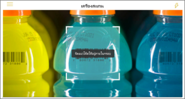
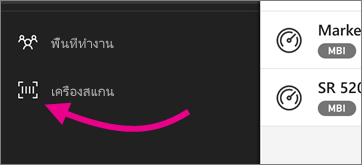

# สแกนบาร์โค้ดด้วย iPhone ของคุณจากแอป Power BI สำหรับอุปกรณ์เคลื่อนที่
สแกนบาร์โค้ดในโลกแห่งความจริงเพื่อไปยังข้อมูล BI ที่ถูกกรองโดยตรงในแอป Power BI สำหรับอุปกรณ์เคลื่อนที่

บอกเพื่อนร่วมงานที่ถูก[แท็กเขตข้อมูลบาร์โค้ดในรายงาน Power BI Desktop](../../desktop-mobile-barcodes.md)และแชร์รายงานกับคุณ 

เมื่อคุณสามารถสแกนบาร์โค้ดผลิตภัณฑด้วยตัวสแกนในแอป Power BI บน iPhone ของคุณ คุณจะเห็นรายงาน (หรือรายการของรายงาน) ด้วยบาร์โค้ดนั้น คุณสามารถเปิดรายงานนั้นบน iPhone ของคุณ ซึ่งถูกกรองไปยังบาร์โค้ดนั้น

## สแกนบาร์โค้ดด้วยตัวสแกน Power BI
1. ในแอป Power BI สำหรับอุปกรณ์เคลื่อนที่จะเปิดเมนูการนำทางหลักด้านบนซ้าย 
2. เลื่อนลงไปยัง**ตัวสแกน**และเลือก 
   
    
3. ถ้ากล้องของคุณไม่ได้เปิดใช้งาน คุณจำเป็นต้องอนุมัติให้แอป Power BI ใช้กล้อง นี่เป็นการอนุมัติครั้งเดียว 
4. เล็งตัวสแกนไปที่บาร์โค้ดบนผลิตภัณฑ์ 
   
    คุณจะเห็นรายการของรายงานที่เชื่อมโยงกับบาร์โค้ดนั้น
5. แตะชื่อรายงานเพื่อเปิดบน iPhone ของคุณ ซึ่งถูกกรองโดยอัตโนมัติไปยังบาร์โค้ดนั้น

## กรองด้วยบาร์โค้ดอื่นๆ ในขณะอยู่ในรายงาน
ในขณะที่กำลังดูรายงานที่ถูกกรองด้วยบาร์โค้ดบน iPhone ของคุณ คุณอาจต้องการกรองรายงานเดียวกันด้วยบาร์โค้ดที่แตกต่างกัน

* ถ้าไอคอนบาร์โค้ดมีตัวกรองตัวกรองจะใช้งานอยู่ และรายงานจะถูกกรองด้วยบาร์โค้ดแล้ว 
* ถ้าไอคอนไม่มีตัวกรองอยู่ตัวกรองจะไม่ได้ใช้งานอยู่ และรายงานจะไม่ถูกกรองด้วยบาร์โค้ด 

ไม่ว่าวิธีใด ให้แตะไอคอนเพื่อเปิดเมนูขนาดเล็กที่มีตัวสแกนแบบลอยตัวอยู่

* โฟกัสตัวสแกนบนรายการใหม่เพื่อเปลี่ยนตัวกรองของรายงานเป็นค่าบาร์โค้ดที่แตกต่างกัน 
* เลือก**ล้างตัวกรองบาร์โค้ด**เพื่อกลับไปยังรายงานที่ไม่ถูกกรอง
* เลือก**กรองด้วยบาร์โค้ดล่าสุด**เพื่อเปลี่ยนตัวกรองรายงานเป็นหนึ่งในบาร์โค้ดที่คุณได้สแกนไปภายในเซสชันปัจจุบัน

## ปัญหาเกี่ยวกับการสแกนบาร์โค้ด
ต่อไปนี้เป็นข้อความบางอย่างที่คุณอาจเห็นเมื่อคุณสแกนบาร์โค้ดบนผลิตภัณฑ์

### “ไม่สามารถกรองรายงานได้...”
รายงานที่คุณเลือกที่จะกรองจะยึดตามรูปแบบข้อมูลที่ไม่ได้รวมค่าบาร์โค้ดนี้ ตัวอย่างเช่น ผลิตภัณฑ์ “น้ำแร่” ไม่ได้รวมอยู่ในรายงาน  

### ทั้งหมด/บางรายการของภาพในรายงานไม่ประกอบด้วยค่าใดๆ
ค่าบาร์โค้ดที่คุณสแกนที่อยู่ในรูปแบบของคุณ แต่ทั้งหมด/บางรายการของภาพบนรายงานของคุณไม่ประกอบด้วยค่านี้ และดังนั้นการกรองจะคืนค่าสถานะว่าง ลองค้นหาหน้ารายงานอื่นๆ หรือแก้ไขรายงานของคุณใน Power BI Desktop ให้ประกอบด้วยค่านี้ 

### “ดูเหมือนว่าคุณไม่มีรายงานใดๆ ที่สามารถกรองได้ด้วยบาร์โค้ด”
ซึ่งหมายความว่า คุณไม่มีรายงานใดๆ ที่เปิดใช้งานบาร์โค้ด ตัวสแกนบาร์โค้ดสามารถกรองรายงานที่มีคอลัมน์ที่ทำเครื่องหมายเป็น**บาร์โค้ด**ได้เท่านั้น  

ตรวจสอบให้แน่ใจว่าคุณ หรือเจ้าของรายงานได้แท็กคอลัมน์เป็น**บาร์โค้ด**ใน Power BI Desktop เรียนรู้เพิ่มเติมเกี่ยวกับ[การแท็กเขตข้อมูลบาร์โค้ดใน Power BI Desktop](../../desktop-mobile-barcodes.md)

### "ไม่สามารถกรองรายงานได้ - ดูเหมือนว่าจะไม่มีบาร์โค้ดนี้อยู่ในข้อมูลรายงาน"
รายงานที่คุณเลือกที่จะกรองจะยึดตามรูปแบบข้อมูลที่ไม่ได้รวมค่าบาร์โค้ดนี้ ตัวอย่างเช่น ผลิตภัณฑ์ “น้ำแร่” ไม่ได้รวมอยู่ในรายงาน คุณสามารถสแกนผลิตภัณฑ์ต่างๆ เลือกรายงานที่แตกต่างกัน (ถ้ามีรายงานพร้อมใช้งานมากกว่าหนึ่ง) หรือดูรายงานที่ยังไม่ได้กรองได้ 

## ขั้นตอนถัดไป
* [แท็กเขตข้อมูลบาร์โค้ดใน Power BI Desktop](../../desktop-mobile-barcodes.md)
* [ไทล์แดชบอร์ดใน Power BI](../../service-dashboard-tiles.md)
* [แดชบอร์ดใน Power BI](../../service-dashboards.md)

