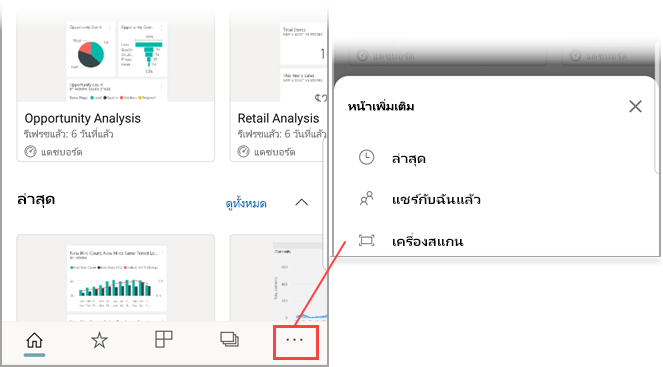

# สแกนบาร์โค้ดด้วยอุปกรณ์ของคุณจากแอป Power BI สำหรับอุปกรณ์เคลื่อนที่
สแกนบาร์โค้ดในโลกแห่งความจริงเพื่อไปยังข้อมูล BI ที่ถูกกรองโดยตรงในแอป Power BI สำหรับอุปกรณ์เคลื่อนที่

นำไปใช้กับ:

|  |  |  |  |
|:--- |:--- |:--- |:--- |
|iPhone |iPad |โทรศัพท์ Android |แท็บเล็ต Android |

บอกเพื่อนร่วมงานที่ถูก[แท็กเขตข้อมูลบาร์โค้ดในรายงาน Power BI Desktop](../../transform-model/desktop-mobile-barcodes.md)และแชร์รายงานกับคุณ 

เมื่อคุณสามารถสแกนบาร์โค้ดผลิตภัณฑด้วยตัวสแกนในแอป Power BI บนอุปกรณ์ของคุณ คุณจะเห็นรายงาน (หรือรายการของรายงาน) ด้วยบาร์โค้ดนั้น คุณสามารถเปิดรายงานนั้นซึ่งถูกกรองไปยังบาร์โค้ดนั้น

## สแกนบาร์โค้ดด้วยตัวสแกน Power BI
1. ที่แถบนำทาง แตะที่ **ตัวเลือกเพิ่มเติม** (...) และแตะที่ **สแกนเนอร์**

    

2. ถ้ากล้องของคุณไม่ได้เปิดใช้งาน คุณจำเป็นต้องอนุมัติให้แอป Power BI ใช้กล้อง นี่เป็นการอนุมัติครั้งเดียว 
4. เล็งตัวสแกนไปที่บาร์โค้ดบนผลิตภัณฑ์ คุณจะเห็นรายชื่อรายงานที่เชื่อมโยงกับบาร์โค้ดนั้น
5. แตะที่ชื่อรายงานเพื่อเปิดบนอุปกรณ์ของคุณ ซึ่งจะถูกกรองโดยอัตโนมัติไปยังบาร์โค้ดนั้น

## กรองด้วยบาร์โค้ดอื่นๆ ในขณะอยู่ในรายงาน
ในขณะที่กำลังดูรายงานที่ถูกกรองด้วยบาร์โค้ดบนอุปกรณ์ของคุณ คุณอาจต้องการกรองรายงานเดียวกันด้วยบาร์โค้ดที่แตกต่างกัน

* หากไอคอนบาร์โค้ดมีตัวกรอง ตัวกรองเปิดทำงานอยู่และรายงานถูกกรองด้วยบาร์โค้ดแล้ว 
* หากไอคอนไม่มีตัวกรอง ตัวกรองจะไม่เปิดทำงานและรายงานไม่ถูกกรองด้วยบาร์โค้ด 

ไม่ว่าวิธีใด ให้แตะไอคอนเพื่อเปิดเมนูขนาดเล็กที่มีตัวสแกนแบบลอยตัวอยู่

* โฟกัสตัวสแกนบนรายการใหม่เพื่อเปลี่ยนตัวกรองของรายงานเป็นค่าบาร์โค้ดที่แตกต่างกัน 
* เลือก**ล้างตัวกรองบาร์โค้ด**เพื่อกลับไปยังรายงานที่ไม่ถูกกรอง
* เลือก**กรองด้วยบาร์โค้ดล่าสุด**เพื่อเปลี่ยนตัวกรองรายงานเป็นหนึ่งในบาร์โค้ดที่คุณได้สแกนไปภายในเซสชันปัจจุบัน

## ปัญหาเกี่ยวกับการสแกนบาร์โค้ด
ต่อไปนี้เป็นข้อความบางอย่างที่คุณอาจเห็นเมื่อคุณสแกนบาร์โค้ดบนผลิตภัณฑ์

### “ไม่สามารถกรองรายงานได้...”
รายงานที่คุณเลือกที่จะกรองจะยึดตามรูปแบบข้อมูลที่ไม่ได้รวมค่าบาร์โค้ดนี้ ตัวอย่างเช่น ผลิตภัณฑ์ “น้ำแร่” ไม่ได้รวมอยู่ในรายงาน  

### รายการของภาพทั้งหมด/บางรายการในรายงานไม่มีค่าใด ๆ อยู่
ค่าบาร์โค้ดที่คุณสแกนมีอยู่ในแบบจำลองของคุณ แต่รายการของภาพทั้งหมด/บางรายการในรายงานไม่มีค่าใด ๆ อยู่ ดังนั้นการกรองจะแสดงสถานะเป็นว่าง ลองค้นหาหน้ารายงานอื่นๆ หรือแก้ไขรายงานของคุณใน Power BI Desktop ให้ประกอบด้วยค่านี้ 

### “ดูเหมือนว่าคุณไม่มีรายงานใด ๆ ที่สามารถใช้บาร์โค้ดกรองได้”
ซึ่งหมายความว่า คุณไม่มีรายงานใดๆ ที่เปิดใช้งานบาร์โค้ด ตัวสแกนบาร์โค้ดสามารถกรองรายงานที่มีคอลัมน์ที่ทำเครื่องหมายเป็น**บาร์โค้ด**ได้เท่านั้น  

ตรวจสอบให้แน่ใจว่าคุณ หรือเจ้าของรายงานได้แท็กคอลัมน์เป็น**บาร์โค้ด**ใน Power BI Desktop เรียนรู้เพิ่มเติมเกี่ยวกับ[การแท็กเขตข้อมูลบาร์โค้ดใน Power BI Desktop](../../transform-model/desktop-mobile-barcodes.md)

### "ไม่สามารถกรองรายงานได้ ดูเหมือนว่าจะไม่มีบาร์โค้ดนี้อยู่ในข้อมูลรายงาน"
รายงานที่คุณเลือกที่จะกรองจะยึดตามรูปแบบข้อมูลที่ไม่ได้รวมค่าบาร์โค้ดนี้ ตัวอย่างเช่น ผลิตภัณฑ์ “น้ำแร่” ไม่ได้รวมอยู่ในรายงาน คุณสามารถสแกนผลิตภัณฑ์ต่างๆ เลือกรายงานที่แตกต่างกัน (ถ้ามีรายงานพร้อมใช้งานมากกว่าหนึ่ง) หรือดูรายงานที่ยังไม่ได้กรองได้ 

## ขั้นตอนถัดไป
* [แท็กเขตข้อมูลบาร์โค้ดใน Power BI Desktop](../../transform-model/desktop-mobile-barcodes.md)
* [ไทล์แดชบอร์ดใน Power BI](../end-user-tiles.md)
* [แดชบอร์ดใน Power BI](../end-user-dashboards.md)
