# ดูแดชบอร์ดและรายงานในแอป Power BI สำหรับอุปกรณ์เคลื่อนที่
นำไปใช้กับ:

|  |  |  |  | 
|:--- |:--- |:--- |:--- |:--- |
| [iPhone](mobile-apps-view-dashboard.md#view-dashboards-on-your-iphone) |[iPads](mobile-apps-view-dashboard.md#view-dashboards-on-your-ipad) |[โทรศัพท์ android](mobile-apps-view-dashboard.md#view-dashboards-on-your-android-phone) |[แท็บเล็ต android](mobile-apps-view-dashboard.md#view-dashboards-on-your-android-tablet) |

แดชบอร์ดเป็นพอร์ทัลสำหรับวงจรชีวิตและกระบวนการของบริษัทของคุณ แดชบอร์ดคือภาพรวมหรือสถานที่เดียวที่สามารถตรวจสอบสถานะปัจจุบันของธุรกิจได้

## สร้างแดชบอร์ดในบริการของ Power BI (https://powerbi.com)
**คุณไม่สร้างแดชบอร์ดในแอปสำหรับอุปกรณ์เคลื่อนที่** 

เมื่อต้องการดูแดชบอร์ดและรายงานบนอุปกรณ์เคลื่อนที่ของคุณ คุณจำเป็นต้องสร้างหรือเชื่อมต่อกับรายการเหล่านั้นในเว็บเบราว์เซอร์ 

1. ไปยังบริการของ Power BI ([https://www.powerbi.com](https://www.powerbi.com)) และ[ลงทะเบียนสำหรับบัญชีผู้ใช้](../../service-self-service-signup-for-power-bi.md)
2. [สร้างแดชบอร์ดและรายงาน Power BI ของคุณเอง](../../service-get-started.md) หรือเชื่อมต่อกับ[แอป Power BI](../../service-connect-to-services.md) ที่มีอยู่สำหรับบริการที่หลากหลาย เช่น [Microsoft Dynamics CRM](../../service-connect-to-microsoft-dynamics-crm.md) และ [Adobe Analytics](../../service-connect-to-adobe-analytics.md)

ที่นี่ คุณสามารถเปิดแดชบอร์ดในบริการของ Power BI

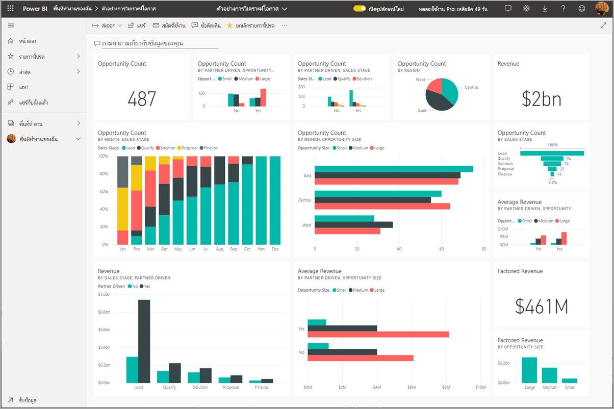

## ดูแดชบอร์ดบน iPhone ของคุณ
1. เปิดแอป Power BI บน iPhone ของคุณ และลงชื่อเข้าใช้
   
   ต้องการ[ดาวน์โหลดแอป iPhone](http://go.microsoft.com/fwlink/?LinkId=522062) จาก Apple App Store หรือไม่
2. แตะแดชบอร์ดเพื่อเปิด  
   
    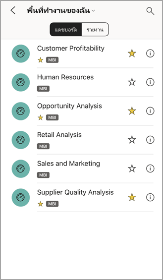
   
   * ดาวสีเหลือง  แสดงแดชบอร์ดที่เป็นรายการโปรด 
   * เครื่องหมายด้านล่างแต่ละชื่อของแดชบอร์ด (ในกรณีนี้ คือ "MBI") แสดงวิธีการจัดประเภทข้อมูลในแต่ละแดชบอร์ด อ่านเพิ่มเติมเกี่ยวกับ[การจัดประเภทข้อมูลใน Power BI](../../service-data-classification.md)
   
   ตามค่าเริ่มต้น แดชบอร์ด Power BI จะมีลักษณะแตกต่างกันเล็กน้อยบน iPhone ของคุณ ไทล์ทั้งหมดจะปรากฏในขนาดเท่ากัน และถูกจัดเรียงทีละอันจากบนลงล่าง
   
    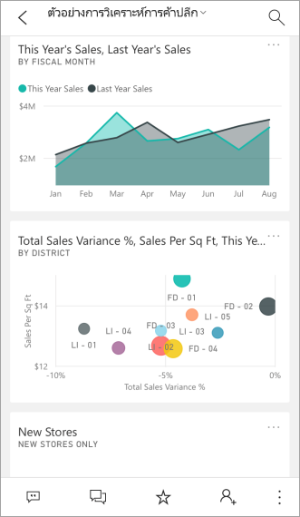
   
   > [!TIP]
   > ถ้าคุณเป็นเจ้าของแดชบอร์ด ในบริการของ Power BI คุณจะสามารถ[สร้างมุมมองแดชบอร์ดสำหรับโทรศัพท์](../../service-create-dashboard-mobile-phone-view.md)ในโหมดแนวตั้งได้ 
   > 
   > 
   
    หรือเพียงแค่หมุนโทรศัพท์ของคุณมาด้านข้างเพื่อดูแดชบอร์ดในโหมดแนวนอนบนโทรศัพท์
   
    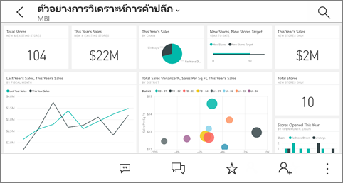
3. ปัดขึ้นหรือลงเพื่อดูไทล์ทั้งหมดในแดชบอร์ด คุณสามารถ:
   
   * [แตะไทล์](mobile-tiles-in-the-mobile-apps.md)เพื่อเปิดในโหมดโฟกัส และโต้ตอบกับข้อมูล
   * แตะรูปดาวเมื่อต้องการ[ทำให้เป็นรายการโปรด](mobile-apps-favorites.md)
   * แตะ**เชิญ** เพื่อ[เชิญเพื่อนร่วมงาน](mobile-share-dashboard-from-the-mobile-apps.md)ดูแดชบอร์ดของคุณ
   * [ซิงค์แดชบอร์ดกับ Apple Watch ของคุณ](mobile-apple-watch.md)
4. เมื่อต้องการกลับไปยังรายการของแดชบอร์ด แตะลูกศรที่อยู่ถัดจากชื่อแดชบอร์ด จากนั้นแตะ**พื้นที่ทำงานของฉัน**
   
   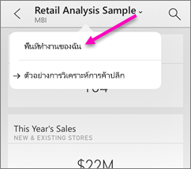

### มองแดชบอร์ดในโหมดแนวนอนใน iPhone ของคุณ
เพียงแค่หมุนโทรศัพท์ของคุณมาด้านข้างเพื่อดูแดชบอร์ดในโหมดแนวนอนบนโทรศัพท์ของคุณ การจัดหน้าของแดชบอร์ดจะเปลี่ยนแปลงจากชุดของไทลเป็นภาพแดชบอร์ดทั้ง&#151;คุณจะเห็นไทล์ทั้งหมดของแดชบอร์ดเหมือนกับที่ไทล์เหล่านี้อยู่ในบริการของ Power BI

คุณสามารถใช้รูปแบบการสัมผัส "หุบนิ้ว" เมื่อต้องขยายและย่อบนพื้นที่ต่างๆ ของแดชบอร์ดของคุณ เลื่อนเพื่อนำทางนั้น และคุณยังคงสามารถ[แตะไทล์](mobile-tiles-in-the-mobile-apps.md)เพื่อเปิดไทล์ในโหมดโฟกัส และโต้ตอบกับข้อมูลของคุณ

## ดูแดชบอร์ดบน iPad ของคุณ
1. เปิดแอป Power BI
   
   ต้องการ[ดาวน์โหลดแอป iPad](http://go.microsoft.com/fwlink/?LinkId=522062) จาก Apple App Store ก่อนหรือไม่
2. แตะ**แดชบอร์ด**ด้านบนของแอป  
   
   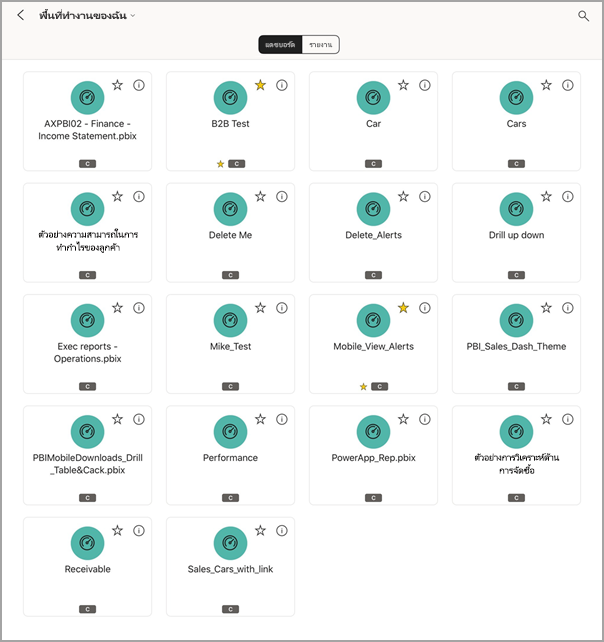
   
   * ดาวสีเหลือง  แสดงแดชบอร์ดที่เป็นรายการโปรด 
   * เครื่องหมายด้านล่างแต่ละชื่อของแดชบอร์ด (ในกรณีนี้ คือ "MBI") แสดงวิธีการจัดประเภทข้อมูลในแต่ละแดชบอร์ด อ่านเพิ่มเติมเกี่ยวกับ[การจัดประเภทข้อมูลใน Power BI](../../service-data-classification.md)
3. คุณสามารถแชร์แดชบอร์ดจากพื้นที่ทำงานของคุณ แตะจุดไข่ปลา ( **...** ) ที่มุมขวาล่างของไทล์แดชบอร์ด และ แตะ**เชิญบุคคลอื่น**
   
   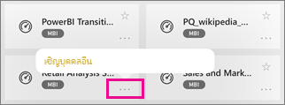
4. คุณยังสามารถแตะแดชบอร์ดเพื่อเปิด และดูไทล์ในแดชบอร์ดนั้น ขณะที่อยู่บนแดชบอร์ด คุณสามารถโต้ตอบกับแดชบอร์ดได้ดังนี้:
   
   * [แตะไทล์เพื่อโต้ตอบ](mobile-tiles-in-the-mobile-apps.md)กับไทล์
   * [เปิดรายงาน](mobile-reports-in-the-mobile-apps.md)เบื้องหลังไทล์
   * [เชิญบุคคลอื่นเพื่อดูแดชบอร์ด](mobile-share-dashboard-from-the-mobile-apps.md)
   * [ใส่คำอธิบายประกอบ และแชร์สแนปช็อต](mobile-annotate-and-share-a-tile-from-the-mobile-apps.md)ของไทล์
5. เมื่อต้องการย้อนกลับไปยังพื้นที่ทำงานของฉัน แตะชื่อของแดชบอร์ดในมุมบนซ้าย จากนั้นแตะ**พื้นที่ทำงานของฉันMy Workspace**
   
   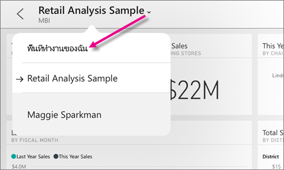

## ดูแดชบอร์ดบนโทรศัพท์ Android ของคุณ
1. เปิดแอป Power BI บน Android ของคุณ และลงชื่อเข้าใช้
   
   ต้องการ[ดาวน์โหลดแอป Android](http://go.microsoft.com/fwlink/?LinkID=544867) ก่อนหรือไม่
2. แตะแดชบอร์ดเพื่อเปิด   
   
   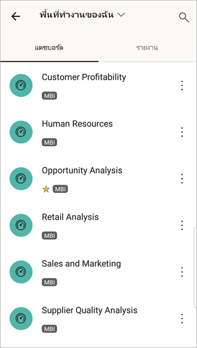

    ดาวสีเหลือง  แสดงแดชบอร์ดที่เป็นรายการโปรด 

    เครื่องหมายด้านล่างแต่ละชื่อของแดชบอร์ด (ในกรณีนี้ "MBI") แสดงวิธีการจัดประเภทข้อมูลในแต่ละแดชบอร์ด อ่านเพิ่มเติมเกี่ยวกับ[การจัดประเภทข้อมูลใน Power BI](../../service-data-classification.md)

    แดชบอร์ด Power BI จะมีลักษณะแตกต่างกันเล็กน้อยบน Android ของคุณ ไทล์ทั้งหมดจะปรากฏในขนาดเท่ากัน และถูกจัดเรียงทีละอันจากบนลงล่าง

    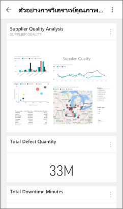

    ถ้าคุณเป็นเจ้าของแดชบอร์ด ในบริการของ Power BI คุณจะสามารถ[สร้างมุมมองแดชบอร์ดสำหรับโทรศัพท์](../../service-create-dashboard-mobile-phone-view.md)ในโหมดแนวตั้งได้ 

1. ในขณะที่อยู่บนแดชบอร์ด คุณสามารถแตะจุดไข่ปลาแนวตั้ง (...) ถัดจากชื่อที่ใช้เชิญเพื่อนร่วมงาน รีเฟรช หรือรับข้อมูลเกี่ยวกับแดชบอร์ด:
   
   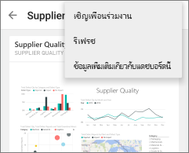
2. ปัดขึ้นหรือลงเพื่อดู[ไทล์ทั้งหมดในแดชบอร์ด](mobile-tiles-in-the-mobile-apps.md) 
3. เมื่อต้องการย้อนกลับไปยังหน้าแรกของแดชบอร์ด แตะชื่อแดชบอร์ดเพื่อเปิดบันทึกการแสดงเส้นทาง จากนั้นแตะ**พื้นที่ทำงานของฉัน**   

## ดูแดชบอร์ดบนแท็บเล็ต์ Android ของคุณ
1. เปิดแอป Power BI บนแท็บเบล็ต Android ของคุณ และลงชื่อเข้าใช้
   
   ต้องการ[ดาวน์โหลดแอป Android](http://go.microsoft.com/fwlink/?LinkID=544867) ก่อนหรือไม่
2. แตะแดชบอร์ดเพื่อเปิด   
   
   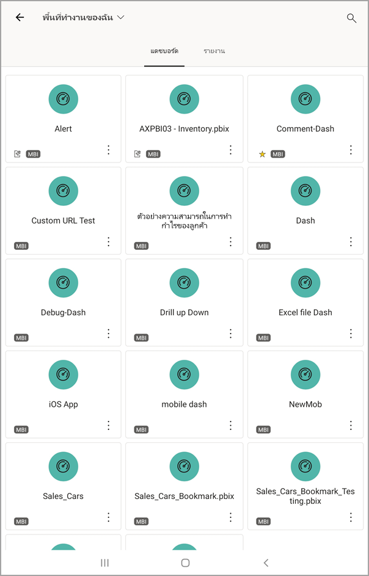
   
   * ดาวสีเหลือง  แสดงแดชบอร์ดที่เป็นรายการโปรด 
   * เครื่องหมายด้านล่างแต่ละชื่อของแดชบอร์ด (ในกรณีนี้ คือ "MBI") แสดงวิธีการจัดประเภทข้อมูลในแต่ละแดชบอร์ด อ่านเพิ่มเติมเกี่ยวกับ[การจัดประเภทข้อมูลใน Power BI](../../service-data-classification.md)
3. ในขณะที่อยู่บนแดชบอร์ด คุณสามารถแตะจุดไข่ปลาแนวตั้ง (...) ถัดจากชื่อที่ใช้เชิญเพื่อนร่วมงาน รีเฟรช หรือรับข้อมูลเกี่ยวกับแดชบอร์ด:
   
   
4. ปัดขึ้นหรือลงเพื่อดู[ไทล์ทั้งหมดในแดชบอร์ด](mobile-tiles-in-the-mobile-apps.md) 
   
   คุณสามารถใช้รูปแบบการสัมผัส "หุบนิ้ว" เมื่อต้องขยายและย่อบนพื้นที่ต่างๆ ของแดชบอร์ดของคุณ เลื่อนเพื่อนำทางนั้น และคุณยังคงสามารถ[แตะไทล์](mobile-tiles-in-the-mobile-apps.md)เพื่อเปิดไทล์ในโหมดโฟกัส และโต้ตอบกับข้อมูลของคุณ
5. เมื่อต้องการย้อนกลับไปยังหน้าแรกของแดชบอร์ด แตะชื่อแดชบอร์ดเพื่อเปิดบันทึกการแสดงเส้นทาง จากนั้นแตะ**พื้นที่ทำงานของฉัน**
   
    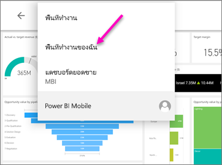

    คุณสามารถใช้รูปแบบการสัมผัส "หุบนิ้ว" เมื่อต้องขยายและย่อบนพื้นที่ต่างๆ ของแดชบอร์ดของคุณ เลื่อนเพื่อนำทางนั้น และคุณยังคงสามารถ[แตะไทล์](mobile-tiles-in-the-mobile-apps.md)เพื่อเปิดไทล์ในโหมดโฟกัส และโต้ตอบกับข้อมูลของคุณ

## สร้างมุมมองแดชบอร์ดสำหรับโทรศัพท์ในบริการของ Power BI
ถ้าคุณเป็นเจ้าของแดชบอร์ด ในบริการของ *Power BI คุณจะสามารถสร้างมุมมองแดชบอร์ดสำหรับโทรศัพท์*ในโหมดแนวตั้งได้ 

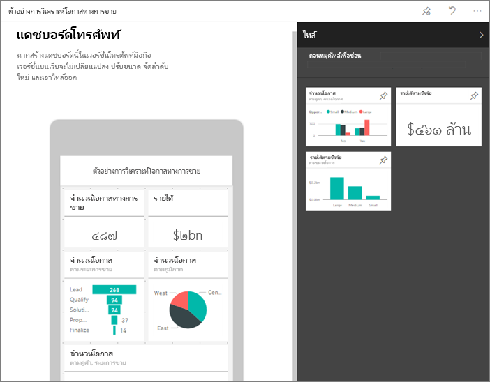

อ่านเพิ่มเติมเกี่ยวกับ[สร้างมุมมองแดชบอร์ด](../../service-create-dashboard-mobile-phone-view.md)สำหรับโทรศัพท์

## ขั้นตอนถัดไป
* [ดาวน์โหลดแอป Android](http://go.microsoft.com/fwlink/?LinkID=544867)จาก Google play  
* [เริ่มต้นใช้งานแอป Android สำหรับ Power BI](mobile-android-app-get-started.md)  
* [Power BI คืออะไร](../../power-bi-overview.md)
* มีคำถามหรือไม่ [ลองถามชุมชน Power BI](http://community.powerbi.com/)

