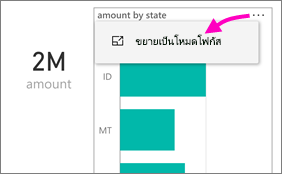
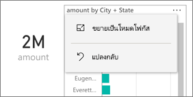
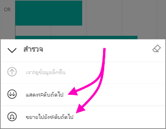
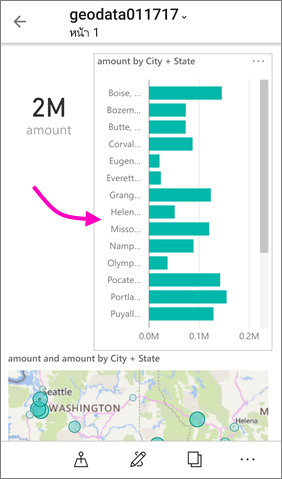

# ดูรายงาน Power BI ที่ปรับให้เหมาะสมกับมือถือของคุณ

นำไปใช้กับ:

|  |  |
|:--- |:--- |
| iPhones |โทรศัพท์ Android |

เมื่อคุณสร้างรายงาน Power BI ใน Power BI Desktop หรือในบริการของ Power BI คุณยังสามารถ[สร้างเวอร์ชันของรายงานที่ปรับให้เหมาะสมสำหรับการดู](../../desktop-create-phone-report.md) ในแอป Power BI บนโทรศัพท์ได้อีกด้วย

แล้วเมื่อคุณเปิดรายงาน Power BI บนมือถือ Power BI ตรวจว่ามีรายงานที่ปรับให้เหมาะสมสำหรับมือถือหรือไม่ และเปิดรายงานนั้นโดยอัตโนมัติในมุมมองแนวตั้ง

ถ้าไม่มีรายงานที่ปรับให้เหมาะสมกับมือถือ รายงานยังคงเปิด แต่ในมุมมองแนวนอนที่ไม่ได้ปรับให้เหมาะสม แม้ว่าในรายงานปรับให้เหมาะสมกับมือถือ ถ้าคุณหมุนมือถือของคุณมาเป็นแนวนอน รายงานจะเปิดขึ้นในเค้าโครงเดิม ที่ยังไม่ได้ปรับให้เหมาะสม ถ้ามีเพียงบางหน้าที่ปรับให้เหมาะสม คุณจะเห็นข้อความในมุมมองแนวตั้ง ระบุว่า มีรายงานในแนวนอน

คุณลักษณะทั้งหมดอื่น ๆ ของรายงาน Power BI ยังคงทำงานในรายงานที่ปรับให้เหมาะสมกับมือถือ อ่านเพิ่มเติมเกี่ยวกับสิ่งที่คุณสามารถทำได้ใน:

* [รายงานบน iPhones](mobile-reports-in-the-mobile-apps.md) 
* [รายงานบนมือถือ Android](mobile-reports-in-the-mobile-apps.md)

## กรองหน้ารายงานบนมือถือของคุณ
ถ้ารายงานที่ปรับให้เหมาะสมกับมือถือ มีตัวกรองกำหนดไว้ เมื่อคุณดูรายงานนั้นบนมือถือของคุณ คุณสามารถใช้ตัวกรองเหล่านั้น รายงานเปิดขึ้นบนมือถือของคุณ จะถูกกรองข้อมูลด้วยค่าการกรองในรายงานบนเว็บ และมีข้อความแจ้งว่ามีตัวกรองกำลังใช้งานอยู่บนหน้า คุณสามารถเปลี่ยนตัวกรองบนมือถือของคุณ

1. แตะไอคอนตัวกรอง  ที่ด้านล่างของหน้า 
2. ใช้การกรองพื้นฐานหรือขั้นสูง เพื่อดูผลลัพธ์ที่คุณสนใจ
   
    

## การไฮไลต์เชื่อมโยงวิชวล
การไฮไลต์เชื่อมโยงวิชวลในรายงานบนมือถือ ทำงานแบบเดียวกับในบริการของ Power BI และในรายงานบนมือถือในมุมมองแนวนอน: เมื่อคุณเลือกข้อมูลในวิชวลหนึ่ง จะไฮไลต์ข้อมูลที่เกี่ยวข้องในวิชวลอื่น ๆ บนหน้านั้น

อ่านเพิ่มเติมเกี่ยวกับ[การกรอง และไฮไลต์ใน Power BI](../../power-bi-reports-filters-and-highlighting.md)

## การเลือกวิชวล
ในรายงานมือถือ เมื่อคุณเลือกวิชวล รายงานจะไฮไลต์วิชวลนั้น โฟกัสไปที่วิชวล หยุดรูปแบบการสัมผัสบนพื่นที่ทำงาน

ด้วยวิชวลที่เลือก คุณสามารถทำสิ่งต่าง ๆ เช่น การเลื่อนภายในวิชวล เมื่อต้องการยกเลิกการเลือกวิชวล เพียงแตะที่ใดก็ได้นอกบริเวณวิชวล

## เปิดวิชวลในโหมดโฟกัส
รายงานบนมือถือยังมีโหมดโฟกัส ให้คุณเห็นวิชวลเดียวในขนาดที่ใหญ่ขึ้น เพื่อสำรวจวิชวลและรายงาน

* ในรายงานมือถือ แตะที่จุดไข่ปลา (**...**) ในมุมบนขวาของวิชวล > **ขยายเป็นโหมดโฟกัส**
  
    

สิ่งที่คุณทำในโหมดโฟกัส มีผลต่อพื้นที่รายงานและในทางกลับกัน เพื่อให้มีประสบการณ์การใช้ที่ราบรื่น ตัวอย่างเช่น ถ้าคุณไฮไลต์ค่าในวิชวล จากนั้นกลับไปยังรายงานทั้งหมด รายงานทั้งหมดจะถูกกรองด้วยค่าที่คุณไฮไลต์ในวิชวล

การดำเนินการบางอย่างทำได้เฉพาะโหมดโฟกัส เนื่องจากข้อจำกัดของขนาดหน้าจอ:

* **ดูรายละเอียดแนวลึก** ลงในข้อมูลที่แสดงในวิชวล อ่านเพิ่มเติมเกี่ยวกับ[ดูรายละเอียดแนวลึกและกลับขึ้นไป](mobile-apps-view-phone-report.md#drill-down-in-a-visual)ในรายงานมือถือ ทางด้านล่าง
* **เรียงลำดับ**ค่าในวิชวล
* **แปลงกลับ**: ล้างขั้นตอนที่คุณสำรวจบนวิชวล และแปลงกลับเป็นการตั้งค่าเมื่อรายงานถูกสร้างขึ้น
  
    เมื่อต้องล้างการสำรวจทั้งหมดจากวิชวล แตะที่จุดไข่ปลา (**...** ) > **แปลงกลับ**
  
    
  
    แปลงกลับ มีให้ทั้งระดับรายงาน ที่ล้างการสำรวจทั้งหมดทุกวิชวล และระดับวิชวล ที่ยกเลิกการสำรวจเฉพาะวิชวลที่เลือก   

## การดูรายละเอียดแนวลึกในวิชวล
ถ้ามีกำหนดระดับลำดับชั้นในวิชวล คุณสามารถเจาะลึกในข้อมูลวิชวลที่ละเอียดขึ้น แล้วย้อนกลับขึ้นมาได้ คุณ[เพิ่มการเจาะลึกลงในภาพ](../end-user-drill.md)ในบริการของ Power BI หรือ ใน Power BI Desktop การเจาะรายละเอียดแนวลึก ทำงานเฉพาะในรายงาน Power BI ที่ปรับให้เหมาะสมกับมือถือเท่านั้น เมื่อคุณดูบนมือถือของคุณ 

1. ในรายงานบนมือถือ แตะที่จุดไข่ปลา (**...** ) ในมุมบนขวา > **ขยายเป็นโหมดโฟกัส**
   
    
   
    ในตัวอย่างนี้ แท่ง แสดงค่าของแต่ละรัฐ
2. แตะไอคอนสำรวจ  ด้านล่างซ้าย
   
    
3. แตะ**แสดงระดับถัดไป**หรือ**ขยายไปยังระดับถัดไป**
   
    
   
    ขณะนี้ แท่งแสดงค่าของแต่ละเมือง
   
    
4. ถ้าคุณแตะลูกศรที่มุมบนซ้าย คุณกลับไปรายงานมือถือ ด้วยค่าที่ยังคงขยายไประดับต่ำกว่า
   
    
5. เมื่อต้องการกลับไปที่ระดับเดิม แตะจุดไข่ปลา (**...** ) อีกครั้ง > **แปลงกลับ**
   
    

## ขั้นตอนถัดไป
* [สร้างรายงานที่ปรับให้เหมาะสมสำหรับแอปมือถือ Power BI](../../desktop-create-phone-report.md)
* [สร้างมุมมองโทรศัพท์ของแดชบอร์ดใน Power BI](../../service-create-dashboard-mobile-phone-view.md)
* [สร้างวิชวลแบบตอบสนองที่ปรับให้เหมาะสมกับทุกขนาด](../../visuals/desktop-create-responsive-visuals.md)
* มีคำถามเพิ่มเติมหรือไม่ [ลองถามชุมชน Power BI](http://community.powerbi.com/)

