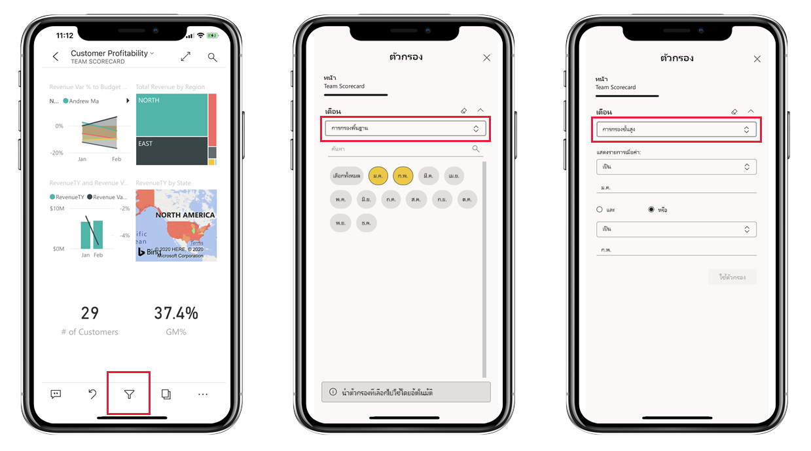

# ดูรายงาน Power BI ที่ปรับให้เหมาะสมกับมือถือของคุณ

นำไปใช้กับ:

|  |  |
|:--- |:--- |
| iPhones |โทรศัพท์ Android |

เมื่อคุณดูรายงาน Power BI บนโทรศัพท์ของคุณ Power BI จะตรวจสอบเพื่อดูว่ามีการปรับรายงานให้เหมาะสมสำหรับโทรศัพท์หรือไม่ ซึ่งหากมี Power BI จะเปิดรายงานที่ปรับให้เหมาะสมแล้วเป็นมุมมองแนวตั้งโดยอัตโนมัติ

ถ้าไม่มีรายงานที่ปรับให้เหมาะสมกับมือถือ รายงานยังคงเปิด แต่ในมุมมองแนวนอนที่ไม่ได้ปรับให้เหมาะสม แม้ว่าในรายงานปรับให้เหมาะสมกับมือถือ ถ้าคุณหมุนมือถือของคุณมาเป็นแนวนอน รายงานจะเปิดขึ้นในเค้าโครงเดิม ที่ยังไม่ได้ปรับให้เหมาะสม ถ้ามีเพียงบางหน้าที่ปรับให้เหมาะสม คุณจะเห็นข้อความในมุมมองแนวตั้ง ระบุว่า มีรายงานในแนวนอน

คุณลักษณะทั้งหมดอื่น ๆ ของรายงาน Power BI ยังคงทำงานในรายงานที่ปรับให้เหมาะสมกับมือถือ อ่านเพิ่มเติมเกี่ยวกับสิ่งที่คุณสามารถทำได้ใน:

* [รายงานบน iPhones](mobile-reports-in-the-mobile-apps.md) 
* [รายงานบนมือถือ Android](mobile-reports-in-the-mobile-apps.md)

## กรองหน้ารายงานบนมือถือของคุณ
ถ้ารายงานที่ปรับให้เหมาะสมกับมือถือ มีตัวกรองกำหนดไว้ เมื่อคุณดูรายงานนั้นบนมือถือของคุณ คุณสามารถใช้ตัวกรองเหล่านั้น ระบบจะเปิดรายงานในมือถือของคุณโดยกรองรายงานตามค่าของรายงานในเว็บ คุณจะเห็นข้อความที่บอกว่า มีตัวกรองที่ใช้งานอยู่บนหน้านั้น คุณสามารถเปลี่ยนตัวกรองบนมือถือของคุณ

1. แตะไอคอนตัวกรอง  ที่ด้านล่างของหน้า

2. ใช้การกรองพื้นฐานหรือขั้นสูง เพื่อดูผลลัพธ์ที่คุณสนใจ
   
    

## การไฮไลต์เชื่อมโยงวิชวล
การไฮไลต์เชื่อมโยงการแสดงผลด้วยภาพในมุมมองแนวตั้งจะทำงานเช่นเดียวกันกับในบริการของ Power BI และบนมือถือในมุมมองแนวนอน: เมื่อคุณเลือกข้อมูลในวิชวลหนึ่ง วิชวลจะเน้นข้อมูลที่เกี่ยวข้องกันในวิชวลอื่นบนหน้านั้น

อ่านเพิ่มเติมเกี่ยวกับ[การกรอง และไฮไลต์ใน Power BI](../../create-reports/power-bi-reports-filters-and-highlighting.md)

## การเลือกวิชวล
ในรายงานมือถือ เมื่อคุณเลือกวิชวล รายงานจะไฮไลต์วิชวลนั้น โฟกัสไปที่วิชวล หยุดรูปแบบการสัมผัสบนพื่นที่ทำงาน

ด้วยวิชวลที่เลือก คุณสามารถทำสิ่งต่าง ๆ เช่น การเลื่อนภายในวิชวล เมื่อต้องการยกเลิกการเลือกวิชวล เพียงแตะที่ใดก็ได้นอกบริเวณวิชวล

## เปิดวิชวลในโหมดโฟกัส
และรายงานบนโทรศัพท์ก็มีโหมดโฟกัสด้วยเช่นกัน: คุณจะมีมุมมองการแสดงผลด้วยภาพเดี่ยวที่ใหญ่ขึ้น ทำให้อ่านได้ง่ายขึ้น

* ในรายงานมือถือ แตะที่จุดไข่ปลา ( **...** ) ในมุมบนขวาของวิชวล > **ขยายเป็นโหมดโฟกัส**
  
    

สิ่งที่คุณทำในโหมดโฟกัสจะมีผลต่อพื้นที่รายงานและในทางกลับกันด้วย เช่น ถ้าคุณไฮไลต์ค่าในการแสดงผลด้วยภาพแล้วกลับไปยังรายงานทั้งหมด รายงานจะถูกกรองด้วยค่าที่คุณไฮไลต์ในการแสดงผลด้วยภาพ

การดำเนินการบางอย่างทำได้เฉพาะโหมดโฟกัส เนื่องจากข้อจำกัดของขนาดหน้าจอ:

* **ดูรายละเอียดแนวลึก** ลงในข้อมูลที่แสดงในวิชวล อ่านเพิ่มเติมเกี่ยวกับ[ดูรายละเอียดแนวลึกและกลับขึ้นไป](mobile-apps-view-phone-report.md#drill-down-in-a-visual)ในรายงานมือถือ ทางด้านล่าง
* **เรียงลำดับ**ค่าในวิชวล
* **แปลงกลับ**: ล้างขั้นตอนที่คุณสำรวจบนวิชวล และแปลงกลับเป็นการตั้งค่าเมื่อรายงานถูกสร้างขึ้น
  
    เมื่อต้องล้างการสำรวจทั้งหมดจากวิชวล แตะที่จุดไข่ปลา ( **...** ) > **แปลงกลับ**
  
    
  
    การแปลงกลับที่อยู่ในระดับรายงาน จะเป็นการล้างการสำรวจภาพทั้งหมด หรือที่ระดับภาพ จะเป็นการล้างการสำรวจเฉพาะภาพที่เลือกไว้   

## การดูรายละเอียดแนวลึกในวิชวล
ถ้ามีกำหนดระดับลำดับชั้นในวิชวล คุณสามารถเจาะลึกในข้อมูลวิชวลที่ละเอียดขึ้น แล้วย้อนกลับขึ้นมาได้ คุณ[เพิ่มการเจาะลึกลงในภาพ](../end-user-drill.md)ในบริการของ Power BI หรือ ใน Power BI Desktop

ระบบจะมีการดูรายละเอียดแนวลึกอยูไม่กี่ประเภท:

### การดูค่าในรายละเอียดแนวลึก
1. แตะจุดข้อมูลในการแสดงผลด้วยภาพค้างไว้ (แตะค้าง)
2. ToolTip จะปรากฎขึ้นมา ซึ่งหากมีการกำหนดลำดับชั้นไว้ ส่วนท้ายของ tooltip จะแสดงรายละเอียดแนวลึกและลูกศรขึ้นให้เห็น
3. แตะที่ลูกศรลงเพื่อดูรายละเอียดแนวลึก

    
    
4. แตะที่ลูกศรขึ้นเพื่อดูรายละเอียดแนวลึก

### ดููแนวลึกไปยังระดับถัดไป
1. ในรายงานบนมือถือ แตะที่จุดไข่ปลา ( **...** ) ในมุมบนขวา > **ขยายเป็นโหมดโฟกัส**
   
    
   
    ในตัวอย่างนี้ แท่ง แสดงค่าของแต่ละรัฐ
2. แตะไอคอนสำรวจ  ที่ด้านล่างซ้าย
   
    
3. แตะ**แสดงระดับถัดไป**หรือ**ขยายไปยังระดับถัดไป**
   
    
   
    ขณะนี้ แท่งแสดงค่าของแต่ละเมือง
   
    
4. ถ้าคุณแตะลูกศรที่มุมบนซ้าย คุณกลับไปรายงานมือถือ ด้วยค่าที่ยังคงขยายไประดับต่ำกว่า
   
    
5. เมื่อต้องการกลับไปที่ระดับเดิม แตะจุดไข่ปลา ( **...** ) อีกครั้ง > **แปลงกลับ**
   
    

## ดูรายละเอียดแนวลึกจากค่า
ดูข้อมูลรายละเอียดจากค่าที่เชื่อมต่อกันระหว่างหน้ารายงานหนึ่งกับหน้ารายงานอื่น เมื่อคุณดูข้อมูลรายละเอียดจากจุดข้อมูลไปยังหน้ารายงานอื่น ค่าของจุดข้อมูลจะถูกนำไปใช้เพื่อกรองการดูข้อมูลรายละเอียดผ่านหน้าหรือจะอยู่ในบริบทของข้อมูลที่เลือกไว้
ผู้เขียนรายงานสามารถ[กำหนดการดูข้อมูลรายละเอียด](https://docs.microsoft.com/power-bi/desktop-drillthrough)ได้เมื่อสร้างรายงาน

1. แตะจุดข้อมูลในการแสดงผลด้วยภาพค้างไว้ (แตะค้าง)
2. ToolTip จะปรากฎขึ้นมา ซึ่งหากมีการกำหนดการดูข้อมูลรายละเอียดไว้ ส่วนท้ายของ tooltip จะแสดงลูกศรการดูข้อมูลรายละเอียดให้เห็น
3. แตะที่ลูกศรเพื่อดูข้อมูลรายละเอียด

    

4. เลือกหน้ารายงานที่จะดูข้อมูลรายละเอียด

    

5. ใช้ปุ่มย้อนกลับที่ส่วนหัวของแอปเพื่อย้อนกลับไปยังหน้าเว็บที่คุณเริ่มต้น

## ขั้นตอนถัดไป
* [สร้างรายงานที่ปรับให้เหมาะสมสำหรับแอป Power BI ในอุปกรณ์มือถือ](../../create-reports/desktop-create-phone-report.md)
* [สร้างมุมมองโทรศัพท์สำหรับแดชบอร์ดใน Power BI](../../create-reports/service-create-dashboard-mobile-phone-view.md)
* [สร้างวิชวลแบบตอบสนองที่ปรับให้เหมาะสมกับทุกขนาด](../../visuals/power-bi-report-visualizations.md)
* มีคำถามเพิ่มเติมหรือไม่ [ลองถามชุมชน Power BI](https://community.powerbi.com/)
