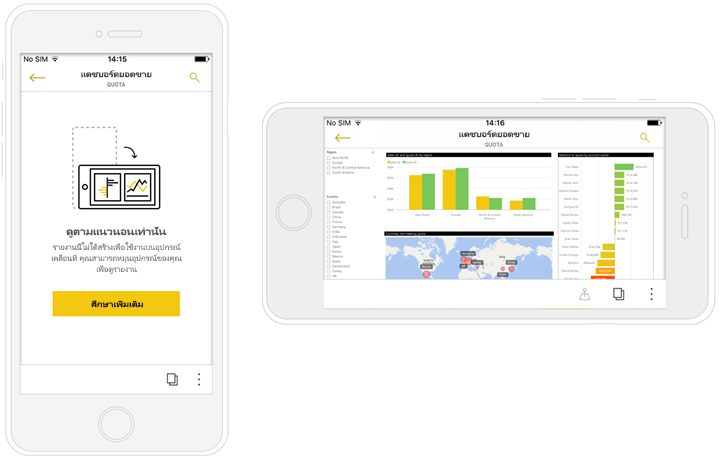

# ดูรายงาน Power BI ที่ปรับให้เหมาะสมกับมือถือของคุณ

นำไปใช้กับ:

|  |  |
|:--- |:--- |
| iPhones |โทรศัพท์ Android |

เมื่อคุณดูรายงาน Power BI บนโทรศัพท์ของคุณ Power BI ตรวจสอบเพื่อดูถ้ารายงานมีปรับให้เหมาะสมสำหรับโทรศัพท์ ถ้ามี Power BI เปิดรายงานปรับให้เหมาะสมโดยอัตโนมัติในมุมมองแนวตั้ง

ถ้าไม่มีรายงานที่ปรับให้เหมาะสมกับมือถือ รายงานยังคงเปิด แต่ในมุมมองแนวนอนที่ไม่ได้ปรับให้เหมาะสม แม้ว่าในรายงานปรับให้เหมาะสมกับมือถือ ถ้าคุณหมุนมือถือของคุณมาเป็นแนวนอน รายงานจะเปิดขึ้นในเค้าโครงเดิม ที่ยังไม่ได้ปรับให้เหมาะสม ถ้ามีเพียงบางหน้าที่ปรับให้เหมาะสม คุณจะเห็นข้อความในมุมมองแนวตั้ง ระบุว่า มีรายงานในแนวนอน

คุณลักษณะทั้งหมดอื่น ๆ ของรายงาน Power BI ยังคงทำงานในรายงานที่ปรับให้เหมาะสมกับมือถือ อ่านเพิ่มเติมเกี่ยวกับสิ่งที่คุณสามารถทำได้ใน:

* [รายงานบน iPhones](mobile-reports-in-the-mobile-apps.md) 
* [รายงานบนมือถือ Android](mobile-reports-in-the-mobile-apps.md)

## กรองหน้ารายงานบนมือถือของคุณ
ถ้ารายงานที่ปรับให้เหมาะสมกับมือถือ มีตัวกรองกำหนดไว้ เมื่อคุณดูรายงานนั้นบนมือถือของคุณ คุณสามารถใช้ตัวกรองเหล่านั้น รายงานเปิดขึ้นบนโทรศัพท์ของคุณ ถูกกรองไปยังค่าการกรองในรายงานบนเว็บ คุณจะเห็นข้อความที่บอกว่า มีตัวกรองที่ใช้งานอยู่บนหน้านั้น คุณสามารถเปลี่ยนตัวกรองบนมือถือของคุณ

1. แตะไอคอนตัวกรอง  ที่ด้านล่างของหน้า 
2. ใช้การกรองพื้นฐานหรือขั้นสูง เพื่อดูผลลัพธ์ที่คุณสนใจ
   
    

## การไฮไลต์เชื่อมโยงวิชวล
ไฮไลท์ภาพในแนวตั้ง มุมมองการทำงานตามที่ทำงาน ในบริการ Power BI และ บนมือถือในมุมมองแนวนอน: เมื่อคุณเลือกข้อมูลในวิชวลหนึ่ง วิชวลจะเน้นข้อมูลที่เกี่ยวข้องกันในวิชวลอื่นบนหน้านั้น

อ่านเพิ่มเติมเกี่ยวกับ[การกรอง และไฮไลต์ใน Power BI](../../power-bi-reports-filters-and-highlighting.md)

## การเลือกวิชวล
ในรายงานมือถือ เมื่อคุณเลือกวิชวล รายงานจะไฮไลต์วิชวลนั้น โฟกัสไปที่วิชวล หยุดรูปแบบการสัมผัสบนพื่นที่ทำงาน

ด้วยวิชวลที่เลือก คุณสามารถทำสิ่งต่าง ๆ เช่น การเลื่อนภายในวิชวล เมื่อต้องการยกเลิกการเลือกวิชวล เพียงแตะที่ใดก็ได้นอกบริเวณวิชวล

## เปิดวิชวลในโหมดโฟกัส
รายงานโทรศัพท์จากนี้ยังมีโหมดโฟกัส: คุณดูในมุมมองเดียวใหญ่ภาพ และสำรวจได้ง่ายยิ่งขึ้น

* ในรายงานมือถือ แตะที่จุดไข่ปลา ( **...** ) ในมุมบนขวาของวิชวล > **ขยายเป็นโหมดโฟกัส**
  
    

สิ่งที่คุณทำในโหมดโฟกัสมีผลต่อ ไปยังพื้นที่รายงาน และในทางกลับกัน ตัวอย่าง ถ้าคุณไฮไลต์ค่าในวิชวล จาก นั้นกลับไปยังรายงานทั้งหมด รายงานจะถูกกรองไปยังค่าที่คุณไฮไลต์ในวิชวล

การดำเนินการบางอย่างทำได้เฉพาะโหมดโฟกัส เนื่องจากข้อจำกัดของขนาดหน้าจอ:

* **ดูรายละเอียดแนวลึก** ลงในข้อมูลที่แสดงในวิชวล อ่านเพิ่มเติมเกี่ยวกับ[ดูรายละเอียดแนวลึกและกลับขึ้นไป](mobile-apps-view-phone-report.md#drill-down-in-a-visual)ในรายงานมือถือ ทางด้านล่าง
* **เรียงลำดับ**ค่าในวิชวล
* **แปลงกลับ**: ล้างขั้นตอนที่คุณสำรวจบนวิชวล และแปลงกลับเป็นการตั้งค่าเมื่อรายงานถูกสร้างขึ้น
  
    เมื่อต้องล้างการสำรวจทั้งหมดจากวิชวล แตะที่จุดไข่ปลา ( **...** ) > **แปลงกลับ**
  
    
  
    แปลงกลับจะพร้อมใช้งานใน ระดับรายงาน ล้างสำรวจจากวิชวลทั้งหมด หรือใน ระ ดับวิชวล ล้างสำรวจจากวิชวลที่เลือก   

## การดูรายละเอียดแนวลึกในวิชวล
ถ้ามีกำหนดระดับลำดับชั้นในวิชวล คุณสามารถเจาะลึกในข้อมูลวิชวลที่ละเอียดขึ้น แล้วย้อนกลับขึ้นมาได้ คุณ[เพิ่มการเจาะลึกลงในภาพ](../end-user-drill.md)ในบริการของ Power BI หรือ ใน Power BI Desktop

มีสองสามชนิดเจาะลึก:

### การดูรายละเอียดแนวลึกบนค่า
1. ความยาวแตะ (แตะค้างไว้) บนจุดข้อมูลในวิชวล
2. แนะนำเครื่องมือจะแสดงขึ้น และถ้ามีกำหนดลำดับชั้น จากนั้นท้ายกระดาษแนะนำเครื่องมือจะแสดงรายละเอียดลง และลูกศรขึ้น
3. แตะลูกศรลงสำหรับเจาะลึก

    
    
4. แตะลูกศรขึ้นสำหรับการดูข้อมูลสรุป

### ดูรายละเอียดไปยังระดับถัดไป
1. ในรายงานบนมือถือ แตะที่จุดไข่ปลา ( **...** ) ในมุมบนขวา > **ขยายเป็นโหมดโฟกัส**
   
    
   
    ในตัวอย่างนี้ แท่ง แสดงค่าของแต่ละรัฐ
2. แตะไอคอนสำรวจ  ด้านล่างซ้าย
   
    
3. แตะ**แสดงระดับถัดไป**หรือ**ขยายไปยังระดับถัดไป**
   
    
   
    ขณะนี้ แท่งแสดงค่าของแต่ละเมือง
   
    
4. ถ้าคุณแตะลูกศรที่มุมบนซ้าย คุณกลับไปรายงานมือถือ ด้วยค่าที่ยังคงขยายไประดับต่ำกว่า
   
    
5. เมื่อต้องการกลับไปที่ระดับเดิม แตะจุดไข่ปลา ( **...** ) อีกครั้ง > **แปลงกลับ**
   
    

## ดูรายละเอียดจากค่า
รายละเอียดเชื่อมต่อค่าในหน้ารายงานหนึ่ง กับหน้ารายงานอื่น ๆ เมื่อคุณดูรายละเอียดจากจุดข้อมูลไปยังหน้ารายงานอื่น ค่าจุดข้อมูลจะใช้เพื่อกรองการเข้าถึงรายละเอียดผ่านหน้า หรือซึ่งจะอยู่ในบริบทของข้อมูลที่เลือก
ผู้เขียนรายงานสามารถ[กำหนดรายละเอียด](https://docs.microsoft.com/power-bi/desktop-drillthrough)เมื่อพวกเขาสร้างรายงานได้

1. ความยาวแตะ (แตะค้างไว้) บนจุดข้อมูลในวิชวล
2. แนะนำเครื่องมือจะแสดงขึ้น และถ้ามีกำหนดรายละเอียด จากนั้นท้ายกระดาษแนะนำเครื่องมือจะแสดงรายละเอียดลูกศร
3. แตะลูกศรสำหรับรายละเอียด

    

4. เลือกหน้ารายงานไหนเพื่อดูรายละเอียด

    

5. ใช้ปุ่มย้อนกลับ ที่ส่วนหัวแอเพื่อย้อนกลับไปยังหน้าเริ่มต้น

## ขั้นตอนถัดไป
* [สร้างรายงานที่ปรับให้เหมาะสมสำหรับแอปมือถือ Power BI](../../desktop-create-phone-report.md)
* [สร้างมุมมองโทรศัพท์ของแดชบอร์ดใน Power BI](../../service-create-dashboard-mobile-phone-view.md)
* [สร้างวิชวลแบบตอบสนองที่ปรับให้เหมาะสมกับทุกขนาด](../../visuals/desktop-create-responsive-visuals.md)
* มีคำถามเพิ่มเติมหรือไม่ [ลองถามชุมชน Power BI](http://community.powerbi.com/)

