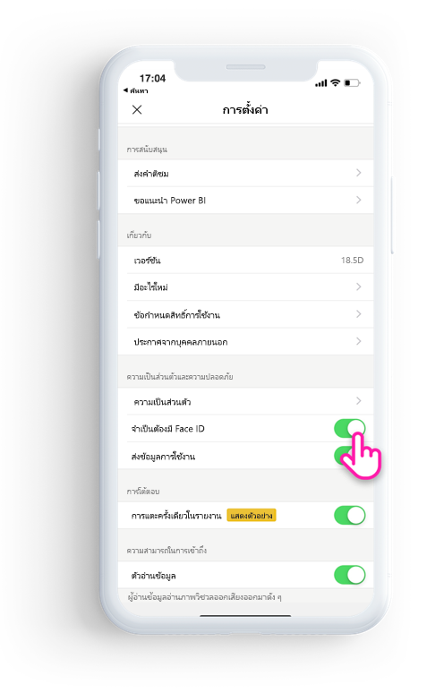
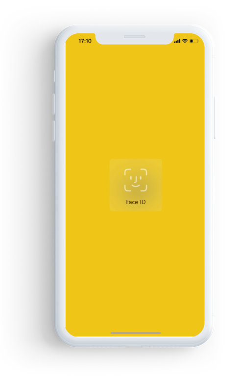

# ปกป้องแอป Power BI ด้วย Face ID, Touch ID หรือรหัสผ่าน 

ในหลายกรณี ข้อมูลที่จัดการใน Power BI จะถือเป็นความลับ และจำเป็นต้องได้รับการปกป้อง และการเข้าถึงได้โดยผู้ใช้ที่ได้รับอนุญาตเท่านั้น 

แอป iOS ของ Power BI ช่วยให้คุณปกป้องข้อมูลของคุณโดยการกำหนดค่าการระบุเพิ่มเติม คุณจำเป็นต้องระบุ Face ID, Touch ID หรือรหัสผ่านทุกครั้งที่คุณเปิดใช้แอป หรือเมื่อคุณนำแอปจากพื้นหลังไปยังพื้นหน้า

|  |  |
|:--- |:--- |
| iPhone |iPad |

## เปิด Face ID, Touch ID หรือรหัสผ่านในการตั้งค่าแอป

เมื่อต้องใช้การระบุเพิ่มเติมใน Power BI ไปที่การตั้งค่าแอปภายใต้**ความเป็นส่วนตัวและการรักษาความปลอดภัย** คุณจะเห็นตัวเลือกในการเปิด Face ID, Touch ID หรือรหัสผ่านซึ่งขึ้นอยู่กับความสามารถของอุปกรณ์ของคุณ

ทันทีที่การตั้งค่านี้เปิดใช้งาน ทุกครั้งที่คุณเปิดใช้งาน Power BI หรือนำมันออกจากพื้นหลัง ระบบจะขอให้คุณระบุ ID ของคุณก่อนที่คุณสามารถเข้าถึงแอปได้ 

การตัดสินใจในการขอ Face ID, Touch ID หรือรหัสผ่านดำเนินการโดย iOS ซึ่งขึ้นอยู่กับความสามารถของอุปกรณ์ ถ้าอุปกรณ์ของคุณสนับสนุน Face ID คุณจำเป็นต้องใช้ Face ID ถ้าสนับสนุน Touch ID คุณจำเป็นต้องใช้ Touch ID ถ้าอุปกรณ์ของคุณรองรับทั้งสองระบบ จากนั้นคุณจำเป็นต้องระบุรหัสผ่าน

## ใช้ MDM เพื่อบังคับใช้ Face ID, Touch ID หรือรหัสผ่าน

บางองค์กรมีนโยบายด้านความปลอดภัยและข้อกำหนดการปฏิบัติตามข้อบังคับที่บังคับใช้กับการระบุเพิ่มเติมก่อนที่คุณสามารถเข้าถึงข้อมูลที่มีความละเอียดอ่อนทางธุรกิจได้ 

แอป iOS สำหรับอุปกรณ์เคลื่อนของ Power BI ช่วยให้ผู้ดูแลระบบสามารถควบคุมการตั้งค่านั้น โดยแสดงการตั้งค่าการกำหนดค่าแอปจาก Microsoft Intune และโซลูชันการจัดการอุปกรณ์เคลื่อนที่ (MDM) อื่น ผู้ดูแลระบบสามารถใช้นโยบายการปกป้องแอปเพื่อเปิดการตั้งค่านี้สำหรับผู้ใช้ทั้งหมด หรือกลุ่มของผู้ใช้

|คีย์  |ชนิด  |คำอธิบาย  |
|---------|---------|---------|
| com.microsoft.powerbi.mobile.ForceDeviceAuthentication | บูลีน | ค่าเริ่มต้นเป็น False  เมื่อตั้งค่าเป็น True แอปจะบังคับผู้ใช้ให้ระบุตัวเองโดยใช้ Face ID, Touch ID หรือรหัสผ่านก่อนที่จะสามารถดูข้อมูล Power BI ในแอปได้ ผู้ใช้ที่ไม่มี Face ID, Touch ID หรือรหัสผ่านที่กำหนดค่าบนอุปกรณ์จำเป็นต้องกำหนดค่าก่อนจึงจะสามารถเข้าถึง Power BI ได้  |

## ขั้นตอนถัดไป

[ใช้ MDM เพื่อกำหนดค่าแอป iOS ของ Power BI จากระยะไกล](mobile-app-configuration.md)
