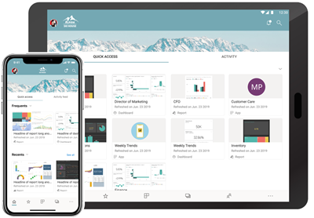
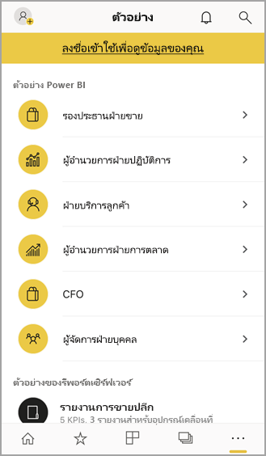

# เริ่มต้นใช้งานแอปอุปกรณ์เคลื่อนที่ Power BI สำหรับ IOS
Microsoft Power BI สำหรับ iOS บน iPhone บนi iPad ส่งมอบประสบการณ์ BI สำหรับอุปกรณ์เคลื่อนที่สำหรับ Power BI เซิร์ฟเวอร์รายงาน Power BI และ Reporting Services ดูและโต้ตอบกับแดชบอร์ดของบริษัทของคุณ ภายในองค์กรและในคลาวด์ จากที่ใดก็ได้ ผ่านอุปกรณ์เคลื่อนที่ ที่รองรับระบบสัมผัสและดูข้อมูลสดได้ สำรวจข้อมูลในแดชบอร์ดและแชร์กับเพื่อนร่วมงานของคุณผ่านอีเมลหรือการส่งข้อความ และอัปเดตอยู่เสมอ ด้วยข้อมูลของคุณมากที่สุดตามระยะเวลาในของคุณ[Apple Watch](mobile-apple-watch.md)  

คุณสร้างรายงาน Power BI ใน Power BI Desktop และเผยแพร่:

* [เผยแพร่ไปยังบริการของ Power BI](../../service-get-started.md) และสร้างแดชบอร์ด
* [เผยแพร่ภายในองค์กรไปยัง เซิร์ฟเวอร์รายงาน Power BI](../../report-server/quickstart-create-powerbi-report.md)

จากนั้น ในแอปอุปกรณ์เคลื่อนที่ Power BI สำหรับ IOS คุณจะโต้ตอบกับแดชบอร์ดและรายงานของคุณ ไม่ว่าจะอยู่ภายในองค์กรหรืออยู่ในระบบคลาวด์

ดูว่า[มีอะไรใหม่ในแอป Power BI สำหรับอุปกรณ์เคลื่อนที่](mobile-whats-new-in-the-mobile-apps.md)

## ดาวน์โหลดแอป
[ดาวน์โหลดแอป iOS](https://go.microsoft.com/fwlink/?LinkId=522062 "ดาวน์โหลดแอป iOS") จากร้าน Apple App Store ไปยัง iPad หรือ iPhone ของคุณ

คุณสามารถเรียกใช้ Power BI สำหรับแอป iOS บนอุปกรณ์ใด ๆ ที่ใช้ iOS 11 หรือใหม่กว่า 

## ลงชื่อออกจากบริการ Power BI
ถ้าคุณยังไม่ได้ลงทะเบียน ไปที่ [powerbi.com](https://powerbi.microsoft.com/get-started/) และด้านล่าง **Power BI - การทำงานร่วมกันและการแชร์บนระบบคลาวด์** เลือก **ทดลองใช้ฟรี**

## เริ่มต้นใช้งานแอป Power BI
1. บนอุปกรณ์ IOS ของคุณ่ เปิดแอป Power BI
2. หากต้องการลงชื่อเข้าใช้ Power BI ให้แตะแท็บ **Power BI** และกรอกรายละเอียดการลงชื่อเข้าใช้ของคุณ  
   หากต้องการลงชื่อเข้าใช้รายงานมือถือและ KPI ของ Reporting Services ของคุณให้แตะแท็บ **เซิร์ฟเวอร์รายงาน** และกรอกรายละเอียดการลงชื่อเข้าใช้ของคุณ
   
   
   
   เมื่อคุณอยู่ในแอป เพียงแตะที่รูปโปรไฟล์บัญชีในมุมบนซ้ายของหน้าจอของคุณ เพื่อสลับไปมาระหว่าง Power BI กับเซิร์ฟเวอร์รายงานของคุณ 

## ลองใช้ตัวอย่าง Power BI และ Reporting Services
แม้ว่าจะยังไม่ลงทะเบียน คุณสามารถดูและโต้ตอบกับตัวอย่าง Power BI และ Reporting Services ได้

หากต้องการเข้าถึงตัวอย่าง ให้แตะ **ตัวเลือกเพิ่มเติม** (...) บนแถบนำทางและเลือก **ตัวอย่าง**.

จำนวนตัวอย่างของ Power BI จะตามด้วยตัวอย่างของเซิร์ฟเวอร์รายงานหลายรายการ

   
   
   > [!NOTE]
   > ไม่สามารถใช้งานคุณลักษณะทั้งหมดได้ในตัวอย่าง ตัวอย่างเช่น คุณไม่สามารถดูรายงานตัวอย่างทีอยู่ใต้แดชบอร์ด คุณไม่สามารถแชร์ตัวอย่างกับผู้อื่นได ้และคุณไม่สามารถทำให้เป็นรายการโปรดของคุณได้ 
   > 
   >

## ค้นหาเนื้อหาของคุณในแอป Power BI สำหรับอุปกรณ์เคลื่อนที่

แตะแว่นขยายในส่วนหัวเพื่อเริ่มค้นหาเนื้อหา Power BI ของคุณ

## ดูแดชบอร์ดและรายงานโปรดของคุณ
แตะ **รายการโปรด** () บนแถบนำทางเพื่อดูหน้ารายการโปรดของคุณ 

อ่านข้อมูลเพิ่มเติมเกี่ยวกับ [รายการโปรดในแอป Power BI สำหรับอุปกรณ์เคลื่อนที่](mobile-apps-favorites.md)

## การสนับสนุนองค์กรสำหรับแอปสำหรับอุปกรณ์เคลื่อนที่ Power BI
องค์กรสามารถใช้ Microsoft Intune เพื่อจัดการอุปกรณ์และแอปพลิเคชัน รวมถึงแอป Power BI สำหรับอุปกรณ์เคลื่อนที่ สำหรับ Android และ iOS

Microsoft Intune ช่วยให้องค์กรควบคุมรายการ เช่น การบังคับใช้ Pin เพื่อเข้าใช้งาน การควบคุมวิธีจัดการกับข้อมูลโดยแอปพลิเคชัน หรือแม้แต่ารเข้ารหัสลับข้อมูลแอปพลิเคชันเมื่อไม่ได้ใช้งาน

> [!NOTE]
> หากคุณใช้แอปอุปกรณ์เคลื่อนที่ Power BI บน iOS และองค์กรของคุณได้กำหนดค่า Microsoft Intune MAM แล้ว การรีเฟรชข้อมูลพื้นหลังจะปิดอยู่ Power BI จะรีเฟรชข้อมูลจากบริการของ Power BI บนเว็บ ในครั้งต่อไปที่คุณเข้าใช้งานแอป
> 

อ่านเพิ่มเติมเกี่ยวกับ[การกำหนดค่าแอปโทรศัพท์เคลื่อนที่ Power BI ด้วย Microsoft Intune](../../service-admin-mobile-intune.md) 

## ขั้นตอนถัดไป

* [Power BI คืออะไร](../../fundamentals/power-bi-overview.md)
* มีคำถามหรือไม่ [ลองถามชุมชน Power BI](https://community.powerbi.com/)

