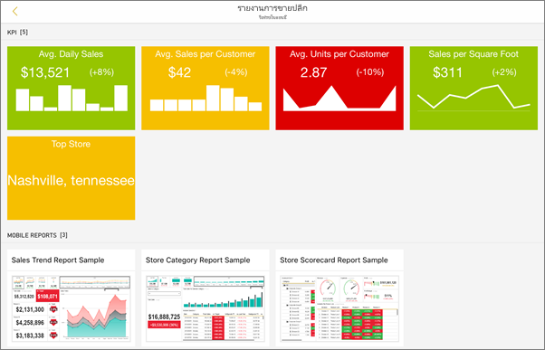
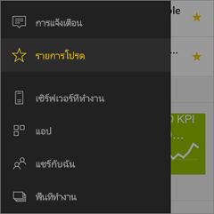
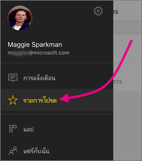
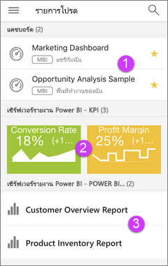

# เริ่มต้นใช้งานแอปอุปกรณ์เคลื่อนที่ Power BI สำหรับ IOS
Microsoft Power BI สำหรับแอป iOS บน iPhone บน iPad หรือบน iPod Touch ให้บริการของ Power BI บริการของเซิร์ฟเวอร์รายงาน Power BI และ บริการการรายงาน ดูและโต้ตอบกับแดชบอร์ดของบริษัทของคุณ ภายในองค์กรและในคลาวด์ จากที่ใดก็ได้ ผ่านอุปกรณ์เคลื่อนที่ ที่รองรับระบบสัมผัสและดูข้อมูลสดได้ สำรวจข้อมูลในแดชบอร์ดและแชร์กับเพื่อนร่วมงานของคุณผ่านอีเมลหรือการส่งข้อความ และอัปเดตอยู่เสมอ ด้วยข้อมูลของคุณมากที่สุดตามระยะเวลาในของคุณ[Apple Watch](mobile-apple-watch.md)  

คุณสร้างรายงาน Power BI ใน Power BI Desktop และเผยแพร่:

* [เผยแพร่ไปยังบริการของ Power BI](../../service-get-started.md) และสร้างแดชบอร์ด
* [เผยแพร่ภายในองค์กรไปยัง เซิร์ฟเวอร์รายงาน Power BI](../../report-server/quickstart-create-powerbi-report.md)

จากนั้น ในแอปอุปกรณ์เคลื่อนที่ Power BI สำหรับ IOS คุณจะโต้ตอบกับแดชบอร์ดและรายงานของคุณ ไม่ว่าจะอยู่ภายในองค์กรหรืออยู่ในระบบคลาวด์

ดูว่า[มีอะไรใหม่ในแอป Power BI](mobile-whats-new-in-the-mobile-apps.md) สำหรับอุปกรณ์เคลื่อนที่

## ดาวน์โหลดแอป
[ดาวน์โหลดแอป iOS](http://go.microsoft.com/fwlink/?LinkId=522062 "ดาวน์โหลดแอป iOS")จากร้าน Apple App Store ไปยัง iPhone หรือ iPad หรือ iPod Touch ของคุณ

คุณสามารถเรียกใช้ Power BI สำหรับแอป iOS บน iPhone 5 และด้าน บน ด้วย iOS 10 หรือใหม่กว่า คุณยังสามารถเรียกใช้งานบน iPad หรือ iPod Touch ด้วย iOS 10 หรือรุ่นใหม่กว่า 

## ลงชื่อออกจากบริการ Power BI
ถ้าคุณยังไม่ได้ลงทะเบียน ไปที่ [powerbi.com](https://powerbi.microsoft.com/get-started/) และด้านล่าง **Power BI - การทำงานร่วมกันและการแชร์บนระบบคลาวด์** เลือก **ทดลองใช้ฟรี**

## เริ่มต้นใช้งานแอป Power BI
1. บนอุปกรณ์ IOS ของคุณ่ เปิดแอป Power BI
2. เมื่อต้องการดูแดชบอร์ดและรายงาน Power BI ของคุณ ให้แตะที่ **Power BI**  
   เมื่อต้องการดูรายงานมือถือของ Reporting Services และ KPI ของคุณ ให้แตะที่ **Reporting Services เซิอร์ฟเวอร์ SQL**
   
   
   
   เมื่อคุณอยู่ในแอป เพียงแตะปุ่มนำทางส่วนกลาง  ที่มุมบนซ้ายเพื่อไปยังระหว่างบริการสองบริการ 

## ลองใช้ตัวอย่าง Power BI และ Reporting Services
แม้ว่าจะยังไม่ลงทะเบียน คุณสามารถเล่นกับตัวอย่าง Power BI และ Reporting Services ได้ หลังจากที่คุณดาวน์โหลดแอปแล้ว คุณสามารถดูตัวอย่าง หรือเริ่มใช้งานได้ กลับไปยังตัวอย่างเมื่อใดก็ตามที่คุณต้องการจากโฮมเพจแดชบอร์ด

### ตัวอย่าง Power BI
คุณสามารถดูและโต้ตอบกับตัวอย่างแดชบอร์ด Power BI แต่มีบางสิ่งที่คุณไม่สามารถทำได้กับตัวอย่างเหล่านี้ คุณไม่สามารถเปิดรายงานเบื้องหลังแดชบอร์ด แชร์ตัวอย่างกับผู้อื่น หรือทำให้เป็นรายการโปรดของคุณ

1. แตะปุ่มการนำทางส่วนกลาง  ในมุมซ้ายบน
2. แตะไอคอนรูปเฟืองมุมขวาบนแล้ว เคาะ**ตัวอย่าง Power BI**
3. จากนั้นเลือกบทบาท และสำรวจแดชบอร์ดตัวอย่างสำหรับบทบาทนั้น  
   
   
   
   > [!NOTE]
   > ไม่สามารถใช้งานคุณลักษณะทั้งหมดได้ในตัวอย่าง ตัวอย่างเช่น คุณไม่สามารถดูรายงานตัวอย่างที่อยู่ใต้การแดชบอร์ดได้ 
   > 
   > 

### ตัวอย่างรายงานมือถือของ Reporting Services
1. แตะปุ่มนำทางส่วนกลาง  ในมุมซ้ายบน
2. แตะไอคอนรูปเฟืองมุมขวาบนแล้ว เคาะ**ตัวอย่าง Reporting Services**
3. เปิดโฟลเดอร์รายงานการขายปลีกหรือรายงานการขายเพื่อสำรวจ KPI และรายงานมือถือของโฟลเดอร์เหล่านี้
   
   

## ค้นหาเนื้อหาของคุณในแอปโทรศัพท์เคลื่อนที่ Power BI
แดชบอร์ดและรายงานของคุณได้รับการจัดเก็บไว้คนละแห่งในแอป Power BI สำหรับอุปกรณ์เคลื่อนที่ ขึ้นอยู่กับว่ามาจากที่ใด อ่านเกี่ยวกับ[การค้นหาเนื้อหาของคุณในแอปสำหรับอุปกรณ์เคลื่อนที่](mobile-apps-quickstart-view-dashboard-report.md) นอกจากนี้ คุณสามารถค้นหาสิ่งต่าง ๆ ที่คุณมีในแอป Power BI สำหรับอุปกรณ์เคลื่อนที่ 

อ่านเกี่ยวกับ[การค้นหาเนื้อหาของคุณในแอปโทรศัพท์เคลื่อนที่](mobile-apps-quickstart-view-dashboard-report.md)

## ดูแดชบอร์ดโปรด KPI และรายงานของคุณ
บนหน้ารายการโปรดในแอปอุปกรณ์เคลื่อนที่ คุณเห็นแดชบอร์ด Power BI โปรดทั้งหมดของคุณ รวมไปถึง KPI และรายงาน เซิร์ฟเวอร์รายงาน Power BI และ Reporting Services เมื่อคุณทำให้แดชบอร์ดเป็น*รายการโปรด*ในแอปอุปกรณ์เคลื่อนที่ Power BI คุณสามารถเข้าถึงแดชบอร์ดดังกล่าวได้จากทุกอุปกรณ์ของคุณ รวมถึงบริการของ Power BI ในเบราว์เซอร์ของคุณได้ 

* แตะ**รายการโปรด**
  
   
  
   คุณเห็นรายการโปรดทั้งหมดของคุณร่วมกันบนหน้านี้
  
   
  
  1. แดชบอร์ดบนบริการ Power BI
  2. KPIs บน Power BI Report Server
  3. Power BI รายงาน Power BI Report Server

อ่านเพิ่มเติมเกี่ยวกับ[รายการโปรดในแอปโทรศัพท์เคลื่อนที่ Power BI](mobile-apps-favorites.md)

## การสนับสนุนองค์กรสำหรับแอปสำหรับอุปกรณ์เคลื่อนที่ Power BI
องค์กรสามารถใช้ Microsoft Intune เพื่อจัดการอุปกรณ์และแอปพลิเคชัน รวมถึงแอป Power BI สำหรับอุปกรณ์เคลื่อนที่ สำหรับ Android และ iOS

Microsoft Intune ช่วยให้องค์กรควบคุมรายการ เช่น การบังคับใช้ Pin เพื่อเข้าใช้งาน การควบคุมวิธีจัดการกับข้อมูลโดยแอปพลิเคชัน หรือแม้แต่ารเข้ารหัสลับข้อมูลแอปพลิเคชันเมื่อไม่ได้ใช้งาน

> [!NOTE]
> หากคุณใช้แอปอุปกรณ์เคลื่อนที่ Power BI บน iOS และองค์กรของคุณได้กำหนดค่า Microsoft Intune MAM แล้ว การรีเฟรชข้อมูลพื้นหลังจะปิดอยู่ Power BI จะรีเฟรชข้อมูลจากบริการของ Power BI บนเว็บ ในครั้งต่อไปที่คุณเข้าใช้งานแอป
> 

อ่านเพิ่มเติมเกี่ยวกับ[การกำหนดค่าแอปโทรศัพท์เคลื่อนที่ Power BI ด้วย Microsoft Intune](../../service-admin-mobile-intune.md) 

## ขั้นตอนถัดไป

* [Power BI คืออะไร](../../power-bi-overview.md)
* มีคำถามหรือไม่ [ลองถามชุมชน Power BI](http://community.powerbi.com/)

