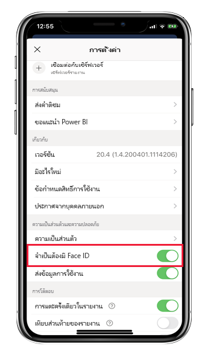
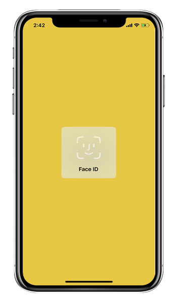
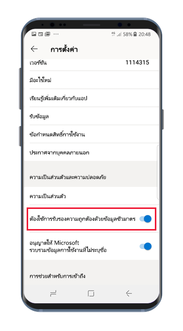
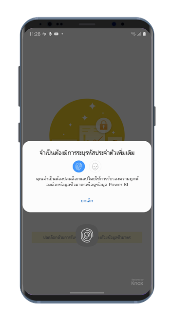

# ปกป้องแอป Power BI ด้วย Face ID, Touch ID, รหัสผ่าน หรือข้อมูลทางชีวมิติ 

ในหลายกรณี ข้อมูลที่จัดการใน Power BI จะถือเป็นความลับ และจำเป็นต้องได้รับการปกป้อง และการเข้าถึงได้โดยผู้ใช้ที่ได้รับอนุญาตเท่านั้น 

แอป Power BI สำหรับ iOS และแอนดรอยด์ช่วยให้คุณสามารถปกป้องข้อมูลของคุณได้โดยการกำหนดค่าการระบุเพิ่มเติม จากนั้น ผู้ใช้จะต้องทำการยืนยันตัวตนทุกครั้งที่มีการเปิดใช้งานแอปหรือนำแอปขึ้นมาที่เบื้องหน้า สำหรับ iOS กรณีนี้หมายความว่าคุณต้องให้ Face ID, Touch ID หรือรหัสผ่าน สำหรับแอนดรอยด์ กรณีนี้หมายความว่าคุณต้องให้ข้อมูลทางชีวมิติ (Fingerprint ID)

ใช้ได้กับ:

|  |  |  |  |
|:--- |:--- |:--- |:--- |
|iPhones |iPad |มือถือ Android |แท็บเล็ต Android |

## เปิด Face ID, Touch ID หรือรหัสผ่านบน iOS

เพื่อใช้การยืนยันตัวตนเพิ่มเติมในแอป Power BI มือถือสำหรับ iOS ให้ไปที่การตั้งค่าแอปภายใต้**ความเป็นส่วนตัวและการรักษาความปลอดภัย** คุณจะเห็นตัวเลือกในการเปิด Face ID, Touch ID หรือรหัสผ่าน ซึ่งตัวเลือกต่าง ๆ ที่มีจะขึ้นอยู่กับความสามารถของอุปกรณ์ของคุณ

เมื่อเปิดใช้งานการตั้งค่านี้ ทุกครั้งที่คุณเปิดใช้งานแอป Power BI หรือนำแอปขึ้นมาสู่ด้านบน ระบบจะขอให้คุณระบุ ID ของคุณก่อนที่คุณสามารถเข้าถึงแอปได้

ชนิดของ ID ที่ระบบร้องขอจากคุณจะขึ้นอยู่กับความสามารถของอุปกรณ์ของคุณ ถ้าอุปกรณ์ของคุณสนับสนุน Face ID คุณจำเป็นต้องใช้ Face ID ถ้าสนับสนุน Touch ID คุณจำเป็นต้องใช้ Touch ID ถ้าอุปกรณ์ของคุณรองรับทั้งสองระบบ จากนั้นคุณจำเป็นต้องระบุรหัสผ่าน รูปภาพด้านล่างแสดงให้เห็นถึงหน้าจอการรับรองความถูกต้องของ Face ID

## เปิดใช้งานข้อมูลทางชีวมิติ (Fingerprint ID) บนแอนดรอยด์

เพื่อใช้การยืนยันตัวตนเพิ่มเติมในแอป Power BI มือถือสำหรับแอนดรอยด์ ให้ไปที่การตั้งค่าแอปภายใต้**ความเป็นส่วนตัวและการรักษาความปลอดภัย** คุณจะเห็นตัวเลือกเพื่อเปิดใช้งานข้อมูลทางชีวมิติ

เมื่อเปิดใช้งานการตั้งค่านี้ ทุกครั้งที่คุณเปิดใช้งานแอป Power BI หรือนำแอปขึ้นมาสู่ด้านบน ระบบจะขอให้คุณระบุข้อมูลทางชีวมิติ (Fingerprint ID) ของคุณก่อนที่คุณสามารถเข้าถึงแอปได้

รูปภาพด้านล่างแสดงให้เห็นถึงหน้าจอการรับรองความถูกต้องด้วยลายนิ้วมือ

>[!NOTE]
>เพื่อให้คุณสามารถใช้แอปสำหรับอุปกรณ์เคลื่อนที่ได้ คุณจำเป็นต้องทำการตั้งค่าการยืนยันความถูกต้องทางชีวมิติ ซึ่งคุณจะต้องตั้งค่าชีวมิติบนอุปกรณ์แอนดรอยด์ของคุณก่อน ถ้าอุปกรณ์ของคุณไม่รองรับชีวมิติ คุณจะไม่สามารถป้องกันการเข้าถึงข้อมูล Power BI ของคุณโดยใช้การตั้งค่าแอปสำหรับอุปกรณ์เคลื่อนที่นี้ได้
>
>ถ้าผู้ดูแลระบบของคุณได้[เปิดใช้งานการเข้าถึงจากระยะไกลแบบปลอดภัย](#mdm-enforcement-of-secure-access-to-your-power-bi-mobile-app)ของแอปสำหรับอุปกรณ์เคลื่อนที่ และคุณยังไม่ได้ตั้งค่าชีวมิติบนอุปกรณ์ของคุณเพื่อเข้าถึงแอป คุณต้องตั้งค่าดังกล่าวก่อน ถ้าอุปกรณ์ของคุณไม่รองรับชีวมิติ การตั้งค่าระยะไกลจะไม่ส่งผลกระทบใด ๆ ต่อคุณ แต่การเข้าถึงแอปของคุณจะไม่มีการรักษาความปลอดภัยใด ๆ

## MDM จะบังคับให้มีการเข้าถึงแอป Power BI บนอุปกรณ์เคลื่อนที่ของคุณอย่างปลอดภัย

บางองค์กรมีนโยบายด้านความปลอดภัยและข้อกำหนดการปฏิบัติตามข้อบังคับที่บังคับใช้กับการระบุเพิ่มเติมก่อนที่คุณสามารถเข้าถึงข้อมูลที่มีความละเอียดอ่อนทางธุรกิจได้

เพื่อสนับสนุนเรื่องนี้ แอป Power BI สำหรับอุปกรณ์เคลื่อนช่วยให้ผู้ดูแลระบบสามารถควบคุมการตั้งค่าการเข้าถึงแอปอย่างปลอดภัย โดยเข้าใช้การตั้งค่าการกำหนดค่าแอปจาก Microsoft Intune และโซลูชันการจัดการอุปกรณ์เคลื่อนที่ (MDM) อื่น ผู้ดูแลระบบสามารถใช้นโยบายการปกป้องแอปเพื่อเปิดการตั้งค่านี้สำหรับผู้ใช้ทั้งหมด หรือกลุ่มของผู้ใช้ คุณสามารถศึกษารายละเอียดได้ที่ [การใช้ MDM เพื่อกำหนดค่าแอป Power BI จากระยะไกลสำหรับอุปกรณ์เคลื่อนที่](mobile-app-configuration.md#data-protection-settings-ios-and-android)

## ขั้นตอนถัดไป
* [การใช้ MDM เพื่อกำหนดค่าแอป Power BI จากระยะไกลสำหรับอุปกรณ์เคลื่อนที่](mobile-app-configuration.md)
