# <a name="using-oauth-to-connect-to-power-bi-report-server-and-ssrs"></a>ใช้ OAuth เพื่อเชื่อมต่อกับเซิร์ฟเวอร์รายงาน Power BI และ SSRS

คุณสามารถใช้ OAuth เพื่อเชื่อมต่อกับเซิร์ฟเวอร์รายงาน Power BI และ Reporting Services เพื่อแสดงรายงานอุปกรณ์มือถือ หรือ KPI เรียนรู้วิธีการกำหนดค่าสภาพแวดล้อมของคุณ เพื่อสนับสนุนการรับรองความถูกต้อง OAuth ด้วยแอป Power BI สำหรับอุปกรณ์เคลื่อนที่ เพื่อเชื่อมต่อกับเซิร์ฟเวอร์รายงาน Power BI และ SQL Server Reporting Services 2016 หรือใหม่กว่า

ดูอดัมเชื่อมต่อจาก Power BI บนมือถือไปยัง SSRS โดยใช้ OAuth:


<iframe width="560" height="350" src="https://www.youtube.com/embed/okzPAI2uUek" frameborder="0" allowfullscreen></iframe>


> [!NOTE]
> การดูรายงาน Power BI ที่โฮสต์อยู่ในเซิร์ฟเวอร์รายงานของ Power BI โดยใช้ WAP เพื่อตรวจสอบสิทธิ์ไม่ได้รับการสนับสนุนสำหรับแอป iOS และ Android ในขณะนี้

## <a name="requirements"></a>ข้อกำหนด

Windows Server 2016 เป็นที่ต้องการสำหรับเซิร์ฟเวอร์ Web Application Proxy (WAP) และ Active Directory Federation Services (ADFS) คุณไม่จำเป็นต้องมีโดเมนระดับการทำงาน Windows 2016

## <a name="domain-name-services-dns-configuration"></a>การกำหนดค่าบริการชื่อโดเมน (DNS)

แอป Power BI สำหรับอุปกรณ์เคลื่อนที่จะเชื่อมต่อกับ URL สาธารณะ ตัวอย่างเช่น อาจมีลักษณะคล้ายกับต่อไปนี้

```https
https://reports.contoso.com
```

ระเบียน DNS สำหรับ**รายงาน**ของคุณเชื่อมต่อกับที่อยู่ IP สาธารณะของเซิร์ฟเวอร์ Web Application Proxy (WAP) นอกจากนี้คุณจำเป็นต้องกำหนดค่าระเบียน DNS สาธารณะสำหรับเซิร์ฟเวอร์ ADFS ของคุณ ตัวอย่างเช่น คุณอาจกำหนดค่าเซิร์ฟเวอร์ ADFS ด้วย URL ต่อไปนี้

```https
https://fs.contoso.com
```

ระเบียน DNS สำหรับ **fs** ของคุณเชื่อมต่อกับที่อยู่ IP สาธารณะของเซิร์ฟเวอร์ Web Application Proxy (WAP) เนื่องจากมีการเผยแพร่เป็นส่วนหนึ่งของแอปพลิเคชัน WAP

## <a name="certificates"></a>ใบรับรอง

คุณต้องกำหนดค่าใบรับรองสำหรับทั้งแอปพลิเคชัน WAP และเซิร์ฟเวอร์ ADFS ใบรับรองเหล่านี้ทั้งสองต้องเป็นส่วนหนึ่งของหน่วยงานใบรับรองที่ถูกต้องที่อุปกรณ์เคลื่อนที่ของคุณรู้จัก

## <a name="reporting-services-configuration"></a>การกำหนดค่า Reporting Services

ไม่มีอะไรมากที่ต้องกำหนดค่าทางด้าน Reporting Services เราต้องการตรวจสอบให้แน่ใจว่า เรามีชื่อบริการหลักที่ถูกต้อง (SPN) เพื่อเปิดใช้งานการรับรองความถูกต้อง Kerberos ที่เหมาะสมให้เกิดขึ้น และเซิร์ฟเวอร์ Reporting Services จะถูกเปิดใช้งานสำหรับการรับรองความถูกต้องในการเจรจา

### <a name="service-principal-name-spn"></a>ชื่อบริการหลัก (SPN)

SPN เป็นตัวระบุเฉพาะสำหรับบริการที่ใช้การรับรองความถูกต้อง Kerberos คุณต้องตรวจสอบให้แน่ใจว่า คุณมี SPN HTTP ที่เหมาะสมสำหรับเซิร์ฟเวอร์รายงานของคุณ

สำหรับข้อมูลเกี่ยวกับวิธีการกำหนดค่าชื่อบริการหลัก (SPN) ที่เหมาะสมสำหรับเซิร์ฟเวอร์รายงานของคุณ ดู[ลงทะเบียน ชื่อบริการหลัก (SPN) สำหรับเซิร์ฟเวอร์รายงาน](https://msdn.microsoft.com/library/cc281382.aspx)

### <a name="enabling-negotiate-authentication"></a>การเปิดใช้งานการรับรองความถูกต้องในการเจรจา

ในการเปิดใช้งานเซิร์ฟเวอร์รายงานเพื่อใช้การรับรองความถูกต้อง Kerberos คุณต้องกำหนดค่าชนิดของการรับรองความถูกต้องของเซิร์ฟเวอร์รายงานให้เป็น RSWindowsNegotiate คุณสามารถทำได้ภายในไฟล์ rsreportserver.config

```xml
<AuthenticationTypes>  
    <RSWindowsNegotiate />  
    <RSWindowsKerberos />  
    <RSWindowsNTLM />  
</AuthenticationTypes>
```

สำหรับข้อมูลเพิ่มเติม ดู[ปรับเปลี่ยนแฟ้มการกำหนดค่า Reporting Services](https://msdn.microsoft.com/library/bb630448.aspx) และ[กำหนดค่าการรับรองความถูกต้องของ Windows บนเซิร์ฟเวอร์รายงาน](https://msdn.microsoft.com/library/cc281253.aspx)

## <a name="active-directory-federation-services-adfs-configuration"></a>การกำหนดค่า Active Directory Federation Services (ADFS)

คุณต้องกำหนดค่า ADFS บนเซิร์ฟเวอร์ Windows 2016 ภายในสภาพแวดล้อมของคุณ การกำหนดค่าสามารถทำได้ผ่านตัวจัดการเซิร์ฟเวอร์ และการเลือกเพิ่มบทบาทและคุณลักษณะซึ่งอยู่ด้านล่างจัดการ สำหรับข้อมูลเพิ่มเติม ดู[Active Directory Federation Services](https://technet.microsoft.com/windows-server-docs/identity/active-directory-federation-services)

### <a name="create-an-application-group"></a>สร้างกลุ่มแอปพลิเคชัน

ภายในหน้าจอการจัดการ AD FS คุณต้องสร้างกลุ่มแอปพลิเคชันสำหรับ Reporting Services ซึ่งจะรวมข้อมูลสำหรับแอป Power BI สำหรับอุปกรณ์เคลื่อนที่

คุณสามารถสร้างกลุ่มแอปพลิเคชัน ด้วยขั้นตอนต่อไปนี้

1. ภายในแอปการจัดการ AD FS ให้คลิกขวาที่ **กลุ่มแอปพลิเคชัน** และเลือก **เพิ่มกลุ่มแอปพลิเคชัน...**

   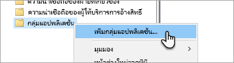

2. ภายในการเพิ่มตัวช่วยสร้างกลุ่มแอปพลิเคชัน ใส่**ชื่อ**สำหรับกลุ่มแอปพลิเคชันและเลือก**แอปพลิเคชันดั้งเดิมที่เข้าถึง API เว็บ**

   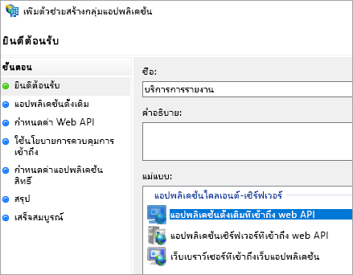

3. เลือก **ถัดไป**

4. ใส่**ชื่อ**สำหรับแอปพลิเคชันที่คุณกำลังเพิ่ม 

5. ในขณะ **ID ไคลเอ็นต์**ของคุณจะถูกสร้างโดยอัตโนมัติ ใส่ใน *484d54fc-b481-4eee-9505-0258a1913020* สำหรับทั้ง iOS และ Android

6. คุณต้องการเพิ่ม **URL เปลี่ยนเส้นทาง**ต่อไปนี้:

   **รายการสำหรับ Power BI สำหรับอุปกรณ์เคลื่อนที่ – iOS:**  
   msauth://code/mspbi-adal://com.microsoft.powerbimobile  
   msauth://code/mspbi-adalms://com.microsoft.powerbimobilems  
   mspbi adal://com.microsoft.powerbimobile  
   mspbi adalms://com.microsoft.powerbimobilems

   **ต้องใช้ขั้นตอนต่อไปนี้เท่านั้นสำหรับแอป Android:**  
   urn:ietf:wg:oauth:2.0:oob

   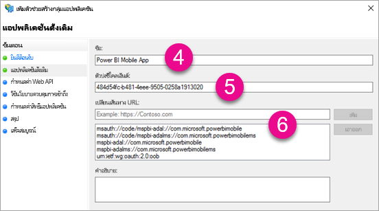
7. เลือก **ถัดไป**

8. ใส่ URL สำหรับเซิร์ฟเวอร์รายงานของคุณ URL นี้เป็น URL ภายนอกที่จะเข้าชม Web Application Proxy ของคุณ ซึ่งควรอยู่ในรูปแบบต่อไปนี้

   > [!NOTE]
   > URL นี้เป็นตัวพิมพ์ใหญ่-เล็ก

   *https://< report server url >/*

   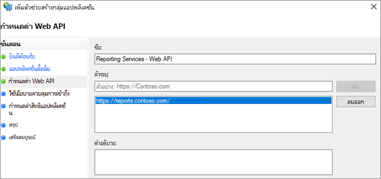
9. เลือก **ถัดไป**

10. เลือก**นโยบายการควบคุมการเข้าถึง**ที่เหมาะกับความต้องการขององค์กรของคุณ

    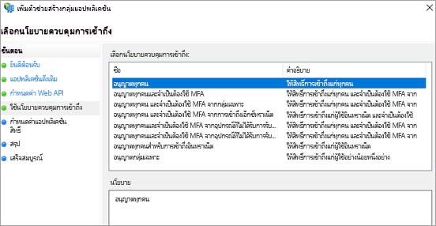

11. เลือก **ถัดไป**

12. เลือก **ถัดไป**

13. เลือก **ถัดไป**

14. เลือก**ปิด**

เมื่อเสร็จสมบูรณ์ คุณควรเห็นคุณสมบัติของกลุ่มแอปพลิเคชันของคุณที่คล้ายกับต่อไปนี้

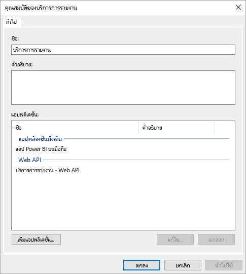

## <a name="web-application-proxy-wap-configuration"></a>การกำหนดค่า Web Application Proxy (WAP)

คุณต้องเปิดใช้งานบทบาท Windows ของ Web Application Proxy (ROLE) บนเซิร์ฟเวอร์ในสภาพแวดล้อมของคุณ ซึ่งต้องอยู่บนเซิร์ฟเวอร์ Windows 2016 สำหรับข้อมูลเพิ่มเติม ดู [Web Application Proxy ใน Windows Server 2016 ](https://technet.microsoft.com/windows-server-docs/identity/web-application-proxy/web-application-proxy-windows-server)และ[เผยแพร่แอปพลิเคชันโดยใช้การรับรองความถูกต้องล่วงหน้า AD FS](https://technet.microsoft.com/windows-server-docs/identity/web-application-proxy/publishing-applications-using-ad-fs-preauthentication#a-namebkmk14apublish-an-application-that-uses-oauth2-such-as-a-windows-store-app)

### <a name="constrained-delegation-configuration"></a>การกำหนดค่าการมอบหมายที่มีข้อจำกัด

เพื่อการเปลี่ยนจากการรับรองความถูกต้องของ OAuth เป็นการรับรองความถูกต้องของ Windows เราจำเป็นต้องใช้การมอบหมายที่มีข้อจำกัดด้วยการเปลี่ยนโพรโทคอล นี่คือส่วนหนึ่งของการกำหนดค่า Kerberos เราได้กำหนด SPN ของ Reporting Services SPN ภายในการกำหนดค่า Reporting Services แล้ว

เราต้องกำหนดค่าการมอบหมายที่มีข้อจำกัดบนบัญชีผู้ใช้ภายในเครื่องของเซิร์ฟเวอร์ WAP ภายใน Active Directory คุณอาจจำเป็นต้องทำงานกับผู้ดูแลโดเมนถ้าคุณไม่มีสิทธิ์ใน Active Directory

หากต้องการกำหนดค่าการมอบหมายที่มีข้อจำกัด คุณต้องทำตามขั้นตอนต่อไปนี้

1. บนเครื่องที่มีเครื่องมือ Active Directory ติดตั้งไว้แล้ว ให้เปิดใช้**ผู้ใช้และคอมพิวเตอร์ Active Directory**

2. ค้นหาบัญชีผู้ใช้ภายในเครื่องสำหรับเซิร์ฟเวอร์ WAP ของคุณ ตามค่าเริ่มต้น บัญชีผู้ใช้ดังกล่าวจะอยู่ในคอนเทนเนอร์ของคอมพิวเตอร์

3. คลิกขวาที่เซิร์ฟเวอร์ WAP และไปที่ **คุณสมบัติ**

4. เลือกแถบ **การมอบหมาย**

5. เลือก**เชื่อถือคอมพิวเตอร์เครื่องนี้สำหรับการมอบหมายบริการที่ระบุเท่านั้น**แล้วเลือก**ใช้โพรโทคอลการรับรองความถูกต้องใด ๆ**

   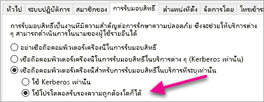

   ซึ่งเป็นการตั้งค่าการมอบหมายที่มีข้อจำกัดสำหรับบัญชีผู้ใช้ภายในเครื่องของเซิร์ฟเวอร์ WAP เราจึงต้องระบุบริการที่เครื่องนี้ได้รับอนุญาตให้ผู้รับมอบสิทธิ์

6. เลือก**เพิ่ม...** ด้านล่างกล่องบริการ

   

7. เลือก**ผู้ใช้หรือคอมพิวเตอร์...**

8. ใส่บัญชีผู้ใช้บริการที่คุณกำลังใช้สำหรับ Reporting Services บัญชีนี้คือบัญชีที่คุณเพิ่ม SPN เข้าไปภายในการกำหนดค่า Reporting Services

9. เลือก SPN สำหรับ Reporting Services จากนั้น เลือก**ตกลง**

   > [!NOTE]
   > คุณอาจเห็นเพียง NetBIOS SPN ซึ่งแท้จริงแล้วจะเลือกทั้ง NetBIOS และ FQDN SPNs ถ้ามีอยู่ทั้งสอง

   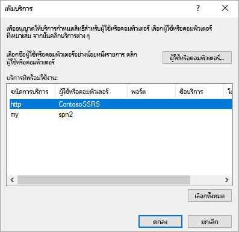

10. ผลลัพธ์ควรมีลักษณะคล้ายกับต่อไปนี้เมื่อมีการเลือกกล่องกาเครื่องหมาย**ขยาย**

    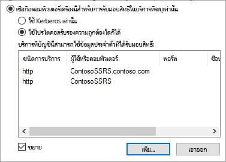

11. เลือก**ตกลง**

### <a name="add-wap-application"></a>เพิ่มแอปพลิเคชัน WAP

ในขณะที่คุณสามารถเผยแพร่แอปพลิเคชันภายในคอนโซลการจัดการการเข้าถึงรายงาน เราจะต้องสร้างแอปพลิเคชันผ่านทาง PowerShell นี่คือคำสั่งเพื่อเพิ่มแอปพลิเคชัน

```powershell
Add-WebApplicationProxyApplication -Name "Contoso Reports" -ExternalPreauthentication ADFS -ExternalUrl https://reports.contoso.com/ -ExternalCertificateThumbprint "0ff79c75a725e6f67e3e2db55bdb103efc9acb12" -BackendServerUrl https://ContosoSSRS/ -ADFSRelyingPartyName "Reporting Services - Web API" -BackendServerAuthenticationSPN "http/ContosoSSRS.contoso.com" -UseOAuthAuthentication
```

| พารามิเตอร์ | ข้อคิดเห็น |
| --- | --- |
| **ADFSRelyingPartyName** |ชื่อ API เว็บที่คุณสร้างขึ้นเป็นส่วนหนึ่งของกลุ่มแอปพลิเคชันภายใน ADFS |
| **ExternalCertificateThumbprint** |ใบรับรองที่จะใช้สำหรับผู้ใช้ภายนอก เป็นสิ่งสำคุัญมากที่ใบรับรองนั้นจะต้องถูกต้องสำหรับการใช้งานบนอุปกรณ์เคลื่อนที่และมาจากผู้ออกใบรับรองที่เชื่อถือได้ |
| **BackendServerUrl** |URL ไปยังเซิร์ฟเวอร์รายงานจากเซิร์ฟเวอร์ WAP ถ้าเซิร์ฟเวอร์ WAP อยู่ใน DMZ คุณอาจต้องใช้ชื่อโดเมนแบบเต็ม ตรวจสอบให้แน่ใจว่าคุณสามารถเข้าชม URL นี้จากเว็บเบราว์เซอร์บนเซิร์ฟเวอร์ WAP |
| **BackendServerAuthenticationSPN** |SPN ที่คุณสร้างขึ้นเป็นส่วนหนึ่งของการกำหนดค่า Reporting Services |

### <a name="setting-integrated-authentication-for-the-wap-application"></a>ตั้งค่าการรับรองความถูกต้องรวมสำหรับแอปพลิเคชัน WAP

หลังจากที่คุณเพิ่มแอปพลิเคชัน WAP คุณต้องตั้งค่า BackendServerAuthenticationMode เพื่อใช้ IntegratedWindowsAuthentication คุณต้องใช้ ID จากแอปพลิเคชัน WAP เพื่อตั้งค่า

```powershell
Get-WebApplicationProxyApplication “Contoso Reports” | fl
```


เรียกใช้คำสั่งต่อไปนี้เพื่อตั้งค่า BackendServerAuthenticationMode โดยใช้ ID ของแอปพลิเคชัน WAP

```powershell
Set-WebApplicationProxyApplication -id 30198C7F-DDE4-0D82-E654-D369A47B1EE5 -BackendServerAuthenticationMode IntegratedWindowsAuthentication
```


## <a name="connecting-with-the-power-bi-mobile-app"></a>เชื่อมต่อกับแอป Power BI สำหรับอุปกรณ์เคลื่อนที่

ภายในแอป Power BI สำหรับอุปกรณ์เคลื่อนที่ คุณต้องเชื่อมต่อกับอินสแตนซ์ Reporting Services ของคุณ เมื่อต้องการทำเช่นนั้น ให้ใส่ **URL ภายนอก**สำหรับแอปพลิเคชัน WAP ของคุณ

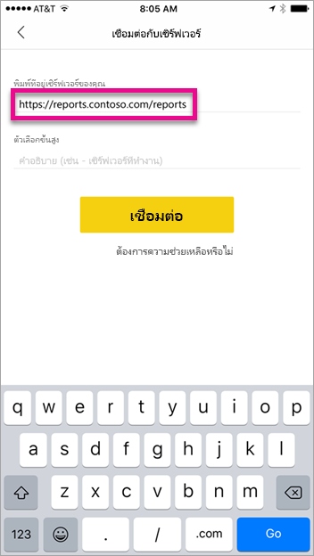

เมื่อคุณเลือก **เชื่อมต่อ** ระบบจะนำทางคุณไปยังหน้าการลงชื่อเข้าใช้ ADFS ของคุณ ใส่ข้อมูลประจำตัวที่ถูกต้องสำหรับโดเมนของคุณ

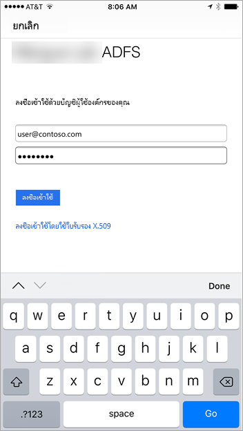

หลังจากที่คุณเลือก **ลงชื่อเข้าใช้** คุณจะเห็นองค์ประกอบจากเซิร์ฟเวอร์ Reporting Services ของคุณ

## <a name="multi-factor-authentication"></a>การรับรองตัวตนแบบหลายปัจจัย

คุณสามารถเปิดใช้งานการรับรองความถูกต้องแบบหลายปัจจัยเพื่อเปิดใช้งานความปลอดภัยเพิ่มเติมสำหรับสภาพแวดล้อมของคุณ เมื่อต้องการเรียนรู้เพิ่มเติม ดู[กำหนดค่า AD FS 2016 และ Azure MFA](https://technet.microsoft.com/windows-server-docs/identity/ad-fs/operations/configure-ad-fs-2016-and-azure-mfa)

## <a name="troubleshooting"></a>การแก้ไขปัญหา

### <a name="you-receive-the-error-failed-to-login-to-ssrs-server"></a>คุณได้รับข้อผิดพลาดว่า “ไม่สามารถเข้าสู่ระบบเซิร์ฟเวอร์ SSRS”

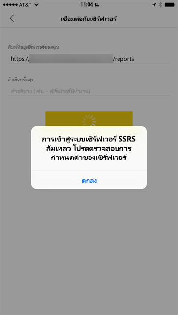

คุณสามารถตั้งค่า [Fiddler](https://www.telerik.com/fiddler) เพื่อทำหน้าที่เป็นพร็อกซีสำหรับอุปกรณ์เคลื่อนที่ของคุณเพื่อดูว่าการร้องขอไปได้ไกลเท่าใด เพื่อเปิดใช้งานพร็อกซี Fiddler สำหรับอุปกรณ์โทรศัพท์ของคุณ คุณต้องตั้งค่า [CertMaker สำหรับ iOS และ Android](https://www.telerik.com/fiddler/add-ons) บนเครื่องที่เรียกใช้ Fiddler Add-on จาก Telerik สำหรับ Fiddler

หากการลงชื่อเข้าใช้สำเร็จเรียบร้อยเมื่อใช้ Fiddler คุณอาจมีใบรับรองที่ออกพร้อมกับแอปพลิเคชัน WAP หรือเซิร์ฟเวอร์ ADFS 

## <a name="next-steps"></a>ขั้นตอนถัดไป

[ลงทะเบียนชื่อบริการหลัก (SPN) สำหรับเซิร์ฟเวอร์รายงาน](https://msdn.microsoft.com/library/cc281382.aspx)  
[ปรับเปลี่ยนแฟ้มการกำหนดค่า Reporting Services](https://msdn.microsoft.com/library/bb630448.aspx)  
[กำหนดค่าการรับรองความถูกต้องของ Windows บนเซิร์ฟเวอร์รายงาน](https://msdn.microsoft.com/library/cc281253.aspx)  
[Active Directory Federation Services](https://technet.microsoft.com/windows-server-docs/identity/active-directory-federation-services)  
[Web Application Proxy ใน Windows Server 2016](https://technet.microsoft.com/windows-server-docs/identity/web-application-proxy/web-application-proxy-windows-server)  
[เผยแพร่แอปพลิเคชันโดยใช้การรับรองความถูกต้องล่วงหน้า AD FS](https://technet.microsoft.com/windows-server-docs/identity/web-application-proxy/publishing-applications-using-ad-fs-preauthentication#a-namebkmk14apublish-an-application-that-uses-oauth2-such-as-a-windows-store-app)  
[กำหนดค่า AD FS 2016 และ Azure MFA](https://technet.microsoft.com/windows-server-docs/identity/ad-fs/operations/configure-ad-fs-2016-and-azure-mfa)  
มีคำถามเพิ่มเติมหรือไม่ [ลองไปที่ชุมชน Power BI](https://community.powerbi.com/)
