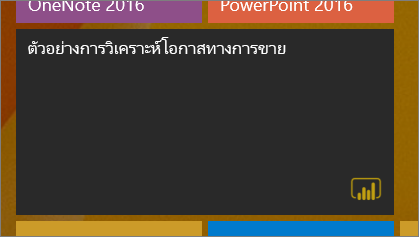
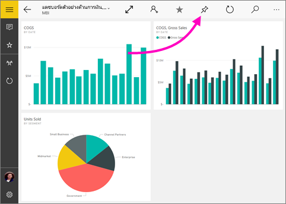
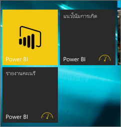

# ปักหมุดแดชบอร์ดลงในหน้าจอเริ่มต้นของ Windows 10 ของคุณจากแอป Power BI บนอุปกรณ์เคลื่อนที่
คุณสามารถปักหมุดแดชบอร์ด Power BI ลงในหน้าจอเริ่มต้นของ Windows จากแอป Power BI บนอุปกรณ์เคลื่อนที่สำหรับ Windows 10 สิ่งเหล่านั้นจะกลายเป็น*ไทล์รายงานสด* เมื่อคุณแตะไทล์บนหน้าจอเริ่มต้น แดชบอร์ดจะที่เปิดขึ้นในแอป Power BI บนอุปกรณ์เคลื่อนที่สำหรับ Windows 10

## ปักหมุดแดชบอร์ดเป็นไทล์รายงานสดลงในหน้าจอเริ่มต้นของคุณ
1. เปิดแดชบอร์ด
2. แตะ**ปักหมุดเพื่อเริ่มต้น** 
   
   
   
   ไปที่หน้าจอเริ่มต้นอุปกรณ์ของคุณเพื่อดูไทล์รายงานสด
   
   

## ขั้นตอนถัดไป
* [ดาวน์โหลดแอป Power BI บนอุปกรณ์เคลื่นที่สำหรับ Windows 10](http://go.microsoft.com/fwlink/?LinkID=526478)จาก Windows Store  
* [เริ่มต้นใช้งานแอป Power BI สำหรับอุปกรณ์เคลื่อนที่สำหรับ Windows 10](mobile-windows-10-phone-app-get-started.md)  
* [Power BI คืออะไร](../../fundamentals/power-bi-overview.md)
* มีคำถามหรือไม่ [ลองถามชุมชน Power BI](http://community.powerbi.com/)

