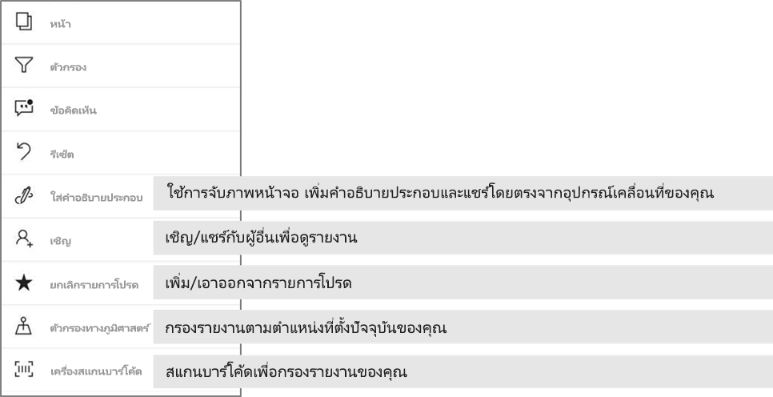

# สำรวจรายงานในแอปอุปกรณ์เคลื่อนที่ Power BI
นำไปใช้กับ:

|  |  |  |  |  |
|:--- |:--- |:--- |:--- |:--- |
| iPhone |iPad |โทรศัพท์ Android |แท็บเล็ต Android |อุปกรณ์ Windows 10 |

รายงาน Power BI คือ มุมมองแบบโต้ตอบของข้อมูลของคุณที่มีการแสดงผลด้วยภาพที่แสดงการค้นพบและข้อมูลเชิงลึกแตกต่างจากข้อมูลนั้น การดูรายงานในแอปอุปกรณ์เคลื่อนที่ Power BI เป็นขั้นตอนที่สามในกระบวนการแบบสามขั้นตอน

1. [สร้างรายงานใน Power BI Desktop](../../desktop-report-view.md) คุณยังสามารถ [ปรับรายงานให้เหมาะสมสำหรับโทรศัพท์](mobile-apps-view-phone-report.md) ใน Power BI Desktop ได้ 
2. เผยแพร่รายงานเหล่านั้นไปยังบริการ Power BI [(https://powerbi.com)](https://powerbi.com)หรือ[เซิร์ฟเวอร์รายงาน Power BI](../../report-server/get-started.md)  
3. จากนั้น โต้ตอบกับรายงานเหล่านั้นในแอปอุปกรณ์เคลื่อนที่ Power BI

## เปิดรายงาน Power BI ในแอปอุปกรณ์เคลื่อนที่
รายงาน Power BI ถูกเก็บไว้ในตำแหน่งที่ต่างกันในแอปอุปกรณ์เคลื่อนที่ตามตำแหน่งที่คุณได้รับรายงานเหล่านั้น รายงานเหล่านั้นอาจอยู่ในแอป แชร์กับฉัน พื้นที่ทำงาน (รวมถึงพื้นที่ทำงานขงฉัน) หรือบนเซิร์ฟเวอร์รายงานได้ ในบางครั้ง คุณเข้าถึงแดชบอร์ดที่เกี่ยวข้องเพื่อเข้าถึงรายงาน และในบางครั้ง ก็มีแสดงรายการไว้

ในรายการและเมนู คุณจะพบไอคอนถัดจากชื่อรายงาน ช่วยให้คุณเข้าใจว่า รายการนี้เป็นรายงาน 

 

มีไอคอนที่สองสำหรับรายงานในแอป Power BI Mobile:

*  ระบุรายงานที่จะแสดงในแนวนอนในแอป และจะมีลักษณะเดียวกับที่ในเบราว์เซอร์

*  ระบุรายงานที่มีอย่างน้อยหนึ่งรายงานที่ปรับให้เหมาะสมหน้าโทรศัพท์ ที่จะแสดงในแนวตั้ง 

หมายเหตุ: ถือโทรศัพท์ของคุณในแนวนอน คุณจะสามารถรับเค้าโครงแนวนอน แม้ว่าหน้ารายงานมีเค้าโครงโทรศัพท์ 

เมื่อต้องเข้าถึงรายงานจากแดชบอร์ด แตะจุดไข่ปลา (...) ในมุมขวาบนของไทล์ > **เปิดรายงาน**
  
  
  
  ไม่ใช่ไทล์ทั้งหมดที่มีตัวเลือกเปิดในรายงาน ตัวอย่างเช่น ไทล์ที่สร้างขึ้นโดยการถามคำถามในกล่องการถามตอบจะไม่เปิดรายงานเมื่อคุณแตะ 
  
## โต้ตอบกับรายงาน
เมื่อคุณมีรายงานที่เปิดในแอป คุณสามารถเริ่มต้นทำงาน มีหลายสิ่งที่คุณสามารถทำกับรายงานของคุณและข้อมูล ในส่วนท้ายของรายงาน คุณจะพบการดำเนินการคุณสามารถทำ ในรายงาน และ โดยการแตะและแตะยาวบนข้อมูลที่แสดงในรายงานคุณสามารถแบ่งส่วน และ dice ข้อมูล

### ใช้แตะ แล้วแตะยาว
แตะเท่ากับการใช้เมาส์คลิก ดังนั้น ถ้าคุณต้องการข้ามเน้นรายงานที่ยึดตามจุดข้อมูล แตะที่จุดข้อมูล
แตะค่าตัวแบ่งส่วนข้อมูล ทำให้ค่าที่เลือกและการแบ่งส่วนเหลือของรายงานตามค่านั้น แตะบนลิงก์ ปุ่มหรือที่คั่นหน้าจะเปิดใช้งานตามการดำเนินการที่กำหนด โดยผู้เขียน

คุณอาจสังเกตเห็นว่า เมื่อคุณเคาะบนวิชวล เส้นขอบปรากฏขึ้น ที่มุมบนขวาของเส้นขอบ คือจุดไข่ปลา (...) แตะบนนั้นจะแสดงเมนูที่ มีการดำเนินการที่คุณสามารถทำได้บนภาพนั้น

### แนะนำเครื่องมือและดูรายละเอียดการดำเนินการ

เมื่อคุณนานแตะ (แตะค้างไว้) จุดข้อมูล คำแนะนำจะแสดงค่าจุดข้อมูลนี้แสดงการนำเสนอ 

ผู้เขียนรายงานสามารถกำหนดลำดับชั้นในข้อมูลและความสัมพันธ์ระหว่างหน้ารายงาน ลำดับชั้นให้ลึก เจาะขึ้น และดูรายละเอียดหน้ารายงานอื่นจากวิชวลและค่า ดังนั้น เมื่อคุณแตะยาวค่า นอกเหนือจากการแนะนำเครื่องมือ ตัวเลือกดูรายละเอียดที่เกี่ยวข้องจะปรากฏในส่วนท้าย 

ด้วย *drillthrough* (การเข้าถึงรายละเอียด) เมื่อคุณแตะส่วนของวิชวล Power BI จะนำคุณไปยังหน้าอื่นในรายงาน ที่กรองด้วยค่าที่คุณแตะ  ผู้สร้างรายงานสามารถกำหนดหนึ่งหรือหลายตัวเลือกสำหรับการ drillthrough ซึ่งแต่ละตัวเลือกจะพาคุณไปยังรายงานคนละหน้า ในกรณีดังกล่าว คุณสามารถเลือกว่าคุณต้องการเข้าถึงรายละเอียดตัวไหน ปุ่มย้อนกลับนำคุณกลับไปยังหน้ารายงานก่อนหน้า

อ่านเกี่ยวกับวิธีการ[เพิ่ม drill-through ใน Power BI Desktop](../../desktop-drillthrough.md)
   
   > [!IMPORTANT]
   > ในแอป Power BI Mobile ดูรายละเอียดในวิชวลเมทริกซ์และตารางจะเปิดใช้งาน ผ่านค่าเซลล์เท่านั้น และ โดยส่วนหัวของคอลัมน์และแถวไม่
   
   
   
### ใช้การดำเนินการในส่วนท้ายของรายงาน
ส่วนท้ายของรายงานมีการดำเนินการที่คุณสามารถทำได้ บนหน้ารายงานปัจจุบัน หรือ ในรายงานทั้งหมด ท้ายกระดาษที่มีสิทธิ์เข้าถึงด่วนการกระทำประโยชน์สูงสุด และการดำเนินการทั้งหมดสามารถเข้าถึงจากจุดไข่ปลา (...)

การดำเนินการที่คุณสามารถดำเนินการจากท้ายกระดาษคือ:
1) รีเซ็ตตัวกรองรายงาน และข้ามไฮไลต์ส่วนที่เลือกกลับไปเป็นสถานะเดิม
2) เปิดบานหน้าต่างการสนทนาเพื่อดู หรือเพิ่มข้อคิดเห็นบนรายงานนี้
3) เปิดบานหน้าต่างตัวกรองเพื่อดู และปรับเปลี่ยนตัวกรองที่นำไปใช้ในรายงานในขณะนี้
4) รายการหน้าทั้งหมดในรายงานนี้ แตะบนหน้าชื่อจะโหลด และนำเสนอหน้านั้น
ย้ายระหว่างหน้ารายงานสามารถทำได้ โดยการปัดจากขอบของหน้าจอของคุณไปยังศูนย์
5) ดูการดำเนินการรายงานทั้งหมด

#### การดำเนินการรายงานทั้งหมด
แตะบน... ตัวเลือกในส่วนท้ายของรายงาน จะนำการดำเนินการทั้งหมดที่คุณสามารถดำเนินการในรายงาน 

การดำเนินการบางอย่างอาจถูกปิดใช้งาน เนื่องจากพวกเขาจะขึ้นอยู่กับความสามารถของรายงานที่เฉพาะเจาะจง
ตัวอย่างเช่น:
1) **กรองตามตำแหน่งที่ตั้งปัจจุบัน**จะเปิดใช้งานถ้าประเภทของข้อมูลในรายงานของคุณ โดยผู้เขียนมีข้อมูลทางภูมิศาสตร์ [เรียนรู้วิธีการระบุข้อมูลทางภูมิศาสตร์ในรายงานของคุณ](https://docs.microsoft.com/power-bi/desktop-mobile-geofiltering)
2) **สแกนเพื่อกรองรายงานตามบาร์โค้ด**จะเปิดใช้งานเท่านั้นถ้าชุดข้อมูลในรายงานของคุณไม่จำเป็นบาร์โค้ด [วิธีแท็กบาร์โค้ดใน Power BI Desktop](https://docs.microsoft.com/power-bi/desktop-mobile-barcodes) 
3) **เชิญ**จะเปิดใช้งานเท่านั้นถ้าคุณมีสิทธิ์ในการแชร์รายงานนี้กับผู้อื่น คุณจะมีสิทธิ์เท่านั้น ถ้าคุณเป็นเจ้าของรายงาน หรือ ถ้าคุณได้รับสิทธิ์การแชร์ต่อได้ โดยเจ้าของ
4) **ใส่คำอธิบายประกอบ และแชร์**อาจถูกปิดใช้งานถ้าไม่มีแอ[นโยบายการป้องกัน Intune](https://docs.microsoft.com/intune/app-protection-policies)ในองค์กรของคุณที่ถูกห้ามแชร์จากแอป Power BI บนมือถือได้ 

## ขั้นตอนถัดไป
* [ดูและโต้ตอบกับรายงาน Power BI ที่ปรับให้เหมาะสมกับโทรศัพท์ของคุณ](mobile-apps-view-phone-report.md)
* [สร้างเวอร์ชันของรายงานที่ปรับให้เหมาะสมสำหรับโทรศัพท์](../../desktop-create-phone-report.md)
* มีคำถามหรือไม่ [ลองถามชุมชน Power BI](http://community.powerbi.com/)

