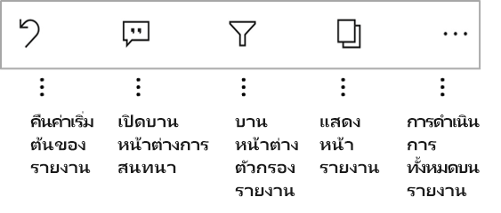

# สำรวจรายงานในแอปอุปกรณ์เคลื่อนที่ Power BI
นำไปใช้กับ:

|  |  |  |  |  |
|:---: |:---: |:---: |:---: |:---: |
| iPhone |iPad |โทรศัพท์ Android |แท็บเล็ต Android |อุปกรณ์ Windows 10 |

>[!NOTE]
>การสนับสนุนแอปอุปกรณ์เคลื่อนที่ Power BI สำหรับ **โทรศัพท์ที่ใช้ Windows 10 Mobile** จะถูกยกเลิกในวันที่ 16 มีนาคม 2021 [ศึกษาเพิ่มเติม](https://go.microsoft.com/fwlink/?linkid=2121400)

รายงาน Power BI คือมุมมองแบบโต้ตอบของข้อมูลของคุณ ที่มีการแสดงผลด้วยภาพที่แสดงการค้นพบและข้อมูลเชิงลึกแตกต่างจากข้อมูลนั้น การดูรายงานในแอปอุปกรณ์เคลื่อนที่ Power BI เป็นขั้นตอนที่สามในกระบวนการแบบสามขั้นตอน

1. [สร้างรายงานใน Power BI Desktop](../../create-reports/desktop-report-view.md) คุณยังสามารถ [ปรับรายงานให้เหมาะสมสำหรับโทรศัพท์](mobile-apps-view-phone-report.md) ใน Power BI Desktop ได้
2. เผยแพร่รายงานเหล่านั้นไปยังบริการ Power BI [(https://powerbi.com)](https://powerbi.com)หรือ[เซิร์ฟเวอร์รายงาน Power BI](../../report-server/get-started.md)  
3. โต้ตอบกับรายงานเหล่านั้นในแอปอุปกรณ์เคลื่อนที่ Power BI

## เปิดรายงาน Power BI ในแอปอุปกรณ์เคลื่อนที่
รายงาน Power BI ถูกเก็บไว้ในตำแหน่งที่ต่างกันในแอปอุปกรณ์เคลื่อนที่ตามตำแหน่งที่คุณได้รับรายงานเหล่านั้น รายงานเหล่านั้นอาจอยู่ในแอป แชร์กับฉัน พื้นที่ทำงาน (รวมถึงพื้นที่ทำงานขงฉัน) หรือบนเซิร์ฟเวอร์รายงานได้ ในบางครั้ง คุณเข้าถึงแดชบอร์ดที่เกี่ยวข้องเพื่อเข้าถึงรายงาน และในบางครั้ง ก็มีแสดงรายการไว้

ในรายการและเมนู คุณจะพบไอคอนถัดจากชื่อรายงาน ซึ่งช่วยให้คุณเข้าใจว่ารายการนี้คือรายงาน

มีสองไอคอนสำหรับรายงานในแอปสำหรับอุปกรณ์เคลื่อนที่ Power BI:

*  ระบุรายงานที่จะปรากฏในการจัดตำแหน่งตามแนวนอนในแอป ซึ่งจะมีลักษณะเหมือนกับการจัดตำแหน่งที่ปรากฏในเบราว์เซอร์

*  ระบุรายงานที่มีหน้ารายงานที่ปรับให้เหมาะสมสำหรับโทรศัพท์อย่างน้อยหนึ่งหน้า ซึ่งจะแสดงในการจัดตำแหน่งตามแนวตั้ง

> [!NOTE]
> เมื่อคุณถือโทรศัพท์ของคุณตามการจัดตำแหน่งในแนวนอน คุณจะได้รับเค้าโครงแนวนอนเสมอ แม้ว่าหน้ารายงานจะมีเค้าโครงแบบอุปกรณ์มือถือก็ตาม

หากต้องการรับรายงานจากแดชบอร์ด ให้แตะที่**ตัวเลือกเพิ่มเติม** (...) ตรงมุมขวาบนของไทล์ จากนั้นจึงแตะที่ **เปิดรายงาน**:
  
  
  
  ไม่สามารถเปิดไทล์ทั้งหมดเป็นรายงานได้ ตัวอย่างเช่น ไทล์ที่สร้างขึ้นเมื่อคุณถามคำถามในกล่องการถามตอบจะไม่เปิดรายงานเมื่อคุณแตะ
  
## โต้ตอบกับรายงาน
หลังจากที่คุณมีรายงานที่เปิดในแอปแล้ว คุณสามารถเริ่มทำงานกับรายงานดังกล่าวได้ คุณสามารถดำเนินงานได้หลายรูปแบบด้วยรายงานและข้อมูลในรายงาน ในส่วนท้ายของรายงาน คุณจะพบการดำเนินการซึ่งคุณสามารถใช้กับรายงานได้ ด้วยการแตะและการแตะยาวบนข้อมูลที่แสดงในรายงาน คุณยังสามารถแบ่งส่วนและตัดข้อมูลได้

### การโต้ตอบแบบแตะครั้งเดียวเทียบกับการโต้ตอบแบบสองครั้ง
เมื่อคุณดาวน์โหลดแอป Power BI สำหรับอุปกรณ์เคลื่อนที่ จะมีการตั้งค่าสำหรับการโต้ตอบแบบแตะครั้งเดียว ซึ่งหมายความว่าเมื่อคุณแตะในวิชวลเพื่อทำการดำเนินการบางอย่างเช่น การเลือกรายการตัวแบ่งส่วนข้อมูล การเน้นข้าม การคลิกที่ลิงก์หรือปุ่ม ฯลฯ การแตะทั้งสองเลือกวิชวลและดำเนินการตามที่คุณต้องการ

ถ้าคุณต้องการ คุณสามารถสลับไปยังการโต้ตอบแบบแตะสองครั้งได้ ด้วยการแตะสองครั้ง การแตะครั้งแรกที่วิชวลเพื่อเลือก และจากนั้นแตะอีกครั้งในวิชวลเพื่อดำเนินการตามที่คุณต้องการ

เมื่อต้องการสลับไปยังการโต้ตอบแบบสองครั้งแตะหรือสลับกลับไปยังการโต้ตอบแบบแตะครั้งเดียว ให้ไปที่[การตั้งค่าการโต้ตอบของแอป](./mobile-app-interaction-settings.md)

### เลือกแบบครั้งเดียวเมื่อเทียบกับโหมดเลือกแบบหลายรายการสำหรับการเลือกจุดข้อมูล

ในรายงาน คุณสามารถแตะที่จุดข้อมูลเพื่อเลือก คุณสามารถเลือกว่าคุณต้องการใช้โหมดเลือกแบบครั้งเดียวหรือเลือกแบบหลายรายการ ในโหมดเลือกแบบครั้งเดียว เมื่อคุณแตะจุดข้อมูลเพื่อเลือก การเลือกนั้นจะแทนที่การเลือกก่อนหน้าใดๆ ที่คุณได้ทำไว้ ในโหมดเลือกแบบหลายรายการ เมื่อคุณแตะจุดข้อมูลเพื่อเลือก การเลือกของคุณจะถูก*เพิ่ม*ไปยังการเลือกใดๆ ที่คุณมีอยู่ในขณะนี้และผลลัพธ์รวมของการเลือกทั้งหมดของคุณจะได้รับการเน้นในภาพทั้งหมดของรายงาน

หากต้องการยกเลิกการเลือกจุดข้อมูล เพียงแค่แตะอีกครั้ง

เมื่อต้องการสลับไปมาระหว่างโหมดการเลือกแบบครั้งเดียวและเลือกแบบหลายรายการ ให้ไปที่[การตั้งค่าการโต้ตอบแอป](./mobile-app-interaction-settings.md)

### การใช้การแตะและการแตะแบบยาว
การแตะจะเหมือนกับการคลิกเมาส์ ดังนั้นถ้าคุณต้องการไฮไลท์รายงานแบบเชื่อมโยงตามจุดข้อมูล ให้แตะจุดข้อมูลนั้น
เมื่อคุณแตะค่าตัวแบ่งส่วนข้อมูล ค่าจะถูกเลือกและส่วนที่เหลือของรายงานจะแบ่งอตามค่านั้น
เมื่อคุณแตะที่ลิงก์ ปุ่ม หรือบุ๊กมาร์ก การดำเนินการที่ผู้สร้างรายงานกำหนดไว้จะเกิดขึ้น

คุณอาจสังเกตเห็นว่าเมื่อคุณแตะบนการแสดงผลด้วยภาพ เส้นขอบจะปรากฏขึ้น ที่มุมบนขวาของเส้นขอบ คุณจะเห็น**ตัวเลือกเพิ่มเติม** (...) ถ้าคุณแตะจุดไข่ปลา คุณจะเห็นเมนูการดำเนินการที่คุณสามารถทำได้ใการแสดงผลด้วยภาพนั้น:

### คำแนะนำเครื่องมือและการดำเนินการเจาะรายละเอียด
เมื่อคุณแตะเป็นเวลานาน (แตะค้างไว้) ที่จุดข้อมูล คำแนะนำเครื่องมือซึ่งระบุค่าที่แสดงจุดข้อมูลจะปรากฏขึ้น

ถ้าผู้สร้างรายงานกำหนดค่าคำแนะนำเครื่องมือของหน้ารายงาน คำแนะนำเครื่องมือค่าเริ่มต้นจะถูกแทนที่ด้วยคำแนะนำเครื่องมือของหน้ารายงาน:

> [!NOTE]
> คำแนะนำเครื่องมือรายงานรองรับอุปกรณ์ที่มีวิวพอร์ต 640 พิกเซลและ 320 พิกเซล ถ้าอุปกรณ์ของคุณมีขนาดเล็กกว่า แอปจะแสดงคำแนะนำเครื่องมือค่าเริ่มต้น

ผู้สร้างรายงานสามารถกำหนดลำดับชั้นในข้อมูลและความสัมพันธ์ระหว่างหน้ารายงานต่าง ๆ ลำดับชั้นช่วยให้สามารถดูรายละเอียดแนวลึก ดูข้อมูลสรุป และลงรายละเอียดหน้ารายงานอื่นจากการแสดงผลด้วยภาพและค่าได้ ดังนั้น เมื่อคุณแตะแบบยาวที่ค่า นอกเหนือจากคำแนะนำเครื่องมือ ตัวเลือกการดูรายละเอียดที่เกี่ยวข้องจะปรากฏในส่วนท้าย:

เมื่อคุณแตะส่วนที่เฉพาะเจาะจงของการแสดงผลด้วยภาพ จากนั้นจึงแตะตัวเลือก *การเข้าถึงรายละเอียด* Power BI จะนำคุณไปยังหน้าอื่นในรายงาน ซึ่งกรองตามค่าที่คุณแตะ ผู้สร้างรายงานสามารถกำหนดหนึ่งหรือหลายตัวเลือกสำหรับการเข้าถึงรายละเอียด ซึ่งแต่ละตัวเลือกจะนำคุณไปยังรายงานคนละหน้า ในกรณีดังกล่าว คุณสามารถเลือกได้ว่าตัวเลือกใดที่คุณต้องการเข้าถึงรายละเอียด ปุ่มย้อนกลับจะนำคุณกลับไปยังหน้าก่อนหน้า

หากต้องการดูข้อมูลเพิ่มเติม กรุณาอ่านวิธีการ [เพิ่มการเข้าถึงรายละเอียดใน Power BI Desktop](../../create-reports/desktop-drillthrough.md)
   
   > [!IMPORTANT]
   > ในแอปสำหรับอุปกรณ์เคลื่อนที่ Power BI การดำเนินการดูรายละเอียดในเมทริกซ์และภาพตารางจะเปิดใช้งานผ่านค่าเซลล์เท่านั้น โดยไม่ผ่านคอลัมน์หรือส่วนหัวของแถว
   
   
   
### การใช้การดำเนินการในส่วนท้ายของรายงาน
จากส่วนท้ายของรายงาน คุณสามารถดำเนินการได้หลายอย่างบนหน้ารายงานปัจจุบันหรือในรายงานทั้งหมด ส่วนท้ายช่วยให้คุณสามารถเข้าถึงการดำเนินการที่ใช้บ่อยที่สุดได้อย่างรวดเร็ว คุณสามารถเข้าถึงการดำเนินการอื่น ๆ ได้โดยการแตะที่ปุ่ม**ตัวเลือกเพิ่มเติม** (...):

คุณสามารถดำเนินการเหล่านี้ได้จากส่วนท้าย:
* รีเซ็ตตัวกรองรายงานและการเลือกไฮไลต์แบบเชื่อมโยงกลับไปยังสถานะเดิม
* เปิดบานหน้าต่างการสนทนาเพื่อดูข้อคิดเห็น หรือเพิ่มข้อคิดเห็นไปที่รายงานนี้
* เปิดบานหน้าต่างตัวกรองเพื่อดูหรือปรับเปลี่ยนตัวกรองที่ถูกนำไปใช้ในรายงานในขณะนี้
* ระบุรายการหน้าต่าง ๆ ในรายงาน การแตะที่ชื่อหน้าจะโหลดและแสดงหน้านั้น
คุณสามารถย้ายระหว่างหน้ารายงานโดยการปัดนิ้วจากขอบของหน้าจอของคุณไปยังศูนย์กลาง
* ดูการดำเนินการทั้งหมดบนรายงาน

#### การดำเนินการทั้งหมดบนรายงาน
เมื่อคุณแตะที่ปุ่ม**ตัวเลือกเพิ่มเติม** (...) ในส่วนท้ายของรายงาน คุณจะเห็นการดำเนินการทั้งหมดที่คุณสามารถทำได้บนรายงาน:

การดำเนินการบางอย่างอาจถูกปิดใช้งาน ทั้งนี้ขึ้นอยู่กับความสามารถของรายงานที่ระบุ
ตัวอย่างเช่น:

**บุ๊กมาร์ก** จะปรากฏขึ้นเฉพาะเมื่อมีการตั้งค่า [บุ๊กมาร์ก](mobile-reports-in-the-mobile-apps.md#bookmarks) ในรายงาน ทั้งบุ๊กมาร์กส่วนตัวที่คุณสามารถกำหนดในบริการของ Power BI และบุ๊กมาร์กที่กำหนดโดยผู้สร้างรายงานจะแสดงขึ้น หากมีการกำหนดหนึ่งในบุ๊กมาร์กให้เป็นบุ๊กมาร์กค่าเริ่มต้นแล้ว รายงานจะเปิดไปยังมุมมองนั้นเมื่อโหลดรายงาน

**คำอธิบายประกอบและการแชร์** อาจปิดใช้งานถ้ามี [นโยบายการป้องกัน Intune](https://docs.microsoft.com/intune/app-protection-policies) ในองค์กรของคุณที่ห้ามการแชร์จากแอปอุปกรณ์เคลื่อนที่ Power BI

**เชิญ** จะถูกเปิดใช้งานเฉพาะเมื่อคุณมีสิทธิ์ในการแชร์รายงานกับผู้อื่นเท่านั้น คุณจะมีสิทธิ์เฉพาะในกรณีที่คุณเป็นเจ้าของรายงาน หรือถ้าเจ้าของให้สิทธิ์แก่คุณในการแชร์ต่อ

**การกรองตามตำแหน่งที่ตั้งปัจจุบัน**จะเปิดใช้งาน หากผู้สร้างรายงานจัดประเภทข้อมูลในรายงานด้วยข้อมูลทางภูมิศาสตร์ สำหรับข้อมูลเพิ่มเติม กรุณาอ่านเกี่ยวกับ[การระบุข้อมูลทางภูมิศาสตร์ในรายงาน](https://docs.microsoft.com/power-bi/desktop-mobile-geofiltering)

**สแกนเพื่อกรองรายงานตามบาร์โค้ด**จะเปิดใช้งานเฉพาะเมื่อมีการแท็กชุดข้อมูลในรายงานของคุณเป็น**บาร์โค้ด** สำหรับข้อมูลเพิ่มเติม กรุณาอ่านเกี่ยวกับ [การแท็กบาร์โค้ดใน Power BI Desktop](https://docs.microsoft.com/power-bi/desktop-mobile-barcodes)

### บุ๊กมาร์ก

แอป Power BI สำหรับอุปกรณ์เคลื่อนที่รองรับทั้งบุ๊กมาร์กรายงานซึ่งผู้สร้างรายงานได้กำหนดและบุ๊กมาร์กส่วนตัวที่ี่คุณสามารถกำหนดในบริการของ Power BI คุณสามารถค้นหาเมนูบุ๊กมาร์กภายใต้ **ตัวเลือกเพิ่มเติม** (...) บน [แถบเครื่องมือการดำเนินการรายงาน](mobile-reports-in-the-mobile-apps.md#all-report-actions)

บุ๊กมาร์กค่าเริ่มต้นจะถูกระบุด้วยไอคอนพิเศษ สำหรับบุ๊กมาร์กส่วนบุคคล คุณสามารถตั้งค่า ยกเลิกหรือเปลี่ยนการตั้งค่าเริ่มต้นโดยการแตะ **ตัวเลือกเพิ่มเติม (...)** ถัดจากบุ๊กมาร์กที่คุณต้องการเปลี่ยนแปลง และการเลือก **สร้างค่าเริ่มต้น** หรือ **ล้างข้อมูลค่าเริ่มต้น**

เมื่อมุมมองบุ๊กมาร์กของรายงานเปิดขึ้น ชื่อของบุ๊กมาร์กจะปรากฏที่ด้านบนของรายงาน

[เรียนรู้เพิ่มเติมเกี่ยวกับบุ๊กมาร์กในบริการ Power BI](https://docs.microsoft.com/power-bi/consumer/end-user-bookmarks)

## กำหนดค่าประสบการณ์การใช้งานของคุณด้วยรายงาน
แอป Power BI สำหรับอุปกรณ์เคลื่อนที่มีจำนวนการตั้งค่าที่ช่วยให้คุณสามารถควบคุมประสบการณ์การใช้งานรายงานของคุณได้ ในขณะนี้ คุณสามารถกำหนดค่า
* **การโต้ตอบกับวิชวลรายงาน**: คุณสามารถเลือกใช้การโต้ตอบแบบแตะครั้งเดียวหรือการโต้ตอบแบบแตะสองครั้ง
* **วิธีการรีเฟรชข้อมูล**: คุณสามารถเลือกที่จะใช้ปุ่มรีเฟรชหรือการดำเนินการแบบดึงลงสำหรับการรีเฟรชข้อมูลรายงานได้
* **การแสดงผลส่วนท้ายของรายงาน**: คุณสามารถเลือกที่จะแสดงส่วนท้ายที่เทียบชิดขอบที่จะมองเห็นได้เสมอ หรือส่วนท้ายแบบไดนามิกที่ซ่อนและปรากฏขึ้นใหม่ตามการดำเนินการของคุณ (ตัวอย่างเช่น การเลื่อน)

ดู [การตั้งค่าการโต้ตอบของแอป](./mobile-app-interaction-settings.md) สำหรับข้อมูลเกี่ยวกับวิธีการเปลี่ยนการตั้งค่าเหล่านี้

## ขั้นตอนถัดไป
* [ดูและโต้ตอบกับรายงาน Power BI ที่ปรับให้เหมาะสมกับโทรศัพท์ของคุณ](mobile-apps-view-phone-report.md)
* [สร้างเวอร์ชันของรายงานที่ปรับให้เหมาะสมที่สุดสำหรับโทรศัพท์แล้ว](../../create-reports/desktop-create-phone-report.md)
* มีคำถามหรือไม่ [ลองถามชุมชน Power BI](https://community.powerbi.com/)
