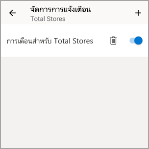

# ตั้งค่าการแจ้งเตือนข้อมูลในแอป Power BI สำหรับอุปกรณ์เคลื่อนที่
นำไปใช้กับ:

|  |  |  |  |  |
|:--- |:--- |:--- |:--- |:--- |
| iPhone |iPad |โทรศัพท์ Android |แท็บเล็ต Android |อุปกรณ์ Windows 10 |

คุณสามารถตั้งค่าการแจ้งเตือนบนแดชบอร์ดในแอป Power BI สำหรับอุปกรณ์เคลื่อนที่และในบริการของ Power BI ข้อความแจ้งเตือนจะเตือนคุณเมื่อมีการเปลี่ยนแปลงข้อมูลในไทล์เกินขีดจำกัดที่คุณตั้งค่า ข้อความแจ้งเตือนสำหรับไทล์ที่มีจำนวนเดียว เช่น บัตรและตัวประเมิน แต่ไม่มีข้อมูลการสตรีม คุณสามารถตั้งค่าการแจ้งเตือนข้อมูลบนอุปกรณ์เคลื่อนที่ของคุณ และดูเอกสารเหล่านั้นในบริการของ Power BI และกลับกันได้ มีเพียงคุณเท่านั้นที่สามารถดูการแจ้งเตือนข้อมูลที่คุณตั้งค่า แม้ว่าคุณแชร์แดชบอร์ดหรือสแนปช็อตของไทล์

คุณสามารถกำหนดการแจ้งเตือนหากคุณมีสิทธิ์การใช้งาน Power BI Pro หรือหากแดชบอร์ดที่แชร์กันอยู่ในความจุแบบพรีเมี่ยม 

> [!WARNING]
> การแจ้งเตือนข้อมูลแสดงข้อมูลของคุณ ถ้าอุปกรณ์ของคุณถูกขโมย เราขอแนะนำให้ไปยังบริการของ Power BI เพื่อปิดกฎการแจ้งเตือนทั้งหมดที่อิงข้อมูล 
> 
> เรียนรู้เพิ่มเติมเกี่ยวกับ[การจัดการการแจ้งเตือนข้อมูลในบริการของ Power BI](../../service-set-data-alerts.md)
> 
> 

## การแจ้งเตือนข้อมูลบน iPhone หรือ iPad
### ตั้งค่าการแจ้งเตือนบน iPhone หรือ iPad
1. แตะหมายเลขหรือไทล์ตัวประเมินในแดชบอร์ดเพื่อเปิดในโหมดโฟกัส  
   
   
2. แตะไอคอน bellเพื่อเพิ่มข้อความแจ้งเตือน  
3. แตะ**เพิ่มกฎการแจ้งเตือน**
   
   
4. เลือกรับการแจ้งเตือนที่มากหรือน้อยกว่าค่าหนึ่ง จากนั้นตั้งค่า
   
   
5. ตัดสินใจว่า จะรับการแจ้งเตือนเป็นรายชั่วโมงหรือรายวัน และเลือกว่าจะรับอีเมล์เมื่อคุณได้รับการแจ้งเตือนด้วยหรือไม่
   
   > [!NOTE]
   > คุณไม่ได้รับข้อความแจ้งเตือนทุกชั่วโมงหรือทุกวันเว้นแต่ว่าข้อมูลมีการรีเฟรชจริงในเวลานั้น
   > 
   > 
6. คุณสามารถเปลี่ยนชื่อเรื่องการแจ้งเตือนด้วย
7. แตะ**บันทึก**
8. ไทล์เดียวสามารถมีการแจ้งเตือนสำหรับค่าทั้งเหนือและต่ำกว่าค่าเกณฑ์ ใน**จัดการการแจ้งเตือน**แตะ**เพิ่มกฎการแจ้งเตือน**
   
   

### จัดการการแจ้งเตือนบน iPhone หรือ iPad ของคุณ
คุณสามารถจัดการการแจ้งเตือนแต่ละรายการบนอุปกรณ์เคลื่อนที่ของคุณ หรือ[จัดการการแจ้งเตือนของคุณทั้งหมดในบริการของ Power BI](../../service-set-data-alerts.md)ได้

1. ในแดชบอร์ด แตะตัวเลขหรือไทล์ตัวประเมินที่มีข้อความแจ้งเตือน  
   
   
2. แตะไอคอน bell   
3. แตะชื่อของการแจ้งเตือนเพื่อแก้ไข แตะตัวเลื่อนเพื่อปิดการแจ้งเตือนทางอีเมล์ หรือแตะถังขยะเพื่อลบการแจ้งเตือน
   
    

## การแจ้งเตือนข้อมูลบนอุปกรณ์ Android
### ตั้งค่าการแจ้งเตือนบนอุปกรณ์ Android
1. ในแดชบอร์ด Power BI แตะตัวเลขหรือไทล์ตัวประเมินเพื่อเปิด  
2. แตะไอคอน bellเพื่อเพิ่มข้อความแจ้งเตือน  
   
   
3. แตะไอคอนเครื่องหมายบวก (+)
   
   
4. เลือกเพื่อรับการแจ้งเตือนที่เหนือหรือต่ำกว่าค่าหนึ่ง และพิมพ์ค่า
   
   
5. แตะ**เสร็จสิ้น**
6. ตัดสินใจว่า จะรับการแจ้งเตือนเป็นรายชั่วโมงหรือรายวัน และเลือกว่าจะรับอีเมล์เมื่อคุณได้รับการแจ้งเตือนด้วยหรือไม่
   
   > [!NOTE]
   > คุณไม่ได้รับข้อความแจ้งเตือนทุกชั่วโมงหรือทุกวันเว้นแต่ว่าข้อมูลมีการรีเฟรชจริงในเวลานั้น
   > 
   > 
7. คุณสามารถเปลี่ยนชื่อเรื่องการแจ้งเตือนด้วย
8. แตะ**บันทึก**

### จัดการการแจ้งเตือนบนอุปกรณ์ Android
คุณสามารถจัดการการแจ้งเตือนแต่ละรายการในแอป Power BI สำหรับอุปกรณ์เคลื่อนที่หรือ[จัดการการแจ้งเตือนของคุณทั้งหมดในบริการของ Power BI](../../service-set-data-alerts.md) ได้

1. ในแดชบอร์ด แตะตัวเลขหรือไทล์ตัวประเมินที่มีข้อความแจ้งเตือน  
2. แตะไอคอน bell ทึบ  
3. แตะการแจ้งเตือนเพื่อเปลี่ยนแปลงค่า หรือปิดการแจ้งเตือน
   
    
4. แตะไอคอนเครื่องหมายบวก (+) เมื่อต้องเพิ่มการแจ้งเตือนอื่นให้ไทล์เดียวกัน
5. เมื่อต้องลบการแจ้งเตือนทั้งหมด แตะไอคอนถังขยะ

## การแจ้งเตือนข้อมูลบนอุปกรณ์ Windows
### ตั้งค่าการแจ้งเตือนข้อมูลบนอุปกรณ์ Windows
1. แตะหมายเลขหรือไทล์ตัวประเมินในแดชบอร์ดเพื่อเปิด  
2. แตะไอคอน bellเพื่อเพิ่มข้อความแจ้งเตือน  
   
   
3. แตะไอคอนเครื่องหมายบวก (+)
   
   
4. เลือกเพื่อรับการแจ้งเตือนที่เหนือหรือต่ำกว่าค่าหนึ่ง และพิมพ์ค่า
   
   
5. ตัดสินใจว่า จะรับการแจ้งเตือนเป็นรายชั่วโมงหรือรายวัน และเลือกว่าจะรับอีเมล์เมื่อคุณได้รับการแจ้งเตือนด้วยหรือไม่
   
   > [!NOTE]
   > คุณไม่ได้รับข้อความแจ้งเตือนทุกชั่วโมงหรือทุกวันเว้นแต่ว่าข้อมูลมีการรีเฟรชจริงในเวลานั้น
   > 
   > 
6. คุณสามารถเปลี่ยนชื่อเรื่องการแจ้งเตือนด้วย
7. แตะตัวกาเครื่องหมาย
8. ไทล์เดียวสามารถมีการแจ้งเตือนสำหรับค่าทั้งเหนือและต่ำกว่าค่าเกณฑ์ ใน**จัดการการแจ้งเตือน**แตะเครื่องหมายบวก (+)
   
   

### จัดการการแจ้งเตือนบนอุปกรณ์ Windows
คุณสามารถจัดการการแจ้งเตือนแต่ละรายการในแอป Power BI สำหรับอุปกรณ์เคลื่อนที่หรือ[จัดการการแจ้งเตือนของคุณทั้งหมดในบริการของ Power BI](../../service-set-data-alerts.md) ได้

1. ในแดชบอร์ด แตะตัวเลขหรือไทล์ตัวประเมินที่มีข้อความแจ้งเตือน  
2. แตะไอคอน bell   
   
   
3. แตะการแจ้งเตือนเพื่อเปลี่ยนแปลงค่า หรือปิดการแจ้งเตือน
   
    
4. เมื่อต้องลบการแจ้งเตือนทั้งหมด คลิกขวา หรือแตะ ค้าง > **ลบ**

## รับการแจ้งเตือน
คุณจะได้รับข้อความแจ้งเตือนใน [ศูนย์การแจ้งเตือน](mobile-apps-notification-center.md)ของ Power BI บนอุปกรณ์เคลื่อนที่ของคุณ หรือ ในบริการของ Power BI พร้อมกับการแจ้งเตือนเกี่ยวกับแดชบอร์ดใหม่่มีคนแชร์กับคุณ

แหล่งข้อมูลจะถูกตั้งค่าการรีเฟรชรายวัน แม้ว่าบางแหล่งข้อมูลจะมีการรีเฟรชบ่อยกว่า เมื่อข้อมูลในแดชบอร์ดได้รับการรีเฟรช ถ้าข้อมูลที่มีการติดตามถึงค่าเกณฑ์หนึ่งใดที่คุณตั้ง หลายสิ่งที่จะเกิดขึ้น

1. Power BI จะตรวจสอบเพื่อดูว่าเกินหนึ่งชั่วโมงหรือ 24 ชั่วโมงแล้วหรือไม่ (ขึ้นอยู่กับตัวเลือกที่คุณเลือก) นับตั้งแต่มีการส่งการแจ้งเตือนล่าสุด
   
   ตราบใดที่ข้อมูลเกินค่าเกณฑ์ คุณจะได้รับการแจ้งเตือนทุกชั่วโมงหรือทุกๆ 24 ชั่วโมง
2. ถ้าคุณได้ตั้งค่าการแจ้งเตือนให้ส่งอีเมล์ คุณจะพบสิ่งที่เหมือนสิ่งนี้้ในกล่องขาเข้าของคุณ
   
   
3. Power BI จะส่งข้อความไปยัง**ศูนย์การแจ้งเตือน**ของคุณและเพิ่มไอคอนการแจ้งเตือนใหม่ใหักับไทล์ที่เกี่ยวข้อง
4. แตะปุ่มนำทางส่วนกลางเมื่อต้องการ[เปิด**ศูนย์การแจ้งเตือน**ของคุณ ](mobile-apps-notification-center.md)และดูรายละเอียดการแจ้งเตือน
   
      

> [!NOTE]
> ข้อความแจ้งเตือนทำงานกับข้อมูลที่ได้รับการรีเฟรชเท่านั้น เมื่อมีการรีเฟรชข้อมูล Power BI จะค้นหาเพื่อดูว่าข้อความแจ้งเตือนถูกตั้งค่าสำหรับข้อมูลนั้นหรือไม่ ถ้าข้อมูลได้ถึงค่าเกณฑ์การแจ้งเตือน ข้อความแจ้งเตือนจะถูกเริ่ม
> 
> 

## เคล็ดลับและการแก้ไขปัญหา
* ข้อความแจ้งเตือนในขณะนี้ไม่ได้สนับสนุนไทล์ Bing หรือไทล์การ์ด ที่มีหน่วยวัดวันที่/เวลา
* ข้อความแจ้งเตือนจะทำงานกับข้อมูลตัวเลขเท่านั้น
* ข้อความแจ้งเตือนทำงานกับข้อมูลที่ได้รับการรีเฟรชเท่านั้น ข้อความแจ้งเตือนจะไม่ทำงานกับข้อมูลแบบคงที่
* ข้อความแจ้งเตือนจะไม่ทำงานกับไทล์ที่ประกอบด้วยข้อมูลสตรีม

## ขั้นตอนถัดไป
* [จัดการการแจ้งเตือนของคุณในบริการของ Power BI](../../service-set-data-alerts.md)
* [ศูนย์การแจ้งเตือนอุปกรณ์เคลื่อนที่ power BI](mobile-apps-notification-center.md)
* มีคำถามหรือไม่ [ลองถามชุมชน Power BI](http://community.powerbi.com/)

