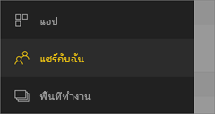

# แชร์แดชบอร์ดหรือรายงานจากแอปสำหรับอุปกรณ์เคลื่อนที่ Power BI
นำไปใช้กับ:

|  |  |  |  |  |
|:--- |:--- |:--- |:--- |:--- |
| iPhone |iPad |โทรศัพท์ Android |แท็บเล็ต Android |อุปกรณ์ Windows 10 |

ด้วย[สิทธิ์การใช้งาน Power BI Pro](../../service-features-license-type.md) คุณสามารถเชิญบุคคลอื่นเพื่อดูแดชบอร์ดและรายงานของคุณ โดยการแชร์ลิงก์จากแอปสำหรับอุปกรณ์เคลื่อนที่ Power BI ได้ คุณสามารถแชร์กับทุกคน ทั้งในและนอกองค์กรของคุณ ทั้งมีหรือไม่มีบัญชีอีเมลขององค์กร พวกเขาจำเป็นต้องมีสิทธิ์การใช้งาน Power BI Pro ด้วย หรือเนื้อหาจำเป็นต้องอยู่ใน[ความจุพรีเมียม](../../service-premium-what-is.md)

จากแอปสำหรับอุปกรณ์เคลื่อนที่ Power BI สำหรับ iOS และ Android คุณยังสามารถ[ใส่คำอธิบายประกอบ และแชร์สแนปช็อตของไทล์ รายงาน หรือวิชวล](mobile-annotate-and-share-a-tile-from-the-mobile-apps.md)กับทุกคนได้ 

## แชร์จาก iPhone ของคุณ
1. ในแถบการดำเนินการที่ด้านล่างของแดชบอร์ดหรือรายงาน แตะไอคอน**แชร์** 
   
   
2. พิมพ์รายชื่อ ที่คั่นด้วยเครื่องหมายจุลภาค และข้อความที่ส่งไปพร้อมกับคำเชิญของคุณ
3. เพื่ออนุญาตให้แชร์ต่อได้ ปล่อยตัวเลือก**อนุญาตให้ผู้รับแชร์ต่อ** ให้ยังคงถูกเลือก
   
   การแชร์ต่อ คือการอนุญาตให้เพื่อนร่วมงานของคุณ สามารถส่งต่ออีเมลเชิญให้กับผู้อื่นในองค์กรของคุณ ผ่านทางเว็บหรือผ่านแอปสำหรับอุปกรณ์เคลื่อนที่
5. แตะ**ส่ง**ที่มุมบนขวา
   
   ผู้รับจะได้รับอีเมลคำเชิญ ที่มีลิงก์ตรงไปยังแดชบอร์ดหรือรายงาน คำเชิญจะหมดอายุในอีกหนึ่งเดือน เมื่อพวกเขาเปิดลิงก์ในเบราว์เซอร์ หรือ ในแอปสำหรับอุปกรณ์เคลื่อนที่ Power BI แดชบอร์ดหรือรายงานจะถูกเพิ่มไปยังส่วน**แชร์กับฉัน**ของบัญชี Power BI ของพวกเขา
   
   
   
   อ่านเพิ่มเติม[บันทึกย่อเกี่ยวกับการแชร์กับเพื่อนร่วมงาน](../../service-share-dashboards.md)

### ยกเลิกการแชร์จาก iPhone ของคุณ
คุณสามารถยกเลิกการแชร์ถ้าคุณเป็นเจ้าของเท่านั้น

1. ในแถบการดำเนินการที่ด้านล่างของแดชบอร์ดหรือรายงาน แตะไอคอน**แชร์** 
2. แตะ**เชิญเพื่อนร่วมงาน**
   
   คุณจะเห็นรายการของเพื่อนร่วมงานที่คุณแชร์แดชบอร์ดหรือรายงาน ด้วยข้อความเหล่านี้:
   
   * **สามารถดู**: พวกเขาสามารถดู แต่แชร์ไม่ได้
   * **สามารถดู & เชิญ**: พวกเขาสามารถดู และแชร์กับเพื่อนร่วมงานอื่น ๆ ได้
1. แตะ**แก้ไข**
   
    
4. เมื่อต้องการยกเลิกการแชร์ แตะที่วงกลมสีแดงถัดจากชื่อ และแตะ**ลบ**

## แชร์จาก iPad ของคุณ
1. แตะไอคอน**แชร์**  ในมุมบนขวาของแดชบอร์ดหรือรายงานของคุณ
2. พิมพ์ที่อยู่อีเมล และข้อความที่ส่งไปพร้อมกับคำเชิญของคุณ
3. เพื่ออนุญาตให้แชร์ต่อได้ ปล่อยตัวเลือก**อนุญาตให้ผู้รับแชร์ต่อ** ให้ยังคงถูกเลือก
   
   การแชร์ต่อ คือการอนุญาตให้เพื่อนร่วมงานของคุณ สามารถส่งต่ออีเมลเชิญให้กับผู้อื่นในองค์กรของคุณ ผ่านทางเว็บหรือผ่านแอปสำหรับอุปกรณ์เคลื่อนที่ 

4. แตะ**ส่ง**ที่มุมบนขวา
   
   ผู้รับจะได้รับอีเมลคำเชิญ ที่มีลิงก์ตรงไปยังแดชบอร์ดหรือรายงาน คำเชิญจะหมดอายุในอีกหนึ่งเดือน เมื่อพวกเขาเปิดลิงก์ในเบราว์เซอร์ หรือ ในแอปสำหรับอุปกรณ์เคลื่อนที่ Power BI แดชบอร์ดหรือรายงานจะถูกเพิ่มไปยังส่วน**แชร์กับฉัน**ของบัญชี Power BI ของพวกเขา
   
   
   
   อ่านเพิ่มเติม[บันทึกย่อเกี่ยวกับการแชร์กับเพื่อนร่วมงาน](../../service-share-dashboards.md)

### ยกเลิกการแชร์จาก iPad ของคุณ
คุณสามารถยกเลิกการแชร์ถ้าคุณเป็นเจ้าของเท่านั้น

1. แตะไอคอน**แชร์**  ในมุมบนขวาของแดชบอร์ดหรือรายงานของคุณ
   
   คุณจะเห็นรายการของเพื่อนร่วมงานที่คุณแชร์แดชบอร์ดหรือรายงาน ด้วยข้อความเหล่านี้:
   
   * **สามารถดู**: พวกเขาสามารถดู แต่แชร์ไม่ได้
   * **สามารถดู & เชิญ**: พวกเขาสามารถดู และแชร์กับเพื่อนร่วมงานอื่น ๆ ได้
2. แตะ**แก้ไข**
3. เมื่อต้องการยกเลิกการแชร์ แตะที่วงกลมสีแดงถัดจากชื่อ และแตะ**ลบ**

## แชร์จากอุปกรณ์ Android ของคุณ
1. บนหน้าแรกของแดชบอร์ดหรือรายงาน แตะที่จุดไข่ปลา (...) แล้วแตะ**เชิญเพื่อนร่วมงาน**
   
   
2. หรือ ในแดชบอร์ดหรือรายงาน แตะไอคอนเชิญ .

    ถ้าคุณเป็นเจ้าของแดชบอร์ด คุณจะเห็นรายการของเพื่อนร่วมงานที่คุณแชร์แดชบอร์ดหรือรายงาน และข้อความเหล่านี้:

    -   **สามารถดู**: พวกเขาสามารถดู แต่แชร์ไม่ได้
    -   **สามารถดูและแชร์ซ้ำ**: พวกเขาสามารถดู และแชร์กับเพื่อนร่วมงานอื่น ๆ ได้

1. พิมพ์ที่อยู่อีเมล และข้อความที่ส่งไปพร้อมกับคำเชิญของคุณ มิฉะนั้น Power BI จะส่งข้อความเริ่มต้น
2. เพื่ออนุญาตให้แชร์ต่อได้ ปล่อยตัวเลือก**อนุญาตให้ผู้รับแชร์ต่อ** ให้ยังคงถูกเลือก
   
   การแชร์ต่อ คือการอนุญาตให้เพื่อนร่วมงานของคุณ สามารถส่งต่ออีเมลเชิญให้กับผู้อื่นในองค์กรของคุณ ผ่านทางเว็บหรือผ่านแอปสำหรับอุปกรณ์เคลื่อนที่
   
1. แตะไอคอน**ส่ง**  ในมุมขวาบนเพื่อส่งจดหมาย
   
   ผู้รับจะได้รับอีเมลคำเชิญ ที่มีลิงก์ตรงไปยังแดชบอร์ดหรือรายงาน คำเชิญจะหมดอายุในอีกหนึ่งเดือน เมื่อพวกเขาเปิดลิงก์ในเบราว์เซอร์ หรือ ในแอปสำหรับอุปกรณ์เคลื่อนที่ Power BI แดชบอร์ดหรือรายงานจะถูกเพิ่มไปยังส่วน**แชร์กับฉัน**ของบัญชี Power BI ของพวกเขา
   
   
   
   อ่านเพิ่มเติม[บันทึกย่อเกี่ยวกับการแชร์แดชบอร์ดกับเพื่อนร่วมงาน](../../service-share-dashboards.md)

### ยกเลิกการแชร์จากอุปกรณ์ Android ของคุณ
คุณสามารถยกเลิกการแชร์ถ้าคุณเป็นเจ้าของเท่านั้น

1. ในมุมขวาบนของแดชบอร์ดหรือรายงานของคุณ แตะไอคอนเชิญ . 
   
   คุณจะเห็นรายการของเพื่อนร่วมงานที่คุณแชร์แดชบอร์ดหรือรายงาน
2. เมื่อต้องหยุดการแชร์กับเพื่อนร่วมงาน แตะที่ **X** ถัดจากชื่อ \> **เอาออก**

## แชร์จากอุปกรณ์ Windows 10
1. ในแดชบอร์ดหรือรายงาน แตะไอคอนเชิญ .
   
   หรือบนหน้าแรกของแดชบอร์ดหรือรายงาน คลิกขวาหรือกดค้างไว้ และแตะ**เชิญ**
   
   
   
   ถ้าคุณเป็นเจ้าของแดชบอร์ด คุณจะเห็นรายการของเพื่อนร่วมงานที่คุณแชร์แดชบอร์ดหรือรายงาน มีบันทึกย่อเหล่านี้:
   
   **สามารถดู**: พวกเขาสามารถดู แต่แชร์ไม่ได้
   
   **สามารถดูและแชร์ซ้ำ**: พวกเขาสามารถดู และแชร์กับเพื่อนร่วมงานอื่น ๆ ได้
2. พิมพ์ที่อยู่อีเมล และข้อความที่ส่งไปพร้อมกับคำเชิญของคุณ มิฉะนั้น Power BI จะส่งข้อความเริ่มต้น
   
   
3. เพื่ออนุญาตให้แชร์ต่อได้ ปล่อยตัวเลือก**อนุญาตให้ผู้รับแชร์ต่อ** ให้ยังคงถูกเลือก
   
   การแชร์ต่อ คือการอนุญาตให้เพื่อนร่วมงานของคุณ สามารถส่งต่ออีเมลเชิญให้กับผู้อื่นในองค์กรของคุณ ผ่านทางเว็บหรือผ่านแอปสำหรับอุปกรณ์เคลื่อนที่
   
1. แตะไอคอน**ส่ง** 
   
   ผู้รับจะได้รับอีเมลคำเชิญ ที่มีลิงก์ตรงไปยังแดชบอร์ดหรือรายงาน คำเชิญจะหมดอายุในอีกหนึ่งเดือน เมื่อพวกเขาเปิดลิงก์ในเบราว์เซอร์ หรือ ในแอปสำหรับอุปกรณ์เคลื่อนที่ Power BI แดชบอร์ดหรือรายงานจะถูกเพิ่มไปยังส่วน**แชร์กับฉัน**ของบัญชี Power BI ของพวกเขา
   
   
   
   อ่านเพิ่มเติม[บันทึกย่อเกี่ยวกับการแชร์กับเพื่อนร่วมงาน](../../service-share-dashboards.md)

## ขั้นตอนถัดไป
* [ใส่คำอธิบายประกอบ และแชร์สแนปช็อตของไทล์ รายงาน หรือภาพในแอปสำหรับอุปกรณ์เคลื่อนที่](mobile-annotate-and-share-a-tile-from-the-mobile-apps.md)
* [แชร์แดชบอร์ดหรือรายงานใน Power BI](../../service-share-dashboards.md)
* คำถามหรือไม่ [ลองถามชุมชน Power BI](http://community.powerbi.com/)

