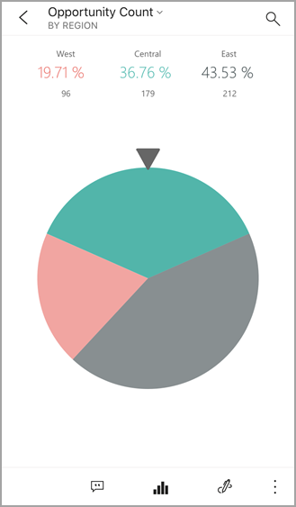

# สำรวจไทล์ในแอป Power BI สำหรับอุปกรณ์เคลื่อนที่
นำไปใช้กับ:

|  |  |  |  |  |
|:--- |:--- |:--- |:--- |:--- |
| iPhone |iPad |โทรศัพท์ Android |แท็บเล็ต Android |อุปกรณ์ Windows 10 |

ไทล์คือสแนปช็อตแบบสดของข้อมูลของคุณ ที่ปักหมุดไว้ที่แดชบอร์ด ค่าของไทล์จะเปลี่ยนเมื่อมีการเปลี่ยนแปลงข้อมูล **คุณ[เพิ่มไทล์ไปยังแดชบอร์ดในบริการของ Power BI](../end-user-tiles.md)** 

จากนั้นในแอป Power BI สำหรับอุปกรณ์เคลื่อนที่ ให้คุณเปิดไทล์ในโหมดโฟกัส และโต้ตอบกับไทล์นั้น คุณสามารถเปิดไทล์ด้วยการแสดงผลด้วยภาพ รวมถึงไทล์ตาม Bing และ R. ทุกชนิด

## ไทล์ในแอป iOS

1. เปิด[แดชบอร์ดในแอปสำหรับอุปกรณ์เคลื่อนที่สำหรับ iOS](mobile-apps-view-dashboard.md)
2. แตะไทล์ ซึ่งจะเปิดขึ้นในโหมดโฟกัส โดยสามารถดูและสำรวจข้อมูลของไทล์ได้ง่ายขึ้น ในโหมดโฟกัสคุณสามารถ:
   
   ในแผนภูมิเส้น แผนภูมิแท่ง หรือแผนภูมิคอลัมน์ ให้แตะเพื่อดูค่าสำหรับส่วนเฉพาะของการแสดงภาพ
   
    
   
   *ตัวอย่างเช่น ในแผนภูมิเส้นนี้ ค่าที่เลือกคือค่าสำหรับ **ยอดขายของปีนี้** และ **ยอดขายของปีล่าสุด** ใน **เดือนสิงหาคม***  
   
   ในแผนภูมิวงกลม ให้แตะชิ้นของแผนภูมิวงกลมเพื่อแสดงค่าชิ้นส่วนที่ด้านบนของวงกลม  
   
   
3. ในแผนผัง ให้แตะไอคอน**จัดกึ่งกลางแผนผัง**เพื่อจัดกึ่งกลางแผนผังกับตำแหน่งที่ตั้งปัจจุบันของคุณ

   

4. แตะไอคอนดินสอ  เพื่อ [ใส่คำอธิบายไทล์](mobile-annotate-and-share-a-tile-from-the-mobile-apps.md#annotate-and-share-the-tile-report-or-visual) และจากนั้นแตะไอคอนแชร์ เพื่อ [แชร์ให้กับผู้อื่น](mobile-annotate-and-share-a-tile-from-the-mobile-apps.md#annotate-and-share-the-tile-report-or-visual)

5. [เพิ่มการแจ้งเตือนไปยังไทล์](mobile-set-data-alerts-in-the-mobile-apps.md) Power BI จะแจ้งให้คุณทราบ ถ้าค่าสูงกว่าหรือต่ำกว่าเป้าหมาย

6. ในบางครั้งผู้สร้างแดชบอร์ดได้เพิ่มลิงก์ลงในไทล์ ดังนั้น จะมีไอคอนลิงก์เมื่ออยู่ในโหมดโฟกัส:
   
    
   
    ลิงก์สามารถไปที่แดชบอร์ด Power BI อื่น หรือ URL ภายนอกได้ คุณสามารถ[แตะลิงก์](../../service-dashboard-edit-tile.md#hyperlink)เพื่อเปิดภายในแอป Power BI ได้ Power BI จะขอให้คุณอนุญาต ถ้าเป็นไซต์ภายนอก
   
    
   
    หลังจากที่คุณเปิดลิงก์ในแอป Power BI แล้ว คุณสามารถคัดลอกลิงก์ และเปิดในหน้าต่างเบราว์เซอร์แทน
7. [เปิดรายงาน](mobile-reports-in-the-mobile-apps.md) ที่ไทล์อ้างอิง
8. เมื่อต้องการออกจากโหมดโฟกัสไทล์ ให้แตะชื่อไทล์ จากนั้นแตะชื่อแดชบอร์ด หรือ**My Workspace**
   
    

## ไทล์ในแอปสำหรับอุปกรณ์เคลื่อนสำหรับโทรศัพท์และแท็บเล็ต Android
1. เปิด[แดชบอร์ดในแอป Power BI สำหรับอุปกรณ์เคลื่อนที่](mobile-apps-view-dashboard.md)
2. แตะไทล์เพื่อเปิดในโหมดโฟกัส ซึ่งสามารถดูและสำรวจข้อมูลของไทล์ได้ง่ายขึ้น
   
   
   
    ในโหมดโฟกัสคุณสามารถ:
   
   * แตะแผนภูมิเมื่อต้องย้ายแถบในแผนภูมิเส้น แผนภูมิแท่ง แผนภูมิคอลัมน์ หรือแผนภูมิฟอง เมื่อต้องดูค่าสำหรับจุดเฉพาะในการแสดงภาพ  
   * แตะไอคอนดินสอ  เพื่อ [ใส่คำอธิบายไทล์](mobile-annotate-and-share-a-tile-from-the-mobile-apps.md#annotate-and-share-the-tile-report-or-visual) และจากนั้นแตะไอคอนแชร์สแนปช็อต เพื่อ [แชร์](mobile-annotate-and-share-a-tile-from-the-mobile-apps.md#annotate-and-share-the-tile-report-or-visual) ให้กับผู้อื่น
   * แตะไอคอนเปิดรายงานเพื่อ[ดูรายงาน](mobile-reports-in-the-mobile-apps.md)ในแอปสำหรับอุปกรณ์เคลื่อนที่
3. ในบางครั้งผู้สร้างแดชบอร์ดได้เพิ่มลิงก์ลงในไทล์ ดังนั้น เมื่อคุณแตะที่เอลลิปซิสแนวตั้ง ( **...** ) คุณจะเห็น**เปิดลิงก์**:
   
    
   
    ลิงก์สามารถไปที่แดชบอร์ด Power BI อื่น หรือ URL ภายนอกได้ คุณสามารถ[แตะลิงก์](../../service-dashboard-edit-tile.md#hyperlink)เพื่อเปิดภายในแอป Power BI ได้ Power BI จะขอให้คุณอนุญาต ถ้าเป็นไซต์ภายนอก
   
    
   
    หลังจากที่คุณเปิดลิงก์ในแอป Power BI แล้ว คุณสามารถคัดลอกลิงก์ และเปิดในหน้าต่างเบราว์เซอร์แทน
4. แตะลูกศรที่มุมบนซ้ายเพื่อปิดไทล์ และกลับไปยังแดชบอร์ด

## ไทล์ในแอปสำหรับอุปกรณ์เคลื่อนที่ Windows 10
1. เปิด[แดชบอร์ดในแอป Power BI สำหรับอุปกรณ์เคลื่อนที่](mobile-apps-view-dashboard.md)สำหรับ Windows 10
2. แตะเอลลิปซิสแนวตั้งบนไทล์ จากตรงนี้คุณสามารถ: 
   
    
   
    [แชร์สแนปช็อตของไทล์](mobile-windows-10-phone-app-get-started.md)
   
    แตะ **เปิดรายงาน** เพื่อ[ ดูรายงานที่ซ่อนอยู่](mobile-reports-in-the-mobile-apps.md)
   
    [เปิดลิงก์](../../service-dashboard-edit-tile.md#hyperlink)ถ้ามีลิงก์ ลิงก์สามารถไปที่แดชบอร์ด Power BI อื่น หรือ URL ภายนอกได้
3. แตะ **ขยายไทล์**  ซึ่งจะเปิดขึ้นในโหมดโฟกัส โดยสามารถดูและสำรวจข้อมูลของไทล์ได้ง่ายขึ้น ในโหมดโฟกัสคุณสามารถ:
   
   หมุนแผนภูมิวงกลมเพื่อแสดงค่าชิ้นส่วนที่ด้านบนของวงกลม  
   
   
   
   แตะแผนภูมิเมื่อต้องย้ายแถบในแผนภูมิเส้น แผนภูมิแท่ง แผนภูมิคอลัมน์ หรือแผนภูมิฟอง เมื่อต้องดูค่าสำหรับจุดเฉพาะในการแสดงภาพ  
   
   
   
   *ในแผนภูมิแท่งนี้ ค่าสำหรับแถบ **Decor** จะแสดงที่ด้านบนของแผนภูมิ*
   
   แตะไอคอน**เต็มหน้าจอ**เพื่อเปิดไทล์ในโหมดเต็มหน้าจอ โดยไม่มีแถบนำทางและเมนู
   
   > [!NOTE]
   > คุณยังสามารถ[ดูแดชบอร์ดและรายงานในโหมดเต็มหน้าจอ](mobile-windows-10-app-presentation-mode.md)ในแอป Power BI สำหรับอุปกรณ์เคลื่อนที่สำหรับ Windows 10 ได้
   > 
   > 
   
   ในแผนผัง ให้แตะไอคอน**จัดกึ่งกลางแผนผัง**เพื่อจัดกึ่งกลางแผนผังกับตำแหน่งที่ตั้งปัจจุบันของคุณ
   
   
   
   แตะไอคอนแชร์สแนปช็อตเพื่อ[ใส่คำอธิบายประกอบ และแชร์ไทล์](mobile-windows-10-phone-app-get-started.md)กับผู้อื่น   
   
   แตะไอคอนเปิดรายงานเพื่อ[ดูรายงาน](mobile-reports-in-the-mobile-apps.md)ที่เป็นไปตามไทล์ 
4. แตะลูกศรย้อนกลับหรือปุ่มย้อนกลับเพื่อปิดไทล์ และกลับไปยังแดชบอร์ด

## ขั้นตอนถัดไป
* [Power BI คืออะไร](../../fundamentals/power-bi-overview.md)
* มีคำถามหรือไม่ [ลองถามชุมชน Power BI](https://community.powerbi.com/)

