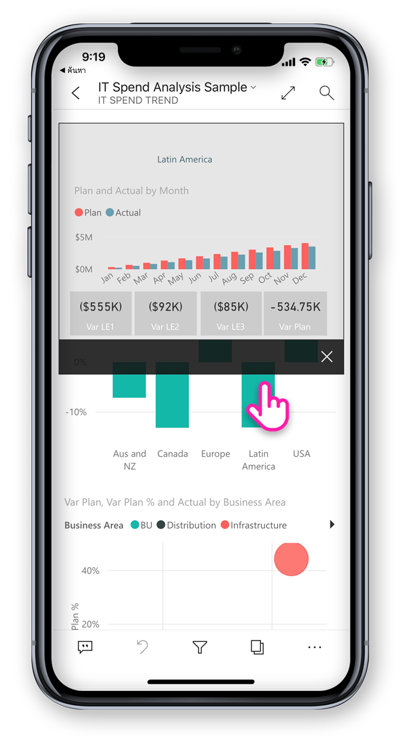
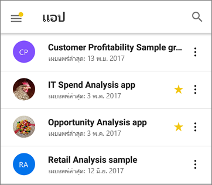
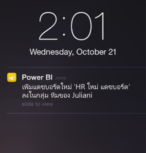

# มีอะไรใหม่ในแอปมือถือสำหรับ Power BI
สำหรับ "ข้อมูลอะไรใหม่" ที่เกี่ยวข้อง ให้ดู

* [บล็อกทีมของ power BI สำหรับแอป mobile](https://powerbi.microsoft.com/blog/tag/mobile/)
* [มีอะไรใหม่ใน Power BI Desktop](../../desktop-latest-update.md)  
* [มีอะไรใหม่ในบริการ Power BI](../../service-whats-new.md)  

## ตุลาคม 2019

### การสนับสนุน Android สำหรับการกำหนดค่าระยะไกลของการตั้งค่าการเข้าถึงเซิร์ฟเวอร์รายงาน

เราได้เพิ่มการสนับสนุน Android สำหรับการกำหนดค่าระยะไกลของการตั้งค่าการเข้าถึงเซิร์ฟเวอร์รายงานของแอป Power BI สำหรับอุปกรณ์เคลื่อนที่ ขณะนี้ผู้ดูแลระบบไอทีสามารถใช้เครื่องมือ MDM ขององค์กรของพวกเขาเพื่อกำหนดค่าการตั้งค่าเหล่านั้นได้ทั้งบนอุปกรณ์ iOS และ Android จากระยะไกล ดูรายละเอียดเพิ่มเติมใน [กำหนดค่าการเข้าถึงแอป Power BI สำหรับอุปกรณ์เคลื่อนที่ไปยังเซิร์ฟเวอร์รายงานจากระยะไกล](https://docs.microsoft.com/power-bi/report-server/configure-powerbi-mobile-apps-remote)

### การเข้าถึงรายละเอียดข้อมูลแบบข้ามรายงาน

เดือนนี้เราได้เพิ่มการสนับสนุนสำหรับการเจาะลึกรายละเอียดข้อมูลแบบข้ามรายงาน ขณะนี้คุณสามารถแตะที่จุดข้อมูลเพื่อเจาะลึกเพื่อเข้าถึงรายละเอียดรายงานและหน้ารายงานอื่นได้ เมื่อคุณเจาะลึกไปจนถึงหน้าเป้าหมายแล้ว เนื้อหาในหน้านั้นจะถูกกรองตามการตั้งค่าการเจาะลึกรายละเอียด

> [!NOTE]
> การเจาะลึกรายละเอียดแบบข้ามรายงานจะพร้อมใช้งานเฉพาะเมื่อมีการเปิดใช้งานในระหว่างการสร้างรายงาน [เรียนรู้เพิ่มเติมเกี่ยวกับการเจาะลึกรายละเอียดแบบข้ามรายงาน](https://docs.microsoft.com/power-bi/desktop-cross-report-drill-through)

### ป้ายกำกับระดับความอ่อนไหวของข้อมูล

ขณะนี้คุณสามารถดูป้ายกำกับระดับความอ่อนไหวที่เจ้าของเนื้อหากำหนดไว้ในรายงาน แดชบอร์ด ชุดข้อมูล และกระแสข้อมูฃเพื่อจำแนกความอ่อนไหวของข้อมูลได้แล้ว ป้ายกำกับระดับความอ่อนไหวกำหนดว่าจะแบ่งปันเนื้อหากับผู้ใช้รายอื่นอย่างไร [เรียนรู้เพิ่มเติมเกี่ยวกับการใช้ป้ายกำกับระดับความอ่อนไหวของข้อมูลใน Power BI](https://docs.microsoft.com/power-bi/admin/service-security-data-protection-overview)

### สนับสนุนการนำทางบนแอปแบบกำหนดเอง (Windows)

ขณะนี้ ได้เพิ่มการสนับสนุนการนำทางบนแอปแบบกำหนดเองสำหรับอุปกรณ์ Windows นอกเหนือจาก iOS และ Android (โปรดดู [มีอะไรใหม่บ้างในเดือนกันยายน](#september-2019))

## กันยายน 2019

### การสนับสนุนสำหรับการนำทางแอปแบบกำหนดเอง (iOS และ Android)

เราได้เพิ่มการรองรับสำหรับส่วนการสืบค้นแอปแบบกำหนดเอง ตอนนี้ หากคุณเปิดแอปใน Power BI Mobile ส่วนการสืบค้นเนื้อหากำหนดเองที่จัดทำผ่านระบบจัดทำแอปจะพร้อมใช้งาน ส่วนการสืบค้นแอปสามารถจัดเรียงได้จากเนื้อหา และสามารถรวมรายการใหม่ เช่น ลิงค์และหัวข้อแบบยุบได้
อ่านรายละเอียดเพิ่มเติมเกี่ยวกับ[ส่วนการสืบค้นกำหนดเอง](https://powerbi.microsoft.com/blog/designing-custom-navigation-for-power-bi-apps-is-now-available/)

## สิงหาคม 2019

### การแนะนำ Power BI บนมือถือรูปลักษณ์ใหม่ (ตัวอย่าง) (iOS และ Android)

เราได้รีเฟรชแอปของเราและแนะนำประสบการณ์การใช้งานใหม่ การเพิ่มโฮมเพจที่ช่วยให้สามารถเข้าถึงเนื้อหาที่ใช้บ่อย ๆ ของคุณได้อย่างรวดเร็ว และบานหน้าต่างนำทางใหม่ที่เสนอวิธีการนำทางผ่านแอปได้อย่างง่ายดาย ด้วยประสบการณ์ใหม่ที่สดใส จะช่วยให้คุณค้นหาสิ่งที่คุณต้องการได้รวดเร็วและง่ายดายยิ่งขึ้นเมื่อคุณต้องการ
เนื่องจากรูปลักษณ์ใหม่อยู่ในการแสดงตัวอย่าง คุณจะต้องเปิดเพื่อใช้งานอย่างเพลิดเพลิน
เรียนรู้เพิ่มเติมเกี่ยวกับ [Power BI บนมือถือในรูปลักษณ์ใหม่](https://powerbi.microsoft.com/blog/introducing-power-bi-mobile-apps-new-look-preview/)

### การเข้าถึงที่ปลอดภัยด้วยพร็อกซีแอปพลิเคชัน Azure Active Directory (AD) (iOS และ Android)

เราเป็นพันธมิตรกับทีม Azure Active Directory เพื่อรวมแอปพลิเคชัน Power BI สำหรับอุปกรณ์เคลื่อนที่กับพร็อกซีแอปพลิเคชัน Azure Active Directory (AAD) ด้วยการกำหนดค่านี้ คุณสามารถเชื่อมต่อกับเซิร์ฟเวอร์รายงานที่โฮสต์ภายในขอบเขตองค์กรจากแอป Power BI สำหรับอุปกรณ์เคลื่อนที่โดยไม่จำเป็นต้องตั้งค่าการกำหนดค่าภายในองค์กรที่ซับซ้อน อ่านเพิ่มเติมเกี่ยวกับ[การรวมพร็อกซีแอปพลิเคชัน Power BI สำหรับอุปกรณ์เคลื่อนที่และ Azure AD](https://powerbi.microsoft.com/blog/access-on-prem-report-server-from-your-power-bi-mobile-app-with-azure-active-directory-application-proxy/) เรียนรู้[วิธีการกำหนดค่าพร็อกซีแอปพลิเคชัน Azure AD และ Power BI](https://docs.microsoft.com/azure/active-directory/manage-apps/application-proxy-integrate-with-power-bi)

## กรกฎาคม 2019

### เคล็ดลับเครื่องมือหน้ารายงาน

ตอนนี้เคล็ดลับเครื่องมือหน้ารายงานไม่ได้รับการสนับสนุนเมื่อดูรายงานในแอปมือถือ เพียงแค่กดค้างบนวิชวลที่มีเคล็ดลับเครื่องมือรายงานและเคล็ดลับนั้นจะแสดงขึ้น  

 
> [!NOTE]
> เคล็ดลับเครื่องมือรายงานได้รับการสนับสนุนสำหรับอุปกรณ์ที่มีขนาดใหญ่กว่า 640 พิกเซลและ 320 มุมมองพื้นที่ทำงาน อุปกรณ์ขนาดเล็กกว่าจะเคล็ดลับเครื่องมือค่าเริ่มต้น

## มิถุนายน 2019

### การสแกนบาร์โค้ดพร้อมใช้งานแล้วตอนนี้ใน Android
ตอนนี้คุณสามารถใช้แอป Power BI บน Android (โทรศัพท์และแท็บเล็ต) เพื่อสแกนบาร์โค้ดที่พิมพ์บนผลิตภัณฑ์หรือชั้นวางที่ร้านค้าของคุณเพื่อแสดงรายงาน Power BI ที่เกี่ยวข้อง ซึ่งกรองโดยค่าที่สแกน อ่านเพิ่มเติมเกี่ยวกับ[กรองข้อมูลของคุณด้วยบาร์โค้ด](mobile-apps-scan-barcode-iphone.md)

### การสนับสนุนรายงาน PBIX ที่โฮสต์ใน PBI-RS ผ่านการกำหนดค่า ADFS (iOS, Android)

ขณะนี้ รายงาน Power BI (PBIX) ที่โฮสต์ใน PBI RS ผ่านการกำหนดค่า ADFS สามารถเข้าถึงได้จากแอป Power BI สำหรับอุปกรณ์เคลื่อนที่

## พฤษภาคม 2019

### ฝ่ายสนับสนุนทางลัดของ Siri (iOS)
ผู้ใช้สามารถสร้างทางลัดของ Siri ในรายงาน Power BI และแดชบอร์ด และเปิดโดยตรงจากอินเทอร์เฟซเสียงของ Siri ได้ [อ่านวิธีการใช้ทางลัดของ Siri ในแอป Power BI ของระบบ iOS](https://powerbi.microsoft.com/blog/introducing-siri-integration-with-power-bi-mobile-ios-app-preview/)

### การค้นหาอุปกรณ์ (iOS)
การรวม Power BI กับการค้นหาอุปกรณ์ iOS (สปอตไลต์) ขณะนี้ การค้นหาเนื้อหาใน iPhone หรือ iPad จะมีรายการ Power BI ด้วยเช่นกัน เมื่อผู้ใช้ใช้การค้นหาอุปกรณ์แบบเดิม รายงาน Power BI, แดชบอร์ด, แอป, พื้นที่ทำงาน และบุคคลที่ตรงกับเกณฑ์การค้นหา จะแสดงอยู่ในผลลัพธ์ด้วยเช่นกัน [ไปบล็อกโพสต์เพื่อเรียนรู้เพิ่มเติม](https://powerbi.microsoft.com/blog/introducing-siri-integration-with-power-bi-mobile-ios-app-preview/)

### การโต้ตอบรายงานแบบแตะครั้งเดียว - GA

ขณะนี้ การแตะครั้งเดียวคือ GA และจะเป็นการโต้ตอบเริ่มต้นด้วยการแตะสำหรับผู้ใช้รายใหม่ ผู้ใช้จะยังคงไม่สามารถปิดใช้งาน และมีแตะสองครั้งในการตั้งค่าแอป

### การป้องกันการเข้าถึงตามเงื่อนไขที่ปรับปรุง (iOS, Android)

เราได้รวมเข้ากับ[ความสามารถในการเข้าถึงตามเงื่อนไขที่มีการป้องกันแอปใหม่](https://docs.microsoft.com/azure/active-directory/conditional-access/app-protection-based-conditional-access) ของ AAD เพื่อเพิ่มความปลอดภัย โดยการจำกัดการเข้าถึง Power BI ก่อนที่จะใช้นโยบายเกี่ยวกับแอป

### การป้องกันอุปกรณ์ (iOS)

ผู้ใช้สามารถใช้การป้องกันที่มีอยู่ในอุปกรณ์เพื่อรักษาความปลอดภัยของ Power BI ด้วยการขอ Face ID, Touch ID หรือรหัสผ่านเพื่อการเข้าถึง Power BI ผู้ใช้ที่ใช้การตั้งค่าแอปสามารถควบคุมการดำเนินการนี้ได้ และรวมถึงผู้ดูแลระบบที่ใช้ Intune และเครื่องมือ MDM อื่น ๆ [เรียนรู้เพิ่มเติม](https://docs.microsoft.com/power-bi/consumer/mobile/mobile-ios-native-secure-access)

### การนำเสนอภาพนิ่งรายงานแบบหนึ่งหน้า (Windows)

การสนับสนุนการรีเฟรชโดยอัตโนมัติยังมีไว้สำหรับรายงานแบบหนึ่งหน้าในการนำเสนอภาพนิ่ง ดังนั้น ถ้ามีการอัปเดตแหล่งข้อมูลเบื้องต้น้ของรายงาน เราจะเลือกและอัปเดตข้อมูลในหน้า

## เมษายน 2019

### ภาพผู้ทรงอิทธิพลหลัก 

ขณะนี้ ภาพผู้ทรงอิทธิพลหลักพร้อมใช้งานแล้วบนแอปสำหรับอุปกรณ์เคลื่อนที่ ภาพนี้จะช่วยให้คุณทำการวิเคราะห์ตัวควบคุมหลักกับข้อมูลของคุณด้วยการแตะเพียงไม่กี่ครั้ง

### เพิ่มข้อคิดเห็นลงในเนื้อหารายงาน (Android และ iOS)

ตอนนี้ คุณสามารถใช้ข้อคิดเห็นเพื่อทำงานร่วมกันและแชร์คำติชมของคุณบนหน้ารายงานและการแสดงผลด้วยภาพ อ่านเพิ่มเติมเกี่ยวกับการแสดงข้อคิดเห็นของรายงานในบริการ Power BI และอุปกรณ์เคลื่อนที่ [ในบล็อกนี้](https://powerbi.microsoft.com/blog/announcing-report-commenting-for-power-bi-service-and-mobile/) 

### ขยายมุมมองด้วยโหมดเต็มหน้าจอ (Android และ iOS)

เราได้เพิ่มปุ่มใหม่ที่ช่วยให้คุณสามารถควบคุมเมื่อต้องการเน้นข้อมูลของคุณ โดยการลบส่วนหัวและส่วนท้ายของรายงาน และขยายพื้นที่การดูรายงานของคุณสูงสุด

## มีนาคม 2019

### การสนับสนุนผู้เยี่ยมชมภายนอกในแอป Power BI (iOS, Android)

คุณสามารถเข้าถึงเนื้อหา Power BI ที่แชร์กับคุณจากองค์กรอื่น ๆ โดยตรงจากแอป (หรือที่เรียกว่า B2B) อ่านเพิ่มเติมเกี่ยวกับ Power BI แอปสำหรับอุปกรณ์เคลื่อน B2B [ที่นี่](https://powerbi.microsoft.com/blog/power-bi-mobile-apps-now-support-azure-ad-b2b-guest-users/)

### การเพิ่มประสิทธิภาพโหมดการนำเสนองาน Windows พร้อมการนำเสนอภาพนิ่ง (Windows)

ด้วย[การนำเสนอภาพนิ่ง](https://powerbi.microsoft.com/blog/enhancing-presentation-mode-with-slideshow-in-windows-power-bi-app/)คุณสามารถใช้การแสดงผลแบบสาธารณะในสำนักงานของคุณเพื่อเรียกใช้รายงาน Power BI แบบเต็มหน้าจอซึ่งจะหมุนเองโดยอัตโนมัติระหว่างหน้ารายงาน  

### การสนับสนุนรายงาน PBI-RS ในการกำหนดค่า ADFS และ WAP (iOS เท่านั้น)

ขณะนี้ รายงาน Power BI (PBIX) ที่โฮสต์ใน PBI RS ในการกำหนดค่า ADFS สามารถเข้าถึงได้จากแอป Power BI ระบบ iOS

### การเปิดใช้งานการโต้ตอบแบบแตะครั้งเดียวกับภาพในรายงาน

เราได้เปลี่ยนการโต้ตอบรายงาน ดังนั้นคุณจะต้องแตะบนภาพ ปุ่ม หรือตัวแบ่งส่วนข้อมูลเพียงครั้งเดียวเท่านั้นเพื่อโต้ตอบกับข้อมูลทันที ผู้ใช้จะไม่จำเป็นต้องแตะบนภาพเพื่อเลือก และแตะอีกครั้งเพื่อโต้ตอบ การแตะครั้งเดียวจะดำเนินการทั้งหมด

> [!NOTE]
> ผู้ใช้เดิมจะต้องเปิดใช้งานลักษณะการทำงานนี้ในการตั้งค่าแอป สำหรับข้อมูลเพิ่มเติม ให้ดูที่บทความ[วิธีการกำหนดค่าการโต้ตอบรายงานแบบแตะครั้งเดียว](https://docs.microsoft.com/power-bi/consumer/mobile/mobile-app-single-tap)

## มกราคม - กุมภาพันธ์ 2019
 
### ภาพ Visio

เปิดใช้งานการลงชื่อเข้าใช้ครั้งเดียว (sso) ในภาพ Visio ดังนั้นไม่จำเป็นต้องมีขั้นตอนการลงชื่อเข้าใช้ครั้งเดียวใดๆ เพิ่มเติมเมื่อดูรายงาน ด้วยภาพ Visio ในแอป 

### การแสดงความคิดเห็นในแดชบอร์ดกำลังจะมีให้ใช้ในแอป Power BI Mobile Windows

คุณสามารถเพิ่มข้อคิดเห็นที่แดชบอร์ดและไทล์บางตัวได้โดยตรงเพื่อพูดคุยเกี่ยวกับข้อมูลของคุณ และทุกคนที่ดูแดชบอร์ดจะเห็นข้อคิดเห็นของคุณ 

## ธันวาคม 2018

### ตัวกรองตอนนี้พร้อมใช้งานสำหรับรายงานแนวนอน 

บานหน้าต่างตัวกรองของรายงานตอนนี้พร้อมใช้งานสำหรับรายงานแนวนอน (นอกเหนือจากรายงานโทรศัพท์)

## พฤศจิกายน 2018

### ส่วนหัวแบบเป็นภาพที่ทันสมัย 

รายงานที่ใช้ 'ส่วนหัวแบบเป็นภาพที่ทันสมัย' ใหม่จะไม่จัดสรรพื้นที่สำหรับส่วนหัวอีกต่อไป ซึ่งทำให้มีที่ว่างน้อยลงและมีพื้นที่สำหรับการจัดรูปแบบการแสดงข้อมูลของคุณมากขึ้น

### ปรับปรุงโหมดการนำเสนอ (Windows)

ปรับปรุงโหมดการนำเสนอสำหรับอุปกรณ์ Surface Hub และ Windows 10  เพลิดเพลินไปกับประสบการณ์ใหม่ที่ปรับปรุงขึ้นมาให้กับห้องประชุม Surface Hub ด้วยการปรับปรุงเครื่องมืองานนำเสนอ เครื่องมือสำหรับการทำงานร่วมกัน ไร้กรอบและมุมมองหน้าจอขนาดใหญ่ให้เหมาะสม เพื่อให้คุณสามารถโฟกัสกับข้อมูลของคุณ โหมดการนำเสนอยังมีเครื่องมือเช่นการใช้หมึกเพื่อช่วยให้คุณนำเสนอได้อย่างมีประสิทธิภาพและมีการอภิปรายเกี่ยวกับข้อมูลของคุณ อ่านเพิ่มเติมเกี่ยวกับโหมดการนำเสนอ[ที่นี่](https://powerbi.microsoft.com/blog/presentation-mode-in-power-bi-windows-app/)

### เค้าโครงรายงานแนวตั้งในแท็บเล็ต (iOS และ Android)

ขณะนี้เราใช้เค้าโครงรายงานสำหรับโทรศัพท์เมื่อมีเค้าโครงดังกล่าว เพื่อแสดงรายงานบนแท็บเล็ตในโหมดการวางแนวตั้ง อ่านเพิ่มเติมเกี่ยวกับ[วิธีการสร้างเค้าโครงโทรศัพท์ในบริการ Power BI หรือ Desktop](https://docs.microsoft.com/power-bi/desktop-create-phone-report/)

### สนับสนุนรายงานสตริงแบบสอบถาม 

ตอนนี้การเปิดลิงก์รายงานที่รวมเอาสตริงแบบสอบถามสามารถเปิดในแอปบนอุปกรณ์เคลื่อน และสามารถกรองไว้ล่วงหน้าตามเงื่อนไขกำหนดไว้ในสตริงแบบสอบถามได้ เรียนรู้เพิ่มเติมเกี่ยวกับ[วิธีการสร้าง url ของรายงาน ด้วยสตริงแบบสอบถาม](https://docs.microsoft.com/power-bi/service-url-filters/)  

### ข้อมูลประจำตัวที่ใช้ร่วมกัน (ตอนนี้ใน Android)

การลงชื่อเข้าใช้ใน Power BI จากแอปมือถือจะง่ายกว่าที่เคย ด้วยข้อมูลประจำตัวที่แชร์ เราได้ทำให้ขั้นตอนการลงชื่อเข้าใช้ง่ายขึ้น ด้วยการใช้ข้อมูลประจำตัวของแอป Office 365 อื่นๆ เพื่อยืนยันตัวตนของคุณในบริการของ Power BI

### URL ในแอป (ตอนนี้ใน Android) 

ลิงก์ในรายงานที่จะชี้ไปยังวัตถุอื่นของ Power BI จะเปิดขึ้นในแอปโดยตรง ซึ่งจะช่วยให้คุณสร้างโฟล์วการนำทางแบบกำหนดเองได้ ยกตัวอย่างเช่น การเชื่อมโยงจากรายงานไปยังแดชบอร์ด

### แสดงข้อมูลและคัดลอกค่า

เมนูการดำเนินการแสดงผลรายงาน (...) ในขณะนี้มีตัวเลือกให้การแสดงข้อมูลเบื้องต้นในรูปแบบตาราง ในตาราง คุณสามารถแตะยาวเพื่อเลือก และคัดลอกค่าจากตารางนั้น (สมมติว่าไม่มีนโยบายมีมาจำกัดการคัดลอก Intune)

## ตุลาคม 2018

### ตัวอย่างรายงานแบบแบ่งหน้า (ทุกอุปกรณ์)

ตอนนี้มีรายงานแบบแบ่งหน้าพร้อมใช้ในบริการของ Power BI แล้ว ผู้ใช้ที่เข้าถึงรายงานแบบแบ่งหน้าในบริการของ Power BI ได้จะสามารถเข้าถึงรายงานเหล่านี้ได้จากแอปอุปกรณ์เคลื่อนที่ 

โปรดอ่าน[บล็อกโพสต์เกี่ยวกับรายงานแบบแบ่งหน้าในมือถือ](https://powerbi.microsoft.com/blog/power-bi-paginated-reports-also-available-in-power-bi-mobile-apps-preview/)ของ Power BI

### ข้อมูลประจำตัวที่แชร์ (iOS)

การลงชื่อเข้าใช้ใน Power BI จากแอปมือถือจะง่ายกว่าที่เคย ด้วยข้อมูลประจำตัวที่แชร์ เราได้ทำให้ขั้นตอนการลงชื่อเข้าใช้ง่ายขึ้น ด้วยการใช้ข้อมูลประจำตัวของแอป Office 365 อื่นๆ เพื่อยืนยันตัวตนของคุณในบริการของ Power BI

### URL ในแอป (iOS) 

ลิงก์ในรายงานที่จะชี้ไปยังวัตถุอื่นของ Power BI จะเปิดขึ้นในแอปโดยตรง ซึ่งจะช่วยให้คุณสร้างโฟล์วการนำทางแบบกำหนดเองได้ ยกตัวอย่างเช่น การเชื่อมโยงจากรายงานไปยังแดชบอร์ด

### ส่วนรองรับ iOS12 และ watchOS 5 

เราได้อัปเดตแอป Power BI สำหรับ iOS เพื่อให้ทำงานได้อย่างราบรื่นกับระบบ OS ใหม่บนอุปกรณ์มือถือและนาฬิกา

## กันยายน 2018

### การแก้ไขรายงานบนโทรศัพท์ในเบราว์เซอร์ (อุปกรณ์ทั้งหมด)

ตอนนี้ คุณสามารถสร้างเค้าโครงรายงานบนโทรศัพท์สำหรับรายงานที่เผยแพร่แล้วในบริการของ Power BI และไม่ใช่เฉพาะใน Power BI Desktop เท่านั้น คุณสามารถสร้างเค้าโครงรายงานบนโทรศัพท์ได้ในโหมดแก้ไขในเบราว์เซอร์ของคุณ

### แดชบอร์ดการแสดงข้อคิดเห็น (iOS และ Android) 

คุณสามารถเพิ่มข้อคิดเห็นที่แดชบอร์ดและไทล์บางตัวได้โดยตรงเพื่อพูดคุยเกี่ยวกับข้อมูลของคุณ และทุกคนที่ดูแดชบอร์ดจะเห็นข้อคิดเห็นของคุณ คุณสามารถดึงบุคคลอื่น ๆ ในองค์กรของคุณให้ร่วมออกความเห็นโดยอ้างถึง@mentioningพวกเขา บุคคลเหล่านั้นที่คุณอ้างถึง @mentionedจะได้รับจากการแจ้งเตือนพุชพร้อมด้วยข้อความของคุณไปยังโทรศัพท์มือถือของพวกเขา

ในขณะนี้พร้อมใช้งานในอุปกรณ์ iOS และ Android การสนับสนุนของ Windows ในเร็ว ๆ นี้

อ่านโพสต์ในบล็อก Power BI [เกี่ยวกับข้อคิดเห็นในแดชบอร์ด](https://powerbi.microsoft.com/blog/announcing-dashboard-comments-in-power-bi/)

### ลงชื่อเข้าระบบครั้งเดียว (Windows)

การลงชื่อเข้าระบบครั้งเดียว (SSO) เป็นหนึ่งในความสามารถที่ต้องการมากที่สุดสำหรับ Power BI บนมือถือสำหรับ Windows ตอนนี้ คุณสามารถใช้บัญชีองค์กรหลักของคุณด้วยการลงชื่อเข้าใช้ในอุปกรณ์เคลื่อนที่ Windows ที่ใช้โดเมนร่วมกัน และยังสามารถยังลงชื่อเข้าใช้บริการของ Power BI ได้ อ่านเพิ่มเติมเกี่ยวกับ [SSO และแอปสำหรับอุปกรณ์เคลื่อนที่ Windows ](mobile-windows-10-app-single-sign-on-sso.md)

## เดือนก่อน

### กรกฎาคม 2018

#### เฉพาะ iOS และ Android

**ตัวกรองที่แชร์**

ตอนนี้คุณสามารถรับรายงานที่แชร์ตัวกรองและตัวแบ่งส่วนข้อมูล

**รองรับภาพพื้นหลัง**

เมื่อคุณดูรายงานในโหมดแนวนอนบนอุปกรณ์มือถือ คุณจะเห็นภาพพื้นหลังแบบเดียวกับที่เห็นใน Power BI บนเว็บ

### มิถุนายน 2018

#### รายงานพื้นที่ทำงานแบบสมบูรณ์

แถบการดำเนินการด้านบนและด้านล่างจะหายไปไม่นานหลังจากการโหลดรายงาน ดังนั้น คุณจะสามารถดูรายงานได้มากขึ้นในทันที

#### ขนาดพื้นที่รายงานแบบโทรศัพท์ที่เพิ่มขึ้น

เราได้เพิ่มขนาดพื้นที่รายงานแบบโทรศัพท์ให้มีพื้นที่ว่างสำหรับการแสดงภาพมากขึ้นกว่าแต่ก่อน

### พฤษภาคม 2018

#### เข้าถึงรายละเอียดในมือถือ: แอปสำหรับอุปกรณ์เคลื่อนที่ทั้งหมด

คุณสามารถเข้าถึงรายละเอียดจากจุดข้อมูลที่เลือก ไปยังอีกหน้ารายงานในแอปสำหรับอุปกรณ์เคลื่อนที่ ถ้าได้กำหนดการกระทำนั้นโดยผู้สร้างรายงาน 

#### ปุ่มย้อนกลับ: แอปสำหรับอุปกรณ์เคลื่อนที่ทั้งหมด

ตอนนี้ เมื่อคุณนำทางในรายงานโดยปัดนิ้ว, เลือกหน้ารายงานบนแถบการดำเนินการ หรือใช้การเข้าถึงรายละเอียด ปุ่มย้อนกลับจะนำคุณกลับไปยังหน้าก่อนหน้าที่คุณกำลังดูอยู่ 

#### ธีมแดชบอร์ด: แอปสำหรับอุปกรณ์เคลื่อนที่ทั้งหมด

เมื่อผู้เขียนรายงานกำหนดธีมแดชบอร์ดในบริการของ Power BI หน้าตาของแดชบอร์ดจะเปลี่ยนในแอปมือถือด้วย แต่คุณจะไม่เห็นรูปภาพพื้นหลัง

#### iOS: กำหนดค่าการเข้าถึงเซิร์ฟเวอร์รายงานจากระยะไกล สำหรับแอปอุปกรณ์เคลื่อนที่ iOS ของ Power BI

ผู้ดูแลระบบ IT ของคุณสามารถใช้เครื่องมือ MDM เพื่อกำหนดค่าการเข้าถึงเซิร์ฟเวอร์รายงานของแอปสำหรับอุปกรณ์เคลื่อนที่ iOS ของ Power BI ได้แล้วตอนนี้ ดู [กำหนดค่าแอปสำหรับอุปกรณ์เคลื่อนที่ iOS ของ Power BI สำหรับการเข้าถึงไปยังเซิร์ฟเวอร์รายงานจากระยะไกล](../../report-server/configure-powerbi-mobile-apps-remote.md) สำหรับรายละเอียด

#### Power BI สำหรับแอปความเป็นจริงผสม (แสดงตัวอย่าง)

Power BI สำหรับแอปความเป็นจริงผสม ตอนนี้อยู่ใน Microsoft Store แล้ว ดูแดชบอร์ดและรายงานของคุณ ขณะรวมอยู่ในโลกเสมือน หรือวางอยู่ในตำแหน่งเฉพาะในบริบทของสภาพแวดล้อมของคุณ ดูวิดีโอ[แนะนำ Power BI บน Hololens](https://www.youtube.com/watch?v=J_X_nOFUBss) ใหม่สำหรับบริบท หรืออ่านบทความเกี่ยวกับ [Power BI สำหรับแอปความเป็นจริงผสม](mobile-mixed-reality-app.md)ใหม่

### เมษายน 2018

#### ดูข้อมูลโดยละเอียดและดูข้อมูลสรุปบนมือถือ

ตอนนี้คุณสามารถดูรายละเอียดแนวลึก และดูข้อมูลสรุปในวิชวลรายงานบนอุปกรณ์เคลื่อนที่ของคุณ เพื่อเข้าถึงคุณลักษณะใหม่นี้ แตะค้างที่วิชวลรายงานเพื่อเปิดเมนูแนะนำเครื่องมือ จากนั้นแตะปุ่มดูรายละเอียดเพื่อสำรวจข้อมูลของคุณที่ลึกซึ้งขึ้น อ่านเพิ่มเติมเกี่ยวกับ[ดูข้อมูลโดยละเอียดและดูข้อมูลสรุป ในแอปสำหรับอุปกรณ์เคลื่อนที่](https://powerbi.microsoft.com/blog/drill-down-up-in-power-bi-mobile-apps/)

#### ตัวกรองแบบถาวร

เราเพิ่งอัปเดตตัวกรองและตัวแบ่งส่วนข้อมูลรายงาน เพื่อให้บันทึกโดยอัตโนมัติจาก Power BI บนเว็บไปยังแอป Power BI สำหรับอุปกรณ์เคลื่อนที่ ตอนนี้ ตัวกรองและตัวแบ่งส่วนข้อมูลที่คุณตั้งค่าในแอปสำหรับอุปกรณ์เคลื่อนที่ จะถูกบันทึกไปยัง Power BI บนเว็บโดยอัตโนมัติ

### มีนาคม 2018

#### Power BI สำหรับแอปความเป็นจริงผสม (ตัวอย่าง)

ในการย้ายล่าสุดเมื่อต้องการนำข้อมูลที่ที่คุณอยู่ เราได้สร้าง Power BI สำหรับแอปความเป็นจริงผสม ดูแดชบอร์ดและรายงานของคุณ ขณะรวมอยู่ในโลกเสมือน หรือวางอยู่ในตำแหน่งเฉพาะในบริบทของสภาพแวดล้อมของคุณ อ่านเพิ่มเติมเกี่ยวกับ[Power BI สำหรับแอปความเป็นจริงผสม](mobile-mixed-reality-app.md)ใหม่

#### แชร์รายงานและแดชบอร์ดภายนอก

แชร์แดชบอร์ดและรายงานกับผู้ใช้ภายนอกองค์กรของคุณจากแอปได้โดยตรง การแชร์ถูกเปิดใช้งาน สำหรับบัญชีผู้ใช้ขององค์กรและเครือข่ายสังคมภายนอก 

#### ตัวกรองแบบถาวร

เมื่อคุณปรับตัวกรองและตัวแบ่งส่วนข้อมูลใน Power BI บนเว็บ ตัวเลือกของคุณจะถูกบันทึกไปยังแอปสำหรับอุปกรณ์เคลื่อนที่ของคุณด้วย ดังนั้นคุณจึงสามารถไปยังจุดที่คุณใช้งานค้างไว้ได้

#### รีเฟรชรายงานบน iPad

ตอนนี้รายงาน Power BI มีปุ่มรีเฟรชในแอป iPad

### กุมภาพันธ์ 2018

#### แชร์รายงาน

ในตอนนี้ คุณสามารถแชร์รายงานได้โดยตรงจากแอป mobile อ่านเพิ่มเติมเกี่ยวกับ[การแชร์แดชบอร์ดและรายงานจากแอปมือถือ](mobile-share-dashboard-from-the-mobile-apps.md)

#### เกร็ดคำแนะนำเครื่องมือที่ปรับปรุง

เมื่อคุณแตะและกดค้างรายงานรูปภาพเพื่อเข้าไปยังเกร็ดคำแนะนำ ขณะนี้คุณสามารถลากนิ้วของคุณผ่านภาพเพื่อสำรวจรายละเอียดเกี่ยวกับจุดข้อมูลแต่ละจุดได้ตลอดเวลา

### มกราคม 2018

#### รายการโปรดของรายงาน

แท็กรายงานให้เป็นรายการโปรดเพื่อให้ปรากฏบนการหน้า**รายการโปรด** อ่านเพิ่มเติมเกี่ยวกับ[รายการโปรดในแอป Power BI สำหรับอุปกรณ์เคลื่อนที่](mobile-apps-favorites.md)

#### ดูรายงานทีแชร์

ในตอนนี้เมื่อมีบางคนแชร์รายงานกับคุณ มันจะแสดงอยู่บนเพจ**แชร์กับฉัน**พร้อมด้วยแดชบอร์ด

#### ปรับปรุงการรองรับไฮเปอร์ลิงก์แล้ว

ขณะนี้คุณสามารถแตะลิงก์ในภาพแบบกำหนดเองเพื่อเปิดลิงก์เหล่านั้นในเบราว์เซอร์มือถือของคุณ

#### Intune integration (Android)

รองรับการเข้าถึงตามเงื่อนไขที่ใช้ Intune mobile device management

### ธันวาคม 2017

#### จัดการการรักษาความปลอดภัยที่ได้รับการปรับปรุง 

เราได้เพิ่มการรองรับการเข้าถึงแบบมีเงื่อนไข (CA) และ Microsoft Intune mobile device management (MDM) เพื่อจะรักษาความปลอดภัยของข้อมูลขององค์กรคุณได้ดีขึ้น พร้อมใช้งานบน iOS

#### การจัดการสิทธิ์ที่ถูกปรับปรุง

เราได้ทำการเปลี่ยนแปลงบางอย่างเพื่อให้สามารถจัดการสิทธิ์ของผู้ใช้สำหรับชุดข้อมูล แดชบอร์ด และรายงานได้แม่นยำยิ่งขึ้น

#### แอปที่ติดตั้งโดยอัตโนมัติ

คุณไม่จำเป็นต้องติดตั้งแอปใน Power BI เลย Power BI creators ในองค์กรของคุณสามารถสร้าง*apps*ที่ประกอบด้วยคอลเลกชันของแดชบอร์ดและรายงานได้ จากนั้นสามารถเผยแพร่แอป และตั้งค่าให้ติดตั้งโดยอัตโนมัติใน Power BI service และแอปมือถือ Power BI เมื่อแอปถูกตั้งค่าการติดตั้งสำหรับคุณ จะปรากฏโดยอัตโนมัติในเมนู**Apps**ของคุณ

### พฤศจิกายน 2017
#### การปรับให้ iPhone X เหมาะสม

เราได้ปรับเค้าโครงแอปให้เหมาะสมกับ iPhone X ดังนั้นคุณสามารถสำรวจข้อมูลบนอุปกรณ์ทุกเครื่องตามแบบของคุณ

### ตุลาคม 2017
#### ตัวกรองสำหรับรายงานโทรศัพท์ใน Android

ถ้าคุณสร้างรายงาน ด้วยหน้าปรับโทรศัพท์ให้เหมาะสมใน Power BI Desktop และรายงานมีตัวกรอง ซึ่งตอนนี้คุณสามารถใช้ตัวกรองเหล่านั้นในรายงานบนโทรศัพท์ Android ของคุณ อ่านเพิ่มเติมเกี่ยวกับตัวกรองสำหรับรายงาน Power BI บน Android

#### แสดงข้อมูลในรายงาน

ในตอนนี้คุณสามารถสลับรูปภาพในรายงานของคุณไปยังมุมมองตารางเพื่อดูตัวเลขเบื้องหลังข้อมูล เพื่อเข้าถึงฟีเจอร์นี้ ให้แตะ "แสดงข้อมูล" จากรูปภาพ...เมนูบนรายงานของคุณหรือไอคอนใหม่บนเมนูการดำเนินการของภาพที่ถูกขยาย

### กันยายน 2017
#### ตัวกรองสำหรับรายงานโทรศัพท์ใน iPhones
ถ้าคุณสร้างรายงาน ด้วยหน้าปรับโทรศัพท์ให้เหมาะสมใน Power BI Desktop และรายงานมีตัวกรอง ซึ่งตอนนี้คุณสามารถใช้ตัวกรองเหล่านั้นในรายงาน์บนโทรศัพท iPhone ของคุณ อ่านเพิ่มเติมเกี่ยวกับ[ตัวกรองสำหรับรายงาน Power BI บน Iphone](https://powerbi.microsoft.com/blog/filters-coming-for-phone-reports-on-ios/)

### สิงหาคม 2017
#### รองรับการตั้งค่าพร็อกซี iOS
ขณะนี้คุณสามารถตั้งการตั้งค่าพร็อกซีในแอป mobile iOS Power BI ซึ่งหมายความ ว่า Power BI จะทำงานกับการเชื่อมต่อ VPN บนอุปกรณ์เคลื่อนที่ ซึ่งอนุญาตให้ผู้ใช้และองค์กร ได้ใช้ประโยชน์จากของ Power BI ในขณะเดินทางได้อย่างปลอดภัย

### กรกฎาคม 2017
อ่าน[สรุปฟีเจอร์แอปสำหรับอุปกรณ์เคลื่อนทีเดือนกรกฎาคม 2017 ](https://powerbi.microsoft.com/blog/power-bi-service-and-mobile-july-feature-summary/#ios-preview)

#### อุปกรณ์ iOS
**ประสบการณ์ Q&A ใหม่เกี่ยวบน iOS (ตัวอย่าง)** แทนที่จะได้รับคำตอบคำถามของคุณเท่านั้น คุณสามารถใช้ภาษาธรรมชาติเพื่อรับข้อมูลที่มีขอบเขตเชิงลึกได้ ถึงแม้ว่าคุณไม่แน่ใจว่าสิ่งที่คุณกำลังค้นหา Q&A จะช่วยให้ข้อมูลเชิงลึกมีความเกี่ยวข้องกับข้อมูลของคุณ ประสบการณ์ Q&A ใหม่บนมือถือ ถูกพัฒนาขึ้นในการทำงานร่วมกันกับทีมวิจัย Microsoft ได้แสดงเทคโนโลยีที่มีประสิทธิภาพภายในผลิตภัณฑ์ของเรา ลองบทเรียน[ถามคำถามเกี่ยวกับข้อมูลของคุณในแอปมือถือบน iOS ](mobile-apps-ios-qna.md)

### รูปภาพแบบตอบสนอง
**รูปภาพแบบตอบสนองสำหรับรายงานโทรศัพท์และแดชบอร์ด** คุณสามารถตั้งค่าภาพในแดชบอร์ดหรือรายงานให้เป็นแแบบ*ตอบสนอง* เพื่อจะเปลี่ยนแปลงแบบไดนามิกเพื่อแสดงจำนวนสูงสุดของข้อมูลและข้อมูลเชิงลึก โดยไม่ไม่ข้อจำกัดของหน้าจอ อ่าน[บล็อกเกี่ยวกับรูปภาพแบบตอบสนอง](https://powerbi.microsoft.com/blog/power-bi-desktop-july-feature-summary-2/#responsiveVisuals)

### มิถุนายน 2107
#### อุปกรณ์ทั้งหมด
**ทำให้เป็นแอปโปรด** คุณสามารถทำให้แดชบอร์ดเป็นรายการโปรดได้แล้ว ล่าสุด[แอปที่เพิ่ม Power BI](../../service-create-distribute-apps.md) และตอนนี้คุณสามารถทำให้เป็นแอปโปรดได้เช่นกัน 

### พฤษภาคม 2017
#### อุปกรณ์ทั้งหมด
**เมนูใหม่: แชร์กับฉัน**ไปที่แชร์กับฉันในเมนูแอปสำหรับอุปกรณ์เคลื่อนที่ เพื่อดูเนื้อหาทั้งหมดทีถูกแชร์กับคุณ

**เมนูใหม่: Apps** แอปเป็นคอลเลกชันของแดชบอร์ดและรายงานซึ่งถูกสร้างขึ้นตามวัตถุประสงค์โดยองค์กรของคุณ เพื่อการจัดส่งเมตริกหลักสำหรับการตัดสินใจที่มีข้อมูลเป็นส่วนผลักดันให้ยิ่งง่ายและรวดเร็วขึ้น

อ่านเพิ่มเติมเกี่ยวกับ[วิธีที่ Power BI จัดระเบียบเนื้อหาของคุณ](mobile-apps-quickstart-view-dashboard-report.md)

#### อุปกรณ์ iOS และ Android
**แสดงตัวอย่าง power BI Report Server** สร้า และเผยแพร่รายงาน Power BI ภายในองค์กร จากนั้น[ดูและโต้ตอบกับพวกเขาในอุปกรณ์เคลื่อนที่ iOS หรือ Android ](mobile-app-ssrs-kpis-mobile-on-premises-reports.md)ของคุณ 

### เมษายน 2017
อ่าน[สรุปฟีเจอร์แอปสำหรับอุปกรณ์เคลื่อนทีเดือนเมษายน 2017 ](https://powerbi.microsoft.com/blog/power-bi-mobile-apps-feature-summary-march-april-2017/)

#### อุปกรณ์ทั้งหมด
**รายงานพื้นหลังสีสำหรับโทรศัพท์** เมื่อคุณกำหนดสีพื้นหลังสำหรับรายงานใน Power BI Desktop รายงานบนโทรศัพท์จะมีสีพื้นหลังเดียวกัน อ่านเพิ่มเติมเกี่ยวกับ[การปรับหน้ารายงานให้เหมาะสมกับโทรศัพท์](../../desktop-create-phone-report.md)

**พัฒนารูปภาพแบบกำหนดเองที่เหมาะกับอุปกรณ์เคลื่อนที่** ให้อ่าน[คู่มือสำหรับนักพัฒนา](https://github.com/Microsoft/PowerBI-visuals/blob/master/Tutorial/MobileGuideline.md)สำหรับเคล็ดลับเกี่ยวกับการสร้างวรูปภาพแบบกำหนดเองที่ดูดี และทำงานได้ดีบนอุปกรณ์เคลื่อนที่

#### อุปกรณ์ iOS
**พูดคุยกับข้อมูลของคุณ ถามคำถามโดยการพูด**ตอนนี้คุณสามารถ[ถามคำถามของข้อมูลของคุณด้วย Q&A ](mobile-apps-ios-qna.md)โดยการพูดคุยแทนที่การพิมพ์ 

### มีนาคม 2017
อ่าน[สรุปฟีเจอร์แอปสำหรับอุปกรณ์เคลื่อนทีเดือนมีนาคม 2017](https://powerbi.microsoft.com/blog/power-bi-mobile-apps-feature-summary-march-2017/)

#### อุปกรณ์ทั้งหมด
**การโต้ตอบกับตัวแบ่งส่วนข้อมูล**

เราได้ปรับปรุงการโต้ตอบแบบสัมผัสสำหรับตัวแบ่งส่วนข้อมูลเวลา

#### อุปกรณ์ iOS
**ถามคำถามของข้อมูลของคุณด้วย Q&A และส่งคำติชม**ลองถามคำถามของข้อมูลของคุณด้วย Q&A และจากนั้นส่งรูปหน้ายิ้มหรือบึ้งถึงเราเพื่อแจ้งให้เราทราบว่าเราเป็นอย่างไง

**ใช้ 3D touch สำหรับการกระทำทั่วไป** กดจ้ำบนไอคอนแอป Power BI บนหน้าจอหลัก ของ iPhone 6s หรือรุ่นที่ใหม่กว่าเมื่อต้อง การเข้าถึงการแจ้งเตือน ค้นหา และแดชบอร์ดที่ใช้ล่าสุด

**รองรับภาษาจากขวาไปซ้าย**แอปสำหรับอุปกรณ์เคลื่อนของ Power BI ขณะนี้รองรับภาษาขวาไปซ้าย ในบริบทนี้ "จากขวาไปซ้ายภาษา" หมายถึงระบบการเขียนภาษาฮิบรูและภาษาอาหรับ ซึ่งจะถูกเขียนจากขวาไปซ้าย และจำเป็นต้องมีรูปร่างตามบริบท ดูรายชื่อ [ภาษาที่แอปมือถือ Power BI รองรับ](mobile-apps-supported-languages.md)

#### อุปกรณ์ Android
**เชื่อมต่อกับเซิร์ฟเวอร์ SSRS มากกว่าหนึ่งรายการ** 

ขณะนี้่คุณสามารถมีการเชื่อมต่อกับเซิร์ฟเวอร์ SQL Server Reporting Services(SSRS) ได้สูงสุดห้าเซิร์ฟเวอร์ในเวลาเดียวกัน

**ร้องขอการเข้าถึงแดชบอร์ด** 

ถ้าคุณสามารถสแกนรหัส QR สำหรับแดชบอร์ดที่คุณไม่สามารถเข้าถึง ขณะนี้คุณสามารถส่งคำขอสำหรับการเข้าถึงได้จากอุปกรณ์เคลื่อนที่ได้

### กุมภาพันธ์ 2017
#### อุปกรณ์ทั้งหมด
**เลื่อนได้ง่ายขึ้น** 

ในตอนนี้คุณสามารถเลื่อนดูในแท่งและแผนภูมิคอลัมน์ในรายงานโดยการสัมผัสแผนภูมิ แทนที่สัมผัสแถบเลื่อนทางด้านข้าง

#### อุปกรณ์ iOS
**ถามคำถามของข้อมูลของคุณกับตัวอย่างของ Q&A** 

ด้วย Q&A คุณถามคำถามเกี่ยวกับข้อมูลของคุณ โดยใช้คำของคุณเอง และ Power BI จะให้คำตอบ Q&A นั้นใช้ได้ใน Power BI service https://powerbi.com ในตอนนี้[พร้อมใช้งานในแอปมือถือบน iPhone หรือ iPad ของคุณ](mobile-apps-ios-qna.md)

**เชื่อมต่อกับเซิร์ฟเวอร์ SSRS มากกว่าหนึ่งรายการ** 

ขณะนี้่คุณสามารถมีการเชื่อมต่อกับเซิร์ฟเวอร์ SQL Server Reporting Services(SSRS) ได้สูงสุดห้าเซิร์ฟเวอร์ในเวลาเดียวกัน

#### แท็บเล็ต Android
**แอปสำหรับอุปกรณ์เคลื่อน Power BI**สำหรับแท็บเล็ต Android ใช้งานได้ทั่วโลก เริ่มต้นใช้งานการ[Power BI บนแท็บเล็ต Android](mobile-android-app-get-started.md)

#### อุปกรณ์ iOS และ Android
**เมนูใหม่สำหรับแดชบอร์ดไทล์** นำทางไปยังรายงานต้นแบบ ขยายไทล์ หรือจัดการการแจ้งเตือน ทั้งหมดได้โดยตรงจากเมนูบนไทล์บนแดชบอร์ด 

เมนูนี้ใหม่สำหรับ iOS, Android ในโหมดแนวนอน และแท็บเล็ต Android มีแล้วในโทรศัพท์ Windows และ Android ในโหมดแนวตั้ง

### มกราคม 2017
อ่าน[สรุปฟีเจอร์แอปสำหรับอุปกรณ์เคลื่อนที่เดือนมกราคม 2017 ](https://powerbi.microsoft.com/blog/power-bi-mobile-apps-feature-summary-january-2017)

#### อุปกรณ์ทั้งหมด
**โหลดแถวมากกว่า 100 แถวในตารางและเมทริกซ์** ขณะน้ ถ้าคุณมีตารางขนาดใหญ่หรือเมทริกซ์บนแดชบอร์ดหรือรายงานของคุณ เราจะแสดงข้อมูลมากที่สุดเท่าที่เป็นไปได้ในไทล์ แล้วในโหมดโฟกัส คุณสามารถเลื่อนลงไปโหลดแถวเพิ่ม

**รายงานโทรศัพท์ ความพร้อมใช้งานทั่วไป**รายงานโทรศัพท์ Power BI จะพร้อมใช้งานแบบทั่วไปแล้ว ใน Power BI Desktop คุณสามารถปรับแต่งมุมมองแนวตั้งของรายงานที่มีอยู่สำหรับผู้ชมผ่านมือถือ เรียนรู้เพิ่มเติมเกี่ยวกับ[การเขียนรายงานโทรศัพท์ใน Power BI Desktop](../../desktop-create-phone-report.md)และ[รายงานประสบการณ์การใช้งานบนโทรศัพท์](mobile-apps-view-phone-report.md)

#### iOS
**การรับรองตัวตน SSRS ที่ใช้แสดงตัวอย่าง Active Directory Federation Services (ADFS)** ตอนนี้คุณสามารถลงชื่อเข้าใช้เซิร์ฟเวอร์ SQL Server Reporting Services ภายในองค์กรจากอุปกรณ์เคลื่อนทีกับบัญชีองค์กรของคุณ อ่านเพิ่มเติมเกี่ยวกับ[การใช้ OAuth เพื่อเชื่อมต่อกับเซิร์ฟเวอร์ SSRS](mobile-oauth-ssrs.md)

#### Android
**การรับรองตัวตน SSRS ที่ใช้แสดงตัวอย่าง Active Directory Federation Services (ADFS)** ตอนนี้คุณสามารถลงชื่อเข้าใช้เซิร์ฟเวอร์ SQL Server Reporting Services ภายในองค์กรจากอุปกรณ์เคลื่อนทีกับบัญชีองค์กรของคุณ อ่านเพิ่มเติมเกี่ยวกับ[การใช้ OAuth เพื่อเชื่อมต่อกับเซิร์ฟเวอร์ SSRS](mobile-oauth-ssrs.md)

**ใหม่และปรับปรุงแล้ว: ใส่คำอธิบายประกอบ และแชร์ข้อมูลเชิงลึกได้อย่างรวดเร็ว** การแชร์และการใส่คำอธิบายประกอบทำงานอย่างสมบูรณ์บนอุปกรณ์ Android เมนูที่ถูกปรับปรุง ทำให้การใส่คำอธิบายประกอบง่ายและรวดเร็วขึ้น และแชร์ข้อมูลเชิงลึก และคุณยังสามารถแชร์รายงานมีคำอธิบายประกอบหรือจากแอป Power BI โดยตรง

### ธันวาคม 2016
อ่านคำ[สรุปฟีเจอร์แอปสำหรับอุปกรณ์เคลื่อนทีเดือนธันวาคม 2016 ](https://powerbi.microsoft.com/blog/power-bi-mobile-apps-feature-summary-december-2016)

#### อุปกรณ์ทั้งหมด
**รีเฟรชเบื้องหลังแบบออฟไลน์**

เพื่อให้แน่ใจว่า คุณสามารถเข้าถึงข้อมูลล่าสุดของคุณในขณะออฟไลน์ เราดำเนินการรีเฟรชในเบื้องหลังของแอป เพื่อให้ข้อมูลธุรกิจของคุณให้ทันเหตุการ แม้ว่าคุณยังไม่ได้เข้าสักพักแล้ว เมื่อต้องตรวจสอบว่าบางแดชบอร์ดมีข้อมูลล่าสุดเสมอ ก็เพียงทำเครื่องหมายให้เป็นรายการโปรด เรียนรู้เพิ่มเติมเกี่ยวกับ[ความสามารถของแบบออฟไลน์ในแอป mobile Power BI](mobile-apps-offline-data.md)

#### อุปกรณ์ iOS
**ใส่คำอธิบายประกอบ และแชร์**

ในตอนนี้ คุณสามารถใส่คำอธิบายประกอบและแชร์ไทล์ รายงาน หรือการแสดงรูปภาพจากแอป Power BI สำหรับอุปกรณ์ iOS 

* [บน iPhone](mobile-annotate-and-share-a-tile-from-the-mobile-apps.md)
* [บน iPad](mobile-annotate-and-share-a-tile-from-the-mobile-apps.md)

**ร้องขอการเข้าถึงแดชบอร์ด**

ถ้าคุณสามารถสแกนรหัส QR สำหรับแดชบอร์ดที่คุณไม่สามารถเข้าถึง ขณะนี้คุณสามารถส่งคำขอสำหรับการเข้าถึงได้จากอุปกรณ์เคลื่อนที่

**กำหนด URL บนไทล์รูปภาพ**

ถ้าไทล์รูปภาพมี URL แบบกำหนดเอง ท่ีถูกกำหนดโดยเจ้าของแดชบอร์ด เมื่อคุณแตะไทล์คุณเพื่อไปยัง URL นั้นโดยตรง โดยไม่ต้องเปิดไทล์ในโหมดโฟกัส 

#### iPhone
**การปรับปรุง Apple Watch**

ตอนนี้คุณสามารถรีเฟรชข้อมูล Apple Watch โดยตรงจากแอป Watch ในหน้าดัชนีแดชบอร์ด กดจ้ำเพื่อรีเฟรชข้อมูลของคุณ (แอปสำหรับอุปกรณ์เคลื่อน Power BI ต้องทำงานในเบื้องหลังบน iPhone ของคุณ)

#### Android
**กำหนด URL บนไทล์รูปภาพ**

ถ้าไทล์ของรูปภาพมี URL แบบกำหนดโดยเจ้าของแดชบอร์ด เมื่อคุณแตะไทล์ คุณจะไปยัง URL นั้นโดยตรงโดยไม่ต้องเปิดไทล์ในโหมดโฟกัส รวมทั้แดชบอร์ดที่ประกอบด้วย Url แบบกำหนดเองที่กำหนดไว้ล่วงหน้าสามารถเดี๋ยวนี้เปลี่ยนเส้นทางผู้อ่านรายงานภายในแอป

### พฤศจิกายน 2016
อ่านคำ[สรุปฟีเจอร์แอปสำหรับอุปกรณ์เคลื่อนทีเดือนพฤศจิกายน 2016 ](https://powerbi.microsoft.com/blog/power-bi-mobile-apps-feature-summary-november-2016/)

#### แท็บเล็ต Android
**แอป Power BI mobile สำหรับแท็บเล็ต Android** ใช่ตัวอย่างอยู่ที่นี่

* ใช้งาน[Power BI บนแท็บเล็ต Android ของคุณ](mobile-android-app-get-started.md)
* สำรวจ[Reporting Services mobile reports และ Kpi บนแท็บเล็ต Android ของคุณ](mobile-app-ssrs-kpis-mobile-on-premises-reports.md)

#### อุปกรณ์ Android
**แสดงตัวอย่าง: Intune Mobile Application Management** Power BI รองรับ Microsoft Intune Mobile Application Manager (MAM) ตอนนี้อยู่ในตัวอย่างสำหรับผู้ใช้ Power BI Pro บนอุปกรณ์ Android 

**รายการโปรด** แท็กแดชบอร์ดโปรดของคุณบนอุปกรณ์ Android  และดู[แดชบอร์ด Power BI โปรด และ Reporting Services mobile reports และ Kpi](mobile-android-app-get-started.md#view-your-favorite-dashboards-kpis-and-reports) ทั้งหมดของคุณ ที่เก็บไว้ในตำแหน่งที่ตั้งที่สะดวกแห่งหนึ่ง 

#### อุปกรณ์ iOS
**ลิงค์**Url ในไทล์และการแสดงภาพสามารถคลิกได้ และเปิดในเบราว์เซอร์ได้

#### อุปกรณ์ Windows
**จัดกึ่งกลางแผนผัง**เพื่อโฟกัสข้อมูลที่ใกล้กับตำแหน่งที่ตั้งของคุณ

### กันยายน/ตุลาคม 2016
อ่านคำ[สรุปฟีเจอร์แอปสำหรับอุปกรณ์เคลื่อนทีเดือนตุลาคม 2016 ](https://powerbi.microsoft.com/blog/power-bi-mobile-apps-feature-summary-october-2016/)

#### อุปกรณ์ทั้งหมด
**รายการโปรดใช้เป็นเพจเริ่มต้น** ถ้าคุณได้ทำเครื่องหมายใด ๆ ของแดชบอร์ดว่ารายการโปรด จากนั้นเพจเริ่มต้นของคุณจะเป็นรายการโปรดของคุณ 

**การนำทางที่ได้ปรับปรุง** การนำทางหลักมีรูปลักษณ์ใหม่ และการนำทางของกลุ่มถูกย้ายไปยังแค็ตตาล็อกกลุ่ม 

**การปรับปรุงประสิทธิภาพการทำงานรายงานและแดชบอร์ด**ปรับปรุงประสบการณ์การใช้งานการโหลดรายงานและแดชบอร์ดในแอป mobile Power BI

**การแจ้งเตือนที่ได้ปรับปรุง** สำหรับการแจ้งเตือนที่อิงตามข้อมูลของคุณ ขณะนี้ประกอบด้วยข้อมูลมากขึ้นที่เกี่ยวกับสิ่งที่ถูกทริกเกอร์การแจ้งเตือนและเหตุผล

#### iOS บน Iphone
**การปรับปรุงการรีเฟรชของ Apple Watch** Apple Watch ได้รับการปรับปรุงสำหรับ Watch OS3

#### โทรศัพท์ Android
**รีเฟรชไทล์ที่ถูกเพิ่มด้วยตนเอง** ตอนนี้คุณสามารถรีเฟรชไทล์ของแดชบอร์ดของคุณได้ด้วยตนเอง สำหรับไทล์ที่ยึดตาม DirectQuery นี้จะรับข้อมูลล่าสุดจากชุดข้อมูล

#### มือถือ Windows 10
**การกรองทางภูมิศาสตร์** บนโทรศัพท์ Windows 10 ของคุณ คุณสามารถกรองรายงานโดยยึดตามตำแหน่งที่ตั้งปัจจุบันของคุณ และดูเฉพาะข้อมูลคุณต้องการ

**แสดงภาพ sandDance**แสดงภาพแบบกำหนดเองนี้ใช้งานได้บน Surface Hub

### สิงหาคม 2016
#### โทรศัพท์ทั้งหมด
**รายการโปรด**ดูแดชบอร์ดโปรดของคุณจากแอปสำหรับอุปกรณ์เคลื่อนที่ Power BI ทั้งหมด และจัดการรายการโปรดจากแอป Power BI สำหรับอุปกรณ์เคลื่อนสำหรับ iOS และอุปกรณ์ Windows 10 อ่านเพิ่มเติมเกี่ยวกับ[รายการโปรดในแอป Power BI สำหรับอุปกรณ์เคลื่อนที่](mobile-apps-favorites.md)

**การจัดประเภทข้อมูลแดชบอร์ด**ดูการจัดประเภทข้อมูล ว่าเจ้าของแดชบอร์ดถูกกำหนดแดชบอร์ดของพวกเขา อ่านเพิ่มเติมเกี่ยวกับ[การจัดประเภทแดชบอร์ด](../../service-data-classification.md)

**แจ้งเตือนตามข้อมูล** ได้รับแจ้ง ด้วยข้อความแจ้งเตือนเมื่อเปลี่ยนแปลงข้อมูล ด้วยวิธีที่กำหนดไว้ล่วงหน้าสำหรับ KPI ตัววัด และการ์ดไทล์ เรียนรู้เพิ่มเติมเกี่ยวกับ

* [การแจ้งเตือนบนแอป Power BI สำหรับโทรศัพท์ Android](mobile-set-data-alerts-in-the-mobile-apps.md) 
* [การแจ้งเตือนบนแอป Power BI สำหรับ iOS](mobile-set-data-alerts-in-the-mobile-apps.md) 
* [การแจ้งเตือนบนแอป Power BI สำหรับอุปกรณ์ Windows 10](mobile-set-data-alerts-in-the-mobile-apps.md)

#### iOS บน Iphone และ Ipad
**ไทล์เต็มหน้าจอในโหมดโฟกัสบน iPad** เมื่อคุณแตะไทล์บน iPad ของคุณ ไทล์จะเปิดแบบเต็มหน้าจอในตอนนี้ในโหมดโฟกัส การใช้ประโยชน์จากขนาดหน้าจอ iPad ทั้งหมด

**รีเฟรชไทล์ด้วยตนเอง** รีเฟรชไทล์ของคุณด้วยตนเอง โดยเปิดแดชบอร์ดในแอป Power BI สำหรับอุปกรณ์ iOS และดึงลงจากด้านบนของหน้าจอ 

**รองรับ Intune MAM** เพิ่มการรองรับความสามารถสำหรับ Microsoft Intune mobile application management (MAM)

อ่านเพิ่มเติมเกี่ยวกับ[Microsoft Intune บนแอปสำหรับอุปกรณ์เคลื่อนของ Power BI](../../service-admin-mobile-intune.md)

#### อุปกรณ์ Windows 10
**โหมดเต็มหน้าจอและโหมดการนำเสนอ**แสดงรายงานในโหมดการนำเสนอบน Surface Hub และแสดงแดชบอร์ด รายงาน และไทล์ในโหมดเต็มหน้าจอบนอุปกรณ์ Windows 10

### กรกฎาคม 2016
#### โทรศัพท์ทั้งหมด
ในบริการ Power BI ขณะนี้คุณสามารถ[สร้างมุมมองของแดชบอร์ดโดยเฉพาะสำหรับโทรศัพท์](../../service-create-dashboard-mobile-phone-view.md) ในโหมดแนวตั้งได้ 

#### โทรศัพท์ Android
**แท็บรายการโปรด** เข้าถึงแดชบอร์ดโปรดของคุณทั้งหมดจากตำแหน่งที่ตั้งเดียว

**การจัดการความปลอดภัยที่ถูกปรับปรุง**เลือกการจัดประเภทความเสี่ยงสำหรับข้อมูลทางธุรกิจที่แสดงอยู่ในแดชบอร์ดอันใดอันหนึ่ง

**คำเตือนและแบนเนอร์ที่ถูกปรับปรุง**เราได้ปรับปรุงคำเตือนและแบนเนอร์สำหรับแอปมือถือ

**รหัส QR สำหรับหน้ารายงาน** รหัส A QR ที่สร้างขึ้นใน service จะเชื่อมโยงไปยังหน้าใดหน้าหนึ่งแทนที่จะเชื่อมไปยังรายงานทั้งหมด

**แจ้งเตือนที่ถูกปรับปรุง** แจ้งเตือนตามข้อมูลถูกจัดรูปแบบตามตำแหน่งที่ตั้งของอุปกรณ์ของคุณ

#### iOS บน Iphone และ Ipad
**การจัดการความปลอดภัยที่ถูกปรับปรุง**เลือกการจัดประเภทความเสี่ยงสำหรับข้อมูลทางธุรกิจที่แสดงอยู่ในแดชบอร์ดอันใดอันหนึ่ง

**Mobile insights**มุมมองสรุปข้อมูล (max, min และทั้งหมด) บนแผนภูมิคอลัมน์แผนภูมิไทล์

**การรีเฟรชด้วยตนเองที่ถูกปรับปรุง**ขณะนี้คุณสามารีเฟรชไทล์แดชบอร์ดของคุณได้ด้วยตนเอง สำหรับไทล์ที่ยึดตามคิวรีโดยตรง สิ่งนี้รับข้อมูลล่าสุดจากแบบจำลองข้อมูล

**คำเตือนและแบนเนอร์ที่ถูกปรับปรุง**เราได้ปรับปรุงคำเตือนและแบนเนอร์สำหรับแอปมือถือ

**รหัส QR สำหรับหน้ารายงาน** รหัส A QR ที่สร้างขึ้นใน service จะเชื่อมโยงไปยังหน้าใดหน้าหนึ่งแทนที่จะเป็นรายงานทั้งหมด

**การปรับปรุงทั่วไป**เราได้ปรับปรุงข้อความข้อผิดพลาดสำหรับไทล์ในแอปมือถือ

#### อุปกรณ์ Windows 10
**การจัดการความปลอดภัยที่ถูกปรับปรุง**เลือกการจัดประเภทความเสี่ยงสำหรับข้อมูลทางธุรกิจที่แสดงอยู่ในแดชบอร์ดอันใดอันหนึ่ง

**คำเตือนและแบนเนอร์ที่ถูกปรับปรุง**เราได้ปรับปรุงคำเตือนและแบนเนอร์สำหรับแอปมือถือ

### มิถุนายน 2016
ดู[โพสต์ในบล็อกแอปสำหรับอุปกรณ์เคลื่อนที่ Power BI เดือนมิถุนายน](https://powerbi.microsoft.com/blog/power-bi-mobile-apps-update-june-2016/)สำหรับรายละเอียดเพิ่มเติม

#### รหัส QR ในขณะนี้แสดงความจริงแบบเสริม (iOS)
ตอนนี เมื่อคุณสแกนคิวอาร์โค้ดที่สร้างขึ้นโดย Power BI service ไทล์แสดงในความเป็นจริงเสริม 

อ่านเพิ่มเติมเกี่ยวกับ[การเชื่อมต่อกับข้อมูลในโลกแห่งความจริง](mobile-apps-data-in-real-world-context.md)

#### กรองข้อมูล ด้วยบาร์โค้ด (iPhone)
ตอนนี้คุณสามารถสแกนบาร์โค้ดที่ถูกพิมพ์บนผลิตภัณฑ์หรือชั้นที่ร้านค้าของคุณ เพื่อแสดงรายงาน Power BI ที่เกี่ยวข้องซึ่งกรองตามค่าที่สแกน 

อ่านเพิ่มเติมเกี่ยวกับ[กรองข้อมูลของคุณด้วยบาร์โค้ด](mobile-apps-scan-barcode-iphone.md)

#### รายงานมือถือของ SQL Server 2016 Reporting Services
ขณะนี้คุณสามารถไล่ดูจาก Reporting Services KPI หรือรายงานมือถือ ไปถึงรายงานมือถืออื่นหรือ URL ที่กำหนดเองได้

#### ศูนย์การแจ้งเตือน
ศูนย์การแจ้งเตือนในแอปสำหรับอุปกรณ์เคลื่อนของ Power BI ของคุณแสดงข้อมูลใหม่หรือแดชบอร์ดที่แชร์กับคุณ หรือการเปลี่ยนแปลงไปยังกลุ่มที่คุณเป็นเจ้าสมาชิก

### พฤษภาคม 2016
#### อุปกรณ์ iOS และโทรศัพท์ Android
* **รหัส QR**พร้อมใช้งาน**สำหรับรายงาน**เช่นกัน สแกนรหัส ด้วยแอป Power BI ของคุณโดยตรงไปยังรายงานที่เกี่ยวข้อง การนำทางหรือการค้นหาไม่จำเป็น
* **ปรับปรุงการจัดการข้อมูล**สำหรับ SQL Server 2016 Reporting Services: ลดเวลาในการโหลดและปริมาณการใช้ข้อมูลบนอุปกรณ์ของคุณ
* **รายงานชุดอุปกรณ์มือถือรูปแบบ SQL Server 2016**: ดูธีมสำหรับรายงานอุปกรณ์มือถือบนอุปกรณ์ของคุณ
* **ตัวกรองข้อมูลด้านภูมิศาสตร์**: ตัวกรองรายงานอ้างอิงจากข้อมูลที่อยู่ล่าสุดของคุณ

### เมษายน 2016
ดู[บล็อกแอปมือถือ Power BI เดือนเมษายน](https://powerbi.microsoft.com/blog/power-bi-mobile-apps-update-april-2016/)สำหรับรายละเอียดเพิ่มเติม

#### แอปทั้งหมด
* เลือกตัวเลือกมากกว่าหนึ่งรายการในตัวแบ่งส่วนข้อมูลรายงาน

#### แอปสำหรับอุปกรณ์เคลื่อนที่ android
* **SQL Server 2016 [Reporting Services mobile report](mobile-app-ssrs-kpis-mobile-on-premises-reports.md)** ตอนนี้บนโทรศัพท์ Android
* **แกลเลอรีรายงาน**เปิดรายงานของคุณโดยตรงในแกลเลอรีรายงาน
* **การรับรองตัวตนแบบ NTLM** รองรับรายงานมือถือใน SQL Server 2016 Reporting Services

#### แอป Power BI สำหรับอุปกรณ์ Windows 10
* **โหมดการนำเสนอ**แสดงแดชบอร์ด Power BI และรายงานในโหมดการนำเสนอจากแอป Power BI
* **SQL Server 2016 [Reporting Services mobile reports](mobile-app-windows-10-ssrs-kpis-mobile-reports.md)** ขณะนี้บนอุปกรณ์ Windows 10
* ดู**เกล็ดเครื่องมือข้อมูล**เมื่อวางเคอร์เซอร์ของคุณเหนือแดชบอร์ดไทล์

### มีนาคม 2016
อ่าน[บล็อก Power BI Mobile Apps สำหรับเดือนมีนาคม 2016 ](https://powerbi.microsoft.com/blog/power-bi-mobile-apps-update-march-2016/)

#### แอปสำหรับมือถือ iPhone
**Apple Watch** ดูไทล์ Power BI ของคุณและ KPI บน [Apple Watch](mobile-apple-watch.md) ของคุณ

**iOS 9.0 และใหม่กว่า**เพื่อรองรับประสบการณ์การใช้งานที่ดีที่สุดเป็นไปได้และฟิวเจอร์ใหม่สำหรับ Power BI ตอนนี้เราสนับสนุนเฉพาะอุปกรณ์ที่ใช้ iOS 9.0 และใหม่กว่า

**ค้นหาทั้งหมด** เพิ่มรายการใหม่ "ดูล่าสุด" และการค้นหาเพื่อให้คุณสามารถค้นหาข้อมูลคุณต้องการได้อย่างรวดเร็ว

**แกลเลอรีรายงาน**เปิดรายงานของคุณโดยตรงในแกลเลอรีรายงาน

**ข้อมูลใหม่ออฟไลน์** การรีเฟรชเบื้องหลังใหมได้อัปเดตข้อมูลแคชของคุณโดยอัตโนมัติ เมื่อคุณกำลังออนไลน์ เพื่อให้คุณมีข้อมูลล่าสุด[แม้แต่เมื่อคุณกำลังออฟไลน์](mobile-apps-offline-data.md) 

**Bing และ R tiles** เปิด Bing และ R tiles ในโหมดโฟกัส

#### แอปสำหรับอุปกรณ์เคลื่อนที่ android
**SQL Server 2016 mobile reports และ Kpi** [ดูรายงานมือถือ SQL Server 2016 และ Kpi](mobile-app-ssrs-kpis-mobile-on-premises-reports.md)และนำทางระหว่างโฟลเดอร์ SSRS

**ดูรายงาน**เปิดรายงานจากไทล์บนแดชบอร์ดของคุณ

**ข้อมูลใหม่ออฟไลน์** การรีเฟรชเบื้องหลังใหมได้อัปเดตข้อมูลแคชของคุณโดยอัตโนมัติ เมื่อคุณกำลังออนไลน์ เพื่อให้คุณมีข้อมูลล่าสุด[แม้แต่เมื่อคุณกำลังออฟไลน์](mobile-apps-offline-data.md) 

#### แอป Power BI สำหรับอุปกรณ์ Windows 10
**Quick access** เข้าถึงแดชบอร์ด รายงาน และกลุ่มที มีรายการใหม่ "ดูล่าสุด" และการค้นหาทั้งหมดเพื่อให้คุณสามารถค้นหาข้อมูลคุณต้องการ

**Bing และ R tiles** เปิด Bing และ R tiles ในโหมดโฟกัส

**ไทล์สดเพิ่มเติมบนหน้าจอเริ่มต้น** [ปักหมุด Kpi และเรียงการ์ดลงในหน้าจอเริ่มต้นของคุณ](mobile-pin-dashboard-start-screen-windows-10-phone-app.md) ด้วยความที่เป็นไทล์สด ดังนั้นคุณสามารถดูทั้งหมดของเมตริกที่สำคัญอย่างรวดเร็วได้

**หุบนิ้วเพื่อย่อ/ขยาย**ใช้การหุบนิ้วเพื่อซูมบนแท็บเล็ตของคุณเพื่อตรวจสอบแดชบอร์ดในอย่างละเอียดยิ่งขึ้น

**แจ้งเตือน**รับการแจ้งเตือนเมื่อชุดข้อมูล รายงาน และแดชบอร์ดที่ปรับปรุง ด้วยข้อมูลใหม่

**แกลเลอรีรายงาน**เปิดรายงานของคุณโดยตรงในแกลเลอรีรายงาน

### กุมภาพันธ์ 2016
#### Android
ดูแดชบอร์ดใน[โหมดแนวนอนบนโทรศัพท์ Android ](mobile-apps-view-dashboard.md#view-dashboards-on-your-android-phone) 

#### แอป Power BI สำหรับอุปกรณ์ Windows 10
มุมมอง[รายงานบนโทรศัพท์ Windows 10](mobile-reports-in-the-mobile-apps.md)

ใช้เวลาเร็วกว่า [ในการเข้าถึงแดชบอร์ดมือ Windows 10 ของคุณ](mobile-tiles-in-the-mobile-apps.md): แชร์ไทล์ภาพหน้าจอหรือเปิดให้รายงานโดยตรงจากแดชบอร์ด

### มกราคม 2016
การปรับปรุงในเดือนมกราคมทั้งหมดมีอยู่[แอป Power BI สำหรับโทรศัพท์ Windows 10](mobile-windows-10-phone-app-get-started.md)ใหม่ เผยแพร่ในเดือน 2015 ธันวาคม ในตอนนี้ พวกเขากำลังเผยแพร่ไปยังแอป Power BI อื่น ๆ สำหรับอุปกรณ์เคลื่อนที่ อ่านโพสต์ในบล็อกเกี่ยวกับการปรับปรุงเหล่านี้

**รองรับข้อมูลแบบเรียลไทม์**รีเฟรชแดชบอร์ดแบบเรียลไทม์ เพื่อให้คุณไม่จำเป็นต้องรีเฟรชเอกสารด้วยตนเอง

**ตัวบ่งชี้แบบออฟไลน์**เมื่อคุณไม่มีสัญญาณ คุณเห็นตัวบ่งชี้แบบออฟไลน์ด้านบนของแดชบอร์ดของคุณ

**เข้าถึงข้อมูลที่แคช** ข้อมูลในแคชไม่หมดอายุ เพื่อให้คุณสามารถเข้าถึงข้อมูลของคุณแคชไว้โดยไม่จำกัดในขณะออฟไลน์

**R tiles และ web widgets**ดูไทล์ชนิดใหม่เหล่านี้ในแดชบอร์ดบนอุปกรณ์เคลื่อนที่ของคุณใหม่

**แดชบอร์ด Bing** ใน Power BI service คุณสามารถสร้างในตอนนี้[ผลลัพธ์การค้นหาแดชบอร์ด โดยใช้ Bing](../../service-connect-to-services.md)และดูบนอุปกรณ์เคลื่อนที่ของคุณได้

**หน้ารายงานปักหมุดเป็นไทล์ของแดชบอร์ด**หลังจากที่คุณสามารถปักหมุดหน้ารายงานทั้งหมดไปยังแดชบอร์ดใน Power BI service คุณสามารถดูหน้ารายงานในแอป Power BI บน iPhone ของคุณ หรือ บนโทรศัพท์ Android ของคุณได้

### ธันวาคม 2015
ทีม Power BI จบปี 2015 อย่างเข้มแข็ง เพิ่มหลักและการปรับปรุงหลายตัว

#### รายงานมือถือใน iOS ของ SQL Server 2016 Reporting Services
ในตอนนี้คุณสามารถดูรายงานมือถือของ SQL Server ในแอป Power BI บนอุปกรณ์ iOS ของคุณ ไม่ว่าจะเป็น iPad หรือ iPhone อ่านเพิ่มเติม

* โพสต์ในบล็อก[SSRS 16 SQL บนแอป Power BI สำหรับ iOS](https://blogs.msdn.com/b/powerbi/archive/2015/12/30/sql-16-ssrs-on-power-bi-app-for-ios.aspx)
* มุมมอง[SQL Server mobile reports และ Kpi ในเอกสารแอป iPhone และ iPad](mobile-app-ssrs-kpis-mobile-on-premises-reports.md)

#### แอป power BI สำหรับโทรศัพท์ Windows 10
แอป Power BI ใหม่สำหรับโทรศัพท์ Windows 10 ถูกปรับให้เหมาะสำหรับระบบสัมผัสและประสิทธิภาพของอุปกรณ์เคลื่อน สำรวจแดชบอร์ดและรายงาน เชิญเพื่อนร่วมงานเพื่อดูข้อมูลและแชร์ข้อมูลเชิงลึกผ่านทางอีเมล เมื่อต้องการมีส่วนร่วมกับทีมของคุณ ยิ่งกว่านั้นคุณสามารถ[ปักหมุดแดชบอร์ด Power BI กับหน้าจอเริ่มโทรศัพท์ Windows](mobile-pin-dashboard-start-screen-windows-10-phone-app.md)

* อ่าน[โทรศัพท์โพสต์ในบล็อกแอป Power BI สำหรับ Windows 10 ](https://blogs.msdn.com/b/powerbi/archive/2015/12/30/announcing-the-power-bi-app-for-windows-10-mobile.aspx)
* [เริ่มต้นใช้งานแอป Power BI สำหรับ Windows 10 โทรศัพท์](mobile-windows-10-phone-app-get-started.md)

#### ส่วนเพิ่มเติมอื่นๆ
อ่าน[โพสต์ในบล็อกแอปสำหรับอุปกรณ์เคลื่อน Power BI เดือนธันวาคม](https://blogs.msdn.com/b/powerbi/archive/2015/12/30/power-bi-mobile-apps-update-_2d00_-december-2015.aspx)สำหรับรายละเอียดเพิ่มเติม

* รับการแจ้งเตือนเมื่อผู้ร่วมงานแชร์แดชบอร์ดกับคุณ (iOS)
* ดูหน้ารายงานเต็มที่ปักหมุดในแดชบอร์ดของคุณ (iOS และ Android)
* [สแกนรหัส QR](https://blogs.msdn.com/b/powerbi/archive/2015/12/08/bridge-the-gap-between-your-physical-world-and-your-bi-using-qr-codes.aspx)และไปยังไทล์ที่เกี่ยวข้องโดยตรงบนโทรศัพท์ Android ของคุณ

### พฤศจิกายน 2015
อ่าน[โพสต์ในบล็อก Power BI mobile เดือนๆฤศจิกายน 2015](https://blogs.msdn.com/b/powerbi/archive/2015/11/24/power-bi-mobile-apps-update-_2d00_-november-2015.aspx)

#### แอปสำหรับอุปกรณ์เคลื่อนที่ Power BI ทั้งหมด
* ประสบการณ์การต้อนรับใหม่
* ปรับปรุงความจุของข้อมูลแผนภูมิ

#### แอปสำหรับอุปกรณ์เคลื่อนที่ Android และ iOS
* เดี๋ยวนี้องค์กรสามารถ[กำหนดค่าแอปสำหรับอุปกรณ์เคลื่อนที่ Power BI สำหรับ iOS และ Android โดยใช้ Microsoft Intune](../../service-admin-mobile-intune.md)เพื่อจัดการอุปกรณ์และแอปพลิเคชันได้

#### แอปสำหรับอุปกรณ์เคลื่อนของ iPhone
* [เพิ่มไทล์รูปภาพไปยังแดชบอร์ด](mobile-iphone-app-get-started.md)ได้โดยตรงจาก iPhone ของคุณ
* [สร้างรหัส QR ในบริการ Power BI](../../service-create-qr-code-for-tile.md) แล้วสแกนจาก iPhone ของคุณเมื่อต้องเปิดแอป Power BI เพื่อไทล์แบบเฉพาะเจาะจง

#### แอป Power BI สำหรับอุปกรณ์ Windows
* [ลิงค์โดยตรงจากไทล์ไปยัง URL ที่เฉพาะเจาะจง](../../service-dashboard-edit-tile.md#hyperlink)

### ตุลาคม 2015
อ่านคำ[โพสต์ในบล็อก Power BI mobile กลางเดือนตุลาคม](https://blogs.msdn.com/b/powerbi/archive/2015/10/21/power-bi-mobile-mid-october-updates-are-here.aspx)

#### แอปสำหรับอุปกรณ์เคลื่อนที่ Power BI ทั้งหมด
* แผนภูมิเส้นกับแกน y แบบตามเปอร์เซ็นต์ในขณะนี้คำนวณช่วงแบบเป็นภาพตามข้อมูลจริงของคุณ กราฟตอนนี้เริ่มต้นจากจุดข้อมูลต่ำสุดในแผนภูมิ แทนจากค่าเริ่มต้น
* บรรทัด คอลัมน์ และแผนภูมิแท่งตอนนี้สามารถมีป้ายชื่อข้อมูล 
  
    

#### iPhone
* อัพเดตอยู่เสมอด้วยแดชบอร์ดใหม่ล่าสุดของกลุ่มของคุณ รับการแจ้งเตือนบน iPhone ของคุณแต่ละครั้งที่สมาชิกในทีมเพิ่มแดชบอร์ดไปยังหนึ่งในกลุ่มของคุณ
  
    
* คุณสามารถดูแดชบอร์ดแนวนอน โดยหมุนโทรศัพท์ของคุณ อ่านเพิ่มเติมเกี่ยวกับ[โหมดแนวนอนในแอป iPhone](https://blogs.msdn.com/b/powerbi/archive/2015/11/02/enjoy-the-landscape-with-the-power-bi-iphone-app.aspx)
  
    

### กันยายน 2015
การปรับปรุงในแอป Power BI สำหรับอุปกรณ์เคลื่อน Android, iOS (iPhone และ iPad), และ Windows อ่านคำ[โพสต์ในบล็อก Power BI mobile กลางเดือนกันยายน](https://blogs.msdn.com/b/powerbi/archive/2015/09/23/power-bi-mobile-mid-september-updates-are-here.aspx)

#### Android
* รองรับพื้นที่การทำงานแบบเป็นกลุ่ม: ทำงานรวมกันกับเพื่อนร่วมงานในกลุ่มในพื้นที่ทำงานเดียวกัน 
* รองรับผู้ใช้งานที่ไม่ได้รับอนุญาต:  สำหรับกรณีที่ผู้ใช้ไม่สามารถเข้าใช้ระบบในแอปได้ เราได้เพิ่มวิธีที่จะทำให้ติดต่อหรือส่งคำติชมให้เราได้อย่างเร็วขึ้นและสะดวกขึ้น
* ปรับปรุงประสบการณ์ของผู้ใช้เมื่อเข้าถึงแดชบอร์ดโดยใช้ตามบทบาทความปลอดภัย          
* ปรับปรุงการจัดรูปแบบข้อมูลของแผนภูมิและจัดแนวของแดชบอร์ดไทล์ทั้งหมด 

#### iOS (iPhone และ iPad)
* ตัวนำทางใหม่ที่ได้รับการปรับปรุงแล้ว: ตัวนำทางการวาดใหม่ที่เพิ่มขนาดของจอให้ใหญ่ขึ้นและปรับปรุงระบบนำทางทั่วทั้งแอป 
* กลุ่มพื้นที่ทำงาน: ทำงานรวมกันกับเพื่อนร่วมงานในกลุ่มในพื้นที่ทำงานเดียวกัน 
* อัปเกรดคุณภาพของกระบวนการรับรองตัวตน ประสิทธิภาพการทำงาน ปรับปรุงฟังก์ชันการทำงานการ และเพิ่มประสิทธิภาพของกระบวนการรับรองความถูกต้องของแอป รวมถึงการสนับสนุนสำหรับ SSO (ลงชื่อเข้าระบบครั้งเดียว) 
* ปรับปรุงการแสดงข้อมูลของไทล์แผนภูมิเส้นเมื่อต้องการบีบอัดแกน x ได้ดียิ่งขึ้น
* ปรับปรุงประสบการณ์ของผู้ใช้เมื่อใช้การรักษาความปลอดภัยตามบทบาท
* ปรับปรุงประสบการณ์ระบบสัมผัสบนไทล์ของแผนภูมิแบบเมทริกซ์: ตอนนี้คุณสามารถดูข้อมูลไปทั่วข้อมูลเมทริกซ์และดูข้อมูลอื่น ๆ ได้อย่างง่ายดาย
* ปรับปรุงการจัดรูปแบบข้อมูลของแผนภูมิและจัดแนวของแดชบอร์ดไทล์ 
* นำการรองรับ iOS 7 ออก: เพื่อให้มาตรฐานรักษาความปลอดภัยของ Power BI อยู่ในระดับสูงสุด เราจึงไม่สามารถรองรับหรืออนุญาตให้ติดตั้งบน iOS7 ได้อีกต่อไป iOS 8 และข้างต้นจำเป็น 
* ส่งคำติชมและการให้คะแนนเข้าไปในแอป: เพิ่มความสามารถภายในแอปในการส่งคำติชมและให้คะแนนกลับคืนสู่บริษัทเพื่อที่เราจะได้นำไปพัฒนาตามแนวทางที่วางไว้และสามารถทำโฆษณาได้ง่ายขึ้นจากในแอป

#### Windows
* ไทล์แผนถูกปรับปรุงเพื่อให้แสดงผลในโหมดในโฟกัสสูงสุดของอสังหาริมทรัพย์บนหน้าจอ
* ปรับปรุงประสบการณ์ของผู้ใช้เมื่อเข้าถึงแดชบอร์ดโดยใช้ตามบทบาทความปลอดภัย 
* ความสามารถใหม่ช่วยให้คุณสามารถกลับไปกลับมาระเรียกดูแดชบอร์ดไทล์และสำรวจเหล่าได้โดยตรงในโหมดในโฟกัส โดยไม่จำเป็นต้องกลับไปยังแดชบอร์ดเพื่อเลือกไทล์ถัดไป
* เพิ่มเติมความเสถียรและประสิทธิภาพการปรับปรุงการทำงาน 

