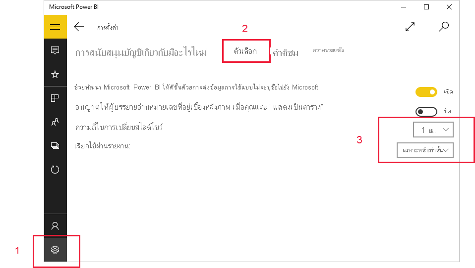

# ดูรายงานและแดชบอร์ดในโหมดงานนำเสนอบน Surface Hub และอุปกรณ์ Windows 10
คุณสามารถใช้โหมดการนำเสนอเพื่อแสดงรายงานและแดชบอร์ดแบบเต็มหน้าจอบนอุปกรณ์ Windows 10 และ Surface Hub โหมดการนำเสนอมีประโยชน์สำหรับการแสดง Power BI ในการประชุม หรือบนโปรเจคเตอร์เฉพาะในสำนักงาน หรือแม้แต่เพียงเพื่อการขยายพื้นที่บนหน้าจอขนาดเล็ก

ในโหมดการนำเสนอ:
* "chrome" ทั้งหมด (เช่นแถบการนำทางและเมนู) หายไปทำให้ง่ายต่อการเน้นข้อมูลในรายงานของคุณ
* แถบเครื่องมือการดำเนินการจะพร้อมใช้งานเพื่อให้คุณสามารถโต้ตอบกับข้อมูลของคุณและเพื่อควบคุมการนำเสนอได้
* คุณสามารถเล่นสไลด์โชว์ที่วนอัตโนมัติระหว่างหน้าบุ๊คมาร์คหรือทั้งหน้าและบุ๊คมาร์ค

>[!NOTE]
>การสนับสนุนแอปอุปกรณ์เคลื่อนที่ Power BI สำหรับ **โทรศัพท์ที่ใช้ Windows 10 Mobile** จะถูกยกเลิกในวันที่ 16 มีนาคม 2021 [ศึกษาเพิ่มเติม](https://go.microsoft.com/fwlink/?linkid=2121400)

## ใช้โหมดการนำเสนอ
ในแอปมือถือ Power BI แตะไอคอน**เต็มหน้าจอ**เพื่อไปยังโหมดเต็มหน้าจอ
 แอป Chrome หายไปและแถบเครื่องมือแอคชันปรากฏที่ด้านล่างของหน้าจอหรือทางด้านขวาและซ้าย (ขึ้นอยู่กับขนาดหน้าจอของคุณ)

จากแถบเครื่องมือ คุณสามารถแตะเพื่อดำเนินการต่อไปนี้:

|||
|-|-|
||**กลับไป** ที่หน้าก่อนหน้า การแตะที่ไอคอนเป็นระยะเวลานานจะปรากฏหน้าต่าง breadcrumbs ช่วยคุณนำทางไปยังโฟลเดอร์ที่มีรายงานหรือแดชบอร์ดของคุณ|
||**สลับหน้า** ไปยังหน้าอื่นของรายงานในงานนำเสนอของคุณ|
||**ใช้บุ๊กมาร์ก** เพื่อแสดงมุมมองเฉพาะของข้อมูลของคุณที่บุ๊กมาร์กจับ คุณสามารถใช้ทั้งบุ๊กมาร์กส่วนบุคคลและรายงาน|
||**เลือกสีหมึก** เมื่อคุณใช้ปากกา Surface เพื่อวาด และใส่คำอธิบายประกอบบนหน้ารายงานของคุณ|
||**ลบเครื่องหมายหมึก** ที่คุณอาจดำเนินการด้วยปากกา Surface เพื่อวาดและใส่คำอธิบายประกอบบนหน้ารายงานของคุณ          |
||**รีเซ็ตเป็นมุมมองเริ่มต้น** และล้างตัวกรองใดๆ ตัวแบ่งส่วนข้อมูล หรือการเปลี่ยนแปลงมุมมองข้อมูลอื่นๆ ที่คุณอาจทำในระหว่างการนำเสนอ|
||**แชร์** รูปภาพของมุมมองการนำเสนอกับเพื่อนร่วมงานของคุณ รูปภาพจะประกอบด้วยคำอธิบายประกอบใดๆ ที่คุณได้ทำกับปากกา Surface ในระหว่างการนำเสนอ|
||**รีเฟรช** รายงาน|
||**เล่นสไลด์โชว์** ซ่อนแถบแอ็คชันและเริ่มสไลด์โชว์ ตัวเลือกจะช่วยให้คุณสามารถเลือกการหมุนอัตโนมัติระหว่างหน้า บุ๊กมาร์ก หรือทั้งหน้าและบุ๊กมาร์กได้ ตามค่าเริ่มต้นสไลด์โชว์จะหมุนอัตโนมัติระหว่างหน้าทุกๆ 30 วินาที คุณสามารถเปลี่ยนการตั้งค่าเหล่านี้ใน [**การตั้งค่า > ตัวเลือก**](#slideshow-settings) ดู [รายละเอียดเพิ่มเติม](#slideshows) เกี่ยวกับสไลด์โชว์|
||**ออก** จากโหมดการนำเสนอ|
||**ค้นหา** สำหรับวัตถุอื่นๆ ใน Power BI|

คุณสามารถยกเลิกการปลดแถบเครื่องมือและลากแล้วปล่อยไปยังที่ใดก็ได้บนหน้าจอ ซึ่งจะเป็นประโยชน์สำหรับหน้าจอขนาดใหญ่ เมื่อคุณต้องการเน้นบริเวณที่ระบุในรายงานของคุณ และต้องการให้มีเครื่องมือที่พร้อมใช้งานอยู่ถัดจากรายงานด้วย เพียงแค่วางนิ้วของคุณบนแถบเครื่องมือ และปัดลงในพื้นที่รายงาน

## สไลด์

คุณสามารถเล่นสไลด์โชว์เพื่อวนซ้ำโดยอัตโนมัติผ่านการนำเสนอของคุณ คุณสามารถตั้งค่าสไลด์โชว์เพื่อวนผ่านหน้า บุ๊กมาร์ก หรือทั้งหน้าและบุ๊กมาร์กได้

เมื่อคุณเลือกปุ่ม **เล่น** บนแถบเครื่องมือการดำเนินการ สไลด์โชว์จะเริ่มต้น ตัวควบคุมจะปรากฏขึ้นเพื่อให้คุณสามารถหยุดสไลด์โชว์ชั่วคราวหรือเปลี่ยนแปลงสิ่งที่กำลังเล่นอยู่: หน้า, บุ๊กมาร์ก หรือทั้งหน้าและบุ๊กมาร์ก

 ตัวควบคุมแสดงชื่อของมุมมองที่แสดงอยู่ในปัจจุบัน (หน้า หรือบุ๊กมาร์กและหน้า) ในรูปด้านบนเราเห็นว่าในรายงานที่เรียกว่า **ยอดขาย** เรากำลังดูบุ๊กมาร์ก **เอเชียแปซิฟิก** บนหน้า **ประสิทธิภาพการทำงานการขาย**

ตามค่าเริ่มต้น ระบบจะแสดงสไลด์โชว์ในหน้าเท่านั้น โดยมีอัตราการเปลี่ยนภาพในทุก ๆ 30 วินาที ค่าเริ่มต้นของคุณใน[การตั้งค่าสไลด์โชว์](#slideshow-settings).

### เล่นสไลด์โชว์อัตโนมัติเมื่อเริ่มต้น

คุณสามารถตั้งค่าแอป Power BI สำหรับอุปกรณ์เคลื่อนที่ให้เริ่มเล่นสไลด์โชว์โดยอัตโนมัติเมื่อใดก็ตามที่มีการเปิดใช้งานแอปได้ ตัวเลือกนี้จะมีประโยชน์ในการสร้างประสบการณ์เหมือนกับการใช้คีออสที่มีการแสดงรายงานต่อสาธารณะโดยไม่ต้องมีการดำเนินการเอง โปรดดูรายละเอียดการตั้งค่าการเล่นรายงานอัตโนมัติได้ที่[การตั้งค่าสไลด์โชว์](#slideshow-settings)

### การตั้งค่าสไลด์โชว์

ตามค่าเริ่มต้น ระบบจะแสดงสไลด์โชว์ในหน้าเท่านั้น โดยมีอัตราการเปลี่ยนภาพในทุก ๆ 30 วินาที คุณสามารถเปลี่ยนการตั้งค่าเริ่มต้นเหล่านี้ได้โดยไปที่ **การตั้งค่า > ตัวเลือก** ดังภาพที่แสดงด้านล่าง คุณยังสามารถเปิดใช้งานการเล่นอัตโนมัติและเลือกรายงานที่จะเล่นได้อีกด้วย

1. เลือกไอคอนการตั้งค่า

1. เปิดแท็บตัวเลือก

1. หากต้องการ คุณสามารถเปลี่ยนการตั้งค่าเริ่มต้นให้สไลด์โชว์แสดงบนตำแหน่งที่คุณต้องการได้ (หน้า บุ๊คมาร์ก หรือทั้งสองตำแหน่ง) และสามารถกำหนดความถี่ในการเปลี่ยนสไลด์ได้

1. หากคุณต้องการให้เริ่มเล่นรายงานโดยอัตโนมัติเมื่อเปิดแอป ให้เปิดทอกเกิลแล้วเลือก **เลือกรายงาน** คุณจะสามารถค้นหารายงานที่คุณมีสิทธิ์เข้าถึงได้

## ขั้นตอนถัดไป
* [แสดงแดชบอร์ดและรายงานในโหมดเต็มหน้าจอจากบริการของ Power BI](../end-user-focus.md)
* มีคำถามหรือไม่ [ลองถามชุมชน Power BI](https://community.powerbi.com/)