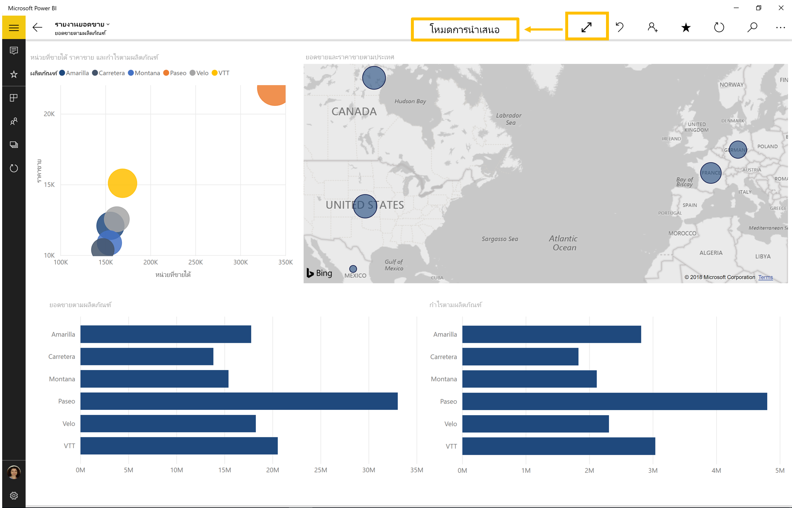

# ดูรายงานและแดชบอร์ดในโหมดงานนำเสนอบน Surface Hub และอุปกรณ์ Windows 10
คุณสามารถใช้โหมดการนำเสนอเพื่อแสดงรายงานและแดชบอร์ดแบบเต็มหน้าจอบนอุปกรณ์ Windows 10 และ Surface Hub 

โหมดการนำเสนอมีประโยชน์สำหรับการแสดง Power BI ในการประชุม หรือบนโปรเจคเตอร์เฉพาะในสำนักงาน หรือแม้แต่เพียงเพื่อการขยายพื้นที่บนหน้าจอขนาดเล็ก 

ในโหมดการนำเสนอบนแอปมือถือ Power BI สำหรับ Windows 10 "chrome" ทั้งหมดเช่น แถบนำทางและเมนูจะถูกเอาออกเพื่อให้คุณและสมาชิกในทีมของคุณสามารถเน้นไปที่ข้อมูลในรายงานของคุณ แถบเครื่องมือที่มีการดำเนินการจะพร้อมใช้งานสำหรับคุณและช่วยให้คุณสามารถโต้ตอบและทำงานร่วมกับข้อมูลของคุณได้ในขณะที่อยู่ในโหมดการนำเสนอ

คุณยังสามารถ[แสดงแดชบอร์ดและรายงานในโหมดเต็มหน้าจอจากบริการ Power BI](../end-user-focus.md)บนเว็บได้

> [!NOTE]
> โหมดการนำเสนอจะแตกต่างจาก[โหมดโฟกัสสำหรับไทล์](mobile-tiles-in-the-mobile-apps.md)
> 
> 

## ใช้โหมดการนำเสนอ
ในแอปมือถือ Power BI แตะไอคอน**เต็มหน้าจอ**เพื่อไปยังโหมดเต็มหน้าจอ
 แอป Chrome จะหายไปและแถบเครื่องมือจะปรากฏที่ด้านล่างของหน้าจอหรือทางด้านขวาและซ้าย (ขึ้นอยู่กับขนาดหน้าจอของคุณ)

จากแถบเครื่องมือ คุณสามารถดำเนินการต่อไปนี้:

1. แตะไอคอนย้อนกลับ  กลับไปยังหน้าก่อนหน้าของคุณ การแตะที่ไอคอนเป็นระยะเวลานานจะปรากฏหน้าต่าง breadcrumbs ช่วยคุณนำทางไปยังโฟลเดอร์ที่มีรายงานหรือแดชบอร์ดของคุณ
2. ไอคอนหมึก  จะช่วยให้สามารถเลือกสีได้เมื่อคุณใช้ปากกา Surface เพื่อวาด และใส่คำอธิบายประกอบบนหน้ารายงานของคุณ 
3. ใช้ไอคอนหน้า  เมื่อต้องแทนหน้ารายงานที่คุณกำลังนำเสนอในปัจจุบัน
4. แตะคอนค้นหา  เมื่อต้องค้นหาสิ่งประดิษฐ์อื่นใน Power BI
5. เมื่อต้องการออกจากโหมดการนำเสนอ ให้แตะไอคอนที่มีลูกศร 2 อันหันหน้าเข้าหากัน  บนแถบเครื่องมือ

คุณสามารถปลดการเชื่อมต่อแถบเครื่องมือและลากเพื่อค้นหาได้ทุกที่บนหน้าจอ ซึ่งจะเป็นประโยชน์สำหรับหน้าจอขนาดใหญ่ เมื่อคุณต้องการเน้นบริเวณที่ระบุในรายงานของคุณ และต้องการให้มีเครื่องมือที่พร้อมใช้งานอยู่ถัดจากรายงานด้วย เพียงแค่วางนิ้วของคุณบนแถบเครื่องมือ และปัดลงในพื้นที่รายงาน

## ขั้นตอนถัดไป
* [แสดงแดชบอร์ดและรายงานในโหมดเต็มหน้าจอจากบริการของ Power BI](../end-user-focus.md)
* มีคำถามหรือไม่ [ลองถามชุมชน Power BI](http://community.powerbi.com/)

