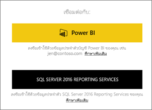
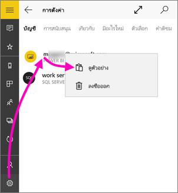
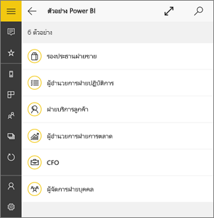
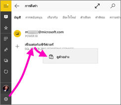
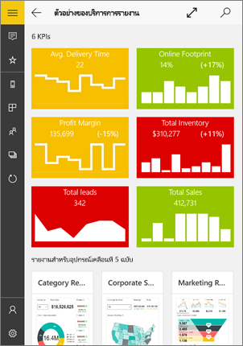
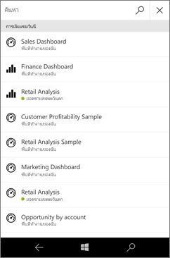
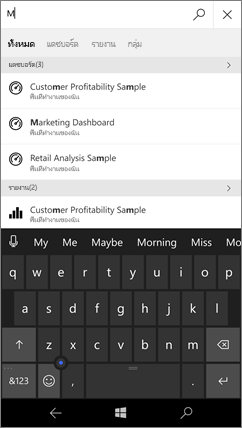
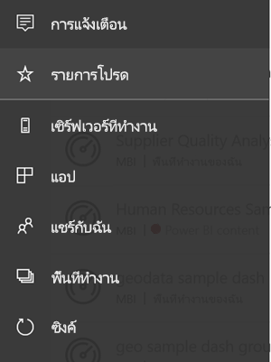
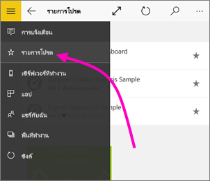
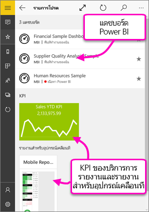

# เริ่มใช้งานแอป Power BI สำหรับอุปกรณ์เคลื่อนที่สำหรับ Windows 10
แอป Power BI สำหรับอุปกรณ์เคลื่อนที่บน Windows 10 นำ Power BI ไปยังแท็บเล็ตหรือโทรศัพท์ของคุณ คุณจะได้รับการเข้าถึงข้อมูลทางธุรกิจของคุณที่มีการปรับปรุงล่าสุดผ่านทางอุปกรณ์เคลื่อนที่ที่เปิดใช้งานระบบสัมผัส ดูและโต้ตอบกับแดชบอร์ดบริษัทของคุณจากที่ใดก็ได้บน [หน้าจอเริ่มต้นของ Windows](mobile-pin-dashboard-start-screen-windows-10-phone-app.md)

คุณ[สร้างแดชบอร์ดและรายงานในบริการของ Power BI](../../service-get-started.md) ด้วยข้อมูลของคุณ 

จากนั้น โต้ตอบกับแดชบอร์ดและรายงานของคุณ สำรวจข้อมูล บันทึก แล้วแชร์ ทั้งหมดจากแอป Power BI สำหรับอุปกรณ์เคลื่อนที่สำหรับ Windows 10

## สิ่งแรกที่ต้องทำ
* [**ดาวน์โหลดแอป Power BI บนอุปกรณ์เคลื่อนที่สำหรับ Windows 10**](https://go.microsoft.com/fwlink/?LinkID=526478) จาก Windows Store
  
  อุปกรณ์ของคุณต้องทำงานบน Windows 10 แอปสามารถใช้งานได้บนอุปกรณ์ที่มี RAM อย่างน้อย 3 GB และพื้นที่เก็บข้อมูลภายใน 8 GB
   
* ดูว่า[มีอะไรใหม่ในแอป Power BI สำหรับอุปกรณ์เคลื่อนที่](mobile-whats-new-in-the-mobile-apps.md)

## ลงทะเบียนสำหรับบริการของ Power BI บนเว็บ
ถ้าคุณยังไม่ได้ลงทะเบียน ให้ไปยัง[บริการของ Power BI](https://powerbi.com/) ลงทะเบียนสำหรับบัญชีของคุณเองเพื่อสร้างและจัดเก็บแดชบอร์ดและรายงานและนำข้อมูลของคุณมารวมเข้าด้วยกัน จากนั้น ลงชื่อเข้าใช้ Power BI จากอุปกรณ์ Windows 10 ของคุณเพื่อดูแดชบอร์ดของคุณเองจากที่ไหนก็ได้

1. ในบริการของ Power BI แตะ [ลงทะเบียน](https://go.microsoft.com/fwlink/?LinkID=513879) เพื่อสร้างบัญชี Power BI
2. เริ่มต้น[สร้างแดชบอร์ดและรายงานของคุณเอง](../../service-get-started.md)

## เริ่มต้นใช้งานแอป Power BI
1. บนหน้าจอเริ่มต้นของอุปกรณ์ Windows 10 ให้เปิดแอป Power BI
   
   
2. เมื่อต้องการดูแดชบอร์ดและรายงาน Power BI ของคุณ แตะ **Power BI** ลงชื่อเข้าใช้ด้วยข้อมูลประจำตัวเดียวกันกับข้อมูลประจำตัวบัญชี Power BI บนเว็บของคุณ 
   
   เมื่อต้องการดูรายงานอุปกรณ์มือถือและ KPI ของ Reporting Services ของคุณ ให้แตะ **SQL Server 2016 Reporting Services** ลงชื่อเข้าใช้ด้วยข้อมูลประจำตัว SQL Server Reporting Services ของคุณ
   
   
3. แตะ **เริ่มต้นสำรวจ** เพื่อดูแดชบอร์ดของคุณเอง

## ลองใช้ตัวอย่าง Power BI และ Reporting Services
แม้ว่าจะยังไม่ลงทะเบียน คุณสามารถเล่นกับตัวอย่าง Power BI และ Reporting Services ได้ หลังจากคุณดาวน์โหลดแอป คุณสามารถดูตัวอย่าง หรือเริ่มต้นใช้งาน กลับไปยังตัวอย่างเมื่อใดก็ตามที่คุณต้องการ จากโฮมเพจแดชบอร์ด

### ตัวอย่าง Power BI
คุณสามารถดูและโต้ตอบกับตัวอย่างแดชบอร์ด Power BI ได้ แต่มีบางสิ่งที่คุณไม่สามารถทำได้กับแดชบอร์ดดังกล่าว คุณไม่สามารถเปิดรายงานเบื้องหลังแดชบอร์ด แชร์ตัวอย่างกับผู้อื่น หรือทำให้เป็นรายการโปรดของคุณ

1. แตะปุ่มการนำทางส่วนกลาง  ในมุมบนซ้าย
2. แตะไอคอน **การตั้งค่า** แตะชื่อของคุณ จากนั้นแตะ **ดูตัวอย่าง**
   
   
3. เลือกบทบาท และสำรวจแดชบอร์ดตัวอย่างสำหรับบทบาทนั้น  
   
   

### ตัวอย่างรายงานอุปกรณ์มือถือของ Reporting Services
1. แตะปุ่มการนำทางส่วนกลาง  ในมุมบนซ้าย
2. แตะไอคอน **การตั้งค่า** คลิกขวาหรือแตะ **เชื่อมต่อกับเซิร์ฟเวอร์** ค้างไว้ จากนั้นแตะ **ดูตัวอย่าง**
   
   
3. เปิดโฟลเดอร์รายงานการขายปลีกหรือรายงานการขาย เพื่อสำรวจ KPI และรายงานอุปกรณ์มือถือของโฟลเดอร์เหล่านี้
   
   

## ค้นหาแดชบอร์ด รายงาน และแอป
ค้นหาแดชบอร์ด รายงาน และแอปของคุณได้อย่างรวดเร็ว โดยพิมพ์ในกล่องค้นหาที่ด้านบนของแอปเสมอ

1. แตะไอคอนค้นหาที่มุมขวาบน
   
   
   
   Power BI แสดงแดชบอร์ด รายงาน และแอปล่าสุดของคุณ
   
   
2. เมื่อคุณเริ่มพิมพ์ Power BI จะแสดงผลลัพธ์ที่เกี่ยวข้องทั้งหมด
   
   

## ค้นหาเนื้อหาของคุณในแอป Power BI สำหรับอุปกรณ์เคลื่อนที่
แดชบอร์ดและรายงานของคุณได้รับการจัดเก็บไว้คนละแห่งในแอป Power BI สำหรับอุปกรณ์เคลื่อนที่ ขึ้นอยู่กับว่ามาจากที่ใด อ่านเกี่ยวกับ[การค้นหาเนื้อหาของคุณในแอปสำหรับอุปกรณ์เคลื่อนที่](mobile-apps-quickstart-view-dashboard-report.md) นอกจากนี้ คุณสามารถค้นหาสิ่งต่างๆ ที่คุณมีในแอป Power BI สำหรับอุปกรณ์เคลื่อนที่ 

## ดูแดชบอร์ด KPI และรายงานโปรดของคุณ
ดูแดชบอร์ด Power BI โปรดทั้งหมดของคุณ ร่วมกับ KPI และรายงานอุปกรณ์มือถือของ Reporting Services ในหน้ารายการโปรดในแอปสำหรับอุปกรณ์เคลื่อนที่ เมื่อคุณทำให้แดชบอร์ดเป็น*รายการโปรด*ในแอป Power BI สำหรับอุปกรณ์เคลื่อนที่ คุณสามารถเข้าถึงแดชบอร์ดดังกล่าวได้จากทุกอุปกรณ์ของคุณ รวมถึงบริการของ Power BI ในเบราว์เซอร์ของคุณได้ 

* แตะ **รายการโปรด**
  
   
  
   รายการโปรด Power BI ของคุณและรายการโปรดของคุณจากพอร์ทัลเว็บ Reporting Services อยู่ในหน้านี้ทั้งหมด
  
   

อ่านข้อมูลเพิ่มเติมเกี่ยวกับ [รายการโปรดในแอป Power BI สำหรับอุปกรณ์เคลื่อนที่](mobile-apps-favorites.md)

## ขั้นตอนถัดไป
ต่อไปนี้คือสิ่งอื่นๆ ที่คุณสามารถทำในแอป Power BI สำหรับ Windows 10 กับแดชบอร์ดและรายงานใน Power BI ตลอดจนรายงานอุปกรณ์มือถือและ KPI ของ Reporting Services ในพอร์ทัลเว็บ Reporting Services

### แดชบอร์ดและรายงาน Power BI
* ดู[แอปของคุณ](../../service-create-distribute-apps.md)
* ดู[แดชบอร์ด](mobile-apps-view-dashboard.md)ของคุณ
* [ปักหมุดไทล์และแดชบอร์ด Power BI](mobile-pin-dashboard-start-screen-windows-10-phone-app.md) เป็นไทล์รายงานสดบนหน้าจอเริ่มต้นของอุปกรณ์ของคุณ
* [แชร์ไทล์](mobile-windows-10-phone-app-get-started.md)
* แชร์[แดชบอร์ด](mobile-share-dashboard-from-the-mobile-apps.md)

### รายงานอุปกรณ์มือถือและ KPI ของ Reporting Services
* [ดูรายงานอุปกรณ์มือถือและ KPI ของ Reporting Services](mobile-app-windows-10-ssrs-kpis-mobile-reports.md) ในแอป Power BI สำหรับอุปกรณ์เคลื่อนที่สำหรับอุปกรณ์ Windows 10
* สร้าง [KPI บนพอร์ทัลเว็บ Reporting Services](https://msdn.microsoft.com/library/mt683632.aspx)
* [สร้างรายงานอุปกรณ์มือถือของคุณเองด้วย SQL Server Mobile Report Publisher](https://msdn.microsoft.com/library/mt652547.aspx) และเผยแพร่ไปยังพอร์ทัลเว็บ Reporting Services

## ขั้นตอนถัดไป
* [ดาวน์โหลดแอป Power BI](https://go.microsoft.com/fwlink/?LinkID=526478) จาก Windows Store  
* [Power BI คืออะไร](../../fundamentals/power-bi-overview.md)
* มีคำถามหรือไม่ [ลองถามชุมชน Power BI](https://community.powerbi.com/)

