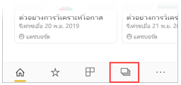
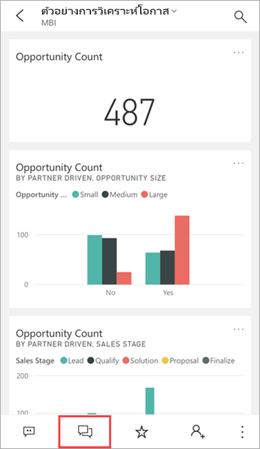
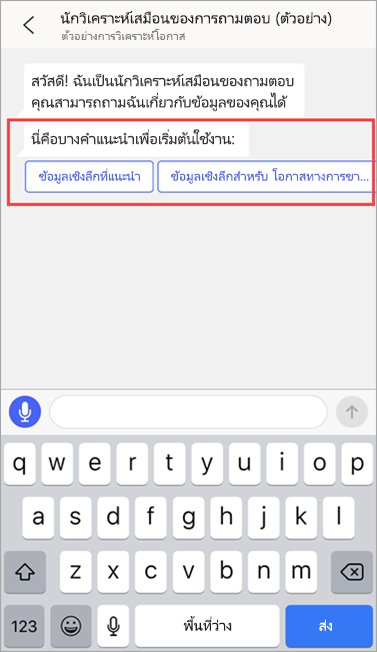
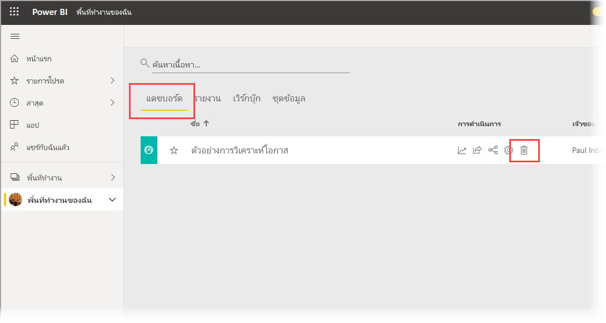
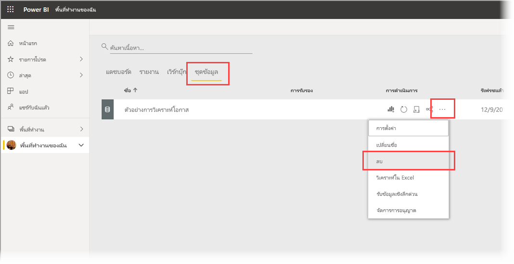

# บทช่วยสอน: ถามเกี่ยวกับข้อมูลของคุณกับ Q&A นักวิเคราะห์เสมือนในแอป Power BI iOS

วิธีง่ายที่สุดในการเรียนรู้เกี่ยวกับข้อมูลของคุณ คือ การถามคำถามเกี่ยวกับข้อมูลของคุณโดยใช้ถ้อยคำของคุณเอง ในบทช่วยสอนนี้ คุณถามคำถามและดูข้อมูลเชิงลึกที่แนะนำเกี่ยวกับข้อมูลตัวอย่าง กับนักวิเคราะห์เสมือนของถามตอบ ในแอปมือถือ Microsoft Power BI บน iPad หรือ iPhone ของคุณ 

นำไปใช้กับ:

|  |  |
|:--- |:--- |
| iPhone |iPad |

นักวิเคราะห์เสมือนของถามตอบ เป็นประสบการณ์การสนทนาข่าวกรองธุรกิจ ที่เข้าถึงข้อมูลการถามตอบเบื้องต้นใน [บริการของ Power BI](https://powerbi.com) ซึ่งแนะนำข้อมูลเชิงลึก และคุณสามารถพิมพ์ หรือพูดคำถามของคุณเอง

ในบทช่วยสอนนี้ คุณจะได้:

> [!div class="checklist"]
> * ติดตั้งแอป Power BI บนมือถือสำหรับ iOS
> * ดาวน์โหลดรายงานและแดชบอร์ดตัวอย่าง Power BI
> * ดูข้อมูลเชิงลึกที่แนะนำโดยแอปสำหรับอุปกรณ์เคลื่อนที่

## ข้อกำหนดเบื้องต้น

* **ลงทะเบียนใช้งาน Power BI**: ถ้าคุณไม่ได้ลงทะเบียน Power BI ให้[ลงทะเบียนรุ่นทดลองใช้ฟรี](https://app.powerbi.com/signupredirect?pbi_source=web)ก่อนที่คุณจะเริ่มต้นใช้งาน
* **ติดตั้งแอป Power BI สำหรับ iOS**: [ดาวน์โหลดแอป iOS](https://apps.apple.com/app/microsoft-power-bi/id929738808) จาก Apple App Store ไปยัง iPad, iPhone หรือ iPod Touch ของคุณ เวอร์ชันต่อไปนี้รองรับแอป Power BI สำหรับ iOS:
  * iPad ที่มี iOS 11 หรือใหม่กว่า
  * iPhone 5 และสูงกว่า ที่มี iOS 11 หรือใหม่กว่า 
  * iPod Touch ที่มี iOS 11 หรือใหม่กว่า
* **ดาวน์โหลดข้อมูลตัวอย่าง**: ขั้นตอนแรกคือดาวน์โหลด **ตัวอย่างการวิเคราะห์โอกาส** ไปยังบริการ Power BI ดู [การดาวน์โหลดตัวอย่างไปยังพื้นที่ทำงานของฉันในบริการ Power BI](./mobile-apps-download-samples.md) สำหรับคำแนะนำเกี่ยวกับวิธีการดำเนินการนี้

เมื่อคุณดำเนินการข้อกำหนดเบื้องต้นเสร็จสิ้นและดาวน์โหลดข้อมูลตัวอย่างแล้ว คุณก็พร้อมที่จะดูตัวอย่างบนอุปกรณ์ iOS ของคุณ

## ลองใช้ข้อมูลเชิงลึกที่แนะนำ
1. บน iPhone หรือ iPad ของคุณ เปิดแอป Power BI แล้วลงชื่อเข้าใช้ด้วยข้อมูลประจำตัวของบัญชีผู้ใช้ Power BI ของคุณ ซึ่งเป็นบัญชีเดียวกันกับที่คุณใช้ในบริการของ Power BI ในเบราว์เซอร์

2. บนแถบนำทางของหน้าหลัก ให้แตะไอคอน **พื้นที่ทำงาน**

    

3. เมื่อเปิดหน้าพื้นที่ทำงานแล้ว ให้แตะ **พื้นที่ทำงานของฉัน** จากนั้นแดชบอร์ด **ตัวอย่างการวิเคราะห์โอกาส** เพื่อเปิด

3. บนแดชบอร์ดตัวอย่างการวิเคราะห์โอกาส ให้แตะไอคอนนักวิเคราะห์เสมือนของถามตอบในเมนูการดำเนินการ

    

    นักวิเคราะห์เสมือนของถามตอบจะมีตัวอย่างคำแนะนำ เพื่อเริ่มต้นใช้งาน

    

3. แตะ **ข้อมูลเชิงลึกที่แนะนำ**

4. นักวิเคราะห์เสมือนของถามตอบจะแนะนำตัวอย่างข้อมูลเชิงลึกให้คุณทราบ เลื่อนไปทางขวา แล้วแตะ**ข้อมูลเชิงลึก 2**

    

   นักวิเคราะห์เสมือนของถามตอบจะแสดงข้อมูลเชิงลึก 2

    

5. แตะแผนภูมิเพื่อเปิดในโหมดโฟกัส

    

6. แตะลูกศรที่มุมซ้ายบน เพื่อกลับไปยังประสบการการใช้งานของนักวิเคราะห์เสมือนของถามตอบ

## ล้างแหล่งข้อมูล

เมื่อคุณจบบทช่วยสอนนี้แล้ว คุณสามารถลบแดชบอร์ด, รายงาน และชุดข้อมูลของตัวอย่างการวิเคราะห์โอกาสทางการขายได้

1. เปิดบริการ Power BI ([บริการ Power BI](https://app.powerbi.com)) และลงชื่อเข้าใช้

2. ในบานหน้าต่างการนำทาง ให้เลือก **พื้นที่ทำงานของฉัน**

3. คลิกที่แท็บแดชบอร์ด จากนั้นบนบรรทัดตัวอย่างการวิเคราะห์โอกาส ให้คลิกที่ถังขยะ

    

    เวลานี้ให้เลือกแท็บรายงานและทำแบบเดียวกัน

4. เวลานี้ให้เลือกแท็บชุดข้อมูล คลิก **ตัวเลือกเพิ่มเติม** (...) จากนั้นเลือก **ลบ**

    

## ขั้นตอนถัดไป

คุณได้ลอง นักวิเคราะห์เสมือนของถามตอบ ในแอปมือถือ Power BI สำหรับ iOS แล้ว เรียนรู้เพิ่มเติมเกี่ยวกับ ถามตอบในบริการของ Power BI
> [!div class="nextstepaction"]
> [การถามตอบในบริการ Power BI](../end-user-q-and-a.md)