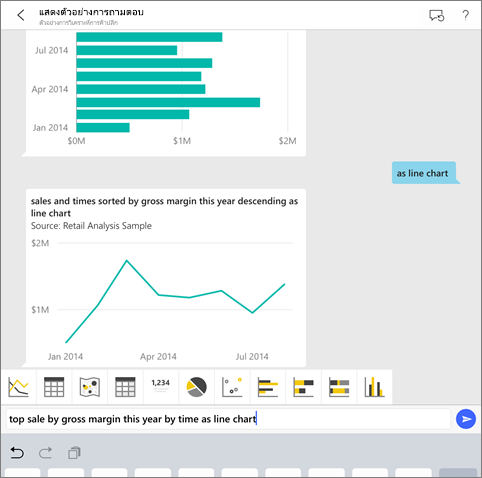
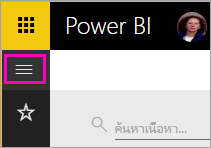
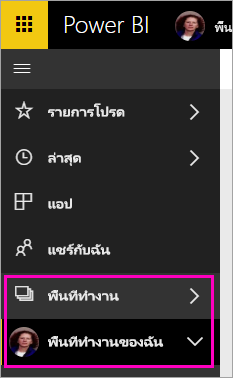
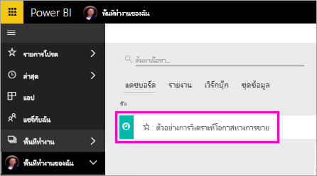
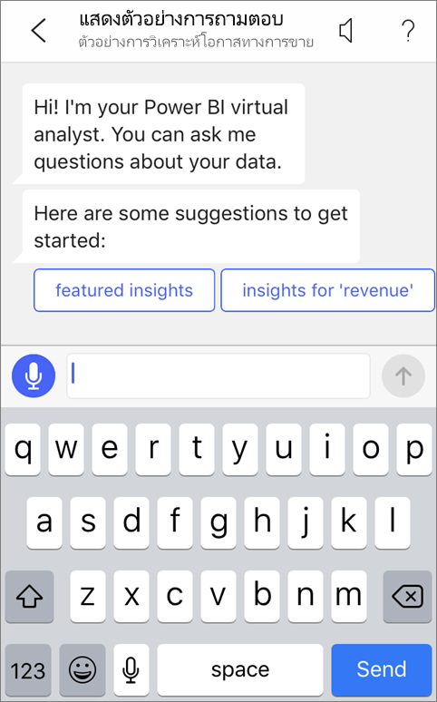
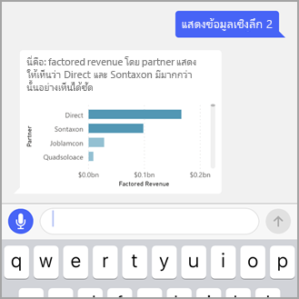
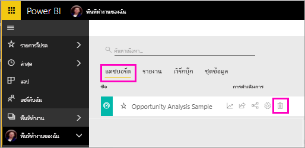

# บทช่วยสอน: ถามเกี่ยวกับข้อมูลของคุณกับ Q&A นักวิเคราะห์เสมือนในแอป Power BI iOS

วิธีง่ายที่สุดในการเรียนรู้เกี่ยวกับข้อมูลของคุณ คือ การถามคำถามเกี่ยวกับข้อมูลของคุณโดยใช้ถ้อยคำของคุณเอง ในบทความนี้ คุณจะถามคำถาม และดูข้อมูลเชิงลึกที่แนะนำเกี่ยวกับข้อมูลตัวอย่าง กับนักวิเคราะห์เสมือนของถามตอบ ในแอปมือถือ Microsoft Power BI บน iPad, iPhone และ iPod Touch ของคุณ 

นำไปใช้กับ:

|  |  |
|:--- |:--- |
| iPhone |iPad |

นักวิเคราะห์เสมือนของถามตอบ เป็นประสบการณ์การสนทนาข่าวกรองธุรกิจ ที่เข้าถึงข้อมูลการถามตอบเบื้องต้นในบริการของ Power BI [(https://powerbi.com)](https://powerbi.com) ซึ่งแนะนำข้อมูลเชิงลึก และคุณสามารถพิมพ์ หรือพูดคำถามของคุณเอง

ในบทช่วยสอนนี้ คุณจะได้:

> [!div class="checklist"]
> * ติดตั้งแอป Power BI บนมือถือสำหรับ iOS
> * ดาวน์โหลดรายงานและแดชบอร์ดตัวอย่าง Power BI
> * ดูข้อมูลเชิงลึกที่แนะนำโดยแอปสำหรับอุปกรณ์เคลื่อนที่

ถ้าคุณไม่ได้ลงทะเบียน Power BI ให้[ลงทะเบียนรุ่นทดลองใช้ฟรี](https://app.powerbi.com/signupredirect?pbi_source=web)ก่อนที่คุณจะเริ่มต้นใช้งาน

## ข้อกำหนดเบื้องต้น

### ติดตั้งแอป Power BI สำหรับ iOS
[ดาวน์โหลดแอป iOS](http://go.microsoft.com/fwlink/?LinkId=522062 "ดาวน์โหลดแอป iPhone") จาก Apple App Store ไปยัง iPad, iPhone หรือ iPod Touch ของคุณ

เวอร์ชันเหล่านี้สนับสนุนแอป Power BI สำหรับ iOS:
- iPad ที่มี iOS 10 หรือใหม่กว่า
- iPhone 5 และสูงกว่า ที่มี iOS 10 หรือใหม่กว่า 
- iPod Touch ที่มี iOS 10 หรือใหม่กว่า

### ดาวน์โหลดตัวอย่างการวิเคราะห์โอกาสทางการขาย
ขั้นตอนแรกในบทช่วยสอน คือ ดาวน์โหลดตัวอย่างการวิเคราะห์โอกาสทางการขายในบริการของ Power BI

1. เปิดบริการของ Power BI ในเบราว์เซอร์ของคุณ (app.powerbi.com) และลงชื่อเข้าใช้

1. เลือกที่ไอคอนนำทางส่วนกลาง เพื่อเปิดการนำทางด้านซ้าย

    

2. ในบานหน้าต่างนำทางด้านซ้าย เลือก **พื้นที่ทำงาน** > **พื้นที่ทำงานของฉัน**

    

3. ที่มุมล่างซ้าย เลือก**รับข้อมูล**
   
    

3. บนหน้า รับข้อมูล เลือกไอคอน**ตัวอย่าง**
   
   

4. เลือก **ตัวอย่างการวิเคราะห์โอกาสทางการขาย**
 
    
 
8. เลือก **เชื่อมต่อ**  
  
   
   
5. Power BI นำเข้าตัวอย่าง เพิ่มแดชบอร์ดใหม่, รายงาน และชุดข้อมูลลงในพื้นที่ทำงานของฉัน
   
   

คุณพร้อมที่จะดูตัวอย่างบนอุปกรณ์ iOS ของคุณแล้ว

## ลองใช้ข้อมูลเชิงลึกที่แนะนำ
1. บน iPhone หรือ iPad ของคุณ เปิดแอป Power BI แล้วลงชื่อเข้าใช้ด้วยข้อมูลประจำตัวของบัญชีผู้ใช้ Power BI ของคุณ ซึ่งเป็นบัญชีเดียวกันกับที่คุณใช้ในบริการของ Power BI ในเบราว์เซอร์

1.  แตะที่ปุ่มนำทางส่วนกลาง  > **พื้นที่ทำงาน** > **พื้นที่ทำงานของฉัน** และเปิดแดชบอร์ดตัวอย่างการวิเคราะห์โอกาสทางการขาย

2. แตะไอคอนนักวิเคราะห์เสมือนของถามตอบ  จากเมนูการดำเนินการที่ด้านล่างของหน้า (ที่ด้านบนของหน้าใน iPad)

     

     นักวิเคราะห์เสมือนของถามตอบสำหรับ Power BI จะมีตัวอย่างคำแนะนำ เพื่อเริ่มต้นใช้งาน

     
3. แตะ **ข้อมูลเชิงลึกที่แนะนำ**

     นักวิเคราะห์เสมือนของถามตอบจะแนะนำตัวอย่างข้อมูลเชิงลึกให้คุณทราบ
4. เลื่อนไปทางขวา แล้วแตะ**ข้อมูลเชิงลึก 2**

    

     นักวิเคราะห์เสมือนของถามตอบจะแสดงข้อมูลเชิงลึก 2

    
5. แตะแผนภูมิเพื่อเปิดในโหมดโฟกัส

    
6. แตะลูกศรที่มุมซ้ายบน เพื่อกลับไปยังประสบการการใช้งานของนักวิเคราะห์เสมือนของถามตอบ

## เพิ่มพื้นที่ทรัพยากร

เมื่อคุณจบบทช่วยสอนนี้แล้ว คุณสามารถลบแดชบอร์ด, รายงาน และชุดข้อมูลของตัวอย่างการวิเคราะห์โอกาสทางการขายได้

1. เปิดบริการของ Power BI (app.powerbi.com) และลงชื่อเข้าใช้

2. ในบานหน้าต่างนำทางด้านซ้าย เลือก **พื้นที่ทำงาน** > **พื้นที่ทำงานของฉัน**

3. บนแท็บ**แดชบอร์ด** เลือกที่ไอคอนถังขยะ **ลบ** ถัดจากแดชบอร์ดการวิเคราะห์โอกาสทางการขาย

    

4. เลือกแท็บ**รายงาน** และทำสิ่งเดียวกันสำหรับรายงานการวิเคราะห์โอกาสทางการขาย

5. เลือกแท็บ**ชุดข้อมูล** และทำสิ่งเดียวกันสำหรับชุดข้อมูลการวิเคราะห์โอกาสทางการขาย

## ขั้นตอนถัดไป

คุณได้ลอง นักวิเคราะห์เสมือนของถามตอบ ในแอปมือถือ Power BI สำหรับ iOS แล้ว เรียนรู้เพิ่มเติมเกี่ยวกับ ถามตอบในบริการของ Power BI
> [!div class="nextstepaction"]
> [การถามตอบในบริการ Power BI](../end-user-q-and-a.md)

