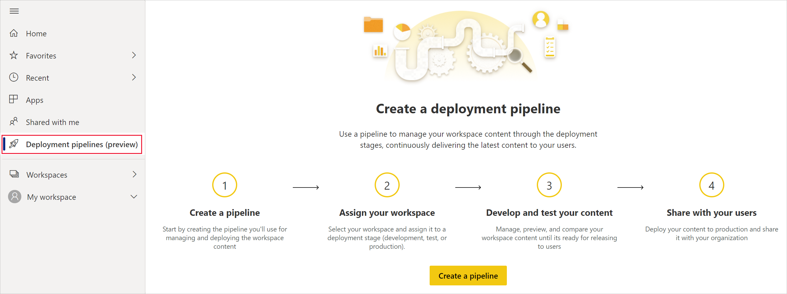
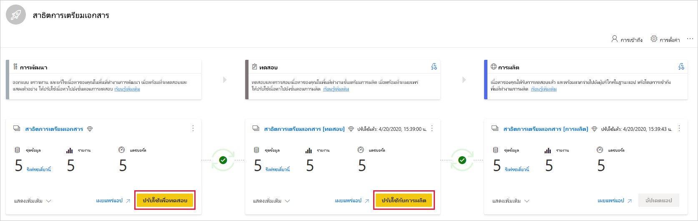
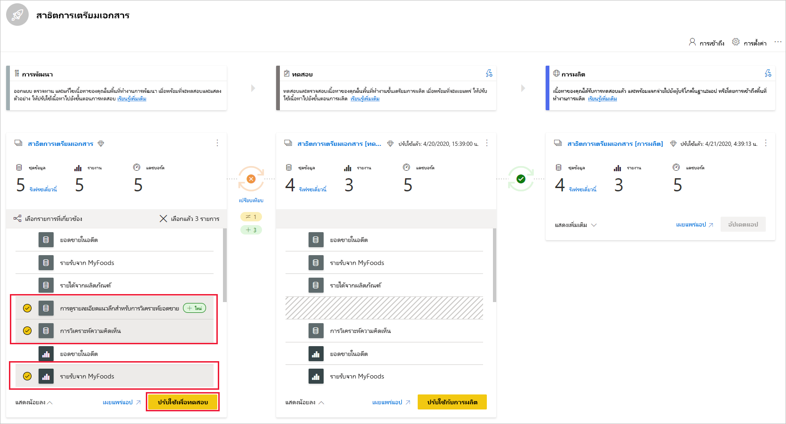
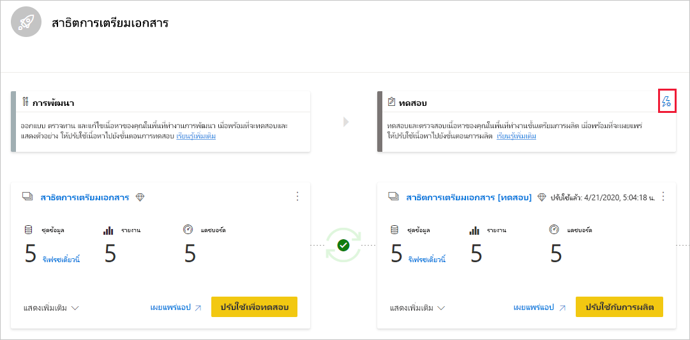
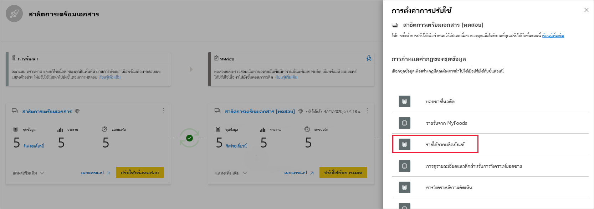

# เริ่มต้นด้วยไปป์ไลน์การปรับใช้ (ตัวอย่าง)

บทความนี้จะแนะนำการตั้งค่าพื้นฐานที่จำเป็นสำหรับการใช้ไปป์ไลน์การปรับใช้

## การเข้าถึงไปป์ไลน์การปรับใช้

คุณจะสามารถเข้าถึงคุณลักษณะของไปป์ไลน์การปรับใช้ได้ถ้าตรงตามเงื่อนไขต่อไปนี้:

* คุณเป็นผู้ใช้ Power BI [Pro](../admin/service-admin-purchasing-power-bi-pro.md)

* คุณเป็นสมาชิกขององค์กรที่มีความจุแบบพรีเมียม

* คุณเป็นผู้ดูแลระบบของ[ประสบการณ์ในพื้นที่ทำงานใหม่ของ](../collaborate-share/service-create-the-new-workspaces.md)

>[!NOTE]
> คุณยังสามารถดูปุ่มไปป์ไลน์การปรับใช้ถ้าคุณได้สร้างไปป์ไลน์ก่อนหน้านี้หรือถ้ามีการแชร์ไปป์ไลน์กับคุณ

## ขั้นตอนที่ 1 - สร้างไปป์ไลน์การปรับใช้งาน

หากต้องการสร้างไปป์ไลน์การปรับใช้ให้ทำดังต่อไปนี้:

1. ในการบริการของ Power BI จากบานหน้าต่างนำทางเลือก **ไปป์ไลน์การปรับใช้** และคลิก **สร้างไปป์ไลน์**

2. ในกล่องโต้ตอบ *สร้างการปรับใช้ไปป์ไลน์* ใส่ชื่อและคำอธิบายสำหรับไปป์ไลน์และคลิก **สร้าง**

หลังจากสร้างไปป์ไลน์แล้วคุณสามารถแชร์กับผู้ใช้อื่นหรือลบออกได้ เมื่อคุณแชร์ไปป์ไลน์กับผู้อื่น ผู้ใช้ที่คุณแชร์ไปป์ไลน์จะได้รับการ [การเข้าถึงไปป์ไลน์](deployment-pipelines-process.md#user-with-pipeline-access) การเข้าถึงไปป์ไลน์ช่วยให้ผู้ใช้สามารถดู แชร์ แก้ไข และลบไปป์ไลน์ได้

## ขั้นตอนที่ 2 - กำหนดพื้นที่ทำงานให้กับไปป์ไลน์การปรับใช้

หลังจากสร้างไปป์ไลน์แล้ว คุณจำเป็นต้องเพิ่มเนื้อหาที่คุณต้องการจัดการไปยังไปป์ไลน์ การเพิ่มเนื้อหาลงในไปป์ไลน์จะทำได้โดยการกำหนดพื้นที่ทำงานให้กับขั้นตอนไปป์ไลน์ คุณสามารถกำหนดพื้นที่ทำงานให้กับขั้นตอนใดๆได้ 

คุณสามารถกำหนดหนึ่งพื้นที่ทำงานให้กับไปป์ไลน์การปรับใช้ ไปป์ไลน์การปรับใช้จะสร้างการลอกแบบ ของเนื้อหาพื้นที่ทำงานเพื่อใช้ในขั้นตอนที่แตกต่างกันของไปป์ไลน์

ทำตามขั้นตอนเหล่านี้เพื่อกำหนดพื้นที่ทำงานในไปป์ไลน์การปรับใช้:

1. ในไปป์ไลน์การปรับใช้ที่สร้างขึ้นใหม่คลิก **กำหนดพื้นที่ทำงาน**

2. ในเมนูดรอปดาวน์ *เลือกพื้นที่ทำงาน* เลือกพื้นที่ทำงานที่คุณต้องการกำหนดให้กับไปป์ไลน์

3. เลือกขั้นตอนที่คุณต้องการกำหนดพื้นที่ทำงานให้

### ข้อจำกัดการกำหนดพื้นที่ทำงาน

* พื้นที่ทำงานต้องเป็น [ประสบการณ์ของพื้นที่ทำงานใหม่](../collaborate-share/service-create-the-new-workspaces.md)

* คุณต้องเป็นผู้ดูแลระบบของพื้นที่ทำงาน

* พื้นที่ทำงานไม่ได้ถูกกำหนดให้กับไปป์ไลน์อื่น

* พื้นที่ทำงานต้องอยู่ใน [ความจุแบบพรีเมียม](../admin/service-premium-what-is.md)

* คุณไม่สามารถกำหนดพื้นที่ทำงานด้วย [ตัวอย่าง Power BI](../create-reports/sample-datasets.md) ไปยังขั้นตอนของไปป์ไลน์

>[!NOTE]
>เฉพาะพื้นที่ทำงานที่สามารถใช้กับไปป์ไลน์การปรับใช้เท่านั้นที่จะแสดงในรายการของพื้นที่ทำงานที่คุณสามารถเลือกได้

## ขั้นตอนที่ 3 - ปรับใช้กับขั้นตอนที่ว่างเปล่า

[ผู้ใช้ Pro ใดๆ](../admin/service-admin-purchasing-power-bi-pro.md) ที่เป็นสมาชิกหรือผู้ดูแลระบบในพื้นที่ทำงานต้นทางสามารถปรับใช้เนื้อหาไปยังขั้นตอนที่ว่างเปล่า (ขั้นตอนที่ไม่มีเนื้อหา) พื้นที่ทำงานต้องอยู่ในความจุสำหรับการปรับใช้เพื่อให้เสร็จสมบูรณ์

เมื่อปรับใช้เนื้อหาไปยังขั้นตอนที่ว่างเปล่า ความสัมพันธ์ระหว่างรายการจะถูกเก็บไว้ ตัวอย่างเช่นรายงานที่ถูกผูกกับชุดข้อมูลในขั้นตอนแหล่งข้อมูลจะมีการลอกแบบควบคู่ไปกับชุดข้อมูลและโคลนจะถูกผูกไว้ในพื้นที่ทำงานเป้าหมาย

เมื่อการปรับใช้เสร็จสมบูรณ์ ให้รีเฟรชชุดข้อมูล สำหรับข้อมูลเพิ่มเติม ดู [ปรับใช้เนื้อหาไปยังขั้นตอนที่ว่างเปล่า](deployment-pipelines-process.md#deploying-content-to-an-empty-stage)

### ปรับใช้เนื้อหาทั้งหมด

เลือกขั้นตอนที่จะปรับใช้และคลิกปุ่มปรับใช้ กระบวนการปรับใช้สร้างพื้นที่ทำงานซ้ำในขั้นตอนเป้าหมาย พื้นที่ทำงานนี้ประกอบด้วยเนื้อหาทั้งหมดที่มีอยู่ในขั้นตอนปัจจุบัน

### การปรับใช้ที่เลือก

เมื่อต้องการปรับใช้เฉพาะรายการที่ระบุให้คลิกที่ **แสดงลิงก์** เพิ่มเติมแล้วเลือกรายการที่คุณต้องการปรับใช้ เมื่อคลิกปุ่มปรับใช้ เฉพาะรายการที่เลือกเท่านั้นที่จะถูกปรับใช้ในขั้นตอนถัดไป

เนื่องจากแดชบอร์ด รายงาน และชุดข้อมูลที่เกี่ยวข้องและมีการขึ้นต่อกัน คุณสามารถใช้ปุ่มเลือกที่เกี่ยวข้องเพื่อตรวจสอบรายการทั้งหมดที่รายการเหล่านั้นจะขึ้นอยู่ด้วย ตัวอย่างเช่นหากคุณต้องการปรับใช้รายงานไปยังขั้นตอนถัดไปการคลิกปุ่มเลือกที่เกี่ยวข้องจะทำเครื่องหมายชุดข้อมูลที่รายงานเชื่อมต่อด้วยเพื่อให้ทั้งคู่ใช้งานได้ทันทีและรายงานจะไม่แตก

>[!NOTE]
> * คุณไม่สามารถปรับใช้รายงานหรือแดชบอร์ดไปยังขั้นตอนถัดไปได้ถ้าไม่มีรายการที่ขึ้นอยู่ด้วยอยู่ในขั้นตอนที่คุณกำลังปรับใช้อยู่
> * คุณอาจได้รับผลลัพธ์ที่ไม่คาดคิดถ้าคุณเลือกที่จะปรับใช้รายงานหรือแดชบอร์ดโดยไม่มีชุดข้อมูล สิ่งนี้สามารถเกิดขึ้นได้เมื่อชุดข้อมูลในขั้นตอนเป้าหมายมีการเปลี่ยนแปลงและไม่เหมือนกับชุดข้อมูลในขั้นตอนที่คุณกำลังปรับใช้อีกต่อไป

### การปรับใช้ย้อนหลัง

คุณสามารถเลือกที่จะปรับใช้เป็นขั้นตอนก่อนหน้า ตัวอย่างเช่นในสถานการณ์ที่คุณกำหนดพื้นที่ทำงานที่มีอยู่ให้กับขั้นตอนการผลิตและจากนั้นปรับใช้ย้อนกลับก่อนขั้นตอนทดสอบและจากนั้นไปที่การพัฒนา

การปรับใช้ไปยังขั้นตอนก่อนหน้านี้จะทำงานเฉพาะเมื่อขั้นตอนก่อนหน้าของเนื้อหาว่างเปล่า เมื่อปรับใช้กับขั้นตอนก่อนหน้า คุณไม่สามารถเลือกรายการที่ระบุได้ เนื้อหาทั้งหมดในขั้นตอนจะถูกปรับใช้

## ขั้นตอนที่ 4 - สร้างกฎชุดข้อมูล

เมื่อทำงานในไปป์ไลน์การปรับใช้ ขั้นตอนที่แตกต่างกันอาจมีการกำหนดค่าที่แตกต่างกัน ตัวอย่างเช่น แต่ละขั้นตอนสามารถมีฐานข้อมูลที่แตกต่างกัน หรือพารามิเตอร์คิวรีที่แตกต่างกัน ขั้นตอนการพัฒนาอาจคิวรีตัวอย่างข้อมูลจากฐานข้อมูลในขณะที่การทดสอบและขั้นตอนการผลิตคิวรีฐานข้อมูลทั้งหมด

เมื่อคุณปรับใช้เนื้อหาระหว่างขั้นตอนไปป์ไลน์ การกำหนดค่ากฎชุดข้อมูลช่วยให้คุณสามารถอนุญาตให้มีการเปลี่ยนแปลงกับเนื้อหาในขณะที่ยังคงมีการตั้งค่าบางอย่างได้

กฎชุดข้อมูลถูกกำหนดบนแหล่งข้อมูลและพารามิเตอร์ในแต่ละชุดข้อมูล กฎชุดข้อมูลจะกำหนดค่าของแหล่งข้อมูลหรือพารามิเตอร์สำหรับชุดข้อมูลที่ระบุ ตัวอย่างเช่น ถ้าคุณต้องการให้ชุดข้อมูลในขั้นตอนการผลิตชี้ไปยังฐานข้อมูลการผลิต คุณสามารถกำหนดกฎสำหรับการดำเนินการนี้ได้ มีการกำหนดกฎในขั้นตอนการผลิตภายใต้ชุดข้อมูลที่เหมาะสม เมื่อกำหนดกฎแล้วเนื้อหาที่ปรับใช้จากการทดสอบไปยังการผลิตจะได้รับค่าตามที่กำหนดในกฎชุดข้อมูลและจะมีผลตลอดเวลาตราบเท่าที่กฎไม่เปลี่ยนแปลงและถูกต้อง

>[!NOTE]
> กฎชุดข้อมูลจะทำงานเฉพาะเมื่อแหล่งข้อมูลต้นทางและเป้าหมายเป็นชนิดเดียวกันเท่านั้น

### สร้างกฎชุดข้อมูล

1. ในขั้นตอนไปป์ไลน์ที่คุณต้องการสร้างกฎชุดข้อมูลให้คลิก **การตั้งค่าการปรับใช้**

    

2. จากบานหน้าต่างการตั้งค่าการปรับใช้ เลือกชุดข้อมูลที่คุณต้องการสร้างกฎ

    

3. เลือกชนิดของกฎที่คุณต้องการสร้าง ขยายรายการและคลิก **เพิ่มกฎ**

     

### ชนิดกฎชุดข้อมูล

มีกฎสองชนิดที่คุณสามารถสร้างได้:

* **กฎแหล่งข้อมูล** รายการแหล่งข้อมูลจะถูกนำมาจากชุดข้อมูลของขั้นตอนไปป์ไลน์ต้นทาง จากรายการแหล่งข้อมูล เลือกแหล่งข้อมูลที่จะแทนที่ ใช้หนึ่งในวิธีต่อไปนี้เพื่อเลือกค่าที่จะแทนที่อีกค่าจากขั้นตอนต้นทาง:

    1. เลือกจากรายการ

    2. คลิก **อื่นๆ** และเพิ่มแหล่งข้อมูลใหม่ด้วยตนเอง คุณสามารถเปลี่ยนไปยังแหล่งข้อมูลจากชนิดเดียวกันเท่านั้น

* **กฎพารามิเตอร์** เลือกพารามิเตอร์จากรายการพารามิเตอร์ ค่าปัจจุบันจะแสดงขึ้น แก้ไขค่าเป็นค่าที่คุณต้องการให้มีผลหลังจากการปรับใช้แต่ละครั้ง

### ข้อจำกัดของกฎชุดข้อมูล

* คุณต้องเป็นเจ้าของชุดข้อมูลเพื่อสร้างกฎชุดข้อมูล

* ไม่สามารถสร้างกฎชุดข้อมูลในขั้นตอนการพัฒนาได้

* เมื่อรายการถูกเอาออกหรือลบกฎจะถูกลบด้วย ไม่สามารถคืนค่ากฎเหล่านี้ได้

* หากแหล่งข้อมูลหรือพารามิเตอร์ที่กำหนดไว้ในกฎมีการเปลี่ยนแปลงหรือลบออกจากชุดข้อมูลต้นทาง กฎจะไม่ถูกต้องและการปรับใช้จะล้มเหลว

* ไม่สามารถกำหนดกฎพารามิเตอร์สำหรับพารามิเตอร์ที่มีชนิดเป็น *ทุกชนิด* หรือ *ไบนารี* สำหรับข้อมูลเพิ่มเติม โปรดดู [ข้อจำกัดของพารามิเตอร์การปรับปรุงชุดข้อมูล](https://docs.microsoft.com/rest/api/power-bi/datasets/updateparameters)

* กฎแหล่งข้อมูลสามารถกำหนดได้สำหรับแหล่งข้อมูลต่อไปนี้เท่านั้น:
    * บริการวิเคราะห์ Azure
    * SQL Server Analysis Services (SSAS)
    * Azure SQL Server
    * SQL server
    * Odata Feed
    * Oracle
    * SapHana (รองรับเฉพาะโหมดการนำเข้า ไม่ใช่โหมดคิวรีโดยตรง)
    * SharePoint
    * Teradata

    สำหรับแหล่งข้อมูลอื่นเราขอแนะนำให้ [ ใช้พารามิเตอร์เพื่อกำหนดค่าแหล่งข้อมูลของคุณ](deployment-pipelines-best-practices.md#use-parameters-in-your-model)

## ขั้นตอนที่ 5 - ปรับใช้เนื้อหาจากขั้นตอนหนึ่งไปยังอีกขั้น

เมื่อคุณมีเนื้อหาในขั้นตอนไปป์ไลน์แล้วคุณสามารถปรับใช้กับขั้นตอนถัดไปได้ การปรับใช้เนื้อหาไปยังขั้นตอนอื่นมักจะทำหลังจากคุณได้ดำเนินการบางอย่างในไปป์ไลน์ ตัวอย่างเช่น ทำการเปลี่ยนแปลงการพัฒนาเนื้อหาของคุณในขั้นตอนการพัฒนา หรือทดสอบเนื้อหาของคุณในขั้นตอนการทดสอบ เวิร์กโฟลว์ทั่วไปสำหรับการย้ายเนื้อหาจากขั้นตอนหนึ่งไปอีกขั้นคือการพัฒนาเพื่อทดสอบแล้วทดสอบกับการผลิต คุณสามารถเรียนรู้เพิ่มเติมเกี่ยวกับกระบวนการนี้ได้ในส่วน [ ปรับใช้เนื้อหาไปยังพื้นที่ทำงานที่มีอยู่](deployment-pipelines-process.md#deploy-content-to-an-existing-workspace)

ในการปรับใช้เนื้อหาไปยังขั้นตอนถัดไปในไปป์ไลน์การปรับใช้ คลิกปุ่มปรับใช้ที่ด้านล่างของขั้นตอน

เมื่อตรวจสอบการ์ดขั้นตอนทดสอบและการผลิต คุณสามารถดูเวลาการปรับใช้ล่าสุด ซึ่งแสดงเนื้อหาครั้งล่าสุดที่ถูกปรับใช้กับขั้นตอน

เวลาการปรับใช้จะเป็นประโยชน์สำหรับการสร้างเมื่อขั้นตอนได้รับการอัปเดตครั้งล่าสุด นอกจากนี้ยังสามารถเป็นประโยชน์ถ้าคุณต้องการติดตามเวลาระหว่างการทดสอบและการปรับใช้การผลิต

## การเปรียบเทียบขั้นตอน

เมื่อสองลำดับขั้นตอนมีเนื้อหา เนื้อหาจะถูกเปรียบเทียบโดยยึดตามเมตาดาต้าของรายการเนื้อหา การเปรียบเทียบนี้ไม่รวมการเปรียบเทียบข้อมูลหรือเวลาการรีเฟรชระหว่างขั้นตอน

 

เพื่อให้สามารถแสดงข้อมูลเชิงลึกของวิชวลได้อย่างรวดเร็วในความแตกต่างระหว่างสองลำดับขั้นตอน ตัวบ่งชี้ไอคอนเปรียบเทียบจะปรากฏขึ้น ตัวบ่งชี้การเปรียบเทียบมีสองสถานะ:

* **ตัวบ่งชี้สีเขียว** – เมตาดาต้าสำหรับแต่ละรายการเนื้อหาในทั้งสองขั้นตอนจะเหมือนกัน

* **ตัวบ่งชี้สีส้ม** - ปรากฏขึ้นหากเป็นไปตามเงื่อนไขหนึ่งในเหล่านี้:
    * บางรายการเนื้อหาในแต่ละขั้นตอนมีการเปลี่ยนแปลงหรืออัปเดต (มีเมตาดาต้าที่แตกต่างกัน)
    * มีความแตกต่างในจำนวนของรายการระหว่างขั้นตอน

เมื่อสองลำดับขั้นตอนไม่เหมือนกัน ลิงก์ **เปรียบเทียบ** จะปรากฏขึ้นใต้ไอคอนการเปรียบเทียบสีส้ม การคลิกที่ลิงก์จะเปิดรายการเนื้อหาในทั้งสองขั้นตอนในมุมมองการเปรียบเทียบ มุมมองการเปรียบเทียบช่วยให้คุณติดตามการเปลี่ยนแปลงหรือความแตกต่างระหว่างรายการในแต่ละขั้นตอนไปป์ไลน์ รายการที่เปลี่ยนแปลงจะได้รับหนึ่งในป้ายกำกับต่อไปนี้:

* **ใหม่** - รายการใหม่ในขั้นตอนต้นทาง นี่คือรายการที่ไม่มีในขั้นตอนเป้าหมาย หลังจากการปรับใช้ รายการนี้จะถูกลอกแบบไปยังขั้นตอนเป้าหมาย

* **ที่แตกต่างกัน** – รายการที่มีอยู่ทั้งในแหล่งที่มาและขั้นตอนเป้าหมาย เป็นหนึ่งในเวอร์ชันที่มีการเปลี่ยนแปลงหลังจากการปรับใช้ครั้งล่าสุด หลังจากการปรับใช้ รายการในขั้นตอนต้นทางจะเขียนทับรายการในขั้นตอนเป้าหมายโดยไม่คำนึงถึงตำแหน่งที่ทำการเปลี่ยนแปลง

* **หายไปจาก** – ป้ายชื่อนี้แสดงว่ารายการปรากฏในขั้นตอนเป้าหมายแต่ไม่อยู่ในขั้นตอนต้นทาง

    >[!NOTE]
    >การใช้งานจะไม่ส่งผลกระทบรายการ *หายไปจาก*

 

## การแทนที่เนื้อหา

เมื่อคุณปรับใช้หลังจากทำการเปลี่ยนแปลงเนื้อหาในขั้นตอนต้นทาง เนื้อหาที่คุณเปลี่ยนในขั้นตอนเป้าหมายจะถูกเขียนทับ หลังจากที่คลิก *ปรับใช้*แล้วคุณจะได้รับคำเตือนเป็นรายการจำนวนของรายการที่จะถูกเขียนทับ

คุณสามารถเรียนรู้เพิ่มเติมเกี่ยวกับ [รายการที่จะถูกคัดลอกไปยังขั้นตอนถัดไป](deployment-pipelines-process.md#deployed-items)และ [รายการที่ไม่ถูกคัดลอก](deployment-pipelines-process.md#unsupported-items)ใน [ทำความเข้าใจกระบวนการปรับใช้](deployment-pipelines-process.md)

## ขั้นตอนถัดไป

>[!div class="nextstepaction"]
>[บทนำสู่ไปป์ไลน์การปรับใช้](deployment-pipelines-overview.md)

>[!div class="nextstepaction"]
>[ทำความเข้าใจกระบวนการไปป์ไลน์การปรับใช้](deployment-pipelines-process.md)

>[!div class="nextstepaction"]
>[การแก้ไขปัญหาไปป์ไลน์การปรับใช้](deployment-pipelines-troubleshooting.md)

>[!div class="nextstepaction"]
>[แนวทางปฏิบัติที่ดีที่สุดสำหรับไปป์ไลน์การปรับใช้](deployment-pipelines-best-practices.md)