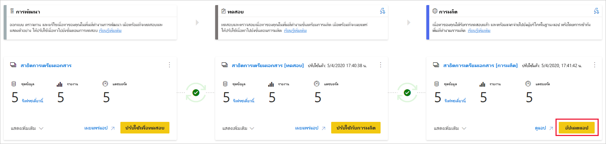

# ทำความเข้าใจขั้นตอนการปรับใช้งาน (ตัวอย่าง)

กระบวนการปรับใช้ช่วยให้คุณสามารถโคลนเนื้อหาจากขั้นตอนหนึ่งในไปป์ไลน์ไปยังอีกขั้นหนึ่ง จากการพัฒนาโดยทั่วไปจนถึงการทดสอบและจากการทดสอบไปยังการผลิต

ในระหว่างการปรับใช้ Power BI จะคัดลอกเนื้อหาจากขั้นตอนปัจจุบันไปยังเป้าหมาย การเชื่อมต่อระหว่างรายการที่คัดลอกจะถูกเก็บไว้ในระหว่างกระบวนการคัดลอก Power BI ยังใช้กฎชุดข้อมูลที่กำหนดค่าไว้กับเนื้อหาที่อัปเดตแล้วในขั้นตอนเป้าหมาย การจัดวางเนื้อหาอาจใช้เวลาสักครู่โดยขึ้นอยู่กับจำนวนของรายการที่ถูกปรับใช้ ในช่วงเวลานี้คุณสามารถนำทางไปยังหน้าอื่นๆ ในพอร์ทัล Power BI แต่คุณไม่สามารถใช้เนื้อหาในขั้นตอนเป้าหมายได้

## ปรับใช้เนื้อหาไปยังขั้นตอนที่ว่าง

เมื่อคุณปรับใช้เนื้อหาไปยังขั้นตอนที่ว่าง เมตาดาต้าของรายงาน แดชบอร์ด และชุดข้อมูลในพื้นที่ทำงานที่คุณกำลังจัดวางจะถูกคัดลอกไปยังขั้นตอนที่คุณกำลังปรับใช้ พื้นที่ทำงานใหม่สำหรับขั้นตอนที่คุณปรับใช้จะถูกสร้างขึ้นบนความจุแบบพรีเมียม

มีสองวิธีในการปรับใช้เนื้อหาจากหนึ่งขั้นตอนไปยังรายการถัดไป คุณสามารถปรับใช้เนื้อหาทั้งหมดหรือคุณสามารถ [เลือกรายการเนื้อหาที่จะปรับใช้ได้](deployment-pipelines-get-started.md#selective-deployment)

นอกจากนี้คุณยังสามารถปรับใช้เนื้อหาย้อนหลังจากขั้นตอนถัดไปในไปป์ไลน์การปรับใช้ไปยังรายการก่อนหน้า

หลังจากที่การปรับใช้เสร็จสมบูรณ์ให้รีเฟรชชุดข้อมูลเพื่อให้คุณสามารถใช้เนื้อหาที่คัดลอกใหม่ได้ จำเป็นต้องมีการรีเฟรชชุดข้อมูลเนื่องจากไม่มีการคัดลอกข้อมูลจากขั้นตอนหนึ่งไปยังรายการอื่น เมื่อต้องการทำความเข้าใจเกี่ยวกับคุณสมบัติของรายการที่จะคัดลอกในระหว่างกระบวนการปรับใช้และคุณสมบัติของรายการที่ไม่ได้คัดลอกให้ตรวจทาน [คุณสมบัติของรายการที่คัดลอกในระหว่างส่วนปรับใช้](#item-properties-copied-during-deployment)

### การสร้างพื้นที่ทำงานความจุแบบพรีเมียม

ในระหว่างการปรับใช้ครั้งแรก ไปป์ไลน์การปรับใช้จะตรวจสอบว่าคุณมีสิทธิ์ความจุแบบพรีเมียมหรือไม่  

ถ้าคุณมีสิทธิ์ความจุ เนื้อหาของพื้นที่ทำงานจะถูกคัดลอกไปยังขั้นตอนที่คุณกำลังปรับใช้ และพื้นที่ทำงานใหม่สำหรับขั้นตอนดังกล่าวจะถูกสร้างขึ้นบนความจุแบบพรีเมียม

ถ้าคุณไม่มีสิทธิ์ความจุ พื้นที่ทำงานจะถูกสร้างขึ้นแต่ไม่มีการคัดลอกเนื้อหา คุณสามารถขอให้ผู้ดูแลความจุเพิ่มพื้นที่ทำงานของคุณไปยังความจุ หรือขอสิทธิ์ในการกำหนดสำหรับความจุ หลังจากที่พื้นที่ทำงานถูกกำหนดให้กับความจุ คุณสามารถปรับใช้เนื้อหาไปยังพื้นที่ทำงานนี้ได้

### พื้นที่ทำงานและความเป็นเจ้าของเนื้อหา

ผู้ใช้จะกลายเป็นเจ้าของชุดข้อมูลแบบโคลนโดยอัตโนมัติและผู้ดูแลระบบเดียวของพื้นที่ทำงานใหม่

## ปรับใช้เนื้อหาไปยังพื้นที่ทำงานที่มีอยู่

การปรับใช้เนื้อหาในไปป์ไลน์การผลิตที่ใช้งานได้ไปยังขั้นตอนที่มีพื้นที่ทำงานที่มีอยู่รวมถึงต่อไปนี้:

* ปรับใช้เนื้อหาใหม่ด้วยการเพิ่มไปยังขั้นตอนที่มีเนื้อหาอยู่แล้ว

* เนื้อหาใหม่ที่ปรับใช้เพื่อแทนที่เนื้อหาเก่าในขั้นตอนการทำงานปัจจุบัน

### กระบวนการปรับใช้

เนื้อหาจากขั้นตอนปัจจุบันจะถูกคัดลอกไปยังขั้นตอนเป้าหมาย Power BI ระบุเนื้อหาที่มีอยู่ในขั้นตอนเป้าหมายและเขียนทับข้อมูลดังกล่าว ในการระบุว่ารายการเนื้อหาใดที่ต้องถูกเขียนทับไปป์ไลน์การปรับใช้จะใช้การเชื่อมต่อระหว่างรายการหลักกับโคลนของมัน การเชื่อมต่อนี้จะถูกเก็บไว้เมื่อมีการสร้างเนื้อหาใหม่ การดำเนินการเขียนทับจะเขียนทับเนื้อหาของรายการเท่านั้น ID, URL และสิทธิ์ของรายการยังคงไม่เปลี่ยนแปลง

ในขั้นตอนเป้าหมาย [คุณสมบัติของรายการที่ไม่ได้คัดลอก](deployment-pipelines-process.md#item-properties-that-are-not-copied)ยังคงอยู่เหมือนก่อนการปรับใช้ เนื้อหาใหม่และรายการใหม่จะถูกคัดลอกจากขั้นตอนปัจจุบันไปยังขั้นตอนเป้าหมาย

### รีเฟรชชุดข้อมูล

ข้อมูลในชุดข้อมูลเป้าหมายจะถูกเก็บไว้เมื่อเป็นไปได้ ถ้าไม่มีการเปลี่ยนแปลงไปยังชุดข้อมูล ข้อมูลจะถูกเก็บไว้เหมือนก่อนที่จะมีการใช้งาน

เมื่อมีการเปลี่ยนแปลงเล็กๆ เช่นการเพิ่มตารางหรือหน่วยวัด Power BI จะเก็บข้อมูลเดิมและการรีเฟรชถูกปรับให้เหมาะสมเพื่อรีเฟรชเฉพาะสิ่งที่จำเป็นเท่านั้น สำหรับการทำลาย schema ที่เปลี่ยนแปลงหรือการเปลี่ยนแปลงในการเชื่อมต่อแหล่งข้อมูลจำเป็นต้องรีเฟรชแบบเต็ม

### ข้อกำหนดสำหรับการปรับใช้กับขั้นตอนด้วยพื้นที่ทำงานที่มีอยู่

ตราบใดที่เนื้อหาที่มีการปรับใช้อยู่บน [ความจุแบบพรีเมียม](../admin/service-premium-what-is.md) ผู้ใช้ที่เป็นไปตามเงื่อนไขต่อไปนี้สามารถปรับใช้กับขั้นตอนด้วยพื้นที่ทำงานที่มีอยู่:

* [ผู้ใช้ Pro](../admin/service-admin-purchasing-power-bi-pro.md) ผู้ที่เป็นสมาชิกของพื้นที่ทำงานทั้งสองในขั้นตอนการปรับใช้แหล่งที่มาและเป้าหมาย

* เจ้าของชุดข้อมูลทั้งหมดในพื้นที่ทำงานเป้าหมายที่จะถูกปรับใช้

สำหรับข้อมูลเพิ่มเติมให้ตรวจทานส่วน [สิทธิ์](#permissions)

## รายการที่ปรับใช้

เมื่อคุณปรับใช้เนื้อหาจากขั้นตอนไปป์ไลน์หนึ่งไปยังอีกขั้นตอน เนื้อหาที่คัดลอกจะประกอบด้วยรายการ Power BI ต่อไปนี้:

* ชุดข้อมูล

* รายงาน

* แดชบอร์ด

### รายการที่ไม่รองรับ

ไปป์ไลน์การปรับใช้ไม่รองรับรายการต่อไปนี้:

* ชุดข้อมูลที่ไม่ได้มาจาก .pbix

* รายงานที่ยึดตามชุดข้อมูลที่ไม่ได้รับการรองรับ

* พื้นที่ทำงานไม่สามารถใช้แอปแบบเทมเพลตได้

* รายงานที่มีการแบ่งหน้า

* กระแสข้อมูล

* ส่งชุดข้อมูล

* เวิร์กบุ๊ก

## คุณสมบัติรายการที่คัดลอกในระหว่างการปรับใช้

ในระหว่างการปรับใช้คุณสมบัติของรายการต่อไปนี้จะถูกคัดลอกและเขียนทับคุณสมบัติของรายการที่ขั้นตอนเป้าหมาย:

* แหล่งข้อมูล ([กฎชุดข้อมูล](deployment-pipelines-get-started.md#step-4---create-dataset-rules) ได้รับการรองรับ)

* พารามิเตอร์ ([กฎชุดข้อมูล](deployment-pipelines-get-started.md#step-4---create-dataset-rules) ได้รับการรองรับ)

* ภาพวิชวลรายงาน

* หน้ารายงาน

* ไทล์แดชบอร์ด

* เมตาดาต้าแบบจำลอง

* ความสัมพันธ์ของรายการ

### คุณสมบัติรายการที่ไม่ได้คัดลอก

ไม่มีการคัดลอกคุณสมบัติของรายการต่อไปนี้ในระหว่างการปรับใช้:

* ข้อมูล - ข้อมูลไม่ได้รับการคัดลอก เมตาดาต้าเท่านั้นที่จะถูกคัดลอก

* URL

* ID

* สิทธิ์ - สำหรับพื้นที่ทำงานหรือรายการที่ระบุ

* การตั้งค่าพื้นที่ทำงาน - แต่ละขั้นตอนจะมีพื้นที่ทำงานของตัวเอง

* เนื้อหาของแอปและการตั้งค่า - เพื่อปรับใช้งานแอปของคุณดู [ปรับใช้งานแอป Power BI](#deploying-power-bi-apps)

ยังไม่มีการคัดลอกคุณสมบัติชุดข้อมูลต่อไปนี้ในระหว่างการปรับใช้:

* การกำหนดบทบาท
    
* กำหนดตารางเวลาการรีเฟรช
    
* ข้อมูลประจำตัวของแหล่งข้อมูล
    
* การตั้งค่าการแคชของคิวรี (สามารถสืบทอดมาจากความจุ)
    
* การตั้งค่าการรับรอง

## ปรับใช้แอป Power BI

[แอป Power BI](../consumer/end-user-apps.md) เป็นวิธีที่แนะนำสำหรับการกระจายเนื้อหาไปยังผู้บริโภค Power BI ฟรี การใช้ไปป์ไลน์การปรับใช้ คุณสามารถจัดการแอป Power BI ในไปป์ไลน์การปรับใช้เพื่อให้คุณมีการควบคุมและมีความยืดหยุ่นมากขึ้นเมื่อมาถึงวงจรชีวิตแอปของคุณ

สร้างแอปสำหรับขั้นตอนไปป์ไลน์การปรับใช้แต่ละขั้นตอน เพื่อให้คุณสามารถทดสอบการอัปเดตแอปแต่ละครั้งจากมุมมองของผู้ใช้ปลายทาง ไปป์ไลน์การปรับใช้จะช่วยให้คุณสามารถจัดการกระบวนการนี้ได้อย่างง่ายดาย ใช้ปุ่มเผยแพร่หรือมุมมองในการ์ดพื้นที่ทำงานเพื่อเผยแพร่หรือดูแอปในขั้นตอนไปป์ไลน์ที่ระบุ

ในขั้นตอนการผลิต ปุ่มการดำเนินการหลักที่มุมล่างซ้ายเปิดหน้าการอัปเดตแอปใน Power BI เพื่อให้การอัปเดตข้อมูลเนื้อหาใดๆ พร้อมใช้งานสำหรับผู้ใช้แอป

>[!IMPORTANT]
>กระบวนการปรับใช้ไม่รวมการอัปเดตเนื้อหาหรือการตั้งค่าของแอป เมื่อต้องการนำการเปลี่ยนแปลงไปใช้กับเนื้อหาหรือการตั้งค่า คุณจำเป็นต้องอัปเดตแอปในขั้นตอนไปป์ไลน์ที่จำเป็นด้วยตนเอง

## การอนุญาต

สิทธิ์ของไปป์ไลน์และสิทธิ์ในพื้นที่ทำงานได้รับอนุญาตและจัดการแยกต่างหาก ตัวอย่างเช่นผู้ใช้ที่มีการเข้าถึงไปป์ไลน์ที่ไม่มีสิทธิ์ในพื้นที่ทำงานจะสามารถดูไปป์ไลน์และแชร์กับผู้อื่นได้ อย่างไรก็ตามผู้ใช้รายนี้จะไม่สามารถดูเนื้อหาของพื้นที่ทำงานในไปป์ไลน์ หรือในหน้าพื้นที่ทำงาน และจะไม่สามารถทำการปรับใช้ได้

### ผู้ใช้ที่มีการเข้าถึงไปป์ไลน์

ผู้ใช้ที่มีการเข้าถึงไปป์ไลน์มีสิทธิ์ดังต่อไปนี้:

* ดูไปป์ไลน์
    
* แชร์ไปป์ไลน์กับผู้อื่น
    
* แก้ไขและลบไปป์ไลน์

>[!NOTE]
>การเข้าถึงไปป์ไลน์ไม่ได้ให้สิทธิ์ในการดูหรือดำเนินการกับเนื้อหาพื้นที่ทำงาน

### ผู้ชมพื้นที่ทำงาน

ผู้ชมพื้นที่ทำงานที่มี *การเข้าถึงไปป์ไลน์*ยังสามารถทำสิ่งต่อไปนี้ได้:

* บริโภคเนื้อหา

>[!NOTE]
>ผู้ชมพื้นที่ทำงานไม่สามารถเข้าถึงชุดข้อมูลหรือแก้ไขเนื้อหาพื้นที่ทำงานได้

### ผู้สนับสนุนพื้นที่ทำงาน

ผู้สนับสนุนพื้นที่ทำงานที่มี *การเข้าถึงไปป์ไลน์* ยังสามารถทำสิ่งต่อไปนี้ได้:

* บริโภคเนื้อหา

* เปรียบเทียบขั้นตอน

* ดูชุดข้อมูล

### สมาชิกพื้นที่ทำงาน

สมาชิกพื้นที่ทำงานที่มี *การเข้าถึงไปป์ไลน์*ยังสามารถทำสิ่งต่อไปนี้ได้:

* ดูเนื้อหาพื้นที่ทำงาน
    
* เปรียบเทียบขั้นตอน
    
* ปรับใช้รายงานและแดชบอร์ด

* เอาพื้นที่ทำงานออก

### ผู้ดูแลระบบพื้นที่ทำงาน

ผู้ดูแลระบบพื้นที่ทำงานที่มี *การเข้าถึงไปป์ไลน์*สามารถดำเนินการแบบ *สมาชิกพื้นที่ทำงาน* และยังทำสิ่งต่อไปนี้:

* กำหนดพื้นที่ทำงาน

* เอาพื้นที่ทำงานออก

### เจ้าของชุดข้อมูล

เจ้าของชุดข้อมูลที่เป็นสมาชิกพื้นที่ทำงานหรือผู้ดูแลระบบยังสามารถทำสิ่งต่อไปนี้ได้:

* อัปเดตชุดข้อมูล
    
* กำหนดค่ากฎ

>[!NOTE]
>ในส่วนนี้จะอธิบายสิทธิ์ของผู้ใช้ในไปป์ไลน์การปรับใช้ สิทธิ์ที่แสดงในส่วนนี้อาจมีแอปพลิเคชันที่แตกต่างกันในคุณลักษณะ Power BI อื่นๆ

## ข้อจำกัด

ส่วนนี้แสดงรายการส่วนใหญ่ของขีดจำกัดในไปป์ไลน์การปรับใช้

* พื้นที่ทำงานต้องอยู่ใน [ความจุแบบพรีเมียม](../admin/service-premium-what-is.md)

* รายการ power BI เช่นรายงานและแดชบอร์ดที่มี [ป้ายชื่อระดับความลับของ Power BI](../admin/service-security-sensitivity-label-overview.md)ไม่สามารถปรับใช้ได้

* จำนวนสูงสุดของรายการ Power BI ที่สามารถปรับใช้ได้ในการจัดวางเดี่ยวคือ 300

* สำหรับรายการของข้อจำกัดของพื้นที่ทำงาน ดู [ข้อจำกัดของการกำหนดพื้นที่ทำงาน](deployment-pipelines-get-started.md#workspace-assignment-limitations)

* สำหรับรายการของรายการที่ไม่ได้รับการรองรับ ดู [รายการที่ไม่ได้รับการรองรับ](#unsupported-items)

### ข้อจำกัดของชุดข้อมูล

* ไม่สามารถปรับใช้ชุดข้อมูลที่มีการกำหนดค่า [รีเฟรชแบบเพิ่มหน่วยได้](../admin/service-premium-incremental-refresh.md)

* ชุดข้อมูลที่ใช้การเชื่อมต่อข้อมูลแบบเรียลไทม์ไม่สามารถจัดวางได้

* ในระหว่างการปรับใช้ถ้าชุดข้อมูลเป้าหมายใช้ [การเชื่อมต่อแบบสด](../connect-data/desktop-report-lifecycle-datasets.md) ชุดข้อมูลต้นฉบับต้องใช้โหมดการเชื่อมต่อนี้เช่นกัน

* หลังจากที่มีการปรับใช้ การดาวน์โหลดชุดข้อมูล (จากขั้นตอนที่ได้รับการจัดวาง) จะไม่ได้รับการรองรับ

* สำหรับรายการของข้อจำกัดของกฎชุดข้อมูล ดู [ข้อจำกัดของกฎชุดข้อมูล](deployment-pipelines-get-started.md#dataset-rule-limitations)

## ขั้นตอนถัดไป

>[!div class="nextstepaction"]
>[บทนำสู่ไปป์ไลน์การปรับใช้](deployment-pipelines-overview.md)

>[!div class="nextstepaction"]
>[แนวทางปฏิบัติที่ดีที่สุดสำหรับไปป์ไลน์การปรับใช้](deployment-pipelines-best-practices.md)

>[!div class="nextstepaction"]
>[เริ่มต้นกับไปป์ไลน์การปรับใช้](deployment-pipelines-get-started.md)

>[!div class="nextstepaction"]
>[การแก้ไขปัญหาไปป์ไลน์การปรับใช้](deployment-pipelines-troubleshooting.md)