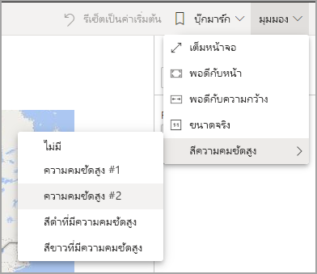
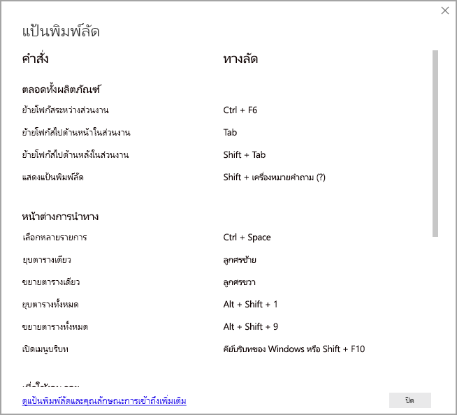

# ใช้รายงาน Power BI ด้วยคุณลักษณะการเข้าถึง
Power BI มีคุณลักษณะที่อยู่ภายในจำนวนมากที่ช่วยให้ผู้ทุพพลภาพสามารถใช้ และโต้ตอบกับรายงาน Power BI ได้อย่างง่ายขึ้น เครื่องมือเหล่านี้ช่วยให้ผู้ใช้ได้รับข้อมูลเดียวกันจากรายงานเหมือนกับผู้ที่ไม่ได้ใช้เทคโนโลยีช่วยเหลือ

มีสองสามคำที่ต้องทราบเมื่อคุณอ่านบทความนี้:

* **โฟกัส** คือตำแหน่งที่เมาส์ของคุณวางอยู่บนหน้า โดยปกติแล้ว โฟกัสจะถูกระบุด้วยเส้นขอบสีน้ำเงินรอบออบเจ็กต์
* **พื้นที่ทำงาน** คือพื้นที่ในหน้ารายงานของคุณ

ส่วนต่อไปนี้อธิบายถึงเครื่องมือช่วยสำหรับการเข้าถึงที่สามารถใช้ได้สำหรับการใช้รายงาน Power BI

## การนำทางของแป้นพิมพ์

เมื่อคุณเปิดใช้งาน Power BI Desktop หรือบริการของ Power BI ทันทีที่คุณกด **Tab** คำแนะนำเครื่องมือจะปรากฏขึ้นที่มุมด้านขวาบน ลิงก์ที่ชื่อว่า **เคล็ดลับสำหรับการใช้ Power BI กับโปรแกรมอ่านหน้าจอ** จะนำคุณไปยังบทความนี้ ซึ่งให้ข้อมูลเกี่ยวกับวิธีการใช้รายงานด้วยเครื่องมือช่วยสำหรับการเข้าถึง การคลิกที่ลิงก์ **ข้ามไปยังเนื้อหาหลัก** จะนำคุณไปยังพื้นที่รายงาน

กดปุ่ม **?** เปิดกล่องโต้ตอบด้วยแป้นพิมพ์ลัดที่ใช้บ่อยที่สุดใน Power BI หากต้องการดูรายการแป้นพิมพ์ลัดทั้งหมดที่มีอยู่ใน Power BI คุณสามารถไปที่ลิงก์ด้านล่างของกล่องโต้ตอบ ซึ่งจะนำคุณไปยังเอกสารคู่มือ Power BI เกี่ยวกับ [แป้นพิมพ์ลัด](desktop-accessibility-keyboard-shortcuts.md)

คุณสามารถสลับโฟกัสระหว่างแท็บหน้ารายงาน หรือออบเจ็กต์บนหน้ารายงานที่กำหนดไว้โดยใช้ **Ctrl+F6** ได้ เมื่อโฟกัสอยู่บนหน้ารายงานที่โหลด ใช้แป้น**แท็บ**เพื่อเลื่อนโฟกัสไปยังแต่ละวัตถุบนหน้า ซึ่งรวมถึงกล่องข้อความ รูปภาพ รูปร่าง และแผนภูมิทั้งหมด 

โดยทั่วไปแล้ว การใช้ **Enter** เพื่อเลือกหรือเข้า และการใช้ **Esc** เพื่อออกจากเป็นคำสั่งทั่วไปใน Power BI

### การนำทางแป้นพิมพ์สำหรับวิชวล

ผู้สร้างรายงาน Power BI หลายรายมีการจัดทำรายงานที่ประกอบด้วยข้อมูลจำนวนมาก ในขณะที่คุณย้ายผ่านวิชวล การดำเนินการนี้อาจสร้างความน่ารำคาญให้กับแท็บในทุกองค์ประกอบของวิชวลได้ การนำทางแป้นพิมพ์สำหรับวิชวลได้รับการออกแบบให้เป็นลำดับชั้น ที่มีสามระดับ เราจะอธิบายรายละเอียดเกี่ยวกับระดับทั้งสามในย่อหน้าต่อไปนี้

เมื่อต้องการนำทางผ่านระดับแรกเมื่อคุณนำทางไปยังวิชวล ให้กด **Ctrl + ลูกศรขวา** เพื่อเข้าสู่วิชวลนั้น เมื่อคุณเข้าไปยังวิชวลนั้นแล้ว คุณสามารถกด **Tab** เพื่อวนรอบผ่านส่วนหลักของวิชวลได้ พื้นที่หลักเหล่านั้นที่คุณสามารถวนรอบได้คือพื้นที่การลงจุดข้อมูล หมวดหมู่แกน (หากใช้กับวิชวล) และคำอธิบายแผนภูมิ (หากมีหนึ่งชวล)

ภาพเคลื่อนไหว .gif ต่อไปนี้แสดงวิธีการที่ผู้ใช้วนรอบผ่านระดับแรกของวิชวล:

ระดับที่สองของลำดับชั้นคือการเข้าสู่หนึ่งในพื้นที่หลัก (พื้นที่การลงจุดข้อมูล หมวดหมู่แกน x คำอธิบายแผนภูมิ) ของวิชวล เมื่อคุณใช้รายงาน คุณสามารถย้ายเข้าไปยังหนึ่งในพื้นที่หลักเหล่านี้ได้ และวนรอบผ่านจุดข้อมูลหรือหมวดหมู่ในส่วนนั้นของวิชวล เมื่อคุณตัดสินใจว่าพื้นที่ใดที่คุณต้องการสำรวจเพิ่มเติม คุณสามารถกด **Enter** เพื่อวนรอบผ่านพื้นที่เฉพาะนั้นได้

หากคุณต้องการเลือกจุดข้อมูลทั้งหมดในซีรีส์ ให้นำทางไปยังคำอธิบายแผนภูมิและกด **Enter** เมื่ออยู่ในคำอธิบายแผนภูมิแล้ว คุณสามารถกด **Tab** เพื่อนำทางไปยังหมวดหมู่ที่แตกต่างกันในคำอธิบายแผนภูมิได้ กด **Enter** เพื่อเลือกซีรีส์ข้อมูลที่ระบุ

หากคุณต้องการเลือกจุดข้อมูลเฉพาะเจาะจง ให้นำทางไปยังพื้นที่การลงจุดข้อมูลและกด **Enter** เมื่ออยู่ในพื้นที่การลงจุดข้อมูล คุณสามารถกด **Tab** เพื่อนำทางผ่านจุดข้อมูลเหล่านั้นได้ ถ้าวิชวลของคุณมีซีรีส์หลายชุด คุณสามารถกด **ลูกศรขึ้น** หรือ **ลูกศรลง** เพื่อข้ามไปยังจุดข้อมูลในซีรีส์ที่แตกต่างกันได้

หากคุณต้องการเลือกจุดข้อมูลทั้งหมดในแกนข้อมูลจัดกลุ่ม ให้นำทางไปยังป้ายชื่อแกนและกด **Enter** เมื่ออยู่ในป้ายชื่อแกน คุณสามารถกด **Tab** เพื่อนำทางผ่านชื่อของป้ายชื่อนั้นได้ กด **Enter** เพื่อเลือกชื่อของป้ายชื่อ

หากคุณสำรวจไปยังเลเยอร์แล้ว คุณสามารถกด **Esc** เพื่อออกมาจากเลเยอร์นั้นได้ ภาพเคลื่อนไหว .gif ต่อไปนี้แสดงวิธีที่ผู้ใช้สามารถเข้าและออกจากระดับของวิชวล และเลือกจุดข้อมูล ป้ายชื่อประเภทแกน x ข้ามไปยังซีรีส์อื่น และเลือกจุดข้อมูลทั้งหมดในซีรีส์

ถ้าคุณพบว่าตัวเองไม่สามารถนำทางไปยังออบเจ็กต์หรือวิชวลได้ในขณะที่ใช้แป้นพิมพ์ อาจเป็นเพราะผู้สร้างรายงานได้ตัดสินใจที่จะซ่อนออบเจ็กต์นั้นจากลำดับแท็บ โดยทั่วไปผู้สร้างรายงานจะซ่อนออบเจ็กต์ตกแต่งจากลำดับแท็บ ถ้าคุณพบว่าคุณไม่สามารถแท็บผ่านรายงานในลักษณะที่เป็นตรรกะได้ คุณควรติดต่อผู้สร้างรายงาน ผู้สร้างรายงานสามารถตั้งค่าลำดับแท็บสำหรับออบเจ็กต์และวิชวลได้

### การนำทางแป้นพิมพ์สำหรับตัวแบ่งส่วนข้อมูล

ตัวแบ่งส่วนข้อมูลยังมีฟังก์ชันการช่วยสำหรับการเข้าถึงที่มีอยู่แล้วภายในด้วย เมื่อเลือกตัวแบ่งส่วนข้อมูล หากต้องการปรับค่าของตัวแบ่งส่วนข้อมูล ให้ใช้ **CTRL+ลูกศรขวา** เพื่อเลื่อนผ่านการควบคุมต่าง ๆ ภายในตัวแบ่งส่วนข้อมูล ตัวอย่างเช่น เมื่อคุณเริ่มต้นกด**Ctrl + ลูกศรขวา** โฟกัสจะอยู่ที่ยางลบ จากนั้นการกด **spacebar** จะเทียบเท่ากับการคลิกปุ่มยางลบ ซึ่งจะลบค่าทั้งหมดบนตัวแบ่งส่วนข้อมูล

คุณสามารถเลื่อนผ่านการควบคุมต่าง ๆ ในตัวแบ่งส่วนข้อมูลด้วยการกด **Tab** การกด **Tab** เมื่ออยู่ที่ปุ่มยางลบจะย้ายไปที่ปุ่มดรอปดาวน์ การกดปุ่ม **Tab** อีกครั้งจะย้ายไปที่ค่าตัวแบ่งส่วนข้อมูลแรก (หากมีค่าตัวแบ่งส่วนข้อมูลหลายค่า อย่างเช่น ช่วง)

### การสลับหน้า

เมื่อโฟกัสอยู่บนแท็บหน้ารายงาน ใช้แป้น**แท็บ**หรือ**ลูกศร** เพื่อย้ายโฟกัสจากรายงานหน้าหนึ่งไปอีกหน้าหนึ่ง โปรแกรมอ่านหน้าจอจะอ่านออกเสียงชื่อของหน้ารายงาน และสถานะการเลือกในปัจจุบัน หากต้องการโหลดหน้ารายงานที่กำลังโฟกัสในขณะนี้ ใช้แป้น **Enter** หรือ **spacebar**

### การเข้าถึงส่วนหัวของวิชวล
ในขณะที่คุณนำทางไปมาระหว่างวิชวล คุณสามารถกด **Alt + Shift + F10** เพื่อย้ายโฟกัสไปยังส่วนหัวของวิชวลได้ ส่วนหัวของวิชวลประกอบด้วยตัวเลือกต่าง ๆ รวมถึงการเรียงลำดับ การส่งออกข้อมูลที่อยู่เบื้องหลังแผนภูมิและโหมดโฟกัส ไอคอนที่คุณเห็นในส่วนหัวของวิชวลจะขึ้นอยู่กับตัวเลือกที่ผู้สร้างรายงานได้ตัดสินใจที่จะแสดง

## โปรแกรมอ่านหน้าจอ

เมื่อดูรายงาน คุณควรออกจากโหมดสแกนซึ่งเป็นวิธีที่ดีที่สุด Power BI ควรมีการจัดการมากขึ้นเช่นเดียวกับแอปพลิเคชันและน้อยลงเช่นเดียวกับเอกสาร ดังนั้นจึงได้รับการตั้งค่าด้วยการนำทางแบบกำหนดเองเพื่อให้ง่ายต่อการนำทาง เมื่อใช้โปรแกรมอ่านหน้าจอกับ Power BI Desktop คุณควรตรวจสอบให้แน่ใจว่าโปรแกรมอ่านหน้าจอของคุณเปิดอยู่ก่อนที่คุณจะเปิด Power BI Desktop

เมื่อคุณกำลังสำรวจรอบออบเจ็กต์ โปรแกรมอ่านหน้าจออ่านชนิดของออบเจ็กต์และชื่อของออบเจ็กต์ (ถ้ามี) นอกจากนี้ โปรแกรมอ่านหน้าจอยังอ่านคำอธิบายของออบเจ็กต์นั้น (ข้อความแสดงแทน) ถ้าผู้สร้างรายงานกำหนดไว้

### แสดงข้อมูล
คุณสามารถกด **Alt+Shift+F11** เพื่อแสดงเวอร์ชันที่สามารถเข้าถึงได้ของหน้าต่าง **แสดงข้อมูล** หน้าต่างนี้ช่วยให้คุณสำรวจข้อมูลที่ใช้ในภาพในตาราง HTML โดยใช้แป้นพิมพ์ลัดเดียวกันกับที่คุณใช้กับโปรแกรมอ่านหน้าจอของคุณตามปกติ

คุณลักษณะ **แสดงข้อมูล** เป็นตาราง HTML ที่เข้าถึงได้เฉพาะโปรแกรมอ่านหน้าจอผ่านแป้นพิมพ์ลัดนี้เท่านั้น หากคุณเปิด **แสดงข้อมูล** จากตัวเลือกในส่วนหัวของวิชวล ตารางที่*ไม่*สามารถเข้ากันได้กับโปรแกรมอ่านหน้าจอจะแสดงขึ้น  เมื่อใช้ **แสดงข้อมูล** ผ่านแป้นพิมพ์ลัด ให้เปิดโหมดสแกนเพื่อใช้ประโยชน์จากปุ่มลัดทั้งหมดที่โปรแกรมอ่านหน้าจอมีให้

เมื่อต้องการออกจากมุมมอง **แสดงข้อมูล** และกลับไปยังรายงาน ให้กด **Esc**

## โหมดความคมชัดสูง

บริการของ Power BI พยายามตรวจหาการตั้งค่าความคมชัดสูงที่เลือกสำหรับ Windows ประสิทธิภาพและความถูกต้องของการตรวจหาดังกล่าวจะขึ้นอยู่กับเบราว์เซอร์ที่แสดงบริการของ Power BI ถ้าคุณต้องการตั้งค่าธีมด้วยตนเองในบริการของ Power BI คุณสามารถเลือก **มุมมอง > สีความคมชัดสูง** แล้วเลือกธีมที่คุณต้องการนำไปใช้กับรายงานได้

## ขั้นตอนถัดไป

คอลเลกชันของบทความเกี่ยวกับการช่วยสำหรับการเข้าถึง Power BI มีดังต่อไปนี้:

* [ภาพรวมของการช่วยสำหรับการเข้าถึงใน Power BI](desktop-accessibility-overview.md) 
* [การสร้างรายงาน Power BI ที่สามารถเข้าถึงได้](desktop-accessibility-creating-reports.md) 
* [การสร้างรายงาน Power BI ด้วยเครื่องมือช่วยสำหรับการเข้าถึง](desktop-accessibility-creating-tools.md)
* [แป้นพิมพ์ลัดการช่วยสำหรับการเข้าถึงรายงาน Power BI](desktop-accessibility-keyboard-shortcuts.md)
* [รายการตรวจสอบการช่วยสำหรับการเข้าถึงรายงาน](desktop-accessibility-creating-reports.md#report-accessibility-checklist)
