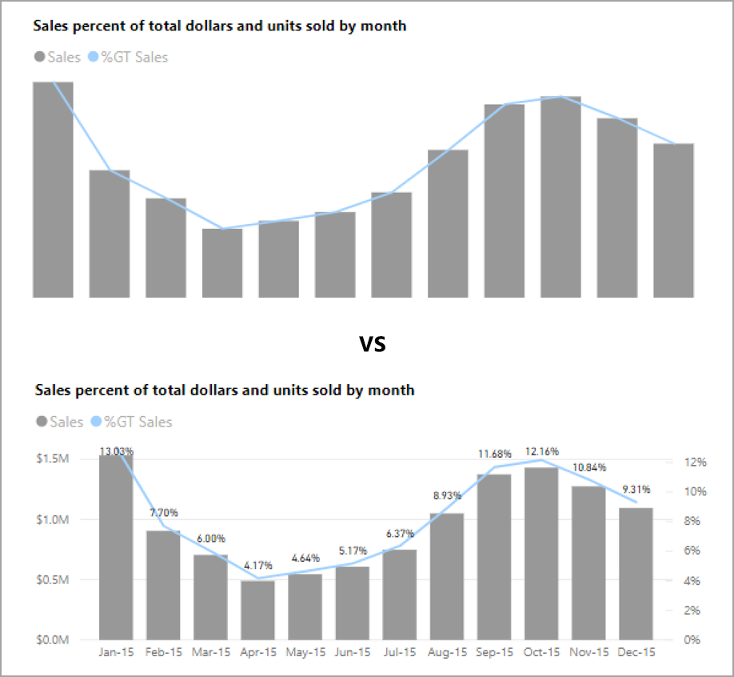

# ออกแบบรายงาน Power BI สำหรับการเข้าถึง
คุณสามารถออกแบบและสร้างรายงานที่น่าสนใจได้ในขณะที่ยังมีการออกแบบการช่วยสำหรับการเข้าถึง เมื่อใดก็ตามที่สร้างรายงาน ไม่ว่าผู้ชมของคุณคือใคร คุณควรสร้างรายงานให้สามารถใช้งานได้โดยผู้คนจำนวนมากที่สุดเท่าที่จะเป็นไปได้โดยไม่จำเป็นต้องปรับเปลี่ยนเพื่อการออกแบบพิเศษ

บทความนี้อธิบายถึงคุณลักษณะและเครื่องมือการช่วยสำหรับการเข้าถึงสำหรับการสร้างรายงานที่สามารถเข้าถึงได้ใน Power BI

โดยทั่วไป เมื่อใช้ Power BI กับตัวอ่านหน้าจอ เราแนะนำให้ปิดโหทดสแกนหรือโหมดเรียกดู

หากต้องการปรับปรุงกระบวนการสร้างรายงานด้วยโปรแกรมอ่านหน้าจอ เมนูบริบทจะพร้อมใช้งาน เมนูอนุญาตให้ย้ายเขตข้อมูลในช่องเก็บด้านบนหรือด้านล่างในรายการ**เขตข้อมูล** เมนูยังช่วยให้ย้ายเขตข้อมูลไปยังช่องเก็บอื่นๆ เช่น **คำอธิบายแผนภูมิ** หรือ**ค่า** หรืออื่น ๆ

## ประเภทของคุณลักษณะการช่วยสำหรับการเข้าถึง

Power BI มีความสามารถในการสร้างรายงานที่สามารถเข้าถึงได้ แต่ในฐานะผู้สร้างรายงาน จะขึ้นอยู่กับคุณว่าจะรวมข้อมูลเหล่านั้นในรายงานของคุณหรือไม่ มีคุณลักษณะการช่วยสำหรับการเข้าถึงสามประเภทที่อธิบายไว้ในบทความนี้:

* คุณลักษณะการช่วยสำหรับการเข้าถึงที่มีอยู่ภายใน (ไม่จำเป็นต้องกำหนดค่า)
* คุณลักษณะการช่วยสำหรับการเข้าถึงที่มีอยู่ภายใน (่จำเป็นต้องกำหนดค่า)
* คำแนะนำและข้อควรพิจารณาอื่น ๆ

เราจะกล่าวถึงแต่ละหมวดหมู่เหล่านี้ในส่วนต่อไปนี้

## คุณลักษณะการช่วยสำหรับการเข้าถึงที่มีอยู่ภายใน

Power BI มีคุณลักษณะการเข้าถึงติดตั้งอยู่ภายในผลิตภัณฑ์ ซึ่งไม่จำเป็นต้องมีการกำหนดค่าใด ๆ จากผู้สร้างรายงาน คุณลักษณะเหล่านี้มีดังต่อไปนี้:

* การนำทางของแป้นพิมพ์
* ความเข้ากันได้ของโปรแกรมอ่านหน้าจอ
* มุมมองสีความคมชัดสูง
* โหมดโฟกัส
* แสดงตารางข้อมูล

นอกจากนี้ยังมีคุณลักษณะที่ช่วยให้เกิดประสบการณ์การใช้งานรายงาน บทความที่อธิบายคุณลักษณะเหล่านั้นสามารถพบได้ในส่วน[ขั้นตอนถัดไป](#next-steps)ที่ด้านท้ายของบทความนี้.

ลองมาดูที่คุณลักษณะการช่วยสำหรับการเข้าถึงที่มีอยู่ภายในเหล่านี้แต่ละรายการตามลำดับ 

### การนำทางของแป้นพิมพ์

ในฐานะผู้เขียนรายงาน คุณไม่จำเป็นต้องกังวลว่าผู้ใช้ของคุณจะสามารถใช้แป้นพิมพ์เพื่อนำทางผ่านรายงานได้หรือไม่ วิชวล Power BI คือแป้นพิมพ์ทั้งหมดที่สามารถนำทางได้ และผู้ใช้รายงานของคุณสามารถเดินผ่านจุดข้อมูลต่าง ๆ ในวิชวล สลับระหว่างแท็บหน้า และเข้าถึงความสามารถในการโต้ตอบ รวมถึงการไฮไลต์แบบเชื่อมโยง การกรอง และการแบ่งส่วน

ในขณะที่เป็นผู้ใช้รายงานนำทางไปรอบ ๆ รายงาน โฟกัสจะแสดงขึ้นเพื่อระบุตำแหน่งที่ผู้ใช้อยู่ในรายงาน ทั้งนี้ขึ้นอยู่กับเบราว์เซอร์ที่ใช้ โหมดโฟกัสอาจปรากฏขึ้นแตกต่างกัน

หากต้องการเข้าถึงแป้นพิมพ์ลัดที่ใช้บ่อยที่สุด คุณสามารถกด *?* เมื่อต้องการแสดงกล่องโต้ตอบแป้นพิมพ์ลัด หากต้องการเรียนรู้เพิ่มเติม ดูบทความเหล่านี้เกี่ยวกับประสบการณ์การใช้งานและแป้นพิมพ์ลัดใน [ขั้นตอนถัดไป](#next-steps) ที่ส่วนท้ายของบทความนี้

### ความเข้ากันได้ของโปรแกรมอ่านหน้าจอ

โดยทั่วไป ทุกออบเจ็กต์ใน Power BI มีการนำทางของแป้นพิมพ์ที่เข้ากันได้สำหรับโปรแกรมอ่านหน้าจอด้วย เมื่อผู้ใช้รายงานนำทางไปยังวิชวล โปรแกรมอ่านหน้าจอจะอ่านชื่อเรื่อง ชนิดวิชวล และข้อความ alt ใด ๆ ถ้ามีการตั้งค่าไว้

### มุมมองสีความคมชัดสูง

Power BI สนับสนุนความคมชัดสูงสำหรับรายงาน หากคุณใช้โหมดความคมชัดสูงใน Windows Power BI Desktop จะตรวจหาธีมความคมชัดสูงที่กำลังใช้ใน Windows โดยอัตโนมัติ และใช้การตั้งค่าเหล่านั้นในรายงานของคุณ สีความคมชัดสูงเหล่านั้นจะติดตามไปกับรายงานเมื่อเผยแพร่ไปยังบริการของ Power BI หรือที่อื่น ๆ

บริการของ Power BI ยังพยายามที่จะตรวจหาการตั้งค่าความคมชัดสูงที่เลือกสำหรับ Windows แต่ประสิทธิภาพและแม่นยำของตรวจหา ขึ้นอยู่กับเบราว์เซอร์ที่ใช้สำหรับบริการของ Power BI ถ้าคุณต้องการตั้งค่าธีมด้วยตนเองในบริการของ Power BI ในมุมขวาบน คุณสามารถเลือก **มุมมอง > สีความคมชัดสูง** แล้วเลือกธีมที่คุณต้องการนำไปใช้กับรายงานได้

### โหมดโฟกัส
หากผู้ใช้รายงานกำลังดูวิชวลในแแดชบอร์ด พวกเขาสามารถขยายวิชวลให้เต็มหน้าจอมากขึ้นโดยไปที่เมนูบริบทของวิชวลและเลือก**เปิดในโหมดโฟกัส**

### แสดงตารางข้อมูล
ผู้ใช้รายงานยังสามารถดูข้อมูลในวิชวลในรูปแบบตารางโดยการกด **Alt + Shift + F11** ตารางนี้คล้ายกับการกด **แสดงข้อมูล** ในเมนูบริบทของวิชวล แต่จะแสดงตารางที่เป็นโปรแกรมอ่านหน้าจอที่ใช้งานง่าย

## คุณลักษณะการช่วยสำหรับการเข้าถึงที่มีอยู่ภายใน ซึ่งจำเป็นต้องกำหนดค่า

Power BI มีคุณลักษณะการช่วยสำหรับการเข้าถึงที่มีอยู่ภายในผลิตภัณฑ์ และจำเป็นต้องมีการกำหนดค่าจากผู้สร้างรายงาน  คุณลักษณะเหล่านี้ประกอบด้วย:

* ข้อความทั้งหมด
* ลำดับแท็บ
* ป้ายชื่อและชื่อเรื่อง
* ตัวทำเครื่องหมาย
* ธีมรายงาน

## ข้อความทั้งหมด

ข้อความแสดงแทน (คำอธิบายข้อความทางเลือก) จะถูกนำมาใช้เพื่ออธิบายลักษณะที่ปรากฏและฟังก์ชันของวิชวลและรูปภาพบนหน้ารายงานสำหรับผู้ใช้โปรแกรมอ่านหน้าจอ ผู้สร้างรายงานควรเพิ่มข้อความแสดงแทนลงในวัตถุทั้งหมดที่แสดงข้อมูลที่มีความหมายในรายงาน การใช้ข้อความแสดงแทนช่วยให้ผู้ใช้รายงานของคุณมีความเข้าใจสิ่งที่คุณพยายามสื่อสารด้วยวิชวล แม้ว่าพวกเขาไม่สามารถมองเห็นวิชวล รูปภาพ รูปร่าง หรือกล่องข้อความ คุณสามารถใส่ข้อความแสดงแทนสำหรับวัตถุใด ๆ บนรายงาน Power BI Desktop ได้โดยการเลือกวัตถุ (เช่น วิชวล รูปร่าง และอื่นๆ) และในบานหน้าต่าง**การแสดงภาพ** ให้เลือกส่วน**รูปแบบ**  ให้ขยาย**ทั่วไป** เลื่อนไปด้านล่างและกรอกข้อมูลลงในกล่องข้อความ **ข้อความแสดงแทน** กล่องข้อความ**ข้อความแสดงแทน** มีขีดจำกัด 250 ตัวอักขระ

ข้อความแสดงแทนควรประกอบด้วยข้อมูลเกี่ยวกับข้อมูลเชิงลึกที่คุณต้องการให้ผู้ใช้รายงานสามารถนำออกจากวิชวลได้ เนื่องจากโปรแกรมอ่านหน้าจอจะอ่านชื่อเรื่องและชนิดของวิชวล คุณจะต้องกรอกข้อมูลในคำอธิบายเท่านั้น ตัวอย่างของข้อความแสดงแทนสำหรับวิชวลต่อไปนี้อาจเป็น: *ความพึงพอใจของผู้ใช้สุทธิตามสีของผลิตภัณฑ์ที่ขายและแบ่งตามประเภทผลิตภัณฑ์*

โปรดทราบว่าการเรียกใช้จุดข้อมูลเชิงลึกหรือประเด็นเฉพาะอาจไม่ใช่สิ่งที่ดีที่สุดที่จะใส่ในข้อความแสดงแทนแบบคงที่เนื่องจากข้อมูลใน Power BI เป็นแบบไดนามิก หากคุณต้องการใช้ข้อความแสดงแทนแบบไดนามิก ให้ดูส่วนถัดไปที่อธิบายการจัดรูปแบบตามเงื่อนไขสำหรับข้อความแสดงแทน

### การจัดรูปแบบตามเงื่อนไขสำหรับข้อความแสดงแทน

คุณลักษณะหนึ่งที่ทำให้ Power BI น่าสนใจคือคุณลักษณะของข้อมูลดังกล่าวเป็นแบบไดนามิก คุณสามารถใช้หน่วยวัด DAX และการจัดรูปแบบตามเงื่อนไขเพื่อสร้างข้อความแสดงแทนแบบไดนามิกได้ โปรแกรมอ่านหน้าจอจะสามารถเรียกใช้ค่าเฉพาะกับข้อมูลที่ผู้ใช้รายงานกำลังดูอยู่

### ลำดับแท็บ
การตั้งค่าลำดับแท็บช่วยให้ผู้ใช้แป้นพิมพ์สามารถสำรวจรายงานของคุณตามลำดับที่ตรงกับวิธีการที่ผู้ใช้ประมวลผลวิชวลรายงาน ถ้าคุณมีรูปร่างตกแต่งและรูปภาพในรายงานของคุณ คุณควรลบออกรูปเหล่านั้นจากลำดับแท็บ 

หากต้องการตั้งค่าลำดับแท็บ ให้เลือกแท็บ**มุมมอง** ใน Ribbon และเลือกปุ่ม**บานหน้าต่างการเลือก**เพื่อแสดงบานหน้าต่างการเลือก.

ใน**บานหน้าต่างการเลือก** การเลือก**ลำดับแท็บ** จะแสดงลำดับของแท็บปัจจุบันสำหรับรายงานของคุณ. คุณสามารถเลือกออบเจ็กต์ จากนั้นใช้ปุ่มลูกศรขึ้นและลงเพื่อย้ายออบเจ็กต์ในลำดับชั้น หรือคุณสามารถเลือกออบเจ็กต์ด้วยเมาส์และลากไปยังตำแหน่งที่คุณต้องการจัดให้เป็นรายการได้ การคลิกที่ตัวเลขถัดจากวัตถุจะซ่อนวัตถุจากลำดับแท็บ

### ชื่อและป้ายชื่อ
ชื่อวิชวลและหน้ารายงานเป็นคุณลักษณะการช่วยสำหรับการเข้าถึงที่สำคัญที่กำหนดทิศทางผู้ใช้รายงาน หลีกเลี่ยงการใช้คำย่อหรือศัพท์เทคนิคเฉพาะในชื่อรายงานของคุณ หากคุณแชร์รายงานให้กับผู้ใช้ใหม่หรือบุคคลที่อยู่ภายนอกองค์กรของคุณพวกเขาอาจไม่ทราบว่าคำศัพท์หรือตัวย่อของคุณหมายถึงอะไร รูปภาพต่อไปนี้แสดงวิชวลที่มีคำย่อในชื่อเรื่อง (ทางด้านซ้าย) และชื่อเรื่องที่ชัดเจนสำหรับวิชวลทางด้านขวา

ภายในวิชวล ตรวจสอบให้แน่ใจว่าชื่อเรื่องใดๆ ป้ายชื่อแกน ค่าคำอธิบายแผนภูมิ และป้ายชื่อข้อมูลสามารถอ่านและเข้าใจง่าย เปรียบเทียบภาพต่อไปนี้ ซึ่งภาพแรกมีตัวเลขหรือคำอธิบายข้อมูลน้อยและภาพที่สองมีจำนวนมาก

ด้วยป้ายชื่อข้อมูล คุณยังสามารถเลือกที่จะเปิดหรือปิดป้ายชื่อสำหรับแต่ละชุดข้อมูลในวิชวลของคุณ หรือวางป้ายชื่อเหล่านั้นไว้ด้านบนหรือด้านล่างของชุดข้อมูลได้ แม้ว่า Power BI จะพยายามอย่างดีที่สุดในการวางป้ายชื่อข้อมูลไว้ด้านบนหรือด้านล่างเส้นบรรทัด แต่บางครั้งก็อาจไม่ชัดเจนมาก ในวิชวลต่อไปนี้ ป้ายชื่อข้อมูลจะถูกสลับและไม่สามารถอ่านได้ง่าย

การจัดตำแหน่งป้ายชื่อข้อมูลของคุณที่ด้านบนหรือด้านล่างชุดของคุณสามารถช่วยได้ โดยเฉพาะอย่างยิ่งถ้าคุณกำลังใช้แผนภูมิเส้นที่มีหลายบรรทัด ด้วยการปรับปรุงบางอย่าง ป้ายชื่อข้อมูลตอนนี้ดูดีขึ้นมาก

### ตัวทำเครื่องหมาย

วิธีการนี้เป็นวิธีปฏิบัติที่ดีที่สุดในการหลีกเลี่ยงการใช้สี (รวมถึงคุณลักษณะการจัดรูปแบบตามเงื่อนไข) เป็นวิธีเดียวในการสื่อข้อมูล แต่คุณสามารถใช้ตัวทำเครื่องหมายในการสื่อชุดข้อมูลที่แตกต่างกันได้

สำหรับแผนภูมิเส้น, แผนภูมิพื้นที่ และแผนภูมิผสม เช่นเดียวกับแผนภูมิกระจายและแผนภูมิฟอง คุณสามารถเปิดใช้ตัวทำเครื่องหมาย และใช้รูปร่างเครื่องหมายที่แตกต่างกันสำหรับแต่ละเส้นบรรทัด

เมื่อต้องการเปิดใช้งานตัวเครื่องหมาย เลือกส่วนรูปแบบในบานหน้าต่างการแสดงภาพ ขยายส่วน**รูปร่าง** จากนั้นเลื่อนลงเพื่อค้นหาการสลับ **แสดงตัวทำเครื่องหมาย** และ**เปิด**ตัวทำเครื่องหมาย ดังที่แสดงในรูปต่อไปนี้ 

คุณยังสามารถใช้ **กำหนดชุดข้อมูล** เพื่อเลือกชื่อของแต่ละเส้นบรรทัด (หรือพื้นที่ถ้าใช้แผนภูมิพื้นที่) จากกล่องดรอปดาวน์ในส่วนรูปร่างนั้น ด้านล่างเมนูดรอปดาวน์ คุณสามารถปรับเปลี่ยนลักษณะต่าง ๆ ของเครื่องหมายที่ใช้สำหรับเส้นที่เลือก รวมไปถึงรูปร่าง สี และขนาด

แม้ว่าเราแนะนำผู้สร้างรายงานเพื่อเปิดใช้งานป้ายชื่อข้อมูลและตัวทำเครื่องหมาย แต่การเปิดใช้งานป้ายชื่อและตัวทำเครื่องหมายทั้งหมดสำหรับทุกวิชวลอาจเกิดการรบกวนและทำให้รายงานของคุณสามารถเข้าถึงได้น้อยลง ในรูปต่อไปนี้ คุณสามารถเปรียบเทียบวิชวลที่มีป้ายชื่อข้อมูลและตัวทำเครื่องหมายทั้งคู่ แล้วทำให้กลายเป็นเวอร์ชันที่เข้าใจได้มากขึ้นโดยปิดป้ายชื่อข้อมูล

หากคุณไม่แน่ใจว่าวิชวลหรือรายงานของคุณซับซ้อนมากเกินไปหรือไม่ ให้ทดสอบโดยการทำ[การทดสอบด้วยการหรี่ตา](https://chrome.google.com/webstore/detail/the-squint-test/gppnipfbappicilfniaimcnagbpfflpg)  ถ้าคุณต้องเปิดตามองป้ายชื่อข้อมูลมากกว่าจุดข้อมูล ให้ปิดป้ายชื่อข้อมูลของคุณ

### ธีม ความคมชัด และสีที่เป็นมิตรกับผู้ที่ตาบอดสี

คุณควรตรวจสอบให้แน่ใจว่ารายงานของคุณมีความคมชัดเพียงพอ ระหว่างข้อความและสีพื้นหลัง เกณฑ์ความสำเร็จ 1.4.3 ของ WCAG 2.1 ระบุว่าข้อความและสีพื้นหลังควรมีอัตราส่วนความคมชัดอย่างน้อย 4.5: 1 มีเครื่องมือหลายอย่างเช่น [ตัววิเคราะห์ความคมชัดของสี](https://developer.paciellogroup.com/resources/contrastanalyser/)[WebAIM](https://webaim.org/resources/contrastchecker/)และ [สีที่สามารถเข้าถึงได้](https://accessible-colors.com/) คุณสามารถใช้เพื่อตรวจสอบสีรายงานของคุณได้

นอกจากนี้ คุณยังควรพิจารณาว่าผู้ดูรายงานบางรายอาจมีข้อบกพร่องด้านการมองเห็นสี เครื่องมือเช่น [Coblis](https://www.color-blindness.com/coblis-color-blindness-simulator/) และ [Vischeck](https://www.vischeck.com/vischeck/vischeckImage.php) จะจำลองว่าผู้ดูรายงานมีความบกพร่องของสีที่แตกต่างกันอย่างไรบ้าง  การใช้สีน้อยลงหรือสีขาวดำในรายงานสามารถช่วยแก้ไขปัญหาการสร้างรายงานที่ไม่สามารถเข้าถึงได้

การผสมสีบางอย่างเป็นเรื่องยากสำหรับผู้ใช้ที่มีข้อบกพร่องด้านการมองเห็นสีในการแยกความแตกต่าง ซึ่งรวมถึงการผสมสีต่อไปนี้: 

* สีเขียวและสีแดง
* สีเขียวและสีน้ำตาล
* สีน้ำเงินและสีม่วง
* สีเขียวและสีน้ำเงิน
* สีเขียวอ่อนและสีเหลือง
* สีน้ำเงินและสีเทา
* สีเขียวและสีเทา
* สีเขียวและสีดำ

หลีกเลี่ยงการใช้สีเหล่านี้ร่วมกันในแผนภูมิหรือบนหน้ารายงานเดียวกัน Power BI มีธีมในตัวเพื่อช่วยให้รายงานของคุณสามารถเข้าถึงได้มากขึ้น แต่ควรตรวจสอบรายงานของคุณด้วยเครื่องมือเพิ่มเติมที่แนะนำในบทความนี้

## คำแนะนำและข้อควรพิจารณา
ส่วนนี้มีคำแนะนำ เคล็ดลับ และข้อควรพิจารณาเมื่อสร้างรายงานโดยคำนึงถึงการช่วยสำหรับการเข้าถึง

### ทำความเข้าใจสิ่งที่ผู้ดูรายงานของคุณต้องการ

การสร้างรายงานเป็นกระบวนการแบบทำซ้ำ ก่อนที่คุณจะเริ่มการวางวิชวลบนหน้า ให้พูดคุยกับผู้ใช้รายงานเพื่อทำความเข้าใจว่าข้อมูลใดที่พวกเขาต้องการได้รับจากรายงาน และวิธีการที่พวกเขาต้องการดู  

การสร้างในการช่วยสำหรับการเข้าถึงควรเป็นส่วนหนึ่งของกระบวนการนี้ คุณอาจพบว่าวิสัยทัศน์ของคุณไม่ใช่สิ่งที่ผู้ใช้รายงานของคุณจำเป็นต้องทราบ หลังจากที่คุณได้จัดเตรียมแบบร่างเริ่มต้นของรายงานแล้ว ให้แสดงแบบร่างนั้นไปยังผู้ใช้รายงานและรวบรวมคำติชมเพิ่มเติม ในฐานะผู้สร้างรายงาน การรวบรวมคำติชมสามารถช่วยลดการร้องขอการเปลี่ยนแปลงจากผู้ใช้รายงานที่ไม่พึงพอใจในอนาคต

### ทำให้รายงานของคุณเรียบง่ายและสอดคล้องกัน

ทำให้รายงานของคุณเรียบมากง่ายที่สุดเท่าที่จะทำได้ ผู้คนมักจะพยายามใส่ภาพมากเกินไปในวิชวลเดียว บ่อยครั้งที่การแบ่งออกเป็นหลาย ๆ วิชวลทำให้วิชวลดูเรียบง่ายขึ้น และเข้าใจง่าย ลองใช้หลาย ๆ วิชวลหากพวกเขาแสดงแฟเช็ตของข้อมูล และใช้ตัวกรองหรือการโต้ตอบด้วยวิชวลเพื่อสร้างประสบการณ์ที่หลากหลาย ในเวลาเดียวกัน ต้องควบคุมให้จำนวนของวิชวลบนหน้าอยู่ในระดับต่ำสุด พยายามหลีกเลี่ยงการซ้ำซ้อนและความไม่เป็นระเบียบของหน้า คุณไม่จำเป็นต้องใช้สองวิชวลในการแสดงสิ่งเดียวกัน ผู้ใช้รายงานอาจรู้สึกสับสนกับข้อมูลทั้งหมดที่ได้รับจากวิชวลมากเกินไป หรือพวกเขาอาจมีช่วงความสนใจที่จำกัด และเสียสมาธิ ไม่เพียงแต่ทำให้รายงานของคุณใช้งานได้ง่ายขึ้น แต่การแสดงวิชวลมากเกินไปในหน้าเดียวสามารถทำให้ประสิทธิภาพการทำงานของรายงานช้าลง

ทำให้รายงานของคุณสอดคล้องกันโดยใช้สีแบบอักษรและรูปแบบที่เหมือนกันสำหรับองค์ประกอบของวิชวลทั้งหมดในรายงาน ใช้ขนาดตัวอักษรเดียวกันสำหรับชื่อวิชวลทั้งหมด เช่นเดียวกับที่คุณควรใช้กับป้ายชื่อข้อมูลและชื่อแกน หากคุณใช้ตัวแบ่งส่วนข้อมูลในหน้ารายงานหลายหน้า ให้เก็บไว้ในตำแหน่งเดียวกันในทุก ๆ หน้าของรายงาน

### ทดสอบสำหรับการมองเห็นต่ำ

วิธีที่รวดเร็วในการทดสอบว่ารายงานจะมีลักษณะอย่างไรสำหรับผู้ใช้ที่มีการมองเห็นในระดับต่ำจะเป็นการลดความสว่างของหน้าจอหรืออุปกรณ์เคลื่อนที่  มี Add-on ของเบราว์เซอร์ที่คุณสามารถใช้เพื่อช่วยให้คุณสามารถทำการทดสอบด้วยการหรี่ตาได้

## รายการตรวจสอบการช่วยสำหรับการเข้าถึงรายงาน

นอกเหนือจากการจัดหาเครื่องมือและฟังก์ชันการช่วยสำหรับการเข้าถึงแล้ว Power BI ยังมีรายการตรวจสอบดังต่อไปนี้ที่คุณสามารถใช้ได้เมื่อสร้างรายงาน รายการตรวจสอบนี้ช่วยให้มั่นใจว่ารายงานของคุณสามารถเข้าถึงได้และพร้อมให้บริการแก่ผู้ชมกลุ่มที่ใหญ่ที่สุดก่อนที่คุณจะเผยแพร่ 

### ภาพทั้งหมด

* ตรวจสอบให้แน่ใจว่าสีมีความแตกต่างกันระหว่างชื่อเรื่อง ป้ายชื่อแกน และป้ายชื่อข้อมูล ข้อความและพื้นหลังอย่างน้อย 4.5:1
* หลีกเลี่ยงการใช้สีเป็นเครื่องมือในการสื่อข้อมูลเพียงอย่างเดียว ใช้ข้อความหรือไอคอนเพื่อเสริมหรือแทนที่สี
* แทนที่ศัพท์เทคนิคเฉพาะหรือคำย่อที่ไม่จำเป็น
* ตรวจสอบให้แน่ใจว่ามีการเพิ่ม**ข้อความแสดงแทน**ในวิชวลที่ไม่มีการปรับแต่งทั้งหมดบนหน้า
* ตรวจสอบว่าหน้ารายงานของคุณสามารถใช้งานได้กับผู้ใช้ที่มีความบกพร่องในการมองเห็นสี

### ตัวแบ่งส่วนข้อมูล
* ถ้าคุณมีคอลเลกชันตัวแบ่งส่วนข้อมูลหลายรายการบนหน้ารายงานของคุณ ตรวจสอบให้แน่ใจว่าการออกแบบของคุณสอดคล้องกันในทุกหน้า ใช้ตัวอักษร สี และตำแหน่งเชิงพื้นที่เดียวกันมากที่สุดเท่าที่เป็นไปได้

### กล่องข้อความ
* ตรวจสอบให้แน่ใจว่าสีมีความแตกต่างกันระหว่างแบบอักษรและพื้นหลังอย่างน้อย 4.5:1
* ตรวจสอบให้แน่ใจว่าได้ใส่เนื้อหาข้อความในกล่อง**ข้อความแสดงแทน** เพื่อให้โปรแกรมอ่านหน้าจอสามารถอ่านได้

### การโต้ตอบกับวิชวล
* ข้อมูลสำคัญสามารถเข้าถึงได้ผ่านการโต้ตอบหรือไม่ ถ้าเป็นเช่นนั้น จัดเรียงวิชวลของคุณเพื่อให้มีการกรองวิชวลล่วงหน้าโดยทำให้ข้อสรุปที่สำคัญชัดเจนยิ่งขึ้น
* คุณกำลังใช้บุ๊กมาร์กสำหรับการนำทางหรือไม่ ลองนำทางรายงานของคุณด้วยแป้นพิมพ์เพื่อให้แน่ใจว่าประสบการณ์ดังกล่าวเป็นที่ยอมรับสำหรับผู้ใช้เฉพาะแป้นพิมพ์

### ลำดับการจัดเรียง
* คุณได้ตั้งใจที่จะตั้งค่าลำดับการจัดเรียงของแต่ละวิชวลบนหน้าหรือไม่ ตาราง**แสดงข้อมูล**ที่สามารถเข้าถึงได้จะแสดงข้อมูลในลำดับการจัดเรียงที่คุณได้ตั้งค่าไว้ในวิชวล

### คำแนะนำเครื่องมือ
* อย่าใช้กล่องแสดงคำอธิบายเพื่อสื่อสารข้อมูลสำคัญ ผู้ใช้ที่มีปัญหาการเคลื่อนไหวและผู้ใช้ที่ไม่ได้ใช้เมาส์จะมีปัญหาในการเข้าถึง
* เพิ่มคำแนะนำเครื่องมือลงในแผนภูมิเป็นข้อมูลเสริม ซึ่งรวมอยู่ในตาราง**แสดงข้อมูล**ที่สามารถเข้าถึงได้สำหรับแต่ละวิชวล

### Video
* หลีกเลี่ยงวิดีโอที่เริ่มต้นโดยอัตโนมัติเมื่อมีการแสดงหน้า
* ตรวจสอบให้แน่ใจว่าวิดีโอของคุณมีคำบรรยายหรือแสดงบทสนทนา

### เสียง
* หลีกเลี่ยงเสียงที่เริ่มต้นโดยอัตโนมัติเมื่อมีการแสดงหน้า
* ใส่คำบรรยายสำหรับเสียงใด ๆ

### รูปร่าง
* ตรวจสอบให้แน่ใจว่ามีการทำเครื่องหมายรูปร่างการตกแต่งเป็นซ่อนอยู่ในลำดับแท็บ ดังนั้นจึงไม่ได้ประกาศโดยโปรแกรมอ่านหน้าจอ
* หลีกเลี่ยงการใช้รูปร่างการตกแต่งมากเกินไปในจุดที่อาจรบกวนสมาธิ
* เมื่อใช้รูปร่างเพื่อเรียกจุดข้อมูล ให้ใช้**ข้อความแสดงแทน** เพื่ออธิบายสิ่งที่จะถูกเรียก

### รูปภาพ
* เมื่อใช้รูปร่างเพื่อเรียกจุดข้อมูล ให้ใช้**ข้อความแสดงแทน** เพื่ออธิบายสิ่งที่จะถูกเรียก
* ตรวจสอบให้แน่ใจว่ามีการทำเครื่องหมายรูปภาพการตกแต่งเป็นซ่อนอยู่ในลำดับแท็บ ดังนั้นจึงไม่ได้ประกาศโดยโปรแกรมอ่านหน้าจอ
* หลีกเลี่ยงการใช้รูปภาพการตกแต่งมากเกินไปในจุดที่อาจรบกวนสมาธิ

### วิชวล Power BI
* ตรวจสอบตาราง**แสดงข้อมูล**ที่สามารถเข้าถึงได้สำหรับวิชวล Power BI ถ้าข้อมูลที่แสดงไม่เพียงพอ ให้ค้นหาวิชวลอื่น
* ถ้าใช้วิชวลแบบกำหนดเองของ*แกนเคลื่อนไหว* ตรวจสอบให้แน่ใจว่าไม่มีการเล่นอัตโนมัติ ทำให้เห็นได้ชัดเจนว่าผู้ใช้ต้องกดปุ่มเล่น/หยุดชั่วคราวเพื่อเริ่ม/หยุดการเปลี่ยนแปลงค่า

### ในทุกวิชวลบนหน้า
* ตั้งค่าลำดับแท็บและปิดลำดับแท็บ (ทำเครื่องหมายรายการว่าซ่อนอยู่) บนรายการการตกแต่งต่าง ๆ

## ข้อควรพิจารณาและข้อจำกัด
มีปัญหาที่ทราบแล้วและข้อจำกัดบางประการ ของคุณลักษณะการช่วยสำหรับการเข้าถึง คำอธิบายของปัญหาและข้อจำกัดเหล่านั้นมีอยู่ในรายการต่อไปนี้:

* เมื่อใช้โปรแกรมอ่านหน้าจอด้วย **Power BI Desktop**คุณจะมีประสบการณ์การใช้งานที่ดีที่สุดถ้าคุณเปิดโปรแกรมอ่านหน้าจอก่อนที่จะเปิดไฟล์ใดๆ ใน **Power BI Desktop**

## ขั้นตอนถัดไป

คอลเลกชันของบทความเกี่ยวกับการช่วยสำหรับการเข้าถึง Power BI มีดังต่อไปนี้:

* [ภาพรวมของการช่วยสำหรับการเข้าถึงใน Power BI](desktop-accessibility-overview.md) 
* [การใช้รายงาน Power BI ด้วยเครื่องมือการช่วยสำหรับการเข้าถึง](desktop-accessibility-consuming-tools.md)
* [การสร้างรายงาน Power BI ด้วยเครื่องมือการช่วยสำหรับการเข้าถึง](desktop-accessibility-creating-tools.md)
* [แป้นพิมพ์ลัดการช่วยสำหรับการเข้าถึงรายงาน Power BI](desktop-accessibility-keyboard-shortcuts.md)
* [รายการตรวจสอบการช่วยสำหรับการเข้าถึงรายงาน](#report-accessibility-checklist)
