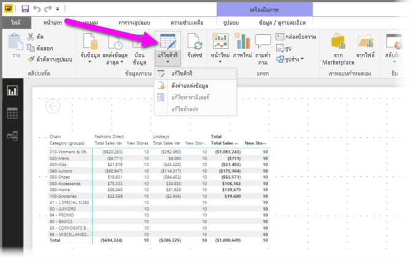
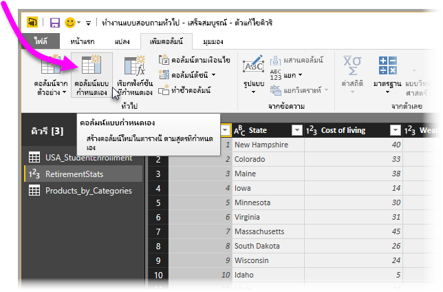
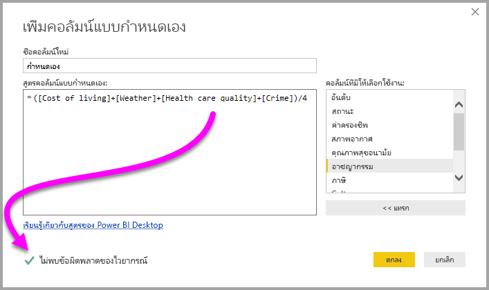
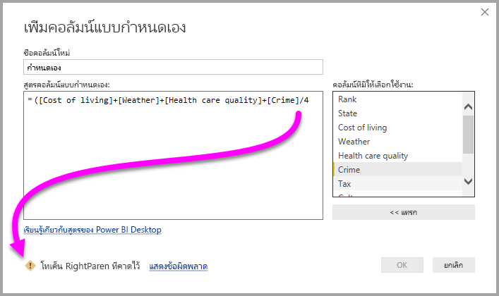

# เพิ่มคอลัมน์แบบกำหนดเองใน Power BI Desktop

ใน Power BI Desktop คุณสามารถเพิ่มคอลัมน์ของข้อมูลแบบกำหนดเองใหม่ลงในแบบจำลองของคุณได้อย่างง่ายดายโดยใช้ตัวแก้ไขคิวรี ด้วยตัวแก้ไขคิวรี คุณสามารถสร้างและเปลี่ยนชื่อคอลัมน์แบบกำหนดเองของคุณเพื่อสร้าง[คิวรีสูตร PowerQuery M](https://docs.microsoft.com/powerquery-m/quick-tour-of-the-power-query-m-formula-language) สำหรับกำหนดคอลัมน์แบบกำหนดเองของคุณ คิวรีสูตร PowerQuery M มี[ชุดเนื้อหาการอ้างอิงฟังก์ชันที่ครอบคลุม](https://docs.microsoft.com/powerquery-m/power-query-m-function-reference) 

เมื่อคุณสร้างคอลัมน์แบบกำหนดเองในตัวแก้ไขคิวรีแล้ว Power BI Desktop จะเพิ่มคอลัมน์เป็น **ขั้นตอนที่ใช้** ใน **การตั้งค่าคิวรี** ของคิวรี ซึ่งสามารถเปลี่ยนแปลง ย้าย หรือแก้ไขได้ตลอดเวลา

## ใช้ตัวแก้ไขคิวรีเพื่อเพิ่มคอลัมน์แบบกำหนดเอง

เมื่อต้องการเริ่มต้นการสร้างคอลัมน์แบบกำหนดเอง ให้ทำตามขั้นตอนเหล่านี้:

1. เปิดใช้งาน Power BI Desktop และโหลดข้อมูลบางส่วน

2. จากแท็บ**หน้าแรก** บนริบบอน ให้เลือก **แก้ไขคิวรี** จากนั้นเลือก **แก้ไขคิวรี** จากเมนู

   

   หน้าต่าง**ตัวแก้ไขคิวรี** จะปรากฏขึ้น 

2. จากแท็บ**เพิ่มคอลัมน์** บนริบบอน ให้เลือก**คอลัมน์แบบกำหนดเอง**

   

   หน้าต่าง**เพิ่มคอลัมน์แบบกำหนดเอง** จะปรากฏขึ้น

## หน้าต่างเพิ่มคอลัมน์แบบกำหนดเอง

หน้าต่าง **เพิ่มคอลัมน์แบบกำหนดเอง** มีคุณลักษณะดังต่อไปนี้: 
- รายการของคอลัมน์ที่มีให้เลือกใช้งาน ในรายการ **คอลัมน์ที่มีให้เลือกใช้งาน** ทางด้านขวา

- ชื่อเริ่มต้นของคอลัมน์แบบกำหนดเองของคุณ ในกล่อง **ชื่อคอลัมน์ใหม่** คุณสามารถเปลี่ยนชื่อคอลัมน์นี้ได้

- [คิวรีสูตร PowerQuery M](https://docs.microsoft.com/powerquery-m/power-query-m-function-reference) ในกล่อง**สูตรคอลัมน์แบบกำหนดเอง** คุณสามารถสร้างคิวรีเหล่านี้ด้วยการสร้างสูตรบนคอลัมน์แบบกำหนดเองที่คุณกำหนดขึ้นใหม่ 

   

## สร้างสูตรสำหรับคอลัมน์แบบกำหนดเองของคุณ

1. เลือกคอลัมน์จากรายการ**คอลัมน์ที่มีให้เลือกใช้งาน** ทางด้านขวา แล้วเลือก **แทรก** ใต้รายการเพื่อเพิ่มลงในสูตรของคอลัมน์แบบกำหนดเอง นอกจากนี้ คุณยังสามารถเพิ่มคอลัมน์ได้โดยการดับเบิลคลิกคอลัมน์ในรายการด้วย

2. เมื่อคุณป้อนสูตรและสร้างคอลัมน์ของคุณ ให้สังเกตตัวบ่งชี้ที่ด้านล่างของหน้าต่าง **เพิ่มคอลัมน์แบบกำหนดเอง** 

   ถ้าไม่มีข้อผิดพลาด คุณจะเห็นเครื่องหมายถูกสีเขียวและข้อความ *ไม่ตรวจพบข้อผิดพลาดทางไวยากรณ์*

   

   ถ้ามีข้อผิดพลาดทางไวยากรณ์ คุณจะเห็นไอคอนคำเตือนสีเหลืองพร้อมกับลิงก์เชื่อมโยงไปยังตำแหน่งที่มีข้อผิดพลาดเกิดขึ้นในสูตรของคุณ

   

3. เลือก**ตกลง** 

   Power BI Desktop จะเพิ่มคอลัมน์แบบกำหนดเองของคุณไปยังแบบจำลอง และเพิ่มขั้นตอน **แบบกำหนดเองที่เพิ่ม** เข้ามาในรายการ **ขั้นตอนที่ใช้** ของคิวรีของคุณใน **การตั้งค่าคิวรี**

   

4. เมื่อต้องการปรับเปลี่ยนคอลัมน์แบบกำหนดเอง ให้ดับเบิลคลิกที่ขั้นตอน **แบบกำหนดเองที่เพิ่ม** ในรายการ **ขั้นตอนที่ใช้** 

   หน้าต่าง **เพิ่มคอลัมน์แบบกำหนดเอง** จะปรากฏขึ้นพร้อมสูตรคอลัมน์แบบกำหนดเองที่คุณสร้างขึ้น

## ใช้เครื่องมือแก้ไขขั้นสูงสำหรับคอลัมน์แบบกำหนดเอง

หลังจากที่คุณได้สร้างคิวรีของคุณแล้ว คุณยังสามารถใช้ **เครื่องมือแก้ไขขั้นสูง** เพื่อปรับเปลี่ยนขั้นตอนใดก็ตามของคิวรีของคุณได้ ในการทำเช่นนั้น ทำตามขั้นตอนเหล่านี้:

1. ในหน้าต่าง **ตัวแก้ไขคิวรี** ให้เลือกแท็บ **มุมมอง** บนริบบอน 

2. เลือก**ตัวแก้ไขขั้นสูง**

   หน้า**เครื่องมือแก้ไขขั้นสูง**จะปรากฏขึ้น ซึ่งช่วยให้คุณสามารถควบคุมคิวรีของคุณได้อย่างสมบูรณ์ 

   

   
## ขั้นตอนถัดไป

- คุณสามารถสร้างคอลัมน์แบบกำหนดเองได้ด้วยวิธีการอื่น เช่น การสร้างคอลัมน์ตามตัวอย่างที่คุณกำหนดไว้สำหรับตัวแก้ไขคิวรี สำหรับข้อมูลเพิ่มเติม โปรดดู[เพิ่มคอลัมน์จากตัวอย่างใน Power BI Desktop](desktop-add-column-from-example.md)

- สำหรับข้อมูลการอ้างอิง Power Query M โปรดดู [การอ้างอิงฟังก์ชัน Power Query M](/powerquery-m/power-query-m-function-reference)

