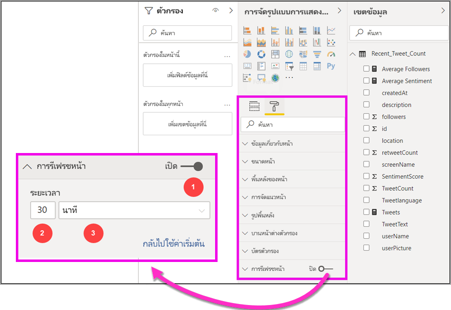
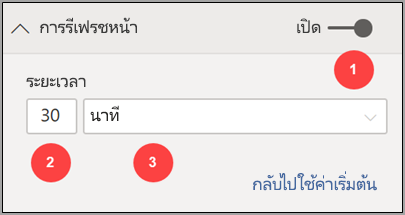
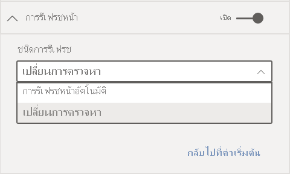
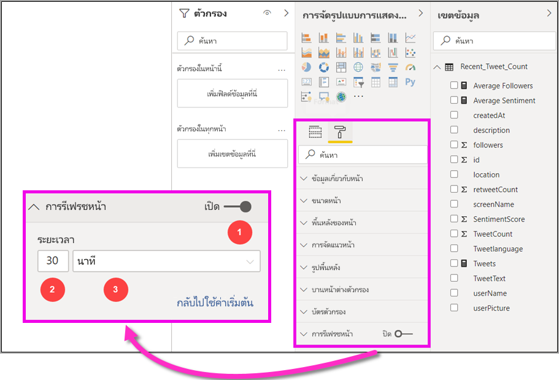
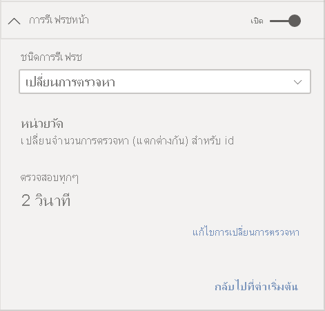
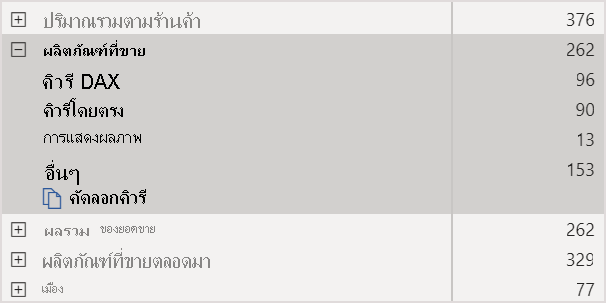
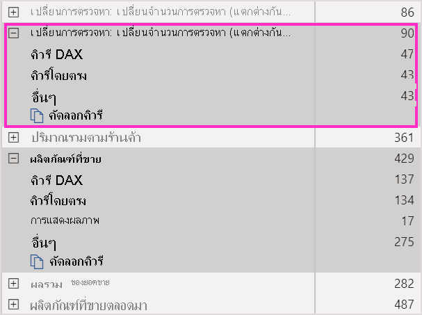

# การรีเฟรชหน้าอัตโนมัติใน Power BI

เมื่อคุณตรวจสอบเหตุการณ์ที่สำคัญ การรีเฟรชข้อมูลทันทีที่แหล่งข้อมูลที่ได้รับการอัปเดตเป็นสิ่งสำคัญ ตัวอย่างเช่น ในอุตสาหกรรมการผลิตเป็นสิ่งสำคัญที่ต้องทราบเมื่อเครื่องยนต์ชำรุดหรือใกล้ถึงเวลาสำหรับซ่อมบำรุง หากคุณกำลังตรวจสอบสัญญาณ เช่น ความคิดเห็นในโซเชียลมีเดีย คุณต้องการทราบเกี่ยวกับการเปลี่ยนแปลงอย่างกะทันหันในทันทีที่เกิดขึ้น

ฟีเจอร์การรีเฟรชหน้าอัตโนมัติใน Power BI จะช่วยให้หน้ารายงานที่ใช้งานของคุณสามารถสืบค้นข้อมูลใหม่ได้ตามจังหวะเวลาที่กำหนดไว้ล่วงหน้าสำหรับ [แหล่งที่มาของ DirectQuery](../connect-data/desktop-directquery-about.md)

## ชนิดการรีเฟรช

เมื่อใช้การรีเฟรชหน้าอัตโนมัติ จะมีชนิดการรีเฟรชสองชนิดที่พร้อมใช้งาน: ช่วงเวลาคงที ่และการตรวจสอบการเปลี่ยนแปลง

### ช่วงเวลาคงที่

ชนิดการรีเฟรชนี้ช่วยให้คุณสามารถอัปเดตภาพทั้งหมดในหน้ารายงานตามช่วงเวลาที่คงที่ เช่น ทุกหนึ่งวินาทีหรือห้านาที เมื่อถึงช่วงเวลาที่กำหนด ภาพทั้งหมดในหน้าดังกล่าวจะส่งคำขออัปเดตไปยังแหล่งข้อมูลและทำการอัปเดตข้อมูล

### การตรวจหาการเปลี่ยนแปลง

การรีเฟรชชนิดนี้จะช่วยให้คุณสามารถรีเฟรชภาพในหน้าตามการตรวจพบการเปลี่ยนแปลงในข้อมูลแทนที่จะใช้การรีเฟรชตามช่วงเวลาที่กำหนด โดยเฉพาะอย่างยยิ่ง หน่วยวัดนี้จะสำรวจการเปลี่ยนแปลง [แหล่งที่มาของ DirectQuery](../connect-data/desktop-directquery-about.md)ของคุณ นอกเหนือจากการกำหนดหน่วยวัดแล้ว คุณยังต้องเลือกว่าจะให้ Power BI Desktop ตรวจสอบการเปลี่ยนแปลงบ่อยแค่ไหน เมื่อเผยแพร่ไปยังบริการ การรีเฟรชชนิดนี้ได้รับการสนับสนุนในพื้นที่ทำงานที่เป็นส่วนหนึ่งของความจุแบบพรีเมียมเท่านั้น

## รายงานผู้เขียนพร้อมด้วยการรีเฟรชหน้าอัตโนมัติใน Power BI Desktop

การรีเฟรชหน้าอัตโนมัตจะสามารถใช้งานได้สำหรับสำหรับ [แหล่งที่มา DirectQuery](../connect-data/desktop-directquery-about.md) เท่านั้น ดังนั้นจึงสามารถใช้งานได้เฉพาะเมื่อคุณเชื่อมต่อกับแหล่งข้อมูล DirectQuery เท่านั้น ข้อจำกัดนี้มีผลกับการรีเฟรชหน้าอัตโนมัติทั้งสองแบบ

หากต้องการใช้การรีเฟรชหน้าอัตโนมัติใน Power BI Desktop ให้เลือกหน้ารายงานที่คุณต้องการเปิดใช้งานการรีเฟรชหน้าอัตโนมัติ ในบานหน้าต่าง **การแสดงผลด้วยภาพ** ให้เลือกปุ่ม **การจัดรูปแบบ** (ลูกกลิ้งทาสี) และค้นหาส่วน **รีเฟรซหน้าเพจ** ซึ่งอยู่ใกล้กับด้านล่างของบานหน้าต่าง

1. เปิดหรือปิดการรีเฟรชหน้า
2. ชนิดการรีเฟรช
3. อินพุทและข้อมูล (ขึ้นอยู่กับชนิดการรีเฟรช)

การ์ด **รีเฟรชหน้า**จะพร้อมใช้งานเฉพาะเมื่อคุณเชื่อมต่อกับ[แหล่งที่มา DirectQuery](../connect-data/desktop-directquery-about.md) เท่านั้น เมื่อต้องการเปิดใช้งานการรีเฟรชหน้าอัตโนมัติ ทอกเกิลจะต้องอยู่ในตำแหน่งเปิด ค่าที่จำเป็นต้องกรอกและข้อมูลที่มีจะขึ้นอยู่กับชนิดการรีเฟรชที่เลือก

### การตั้งค่าช่วงเวลาคงที่

เมื่อเลือกชนิดการรีเฟรชเป็น**การรีเฟรชหน้าอัตโนมัติ** คุณจะต้องระบุช่วงเวลาการรีเฟรชที่ต้องการ ค่าเริ่มต้นคือ 30 นาที (ช่วงการรีเฟรชต่ำสุดคือหนึ่งวินาที) รายงานของคุณจะเริ่มต้นการรีเฟรชตามช่วงเวลาที่คุณตั้งค่า

เมื่อคลิกที่แสดงรายละเอียด Power BI จะแสดงข้อมูลเพิ่มเติมเกี่ยวกับ:

- ถ้าผู้ดูแลระบบของคุณเปิดใช้งานคุณสมบัตินี้ (เฉพาะเมื่อเข้าสู่บัญชี Power BI ของคุณ)
- ช่วงเวลาต่ำสุดที่ผู้ดูแลระบบของคุณอนุญาต (เฉพาะเมื่อเข้าสู่ระบบบัญชี Power BI ของคุณ)
- อัตราการรีเฟรชจริง (มักจะนานกว่าช่วงเวลาที่คุณเลือก)
- การรีเฟรชครั้งล่าสุด

### การตั้งค่าการตรวจหาการเปลี่ยนแปลง

เมื่อเลือกชนิดการรีเฟรชของคุณเป็น**การตรวจหาการเปลี่ยนแปลง**ระบบจะแสดงลิงค์ไปยัง**เพิ่มการตรวจหาการเปลี่ยนแปลง** คุณยังสามารถเข้าถึงหน้าต่าง**การตรวจหาการเปลี่ยนแปลง**จากแท็บโมเดลในริบบอนได้อีกด้วย หลังจากนั้น คลิกที่ไอคอน**การตรวจหาการเปลี่ยนแปลง** ที่ส่วน **รีเฟรชหน้า** สุดท้าย คุณยังสามารถคลิกขวาหรือเลือกลูกศรดรอปดาวน์ที่อยู่ถัดจากค่าต่าง ๆ ในค่า แล้วเลือก**การตรวจหาการเปลี่ยนแปลง** จากเมนู

เมื่อหน้าต่างเปิดขึ้นมา คุณจะเห็นตัวเลือก**ชนิดหน่วยวัด**ซึ่งคุณจะสามารถเลือก ใช้หน่วยวัดที่มีอยู ่หรือสร้างใหม่ตั้งแต่เริ่มต้นได้ เมื่อเลือกตัวเลือกที่มีอยู่ คุณเพียงแค่เลือกหน่วยวัดที่ต้องการจากรายการเขตข้อมูลหรือลากแล้วปล่อยลงในส่วน**เลือกหน่วยวัดที่มีอยู่** เมื่อสร้างหน่วยวัดใหม่ คุณสามารถ**เลือกการคำนวณ**สำหรับการวัดระหว่างจำนวนนับ จำนวนที่แตกต่าง ค่าต่ำสุด ค่าสูงสุด และผลรวมได้ ตัวอย่างเช่น คุณสามารถใช้การนับจำนวนที่แตกต่างกันเพื่อนับหมายเลขลูกค้า และใช้การรีเฟรชเมื่อมีการเพิ่มลูกค้าใหม่ลงในรายการ เมื่อคุณเลือกหน่วยวัดแล้ว คุณจะต้องกำหนดความถี่ต้องการให้่ Power BI **ตรวจสอบการเปลี่ยนแปลง** นั่นคือช่วงเวลาความถี่ที่ Power BI จะคำนวณการเปลี่ยนแปลงการวัดและการสำรวจความคิดเห็น เมื่อคุณคลิก นำไปใช้ ระบบจะแสดงหน่วยวัดใหม่ที่มีไอคอนการตรวจหาการเปลี่ยนแปลงในรายการเขตข้อมูลของคุณ

จากนั้น กลับไปที่ส่วนรีเฟรชหน้า คุณจะเห็นข้อมูลของหน่วยวัดที่ใช้สำหรับการตรวจหาการเปลี่ยนแปลงและช่วงเวลาที่กำหนดเพื่อใช้อ้างอิง

> [!NOTE]
> อนุญาตให้ใช้หน่วยวัดการตรวจหาการเปลี่ยนแปลงรายการเดียวเท่านั้นต่อหนึ่งโมเดล

## การกำหนดช่วงเวลาการการรีเฟรชหน้า

เมื่อเปิดใช้งานการรีเฟรชหน้าอัตโนมัติ Power BI Desktop จะมีการส่งคิวรีไปยังแหล่งข้อมูล DirectQuery อย่างต่อเนื่อง หลังจากที่มีการส่งคิวรีแล้ว มีการความล่าช้าก่อนที่จะมีการส่งกลับข้อมูล ดังนั้นสำหรับช่วงเวลาการรีเฟรชสั้นๆ คุณควรยืนยันว่าคิวรีจะส่งกลับข้อมูลที่ถูกถามภายในช่วงเวลาที่กำหนดเรียบร้อยแล้ว หากไม่มีการส่งคืนข้อมูลภายในช่วงเวลา วิชวลจะอัปเดตน้อยกว่าที่กำหนดค่าไว้

ใช้ข้อควรพิจารณาเหล่านี้กับการรีเฟรชทั้งสองชนิด: ช่วงเวลาคงที่และการตรวจหาการเปลี่ยนแปลง ความแตกต่างที่สำคัญคือ การตรวจหาการเปลี่ยนแปลงมีการส่งคิวรีกลับไปยังแหล่งข้อมูลเพียงครั้งเดียวตามช่วงเวลาที่กำหนดไว้และการจะมีการเริ่มรีเฟรชภาพเมื่อระบบตรวจพบว่าค่าวัดผลของการตรวจหาการเปลี่ยนแปลงมีการเปลี่ยนแปลงเท่านั้น

แนวทางปฏิบัติที่ดีที่สุดคือควรตั้งค่าช่วงเวลาการรีเฟรชให้ตรงกับอัตราการเข้าถึงข้อมูลใหม่ของคุณที่คาดไว้:

* ถ้าข้อมูลใหม่มาถึงแหล่งข้อมูลที่มาทุก 20 นาที ช่วงเวลาการรีเฟรชของคุณต้องไม่น้อยกว่า 20 นาที
* หากข้อมูลใหม่มาถึงทุกๆ วินาทีให้ตั้งช่วงเวลาเป็นหนึ่งวินาที

สำหรับช่วงเวลาการรีเฟรชที่ต่ำ เช่น หนึ่งวินาทีให้พิจารณาปัจจัยต่อไปนี้:

- ประเภทของแหล่งข้อมูล DirectQuery
- การโหลดคิวรีของคุณที่สร้างขึ้น
- ระยะห่างของผู้ชมรายงานของคุณจากศูนย์ข้อมูลของความจุ

คุณสามารถประมาณการเวลาส่งกลับได้โดยใช้[ตัววิเคราะห์ประสิทธิภาพ](desktop-performance-analyzer.md)ใน Power BI Desktop และในเมนูแสดงรายละเอียดในส่วนรีเฟรชหน้าสำหรับการรีเฟรชตามช่วงเวลาแบบคงที่ ตัววิเคราะห์ประสิทธิภาพช่วยให้คุณสามารถตรวจสอบว่าแต่ละคิวรีวิชวลมีเวลาพอที่จะส่งกลับมาพร้อมกับผลลัพธ์จากแหล่งข้อมูลหรือไม่ นอกจากนี้ยังช่วยให้คุณกำหนดเวลาที่ใช้ในการทำงานได้ด้วย ขึ้นอยู่กับผลลัพธ์ของตัววิเคราะห์ประสิทธิภาพ คุณสามารถปรับปรุงแหล่งข้อมูลหรือหรือคุณสามารถทดลองใช้วิชวลและหน่วยวัดอื่นๆ ในรายงานของคุณได้

รูปภาพต่อไปนี้แสดงผลลัพธ์ของแหล่งข้อมูล DirectQuery ในตัววิเคราะห์ประสิทธิภาพ:

มาพิจารณาคุณลักษณะอื่นๆ ของแหล่งข้อมูลนี้กัน

- ข้อมูลมาถึงในอัตราเวลา 2 วินาที
- ตัววิเคราะห์ประสิทธิภาพแสดงคิวรีสูงสุด + เวลาการแสดงผลประมาณ 4.9 วินาที (4,688 มิลลิวินาที)
- แหล่งข้อมูลได้รับการกำหนดค่าเพื่อจัดการคิวรีที่เกิดขึ้นพร้อมกันประมาณ 1,000 ต่อวินาที
- คุณคุณหวังว่าจะให้ผู้ใช้ประมาณ 10 คนสามารถดูรายงานพร้อมกันได้

ดังนั้นผลลัพธ์ในสมการต่อไปนี้:

- **5 วิชวล x 10 ผู้ใช้ = 50 คิวรีโดยประมาณ**

ผลของการคำนวณนี้จะแสดงให้เห็นว่ามีการโหลดมากขึ้นกว่าแหล่งข้อมูลที่สามารถรองรับได้ ข้อมูลมาถึงในอัตราสองวินาทีดังนั้นควรเป็นอัตราการรีเฟรชของคุณ แต่เพราะว่าคิวรีใช้เวลาประมาณห้าวินาทีในการดำเนินการให้เสร็จสมบูรณ์ คุณจึงควรตั้งค่าให้มากกว่าห้าวินาที

โปรดทราบว่าผลลัพธ์นี้อาจแตกต่างกันจากที่คุณเผยแพร่รายงานของคุณไปยังการบริการ ความแตกต่างนี้เกิดขึ้นเนื่องจากรายงานจะใช้อินสแตนซ์ของ Azure Analysis Services ที่โฮสต์อยู่ในระบบคลาวด์ คุณอาจต้องการปรับอัตราการรีเฟรชของคุณตามลำดับ

ไปยังบัญชีสำหรับแบบสอบถามและระยะเวลาการรีเฟรช Power BI จะเรียกใช้คิวรีรีเฟรชถัดไปเมื่อคิวรีรีเฟรชที่เหลือทั้งหมดเสร็จสมบูรณ์ ดังนั้น แม้ว่าช่วงการรีเฟรชของคุณจะสั้นกว่าเวลาคิวรีของคุณที่ใช้ในการประมวลผล โดย Power BI จะรีเฟรชอีกครั้งเมื่อคิวรีที่เหลือเสร็จสมบูรณ์

ควรพิจารณาถึงปัจจัยดังต่อไปนี้ด้วยในกรณีที่ใช้ชนิดการรีเฟรชแบบการตรวจหาการเปลี่ยนแปลง นอกจากนี้ [ตัววิเคราะห์ประสิทธิภาพ](desktop-performance-analyzer.md)จะแสดงผลลัพธ์สำหรับคิวรีหน่วยวัดการตรวจหาการเปลี่ยนแปลงแม้ว่าจะไม่ตรงกับภาพใด ๆ ในรายงานของคุณก็ตาม เราจัดเตรียมความสามารถนี้ขึ้นเพื่อให้คุณสามารถแก้ไขปัญหาของการวัดประเภทนี้ได้โดยใช้วิธีการเดียวกับที่เราได้ระบุไว้แล้วก่อนหน้านี้ ความแตกต่างที่สำคัญสำหรับชนิดการรีเฟรชนี้คือ ระบบจะส่งคิวรี่ไปยังแหล่งข้อมูลแทนเพียงครั้งเดียวเท่านั้น แทนที่จะส่งคิวรีจากภาพทั้งหมด ซึ่งรูปแบบนี้จะยังคงเดิมแม้ว่าจะมีผู้ใช้หลายคนดูรายงานพร้อม ๆ กันก็ตาม

สำหรับสถานการณ์สมมติเดียวกันที่เรากล่าวถึงก่อนหน้านี้:

- **คิวรีหน่วยวัดการตรวจหาการเปลี่ยนแปลง 1 รายการสำหรับการสร้างภาพ 5 รายการ สร้างคิวรีเพียงรายการเดียวเท่านั้นต่อผู้ชมจำนวนใด ๆ ก็ตาม**

- **เมื่อหน่วยวัดการตรวจหาการเปลี่ยนแปลงสั่งให้เริ่มอัปเดตข้อมูลด้วยสาเหตุเดียวกับที่เราได้กล่าวมาแล้วโดยมีผู้ชม 10 คน x ชมภาพคนละ 5 ภาพ = ส่งคิวรีประมาณ 50 รายการ**

สรุปก็คือ เมื่อใช้การตรวจหาการเปลี่ยนแปลง ระบบจะส่งคิวรีไปยังแหล่งข้อมูลเพียงรายการเดียวเท่านั้น จนกว่าจะตรวจพบการเปลี่ยนแปลง เมื่อเกิดการเปลี่ยนแปลงขึ้น ระบบจะใช้ตรรกะเดียวกับการรีเฟรชตามช่วงเวลาคงที่เพื่ออัปเดตภาพสำหรับผู้ใช้ทุกคนโดยสร้างคิวรีในจำนวนเท่ากัน วิธีการนี้น่าจะมีประสิทธิผลมากกว่าในระยะยาว

ในตอนนี้มาดูที่วิธีที่คุณสามารถตรวจสอบและวิเคราะห์ปัญหาด้านประสิทธิภาพการทำงานในฐานะแอดมินผู้ดูแลความจุข้อมูลได้ นอกจากนี้คุณยังสามารถตรวจสอบส่วน [คำถามที่พบบ่อย](#frequently-asked-questions) ภายหลังในบทความนี้สำหรับคำถามเพิ่มเติมและคำตอบเกี่ยวกับประสิทธิภาพการทำงานและการแก้ไขปัญหา

## การรีเฟรชหน้าอัตโนมัติใน Power BI Desktop (ตัวอย่าง)

คุณยังสามารถตั้งค่าการรีเฟรชหน้าอัตโนมัติสำหรับรายงานที่เผยแพร่ในบริการ Power BI อีกด้วยหากแหล่งข้อมูลคือ [DirectQuery](../connect-data/desktop-directquery-about.md)

ขั้นตอนการกำหนดค่าการรีเฟรชหน้าอัตโนมัติสำหรับรายงานในบริการ Power BI นั้นจะเหมือนกับขั้นตอนที่คุณใช้ใน Power BI Desktop เมื่อกำหนดค่าในบริการของ Power BI การรีเฟรชหน้าโดยอัตโนมัติยังสนับสนุนเนื้อหา [Power BI แบบฝังตัว](../developer/embedded/embedding.md) รูปภาพต่อไปนี้แสดงการกำหนดค่า **การรีเฟรชหน้า** สำหรับบริการของ Power BI:

1. เปิดหรือปิดการรีเฟรชหน้า
2. ชนิดการรีเฟรช
3. อินพุทและข้อมูล (ขึ้นอยู่กับชนิดการรีเฟรช)

> [!NOTE]
> เมื่อคุณเผยแพร่รายงานที่เปิดใช้งานการรีเฟรชหน้าอัตโนมัติจาก Power BI Desktop ไปยังบริการ คุณจะต้องให้ข้อมูลที่รับรองสำหรับแหล่งข้อมูล DirectQuery บนเมนูการตั้งค่าชุดข้อมูล คุณสามารถตั้งค่าข้อมูลประจำตัวเพื่อให้ผู้ดูรายงานสามารถเข้าถึงแหล่งข้อมูลนี้ด้วยรหัสผ่านของตนเอง โดยเป็นไปตามการตั้งค่าความปลอดภัยของแหล่งข้อมูล ในกรณีของหน่วยวัดการตรวจสอบการเปลี่ยนแปลง การดำเนินการดังกล่าวประเมินจากข้อมูลประจำตัวของผู้เขียนเสมอ

### ช่วงเวลาของการรีเฟรชหน้า

ช่วงเวลาในการรีเฟรชหน้าที่อนุญาตในบริการ Power BI จะเปลี่ยนแปลงไปตามประเภทพื้นที่ทำงานของรายงาน ซึ่งจะมีผลในกรณีดังต่อไปนี้:

* การเผยแพร่รายงานลงในพื้นที่ทำงานที่มีการเปิดใช้งานการรีเฟรชหน้าอัตโนมัติ
* การแก้ไขช่วงเวลารีเฟรชหน้าเว็บที่มีอยู่แล้วในพื้นที่ทำงาน
* การสร้างรายงานโดยตรงในบริการ

Power BI Desktop ไม่มีข้อจำกัดสำหรับช่วงเวลาการรีเฟรช และสามารถทำการรีเฟรชทุก ๆ นาทีได้ อย่างไอย่างไรก็ตาม เมื่อมีการเผยแพร่รายงานไปยังบริการ Power BI จะมีข้อจำกัดบางประการตามที่ได้อธิบายไว้ในส่วนต่อไปนี้

### ข้อจำกัดเกี่ยวกับช่วงเวลาการรีเฟรช

ในบริการ Power BI จะมีข้อจำกัดการรีเฟรชหน้าโดยอัตโนมัติเปลี่ยนแปลงไปตามพื้นที่ทำงานที่เผยแพร่รายงาน และไม่ว่าคุณจะใช้บริการแบบพรีเมียมและการตั้งค่าผู้ดูแลระบบแบบความจุพรีเมี่ยมหรือไม่ก็ตาม

เพื่ออธิบายวิธีการทำงานของข้อจำกัดเหล่านี้ ให้เริ่มด้วยพื้นหลังเกี่ยวกับที่ความจุและพื้นที่ทำงาน:

*ความจุ* เป็นแนวคิด Power BI ที่สำคัญ ซึ่งแสดงถึงชุดของทรัพยากร (ที่เก็บข้อมูล ตัวประมวลผล และหน่วยความจำ) ที่ใช้เพื่อโฮสต์และนำเสนอเนื้อหาของ Power BI ความจุเป็นได้ทั้งความจุที่ใช้ร่วมกันหรือความจุเฉพาะ *ความจุที่ใช้ร่วมกัน* ที่ถูกแชร์กับลูกค้าอื่นๆ ของ Microsoft *ความจุเฉพาะ* มีการมอบหมายกับลูกค้ารายเดียวอย่างเต็มที่ สำหรับคำแนะนำเกี่ยวกับความจุเฉพาะให้ดูที่ [การจัดการความจุแบบพรีเมียม](../admin/service-premium-capacity-manage.md)

ในความจุที่ใช้ร่วมกัน ปริมาณงานจะทำงานบนแหล่งทรัพยากรเชิงคำนวณที่ใช้ร่วมกับลูกค้าคนอื่น ๆ เนื่องจากความจุจำเป็นต้องแชร์ทรัพยากร ข้อจำกัดที่ถูกกำหนดเพื่อให้แน่ใจว่า *ใช้อย่างยุติธรรม* เช่น การตั้งค่าขนาดแบบจำลองสูงสุด (1 GB) และความถี่ในการรีเฟรชรายวันสูงสุด (แปดครั้งต่อวัน)

*พื้นที่ทำงาน* ของ Power BI อาศัยอยู่ภายในความจุ โดยเป็นตัวแทนของการรักษาความปลอดภัย การทำงานร่วมกันและคอนเทนเนอร์การปรับใช้ ผู้ใช้ Power BI แต่ละคนมีพื้นที่ทำงานส่วนบุคคลเรียกว่า**พื้นที่ทำงานของฉัน** พื้นที่ทำงานเพิ่มเติมสามารถสร้างขึ้นเพื่อช่วยในการทำงานร่วมกันและการปรับใช้ โดยเป็นที่รู้จักในชื่อ *พื้นที่ทำงาน* ตามค่าเริ่มต้น พื้นที่ทำงานรวมถึงพื้นที่ทำงานส่วนบุคคลจะถูกสร้างขึ้นในความจุที่ใช้ร่วมกัน

ต่อไปนี้คือรายละเอียดสำหรับสถานการณ์พื้นที่ทำงานสองตัว:

**พื้นที่ทำงานที่ใช้ร่วมกัน** สำหรับพื้นที่ทำงานปกติ (พื้นที่ทำงานที่ไม่ได้เป็นส่วนหนึ่งของความจุพรีเมียม) การรีเฟรชหน้าอัตโนมัติใช้ช่วงเวลาอย่างน้อย 30 นาที (ช่วงเวลาต่ำสุดที่สามารถอนุญาตได้) ชนิดการรีเฟรชการตรวจหาการเปลี่ยนแปลงไม่มีให้บริการในความจุที่ใช้ร่วมกัน

**พื้นที่ทำงานแบบพรีเมียม** การรีเฟรชหน้าอัตโนมัติที่มีให้บริการในพื้นที่ทำงานแบบพรีเมียม (ทั้งสำหรับแบบช่วงเวลาคงทีและการตรวจหาความเปลี่ยนแปลง) จะขึ้นอยู่กับการตั้งค่าปริมาณงานที่ผู้ดูแลระบบพรีเมียมของคุณได้ตั้งค่าไว้สำหรับความจุ Power BI แบบพรีเมียม มีสองตัวแปรที่อาจส่งผลกระทบต่อความสามารถของคุณในการตั้งค่าการรีเฟรชหน้าอัตโนมัติ:

 - **เปิด/ปิด ฟีเจอร์** ถ้าผู้ดูแลระบบความจุของคุณได้ปิดใช้งานฟีเจอร์นี้คุณจะไม่สามารถตั้งค่าการรีเฟรชหน้าประเภทใดๆ ในรายงานที่เผยแพร่แล้วของคุณ สามารถเปิดและปิดการตรวจหาตามช่วงเวลาแบบคงที่และการตรวจสอบการเปลี่ยนแปลงได้โดยแยกกัน

 - **ช่วงเวลาการรีเฟรชต่ำสุด** เมื่อเปิดใช้งานการรีเฟรชหน้าอัตโนมัติสำหรับช่วงเวลาคงที ่ผู้ดูแลระบบุของคุณต้องตั้งค่าช่วงการรีเฟรชต่ำสุด (ค่าเริ่มต้นคือห้านาที) ถ้าช่วงเวลาของคุณต่ำกว่าค่าต่ำสุดบริการของ Power BI ระบบจะแทนที่การตั้งค่าช่วงเวลาของคุณเพื่อให้เป็นไปตามช่วงเวลาต่ำสุดที่กำหนดโดยผู้ดูแลระบบความจุของคุณ

 - **ช่วงการดำเนินการต่ำสุด** เมื่อเปิดใช้งานการตรวจสอบการเปลี่ยนแปลง ผู้ดูแลระบบของคุณต้องตั้งค่าช่วงการดำเนินการต่ำสุด (ค่าเริ่มต้นคือห้าวินาที) ถ้าช่วงเวลาของคุณต่ำกว่าค่าต่ำสุดบริการของ Power BI ระบบจะแทนที่การตั้งค่าช่วงเวลาของคุณเพื่อให้เป็นไปตามช่วงเวลาต่ำสุดที่กำหนดโดยผู้ดูแลระบบความจุของคุณ

ตารางนี้อธิบายรายละเอียดเพิ่มเติมเกี่ยวกับฟีเจอร์นี้ที่มีอยู่และข้อ จำกัดสำหรับแต่ละประเภทความจุและ [โหมดการจัดเก็บข้อมูล](../connect-data/service-dataset-modes-understand.md):

| โหมดการจัดเก็บข้อมูล | ความจุเฉพาะ | ความจุที่ใช้ร่วมกัน |
| --- | --- | --- |
| DirectQuery | **รองรับ FI**: ใช่  **รองรับ CD**: ใช่  **ต่ำสุด**: 1 วินาที  **การแทนที่ผู้ดูแล**: ใช่ | **รองรับ FI**: ใช่  **รองรับ CD**: ไม่ใช่  **ต่ำสุด**: 30 นาที  **การแทนที่ผู้ดูแล**: ไม่ใช่ |
| นำเข้า | **รองรับ FI**: ไม่ใช่  **รองรับ CD**: ไม่ใช่  **ต่ำสุด**: N/A  **การแทนที่ผู้ดูแล**: N/A | **รองรับ FI**: ไม่ใช่  **รองรับ CD**: ไม่ใช่  **ต่ำสุด**: N/A  **การแทนที่ผู้ดูแล**: N/A |
| โหมดผสม (DirectQuery + แหล่งข้อมูลอื่นๆ) | **รองรับ FI**: ใช่  **รองรับ CD**: ใช่  **ต่ำสุด**: 1 วินาที  **การแทนที่ผู้ดูแล**: ใช่ | **รองรับ FI**: ใช่  **รองรับ CD**: ไม่ใช่  **ต่ำสุด**: 30 นาที  **การแทนที่ผู้ดูแล**: ไม่ใช่ |
| เชื่อมต่อแบบไลฟ์สด AS | **รองรับ FI**: ไม่ใช่  **รองรับ CD**: ไม่ใช่  **ต่ำสุด**: N/A  **การแทนที่ผู้ดูแล**: N/A | **รองรับ FI**: ไม่ใช่  **รองรับ CD**: ไม่ใช่  **ต่ำสุด**: N/A  **การแทนที่ผู้ดูแล**: N/A |
| เชื่อมต่อแบบไลฟ์สด PBI | **รองรับ FI**: ไม่ใช่  **รองรับ CD**: ไม่ใช่  **ต่ำสุด**: N/A  **การแทนที่ผู้ดูแล**: N/A | **รองรับ FI**: ไม่ใช่  **รองรับ CD**: ไม่ใช่  **ต่ำสุด**: N/A  **การแทนที่ผู้ดูแล**: N/A |

*คำอธิบายตาราง:*
1. *FI: ช่วงเวลาคงที่*
2. *CD: การตรวจหาการเปลี่ยนแปลง*

## ข้อควรพิจารณาและข้อจำกัด

มีบางสิ่งที่ควรทราบเมื่อคุณใช้การรีเฟรชหน้าอัตโนมัติใน Power BI Desktop หรือในบริการของ Power BI

* การนำเข้า โหมดที่เก็บข้อมูลแบบ LiveConnect และ Push ไม่รองรับสำหรับการรีเฟรชเพจอัตโนมัติ  
* โมเดลแบบรวมที่มีแหล่งข้อมูล DirectQuery อย่างน้อยหนึ่งรายการมีการรองรับ
* Power BI Desktop ไม่มีข้อจำกัดสำหรับช่วงเวลาการรีเฟรช สามารถกำหนดช่วงความถี่ได้ถึงระดับทุกวินาทีสำหรับการรีเฟรชทัั้งชนิดช่วงเวลาคงที่และการตรวจหาการเปลี่ยนแปลง เมื่อมีการเผยแพร่รายงานไปยังบริการของ Power BI ข้อจำกัดบางอย่างจะถูกนำไปใช้ตามอธิบายไว้ในบทความ [ก่อนหน้านี้](#restrictions-on-refresh-intervals)
* คุณสามารถมีหน่วยวัดการตรวจสอบการเปลี่ยนแปลงได้เพียงหนึ่งรายการต่อชุดข้อมูลเท่านั้น
* สามารถมีโมเดลที่มีหน่วยวัดการตรวจหาการเปลี่ยนแปลงได้สูงสุด 10 รายการต่อผู้เช่า Power BI หนึ่งรายการ

### การวินิจฉัยประสิทธิภาพ

การรีเฟรชเพจอัตโนมัติมีประโยชน์สำหรับการตรวจสอบสถานการณ์จำลองและการสำรวจข้อมูลที่มีการเปลี่ยนแปลงอย่างรวดเร็ว แต่บางครั้งก็สามารถโหลดความจุหรือแหล่งข้อมูลที่ไม่เหมาะสมได้

เพื่อป้องกันการโหลดแหล่งข้อมูลที่ไม่เหมาะสม Power BI มีระบบป้องกันเหล่านี้:

- คิวรีการรีเฟรชหน้าอัตโนมัติทั้งหมดจะทำงานที่ลำดับความสำคัญต่ำกว่าเพื่อให้แน่ใจว่าแบบสอบถามแบบโต้ตอบ (เช่น การโหลดหน้าและภาพที่กรองข้าม) มีความสำคัญกว่า
- หากคิวรีของคุณไม่เสร็จสิ้นก่อนรอบการรีเฟรชครั้งถัดไป Power BI จะไม่ดำเนินการคิวรีรีเฟรชใหม่จนกว่าคิวรีก่อนหน้าจะเสร็จสมบูรณ์ ตัวอย่างเช่น ถ้าคุณมีช่วงเวลาการรีเฟรชของหนึ่งวินาทีและคิวรีของคุณโดยเฉลี่ยใช้เวลาสี่วินาที Power BI Power BI จะรันคิวรีอย่างมีประสิทธิภาพทุกสี่วินาทีเท่านั้น

มีสองพื้นที่ที่คุณยังคงพบปัญหาคอขวดประสิทธิภาพการทำงาน:

1. **ความจุ** คิวรีแรกที่เข้ามาในความจุแบบพรีเมียมซึ่งจะพับและประเมินคิวรี DAX ที่สร้างขึ้นจากการแสดงภาพรายงานลงในคิวรีแหล่งต้นทาง
2. **แหล่งข้อมูล DirectQuery** คิวรีที่มีการแปลในขั้นตอนก่อนหน้านี้จะเรียกใช้กับแหล่งที่มา แหล่งข้อมูลจะเป็นอินสแตนซ์ของเซิร์ฟเวอร์ SQL ของคุณ แหล่งข้อมูลของ SAP Hana และอื่น ๆ

โดยการใช้ [แอปการวัดความจุแบบพรีเมียม](../admin/service-admin-premium-monitor-capacity.md) ที่พร้อมใช้สำหรับผู้ดูแลระบบ คุณสามารถแสดงภาพความจุของคิวรีที่มีลำดับความสำคัญต่ำนั้นถูกใช้ไปเท่าใด

คิวรีที่มีลำดับความสำคัญต่ำประกอบด้วยคิวรีรีเฟรชหน้าอัตโนมัติและคิวรีการรีเฟรซแบบจำลอง ขณะนี้ยังไม่มีวิธีแยกความแตกต่างระหว่างคิวรีการโหลดจากการรีเฟรชเพจอัตโนมัติและการรีเฟรชแบบจำลอง

หากคุณสังเกตเห็นว่าความจุของคุณเต็มไปด้วยคิวรีที่มีลำดับความสำคัญต่ำ คุณสามารถดำเนินการบางอย่างได้ ดังนี้:

- การขอ SKU พรีเมียมที่มีขนาดใหญ่ขึ้น
- ติดต่อเจ้าของรายงานเพื่อขอให้ลดช่วงเวลาการรีเฟรช
- ในพอร์ทัลผู้ดูแลกำลังการผลิตคุณสามารถ:
   - ปิดการรีเฟรชเพจอัตโนมัติสำหรับความจุนั้น
   - เพิ่มช่วงเวลาการรีเฟรชต่ำสุดซึ่งจะส่งผลกระทบต่อรายงานทั้งหมดบนความจุนั้น

### คำถามที่ถามบ่อย

**ฉันเป็นผู้สร้างรายงาน ฉันกำหนดช่วงเวลาการรีเฟรชรายงานของฉันเป็นหนึ่งวินาทีบน Power BI Desktop แต่หลังจากการเผยแพร่ รายงานของฉันไม่ได้รีเฟรชในบริการ**

* ตรวจสอบว่ารีเฟรชเพจอัตโนมัติถูกเปิดใช้งานแล้วสำหรับหน้าเพจ เนื่องจากการตั้งค่านี้เป็นไปตามหน้าเพจ คุณจำเป็นต้องตรวจสอบให้แน่ใจว่ามีการเปิดใช้งานสำหรับแต่ละหน้าในรายงานที่คุณจะต้องการจะรีเฟรช
* ตรวจสอบว่าคุณได้อัปโหลดไปยังพื้นที่ทำงานด้วยความจุพรีเมียมที่แนบมาหรือไม่ ถ้าคุณยังไม่ได้กำหนดช่วงเวลาการรีเฟรชของคุณ ระบบจะล็อกเวลาไว้ที ่30 นาทีสำหรับช่วงเวลาคงที่ และจะไม่สามารถใช้การตรวจหาความเปลี่ยนแปลงได้
* ถ้ารายงานของคุณอยู่ในพื้นที่ทำงานแบบพรีเมียม ให้ตรวจสอบกับผู้ดูแลระบบของคุณว่าพวกเขาได้เปิดใช้งานฟีเจอร์นี้สำหรับความจุที่แนบมาหรือไม่ นอกจากนี้ ให้ตรวจสอบให้แน่ใจว่าช่วงเวลาการรีเฟรชต่ำสุดสำหรับความจุนั้นต่ำกว่าหรือเท่ากับช่วงเวลาการรีเฟรชสำหรับรายงานของคุณ ซึ่งจะใช้โดยแยกกันระหว่างวิธีการแบบช่วงเวลาคงที่และการตรวจหาความเปลี่ยนแปลง

**ฉันคือผู้ดูแลระบบความจุ ฉันได้เปลี่ยนการตั้งค่าสำหรับช่วงการรีเฟรชเพจอัตโนมัติของฉัน แต่การเปลี่ยนแปลงจะไม่ปรากฏขึ้น ในอีกทางหนึ่ง รายงานยังคงรีเฟรชในอัตราที่ระบบไม่ควรทำ หรือไม่มีการรีเฟรชแม้ว่าฉันจะเปิดใช้งานการรีเฟรซเพจอัตโนมัติ**

* ใช้เวลาสูงสุด 5 นาทีในการเปลี่ยนการตั้งค่าการรีเฟรชหน้าอัตโนมัติใน UI ของผู้ดูแลระบบความจุเพื่อเผยแพร่สู่รายงาน
* นอกเหนือจากการเปิดการรีเฟรชหน้าอัตโนมัติสำหรับความจุแล้ว คุณต้องเปิดใช้สำหรับหน้าของรายงานที่คุณต้องการเปิดใช้งานด้วย
* การรีเฟรชทั้งสองชนิดจะจัดการโดยแยกต่างหาก ดังนั้น โปรดตรวจสอบให้แน่ใจว่าชนิดของการรีเฟรชที่คุณกำลังเปิดใช้งานนั้นเปิดอยู่

**รายงานของฉันมีการดำเนินการในโหมดผสม (โหมดผสมหมายถึงรายงานมีการเชื่อมต่อ DirectQuery และแหล่งข้อมูลนำเข้า) บางวิชวลไม่ได้รีเฟรช**

- หากวิชวลของคุณอ้างอิงตารางการนำเข้านั้นแปลว่าเป็นไปตามคุณลักษณะการทำงานคาดหวังไว้ การรีเฟรชหน้าอัตโนมัติไม่ได้รับการรองรับสำหรับการนำเข้า
- ดูคำถามแรกในส่วนนี้

**รายงานของฉันได้รับการรีเฟรชอย่างละเอียดในบริการ แต่จะหยุดทำงานลงทันที**

* ลองรีเฟรชเพจเพื่อดูว่าปัญหาได้รับแก้ไขหรือไม่
* ตรวจสอบกับผู้ดูแลระบบความจุของคุณ ผู้ดูแลระบบอาจปิดใช้งานฟีเจอร์หรือเพิ่มช่วงการรีเฟรชต่ำสุด (ดูคำถามที่สองในส่วนนี้)

**ฉันเป็นผู้สร้างรายงาน วิชวลของฉันไม่ได้รับการรีเฟรชในจังหวะที่ฉันระบุ ระบบกำลังรีเฟรชในอัตราที่ช้าลง**

* หากคิวรีของคุณใช้เวลานานขึ้นในการใช้งาน ช่วงการรีเฟรซของคุณจะล่าช้า การรีเฟรชเพจอัตโนมัติรอให้การค้นหาทั้งหมดเสร็จสิ้นก่อนที่จะเรียกใช้คำสั่งใหม่
* ผู้ดูแลระบบความจุของคุณอาจตั้งค่าช่วงการรีเฟรชต่ำสุดที่สูงกว่าที่คุณกำหนดรายงานของคุณ ขอให้ผู้ดูแลระบบความจุของคุณลดระยะเวลาการรีเฟรชต่ำสุด

**คิวรีรีเฟรชเพจอัตโนมัติถูกแสดงจากแคชหรือไม่**

* หมายเลข คิวรีรีเฟรชหน้าอัตโนมัติทั้งหมดจะข้ามทุกๆ ข้อมูลแคช

**หน่วยวัดการตรวจหาการเปลี่ยนแปลงของฉันไม่เรียกใช้การอัปเดตใด ๆ**

* ตรวจสอบให้แน่ใจว่ามีการเปิดใช้งานการตรวจหาการเปลี่ยนแปลงของหน้า เนื่องจากการตั้งค่านี้เป็นไปตามหน้าเพจ คุณจำเป็นต้องตรวจสอบให้แน่ใจว่ามีการเปิดใช้งานสำหรับแต่ละหน้าในรายงานที่คุณจะต้องการจะรีเฟรช
* ตรวจสอบว่าคุณได้อัปโหลดไปยังพื้นที่ทำงานด้วยความจุพรีเมียมที่แนบมาหรือไม่ ถ้าคุณยังไม่ไดดำเนินการดังกล่าว การตรวจหาการเปลี่ยนแปลงจะไม่ทำงาน
* ถ้ารายงานของคุณอยู่ในพื้นที่ทำงานแบบพรีเมียม ให้ตรวจสอบกับผู้ดูแลระบบของคุณว่าพวกเขาได้เปิดใช้งานฟีเจอร์นี้สำหรับความจุที่แนบมาหรือไม่ นอกจากนี้ ให้ตรวจสอบให้แน่ใจว่าช่วงเวลาการทำงานต่ำสุดสำหรับความจุนั้นต่ำกว่าหรือเท่ากับช่วงเวลาสำหรับรายงานของคุณ
* หากคุณได้ตรวจสอบรายการทั้งหมดที่ระบุไว้ก่อนหน้านี้แล้ว ให้ตรวจสอบใน Power BI Desktop หรือในโหมดแก้ไขว่ามีการเปลี่ยนแปลงหน่วยวัดหรือไม่ เพื่อการดำเนินการดังกล่าว ให้ลากรายการที่ต้องการไปในพื้นที่ทำงานแล้วตรวจสอบว่าค่ามีการเปลี่ยนแปลงหรือไม่ หากค่าไม่มีการเปลี่ยนแปลง หน่วยวัดดังกล่าวอาจจะไม่ใช่ตัวเลือกที่ดีในการใช้เปลี่ยนแปลงแหล่งข้อมูล

## ขั้นตอนถัดไป

สำหรับข้อมูลเพิ่มเติม โปรดดูบทความเหล่านี้:

* [การใช้ DirectQuery ใน Power BI](../connect-data/desktop-directquery-about.md)
* [ใช้แบบจำลองแบบรวมใน Power BI Desktop](../transform-model/desktop-composite-models.md)
* [ใช้ตัววิเคราะห์ประสิทธิภาพในการตรวจสอบประสิทธิภาพขององค์ประกอบรายงาน](desktop-performance-analyzer.md)
* [การปรับใช้งานและการจัดการความจุแบบพรีเมียมของ Power BI](../guidance/whitepaper-powerbi-premium-deployment.md)
* [แหล่งข้อมูลใน Power BI Desktop](../connect-data/desktop-data-sources.md)
* [จัดรูปร่างและรวมข้อมูลใน Power BI Desktop](../connect-data/desktop-shape-and-combine-data.md)
* [เชื่อมต่อกับเวิร์กบุ๊ก Excel ใน Power BI Desktop](../connect-data/desktop-connect-excel.md)   
* [ป้อนข้อมูลลงใน Power BI Desktop โดยตรง](../connect-data/desktop-enter-data-directly-into-desktop.md)   
