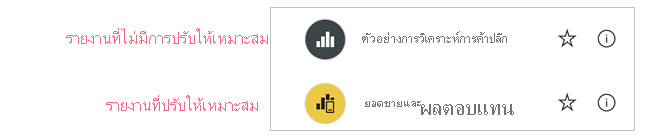
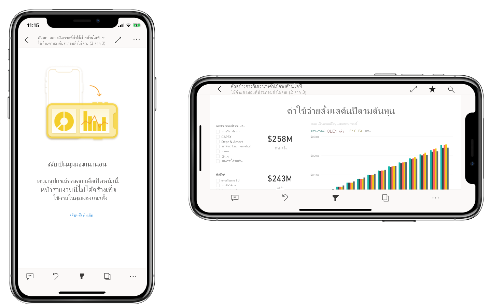

# ปรับรายงาน Power BI ให้เหมาะสมสำหรับแอปมือถือ
ผู้ใช้โทรศัพท์มือถือสามารถดูหน้ารายงาน Power BI ใดๆ ก็ตามในแนวนอนได้ อย่างไรก็ตาม ผู้เขียนรายงานสามารถสร้างมุมมองเพิ่มเติมที่ปรับให้เหมาะสมกับโทรศัพท์มือถือและแสดงในการวางแนวแบบแนวตั้งได้ ตัวเลือกการออกแบบนี้ซึ่งมีให้ใช้งานในทั้ง Power BI Desktop และในบริการของ Power BI ช่วยให้ผู้สร้างสามารถเลือกและจัดเรียงใหม่ได้เฉพาะภาพเหล่านั้นที่ทำให้การใช้งานบนโทรศัพท์มือถือเป็นไปได้

.

Power BI มีฟีเจอร์จำนวนหนึ่งที่ช่วยให้คุณสามารถสร้างรายงานของคุณที่ปรับให้เหมาะสมกับโทรศัพท์มือถือได้:
* มุมมองเค้าโครงบนโทรศัพท์มือถือที่คุณสามารถสร้างรายงานที่ปรับให้เหมาะสมกับโทรศัพท์มือถือของคุณได้โดยการลากและวางภาพลงบนพื้นที่ทำงานของ emulator ของโทรศัพท์
* ภาพและตัวแบ่งส่วนข้อมูลที่สามารถปรับให้เหมาะสมสำหรับการใช้งานบนหน้าจอขนาดเล็กของโทรศัพท์มือถือ

ความสามารถเหล่านี้ทำให้สามารถออกแบบและสร้างรายงานที่ปรับให้เหมาะสมกับโทรศัพท์มือถือได้อย่างน่าสนใจ

## สร้างเวอร์ชันแนวตั้งที่ปรับให้เหมาะกับโทรศัพท์มือถือของหน้ารายงาน

ขั้นตอนแรกคือการออกแบบและสร้างรายงานในมุมมองเว็บปกติ หลังจากสร้างการรายงาน คุณสามารถปรับแต่งเพื่อให้เหมาะกับโทรศัพท์และแท็บเล็ตได้

หากต้องการสร้างมุมมองที่ปรับให้เหมาะสำหรับโทรศัพท์มือถือ ให้เปิดมุมมองเค้าโครงโทรศัพท์มือถือนี้:
   * ใน Power BI Desktop ให้เลือก ribbon **มุมมอง** และเลือก **เค้าโครงโทรศัพท์มือถือ**
   * ในบริการของ Power BI ให้เลือก**ตัวเลือกเพิ่มเติม (...) > แก้ไขรายงาน > เค้าโครงโทรศัพท์มือถือ**

   คุณจะเห็นพื้นที่ทำงานที่สามารถเลื่อนได้เช่นโทรศัพท์ และบานหน้าต่าง**การแสดงผลด้วยภาพ**ที่สร้างรายการภาพทั้งหมดที่อยู่บนหน้ารายงานต้นฉบับ

   .

* แต่ละภาพในบานหน้าต่าง**การแสดงผลด้วยภาพ**จะปรากฏขึ้นพร้อมชื่อเพื่อการระบุที่ง่าย
* แต่ละภาพยังมีตัวชี้วัดการมองเห็นอีกด้วย ตัวชี้วัดการมองเห็นของการแสดงผลด้วยภาพเปลี่ยนแลงโดยขึ้นอยู่กับสถานะการมองเห็นของภาพในสถานะปัจจุบันของมุมมองรายงานเว็บ ตัวชี้วัดการมองเห็นมีประโยชน์เมื่อทำงานกับบุ๊กมาร์ก

## เพิ่มภาพไปยังพื้นที่ทำงานของเค้าโครงโทรศัพท์มือถือ
หากต้องการเพิ่มภาพลงในเค้าโครงโทรศัพท์มือถือ ให้ลากภาพจากบานหน้าต่าง**การแสดงผลด้วยภาพ**ไปยังพื้นที่ทำงานสำหรับโทรศัพท์ เมื่อคุณลากภาพไปยังพื้นที่ทำงาน ถาพจะจัดชิดกับเส้นตาราง อีกวิธีหนึ่งคือคุณสามารถคลิกสองครั้งที่ภาพในบานหน้าต่างการแสดงผลด้วยภาพได้และภาพจะถูกเพิ่มไปยังพื้นที่ทำงาน

คุณสามารถเพิ่มภาพของหน้ารายงานเว็บบางหน้าหรือทั้งหมดไปยังหน้ารายงานที่ปรับให้เหมาะสมสำหรับโทรศัพท์มือถือได้ คุณสามารถเพิ่มแต่ละภาพได้เพียงครั้งเดียวและไม่จำเป็นต้องรวมภาพทั้งหมด

>[!NOTE]
> คุณสามารถลากและวางภาพที่ซ่อนอยู่ลงบนพื้นที่ทำงานได้ ภาพจะถูกวาง แต่ไม่แสดงขึ้นมาเว้นแต่จะมีการเปลี่ยนแปลงสถานะการมองเห็นในมุมมองรายงานเว็บปัจจุบัน

ภาพสามารถจัดเรียงเป็นชั้นๆ ได้ เพื่อสร้างรายงานแบบโต้ตอบโดยใช้บุ๊กมาร์กหรือเพื่อสร้างรายงานที่น่าสนใจโดยการวางชั้นภาพไว้เหนือรูปภาพ

เมื่อคุณวางภาพบนพื้นที่ทำงานแล้ว คุณสามารถปรับขนาดได้โดยการลากจุดจับที่ปรากฏรอบๆ ขอบของภาพเมื่อคุณเลือกภาพนั้น เมื่อต้องการรักษาอัตราส่วนกว้างยาวของภาพขณะปรับขนาด ให้กดแป้น **Shift** ในขณะที่ลากจุดปรับขนาด

รูปด้านล่างแสดงการลากและวางภาพจากบานหน้าต่าง**การแสดงผลด้วยภาพ** ไปยังพื้นที่ทำงานรวมถึงการปรับขนาดและการซ้อนทับบางรายการ

   

มาตราส่วนตารางขนาดต่าง ๆ ของหน้ารายงานในโทรศัพท์จะปรับขนาดให้เหมาะสมกับโทรศัพท์ เพื่อให้รายงานของคุณเข้ากับโทรศัพท์ทั้งหน้าจอขนาดใหญ่และขนาดเล็ก

## ลบภาพออกพื้นที่ทำงานของเค้าโครงโทรศัพท์มือถือ
เมื่อต้องการลบภาพออกจากเค้าโครงโทรศัพท์มือถือ ให้คลิก **X** ที่มุมบนขวาของภาพบนพื้นที่ทำงานของโทรศัพท์ หรือเลือกภาพและกด**ลบ**

คุณสามารถลบการแสดงผลด้วยภาพทั้งหมดออกจากพื้นที่ทำงานได้โดยการคลิกที่ตัวลบในบานหน้าต่าง **การแสดงผลด้วยภาพ**

การลบภาพของคุณออกจากพื้นที่ทำงานเค้าโครงโทรศัพท์มือถือจะเป็นการลบภาพจากพื้นที่ทำงานเท่านั้น ภาพจะยังคงปรากฏขึ้นในบานหน้าต่างการจัดรูปแบบการแสดงข้อมูลและรายงานต้นฉบับยังคงไม่ได้รับผลกระทบ

## กำหนดค่าภาพและแบ่งส่วนข้อมูลสำหรับการใช้งานในรายงานที่ปรับให้เหมาะสมกับโทรศัพท์มือถือ

### การแสดงผลด้วยภาพ

ตามค่าเริ่มต้น ภาพจำนวนมาก โดยเฉพาะการแสดงผลด้วยภาพแบบแผนภูมิจะตอบสนองได้  ซึ่งหมายความว่าภาพจะเปลี่ยนการแสดงผลข้อมูลทั่วไปและข้อมูลเชิงลึกปริมาณมากได้ โดยไม่ขึ้นอยู่กับขนาดของหน้าจอ

Power BI จะจัดลำดับความสำคัญของมุมมองข้อมูล ทุกเมื่อที่เปลี่ยนแปลงขนาดภาพ เช่น การนำเอาช่องว่างภายในออกและย้ายคำอธิบายแผนภูมิไปไว้ด้านบนสุดของภาพโดยอัตโนมัติ เพื่อให้ภาพยังคงแสดงข้อมูลได้ แม้ว่าจะมีขนาดเล็กลงก็ตาม

 
ถ้ามีเหตุผลบางอย่างที่คุณต้องการปิดใช้งานการตอบสนอง คุณสามารถทำได้ในส่วน**ทั่วไป**ของการตั้งค่ารูปแบบของภาพ

### ตัวแบ่งส่วนข้อมูล

ตัวแบ่งส่วนข้อมูลมีการกรองในพื้นที่ทำงานสำหรับข้อมูลรายงาน เมื่อคุณออกแบบตัวแบ่งส่วนข้อมูลในโหมดการเขียนรายงานทั่วไป คุณก็สามารถปรับเปลี่ยนการตั้งค่าตัวแบ่งส่วนข้อมูลบางรายการ เพื่อให้สามารถใช้งานในรายงานการปรับให้เหมาะสมกับโทรศัพท์มือถือดังนี้:
* คุณสามารถตัดสินใจว่าจะอนุญาตให้ผู้อ่านรายงานสามารถเลือกได้เพียงหนึ่งรายการหรือหลายรายการก็ได้
* คุณสามารถทำให้ตัวแบ่งส่วนข้อมูลเป็นแนวตั้ง แนวนอน หรือแบบตอบสนองได้ (ตัวแบ่งส่วนข้อมูลแบบตอบสนองต้องเป็นแนวนอน)

ถ้าคุณสร้างตัวแบ่งส่วนข้อมูลให้เป็นแบบตอบสนอง เมื่อคุณเปลี่ยนขนาดและรูปร่าง ตัวแบ่งส่วนข้อมูลแบบตอบสนองก็่จะแสดงตัวเลือกมากขึ้นหรือน้อยลง ซึ่งสามารถเป็นแบบสูง เตี้ย กว้างหรือแคบ ถ้าคุณปรับให้มีขนาดเล็กพอ จะกลายเป็นเพียงไอคอนตัวกรองที่อยู่ในหน้ารายงาน

 
อ่านข้อมูลเพิ่มเติมเกี่ยวกับ[การสร้างตัวแบ่งส่วนข้อมูลแบบตอบสนอง](power-bi-slicer-filter-responsive.md)

## รายงานที่ปรับให้เหมาะสมกับโทรศัพท์มือถือ
หากต้องการเผยแพร่รายงานเวอร์ชันที่ปรับให้เหมาะสมกับโทรศัพท์มือถือ ให้[เผยแพร่รายงานหลักจาก Power BI Desktop ไปยังบริการของ Power BI](desktop-upload-desktop-files.md) การดำเนินการนี้จะเป็นการเผยแพร่เวอร์ชันที่ปรับให้เหมาะสมกับโทรศัพท์มือถือในเวลาเดียวกัน

## การดูรายงานที่ปรับให้เหมาะสมและไม่ได้ปรับบนโทรศัพท์หรือแท็บเล็ต

ในแอปสำหรับโทรศัพท์มือถือของ Power BI รายงานที่ปรับให้เหมาะสมกับโทรศัพท์มือถือจะแสดงด้วยไอคอนพิเศษ

บนโทรศัพท์ แอปจะตรวจหาว่ารายงานได้รับการปรับให้เหมาะสมกับโทรศัพท์มือถือโดยอัตโนมัติหรือไม่
* ถ้ามีรายงานที่ปรับให้เหมาะสมกับโทรศัพท์มือถือ แอปจะเปิดรายงานในโหมดที่ปรับให้เหมาะสมกับโทรศัพท์มือถือโดยอัตโนมัติ
* ถ้ารายงานที่ปรับให้เหมาะสมกับโทรศัพท์มือถือไม่มีอยู่ รายงานจะเปิดขึ้นในมุมมุมมองแนวนอน

การถือโทรศัพท์ในแนวนอนจะเปิดรายงานในมุมมองที่ไม่ได้ปรับให้เหมาะสมด้วยเค้าโครงรายงานต้นฉบับโดยไม่คำนึงว่ารายงานนั้นได้รับการปรับให้เหมาะสมหรือไม่

หากคุณเพิ่มได้ปรับให้เหมาะสมเฉพาะบางหน้า เมื่อผู้อ่านมาที่หน้าที่ไม่ได้ปรับให้เหมาะสม พวกเขาจะได้รับแจ้งให้เปลี่ยนเป็นมุมมองแนวนอน การเปิดโทรศัพท์หรือแท็บเล็ตด้านข้างจะเปิดใช้งานการดูหน้าในโหมดแนวนอน อ่านข้อมูลเพิ่มเติมเกี่ยวกับ[การเรียนรู้เกี่ยวกับรายงาน Power BI ที่ปรับให้เหมาะสมสำหรับโหมดแนวตั้ง](../consumer/mobile/mobile-apps-view-phone-report.md)

## ข้อควรพิจารณาเมื่อสร้างเค้าโครงที่ปรับให้เหมาะสมกับโทรศัพท์มือถือ
* สำหรับรายงานที่มีหลายหน้า คุณสามารถปรับให้เหมาะสมทุกหน้าหรือแค่บางหน้าได้
* ถ้าคุณได้กำหนดสีพื้นหลังสำหรับหน้ารายงานราย งานที่ปรับให้เหมาะสมกับโทรศัพท์มือถือจะมีสีพื้นหลังเดียวกัน
* คุณไม่สามารถปรับเปลี่ยนการตั้งค่ารูปแบบเฉพาะสำหรับรายงานที่ปรับให้เหมาะสมกับโทรศัพท์มือถือได้ การจัดรูปแบบจะสอดคล้องกันระหว่างหลักและเค้าโครงโทรศัพท์มือถือ ตัวอย่างเช่น ขนาดแบบอักษรจะเหมือนกัน
* เมื่อต้องการเปลี่ยนภาพ เช่น การเปลี่ยนแปลงการจัดรูปแบบ ชุดข้อมูล ตัวกรอง หรือแอตทริบิวต์ต่างๆ ให้กลับไปยังโหมดการเขียนรายงานเว็บ

## ขั้นตอนถัดไป
* [สร้างมุมมองโทรศัพท์สำหรับแดชบอร์ดใน Power BI](service-create-dashboard-mobile-phone-view.md)
* [ดูรายงาน Power BI ที่ปรับให้เหมาะสมกับโทรศัพท์ของคุณ](../consumer/mobile/mobile-apps-view-phone-report.md)
* [เอกสารประกอบ Power BI ในการสร้างรายงานและแดชบอร์ด](https://docs.microsoft.com/power-bi/create-reports/)
* มีคำถามเพิ่มเติมหรือไม่ [ลองถามชุมชน Power BI](https://community.powerbi.com/)