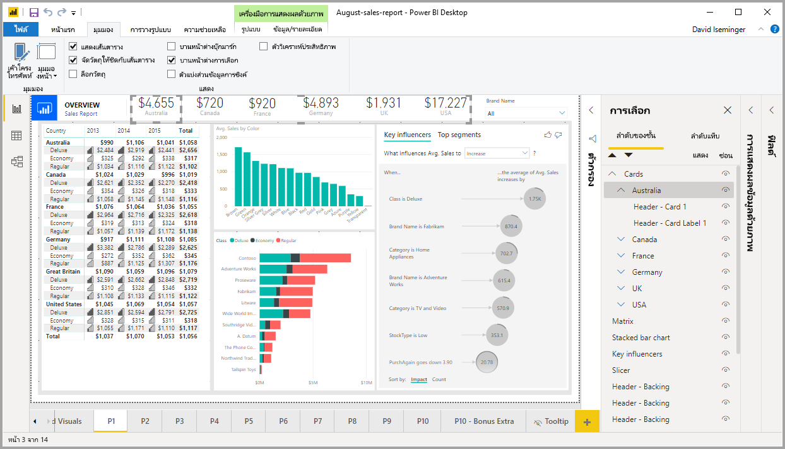
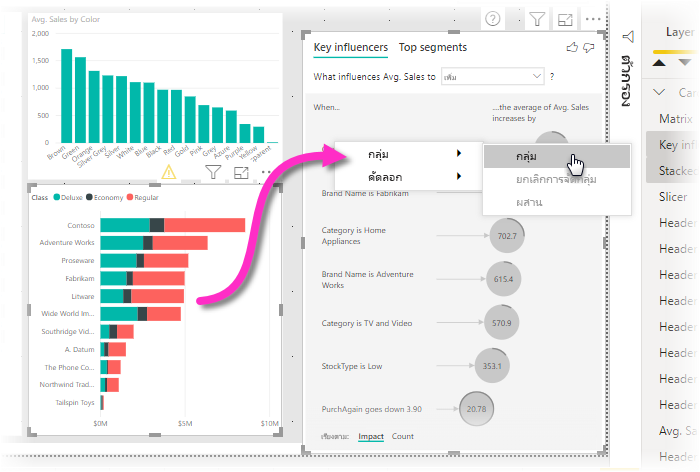
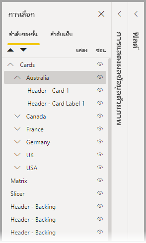
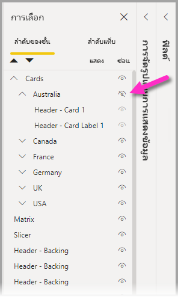
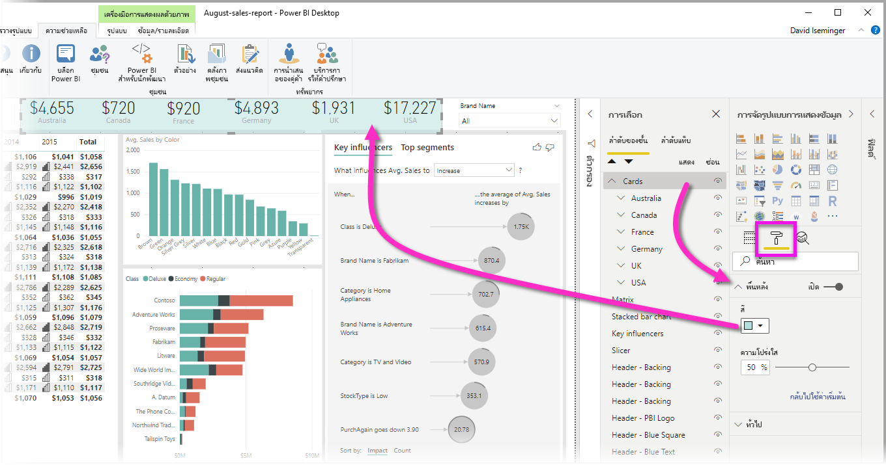

# จัดกลุ่มวิชวลในรายงาน Power BI Desktop
ด้วยคุณลักษณะ**การจัดกลุ่ม**ใน **Power BI Desktop**คุณสามารถจัดกลุ่มวิชวลเข้าด้วยกันในรายงานของคุณได้ เช่น ปุ่ม กล่องข้อความ ภาพรูปทรง และวิชวลที่คุณสร้างเช่นเดียวกับที่คุณจัดกลุ่มรายการใน PowerPoint การจัดกลุ่มวิชวลในรายงานช่วยให้คุณปฏิบัติต่อกลุ่มเช่นเดียวกับวัตถุเดี่ยว ทำให้เคลื่อนไหว ปรับขนาด และทำงานกับเลเยอร์ในรายงานของคุณได้ง่ายขึ้นเร็วขึ้น และทันใจขึ้น

## การสร้างกลุ่ม

หากต้องการสร้างกลุ่มของวิชวลใน Power BI Desktop ให้เลือกวิชวลแรกจากพื้นที่ทำงาน จากนั้นกดปุ่ม CTRL ค้างไว้ คลิกวิชวลตั้งแต่หนึ่งภาพขึ้นไปซึ่งเป็นวิชวลที่คุณต้องการให้อยู่ในกลุ่ม จากนั้นคลิกขวาที่ชุดของวิชวล และเลือก **กลุ่ม** จากเมนูที่ปรากฏขึ้น

กลุ่มจะแสดงในบานหน้าต่าง **การเลือก** คุณสามารถมีกลุ่มของวิชวลจำนวนมากตามที่รายงานของคุณต้องการ และคุณยังสามารถซ้อนกลุ่มของวิชวลได้ ในรูปภาพต่อไปนี้ กลุ่ม *ออสเตรเลีย* ซ้อนอยู่ในกลุ่ม *การ์ด* คุณสามารถขยายกลุ่มโดยเลือกสัญลักษณ์ ^ ข้างชื่อกลุ่มและยุบโดยเลือกสัญลักษณ์ ^ อีกครั้ง 

ภายในบานหน้าต่าง**การเลือก** คุณยังสามารถลากและปล่อยแต่ละวิชวลเพื่อรวมไว้ในกลุ่ม ลบออกจากกลุ่ม ซ้อนกลุ่ม หรือลบกลุ่มหรือแต่ละวิชวลออกจากการซ้อนกันได้ เพียงแค่ลากวิชวลที่คุณต้องการปรับและวางลงในตำแหน่งที่คุณต้องการ หากมีการซ้อนทับ การสร้างเลเยอร์ของวิชวลจะถูกกำหนดโดยคำสั่งของพวกเขาในรายการ *ลำดับเลเยอร์*

เมื่อต้องการยกเลิกการจัดกลุ่ม ให้คลิกขวาแล้วเลือก**ยกเลิกการจัดกลุ่ม**จากเมนูที่ปรากฏขึ้น

## ซ่อนและแสดงวิชวลหรือกลุ่ม

คุณสามารถซ่อนหรือแสดงกลุ่มได้อย่างง่ายดายโดยใช้บานหน้าต่าง**การเลือก** หากต้องการซ่อนกลุ่ม ให้เลือกปุ่มดวงตาด้านข้างชื่อกลุ่ม (หรือวิชวลแต่ละรายการ) เพื่อสลับว่าจะซ่อนหรือแสดงภาพหรือกลุ่ม ในรูปภาพต่อไปนี้ กลุ่ม *ออสเตรเลีย* ถูกซ่อนและส่วนที่เหลือของกลุ่มที่ซ้อนกันในกลุ่ม *การ์ด* จะปรากฏขึ้น

เมื่อคุณซ่อนกลุ่ม วิชวลทั้งหมดภายในกลุ่มนั้นจะถูกซ่อนโดยปุ่มดวงตาของพวกเขาจะเป็นสีเทา (ไม่สามารถเปิดหรือปิดการสลับได้เนื่องจากกลุ่มทั้งหมดถูกซ่อนอยู่) หากต้องการซ่อนเฉพาะวิชวลบางอันภายในกลุ่ม เพียงสลับปุ่มดวงตาที่อยู่ข้างวิชวล และเฉพาะวิชวลนั้นในกลุ่มที่จะถูกซ่อน

## การเลือกวิชวลภายในกลุ่ม

มีสองสามวิธีในการนำทางและเลือกรายการภายในกลุ่มของวิชวล รายการต่อไปนี้อธิบายลักษณะการทำงาน:

* การคลิกที่พื้นที่ว่างภายในกลุ่ม (เช่น ช่องว่างระหว่างวิชวล) ซึ่งจะเป็นการไม่เลือกอะไรเลย
* การคลิกที่วิชวลภายในกลุ่มเลือกทั้งกลุ่ม คลิกครั้งที่สอง ซึ่งจะเป็นการเลือกวิชวลแต่ละรายการ
* การเลือกกลุ่ม และจากนั้นวัตถุอื่นบนพื้นที่รายงาน จากนั้นเลือก **กลุ่ม** จากเมนูคลิกขวา ซึ่งจะเป็นการสร้างกลุ่มแบบซ้อนกัน
* การเลือกสองกลุ่ม จากนั้นคลิกขวา ซึ่งจะเป็นการแสดงตัวเลือกเพื่อผสานกลุ่มที่เลือก แทนที่จะทำการซ้อน

## ใช้สีพื้นหลัง

นอกจากนี้คุณยังสามารถใช้สีพื้นหลังกับกลุ่มได้ด้วยการใช้ส่วน**การจัดรูปแบบ**ของบานหน้าต่าง**การแสดงข้อมูลด้วยภาพ** ดังที่ปรากฏในรูปต่อไปนี้ 

เมื่อคุณใช้สีพื้นหลังแล้ว ให้คลิกที่ช่องว่างระหว่างวิชวลในกลุ่ม ซึ่งจะเป็นการเลือกกลุ่ม (เปรียบเทียบสิ่งนี้กับการคลิกที่ช่องว่างระหว่างภาพในกลุ่ม ซึ่งจะเป็นการไม่เลือกอะไรเลย) 

## ขั้นตอนถัดไป
สำหรับข้อมูลเพิ่มเติมเกี่ยวกับการจัดกลุ่ม โปรดดูที่วิดีโอต่อไปนี้:

* [การจัดกลุ่มใน Power BI Desktop - วิดีโอ](https://youtu.be/sf4n7VXoQHY?t=10)

คุณอาจมีความสนใจบทความต่อไปนี้:

* [ใช้ตัวเจาะเข้าถึงรายละเอียดข้ามรายงานใน Power BI Desktop](desktop-cross-report-drill-through.md)
* [การใช้ตัวแบ่งส่วนข้อมูล Power BI Desktop](../visuals/power-bi-visualization-slicers.md)
