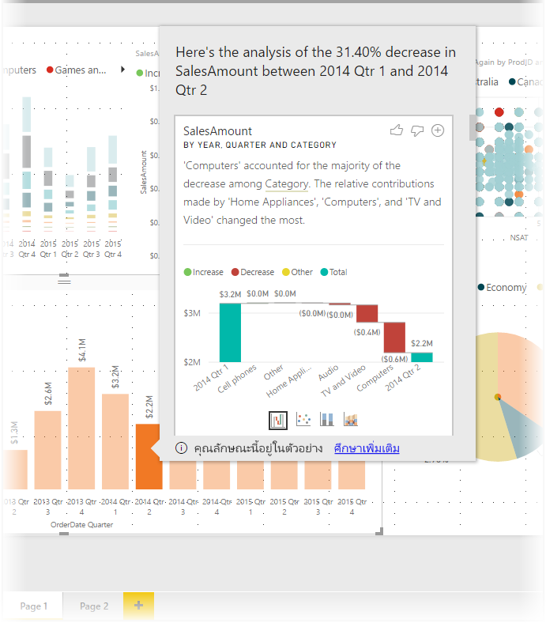
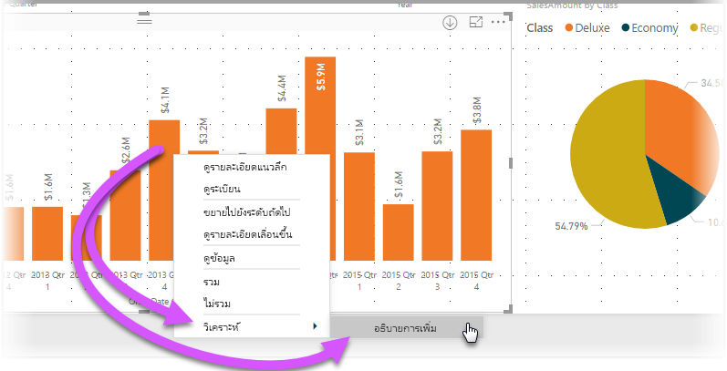

# ปรับใช้ข้อมูลเชิงลึกใน Power BI Desktop เพื่ออธิบายการผันผวนของวิชวล (ตัวอย่าง)

บ่อยครั้งในการแสดงผลด้วยภาพ คุณเห็นการเพิ่มอย่างมาก จากนั้นค่าจะลดลงอย่างรวดเร็ว และสงสัยเกี่ยวกับสาเหตุของความผันผวนดังกล่าว คุณสามารถเรียนรู้สาเหตุด้วยการคลิกเพียงไม่กี่ครั้งด้วย**ข้อมูลเชิงลึก**ใน**Power BI Desktop**

ตัวอย่างเช่น พิจารณาวิชวลต่อไปนี้ที่แสดง*ยอดขาย*ตาม*ปี*และ*ประเทศ* ยอดขายลดลงอย่างมากเกิดขึ้นในปี 2014 เนื่องจากการขายที่ลดลงอย่างชัดเจนระหว่าง*ไตรมาสที่ 1*และ*ไตรมาส 2* ในกรณีดังกล่าว คุณสามารถสำรวจข้อมูล เพื่อช่วยอธิบายการเปลี่ยนแปลงที่เกิดขึ้นได้ 

คุณสามารถบอกให้ **Power BI Desktop** อธิบายการเพิ่มขึ้นหรือลดลงของแผนภูมิ ดูปัจจัยการกระจายในแผนภูมิ และรับการวิเคราะห์ที่รวดเร็ว อัตโนมัติ และชาญฉลากเกี่ยวกับข้อมูลของคุณ เพียงคลิกขวาที่จุดข้อมูล และเลือก **วิเคราะห์ > อธิบายการลดลง** (หรือเพิ่มขึ้น หากเส้นก่อนหน้านี้ต่ำกว่า) หรือ **วิเคราะห์ > หาว่าการกระจายนี้ต่างกันตรงไหน**และข้อมูลเชิงลึกจะถูกส่งไปให้คุณในหน้าต่างที่ใช้งานง่าย

คุณลักษณะข้อมูลเชิงลึก มีบริบทและขึ้นกับจุดข้อมูลก่อนหน้า - เช่นแท่งก่อนหน้า หรือคอลัมน์ก่อนหน้า

> [!NOTE]
> คุณลักษณะนี้ยังเป็นแค่ตัวอย่าง และอาจเปลี่ยนแปลงได้ คุณลักษณะข้อมูลเชิงลึก เปิดและทำงานอยู่แล้วตามค่าเริ่มต้น (คุณไม่จำเป็นต้องทำเครื่องหมายที่กล่อง ตัวอย่าง เพื่อเปิดใช้งาน) ตั้งแต่ **Power BI Desktop** เวอร์ชันเดือนกันยายน 2017 เป็นต้นไป

## การใช้ข้อมูลเชิงลึก
หากต้องการใช้ข้อมูลเชิงลึกเพื่ออธิบายการเพิ่มขึ้นหรือลดลงตามที่พบในแผนภูมิ ให้คลิกขวาบนจุดข้อมูลใด ๆ ในแท่งหรือแผนภูมิเส้น และเลือก **วิเคราะห์ > อธิบายการเพิ่มขึ้น** (หรือ *อธิบายการ ลดลง* เนื่องจากข้อมูลเชิงลึกทั้งหมดจะอาศัยการเปลี่ยนแปลงจากจุดข้อมูลก่อนหน้านี้)

**Power BI Desktop** จะเรียกใช้อัลกอริทึมการเรียนรู้ กับข้อมูล และเพิ่มวิชวลและคำอธิบายลงในหน้าต่าง ที่ใช้อธิบายว่าข้อมูลประเภทไหนส่งผลต่อการเพิ่มขึ้นหรือลดลงมากที่สุด ตามค่าเริ่มต้น ข้อมูลเชิงลึกจะแสดงด้วย*แผนภูมิแบบน้ำตก* ดังแสดงในรูปต่อไปนี้

โดยการเลือกไอคอนขนาดเล็กที่ด้านล่างของแผนแบบภูมิน้ำตก คุณสามารถเลือกให้แสดงข้อมูลเชิงลึก เป็น แผนภูมิกระจาย แผนภูมิคอลัมน์แบบเรียงซ้อน หรือแผนภูมิ ribbon

ไอคอน*ยกนิ้วโป้งขึ้น*และ*คว่านิ้วโป้งลง* ที่ด้านบนของหน้า ให้คุณเสนอแนะติชมวิชวลและคุณลักษณะนี้ การดำเนินการดังกล่าวมีคำติชม แต่จะไม่ใช่การสอนอัลกอริทึมในปัจจุบันเพื่อให้ส่งผลกระทบต่อผลลัพธ์ที่ส่งกลับเมื่อคุณใช้คุณลักษณะครั้งถัดไป

และที่สำคัญ ปุ่ม **+** ที่ด้านบนของวิชวลช่วย ให้คุณเพิ่มวิชวลที่เลือกลงในรายงานของคุณ ราวกับว่าคุณได้สร้างวิชวลด้วยตัวเอง จากนั้นคุณสามารถจัดรูปแบบ หรือปรับแก้วิชวลที่เพิ่มเข้าไป ได้เหมือนกับที่คุณทำกับวิชวลอื่น ๆ บนรายงานของคุณ คุณสามารถเพิ่มวิชวลเชิงลึกที่เลือกไว้ เมื่อคุณแก้ไขรายงานใน **Power BI Desktop** เท่านั้น

คุณสามารถใช้ข้อมูลเชิงลึกเมื่อรายงานของคุณอยู่ในโหมดอ่าน หรือแก้ไข ทำให้มีความยืดหยุ่นในการวิเคราะห์ข้อมูล และสร้างวิชวลที่คุณสามารถเพิ่มในรายงานของคุณได้อย่างง่ายดายเ

## รายละเอียดของผลลัพธ์ที่ส่งกลับ

รายละเอียดที่ส่งกลับโดยข้อมูลเชิงลึกมีจุดมุ่งหมายเพื่อเน้นสิ่งที่แตกต่างกันระหว่างสองช่วงเวลา เพื่อช่วยให้คุณเข้าใจการเปลี่ยนแปลงระหว่างกัน  

ตัวอย่างเช่น ถ้า*ยอดขาย*โดยรวมเพิ่มขึ้น 55% จาก*ไตรมาส 3* จนถึง*ไตรมาส 4* และเป็นจริงที่ว่าเท่ากันทุก*หมวดหมู่*ของผลิตภัณฑ์ (ยอดขายของคอมพิวเตอร์เพิ่มขึ้น 55% และของเสียง และอื่นๆ) และยังเป็นจริงสำหรับทุกประเทศ และทุกชนิดของลูกค้า แล้วมีเพียงเล็กน้อยที่สามารถระบุได้ในข้อมูลเพื่อช่วยในการอธิบายการเปลี่ยนแปลง อย่างไรก็ตาม สถานการณ์ดังกล่าวไม่ได้เป็นเช่นนั้นและเรามักจะพบความแตกต่างในสิ่งที่เกิดขึ้น เช่น ในหมวดหมู่ *คอมพิวเตอร์*และ*เครื่องใช้ในบ้าน*ขยายตัวได้ถึง 63% ในขณะที่*โทรทัศน์และเสียง*เพิ่มขึ้นเพียง 23% เท่านั้น ดังนั้น*คอมพิวเตอร์*และ*เครื่องใช้ในบ้าน*มีส่วนช่วยทำให้ยอดขายรวมใน*ไตรมาส 4*สูงกว่า*ไตรมาส 3* อย่างมาก  ดังตัวอย่างที่ให้ไว้นี้ คำอธิบายที่สมเหตุสมผลของการเพิ่มขึ้นคือ: *ยอดขายที่แข็งแกร่งโดยเฉพาะอย่างยิ่งสำหรับคอมพิวเตอร์และทีวีและเครื่องเสียง* 

ดังนั้นอัลกอริทึมไม่ได้ส่งคืนค่าที่ทำให้เกิดการเปลี่ยนแปลงในปริมาณมากที่สุด ตัวอย่างเช่น ถ้ายอดขายส่วนใหญ่ (98%) มาจากประเทศสหรัฐอเมริกาแล้ว โดยทั่วไปก็จะเป็นกรณีที่การเพิ่มขึ้นส่วนใหญ่ยังคงอยู่ในประเทศสหรัฐอเมริกาด้วย เว้นแต่ว่าจะมีการเปลี่ยนแปลงของส่วนสนับสนุนสัมพัทธ์ต่อผลรวมอย่างมีนัยสำคัญในประเทศสหรัฐอเมริกาหรือประเทศอื่นๆ ดังนั้นจะไม่ถือว่า*ประเทศ*น่าสนใจในบริบทนี้  

กล่าวให้ง่ายขึ้นก็คือ อัลกอริธึมสามารถคิดได้ว่าจะใช้คอลัมน์อื่นๆ ทั้งหมดในโมเดลและคำนวณรายละเอียดตามคอลัมน์นั้น*ก่อน*และ*หลัง*ช่วงเวลาโดยพิจารณาว่ามีการเปลี่ยนแปลงเกิดขึ้นในรายละเอียดนั้น และจากนั้นส่งคืนคอลัมน์เหล่านั้นที่มีขนาดการเปลี่ยนแปลงมากที่สุด ตัวอย่างเช่น *หมวดหมู่*ได้รับเลือกในตัวอย่างข้างต้นเนื่องจากส่วนสนับสนุนที่เกิดจาก*ทีวีและวิดีโอ*ลดลง 7% จาก 33% เป็น 26% ในขณะที่ส่วนสนับสนุนจาก*เครื่องใช้ในบ้าน*เพิ่มขึ้นจากที่ไม่มีเลยเป็นมากกว่า 6% 

สำหรับแต่ละคอลัมน์ที่ส่งคืน มีภาพสี่ภาพที่สามารถแสดงผลได้ ภาพสามภาพเหล่านี้มีจุดมุ่งหมายเพื่อเน้นการเปลี่ยนแปลงของส่วนสนับสนุนระหว่างสองช่วงเวลา ตัวอย่าง เช่นสำหรับคำอธิบายการเพิ่มขึ้นจาก*ไตรมาส 2* ถึง*ไตรมาส 3*

### แผนภูมกระจาย

ภาพแผนภูมิกระจายจะแสดงค่าของการวัดในช่วงแรก (บนแกน x) เทียบกับค่าของการวัดในช่วงที่สอง (บนแกน y) สำหรับแต่ละค่าของคอลัมน์ (ในกรณีนี้คือ*หมวดหมู่*ู่) ดังนั้น ตามที่แสดงในรูปภาพต่อไปนี้ จุดข้อมูลใดๆ จะอยู่ในพื้นที่สีเขียวหากค่าเพิ่มขึ้นและในพื้นที่สีแดงหากลดลง 

เส้นประแสดงให้เห็นถึงจุดที่พอเหมาะที่สุด และดังที่ปรากฏ จุดข้อมูลเหนือเส้นนี้เพิ่มขึ้นมากกว่าแนวโน้มโดยรวมและจุดข้อมูลต่ำกว่าเส้นลดน้อยลง  

โปรดทราบว่ารายการข้อมูลที่มีค่าว่างในช่วงเวลาหนึ่งๆ จะไม่ปรากฏในแผนภูมิกระจาย (ตัวอย่างเช่น ในกรณีนี้คือ *เครื่องใช้ในบ้าน*)

### แผนภูมิคอลัมน์แบบเรียงซ้อน 100%

ภาพแผนภูมิคอลัมน์แบบเรียงซ้อน 100% แสดงค่าของการวัดก่อนและหลังตามคอลัมน์ที่เลือก ซึ่งแสดงเป็นคอลัมน์แบบเรียงซ้อน 100% ซึ่งจะช่วยให้สามารถเปรียบเทียบส่วนสนับสนุนก่อนและหลังได้แบบเคียงข้างกัน เคล็ดลับเครื่องมือแสดงส่วนสนับสนุนที่แท้จริงสำหรับค่าที่เลือก

### แผนภูมิริบบอน

ภาพแผนภูมิริบบอนยังแสดงให้เห็นถึงค่าของการวัดก่อนและหลังด้วย ซึ่งมีประโยชน์อย่างยิ่งเพื่อแสดงการเปลี่ยนแปลงของส่วนสนับสนุนเมื่อ*การเรียงลำดับ*ของส่วนสนับสนุนมีการเปลี่ยนแปลง (ตัวอย่างเช่น ถ้า*คอมพิวเตอร์*เป็นส่วนสนับสนุนอันดับหนึ่งในช่วงก่อนหน้า แต่หลังจากนั้นร่วงมาอยู่อันดับที่สาม) 

### แผนภูมิน้ำตก

ภาพที่สี่คือแผนภูมิน้ำตกซึ่งแสดงการเพิ่มขึ้นหรือลดลงจริงในแต่ละช่วงเวลา ภาพนี้แสดงให้เห็นถึงการเปลี่ยนแปลงที่เกิดขึ้นจริงอย่างชัดเจน แต่ไม่ได้ระบุถึงเฉพาะการเปลี่ยนแปลงในระดับชั้นของส่วนสนับสนุนที่เน้นความสำคัญอย่างแท้จริงว่าทำไมคอลัมน์จึงถูกเลือกให้เป็นที่น่าสนใจ 

เมื่อจัดอันดับคอลัมน์ตามที่มีความแตกต่างมากที่สุดของส่วนสนับสนุนสัมพัทธ์ ให้พิจารณาต่อไปนี้: 

* คาร์ดินาลลิตีเป็นปัจจัยเนื่องจากมีความแตกต่างทางสถิติน้อยอย่างมีนัยสำคัญ และมีความน่าสนใจน้อยเมื่อคอลัมน์มีคาร์ดินาลลิตีจำนวนมาก 

* ความแตกต่างสำหรับหมวดหมู่ที่มีค่าเดิมสูงมากหรือใกล้เคียงกับศูนย์อย่างมากจะถูกถ่วงน้ำหนักมากกว่าค่าอื่น ตัวอย่างเช่น ถ้าหมวดหมู่หนึ่งมีส่วนสนับสนุนเพียง 1% ของยอดขาย แต่เปลี่ยนเป็น 6% โดยมีนัยสำคัญทางสถิติ ดังนั้นจะถือว่าหมวดหมู่นี้น่าสนใจมากกว่าหมวดหมู่ที่มีการเปลี่ยนแปลงจาก 50% เป็น 55% 

* วิทยาการศึกษาสำนึกแบบต่างๆ จะถูกนำมาใช้เพื่อเลือกผลลัพธ์ที่มีความหมายมากที่สุด เช่น โดยการพิจารณาความสัมพันธ์ระหว่างข้อมูลอื่นๆ
 
หลังจากตรวจสอบคอลัมน์ต่างๆ แล้วจะมีการเลือกคอลัมน์ที่แสดงการเปลี่ยนแปลงมากที่สุดต่อส่วนสนับสนุนสัมพัทธ์และส่งค่าออก สำหรับแต่ละหมวดหมู่ ค่าที่มีการเปลี่ยนแปลงของส่วนสนับสนุนอย่างมีนัยสำคัญที่สุดจะถูกนำไปใช้ในการอธิบาย นอกจากนี้ ค่าที่มีการเพิ่มขึ้นและลดลงมากที่สุดตามที่เกิดขึ้นจริงจะถูกนำไปใช้ด้วย

## ข้อควรพิจารณาและข้อจำกัด
เนื่องจากข้อมูลเชิงลึกเหล่านี้ขึ้นอยู่กับการเปลี่ยนแปลงจากจุดข้อมูลก่อนหน้า ดังนั้นจึงไม่สามารถใช้งานได้เมื่อคุณเลือกจุดข้อมูลแรกในภาพ 

รายการต่อไปนี้ คือชุดของสถานการณ์ที่ไม่สนับสนุนในการ**อธิบายการเพิ่มขึ้น/ลดลง** ในปัจจุบัน:

* ตัวกรอง TopN
* ตัวกรอง รวม/ไม่รวม
* ตัวกรองหน่วยวัด
* หน่วยวัดที่ไม่ใช่ตัวเลข
* ใช้ "แสดงค่าเป็น"
* การวัดที่กรองแล้ว - การวัดที่กรองแล้วคือการคำนวณระดับชั้นด้วยสายตาโดยใช้ตัวกรองเฉพาะ (ตัวอย่างเช่น *ยอดขายรวมสำหรับประเทศฝรั่งเศส*) และใช้กับภาพจริงบางส่วนที่สร้างโดยคุณลักษณะข้อมูลเชิงลึก
* คอลัมน์ประเภทที่ใช้เป็นแกน X เว้นแต่ว่าจะกำหนดการเรียงลำดับตามคอลัมน์ที่เป็นสเกลา ถ้ามีการใช้ลำดับชั้น ทุกคอลัมน์ในลำดับชั้นที่ใช้งานจะต้องตรงกับเงื่อนไขนี้

นอกจากนี้ ข้อมูลเชิงลึกยังไม่สนับสนุน รูปแบบข้อมูลและแหล่งข้อมูลต่อไปนี้

* DirectQuery
* เชื่อมต่อสด
* Reporting Services ในองค์กร
* การฝังตัว

## ขั้นตอนถัดไป
สำหรับข้อมูลเพิ่มเติมเกี่ยวกับ **Power BI Desktop** และวิธีการเริ่มต้นใช้งาน ตรวจสอบบทความต่อไปนี้

* [Power BI Desktop คืออะไร](../fundamentals/desktop-what-is-desktop.md)
* [ภาพรวมคิวรี ด้วย Power BI Desktop](../transform-model/desktop-query-overview.md)
* [แหล่งข้อมูลใน Power BI Desktop](../connect-data/desktop-data-sources.md)
* [เชื่อมต่อกับข้อมูลใน Power BI Desktop](../connect-data/desktop-connect-to-data.md)
* [จัดรูปทรง และรวมข้อมูลด้วย Power BI Desktop](../connect-data/desktop-shape-and-combine-data.md)
* [งานคิวรี่ทั่วไปใน Power BI Desktop](../transform-model/desktop-common-query-tasks.md)   
