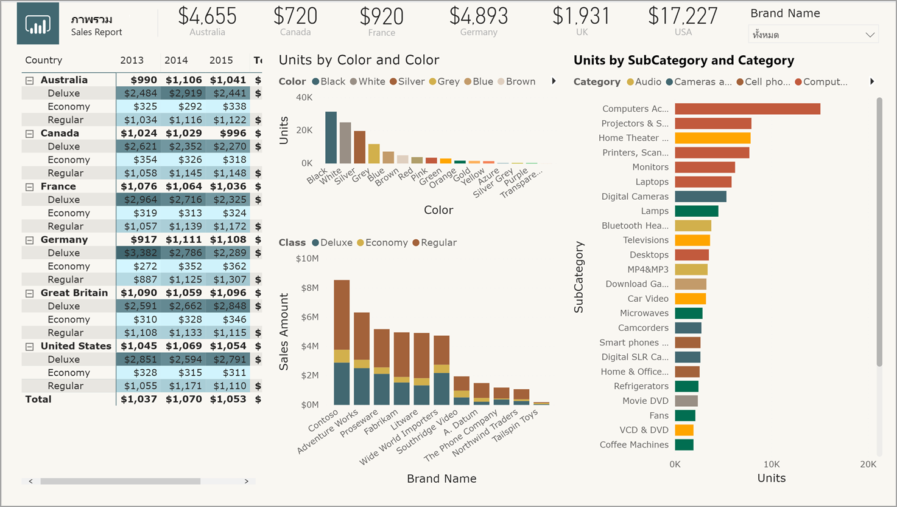
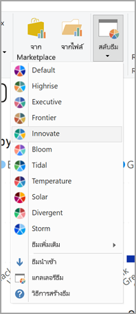
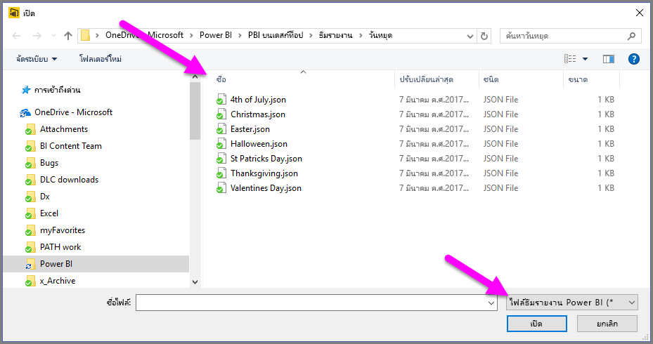

# <a name="use-report-themes-in-power-bi-desktop"></a>ใช้ธีมรายงานใน Power BI Desktop

ด้วย *ธีมรายงาน* ของ Power BI Desktop คุณสามารถเปลี่ยนแปลงการออกแบบกับรายงานทั้งหมดของคุณได้ เช่น การใช้สีสำหรับองค์กร การเปลี่ยนชุดไอคอน หรือการใช้การจัดรูปแบบภาพตามค่าเริ่มต้นใหม่ เมื่อคุณใช้ธีมรายงาน วิชวลทั้งหมดในรายงานของคุณจะใช้สีและการจัดรูปแบบจากธีมที่คุณเลือกเป็นค่าเริ่มต้น มีข้อยกเว้นบางอยู่บางประการ ซึ่งจะอธิบายภายหลังในบทความนี้



ธีมรายงานมีทั้งหมดสองประเภท คือ ธีมรายงานที่มีอยู่ภายในระบบ และไฟล์ธีมรายงานแบบกำหนดเอง

- ธีมรายงานที่มีอยู่ภายในระบบนั้น จะประกอบด้วยแบบสีที่กำหนดไว้ล่วงหน้า ซึ่งติดตั้งมากับ Power BI Desktop คุณเลือกธีมรายงานที่มีอยู่ภายในระบบได้โดยตรงจากเมนู Power BI Desktop

- ไฟล์ธีมรายงานแบบกำหนดเองเป็นธีมรายงานที่ถูกสร้างขึ้นในไฟล์ JSON ที่มีการกำหนดโครงสร้างพื้นฐานไว้แล้ว ในการใช้งานธีมรายงานแบบกำหนดเอง คุณสามารถนำเข้าไฟล์ JSON ลงใน Power BI Desktop และนำไปใช้กับรายงานของคุณ

  คุณยังสามารถปรับแต่งธีมรายงานที่มีอยู่ได้จากภายใน Power BI Desktop โดยใช้กล่องโต้ตอบ [**ปรับแต่งธีม**](#create-and-customize-a-theme-in-power-bi-desktop)

คุณสามารถปรับแต่งและกำหนดมาตรฐานองค์ประกอบเกือบทั้งหมดที่ปรากฏในส่วน**การจัดรูปแบบ** ของบานหน้าต่าง **การแสดงวิชวล** โดยผ่านการปรับแต่งโดยตรงใน Power BI Desktop หรือผ่านธีมรายงานไฟล์ JSON เป้าหมายคือเพื่อให้คุณสามารถควบคุมลักษณะและรูปแบบค่าเริ่มต้นของรายงานของคุณได้อย่างเต็มที่ ไปจนถึงระดับแยกย่อย

## <a name="how-report-themes-work"></a>ธีมรายงาน ทำงานอย่างไร

หากต้องการใช้ธีมรายงานกับรายงาน Power BI Desktop คุณสามารถเลือกจาก[ธีมรายงานที่มีอยู่แล้วภายใน](#built-in-report-themes) หรือคุณสามารถ[นำเข้าไฟล์ JSON ของธีมแบบกำหนดเอง](#import-custom-report-theme-files) หรือคุณสามารถ[ใช้กล่องโต้ตอบ**ปรับแต่งธีม**](#create-and-customize-a-theme-in-power-bi-desktop)

สำหรับข้อมูลโดยละเอียดเกี่ยวกับค่าเริ่มต้นที่สามารถปรับแต่งได ้โปรดดูที่หัวข้อ [รูปแบบ JSON ของธีมรายงาน](#report-theme-json-file-format) ด้านล่าง

### <a name="built-in-report-themes"></a>ธีมรายงานที่มีอยู่ภายในระบบ

เพื่อเลือกจากธีมรายงานที่มีอยู่ภายในระบบ:

1. เลือก **สลับธีม** จาก Ribbon **หน้าแรก**

   

2. เลือกหนึ่งธีมจากรายการธีมที่มีให้ จากเมนูดรอปดาวน์

   ในตอนนี้ธีมรายงานของคุณได้ถูกนำไปใช้กับรายงานแล้ว

ตารางต่อไปนี้แสดงธีมรายงานที่มีอยู่ภายในระบบ

| ธีมรายงานที่มีอยู่ภายในระบบ | ลำดับสีเริ่มต้น |
|------ |---------- |
| ค่าเริ่มต้น | |
| Highrise | |
| ผู้บริหาร | |
| พรมแดน| |
| สร้างสรรค์ | |
| ดอกไม้บาน | |
| คลื่น| |
| อุณหภูมิ | |
| พระอาทิตย์| |
| แตกต่าง | |
| พายุ | |
| คลาสสิก | |
| ซิตี้ปาร์ค | |
| ชั้นเรียน | |
| ปลอดภัยสำหรับผู้ที่ตาบอดสี | |
| ไฟฟ้า | |
| ความคมชัดสูง | |
| พระอาทิตย์ตก | |
| พลบค่ำ | |

## <a name="customize-report-themes"></a>ปรับแต่งธีมรายงาน

นับตั้งแต่การเปิดตัว Power BI Desktop ในเดือนธันวาคม 2019 ในตอนนี้มีวิธีการปรับแต่งธีมรายงานสองวิธี:

- [สร้างและปรับแต่งธีมใน Power BI Desktop](#create-and-customize-a-theme-in-power-bi-desktop)
- [สร้างและปรับแต่งไฟล์ JSON ของธีมรายงานแบบกำหนดเอง](#introduction-to-report-theme-json-files)

### <a name="create-and-customize-a-theme-in-power-bi-desktop"></a>สร้างและปรับแต่งธีมใน Power BI Desktop

ในการปรับแต่งธีมโดยตรงใน Power BI Desktop:

1. จาก Ribbon **หน้าแรก** เลือก **สลับธีม** > **ปรับแต่งธีมปัจจุบัน**

   กล่องโต้ตอบจะปรากฏขึ้น ซึ่งแสดงวิธีการกำหนดธีมรายงานที่นำไปใช้กับรายงานในปัจจุบัน

   

2. ถ้าคุณต้องการใช้ธีมที่มีอยู่และต้องการปรับเปลี่ยนบางอย่าง ให้เลือกธีม (หรือนำเข้า) แล้วเลือก **กำหนดธีมปัจจุบัน**

   

การตั้งค่าธีมที่สามารถกำหนดได้นั้น สามารถทำได้ในหมวดหมู่ต่างๆ ต่อไปนี้ ซึ่งจะแสดงในหน้าต่าง **กำหนดธีม**:

- **ชื่อและสี**: ชื่อธีมและการตั้งค่าสี ประกอบด้วย[สีของธีม](#how-report-theme-colors-stick-with-your-reports) สีแสดงความคิดเห็น สีที่แตกต่างกัน และ[สีโครงสร้าง (ขั้นสูง)](#setting-structural-colors)
- **ข้อความ**: การตั้งค่าข้อความประกอบด้วยกลุ่มแบบอักษร ขนาด และสี ซึ่งตั้งค่า [ค่าเริ่มต้นของระดับข้อความหลัก](#setting-formatted-text-defaults) สำหรับป้ายชื่อ ชื่อ การ์ดและ KPI และส่วนหัวของแท็บ
- **วิชวล**: การตั้งค่าวิชวลประกอบด้วย พื้นหลัง กรอบ ส่วนหัว และคำแนะนำเครื่องมือ
- **หน้า**: การตั้งค่าองค์ประกอบของหน้า ประกอบด้วย รูปพื้นหลัง และพื้นหลัง
- **บานหน้าต่างตัวกรอง**: การตั้งค่าบานหน้าต่างตัวกรอง ประกอบด้วย สีพื้นหลัง ความโปร่งแสง สีตัวอักษรและไอคอน ขนาด การ์ดตัวกรอง

หลังจากที่คุณทำการเปลี่ยนแปลงแล้ว เลือก **นำไปใช้และบันทึก** เพื่อบันทึกธีมของคุณ ในตอนนี้ สามารถใช้ธีมของคุณในรายงานปัจจุบันและรายงานส่งออกได้แล้ว

การปรับแต่งธีมปัจจุบันของคุณด้วยวิธีนี้สามารถทำให้การปรับแต่งธีมเป็นไปอย่างง่ายดายและรวดเร็ว อย่างไรก็ตาม คุณสามารถปรับแต่งรูปแบบที่ดีที่สุดให้ธีมได้ ซึ่งจำเป็นต้องปรับเปลี่ยน[ไฟล์ JSON](#report-theme-json-file-format) ของธีม

> [!TIP]
> คุณสามารถปรับแต่งตัวเลือกธีมรายงานที่พบบ่อยที่สุดโดยใช้ตัวควบคุมในกล่องโต้ตอบ **ปรับแต่งธีม** สำหรับการควบคุมเพิ่มเติม คุณสามารถเลือกที่จะส่งออกไฟล์ JSON ของธีม และทำการปรับปรุงและปรับแต่งด้วยตนเอง โดยการปรับเปลี่ยนการตั้งค่าในไฟล์นั้น คุณสามารถเปลี่ยนชื่อไฟล์ JSON ที่ได้รับการปรับแต่งแล้ว และนำเข้าไฟล์ในภายหลัง

### <a name="import-custom-report-theme-files"></a>นำเข้าไฟล์ธีมรายงานแบบกำหนดเอง

หากต้องการนำเข้าไฟล์ธีมรายงานแบบกำหนดเอง

1. เลือกปุ่ม**สลับธีม** จาก Ribbon **หน้าแรก** จากนั้นเลือก**นำเข้าธีม**จากเมนูบดรอปดาวน์

   

   หน้าต่างจะปรากฏขึ้นเพื่อให้คุณเรียกดูตำแหน่งที่ตั้งของไฟล์ธีม JSON

2. ในรูปต่อไปนี้ แสดงธีมวันหยุดจำนวนหนึ่งที่มี เราจะเลือกธีมวันหยุดสำหรับเดือนมีนาคม *St Patricks Day.json*

   

   เมื่อโหลดไฟล์ธีมสำเร็จแล้ว Power BI Desktop จะแสดงข้อความแจ้งให้ทราบ

   

## <a name="introduction-to-report-theme-json-files"></a>บทนำเบื้องต้นของไฟล์ JSON ของธีมรายงาน

 เมื่อคุณเปิดไฟล์ JSON พื้นฐานที่ได้กล่าวถึงในส่วนก่อนหน้า (St Patricks Day.json) จะปรากฏเป็นดังนี้:

 ```json
    {
        "name": "St Patrick's Day",
        "dataColors": ["#568410", "#3A6108", "#70A322", "#915203", "#D79A12", "#bb7711", "#114400", "#aacc66"],
        "background":"#FFFFFF",
        "foreground": "#3A6108",
        "tableAccent": "#568410"
    }
```

ไฟล์ JSON ธีมรายงานนี้มีบรรทัดดังต่อไปนี้:

- **ชื่อ**: ชื่อธีมรายงาน เขตข้อมูลนี้เป็นเขตข้อมูลที่จำเป็นเท่านั้น
- **dataColors**: รายการรหัสสีฐานสิบหกที่ใช้สำหรับข้อมูลในวิชวล Power BI Desktop รายการนี้สามารถมีจำนวนสีมากหรือน้อยเท่าใดก็ได้ ตามความต้องการของคุณ
- **background**, **firstLevelElements** และ **tableAccent** (เป็นต้น): ระดับชั้นสี ระดับชั้นสีช่วยให้คุณสามารถตั้งค่าสีโครงสร้างได้หลายสีในรายงานของคุณครั้งเดียว

คุณสามารถใช้ไฟล์ JSON นี้เป็นพื้นฐานในการสร้างไฟล์ธีมรายงานแบบกำหนดเองที่จะนำเข้าของคุณเองได้ ถ้าคุณต้องการปรับเฉพาะสีพื้นฐานของรายงานของคุณ ให้เปลี่ยนชื่อและรหัสฐานสิบหกในไฟล์

ในไฟล์ JSON ธีมรายงาน คุณกำหนดได้เฉพาะการจัดรูปแบบที่คุณต้องการเปลี่ยนแปลง รายการใดก็ตามที่คุณไม่ได้ระบุในไฟล์ JSON จะแปลงกลับไปยังการตั้งค่าเริ่มต้นของ Power BI Desktop

ประโยชน์ของการสร้างไฟล์ JSON มีหลายข้อ ตัวอย่างเช่น คุณสามารถระบุได้ว่า ให้ใช้ขนาดตัวอักษร 12 ในแผนภูมิทั้งหมด หรือให้ใช้ตระกูลแบบอักษรที่กำหนด ในวิชวลบางวิชวล หรือปิดใช้งานป้ายชื่อสำหรับแผนภูมิบางชนิด ในการใช้ไฟล์ JSON คุณสามารถสร้างไฟล์ธีมรายงานที่กำหนดมาตรฐานให้แผนภูมิ และรายงานของคุณ ซึ่งจะทำให้เป็นการง่ายที่จะให้รายงานองค์กรของคุณมีรูปแบบที่สอดคล้องกันทั้งหมด

สำหรับข้อมูลเพิ่มเติมเกี่ยวกับรูปแบบของไฟล์ JSON ดู [รูปแบบไฟล์ JSON ธีมรายงาน](#report-theme-json-file-format)

> [!NOTE]
> การแก้ไขธีมรายงาน JSON แบบกำหนดเองด้วยกล่องโต้ตอบ[**ปรับแต่งธีม**](#create-and-customize-a-theme-in-power-bi-desktop) มีความปลอดภัย  กล่องโต้ตอบจะไม่แก้ไขการตั้งค่าธีมที่ไม่สามารถควบคุมได้และจะอัปเดตการเปลี่ยนแปลงที่เกิดขึ้นกับธีมรายงานในสถานที่

## <a name="how-report-theme-colors-stick-with-your-reports"></a>สีจากธีมรายงานจะติดไปกับรายงานของคุณอย่างไร

เมื่อคุณเผยแพร่รายงานของคุณไปยัง บริการของ Power BI จะมีสีของธีมรายงานของคุณติดไปด้วย ส่วน **สีข้อมูล** ของแผง **รูปแบบ** จะสะท้อนให้เห็นธีมรายงานของคุณ

เมื่อต้องการดูสีที่พร้อมใช้งานในธีมรายงาน:

1. เลือกวิชวล

2. จากส่วน **รูปแบบ** ของบานหน้าต่าง**การแสดงวิชวล** เลือก **สีข้อมูล**

3. เลือกรายการดรอปดาวน์เพื่อดู **สีธีม** ข้อมูลของธีมรายงาน

   

ในตัวอย่างของเรา หลังจากที่ใช้โทนสีเขียว และสีน้ำตาลจากธีมรายงาน St. Patrick's Day แล้ว ให้เลือกดูสีธีม เห็นสีเขียวทั้งหมดนั่นไหม? นั่นเป็นเพราะว่าสีเหล่านั้นเป็นส่วนหนึ่งของธีมรายงานที่เราได้นำเข้าและนำไปใช้งาน

นอกจากนี้ สีในจานสีจะยังสอดคล้องกับธีมปัจจุบัน ตัวอย่างเช่น สมมติว่าคุณเลือกสีที่สามของแถวบนสุดสำหรับจุดข้อมูล ในภายหลัง ถ้าคุณเปลี่ยนไปใช้ธีมอื่น สีของจุดข้อมูลนั้นจะอัปเดตโดยอัตโนมัติไปเป็นสีที่สามของแถวบนสุดในธีมใหม่ เช่นเดียวกับที่คุณเห็นเมื่อมีการเปลี่ยนธีมใน Microsoft Office

### <a name="situations-when-report-theme-colors-wont-stick-to-your-reports"></a>สถานการณ์เมื่อสีจากธีมรายงานไม่ติดไปกับรายงานของคุณ

สมมติว่าคุณเลือกใช้ชุดสีแบบกำหนดเอง (หรือสีเฉพาะ) ไปยังจุดข้อมูลเฉพาะในวิชวล โดยใช้ตัวเลือก **สีที่กำหนดเอง** ในเครื่องมือเลือกสี เมื่อคุณใช้ธีมรายงาน จะ*ไม่*เกิดการแทนที่สีของจุดข้อมูลที่กำหนดเอง

หรือ สมมติว่าคุณต้องการตั้งค่าสีของสีจุดข้อมูลด้วยตนเองโดยใช้ส่วน **สีธีม** เมื่อคุณใช้ธีมรายงานใหม่ สีเหล่านั้นจะ*ไม่* ถูกอัปเดต ในการเรียกใช้ค่าเริ่มต้นของสีตามเดิม เพื่อให้สามารถอัปเดตได้เมื่อคุณใช้ธีมรายงานใหม่ คุณสามารถเลือก **กลับไปใช้ค่าเริ่มต้น** หรือเลือกสีจากชุด **สีธีม** ในเครื่องมือเลือกสี


วิชวล Power BI หลายรายการจะไม่มีผลใช้งานกับธีมรายงาน

## <a name="custom-report-theme-files-you-can-use-right-now"></a>ไฟล์ธีมรายงานแบบกำหนดเองที่คุณสามารถใช้ในขณะนี้

ต้องการเริ่มต้นใช้ธีมรายงานหรือไม่ เลือกดูธีมรายงานแบบกำหนดเองใน [แกลเลอรีชุดรูปแบบ](https://community.powerbi.com/t5/Themes-Gallery/bd-p/ThemesGallery) หรือลองใช้ไฟล์ JSON ของธีมรายงานแบบกำหนดเองที่พร้อมใช้งานต่อไปนี้ ซึ่งคุณสามารถดาวน์โหลดและนำเข้าลงในรายงาน Power BI Desktop ของคุณ:

- [ธีมรูปคลื่น](https://community.powerbi.com/t5/Themes-Gallery/Waveform/m-p/140536) ธีมรายงานนี้ได้รับการแนะนำอยู่ใน [บล็อกโพสต์](https://powerbi.microsoft.com/blog/power-bi-desktop-march-feature-summary/) ที่ประกาศการเปิดตัวครั้งแรกของธีมรายงาน [ดาวน์โหลด Waveform.json](https://go.microsoft.com/fwlink/?linkid=843924)

  

- [ธีมที่เป็นมิตรกับคนตาบอดสี](https://community.powerbi.com/t5/Themes-Gallery/Color-Blind-Friendly/m-p/140597)
ธีมรายงานนี้ง่ายต่อการอ่านสำหรับผู้ที่มีความบกพร่องทางสายตา [ดาวน์โหลด ColorblindSafe-Longer.json](https://go.microsoft.com/fwlink/?linkid=843923)

  .

- ธีม Power View ที่มี Apothecary.json [ดาวน์โหลดธีม Power View ในไฟล์ Zip](https://go.microsoft.com/fwlink/?linkid=843925)

  

- ธีมวันวาเลนไทน์

  

  นี่คือรหัสสำหรับไฟล์ JSON วันวาเลนไทน์:

   ```json
       {
           "name": "Valentine's Day",
           "dataColors": ["#990011", "#cc1144", "#ee7799", "#eebbcc", "#cc4477", "#cc5555", "#882222", "#A30E33"],
           "background":"#FFFFFF",
           "foreground": "#ee7799",
           "tableAccent": "#990011"
       }
   ```

นี่เป็นธีมรายงานเพื่มเติมที่คุณสามารถใช้เป็นจุดเริ่มต้น:

- [Sunflower-twilight](https://community.powerbi.com/t5/Themes-Gallery/Sunflower-Twilight/m-p/140749)
- [Plum](https://community.powerbi.com/t5/Themes-Gallery/Plum/m-p/140711)
- [Autumn](https://community.powerbi.com/t5/Themes-Gallery/Autumn/m-p/140746)
- [High contrast](https://community.powerbi.com/t5/Themes-Gallery/Color-Blind-Friendly/m-p/140597)

ธีมรายงาน สามารถทำให้รายงาน Power BI Desktop ของคุณ สะท้อนสีสันในแบบของคุณ องค์กรของคุณ หรือแม้แต่ฤดูกาล หรือเทศกาลได้

## <a name="export-report-themes-preview"></a>ส่งออกธีมรายงาน (ตัวอย่าง)

นับตั้งแต่การเปิดตัว Power BI Desktop ในเดือนธันวาคม 2019 ตอนนี้คุณมีตัวเลือกในการส่งออกธีมรายงานที่ใช้ในปัจจุบันได้โดยตรงจาก Power BI Desktop ไปยังไฟล์ JSON หลังจากที่คุณส่งออกธีมรายงานแล้ว คุณสามารถนำมาใช้ใหม่ในรายงานอื่นได้ ตัวเลือกนี้ช่วยให้คุณสามารถส่งออกไฟล์ JSON สำหรับธีมส่วนใหญ่ที่มีอยู่แล้วภายในระบบได้ ซึ่งจะยกเว้นเพียงธีมพื้นฐาน ธีมคลาสสิกและธีมค่าเริ่มต้น ซึ่งธีมอื่นๆ จะสร้างขึ้นจากตีมเหล่านี้เมื่อมีการนำเข้า

ในการส่งออกธีมที่ใช้ในปัจจุบันจาก Power BI Desktop:

1. เลือกตัวเลือก **ไฟล์** >  **และตัวเลือก** > **การตั้งค่า**

2. ในส่วน **การแสดงตัวอย่าง** เลือก **ปรับแต่งธีมปัจจุบัน** จากนั้นเลือก **ตกลง**

   คุณอาจได้รับพร้อมท์ให้รีสตาร์ท Power BI Desktop เพื่อเปิดใช้งานฟีเจอร์ตัวอย่าง หลังจากที่คุณรีสตาร์ท คุณสามารถเริ่มต้นส่งออกธีมที่ใช้อยู่ในขณะนั้นได้

3. จาก Ribbon **หน้าแรก** เลือก **สลับธีม** > **ส่งออกธีมปัจจุบัน**

4. จากกล่องโต้ตอบ **บันทึกเป็น** ให้เรียกดูไดเรกทอรีที่จะบันทึกไฟล์ JSON จากนั้นเลือก **บันทึก**

## <a name="report-theme-json-file-format"></a>รูปแบบไฟล์ธีมรายงาน JSON

ในขั้นพื้นฐานที่สุด ธีมไฟล์ JSON มีบรรทัดที่จำเป็นต้องระบุเพียงหนึ่งรายการเท่านั้นคือ: **ชื่อ**

```json
{
    "name": "Custom Theme"
}
```

นอกเหนือจาก**ชื่อ** ข้อมูลอื่น ๆ นั้นจะระบุหรือไม่ก็ได้ ซึ่งหมายความว่าคุณสามารถเพิ่มคุณสมบัติเฉพาะที่คุณต้องการจัดรูปแบบสำหรับไฟล์ธีมได้อย่างอิสระ และสามารถใช้ค่าเริ่มต้นของ Power BI สำหรับส่วนที่อื่นๆ ที่เหลือได้

### <a name="setting-theme-colors"></a>การตั้งค่าสีธีม

ที่ด้านล่างของ **ชื่อ** คุณสามารถเพิ่มคุณสมบัติสีที่เกี่ยวข้องกับข้อมูลพื้นฐานได้

- **dataColors**: รายการรหัสสีฐานสิบหกที่ใช้กับรูปร่างสีที่แสดงข้อมูลในวิชวล Power BI Desktop รายการนี้สามารถมีจำนวนสีมากหรือน้อยเท่าใดก็ได้ ตามความต้องการของคุณ เมื่อใช้สีทุกสีจากรายการนี้แล้ว หากการแสดงผลด้วยภาพยังต้องใช้สีเพิ่มอีก ค่าสีจะเปลี่ยนกลับไปใช้ชุดสีตามค่าเริ่มต้นของ Power BI
- **ดี** **ปานกลาง** **ไม่ดี**: คุณสมบัติเหล่านี้เหล่านี้จะกำหนดสีสำหรับสถานะที่ใช้ในแผนภูมิแบบน้ำตกและวิชวล KPI
- **สูงสุด** **ปานกลาง** **ต่ำสุด** **null**: สีเหล่านี้จะกำหนดการไล่ระดับสีต่างๆ ในกล่องโต้ตอบการจัดรูปแบบตามเงื่อนไข

ธีมพื้นฐานที่กำหนดสีต่างๆ เหล่านี้อาจปรากฏในลักษณะดังต่อไปนี้:

```json
{
    "name": "Custom Theme",
    "dataColors": [
        "#118DFF",
        "#12239E",
        "#E66C37",
        "#6B007B",
        "#E044A7",
        "#744EC2",
        "#D9B300",
        "#D64550",
        "#197278",
        "#1AAB40"
    ],
    "good": "#1AAB40",
    "neutral": "#D9B300",
    "bad": "#D64554",
    "maximum": "#118DFF",
    "center": "#D9B300",
    "minimum": "#DEEFFF",
    "null": "#FF7F48"
}
```

### <a name="setting-structural-colors"></a>การตั้งค่าสีโครงสร้าง

ถัดไป คุณสามารถเพิ่มระดับชั้นสีต่างๆ เช่น **background** และ **firstLevelElements** ระดับชั้นสีเหล่านี้จะตั้งค่าสีโครงสร้างสำหรับองค์ประกอบในรายงานเช่น เส้นตารางของแกน สีไฮไลท์ และสีพื้นหลังสำหรับองค์ประกอบวิชวล

ตารางต่อไปนี้แสดงระดับชั้นสีหกชั้นที่คุณสามารถจัดรูปแบบได้  ชื่อ**ระดับชั้นสี** ที่สอดคล้องกับชื่อในส่วนย่อย "ขั้นสูง" ของหัวข้อ "ชื่อและสี" ในกล่องโต้ตอบ [**ปรับแต่งธีม**](#create-and-customize-a-theme-in-power-bi-desktop)

|ระดับชั้นสี  |รายการที่จัดรูปแบบ  |
|---------|---------|
| **firstLevelElements** <br> **foreground**    (ไม่สนับสนุน) | สีพื้นหลังของป้ายกำกับ (เมื่ออยู่ภายนอกจุดข้อมูล) <br> สีเส้นแน้วโน้ม <br>  สีค่าเริ่มต้นของกล่องข้อความ <br> ค่าตารางและเมทริกซ์ รวมถึงสีแบบอักษรทั้งหมดสำหรับสีแกนแถบข้อมูล <br> ป้ายชื่อข้อมูลของการ์ด <br> สีค่าคำบรรยายตัววัด <br> สีเป้าหมาย KPI <br>  สีข้อความ KPI <br> สีรายการสำหรับตัวแบ่งส่วนข้อมูล (เมื่ออยู่ในโหมดโฟกัส)  <br> สีแบบอักษรของรายการแบบหล่นลงสำหรับตัวแบ่งส่วนข้อมูล <br> สีแบบอักษรในการป้อนค่าตัวเลขสำหรับตัวแบ่งส่วนข้อมูล <br> สีแบบอักษรที่ส่วนหัวสำหรับตัวแบ่งส่วนข้อมูล <br> สีเส้นอัตราส่วนสำหรับแผนภูมิกระจาย <br> สีเส้นการคาดการณ์สำหรับแผนภูมิเส้น <br> สีเส้นตัวนำแผนที่ <br> สีบานหน้าต่างตัวกรองและข้อความบนการ์ด|
| **secondLevelElements** <br> **foregroundNeutralSecondary** (ไม่สนับสนุน) | [ระดับชั้นของข้อความรอง](#setting-formatted-text-defaults) "สีอ่อน" <br> สีป้ายกำกับ  <br> สีป้ายกำกับคำอธิบายแผนภูมิ <br> สีป้ายกำกับแกน <br> สีแบบอักษรของส่วนหัวตารางและเมทริกซ์ <br> สีเส้นเป้าหมายตัววัดและตัวนำเป้าหมาย <br>  สีแกนแนวโน้ม KPI <br> สีแถบเลื่อนสำหรับตัวแบ่งส่วนข้อมูล <br> สีแบบอักษรรายการสำหรับตัวแบ่งส่วนข้อมูล <br> สีเส้นกรอบสำหรับตัวแบ่งส่วนข้อมูล <br> สีโฮเวอร์สำหรับแผนภูมิเส้น <br> สีชื่อของการ์ดแบบหลายแถว <br> สีสโตรกของแผนภูมิริบบอน <br> สีเส้นขอบของแผนที่แบบแสดงรูปร่าง <br> สีแบบอักษรสำหรับข้อความปุ่ม <br> สีเส้นสำหรับไอคอนปุ่ม <br> สีเส้นกรอบปุ่ม |
| **thirdLevelElements** <br >**backgroundLight** (ไม่สนับสนุน) | สีเส้นตารางแกน <br> สีเส้นตารางและเมทริกซ์ <br> สีพื้นหลังส่วนหัวของตัวแบ่งส่วนข้อมูล (เมื่ออยู่ในโหมดโฟกัส)  <br> สีเส้นกรอบของการ์ดแบบหลายแถว  <br> สีเติมรูปร่าง <br> สีพื้นหลังของเส้นโค้งตัววัด <br> สีพื้นหลังการ์ดตัวกรองที่ใช้ <br> เมื่อพื้นหลัง = FFFFFF: <br> ปิดใช้งานการเติมสีปุ่มแล้ว <br> ปิดใช้งานการเติมสีที่เส้นขอบของปุ่มแล้ว <br> |
| **fourthLevelElements** <br> **foregroundNeutralTertiary** (ไม่สนับสนุน) | สีคำอธิบายแผนภูมิแบบจาง <br> สีป้ายกำกับประเภทการ์ด <br> สีป้ายกำกับประเภทการ์ดแบบหลายแถว <br> สีแถบการ์ดแบบหลายแถว <br> สีสโตรกของอัตราส่วนการแปลงแผนภูมิกรวย <br> ปิดใช้งานสีแบบอักษรสำหรับข้อความปุ่มแล้ว <br> ปิดใช้งานสีเส้นสำหรับไอคอนปุ่มแล้ว <br> |
| **พื้นหลัง** | สีพื้นหลังของป้ายกำกับ (เมื่ออยู่ภายในจุดข้อมูล) <br> สีพื้นหลังของรายการแบบหล่นลงสำหรับตัวแบ่งส่วนข้อมูล  <br> สีสโตรกของแผนภูมิโดนัท <br> สีสโตรกสำหรับแผนที่ต้นไม้ <br> สีพื้นหลังสำหรับแผนภูมิผสม <br> สีเติมปุ่ม <br> สีบานหน้าต่างตัวกรองและพื้นหลังของการ์ดตัวกรองทีใช้งานได้ |
| **secondaryBackground** <br> **backgroundNeutral** (ไม่สนับสนุน) | สีเส้นกรอบของเส้นตารางและเมทริกซ์ <br> สีตามค่าเริ่มต้นของแผนทีแบบแสดง่รูปร่าง <br> สีเติมแถบแผนภูมิริบบอน (เมื่อปิดตัวเลือกชุดข้อมูลตรงกัน) <br> เมื่อพื้นหลัง != FFFFFF: <br> ปิดใช้งานการเติมสีปุ่มแล้ว <br> ปิดใช้งานการเติมสีที่เส้นขอบของปุ่มแล้ว <br> |
| **tableAccent** | แทนที่สีกรอบเส้นตารางตารางและเมทริกซ์เมื่อแสดง |

ต่อไปนี้คือตัวอย่างธีมที่มีการตั้งค่าระดับชั้นสี:

```json
{
    "name": "Custom Theme",
    "firstLevelElements": "#252423",
    "secondLevelElements": "#605E5C",
    "thirdLevelElements": "#F3F2F1",
    "fourthLevelElements": "#B3B0AD",
    "background": "#FFFFFF",
    "secondaryBackground": "#C8C6C4",
    "tableAccent": "#118DFF"
}
```

> [!TIP]
> ถ้าคุณกำลังเขียน "ธีมมืด" หรือธีมที่มีสีสันอื่น ๆ ที่ต่างจาก**firstLevelElements** “สีดำ” ทั่วไปบนรูปแบบ**พื้นหลัง** “สีขาว” ให้ตรวจสอบให้แน่ใจว่าได้ตั้งค่าสำหรับสีโครงสร้างอื่น ๆ และ [ระดับชั้นสีของข้อความหลัก](#setting-formatted-text-defaults)  การดำเนินการนี้จะทำให้แน่ใจว่า (ตัวอย่าง) ป้ายชื่อข้อมูลบนแผนภูมิที่มีพื้นหลังป้ายชื่อจะตรงกับลักษณะที่คาดหวังไว้ และสามารถอ่านได้ตลอดจนให้แน่ใจว่าเส้นตารางแกนสามารถมองเห็นได้

### <a name="setting-formatted-text-defaults"></a>การตั้งค่าเริ่มต้นของข้อความที่จัดรูปแบบ

ถัดไป คุณสามารถเพิ่มระดับชั้นข้อความไปยังไฟล์ JSON ของคุณได้ ระดับชั้นข้อความคล้ายคลึงกับระดับชั้นสี แต่ระดับชั้นข้อความนั้นออกแบบขึ้นมาเพื่อช่วยให้คุณอัปเดตขนาดตัวอักษร สี และตระกูลกลุ่มข้อความตัวอักษรในรายงานทั้งหมดของคุณ

ระดับชั้นข้อความมี 12 ระดับ แต่คุณจำเป็นต้องตั้งค่าเพียงสี่ระดับชั้นเท่านั้น ซึ่งเรียกว่า *ระดับชั้นหลัก* เพื่อเปลี่ยนการจัดรูปแบบข้อความทั้งหมดในรายงานของคุณ  ระดับชั้นหลัก 4 ระดับเหล่านี้สามารถตั้งค่าได้ในกล่องโต้ตอบ [**ปรับแต่งธีม**](#create-and-customize-a-theme-in-power-bi-desktop) ภายใต้หัวข้อ "ข้อความ": "ทั่วไป" สอดคล้องกับ **ป้ายชื่อ** "ชื่อเรื่อง" กับ **ชื่อเรื่อง** "การ์ดและ KPI" กับ **คำบรรยายภาพ**และ "ส่วนหัวของแท็บ" กับ **ส่วนหัว**

ระดับชั้นข้อความอื่น ๆ นั้น ถือเป็น *ระดับชั้นรอง* ซึ่งจะมีผลหรือทำงานตามคุณสมบัติของตนเองต่อจากระดับชั้นหลักที่เกี่ยวข้องกันโดยอัตโนมัติ บ่อยครั้งที่ระดับชั้นรองจะเลือกสีข้อความในเฉดที่สว่างกว่า หรือขนาดข้อความที่มีเปอร์เซ็นต์ใหญ่กว่าหรือเล็กกว่าเมื่อเทียบกับระดับชั้นหลัก

เราจะใช้ระดับชั้นของ**ป้ายกำกับ**เป็นตัวอย่าง การจัดรูปแบบเริ่มต้นสำหรับระดับชั้น **ป้ายกำกับ** คือ Segoe UI #252423 (สีเทาเข้ม) และมีขนาด 12 point ระดับชั้นนี้ใช้เพื่อจัดรูปแบบค่าในตารางและเมทริกซ์ โดยทั่วไปแล้ว ค่ารวมทั้งหมดในตารางหรือเมทริกซ์จะมีการจัดรูปแบบที่คล้ายคลึงกัน แต่จะแสดงเป็นตัวหนาด้วยระดับชั้น **ป้ายกำกับแบบตัวหนา** เพื่อความชัดเจนมากขึ้น  อย่างไรก็ตาม คุณไม่จำเป็นต้องระบุระดับชั้นที่อยู่ในธีม JSON เพราะ Power BI สามารถทำได้โดยอัตโนมัติ หลังจากนั้น ถ้าคุณตัดสินใจที่จะระบุป้ายกำกับที่มีขนาดตัวอักษร 14 ในธีมของคุณ คุณไม่จำเป็นต้องอัปเดตระดับชั้น **ป้ายกำกับแบบตัวหนา** เนื่องจากระบบจะใช้การจัดรูปแบบข้อความจากระดับชั้น **ป้ายกำกับ**

ตารางต่อไปนี้แสดงข้อมูลต่อไปนี้:

- ระดับชั้นหลักแต่ละชั้นของข้อความทั้งสี่ระดับ รายการที่จัดรูปแบบ และการตั้งค่าเริ่มต้นของระดับชั้นนั้น
- ระดับชั้นรองแต่ละชั้น รายการที่จัดรูปแบบ และการตั้งค่าเริ่มต้นของระดับชั้นนั้น ซึ่งไม่ซ้ำกันเมื่อเทียบกับระดับชั้นหลัก

|ระดับชั้นหลัก  |ระดับชั้นรอง  |ชื่อระดับชั้น JSON  | การตั้งค่าเริ่มต้น  |วัตถุสำหรับการแสดงผลด้วยภาพที่เกี่ยวข้อง  |
|---------|---------|---------|---------|---------|
| คำบรรยาย | N/A | คำบรรยาย | DIN <br> #252423 <br> 45pt |ป้ายชื่อข้อมูลของการ์ด <br> ตัวบ่งชี้ KPI|
|ส่วนหัว|N/A|ส่วนหัว|Segoe UI Semibold <br> #252423 <br> 12pt |ส่วนหัวเรื่องของตัวกำหนดอิทธิพลหลัก |
| ชื่อเรื่อง || ชื่อเรื่อง |DIN <br> #252423 <br> 12pt |ชื่อแกนประเภท <br> ชื่อแกนค่า <br> ชื่อของการ์ดแบบหลายแถว * <br> ส่วนหัวของตัวแบ่งส่วนข้อมูล|
|-| ชื่อเรื่องขนาดใหญ่ | ชื่อเรื่องขนาดใหญ่ |14pt |ชื่อการแสดงผลด้วยภาพ |
|ป้ายกำกับ ||ป้ายกำกับ |Segoe UI<br>#252423<br>10pt |ส่วนหัวของคอลัมน์ตารางและเมทริกซ์ <br> ส่วนหัวของแถวเมทริกซ์<br>เส้นตารางและเมทริกซ์<br>ค่าตารางและเมทริกซ์ |
|-|หนาครึ่งหนึ่ง |semiboldLabel| Segoe UI Semibold | ข้อความโปรไฟล์ตัวกำหนดอิทธิพลหลัก
|-|ขนาดใหญ่ |largeLabel |12pt | ป้ายชื่อข้อมูลของการ์ดแบบหลายแถว |
|-|ขนาดเล็ก |smallLabel |9pt |ป้ายกำกับเส้นอ้างอิง * <br>ป้ายกำกับช่วงวันที่สำหรับตัวแบ่งส่วนข้อมูล<br> ลักษณะแบบอักษรในการป้อนค่าตัวเลขสำหรับตัวแบ่งส่วนข้อมูล<br>กล่องค้นหาสำหรับตัวแบ่งส่วนข้อมูล<br>ข้อความตัวกำหนดอิทธิพลหลัก|
|-|สีอ่อน |ป้ายกำกับสีอ่อน |#605E5C |ข้อความคำอธิบายแผนภูมิ<br>ข้อความบนปุ่ม<br>ป้ายกำกับแกนประเภท<br>ป้ายชื่อข้อมูลของแผนภูมิกรวย<br>ป้ายกำกับอัตราส่วนการแปลงแผนภูมิกรวย<br>เป้าหมายของตัววัด<br>ป้ายกำกับประเภทสำหรับแผนภูมิกระจาย<br>รายการตัวแบ่งส่วนข้อมูล|
|-|ตัวหนา |ป้ายกำกับแบบตัวหนา |Segoe UI Bold |ผลรวมย่อยของเมทริกซ์<br>ผลรวมทั้งหมดของเมทริกซ์<br>ผลรวมตาราง |
|-|ขนาดใหญ่และสีอ่อน |largeLightLabel |#605E5C<br>12pt |ป้ายกำกับประเภทการ์ด<br>ป้ายกำกับตัววัด<br>ป้ายกำกับประเภทการ์ดแบบหลายแถว |
|-|ขนาดใหญ่และสีอ่อน |smallLightLabel |#605E5C<br>9pt |ป้ายชื่อข้อมูล<br>ป้ายกำกับแกนค่า|

*\* รายการที่ติดดาวยังมีสีที่ยึดตามสีข้อมูลแรกของธีมรายงาน*

> [!TIP]
> ชุดรูปแบบ*สีอ่อน* ของระดับชั้นข้อความจะใช้สีอ่อนจาก[สีโครงสร้าง](#setting-structural-colors) ที่กำหนดไว้ข้างต้น  ถ้าคุณกำลังเขียน "ธีมมืด" ให้แน่ใจว่าได้ตั้งค่าสี "firstLevelElements" (ตรงกับสีข้อความหลัก), "secondLevelElements" (ตรงกับสี "สีอ่อน" ที่คาดไว้สำหรับข้อความ) และ "พื้นหลัง" (ที่มีความเปรียบต่างที่เพียงพอกับทั้งสีองค์ประกอบระดับแรกและสีองค์ประกอบระดับที่สอง)

ต่อไปนี้คือตัวอย่างธีมซึ่งตั้งค่าระดับชั้นข้อความหลักเท่านั้น:

```json
{
    "name": "Custom Theme",
    "textClasses": {
        "callout": {
            "fontSize": 45,
            "fontFace": "DIN",
            "color": "#252423"
        },
        "title": {
            "fontSize": 12,
            "fontFace": "DIN",
            "color": "#252423"
        },
        "header": {
            "fontSize": 12,
            "fontFace": "Segoe UI Semibold",
            "color": "#252423"
        },
        "label": {
            "fontSize": 10,
            "fontFace": "Segoe UI",
            "color": "#252423"
        }
    }
}
```

เนื่องจากระดับชั้นรองได้รับการส่งต่อมาจากระดับชั้นหลัก คุณไม่จำเป็นต้องตั้งค่าในไฟล์ธีมของคุณ อย่างไรก็ตาม หากคุณไม่ชอบกฎการส่งต่อระดับชั้น (ตัวอย่างเช่น หากคุณไม่ต้องการให้ผลรวมของคุณนั้นมีรูปแบบค่าในตารางเป็นตัวหนา) คุณสามารถจัดรูปแบบเฉพาะระดับชั้นรองในไฟล์ธีมได้ เช่นเดียวกับที่คุณจัดรูปแบบระดับชั้นหลัก

### <a name="setting-visual-property-defaults-visualstyles"></a>การตั้งค่าเริ่มต้นของคุณสมบัติวิชวล (`visualStyles`)

ขั้นสุดท้าย หากต้องการสร้างไฟล์ JSON รูปแบบขยาย ที่มีรายละเอียดเพิ่มขึ้น และมีการควบคุมการจัดรูปแบบการแสดงวิชวลทั้งหมดที่ละเอียดแยกย่อยมากขึ้นในรายงาน คุณสามารถเพิ่มส่วน **visualStyles** ที่ไฟล์ JSON เพื่อจัดรูปแบบข้อมูลจำเพาะได้ ต่อไปนี้เป็นตัวอย่างแม่แบบของส่วน **visualStyles**:

```json
    "visualStyles": {
        "<visualName>": {
            "<styleName>": {
                "<cardName>": [{
                    "<propertyName>": <propertyValue>
                }]
            }
        }
    }
```

สำหรับส่วน **visualName** และ **cardName** ให้ใช้การแสดงผลด้วยภาพและชื่อการ์ดเฉพาะ ในตอนนี้ **styleName** จะเป็นเครื่องหมายดอกจัน (*) เสมอ แต่ในอนาคต คุณจะสามารถสร้างลักษณะที่แตกต่างกันสำหรับวิชวลของคุณ และตั้งชื่อให้ลักษณะนั้น ๆ ได้ (คล้ายกับคุณลักษณะของลักษณะตารางและเมทริกซ์) **propertyName** คือชื่อของตัวเลือกการจัดรูปแบบเฉพาะ และ**propertyValue** คือค่าสำหรับตัวเลือกการจัดรูปแบบ

สำหรับ **visualName** และ **cardName** คุณสามารถใช้เครื่องหมายดอกจันหนึ่งอันในเครื่องหมายคำพูด หากคุณต้องการใช้การตั้งค่านั้นกับวิชวลหรือการ์ดทั้งหมดที่มีคุณสมบัติ หากคุณใช้เครื่องหมายดอกจันสำหรับทั้งชื่อวิชวลและชื่อการ์ด คุณจะใช้การตั้งค่าทั่วโลกในรายงานของคุณได้อย่างมีประสิทธิภาพ เช่น ขนาดตัวอักษร หรือตระกูลแบบอักษรเฉพาะสำหรับข้อความทั้งหมดในวิชวลทุกรายการ

ต่อไปนี้เป็นตัวอย่างการตั้งค่าคุณสมบัติบางประการผ่านรูปแบบวิชวล:

```json
{
   "name":"Custom Theme",
   "visualStyles":{
      "*": {
         "*": {
            "*": [{
                "wordWrap": true
            }],
            "categoryAxis": [{
                "gridlineStyle": "dotted"
            }],
            "filterCard": [
              {
                "$id": "Applied",
                "foregroundColor": {"solid": {"color": "#252423" } }
              },
              {
                "$id":"Available",
                "border": true
              }
            ]
         }
      },
      "scatterChart": {
         "*": {
            "bubbles": [{
                  "bubbleSize": -10
            }]
         }
      }
   }
}
```

ในตัวอย่างนี้มีการตั้งค่าต่อไปนี้:

- เปิดใช้งานการตัดคำทุกส่วน
- ตั้งค่าลักษณะเส้นตารางเป็นจุดสำหรับภาพทั้งหมดที่มีแกนประเภท
- ตั้งค่าการจัดรูปแบบบางอย่างสำหรับการ์ดตัวกรองที่มีอยู่และที่ใช้งาน (โปรดทราบว่ารูปแบบใช้ "$id" ในการตั้งค่ารุ่นการ์ดตัวกรองแบบอื่น ๆ)
- ตั้งค่าขนาดฟองสำหรับแผนภูมิกระจายเป็น -10

> [!NOTE]
> คุณเพียงต้องระบุองค์ประกอบการจัดรูปแบบที่คุณต้องการแก้ไขเท่านั้น องค์ประกอบการจัดรูปแบบใดๆ ที่ไม่ได้ระบุอยู่ในไฟล์ JSON จะกลับไปใช้ค่าและการตั้งค่าเริ่มต้น

### <a name="visualstyles-definition-list"></a>`visualStyles`รายการคำจำกัดความ

ตารางในส่วนนี้กำหนดชื่อวิชวล (**visualName**), ชื่อการ์ด (**cardName**), ชื่อคุณสมบัติ (**propertyName**) และค่าจาระไนที่จำเป็นต่อการสร้างไฟล์ JSON ของคุณ

| ค่า VisualName |
| --- |
| areaChart |
| barChart |
| basicShape |
| card |
| clusteredBarChart |
| clusteredColumnChart |
| columnChart |
| comboChart |
| donutChart |
| filledMap |
| funnel |
| gauge |
| hundredPercentStackedBarChart |
| hundredPercentStackedColumnChart |
| image |
| kpi |
| lineChart |
| lineClusteredColumnComboChart |
| lineStackedColumnComboChart |
| map |
| multiRowCard |
| pieChart |
| PivotTable |
| ribbonChart |
| scatterChart |
| shapeMap |
| slicer |
| stackedAreaChart |
| tableEx |
| treemap |
| waterfallChart |

ตารางต่อไปนี้กำหนดค่า **cardName** ค่าแรกในแต่ละเซลล์เป็นคำที่ใช้ไฟล์ JSON ค่าที่สองคือชื่อของการ์ดตามที่ปรากฏในส่วนติดต่อผู้ใช้ของ Power BI Desktop

| ค่า cardName |
| --- |
| แกน: แกนวัด |
| breakdown: การแบ่งย่อย |
| bubbles: แผนภูมิแบบฟอง |
| calloutValue: ค่าคำบรรยายภาพ |
| card: การ์ด |
| cardTitle: ชื่อการ์ด |
| categoryAxis: แกน X |
| categoryLabels: ป้ายชื่อประเภท |
| columnFormatting: การจัดรูปแบบเขตข้อมูล |
| columnHeaders: ส่วนหัวของคอลัมน์ |
| dataLabels: ป้ายชื่อข้อมูล |
| fill: เติม |
| fillPoint: จุดกรอกข้อมูล |
| forecast: พยากรณ์ |
| general: ทั่วไป |
| goals: เป้าหมาย |
| grid: เส้นตาราง |
| header: ส่วนหัว |
| imageScaling: การปรับมาตราส่วน |
| indicator: ตัวบ่งชี้ |
| items: รายการ |
| labels: ป้ายชื่อข้อมูล |
| legend: คำอธิบายแผนภูมิ |
| lineStyles: รูปร่าง |
| mapControls: ตัวควบคุมแผนที่ |
| mapStyles: ลักษณะการแมป |
| numericInputStyle: ข้อมูลป้อนเข้าแบบตัวเลข |
| percentBarLabel: ป้ายอัตราการแปลง |
| plotArea: พื้นที่การลงจุด |
| plotAreaShading: แรเงาสมมาตร |
| ratioLine: เส้นอัตราส่วน |
| referenceLine: เส้นคงที่ |
| ribbonChart ริบบิ้น |
| rotation: การหมุน |
| rowHeaders: ส่วนหัวของแถว |
| selection: ตัวควบคุมการเลือก |
| sentimentColors: สีแสดงความคิดเห็น |
| shape: รูปร่าง |
| slider: แถบเลื่อน |
| status: การเข้ารหัสสี |
| subTotals: ผลรวมย่อย |
| target: เป้าหมาย |
| total: ผลรวมทั้งหมด |
| trend: เส้นแนวโน้ม |
| trendline: แกนแนวโน้ม |
| valueAxis: แกน Y |
| values: ค่า |
| wordWrap: ตัดคำ |
| xAxisReferenceLine: เส้นคงที่แกน X |
| y1AxisReferenceLine: เส้นคงที่ |
| zoom: ย่อ/ขยาย |

### <a name="properties-within-each-card"></a>คุณสมบัติภายในแต่ละการ์ด

ส่วนต่อไปนี้กำหนดชื่อคุณสมบัติภายในแต่การ์ด ชื่อการ์ดจะตามด้วยชื่อคุณสมบัติแต่ละรายการ สำหรับคุณสมบัติแต่ละรายการนั้น คุณจะเห็นชื่อหากบานหน้าต่างการจัดรูปแบบแสดงขึ้นมา คำอธิบายเกี่ยวกับสิ่งที่ตัวเลือกการจัดรูปแบบสามารถทำได้ และประเภทของตัวเลือกการจัดรูปแบบ วิธีนี้ช่วยให้คุณรู้ชนิดของค่าต่าง ๆ ที่คุณสามารถใช้ในไฟล์ธีมของคุณได้

เมื่อใช้ **dateTime** วันที่ต้องเป็นวันที่ ISO ในเครื่องหมายอัญประกาศเดี่ยวที่เริ่มต้นด้วย datetime ดูตัวอย่างดังต่อไปนี้:

  "datetime'2011-10-05T14:48:00.000Z'"

บูลีนเป็นจริงหรือเท็จ สตริงที่ต้องอยู่ในเครื่องหมายอัญประกาศคู่ เหมือนกับใน "นี่คือสตริง" ตัวเลขเป็นค่าตามจำนวนของมันเองเท่านั้น ไม่ใช่การแจ้งราคา

สีจะใช้ในรูปแบบต่อไปนี้ ซึ่งรหัสเลขฐานสิบหกที่คุณกำหนดเองนั้นจะแทนค่า “FFFFFF” ดังตัวอย่างต่อไปนี้:

    { "solid": { "color": "#FFFFFF" } }

การใช้ค่าจาระไน ซึ่งส่วนใหญ่ใช้สำหรับตัวเลือกการจัดรูปแบบแบบดรอปดาวน์ ให้ความหมายว่าคุณสามารถตั้งค่าค่าจาระไนดังกล่าวเป็นตัวเลือกใดก็ได้ที่เห็นในบานหน้าต่าง ตัวอย่างเช่น "RightCenter" สำหรับตำแหน่งคำอธิบายแผนภูมิหรือ "Data value, percent of total" สำหรับป้ายกำกับข้อมูลแบบวงกลม ตัวเลือกค่าจาระไนแสดงอยู่ที่ด้านล่างของรายการคุณสมบัติ

```json
{
      "general":{
        "responsive": {
          "type": [
            "bool"
          ],
          "displayName": [
            "(Preview) Responsive"
          ],
          "description": [
            "The visual will adapt to size changes"
          ]
        },
        "legend": {
        "show": {
          "type": [
            "bool"
          ],
          "displayName": [
            "Show"
          ]
        },
        "position": {
          "type": [
            "enumeration"
          ],
          "displayName": [
            "Position"
          ],
          "description": [
            "Select the location for the legend"
          ]
        },
        "showTitle": {
          "type": [
            "bool"
          ],
          "displayName": [
            "Title"
          ],
          "description": [
            "Display a title for legend symbols"
          ]
        },
        "labelColor": {
          "type": [
            "fill"
          ],
          "displayName": [
            "Color"
          ]
        },
        "fontFamily": {
          "type": [
            "formatting"
          ],
          "displayName": [
            "Font family"
          ]
        },
        "fontSize": {
          "type": [
            "formatting"
          ],
          "displayName": [
            "Text Size"
          ]
        }
      },
      "categoryAxis": {
        "show": {
          "type": [
            "bool"
          ],
          "displayName": [
            "Show"
          ]
        },
        "axisScale": {
          "type": [
            "enumeration"
          ],
          "displayName": [
            "Scale type"
          ]
        },
        "start": {
          "type": [
            "numeric",
            "dateTime"
          ],
          "displayName": [
            "Start"
          ],
          "description": [
            "Enter a starting value (optional)"
          ]
        },
        "end": {
          "type": [
            "numeric",
            "dateTime"
          ],
          "displayName": [
            "End"
          ],
          "description": [
            "Enter an ending value (optional)"
          ]
        },
        "axisType": {
          "type": [
            "enumeration"
          ],
          "displayName": [
            "Type"
          ]
        },
        "showAxisTitle": {
          "type": [
            "bool"
          ],
          "displayName": [
            "Title"
          ],
          "description": [
            "Title for the X-axis",
            "Title for the Y-axis"
          ]
        },
        "axisStyle": {
          "type": [
            "enumeration"
          ],
          "displayName": [
            "Style"
          ]
        },
        "labelColor": {
          "type": [
            "fill"
          ],
          "displayName": [
            "Color"
          ]
        },
        "fontFamily": {
          "type": [
            "formatting"
          ],
          "displayName": [
            "Font family"
          ]
        },
        "fontSize": {
          "type": [
            "formatting"
          ],
          "displayName": [
            "Text Size"
          ]
        },
        "labelDisplayUnits": {
          "type": [
            "formatting"
          ],
          "displayName": [
            "Display units"
          ],
          "description": [
            "Select the units (millions, billions, etc.)"
          ]
        },
        "labelPrecision": {
          "type": [
            "numeric"
          ],
          "displayName": [
            "Value decimal places"
          ],
          "description": [
            "Select the number of decimal places to display for the values"
          ]
        },
        "concatenateLabels": {
          "type": [
            "bool"
          ],
          "displayName": [
            "Concatenate labels"
          ],
          "description": [
            "Always concatenate levels of the hierarchy instead of drawing the hierarchy."
          ]
        },
        "preferredCategoryWidth": {
          "type": [
            "numeric"
          ],
          "displayName": [
            "Minimum category width"
          ]
        },
        "titleColor": {
          "type": [
            "fill"
          ],
          "displayName": [
            "Title color"
          ]
        },
        "titleFontFamily": {
          "type": [
            "formatting"
          ],
          "displayName": [
            "Font family"
          ]
        },
        "titleFontSize": {
          "type": [
            "formatting"
          ],
          "displayName": [
            "Title text size"
          ]
        },
        "position": {
          "type": [
            "enumeration"
          ],
          "displayName": [
            "Position"
          ],
          "description": [
            "Select left or right"
          ]
        },
        "color": {
          "type": [
            "fill"
          ],
          "displayName": [
            "Color"
          ],
          "description": [
            "Select color for data labels"
          ]
        },
        "duration": {
          "type": [
            "numeric"
          ]
        }
      },
      "valueAxis": {
        "show": {
          "type": [
            "bool"
          ],
          "displayName": [
            "Show"
          ]
        },
        "position": {
          "type": [
            "enumeration"
          ],
          "displayName": [
            "Position"
          ],
          "description": [
            "Select left or right"
          ]
        },
        "axisScale": {
          "type": [
            "enumeration"
          ],
          "displayName": [
            "Scale type"
          ]
        },
        "start": {
          "type": [
            "numeric",
            "dateTime"
          ],
          "displayName": [
            "Start"
          ],
          "description": [
            "Enter a starting value (optional)"
          ]
        },
        "end": {
          "type": [
            "numeric",
            "dateTime"
          ],
          "displayName": [
            "End"
          ],
          "description": [
            "Enter an ending value (optional)"
          ]
        },
        "showAxisTitle": {
          "type": [
            "bool"
          ],
          "displayName": [
            "Title"
          ],
          "description": [
            "Title for the Y-axis",
            "Title for the X-axis"
          ]
        },
        "axisStyle": {
          "type": [
            "enumeration"
          ],
          "displayName": [
            "Style"
          ]
        },
        "labelColor": {
          "type": [
            "fill"
          ],
          "displayName": [
            "Color"
          ]
        },
        "fontFamily": {
          "type": [
            "formatting"
          ],
          "displayName": [
            "Font family"
          ]
        },
        "fontSize": {
          "type": [
            "formatting"
          ],
          "displayName": [
            "Text Size"
          ]
        },
        "labelDisplayUnits": {
          "type": [
            "formatting"
          ],
          "displayName": [
            "Display units"
          ],
          "description": [
            "Select the units (millions, billions, etc.)"
          ]
        },
        "labelPrecision": {
          "type": [
            "numeric"
          ],
          "displayName": [
            "Value decimal places"
          ],
          "description": [
            "Select the number of decimal places to display for the values"
          ]
        },
        "titleColor": {
          "type": [
            "fill"
          ],
          "displayName": [
            "Title color"
          ]
        },
        "titleFontFamily": {
          "type": [
            "formatting"
          ],
          "displayName": [
            "Font family"
          ]
        },
        "titleFontSize": {
          "type": [
            "formatting"
          ],
          "displayName": [
            "Title text size"
          ]
        },
        "axisLabel": {
          "type": [
            "none"
          ],
          "displayName": [
            "Y-Axis (Column)"
          ]
        },
        "secShow": {
          "type": [
            "bool"
          ],
          "displayName": [
            "Show secondary"
          ]
        },
        "alignZeros": {
          "type": [
            "bool"
          ],
          "displayName": [
            "Align zeros"
          ],
          "description": [
            "Align the zero tick marks for both value axes"
          ]
        },
        "secAxisLabel": {
          "type": [
            "none"
          ],
          "displayName": [
            "Y-Axis (Line)"
          ]
        },
        "secPosition": {
          "type": [
            "enumeration"
          ],
          "displayName": [
            "Position"
          ],
          "description": [
            "Select left or right"
          ]
        },
        "secAxisScale": {
          "type": [
            "enumeration"
          ],
          "displayName": [
            "Scale type"
          ]
        },
        "secStart": {
          "type": [
            "numeric"
          ],
          "displayName": [
            "Start"
          ],
          "description": [
            "Enter a starting value (optional)"
          ]
        },
        "secEnd": {
          "type": [
            "numeric"
          ],
          "displayName": [
            "End"
          ],
          "description": [
            "Enter an ending value (optional)"
          ]
        },
        "secShowAxisTitle": {
          "type": [
            "bool"
          ],
          "displayName": [
            "Title"
          ],
          "description": [
            "Title for the Y-axis"
          ]
        },
        "secAxisStyle": {
          "type": [
            "enumeration"
          ],
          "displayName": [
            "Style"
          ]
        },
        "secLabelColor": {
          "type": [
            "fill"
          ],
          "displayName": [
            "Color"
          ]
        },
        "secFontFamily": {
          "type": [
            "formatting"
          ],
          "displayName": [
            "Font family"
          ]
        },
        "secFontSize": {
          "type": [
            "formatting"
          ],
          "displayName": [
            "Text Size"
          ]
        },
        "secLabelDisplayUnits": {
          "type": [
            "formatting"
          ],
          "displayName": [
            "Display units"
          ],
          "description": [
            "Select the units (millions, billions, etc.)"
          ]
        },
        "secLabelPrecision": {
          "type": [
            "numeric"
          ],
          "displayName": [
            "Value decimal places"
          ],
          "description": [
            "Select the number of decimal places to display for the values"
          ]
        },
        "secTitleColor": {
          "type": [
            "fill"
          ],
          "displayName": [
            "Title color"
          ]
        },
        "secTitleFontFamily": {
          "type": [
            "formatting"
          ],
          "displayName": [
            "Font family"
          ]
        },
        "secTitleFontSize": {
          "type": [
            "formatting"
          ],
          "displayName": [
            "Title text size"
          ]
        }
      },
      "dataPoint": {
        "defaultColor": {
          "type": [
            "fill"
          ],
          "displayName": [
            "Default color",
            "Default Column Color"
          ]
        },
        "fill": {
          "type": [
            "fill"
          ],
          "displayName": [
            "Fill"
          ]
        },
        "defaultCategoryColor": {
          "type": [
            "fill"
          ],
          "displayName": [
            "Default color",
            "Default Column Color"
          ]
        },
        "showAllDataPoints": {
          "type": [
            "bool"
          ],
          "displayName": [
            "Show all"
          ]
        }
      },
      "labels": {
        "show": {
          "type": [
            "bool"
          ],
          "displayName": [
            "Show"
          ]
        },
        "showSeries": {
          "type": [
            "bool"
          ],
          "displayName": [
            "Show"
          ]
        },
        "color": {
          "type": [
            "fill"
          ],
          "displayName": [
            "Color"
          ],
          "description": [
            "Select color for data labels"
          ]
        },
        "labelDisplayUnits": {
          "type": [
            "formatting"
          ],
          "displayName": [
            "Display units"
          ],
          "description": [
            "Select the units (millions, billions, etc.)"
          ]
        },
        "labelPrecision": {
          "type": [
            "numeric"
          ],
          "displayName": [
            "Value decimal places"
          ],
          "description": [
            "Select the number of decimal places to display for the values"
          ]
        },
        "showAll": {
          "type": [
            "bool"
          ],
          "displayName": [
            "Customize series"
          ]
        },
        "fontSize": {
          "type": [
            "formatting"
          ],
          "displayName": [
            "Text Size"
          ]
        },
        "fontFamily": {
          "type": [
            "formatting"
          ],
          "displayName": [
            "Font family"
          ]
        },
        "labelDensity": {
          "type": [
            "formatting"
          ],
          "displayName": [
            "Label density"
          ]
        },
        "labelOrientation": {
          "type": [
            "enumeration"
          ],
          "displayName": [
            "Orientation"
          ]
        },
        "labelPosition": {
          "type": [
            "enumeration"
          ],
          "displayName": [
            "Position"
          ]
        },
        "percentageLabelPrecision": {
          "type": [
            "numeric"
          ],
          "displayName": [
            "% decimal places"
          ],
          "description": [
            "Select the number of decimal places to display for the percentages"
          ]
        },
        "labelStyle": {
          "type": [
            "enumeration"
          ],
          "displayName": [
            "Label style"
          ]
        }
      },
      "lineStyles": {
        "strokeWidth": {
          "type": [
            "numeric"
          ],
          "displayName": [
            "Stroke width"
          ]
        },
        "strokeLineJoin": {
          "type": [
            "enumeration"
          ],
          "displayName": [
            "Join type"
          ]
        },
        "lineStyle": {
          "type": [
            "enumeration"
          ],
          "displayName": [
            "Line style"
          ]
        },
        "showMarker": {
          "type": [
            "bool"
          ],
          "displayName": [
            "Show marker"
          ]
        },
        "markerShape": {
          "type": [
            "enumeration"
          ],
          "displayName": [
            "Marker shape"
          ]
        },
        "markerSize": {
          "type": [
            "numeric"
          ],
          "displayName": [
            "Marker size"
          ]
        },
        "markerColor": {
          "type": [
            "fill"
          ],
          "displayName": [
            "Marker color"
          ]
        },
        "showSeries": {
          "type": [
            "bool"
          ],
          "displayName": [
            "Customize series",
            "Show"
          ]
        },
        "shadeArea": {
          "type": [
            "bool"
          ],
          "displayName": [
            "Shade area"
          ]
        }
      },
      "plotArea": {
        "transparency": {
          "type": [
            "numeric"
          ],
          "displayName": [
            "Transparency"
          ],
          "description": [
            "Set transparency for background color"
          ]
        }
      },
      "trend": {
        "show": {
          "type": [
            "bool"
          ],
          "displayName": [
            "Show"
          ]
        },
        "displayName": {
          "type": [
            "text"
          ],
          "displayName": [
            "Name"
          ],
          "description": [
            "Set trend line name"
          ]
        },
        "lineColor": {
          "type": [
            "fill"
          ],
          "displayName": [
            "Color"
          ],
          "description": [
            "Set trend line color"
          ]
        },
        "transparency": {
          "type": [
            "numeric"
          ],
          "displayName": [
            "Transparency"
          ],
          "description": [
            "Set transparency for trend line color"
          ]
        },
        "style": {
          "type": [
            "enumeration"
          ],
          "displayName": [
            "Style"
          ],
          "description": [
            "Set trend line style"
          ]
        },
        "combineSeries": {
          "type": [
            "bool"
          ],
          "displayName": [
            "Combine Series"
          ],
          "description": [
            "Show one trend line per series or combine"
          ]
        }
      },
      "y1AxisReferenceLine": {
        "show": {
          "type": [
            "bool"
          ],
          "displayName": [
            "Show"
          ]
        },
        "value": {
          "type": [
            "numeric"
          ],
          "displayName": [
            "Value"
          ],
          "description": [
            "Set reference line numeric value"
          ]
        },
        "lineColor": {
          "type": [
            "fill"
          ],
          "displayName": [
            "Color"
          ],
          "description": [
            "Set reference line color"
          ]
        },
        "transparency": {
          "type": [
            "numeric"
          ],
          "displayName": [
            "Transparency"
          ],
          "description": [
            "Set transparency for reference line color"
          ]
        },
        "style": {
          "type": [
            "enumeration"
          ],
          "displayName": [
            "Line style"
          ]
        },
        "position": {
          "type": [
            "enumeration"
          ],
          "displayName": [
            "Position"
          ],
          "description": [
            "Arrange relative to chart data points"
          ]
        },
        "dataLabelShow": {
          "type": [
            "bool"
          ],
          "displayName": [
            "Data label"
          ],
          "description": [
            "Display a data label for the reference line"
          ]
        },
        "dataLabelColor": {
          "type": [
            "fill"
          ],
          "displayName": [
            "Color"
          ],
          "description": [
            "Set the reference line data label color"
          ]
        },
        "dataLabelDecimalPoints": {
          "type": [
            "numeric"
          ],
          "displayName": [
            "Decimal Places"
          ]
        },
        "dataLabelHorizontalPosition": {
          "type": [
            "enumeration"
          ],
          "displayName": [
            "Horizontal Position"
          ],
          "description": [
            "Set the horizontal position for the reference line data label"
          ]
        },
        "dataLabelVerticalPosition": {
          "type": [
            "enumeration"
          ],
          "displayName": [
            "Vertical Position"
          ],
          "description": [
            "Set the vertical position for the reference line data label"
          ]
        },
        "dataLabelDisplayUnits": {
          "type": [
            "formatting"
          ],
          "displayName": [
            "Display units"
          ],
          "description": [
            "Select the units (millions, billions, etc.)"
          ]
        }
      },
      "referenceLine": {
        "show": {
          "type": [
            "bool"
          ],
          "displayName": [
            "Show"
          ]
        },
        "displayName": {
          "type": [
            "text"
          ],
          "displayName": [
            "Name"
          ],
          "description": [
            "Set reference line name"
          ]
        },
        "value": {
          "type": [
            "numeric"
          ],
          "displayName": [
            "Value"
          ],
          "description": [
            "Set reference line numeric value"
          ]
        },
        "lineColor": {
          "type": [
            "fill"
          ],
          "displayName": [
            "Color"
          ],
          "description": [
            "Set reference line color"
          ]
        },
        "transparency": {
          "type": [
            "numeric"
          ],
          "displayName": [
            "Transparency"
          ],
          "description": [
            "Set transparency for reference line color"
          ]
        },
        "style": {
          "type": [
            "enumeration"
          ],
          "displayName": [
            "Line style"
          ]
        },
        "position": {
          "type": [
            "enumeration"
          ],
          "displayName": [
            "Position"
          ],
          "description": [
            "Arrange relative to chart data points"
          ]
        },
        "dataLabelShow": {
          "type": [
            "bool"
          ],
          "displayName": [
            "Data label"
          ],
          "description": [
            "Display a data label for the reference line"
          ]
        },
        "dataLabelColor": {
          "type": [
            "fill"
          ],
          "displayName": [
            "Color"
          ],
          "description": [
            "Set the reference line data label color"
          ]
        },
        "dataLabelDecimalPoints": {
          "type": [
            "numeric"
          ],
          "displayName": [
            "Decimal Places"
          ]
        },
        "dataLabelHorizontalPosition": {
          "type": [
            "enumeration"
          ],
          "displayName": [
            "Horizontal Position"
          ],
          "description": [
            "Set the horizontal position for the reference line data label"
          ]
        },
        "dataLabelVerticalPosition": {
          "type": [
            "enumeration"
          ],
          "displayName": [
            "Vertical Position"
          ],
          "description": [
            "Set the vertical position for the reference line data label"
          ]
        },
        "dataLabelDisplayUnits": {
          "type": [
            "formatting"
          ],
          "displayName": [
            "Display units"
          ],
          "description": [
            "Select the units (millions, billions, etc.)"
          ]
        }
      },
      "line": {
        "lineColor": {
          "type": [
            "fill"
          ],
          "displayName": [
            "Line color"
          ]
        },
        "transparency": {
          "type": [
            "numeric"
          ],
          "displayName": [
            "Transparency"
          ],
          "description": [
            "Set transparency for background color"
          ]
        },
        "weight": {
          "type": [
            "numeric"
          ],
          "displayName": [
            "Weight"
          ]
        },
        "roundEdge": {
          "type": [
            "numeric"
          ],
          "displayName": [
            "Round edges"
          ]
        }
      },
      "fill": {
        "show": {
          "type": [
            "bool"
          ],
          "displayName": [
            "Show"
          ]
        },
        "fillColor": {
          "type": [
            "fill"
          ],
          "displayName": [
            "Fill color"
          ]
        },
        "transparency": {
          "type": [
            "numeric"
          ],
          "displayName": [
            "Transparency"
          ],
          "description": [
            "Set transparency for background color"
          ]
        }
      },
      "rotation": {
        "angle": {
          "type": [
            "numeric"
          ],
          "displayName": [
            "Rotation"
          ]
        }
      },
      "categoryLabels": {
        "show": {
          "type": [
            "bool"
          ],
          "displayName": [
            "Show"
          ]
        },
        "color": {
          "type": [
            "fill"
          ],
          "displayName": [
            "Color"
          ],
          "description": [
            "Select color for data labels"
          ]
        },
        "fontSize": {
          "type": [
            "formatting"
          ],
          "displayName": [
            "Text Size"
          ]
        },
        "fontFamily": {
          "type": [
            "formatting"
          ],
          "displayName": [
            "Font family"
          ]
        }
      },
      "wordWrap": {
        "show": {
          "type": [
            "bool"
          ],
          "displayName": [
            "Show"
          ]
        }
      },
      "dataLabels": {
        "color": {
          "type": [
            "fill"
          ],
          "displayName": [
            "Color"
          ],
          "description": [
            "Select color for data labels"
          ]
        },
        "fontSize": {
          "type": [
            "formatting"
          ],
          "displayName": [
            "Text Size"
          ]
        },
        "fontFamily": {
          "type": [
            "formatting"
          ],
          "displayName": [
            "Font family"
          ]
        }
      },
      "cardTitle": {
        "color": {
          "type": [
            "fill"
          ],
          "displayName": [
            "Color"
          ],
          "description": [
            "Select color for data labels"
          ]
        },
        "fontSize": {
          "type": [
            "formatting"
          ],
          "displayName": [
            "Text Size"
          ]
        },
        "fontFamily": {
          "type": [
            "formatting"
          ],
          "displayName": [
            "Font family"
          ]
        }
      },
      "card": {
        "outline": {
          "type": [
            "enumeration"
          ],
          "displayName": [
            "Outline"
          ]
        },
        "outlineColor": {
          "type": [
            "fill"
          ],
          "displayName": [
            "Outline color"
          ],
          "description": [
            "Color of the outline"
          ]
        },
        "outlineWeight": {
          "type": [
            "numeric"
          ],
          "displayName": [
            "Outline weight"
          ],
          "description": [
            "Thickness of the outline in pixels"
          ]
        },
        "barShow": {
          "type": [
            "bool"
          ],
          "displayName": [
            "Show bar"
          ],
          "description": [
            "Display a bar to the left side of the card as an accent"
          ]
        },
        "barColor": {
          "type": [
            "fill"
          ],
          "displayName": [
            "Bar color"
          ]
        },
        "barWeight": {
          "type": [
            "numeric"
          ],
          "displayName": [
            "Bar thickness"
          ],
          "description": [
            "Thickness of the bar in pixels"
          ]
        },
        "cardPadding": {
          "type": [
            "numeric"
          ],
          "displayName": [
            "Padding"
          ],
          "description": [
            "Background"
          ]
        },
        "cardBackground": {
          "type": [
            "fill"
          ],
          "displayName": [
            "Background"
          ]
        }
      },
      "percentBarLabel": {
        "show": {
          "type": [
            "bool"
          ],
          "displayName": [
            "Show"
          ]
        },
        "color": {
          "type": [
            "fill"
          ],
          "displayName": [
            "Color"
          ],
          "description": [
            "Select color for data labels"
          ]
        },
        "fontSize": {
          "type": [
            "formatting"
          ],
          "displayName": [
            "Text Size"
          ]
        },
        "fontFamily": {
          "type": [
            "formatting"
          ],
          "displayName": [
            "Font family"
          ]
        }
      },
      "axis": {
        "min": {
          "type": [
            "numeric"
          ],
          "displayName": [
            "Min"
          ]
        },
        "max": {
          "type": [
            "numeric"
          ],
          "displayName": [
            "Max"
          ]
        },
        "target": {
          "type": [
            "numeric"
          ],
          "displayName": [
            "Target"
          ]
        }
      },
      "target": {
        "show": {
          "type": [
            "bool"
          ],
          "displayName": [
            "Show"
          ]
        },
        "color": {
          "type": [
            "fill"
          ],
          "displayName": [
            "Color"
          ],
          "description": [
            "Select color for data labels"
          ]
        },
        "labelDisplayUnits": {
          "type": [
            "formatting"
          ],
          "displayName": [
            "Display units"
          ],
          "description": [
            "Select the units (millions, billions, etc.)"
          ]
        },
        "labelPrecision": {
          "type": [
            "numeric"
          ],
          "displayName": [
            "Value decimal places"
          ],
          "description": [
            "Select the number of decimal places to display for the values"
          ]
        },
        "fontSize": {
          "type": [
            "formatting"
          ],
          "displayName": [
            "Text Size"
          ]
        },
        "fontFamily": {
          "type": [
            "formatting"
          ],
          "displayName": [
            "Font family"
          ]
        }
      },
      "calloutValue": {
        "show": {
          "type": [
            "bool"
          ],
          "displayName": [
            "Show"
          ]
        },
        "color": {
          "type": [
            "fill"
          ],
          "displayName": [
            "Color"
          ],
          "description": [
            "Select color for data labels"
          ]
        },
        "labelDisplayUnits": {
          "type": [
            "formatting"
          ],
          "displayName": [
            "Display units"
          ],
          "description": [
            "Select the units (millions, billions, etc.)"
          ]
        },
        "labelPrecision": {
          "type": [
            "numeric"
          ],
          "displayName": [
            "Value decimal places"
          ],
          "description": [
            "Select the number of decimal places to display for the values"
          ]
        }
      },
      "forecast": {
        "show": {
          "type": [
            "bool"
          ],
          "displayName": [
            "Show"
          ]
        },
        "displayName": {
          "type": [
            "text"
          ],
          "displayName": [
            "Name"
          ],
          "description": [
            "Set forecast name"
          ]
        },
        "confidenceBandStyle": {
          "type": [
            "enumeration"
          ],
          "displayName": [
            "Confidence band style"
          ],
          "description": [
            "Set forecast confidence band style"
          ]
        },
        "lineColor": {
          "type": [
            "fill"
          ],
          "displayName": [
            "Color"
          ],
          "description": [
            "Set forecast line color"
          ]
        },
        "transparency": {
          "type": [
            "numeric"
          ],
          "displayName": [
            "Transparency"
          ],
          "description": [
            "Set transparency for background color"
          ]
        },
        "style": {
          "type": [
            "enumeration"
          ],
          "displayName": [
            "Line style"
          ]
        },
        "transform": {
          "type": [
            "queryTransform"
          ]
        }
      },
      "bubbles": {
        "bubbleSize": {
          "type": [
            "formatting"
          ],
          "displayName": [
            "Size"
          ]
        }
      },
      "mapControls": {
        "autoZoom": {
          "type": [
            "bool"
          ],
          "displayName": [
            "Auto zoom"
          ]
        },
        "zoomLevel": {
          "type": [
            "numeric"
          ]
        },
        "centerLatitude": {
          "type": [
            "numeric"
          ]
        },
        "centerLongitude": {
          "type": [
            "numeric"
          ]
        }
      },
      "mapStyles": {
        "mapTheme": {
          "type": [
            "enumeration"
          ],
          "displayName": [
            "Theme"
          ]
        }
      },
      "shape": {
        "map": {
          "type": [
            "geoJson"
          ]
        },
        "projectionEnum": {
          "type": [
            "enumeration"
          ],
          "displayName": [
            "Projection"
          ],
          "description": [
            "Projection"
          ]
        }
      },
      "zoom": {
        "autoZoom": {
          "type": [
            "bool"
          ],
          "displayName": [
            "Auto zoom"
          ],
          "description": [
            "Zoom in on shapes with available data"
          ]
        },
        "selectionZoom": {
          "type": [
            "bool"
          ],
          "displayName": [
            "Selection zoom"
          ],
          "description": [
            "Zoom in on selected shapes"
          ]
        },
        "manualZoom": {
          "type": [
            "bool"
          ],
          "displayName": [
            "Manual zoom"
          ],
          "description": [
            "Allow user to zoom and pan"
          ]
        }
      },
      "xAxisReferenceLine": {
        "show": {
          "type": [
            "bool"
          ],
          "displayName": [
            "Show"
          ]
        },
        "value": {
          "type": [
            "numeric"
          ],
          "displayName": [
            "Value"
          ],
          "description": [
            "Set reference line numeric value"
          ]
        },
        "lineColor": {
          "type": [
            "fill"
          ],
          "displayName": [
            "Color"
          ],
          "description": [
            "Set reference line color"
          ]
        },
        "transparency": {
          "type": [
            "numeric"
          ],
          "displayName": [
            "Transparency"
          ],
          "description": [
            "Set transparency for reference line color"
          ]
        },
        "style": {
          "type": [
            "enumeration"
          ],
          "displayName": [
            "Line style"
          ]
        },
        "position": {
          "type": [
            "enumeration"
          ],
          "displayName": [
            "Position"
          ],
          "description": [
            "Arrange relative to chart data points"
          ]
        },
        "dataLabelShow": {
          "type": [
            "bool"
          ],
          "displayName": [
            "Data label"
          ],
          "description": [
            "Display a data label for the reference line"
          ]
        },
        "dataLabelColor": {
          "type": [
            "fill"
          ],
          "displayName": [
            "Color"
          ],
          "description": [
            "Set the reference line data label color"
          ]
        },
        "dataLabelDecimalPoints": {
          "type": [
            "numeric"
          ],
          "displayName": [
            "Decimal Places"
          ]
        },
        "dataLabelHorizontalPosition": {
          "type": [
            "enumeration"
          ],
          "displayName": [
            "Horizontal Position"
          ],
          "description": [
            "Set the horizontal position for the reference line data label"
          ]
        },
        "dataLabelVerticalPosition": {
          "type": [
            "enumeration"
          ],
          "displayName": [
            "Vertical Position"
          ],
          "description": [
            "Set the vertical position for the reference line data label"
          ]
        },
        "dataLabelDisplayUnits": {
          "type": [
            "formatting"
          ],
          "displayName": [
            "Display units"
          ],
          "description": [
            "Select the units (millions, billions, etc.)"
          ]
        }
      },
      "fillPoint": {
        "show": {
          "type": [
            "bool"
          ],
          "displayName": [
            "Show"
          ]
        }
      },
      "colorByCategory": {
        "show": {
          "type": [
            "bool"
          ],
          "displayName": [
            "Show"
          ]
        }
      },
      "plotAreaShading": {
        "show": {
          "type": [
            "bool"
          ],
          "displayName": [
            "Show"
          ]
        },
        "upperShadingColor": {
          "type": [
            "fill"
          ],
          "displayName": [
            "Upper shading"
          ],
          "description": [
            "Shading color of the upper region"
          ]
        },
        "lowerShadingColor": {
          "type": [
            "fill"
          ],
          "displayName": [
            "Lower shading"
          ],
          "description": [
            "Shading color of the lower region"
          ]
        },
        "transparency": {
          "type": [
            "numeric"
          ],
          "displayName": [
            "Transparency"
          ],
          "description": [
            "Set transparency for background color"
          ]
        }
      },
      "ratioLine": {
        "show": {
          "type": [
            "bool"
          ],
          "displayName": [
            "Show"
          ]
        },
        "lineColor": {
          "type": [
            "fill"
          ],
          "displayName": [
            "Color"
          ],
          "description": [
            "Set reference line color"
          ]
        },
        "transparency": {
          "type": [
            "numeric"
          ],
          "displayName": [
            "Transparency"
          ],
          "description": [
            "Set transparency for line color"
          ]
        },
        "style": {
          "type": [
            "enumeration"
          ],
          "displayName": [
            "Line style"
          ]
        }
      },
      "grid": {
        "outlineColor": {
          "type": [
            "fill"
          ],
          "displayName": [
            "Outline color"
          ],
          "description": [
            "Color of the outline"
          ]
        },
        "outlineWeight": {
          "type": [
            "numeric"
          ],
          "displayName": [
            "Outline weight"
          ],
          "description": [
            "Thickness of the outline in pixels"
          ]
        },
        "gridVertical": {
          "type": [
            "bool"
          ],
          "displayName": [
            "Vert grid"
          ],
          "description": [
            "Show/Hide the vertical gridlines"
          ]
        },
        "gridVerticalColor": {
          "type": [
            "fill"
          ],
          "displayName": [
            "Vert grid color"
          ],
          "description": [
            "Color for the vertical gridlines"
          ]
        },
        "gridVerticalWeight": {
          "type": [
            "numeric"
          ],
          "displayName": [
            "Vert grid thickness"
          ],
          "description": [
            "Thickness of the vertical gridlines in pixels"
          ]
        },
        "gridHorizontal": {
          "type": [
            "bool"
          ],
          "displayName": [
            "Horiz grid"
          ],
          "description": [
            "Show/Hide the horizontal gridlines"
          ]
        },
        "gridHorizontalColor": {
          "type": [
            "fill"
          ],
          "displayName": [
            "Horiz grid color"
          ],
          "description": [
            "Color for the horizontal gridlines"
          ]
        },
        "gridHorizontalWeight": {
          "type": [
            "numeric"
          ],
          "displayName": [
            "Horiz grid thickness"
          ],
          "description": [
            "Thickness of the horizontal gridlines in pixels"
          ]
        },
        "rowPadding": {
          "type": [
            "numeric"
          ],
          "displayName": [
            "Row padding"
          ],
          "description": [
            "Padding in pixels applied to top and bottom of every row"
          ]
        },
        "imageHeight": {
          "type": [
            "numeric"
          ],
          "displayName": [
            "Image height"
          ],
          "description": [
            "The height of images in pixels"
          ]
        },
        "textSize": {
          "type": [
            "numeric"
          ],
          "displayName": [
            "Text Size"
          ]
        }
      },
      "columnHeaders": {
        "outline": {
          "type": [
            "enumeration"
          ],
          "displayName": [
            "Outline"
          ]
        },
        "fontColor": {
          "type": [
            "fill"
          ],
          "displayName": [
            "Font color"
          ],
          "description": [
            "Font color of the cells"
          ]
        },
        "backColor": {
          "type": [
            "fill"
          ],
          "displayName": [
            "Background color"
          ],
          "description": [
            "Background color of the cells"
          ]
        },
        "wordWrap": {
          "type": [
            "bool"
          ],
          "displayName": [
            "Word wrap"
          ]
        },
        "fontFamily": {
          "type": [
            "formatting"
          ],
          "displayName": [
            "Font family"
          ]
        },
        "fontSize": {
          "type": [
            "formatting"
          ],
          "displayName": [
            "Text Size"
          ]
        },
        "autoSizeColumnWidth": {
          "type": [
            "bool"
          ],
          "displayName": [
            "Auto-size column width"
          ]
        },
        "urlIcon": {
          "type": [
            "bool"
          ],
          "displayName": [
            "URL icon"
          ],
          "description": [
            "Show an icon instead of the full URL"
          ]
        }
      },
      "values": {
        "outline": {
          "type": [
            "enumeration"
          ],
          "displayName": [
            "Outline"
          ]
        },
        "backColor": {
          "type": [
            "fill"
          ],
          "displayName": [
            "Color scales"
          ]
        },
        "fontColorPrimary": {
          "type": [
            "fill"
          ],
          "displayName": [
            "Font color"
          ],
          "description": [
            "Font color of the odd rows"
          ]
        },
        "backColorPrimary": {
          "type": [
            "fill"
          ],
          "displayName": [
            "Background color"
          ],
          "description": [
            "Background color of the odd rows"
          ]
        },
        "fontColorSecondary": {
          "type": [
            "fill"
          ],
          "displayName": [
            "Alternate font color"
          ],
          "description": [
            "Font color of the even rows"
          ]
        },
        "backColorSecondary": {
          "type": [
            "fill"
          ],
          "displayName": [
            "Alternate background color"
          ],
          "description": [
            "Background color of the even rows"
          ]
        },
        "urlIcon": {
          "type": [
            "bool"
          ],
          "displayName": [
            "URL icon"
          ],
          "description": [
            "Show an icon instead of the full URL"
          ]
        },
        "fontFamily": {
          "type": [
            "formatting"
          ],
          "displayName": [
            "Font family"
          ]
        },
        "fontSize": {
          "type": [
            "formatting"
          ],
          "displayName": [
            "Text Size"
          ]
        },
        "wordWrap": {
          "type": [
            "bool"
          ],
          "displayName": [
            "Word wrap"
          ]
        },
        "bandedRowHeaders": {
          "type": [
            "bool"
          ],
          "displayName": [
            "Banded row style"
          ],
          "description": [
            "Apply banded row style to the last level of the row group headers, using the colors of the values."
          ]
        },
        "valuesOnRow": {
          "type": [
            "bool"
          ],
          "displayName": [
            "Show on rows"
          ],
          "description": [
            "Show values in row groups rather than columns"
          ]
        }
      },
      "total": {
        "outline": {
          "type": [
            "enumeration"
          ],
          "displayName": [
            "Outline"
          ]
        },
        "fontColor": {
          "type": [
            "fill"
          ],
          "displayName": [
            "Font color"
          ],
          "description": [
            "Font color of the cells"
          ]
        },
        "backColor": {
          "type": [
            "fill"
          ],
          "displayName": [
            "Background color"
          ],
          "description": [
            "Background color of the cells"
          ]
        },
        "applyToHeaders": {
          "type": [
            "bool"
          ],
          "displayName": [
            "Apply to labels"
          ]
        },
        "totals": {
          "type": [
            "bool"
          ],
          "displayName": [
            "Totals"
          ]
        },
        "fontFamily": {
          "type": [
            "formatting"
          ],
          "displayName": [
            "Font family"
          ]
        },
        "fontSize": {
          "type": [
            "formatting"
          ],
          "displayName": [
            "Text Size"
          ]
        }
      },
      "columnFormatting": {
        "fontColor": {
          "type": [
            "fill"
          ],
          "displayName": [
            "Font color"
          ],
          "description": [
            "Font color of the cells"
          ]
        },
        "backColor": {
          "type": [
            "fill"
          ],
          "displayName": [
            "Background color"
          ],
          "description": [
            "Background color of the cells"
          ]
        },
        "styleHeader": {
          "type": [
            "bool"
          ],
          "displayName": [
            "Color header"
          ]
        },
        "styleValues": {
          "type": [
            "bool"
          ],
          "displayName": [
            "Color values"
          ]
        },
        "styleTotal": {
          "type": [
            "bool"
          ],
          "displayName": [
            "Color total"
          ]
        },
        "styleSubtotals": {
          "type": [
            "bool"
          ],
          "displayName": [
            "Color subtotals"
          ]
        }
      },
      "rowHeaders": {
        "outline": {
          "type": [
            "enumeration"
          ],
          "displayName": [
            "Outline"
          ]
        },
        "fontColor": {
          "type": [
            "fill"
          ],
          "displayName": [
            "Font color"
          ],
          "description": [
            "Font color of the cells"
          ]
        },
        "backColor": {
          "type": [
            "fill"
          ],
          "displayName": [
            "Background color"
          ],
          "description": [
            "Background color of the cells"
          ]
        },
        "wordWrap": {
          "type": [
            "bool"
          ],
          "displayName": [
            "Word wrap"
          ]
        },
        "fontFamily": {
          "type": [
            "formatting"
          ],
          "displayName": [
            "Font family"
          ]
        },
        "fontSize": {
          "type": [
            "formatting"
          ],
          "displayName": [
            "Text Size"
          ]
        },
        "stepped": {
          "type": [
            "bool"
          ],
          "displayName": [
            "Stepped layout"
          ],
          "description": [
            "Render row headers with stepped layout"
          ]
        },
        "steppedLayoutIndentation": {
          "type": [
            "numeric"
          ],
          "displayName": [
            "Stepped layout indentation"
          ],
          "description": [
            "Set the indentation, in pixels, applied to row headers"
          ]
        },
        "urlIcon": {
          "type": [
            "bool"
          ],
          "displayName": [
            "URL icon"
          ],
          "description": [
            "Show an icon instead of the full URL"
          ]
        }
      },
      "subTotals": {
        "outline": {
          "type": [
            "enumeration"
          ],
          "displayName": [
            "Outline"
          ]
        },
        "fontColor": {
          "type": [
            "fill"
          ],
          "displayName": [
            "Font color"
          ],
          "description": [
            "Font color of the cells"
          ]
        },
        "backColor": {
          "type": [
            "fill"
          ],
          "displayName": [
            "Background color"
          ],
          "description": [
            "Background color of the cells"
          ]
        },
        "fontFamily": {
          "type": [
            "formatting"
          ],
          "displayName": [
            "Font family"
          ]
        },
        "fontSize": {
          "type": [
            "formatting"
          ],
          "displayName": [
            "Text Size"
          ]
        },
        "rowSubtotals": {
          "type": [
            "bool"
          ],
          "displayName": [
            "Total row"
          ]
        },
        "columnSubtotals": {
          "type": [
            "bool"
          ],
          "displayName": [
            "Total column"
          ]
        },
        "applyToHeaders": {
          "type": [
            "bool"
          ],
          "displayName": [
            "Apply to labels"
          ]
        }
      },
      "selection": {
        "selectAllCheckboxEnabled": {
          "type": [
            "bool"
          ],
          "displayName": [
            "Select All"
          ]
        },
        "singleSelect": {
          "type": [
            "bool"
          ],
          "displayName": [
            "Single Select"
          ]
        }
      },
      "header": {
        "show": {
          "type": [
            "bool"
          ],
          "displayName": [
            "Show"
          ]
        },
        "fontColor": {
          "type": [
            "fill"
          ],
          "displayName": [
            "Font color"
          ],
          "description": [
            "Font color of the cells"
          ]
        },
        "background": {
          "type": [
            "fill"
          ],
          "displayName": [
            "Background"
          ]
        },
        "outline": {
          "type": [
            "enumeration"
          ],
          "displayName": [
            "Outline"
          ]
        },
        "textSize": {
          "type": [
            "numeric"
          ],
          "displayName": [
            "Text Size"
          ]
        },
        "fontFamily": {
          "type": [
            "formatting"
          ],
          "displayName": [
            "Font family"
          ]
        }
      },
      "items": {
        "fontColor": {
          "type": [
            "fill"
          ],
          "displayName": [
            "Font color"
          ],
          "description": [
            "Font color of the cells"
          ]
        },
        "background": {
          "type": [
            "fill"
          ],
          "displayName": [
            "Background"
          ]
        },
        "outline": {
          "type": [
            "enumeration"
          ],
          "displayName": [
            "Outline"
          ]
        },
        "textSize": {
          "type": [
            "numeric"
          ],
          "displayName": [
            "Text Size"
          ]
        },
        "fontFamily": {
          "type": [
            "formatting"
          ],
          "displayName": [
            "Font family"
          ]
        }
      },
      "numericInputStyle": {
        "fontColor": {
          "type": [
            "fill"
          ],
          "displayName": [
            "Font color"
          ],
          "description": [
            "Font color of the cells"
          ]
        },
        "textSize": {
          "type": [
            "numeric"
          ],
          "displayName": [
            "Text Size"
          ]
        },
        "fontFamily": {
          "type": [
            "formatting"
          ],
          "displayName": [
            "Font family"
          ]
        },
        "background": {
          "type": [
            "fill"
          ],
          "displayName": [
            "Background"
          ]
        }
      },
      "slider": {
        "show": {
          "type": [
            "bool"
          ],
          "displayName": [
            "Show"
          ]
        },
        "color": {
          "type": [
            "fill"
          ],
          "displayName": [
            "Color"
          ]
        }
      },
      "dateRange": {
        "includeToday": {
          "type": [
            "bool"
          ],
          "displayName": [
            "Include today"
          ]
        }
      },
      "sentimentColors": {
        "increaseFill": {
          "type": [
            "fill"
          ],
          "displayName": [
            "Increase"
          ]
        },
        "decreaseFill": {
          "type": [
            "fill"
          ],
          "displayName": [
            "Decrease"
          ]
        },
        "totalFill": {
          "type": [
            "fill"
          ],
          "displayName": [
            "Total"
          ]
        },
        "otherFill": {
          "type": [
            "fill"
          ],
          "displayName": [
            "Other"
          ]
        }
      },
      "breakdown": {
        "maxBreakdowns": {
          "type": [
            "integer"
          ],
          "displayName": [
            "Max breakdowns"
          ],
          "description": [
            "The number of individual breakdowns to show (rest grouped into Other)"
          ]
        }
      },
      "indicator": {
        "indicatorDisplayUnits": {
          "type": [
            "formatting"
          ],
          "displayName": [
            "Display units"
          ],
          "description": [
            "Select the units (millions, billions, etc.)"
          ]
        },
        "indicatorPrecision": {
          "type": [
            "numeric"
          ],
          "displayName": [
            "Value decimal places"
          ],
          "description": [
            "Select the number of decimal places to display for the values"
          ]
        },
        "kpiFormat": {
          "type": [
            "text"
          ],
          "displayName": [
            "Format"
          ]
        }
      },
      "trendline": {
        "show": {
          "type": [
            "bool"
          ],
          "displayName": [
            "Show"
          ]
        }
      },
      "goals": {
        "showGoal": {
          "type": [
            "bool"
          ],
          "displayName": [
            "Goal"
          ]
        },
        "showDistance": {
          "type": [
            "bool"
          ],
          "displayName": [
            "Distance"
          ]
        }
      },
      "status": {
        "direction": {
          "type": [
            "enumeration"
          ],
          "displayName": [
            "Direction"
          ]
        },
        "goodColor": {
          "type": [
            "fill"
          ],
          "displayName": [
            "Good Color"
          ]
        },
        "neutralColor": {
          "type": [
            "fill"
          ],
          "displayName": [
            "Neutral Color"
          ]
        },
        "badColor": {
          "type": [
            "fill"
          ],
          "displayName": [
            "Bad Color"
          ]
        }
      }
```


### <a name="enumerations-in-the-json-file"></a>ชื่อในไฟล์ JSON
ส่วนต่อไปนี้กำหนดค่าจาระไนที่คุณสามารถใช้ในไฟล์ JSON

```json
    {
        "legend": {
            "position": [
                {
                    "value": "Top",
                    "displayName": "Top"
                },
                {
                    "value": "Bottom",
                    "displayName": "Bottom"
                },
                {
                    "value": "Left",
                    "displayName": "Left"
                },
                {
                    "value": "Right",
                    "displayName": "Right"
                },
                {
                    "value": "TopCenter",
                    "displayName": "Top Center"
                },
                {
                    "value": "BottomCenter",
                    "displayName": "Bottom Center"
                },
                {
                    "value": "LeftCenter",
                    "displayName": "Left Center"
                },
                {
                    "value": "RightCenter",
                    "displayName": "Right center"
                }
            ],
            "legendMarkerRendering": [
                {
                    "value": "markerOnly",
                    "displayName": "Markers only"
                },
                {
                    "value": "lineAndMarker",
                    "displayName": "Line and markers"
                },
                {
                    "value": "lineOnly",
                    "displayName": "Line only"
                }
            ]
        },
        "categoryAxis": {
            "axisScale": [
                {
                    "value": "linear",
                    "displayName": "Linear"
                },
                {
                    "value": "log",
                    "displayName": "Log"
                }
            ],
            "axisType": [
                {
                    "value": "Scalar",
                    "displayName": "Continuous"
                },
                {
                    "value": "Categorical",
                    "displayName": "Categorical"
                }
            ],
            "axisStyle": [
                {
                    "value": "showTitleOnly",
                    "displayName": "Show title only"
                },
                {
                    "value": "showUnitOnly",
                    "displayName": "Show unit only"
                },
                {
                    "value": "showBoth",
                    "displayName": "Show both"
                }
            ],
            "gridlineStyle": [
                {
                    "value": "dashed",
                    "displayName": "Dashed"
                },
                {
                    "value": "solid",
                    "displayName": "Solid"
                },
                {
                    "value": "dotted",
                    "displayName": "Dotted"
                }
            ],
            "position": [
                {
                    "value": "Left",
                    "displayName": "Left"
                },
                {
                    "value": "Right",
                    "displayName": "Right"
                }
            ]
        },
        "valueAxis": {
            "position": [
                {
                    "value": "Left",
                    "displayName": "Left"
                },
                {
                    "value": "Right",
                    "displayName": "Right"
                }
            ],
            "axisScale": [
                {
                    "value": "linear",
                    "displayName": "Linear"
                },
                {
                    "value": "log",
                    "displayName": "Log"
                }
            ],
            "axisStyle": [
                {
                    "value": "showTitleOnly",
                    "displayName": "Show title only"
                },
                {
                    "value": "showUnitOnly",
                    "displayName": "Show unit only"
                },
                {
                    "value": "showBoth",
                    "displayName": "Show both"
                }
            ],
            "gridlineStyle": [
                {
                    "value": "dashed",
                    "displayName": "Dashed"
                },
                {
                    "value": "solid",
                    "displayName": "Solid"
                },
                {
                    "value": "dotted",
                    "displayName": "Dotted"
                }
            ],
            "secPosition": [
                {
                    "value": "Left",
                    "displayName": "Left"
                },
                {
                    "value": "Right",
                    "displayName": "Right"
                }
            ],
            "secAxisScale": [
                {
                    "value": "linear",
                    "displayName": "Linear"
                },
                {
                    "value": "log",
                    "displayName": "Log"
                }
            ],
            "secAxisStyle": [
                {
                    "value": "showTitleOnly",
                    "displayName": "Show title only"
                },
                {
                    "value": "showUnitOnly",
                    "displayName": "Show unit only"
                },
                {
                    "value": "showBoth",
                    "displayName": "Show both"
                }
            ]
        },
        "lineStyles": {
            "strokeLineJoin": [
                {
                    "value": "miter",
                    "displayName": "Miter"
                },
                {
                    "value": "round",
                    "displayName": "Round"
                },
                {
                    "value": "bevel",
                    "displayName": "Bevel"
                }
            ],
            "lineStyle": [
                {
                    "value": "dashed",
                    "displayName": "Dashed"
                },
                {
                    "value": "solid",
                    "displayName": "Solid"
                },
                {
                    "value": "dotted",
                    "displayName": "Dotted"
                }
            ],
            "markerShape": [
                {
                    "value": "circle",
                    "displayName": "●"
                },
                {
                    "value": "square",
                    "displayName": "■"
                },
                {
                    "value": "diamond",
                    "displayName": "◆"
                },
                {
                    "value": "triangle",
                    "displayName": "▲"
                },
                {
                    "value": "x",
                    "displayName": "☓"
                },
                {
                    "value": "shortDash",
                    "displayName": " -"
                },
                {
                    "value": "longDash",
                    "displayName": "—"
                },
                {
                    "value": "plus",
                    "displayName": "+"
                }
            ]
        },
        "trend": {
            "style": [
                {
                    "value": "dashed",
                    "displayName": "Dashed"
                },
                {
                    "value": "solid",
                    "displayName": "Solid"
                },
                {
                    "value": "dotted",
                    "displayName": "Dotted"
            }
        ]
    },
    "y1AxisReferenceLine": {
        "style": [
            {
                "value": "dashed",
                "displayName": "Dashed"
            },
            {
                "value": "solid",
                "displayName": "Solid"
            },
            {
                "value": "dotted",
                "displayName": "Dotted"
            }
        ],
        "position": [
            {
                "value": "back",
                "displayName": "Behind"
            },
            {
                "value": "front",
                "displayName": "In Front"
            }
        ],
        "dataLabelText": [
            {
                "value": "Value",
                "displayName": "Value"
            },
            {
                "value": "Name",
                "displayName": "Name"
            },
            {
                "value": "ValueAndName",
                "displayName": "Name and Value"
            }
        ],
        "dataLabelHorizontalPosition": [
            {
                "value": "left",
                "displayName": "Left"
            },
            {
                "value": "right",
                "displayName": "Right"
            }
        ],
        "dataLabelVerticalPosition": [
            {
                "value": "above",
                "displayName": "Above"
            },
            {
                "value": "under",
                "displayName": "Under"
            }
        ]
    },
    "referenceLine": {
        "style": [
            {
                "value": "dashed",
                "displayName": "Dashed"
            },
            {
                "value": "solid",
                "displayName": "Solid"
            },
            {
                "value": "dotted",
                "displayName": "Dotted"
            }
        ],
        "position": [
            {
                "value": "back",
                "displayName": "Behind"
            },
            {
                "value": "front",
                "displayName": "In Front"
            }
        ],
        "dataLabelText": [
      {
        "value": "Value",
        "displayName": "Value"
      },
      {
        "value": "Name",
        "displayName": "Name"
      },
      {
        "value": "ValueAndName",
        "displayName": "Name and Value"
      }
    ],
    "dataLabelHorizontalPosition": [
      {
        "value": "left",
        "displayName": "Left"
      },
      {
        "value": "right",
        "displayName": "Right"
      }
    ],
    "dataLabelVerticalPosition": [
      {
        "value": "above",
        "displayName": "Above"
      },
      {
        "value": "under",
        "displayName": "Under"
      }
    ]
    },
    "labels": {
    "labelOrientation": [
      {
        "value": "vertical",
        "displayName": "Vertical"
      },
      {
        "value": "horizontal",
        "displayName": "Horizontal"
      }
    ],
    "labelPosition": [
      {
        "value": "Auto",
        "displayName": "Auto"
      },
      {
        "value": "InsideEnd",
        "displayName": "Inside End"
      },
      {
        "value": "OutsideEnd",
        "displayName": "Outside End"
      },
      {
        "value": "InsideCenter",
        "displayName": "Inside Center"
      },
      {
        "value": "InsideBase",
        "displayName": "Inside Base"
      }
    ],
    "labelStyle": [
      {
        "value": "Category",
        "displayName": "Category"
      },
      {
        "value": "Data",
        "displayName": "Data value"
      },
      {
        "value": "Percent of total",
        "displayName": "Percent of total"
      },
      {
        "value": "Both",
        "displayName": "Category, data value"
      },
      {
        "value": "Category, percent of total",
        "displayName": "Category, percent of total"
      },
      {
        "value": "Data value, percent of total",
        "displayName": "Data value, percent of total"
      },
      {
        "value": "Category, data value, percent of total",
        "displayName": "All detail labels"
      }
     ]
    },
    "card": {
        "outline": [
          {
            "value": "None",
            "displayName": "None"
          },
          {
            "value": "BottomOnly",
            "displayName": "Bottom only"
          },
          {
            "value": "TopOnly",
            "displayName": "Top only"
          },
          {
            "value": "LeftOnly",
            "displayName": "Left only"
          },
          {
            "value": "RightOnly",
            "displayName": "Right only"
          },
          {
            "value": "TopBottom",
            "displayName": "Top + bottom"
          },
          {
            "value": "LeftRight",
            "displayName": "Left + right"
          },
          {
            "value": "Frame",
            "displayName": "Frame"
          }
         ]
    },
    "imageScaling": {
        "imageScalingType": [
          {
            "value": "Normal",
            "displayName": "Normal"
          },
          {
            "value": "Fit",
            "displayName": "Fit"
          },
          {
            "value": "Fill",
            "displayName": "Fill"
          }
        ]
    },
    "forecast": {
        "confidenceBandStyle": [
          {
            "value": "fill",
            "displayName": "Fill"
          },
          {
            "value": "line",
            "displayName": "Line"
          },
          {
            "value": "none",
            "displayName": "None"
          }
        ],
        "style": [
          {
            "value": "dashed",
            "displayName": "Dashed"
          },
          {
            "value": "solid",
            "displayName": "Solid"
          },
          {
            "value": "dotted",
            "displayName": "Dotted"
          }
        ]
        },
        "mapStyles": {
        "mapTheme": [
          {
            "value": "aerial",
            "displayName": "Aerial"
          },
          {
            "value": "canvasDark",
            "displayName": "Dark"
          },
          {
            "value": "canvasLight",
            "displayName": "Light"
          },
          {
            "value": "grayscale",
            "displayName": "Grayscale"
          },
          {
            "value": "road",
            "displayName": "Road"
          }
        ]
    },
    "shape": {
        "projectionEnum": [
          {
            "value": "albersUsa",
            "displayName": "Albers USA"
          },
          {
            "value": "equirectangular",
            "displayName": "Equirectangular"
          },
          {
            "value": "mercator",
            "displayName": "Mercator"
          },
          {
            "value": "orthographic",
            "displayName": "Orthographic"
          }
        ]
        },
        "xAxisReferenceLine": {
        "style": [
          {
            "value": "dashed",
            "displayName": "Dashed"
          },
          {
            "value": "solid",
            "displayName": "Solid"
          },
          {
            "value": "dotted",
            "displayName": "Dotted"
          }
        ],
        "position": [
          {
            "value": "back",
            "displayName": "Behind"
          },
          {
            "value": "front",
            "displayName": "In Front"
          }
        ],
        "dataLabelText": [
          {
            "value": "Value",
            "displayName": "Value"
          },
          {
            "value": "Name",
            "displayName": "Name"
          },
          {
            "value": "ValueAndName",
            "displayName": "Name and Value"
          }
        ],
        "dataLabelHorizontalPosition": [
          {
            "value": "left",
            "displayName": "Left"
          },
          {
            "value": "right",
            "displayName": "Right"
          }
        ],
        "dataLabelVerticalPosition": [
          {
            "value": "above",
            "displayName": "Above"
          },
          {
            "value": "under",
            "displayName": "Under"
          }
        ]
        },
        "ratioLine": {
        "style": [
          {
            "value": "dashed",
            "displayName": "Dashed"
          },
          {
            "value": "solid",
            "displayName": "Solid"
          },
          {
            "value": "dotted",
            "displayName": "Dotted"
          }
        ]
        },
        "columnHeaders": {
        "outline": [
          {
            "value": "None",
            "displayName": "None"
          },
          {
            "value": "BottomOnly",
            "displayName": "Bottom only"
          },
          {
            "value": "TopOnly",
            "displayName": "Top only"
          },
          {
            "value": "LeftOnly",
            "displayName": "Left only"
          },
          {
            "value": "RightOnly",
            "displayName": "Right only"
          },
          {
            "value": "TopBottom",
            "displayName": "Top + bottom"
          },
          {
            "value": "LeftRight",
            "displayName": "Left + right"
          },
          {
            "value": "Frame",
            "displayName": "Frame"
          }
        ]
        },
        "values": {
        "outline": [
          {
            "value": "None",
            "displayName": "None"
          },
          {
            "value": "BottomOnly",
            "displayName": "Bottom only"
          },
          {
            "value": "TopOnly",
            "displayName": "Top only"
          },
          {
            "value": "LeftOnly",
            "displayName": "Left only"
          },
          {
            "value": "RightOnly",
            "displayName": "Right only"
          },
          {
            "value": "TopBottom",
            "displayName": "Top + bottom"
          },
          {
            "value": "LeftRight",
            "displayName": "Left + right"
          },
          {
            "value": "Frame",
            "displayName": "Frame"
          }
        ]
        },
        "total": {
        "outline": [
          {
            "value": "None",
            "displayName": "None"
          },
          {
            "value": "BottomOnly",
            "displayName": "Bottom only"
          },
          {
            "value": "TopOnly",
            "displayName": "Top only"
          },
          {
            "value": "LeftOnly",
            "displayName": "Left only"
          },
          {
            "value": "RightOnly",
            "displayName": "Right only"
          },
          {
            "value": "TopBottom",
            "displayName": "Top + bottom"
          },
          {
            "value": "LeftRight",
            "displayName": "Left + right"
          },
          {
            "value": "Frame",
            "displayName": "Frame"
          }
        ]
        },
        "rowHeaders": {
        "outline": [
          {
            "value": "None",
            "displayName": "None"
          },
          {
            "value": "BottomOnly",
            "displayName": "Bottom only"
          },
          {
            "value": "TopOnly",
            "displayName": "Top only"
          },
          {
            "value": "LeftOnly",
            "displayName": "Left only"
          },
          {
            "value": "RightOnly",
            "displayName": "Right only"
          },
          {
            "value": "TopBottom",
            "displayName": "Top + bottom"
          },
          {
            "value": "LeftRight",
            "displayName": "Left + right"
          },
          {
            "value": "Frame",
            "displayName": "Frame"
          }
        ]
        },
        "subTotals": {
        "outline": [
          {
            "value": "None",
            "displayName": "None"
          },
          {
            "value": "BottomOnly",
            "displayName": "Bottom only"
          },
          {
            "value": "TopOnly",
            "displayName": "Top only"
          },
          {
            "value": "LeftOnly",
            "displayName": "Left only"
          },
          {
            "value": "RightOnly",
            "displayName": "Right only"
          },
          {
            "value": "TopBottom",
            "displayName": "Top + bottom"
          },
          {
            "value": "LeftRight",
            "displayName": "Left + right"
          },
          {
            "value": "Frame",
            "displayName": "Frame"
          }
        ],
        "rowSubtotalsPosition": [
          {
            "value": "Top",
            "displayName": "Top"
          },
          {
            "value": "Bottom",
            "displayName": "Bottom"
          }
        ]
        },
        "general": {
        "orientation": [
          {
            "value": "vertical",
            "displayName": "Vertical"
          },
          {
            "value": "horizontal",
            "displayName": "Horizontal"
          }
        ]
        },
        "data": {
        "relativeRange": [
          {
            "value": "Last",
            "displayName": "Last"
          },
          {
            "value": "Next",
            "displayName": "Next"
          },
          {
            "value": "This",
            "displayName": "This"
          }
        ],
        "relativePeriod": [
          {
            "value": "None",
            "displayName": "Select"
          },
          {
            "value": "Days",
            "displayName": "Days"
          },
          {
            "value": "Weeks",
            "displayName": "Weeks"
          },
          {
            "value": "Calendar Weeks",
            "displayName": "Weeks (Calendar)"
          },
          {
            "value": "Months",
            "displayName": "Months"
          },
          {
            "value": "Calendar Months",
            "displayName": "Months (Calendar)"
          },
          {
            "value": "Years",
            "displayName": "Years"
          },
          {
            "value": "Calendar Years",
            "displayName": "Years (Calendar)"
          }
        ],
        "mode": [
          {
            "value": "Between",
            "displayName": "Between"
          },
          {
            "value": "Before",
            "displayName": "Before"
          },
          {
            "value": "After",
            "displayName": "After"
          },
          {
            "value": "Basic",
            "displayName": "List"
          },
          {
            "value": "Dropdown",
            "displayName": "Dropdown"
          },
          {
            "value": "Relative",
            "displayName": "Relative"
          },
          {
            "value": "Single",
            "displayName": "Single Value"
          }
        ]
        },
        "header": {
        "outline": [
          {
            "value": "None",
            "displayName": "None"
          },
          {
            "value": "BottomOnly",
            "displayName": "Bottom only"
          },
          {
            "value": "TopOnly",
            "displayName": "Top only"
          },
          {
            "value": "LeftOnly",
            "displayName": "Left only"
          },
          {
            "value": "RightOnly",
            "displayName": "Right only"
          },
          {
            "value": "TopBottom",
            "displayName": "Top + bottom"
          },
          {
            "value": "LeftRight",
            "displayName": "Left + right"
          },
          {
            "value": "Frame",
            "displayName": "Frame"
          }
        ]
        },
        "items": {
        "outline": [
          {
            "value": "None",
            "displayName": "None"
          },
          {
            "value": "BottomOnly",
            "displayName": "Bottom only"
          },
          {
            "value": "TopOnly",
            "displayName": "Top only"
          },
          {
            "value": "LeftOnly",
            "displayName": "Left only"
          },
          {
            "value": "RightOnly",
            "displayName": "Right only"
          },
          {
            "value": "TopBottom",
            "displayName": "Top + bottom"
          },
          {
            "value": "LeftRight",
            "displayName": "Left + right"
          },
          {
            "value": "Frame",
            "displayName": "Frame"
          }
        ]
        },
        "status": {
        "direction": [
          {
            "value": "Positive",
            "displayName": "High is good"
          },
          {
            "value": "Negative",
            "displayName": "Low is good"
          }
         ]
       }
    }
  }
}
```

## <a name="limitations-and-considerations"></a>ข้อจำกัดและข้อควรพิจารณา

หากคุณกำลังใช้หนึ่งในธีมแบบดั้งเดิมของเรา ธีมแบบ คลาสสิค" หรือธีมแบบกำหนดเองที่คุณนำเข้าที่ด้านบนของหนึ่งในธีมเหล่านี้ ส่วนข้อความของกล่องโต้ตอบธีมจะไม่สามารถกำหนดค่าได้

ธีมที่มีอยู่ภายในที่ได้รับผลกระทบจากข้อจำกัดนี้รวมถึงธีมต่อไปนี้:
* คลาสสิก
* ซิตี้ปาร์ค
* ชั้นเรียน
* ปลอดภัยสำหรับผู้ที่ตาบอดสี
* ไฟฟ้า
* ความคมชัดสูง
* พระอาทิตย์ตก
* พลบค่ำ

ถ้าคุณกำลังใช้หนึ่งในธีมที่ได้รับผลกระทบ และคุณไม่ต้องการปรับเปลี่ยนการตั้งค่าข้อความ คุณสามารถใช้แท็บอื่น ๆ ของกล่องโต้ตอบที่ไม่มีปัญหาได้อย่างปลอดภัย อย่างไรก็ตาม ถ้าคุณต้องการใช้ระดับชั้นข้อความกับหนึ่งในธีมที่ได้รับผลกระทบ คุณจะมีตัวเลือกคู่:

- วิธีที่รวดเร็วและง่ายที่สุดในการเปิดใช้งานระดับชั้นข้อความคือการเลือกตัวเลือกธีมค่าเริ่มต้น
- ถ้าคุณต้องการรักษาธีมที่กำหนดเองปัจจุบัน ให้เปิดใช้งานแท็บข้อความ:
  1. ส่งออกธีมปัจจุบัน
  1. เลือกธีมค่าเริ่มต้น
  1. นำเข้าธีมแบบกำหนดเองที่คุณส่งออกในขั้นตอนแรก

ข้อความในรายงานของคุณจะมีลักษณะแตกต่างกัน แต่คุณจะสามารถเข้าถึงแท็บข้อความในกล่องโต้ตอบธีมได้


