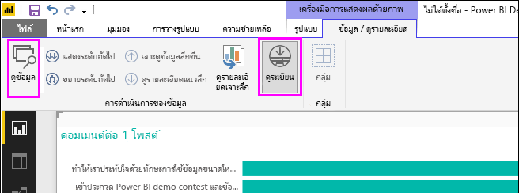

# ใช้ดูข้อมูลและระเบียนดูใน Power BI Desktop
ใน **Power BI Desktop** คุณสามารถเจาะลึกรายละเอียดของการแสดงผลใด ๆ และดูข้อมูลพื้นฐานหรือระเบียนข้อมูลสำหรับวิชวลที่เลือก ให้อยู่ในรูปข้อความได้ คุณลักษณะเหล่านี้ บางครั้งเรียกว่าการ*คลิกผ่าน*หรือ*ดูรายละเอียด*หรือ*เข้าถึงรายละเอียด*

คุณสามารถใช้**ดูข้อมูล** เพื่อดูค่าที่ใช้ในวิชวลในรูปข้อความ หรือใช้**ดูระเบียน** เพื่อดูข้อมูลทั้งหมดของหนึ่งระเบียนหรือหนึ่งจุดข้อมูลที่เลือกได้ 

>[!IMPORTANT]
>**ดูข้อมูล**และ**ดูระเบียน**สนับสนุนเฉพาะการแสดงภาพต่อไปนี้:
>  - แผนภูมิแท่ง
>  - Column chart
>  - แผนภูมิโดนัท
>  - แผนที่แถบสี
>  - แผนภูมิกรวย
>  - แผนที่
>  - Pie chart
>  - แผนที่ต้นไม้

## ใช้ดูข้อมูลใน Power BI Desktop

**ดูข้อมูล**แสดงข้อมูลเบื้องต้นในการแสดงภาพ **ดูข้อมูล**ประกฏในแท็บ**ข้อมูล / ดูรายละเอียด** ในส่วน**เครื่องมือภาพ**ของ ribbon เมื่อการแสดงผลถูกเลือก

นอกจากนี้ คุณยังสามารถดูข้อมูลได้โดยการคลิกขวาบนการแสดงภาพ แล้ว เลือก**แสดงข้อมูล**จากเมนูที่ปรากฏ หรือ ดยการเลือก**ตัวเลือกเพิ่มเติม** (...) ในมุมขวาบนของการแสดงข้อมูลด้วยภาพ และจากนั้นเลือก**แสดงข้อมูล**

&nbsp;&nbsp;

> [!NOTE]
> คุณต้องโฮเวอร์เมาส์เหนือจุดข้อมูลในวิชวล เพื่อให้มีเมนูคลิกขวา

เมื่อคุณเลือก**ดูข้อมูล**หรือ**แสดงข้อมูล** พื้นที่ของ Power BI Desktop แสดงทั้งวิชวล และข้อความที่เป็นตัวแทนของข้อมูล ใน*มุมมองแนวนอน* วิชวลจะแสดงอยู่ครึ่งบนของพื้นที่ ส่วนข้อมูลจะแสดงอยู่ครึ่งล่าง ดังรูปต่อไปนี้ 

คุณยังสามารถสลับระหว่างมุมมองแนวนอน และ*มุมมองแนวตั้ง* โดยการเลือกไอคอนที่มุมบนขวาได้

เพื่อกลับไปยังรายงาน เลือก **< กลับไปที่รายงาน** ในมุมบนซ้ายของพื้นที่ทำงาน

## ใช้ดูระเบียนใน Power BI Desktop

คุณยังสามารถโฟกัสไปที่ข้อมูลหนึ่งระเบียนในวิชวล และเจาะลึกลงข้อมูลข้างใน เพื่อใช้**ดูระเบียน** เลือกการแสดงภาพ จากนั้นเลือก**ดูระเบียน**ในแท็บ**ข้อมูล / ดูรายละเอียด** ในส่วน**เครื่องมือภาพ** ของคำ ribbon จากนั้นเลือกจุดข้อมูลหรือแถวบนการแสดงภาพ 

> [!NOTE]
> ถ้าปุ่ม**ดูระเบียน**ถูกปิดใช้งานปุ่มใน ribbon และแสดงเป็นสีเทา แสดงว่า การแสดงภาพที่เลือกไม่สนับสนุน**ดูระเบียน**

คุณยังสามารถคลิกขวาที่องค์ประกอบข้อมูล และเลือก**ดูระเบียน**จากเมนูที่ปรากฏขึ้น

เมื่อคุณเลือก**ดูระเบียน**สำหรับองค์ประกอบข้อมูล พื้นที่ทำงานของ Power BI Desktop จะแสดงข้อมูลทั้งหมดที่เกี่ยวข้องกับองค์ประกอบที่เลือก 

เพื่อกลับไปยังรายงาน เลือก **< กลับไปที่รายงาน** ในมุมบนซ้ายของพื้นที่ทำงาน

> [!NOTE]
>**ดูระเบียน**มีข้อจำกัดดังต่อไปนี้:
> - คุณไม่สามารถเปลี่ยนข้อมูลในมุมมอง**ดูระเบียน** และบันทึกกลับไปยังรายงานได้
> - คุณไม่สามารถใช้**ดูระเบียน** เมื่อวิชวลของคุณใช้หน่วยวัดจากการคำนวณ
> - คุณไม่สามารถใช้**ดูระเบียน** เมื่อเชื่อมต่อสดกับรูปแบบหลายมิติ

## ขั้นตอนถัดไป
มีการจัดรูปแบบและการจัดการข้อมูลที่หลากหลายใน**Power BI Desktop** ลองดูทรัพยากรต่อไปนี้สำหรับตัวอย่างบางส่วน:

* [ใช้การจัดกลุ่ม และจัดช่องเก็บใน Power BI Desktop](desktop-grouping-and-binning.md)
* [ใช้เส้นตาราง, จัดชิดกับเส้นตาราง, ลําดับบนแกน Z, การจัดแนว และการแจกจ่ายในรายงาน Power BI Desktop](desktop-gridlines-snap-to-grid.md)

