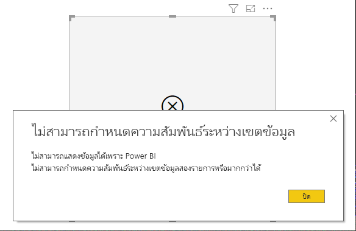
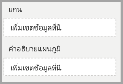
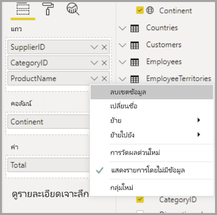

# แสดงรายการที่ไม่มีหน่วยข้อมูลใน Power BI

Power BI ช่วยให้คุณเห็นข้อมูลจากแหล่งข้อมูลหลายๆ แห่ง เมื่อสร้างการแสดงผลด้วยภาพ Power BI จะแสดงข้อมูลที่เกี่ยวข้องเท่านั้นเพื่อจะจัดการวิธีแสดง ข้อมูลอย่างเหมาะสม Power BI จะกำหนดเองว่าข้อมูลอันไหนที่เกี่ยวข้องโดยอ้างอิงตามการกำหนดค่าของการแสดงภาพและแบบจำลองข้อมูลเบื้องต้น บทความนี้อธิบายให้เห็นการทำงานของ Power BI ว่าเป็นอย่างไร เมื่อกำหนดข้อมูลที่เกี่ยวข้องด้วยตัวอย่างที่แสดงวิธีการกำหนดค่า

## การกำหนดข้อมูลที่เกี่ยวข้อง

เมื่อต้องเริ่มต้นทำความเข้าใจวิธี Power BI กำหนดข้อมูลที่เกี่ยวข้องในการแสดงผล ให้พิจารณาตารางนี้ในฐานะตัวอย่างอย่างง่าย การใช้แบบจำลองที่แสดงในส่วน[แบบจำลองข้อมูลตัวอย่าง](#example-data-model) ซึ่งอยู่ที่ส่วนท้ายของบทความนี้ พิจารณาการสร้างตารางด้วยการตั้งค่าต่อไปนี้:

**1. รวมกลุ่มที่มาจากตารางเดียวกัน:** *ผลิตภัณฑ์ [สี] - ผลิตภัณฑ์ [ขนาด]* 

|*ผลิตภัณฑ์ [สี]*  |*ผลิตภัณฑ์ [ขนาด]*  |
|---------|---------|
|สีฟ้า     |ขนาดใหญ่         |
|สีฟ้า     |ขนาดปานกลาง         |
|สีฟ้า     |ขนาดเล็ก         |
|สีแดง     |ขนาดใหญ่         |

ในตัวอย่างนี้ Power BI จะ แสดงชุดข้อมูลรวมกันของ *[สี-ขนาด]* ที่อยู่ในตาราง *[ผลิตภัณฑ์]* 

ทีนี้ลองมาดูการรวมข้อมูลแบบอื่น:

**2. รวมกลุ่มที่มาจากต่างแหล่งแต่มีตารางและหน่วยวัดเกี่ยวข้องโดยตรง:** *สไตล์ผลิตภัณฑ์ [เสร็จสิ้น] - ผลิตภัณฑ์ [สี] - ผลรวม(ยอดขาย[ปริมาณ])*

|*สไตล์ผลิตภัณฑ์ [สิ้นสุด]*  |*ผลิตภัณฑ์ [สี]*  |*[ผลรวมปริมาณ]*  |
|---------|---------|---------|
|ผิวมันวาว     |สีฟ้า         |10         |
|ผิวด้าน     |สีฟ้า         |15         |

ในตัวอย่างนี้ Power BI แสดงเฉพาะชุดข้อมูลรวมกันที่มีอยู่ ยกตัวอย่างเช่น ระบบจะไม่แสดงผล ("ไม่มี" + "สีน้ำเงิน") หรือ ("ผิวด้าน" + "สีแดง") เพราะชุดข้อมูลรวมกันเหล่านั้นไม่มีอยู่ในแบบจำลอง เงื่อนไขซึ่งเป็นตัวกำหนดว่าชุดข้อมูลรวมกันที่ยังอยู่ชุดไหนจะมีค่า *ผลรวม(ยอดขาย[ปริมาณ])* อยู่และจะไม่ถูกปล่อยไว้ให้ว่างเปล่า

ลองมาดูตัวอย่างในกรณีอื่น: 

**3. รวมกลุ่มที่มาจากต่างแหล่งซึ่งมีตารางเกี่ยวข้องกันโดยตรงแต่ไม่มีหน่วยวัด:** *สไตล์ผลิตภัณฑ์ [เสร็จสิ้น] - ผลิตภัณฑ์ [สี]*

|*สไตล์ผลิตภัณฑ์ [เสร็จสิ้น]*  |*ผลิตภัณฑ์ [สี]*  |
|---------|---------|
|ผิวมันวาว     |สีฟ้า         |
|ผิวมันวาว     |สีแดง         |
|ผิวด้าน     |สีฟ้า         |

เนื่องจากมีหน่วยวัดไม่ชัดเจนและทั้งสองตารางมีความเกี่ยวข้องกันโดยตรง Power BI จึงพยายามใส่หน่วยวัดเพื่อจำกัดการรวมกันของชุดข้อมูล ในกรณีนี้ Power BI จะใส่หน่วยวัด *CALCULATE(COUNTROWS('Product'))* ซึ่งไม่ควรถูกทิ้งไว้ให้ว่างเพราะ *ผลิตภัณฑ์* คือตารางที่ใช้ร่วมกันในทั้งสองตาราง

ด้วยเหตุนั้น Power BI จึงแสดงชุดข้อมูลรวมกันที่มีรายการในตารางผลิตภัณฑ์ ซึ่งไม่รวมชุดข้อมูลของ *("ไม่มี" + "สีน้ำเงิน")* และ *("ผิวด้าน" + "สีแดง")*

**4. รวมกลุ่มจากตารางอื่นและไม่มีความเกี่ยวข้องกัน**

ตัวอย่างแบบจำลองไม่มีการรวมนี้ แต่ถ้าเป็นกลุ่มจากตารางอื่นและไม่มีความเกี่ยวข้องกัน Power BI จะไม่สามารถเชื่อมสองคอลัมน์ ผลลัพธ์จะเป็นการรวมข้ามตารางของค่าทั้งหมดในแต่ละคอลัมน์ ในสถานการณ์นั้น Power BI จะแจ้งข้อผิดพลาดเป็นปัญหาประเภท*การรวมแบบไม่มีข้อจำกัด*เนื่อง จากการรวมข้ามเช่นนั้นฐานข้อมูลต้องใช้ข้อมูลจำนวนมหาศาลในการคำนวณและไม่สามารถให้ข้อมูลจำนวนมากขนาดนั้นกับผู้ใช้ได้ 

## แสดงรายการโดยไม่มีข้อมูล

ในส่วนก่อนหน้านี้อธิบายถึงวิธีที่ Power BI กำหนดว่าข้อมูลไหนเกี่ยวข้องกันและจะนำไปขึ้นแสดงผล แต่อาจจะมีเวลาที่คุณ*ต้องการ*จะแสดงรายการที่ไม่มีข้อมูล 

ฟีเจอร์การ**แสดงรายการที่ไม่มีข้อมูล**ช่วยให้คุณสามารถ รวมแถวข้อมูลและคอลัมน์ที่ไม่มีข้อมูลหน่วยวัด (ไม่มีค่าหน่วยวัด) ได้

เมื่อต้องการเปิดใช้งานฟีเจอร์**แสดงรายการที่ไม่มีข้อมูล**ให้คุณเลือกการแสดงผลด้วยภาพแล้วใน**เขตข้อมูล** ให้คลิกขวาที่เขตข้อมูลและเลือก**แสดงรายการที่ไม่มีข้อมูล**จากเมนูที่ ปรากฏซึ่งแสดงในรูปต่อไปนี้:

ฟีเจอร์การ**แสดงรายการที่ไม่มีข้อมูล**จะ*ไม่มี*ผลใดๆ ในสถานการณ์ต่อไปนี้:

* ไม่มีหน่วยวัดถูกเพิ่มเข้ามาในการแสดงผลด้วยภาพ และกลุ่มคอลัมน์กลุ่มก็มาจากตารางเดียวกัน
* สำหรับกลุ่มที่ไม่เกี่ยวข้องกัน Power BI จะไม่เรียกใช้คิวรีสำหรับกลุ่มการแสดงภาพซึ่งไม่เกี่ยวข้องกัน
* หน่วยวัดไม่มีความเกี่ยวข้องกับกลุ่มใด ๆ เพราะหน่วยวัดจะไม่เคยถูกทิ้งไว้ให้ว่างสำหรับการรวมชุดข้อมูลบางชุดเท่านั้น
* แต่ก็มีตัวกรองหน่วยวัดที่ผู้ใช้เป็นคนกำหนดเองซึ่งไม่รวมหน่วยวัดที่ว่างเปล่า -ยกตัวอย่างเช่น: *ยอดขาย > 0*

### วิธีแสดงรายการที่ไม่มีหน่วยข้อมูล

กรณีที่การใช้งานที่น่าสนใจที่สุดสำหรับการ**แสดงรายการที่ไม่มีข้อมูล**คือตอนที่แสดงรายการออกมาแล้วยังมีหน่วยวัดอยู่ ลองมาดูสถานการณ์เมื่อกลุ่มจากตารางเดียวกัน หรืออาจเกี่ยวข้องกันในแบบจำลอง ตัวอย่างเช่น*สไตล์ผลิตภัณฑ์*มีความเกี่ยวข้องโดยตรงกับ*ผลิตภัณฑ์*และทางอ้อมก็มีความเกี่ยวข้องกับ*การขาย*, *สไตล์ผลิตภัณฑ์*และ*ประเภทผลิตภัณฑ์*อาจเกี่ยวข้องกันผ่านตาราง*ผลิตภัณฑ์*และอื่น ๆ ได้

มาดูอีกสักสองสามกรณีที่น่าสนใจ และการเปรียบเทียบเมื่อเปิดและปิดการ**แสดงรายการที่ไม่มีข้อมูล** 

**1. จัดกลุ่มคอลัมน์จากตารางเดียวกัน:** *ผลิตภัณฑ์ [สี] - ผลิตภัณฑ์ [ขนาด] - ผลรวม(ยอดขาย[ปริมาณ])*

วิธีการปรากฏขึ้นของการ**แสดงรายการที่ไม่มีข้อมูล**พร้อมการปิดใช้งานฟีเจอร์:

|*ผลิตภัณฑ์ [สี]*  |*ผลิตภัณฑ์ [ขนาด]*  |*[ผลรวมปริมาณ]*  |
|---------|---------|---------|
|สีฟ้า     |ขนาดปานกลาง         |15         |
|สีฟ้า     |ขนาดเล็ก         |10         |

วิธีปรากฏขึ้นของการ**แสดงรายการที่ไม่มีข้อมูล**พร้อมการเปิดใช้งานฟีเจอร์:

|*ผลิตภัณฑ์ [สี]*  |*ผลิตภัณฑ์ [ขนาด]*  |*[ผลรวมปริมาณ]*  |
|---------|---------|---------|
|สีฟ้า     |ขนาดใหญ่         |         |
|สีฟ้า     |ขนาดปานกลาง         |15         |
|สีฟ้า     |ขนาดเล็ก         |10         |
|สีแดง     |ขนาดใหญ่         |         |

โปรดสังเกตวิธีที่ชุดข้อมูลรวมกันใหม่ทั้งสองปรากฏขึ้นพร้อมกันกับการเปิดใช้งานฟีเจอร์: *สีน้ำเงิน - ขนาดใหญ่*และ*สีแดง - ขนาดใหญ่* รายการทั้งสองนั้นมี*ปริมาณ*ไม่สอดคล้องกับตาราง*ยอดขาย* อย่างไรก็ตาม ทั้งสองก็ยังแสดงผลในตารางของ*ผลิตภัณฑ์*

**2. จัดกลุ่มคอลัมน์จากตารางที่เกี่ยวข้อง:** *สไตล์ผลิตภัณฑ์ [เสร็จสิ้น] - ผลิตภัณฑ์ [สี] - ผลรวม(ยอดขาย[ปริมาณ])*

วิธีการปรากฏขึ้นของการ**แสดงรายการที่ไม่มีข้อมูล**พร้อมการปิดใช้งานฟีเจอร์:

|*สไตล์ผลิตภัณฑ์ [เสร็จสิ้น]*  |*ผลิตภัณฑ์ [สี]*  |*[ผลรวมปริมาณ]*  |
|---------|---------|---------|
|ผิวมันวาว     |สีฟ้า         |10         |
|ผิวด้าน     |สีฟ้า         |15         |

วิธีปรากฏขึ้นของการ**แสดงรายการที่ไม่มีข้อมูล**พร้อมการเปิดใช้งานฟีเจอร์:

|*สไตล์ผลิตภัณฑ์ [เสร็จสิ้น]*  |*ผลิตภัณฑ์ [สี]*  |*[ผลรวมปริมาณ]*  |
|---------|---------|---------|
|ผิวมันวาว     |สีฟ้า         |10         |
|ผิวมันวาว     |สีแดง         |         |
|ผิวด้าน     |สีฟ้า         |15         |
|ไม่มี     |         |         |

แจ้งให้ทราบเกี่ยวกับวิธีการทำให้ *(ผิวมันวาน - สีแดง)* และ *(ไม่มี, ว่างเปล่า)* ปรากฏเป็นชุดข้อมูลรวมกัน นี่คือเหตุผลที่กระบวนการปรากฏขึ้น:
* Power BI จะพิจารณา สไตล์ผลิตภัณฑ์ [เสร็จสิ้น] ก่อนจะเลือกค่าทั้งหมดเพื่อแสดงผล - แสดงผลออกมาเป็นผิวมันวาว, ผิวด้าน, ไม่มี
* ใช้แต่ละค่าเหล่านี้ Power BI เลือกรายการ*ผลิตภัณฑ์ [สี]* ทั้งหมดที่สอดคล้องกัน 
* เนื่องจากค่า*ไม่มี*ไม่สอดคล้องกับ*ผลิตภัณฑ์ [สี]* ใดๆ การตั้งค่าว่าว่างเปล่าจึงปรากฏขึ้น

สิ่งสำคัญที่จะต้องทราบคือกลไกการเลือกค่าสำหรับคอลัมน์เป็นไปตามลำดับ และอาจจะสามารถเรียกว่าเป็น การ*รวมภายนอกด้านซ้าย*ระหว่างตาราง ถ้าลำดับของคอลัมน์มีการเปลี่ยนแปลง ผลลัพธ์ก็จะเปลี่ยนแปลงได้เช่นกัน

ลองมาดูตัวอย่างของการเปลี่ยนแปลงลำดับและผลกระทบที่เกิดจากการเปลี่ยนแปลง นี่เป็นรายการตัวอย่างเดียวกันกับในส่วนที่**2**นี้แต่ลำดับจะมีการเปลี่ยนแปลงไป

**ผลิตภัณฑ์ [สี] - สไตล์ผลิตภัณฑ์ [เสร็จสิ้น] - สรุป(ยอดขาย[จำนวน])**

วิธีปรากฏขึ้นของการ**แสดงรายการที่ไม่มีข้อมูล**พร้อมการเปิดใช้งานฟีเจอร์:

|*ผลิตภัณฑ์ [สี]* |*สไตล์ผลิตภัณฑ์ [เสร็จสิ้น]*  |*[ผลรวมปริมาณ]*  |
|---------|---------|---------|
|สีฟ้า     |ผิวมันวาว         |10         |
|สีฟ้า     |ผิวด้าน         |15         |
|สีแดง     |ผิวมันวาว         |         |

ในกรณีนี้โปรดสังเกตว่าวิธีการที่*สไตล์ผลิตภัณฑ์ [เสร็จสิ้น] =ไม่มี*ไม่ปรากฏในตาราง นั่นเป็นเพราะว่าในกรณีนี้ Power BI ตอนแรกเลือกค่า *สี*ทั้งหมดในตาราง *ผลิตภัณฑ์* จากนั้น Power BI จะเลือกค่าที่มีข้อมูล*เสร็จสิ้น*และมีความสอดคล้องกันในแต่ละสี เพราะค่า*ไม่มี*ไม่ปรากฏในการรวมของ *สี*ใดๆ เพราะมันไม่ได้ถูกเลือก

## ลักษณะการทำงานของวิชวล Power BI

เมื่อเปิดใช้งานฟีเจอร์**แสดงรายการที่ไม่มีข้อมูล**บนเขตข้อมูลใดเขตข้อมูลหนึ่งในวิชวล ฟีเจอร์นี้จะเปิดใช้งานโดยอัตโนมัติสำหรับเขตข้อมูลอื่นๆ ทั้งหมดที่อยู่ใน*กลุ่มของวิชวล*หรือลำดับชั้นเดียวกัน กลุ่มหรือลำดับชั้นของวิชวลอาจเป็น**แกน** หรือ**คำอธิบายแผนภูมิ** หรือ**ประเภท** **แถว** หรือ **คอลัมน์** ได้

ตัวอย่างเช่น บนวิชวลเมทริกซ์ด้วยสี่เขตข้อมูลในกลุ่ม**แถว** ถ้าหนึ่งเขตข้อมูลมีฟีเจอร์**แสดงรายการที่ไม่มีข้อมูล** ที่เปิดใช้งานแล้ว รายการทั้งหมดในเมทริกซ์จะเปิดใช้งาน ในรูปต่อไปนี้ ฟีเจอร์**แสดงรายการที่ไม่มีข้อมูล**ถูกเปิดใช้งานบนเขตข้อมูลแรกในกลุ่ม**แถว** เขตข้อมูล*SupplierID* เขตข้อมูลอื่น ๆ ในกลุ่ม**แถว**มีการเปิดใช้งานโดยอัตโนมัติเช่นกัน

ในทางตรงกันข้าม เขตข้อมูล*ทวีป*ที่แสดงในกลุ่ม**คอลัมน์***ไม่มีฟีเจอร์***แสดงรายการที่ไม่มีข้อมูล**ที่เปิดใช้งานโดยอัตโนมัติ 

ลักษณะการทำงานของวิชวลนี้มักจะเห็นได้เมื่อมีการแปลงวิชวลเป็นชนิดอื่น ตัวอย่างเช่น การแปลงวิชวลเมทริกซ์เป็นวิชวลตาราง ในการแปลงดังกล่าว ฟีเจอร์**แสดงรายการที่ไม่มีข้อมูล**จะถูกเปิดใช้งานโดยอัตโนมัติสำหรับเขตข้อมูลใด ๆ ที่ย้ายไปยังกลุ่มที่เขตข้อมูลในกลุ่มนั้นมีฟีเจอร์ที่เปิดใช้งานแล้ว ในตัวอย่างก่อนหน้า ถ้า*SupplierID*มีฟีเจอร์**แสดงรายการที่ไม่มีข้อมูล**ที่เปิดใช้งานแล้ว และวิชวลจะถูกแปลงเป็นตาราง เขตข้อมูล*ทวีป*จากกลุ่ม**คอลัมน์** จะถูกย้าย (พร้อมกับเขตข้อมูลในกลุ่ม**แถว**) ไปเป็นกลุ่มเดียวที่ใช้ในวิชวลตาราง - กลุ่ม**ค่า** ดังนั้นเขตข้อมูลทั้งหมดในกลุ่ม**ค่า**จะมีฟีเจอร์ **แสดงรายการที่ไม่มีข้อมูล** ที่เปิดใช้งานแล้ว

### การส่งออกข้อมูล

เมื่อใช้ฟีเจอร์**ส่งออกข้อมูลสรุป** ลักษณะการทำงานของฟีเจอร์**แสดงรายการที่ไม่มีข้อมูล**จะเหมือนกันถ้าการส่งออกถูกแปลงเป็นวิชวลตาราง ดังนั้นเมื่อส่งออกวิชวลเช่น วิชวลเมทริกซ์แผนภูมิข้อมูลที่ส่งออกอาจปรากฏขึ้นต่างจากวิชวลที่แสดง ทั้งนี้เนื่องจากการแปลงเป็นวิชวลตารางเป็นส่วนหนึ่งของกระบวนการส่งออกจะเปิดใช้งานฟีเจอร์**แสดงรายการที่ไม่มีข้อมูล**สำหรับเขตข้อมูลทั้งหมดที่จะส่งออก 

## แบบจำลองข้อมูลตัวอย่าง

ส่วนนี้จะแสดงรูปแบบข้อมูลตัวอย่างที่ใช้เป็นตัวอย่างในบทความนี้

**แบบจำลอง**: 

**ข้อมูล**:

|ผลิตภัณฑ์ [ID ผลิตภัณฑ์]|    ผลิตภัณฑ์ [ชื่อผลิตภัณฑ์]|   ผลิตภัณฑ์ [สี]| ผลิตภัณฑ์ [ขนาด]|  ผลิตภัณฑ์ [ID ประเภท]|    ผลิตภัณฑ์ [ID สไตล์]|
|---------|---------|---------|---------|---------|---------|
|1  |ผลิตภัณฑ์ตัวที่ 1  |สีฟ้า   |ขนาดเล็ก  |1  |1 |
|2  |ผลิตภัณฑ์ตัวที่ 2  |สีฟ้า   |ขนาดปานกลาง |2  |2 |
|3  |ผลิตภัณฑ์ตัวที่ 3  |สีแดง    |ขนาดใหญ่  |1  |1 |
|4  |ผลิตภัณฑ์ตัวที่ 4  |สีฟ้า   |ขนาดใหญ่  |2  |2 |

|ประเภทผลิตภัณฑ์ [รหัสประเภท]|   ประเภทผลิตภัณฑ์ [ชื่อประเภท]|
|---------|---------|
|1  |โทรศัพท์   |
|2  |Camera |
|3  |โทรทัศน์ |

|สไตล์ผลิตตภัณฑ์ [ID สไตล์]| สไตล์ผลิตภัณฑ์ [เสร็จสิ้น]|   สไตล์ผลิตภัณฑ์ [ผิวเงาวาว]|
|---------|---------|---------|
|1  |ผิวมันวาว  |ใช่ |
|2  |ผิวด้าน  |ไม่ใช่ |
|3  |ไม่มี   |ไม่ใช่ |

|ยอดขาย [ID ยอดขาย]| ยอดขาย [ID ผลิตภัณฑ์]|   ยอดขาย [วันที่]|    ยอดขาย [ปริมาณ]|
|---------|---------|---------|---------|
|1  |1  |1/1/2012 0:00| 10 |
|2  |2  |1/1/2013 0:00| 15 |

## ขั้นตอนถัดไป

บทความนี้อธิบายวิธีเปิดใช้งานฟีเจอร์การ**แสดงรายการที่ไม่มีข้อมูล**ใน Power BI คุณอาจสนใจบทความต่อไปนี้: 

* [สมาชิกเริ่มต้นในแบบจำลองหลายมิติใน Power BI](../connect-data/desktop-default-member-multidimensional-models.md)
