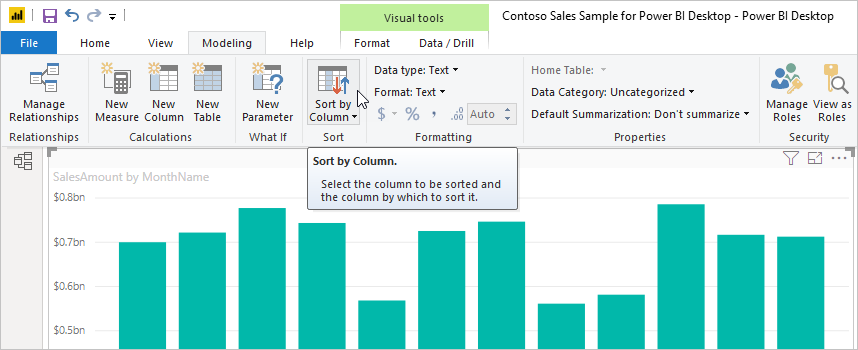

# เรียงลำดับตามคอลัมน์ใน Power BI Desktop
ใน Power BI Desktop และบริการ Power BI คุณสามารถเปลี่ยนลักษณะของวิชวล โดยเรียงลำดับตามเขตข้อมูลที่แตกต่างกันได้ โดยการเปลี่ยนวิธีการเรียงลำดับวิชวล คุณสามารถเน้นข้อมูลที่คุณต้องการสื่อ และทำให้แน่ใจว่า วิชวลสะท้อนแนวโน้ม (หรือเน้นให้เห็น)

ไม่ว่าคุณจะใช้ข้อมูลตัวเลข (เช่น ตัวเลขยอดขาย) หรือข้อมูลข้อความ (เช่น ชื่อรัฐ) คุณสามารถเรียงลำดับการแสดงผลข้อมูลด้วยภาพของคุณ และทำให้แสดงในแบบที่คุณต้องการได้ Power BI มีความยืดหยุ่นสำหรับการรียงลำดับอย่างมาก และมีเมนูด่วนให้คุณใช้ เมื่อต้องเรียงลำดับวิชวลใดก็ตาม ให้เลือกเมนู **ตัวเลือกเพิ่มเติม** (... ) เลือก **เรียงลำดับโดย** จากนั้นเลือกเขตข้อมูลที่คุณต้องการเรียงลำดับ

## ตัวอย่างการเรียงลำดับ
ลองใช้ตัวอย่างที่มีความลึกมากกว่าเดิม และดูว่าทำงานอย่างไรใน Power BI Desktop

การแสดงภาพต่อไปนี้แสดงต้นทุน, ปริมาณ และยอดเงินตามชื่อผู้ผลิต นี่คือการแสดงผลข้อมูลด้วยภาพ ก่อนที่จะทำการเรียงลำดับ

ในปัจจุบัน วิชวลจะถูกจัดเรียงตามคอลัมน์ **SalesQuantity** เราสามารถกำหนดคอลัมน์การเรียงลำดับโดยการจับคู่สีของแท่งจากน้อยไปหามากกับคำอธิบายแผนภูมิ แต่มีวิธีที่ดีกว่า: เมนู **ตัวเลือกเพิ่มเติม** ซึ่งคุณเข้าถึงได้โดยการเลือกจุดไข่ปลา (...)

ตัวเลือกการเรียงลำดับจะเป็นดังนี้:

* เขตข้อมูลที่เรียงลำดับในปัจจุบันคือ **SalesQuantity** ระบุโดย **SalesQuantity** เป็นตัวหนานำหน้าด้วยแท่งสีเหลือง 

* ทิศทางการเรียงลำดับปัจจุบันเรียงจากน้อยไปมากดังแสดงโดย **เรียงลำดับจากน้อยไปมาก** เป็นตัวหนานำหน้าด้วยแท่งสีเหลือง

เราจะดูเขตข้อมูลและทิศทางการเรียงลำดับในส่วนถัดไปอีกสองส่วน

## เลือกคอลัมน์ที่จะใช้สำหรับการเรียงลำดับ
คุณสังเกตเห็นแท่งสีเหลืองที่อยู่ก่อนหน้า **SalesQuantity** ในเมนู**ตัวเลือกเพิ่มเติม** ซึ่งแสดงว่าวิชวลจะเรียงลำดับตามคอลัมน์ **SalesQuantity** การเรียงลำดับตามคอลัมน์อื่นเป็นเรื่องง่าย: เลือกจุดไข่ (...) เพื่อแสดงเมนู **ตัวเลือกเพิ่มเติม** เลือก **เรียงลำดับตาม** จากนั้นเลือกคอลัมน์อื่นที่แตกต่าง

ในรูปต่อไปนี้ เราเลือก **DiscountAmount** เป็นคอลัมน์ที่เราต้องการเรียงลำดับ คอลัมน์นั้นปรากฏเป็นหนึ่งในบรรทัดบนวิชวล แทนที่จะเป็นหนึ่งในแท่ง 

โปรดสังเกตว่าภาพได้เปลี่ยนไป ค่าตอนนี้เรียงลำดับจากค่า **DiscountAmount** มากสุด ซึ่งคือ Fabrikam inc. ลงไปถึง Northwind Traders ซึ่งมีค่าต่ำสุด 

แต่อะไรจะเกิดขึ้นถ้าเราต้องการเรียงลำดับจากน้อยไปมาก แทนจากมากไปหาน้อยหรือไม่ ส่วนถัดไปแสดงว่ามันง่ายอย่างไร

## เลือกลำดับการจัดเรียง
เมื่อเราดูเมนู **ตัวเลือกเพิ่มเติม** จากรูปภาพก่อนหน้า เราเห็นว่า **เรียงลำดับจากมากไปน้อย** อยู่ในรูปแบบตัวหนานำหน้าด้วยแท่งสีเหลือง

เมื่อเลือก **เรียงลำดับจากมากไปน้อย** นั่นหมายความว่า ภาพจะถูกเรียงลำดับตามคอลัมน์ที่เลือกตามลำดับของค่าที่มากที่สุดเมื่อต้องการค่าน้อยที่สุด ต้องการเปลี่ยนสิ่งนั้นหรือไม่ ไม่มีปัญหา เพียงแค่เลือก **เรียงลำดับจากน้อยไปมาก** และลำดับการจัดเรียงของคอลัมน์ที่เลือกจะเปลี่ยนจากค่าน้อยไปหามากที่สุด

ต่อไปนี้เป็นวิชวลเดียวกันของเรา หลังจากการเปลี่ยนแปลงการเรียงลำดับของ **DiscountAmount** สังเกตเห็นว่า ตอนนี้ Northwind Traders เป็นผู้ผลิตแรกที่แสดงในรายการ และ Fabrikam Inc. อยู่ลำดับสุดท้าย ซึ่งตรงกันข้ามกับการเรียงลำดับก่อนหน้า

คุณสามารถเรียงลำดับตามคอลัมน์ใดก็ตามที่มีในวิชวล เราสามารถเลือก **SalesQuantity** ให้เป็นคอลัมน์ที่เราต้องการเรียงลำดับได้อย่างง่ายดาย เพื่อแสดงผู้ผลิตที่มียอดขายสูงที่สุดก่อน และยังคงรักษาคอลัมน์อื่น ๆ ไว้ในวิชวลตามที่ใช้กับผู้ผลิตรายนั้น นี่คือวิชวลที่มองเห็นด้วยการตั้งค่าเหล่านี้:

## เรียงลำดับโดยใช้การเรียงลำดับตามปุ่มคอลัมน์
มีวิธีอื่นในการเรียงลำดับข้อมูลของคุณ โดยใช้ปุ่ม**เรียงลำดับตามคอลัมน์**ในริบบิ้น**การสร้างแบบจำลอง**

วิธีการเรียงลำดับนี้ต้องการให้คุณเลือกคอลัมน์ (เขตข้อมูล) ก่อนเพื่อเรียงลำดับจากบานหน้าต่าง **เขตข้อมูล** จากนั้นเลือก **การสร้างแบบจำลอง** > **เรียงตามคอลัมน์** เพื่อเรียงลำดับวิชวลของคุณ ถ้าคุณไม่ได้เลือกคอลัมน์ ปุ่ม **เรียงตามคอลัมน์** จะไม่ทำงาน

มาลองดูตัวอย่างที่พบบ่อยกัน คุณมีข้อมูลจากแต่ละเดือนของปี และคุณต้องการเรียงตามลำดับเวลา ขั้นตอนต่อไปนี้แสดงวิธีการดังกล่าว:

1. ให้สังเกตว่า เมื่อเลือกวิชวลแต่ไม่มีคอลัมน์ถูกเลือกไว้ในบานหน้าต่าง**เขตข้อมูล** ปุ่ม**เรียงลำดับตามคอลัมน์**จะไม่ทำงาน (เป็นสีเทา)
   
   

2. เมื่อเราเลือกคอลัมน์ที่เราต้องการเรียงลำดับ ในบานหน้าต่าง**เขตข้อมูล** ปุ่ม**เรียงลำดับตามคอลัมน์**จะถูกเปิดใช้งาน
   
   
3. ตอนนี้ เลือกวิชวลแล้ว เราสามารถเลือก **MonthOfYear** แทนที่จะเป็นค่าเริ่มต้น **MonthName** และตอนนี้วิชวลเรียงลำดับตามลำดับที่เราต้องการ คือเรียงตามเดือนในปี
   
   

<!---
This functionality is no longer active. Jan 2020

## Getting back to default column for sorting
You can sort by any column you'd like, but there may be times when you want the visual to return to its default sorting column. No problem. For a visual that has a sort column selected, open the **More options** menu and select that column again, and the visualization returns to its default sort column.

For example, here's our previous chart:

When we go back to the menu and select **SalesQuantity** again, the visual defaults to being ordered alphabetically by **Manufacturer**, as shown in the following image.

With so many options for sorting your visuals, creating just the chart or image you want is easy.
--->

## ขั้นตอนถัดไป

คุณอาจมีความสนใจบทความต่อไปนี้:

* [ใช้ตัวเจาะเข้าถึงรายละเอียดข้ามรายงานใน Power BI Desktop](desktop-cross-report-drill-through.md)
* [ตัวแบ่งส่วนข้อมูลใน Power BI](../visuals/power-bi-visualization-slicers.md)
