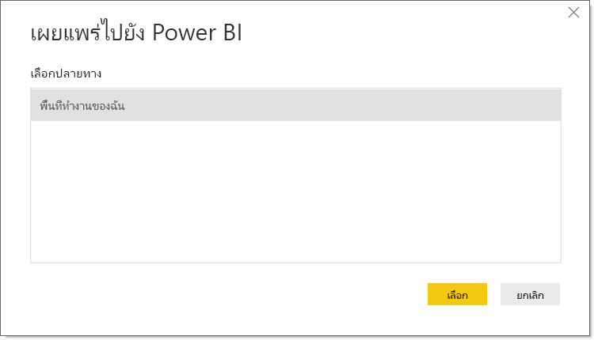

# เผยแพร่ชุดข้อมูลและรายงานจาก Power BI Desktop
เมื่อคุณเผยแพร่เป็นไฟล์ Power BI Desktop ไปยังบริการ Power BI แสดงว่าคุณได้เผยแพร่ข้อมูลในแบบจำลองดังกล่าวไปยังพื้นที่ทำงาน Power BI ของคุณ ข้อมูลเดียวกันนี้จะเป็นจริงสำหรับรายงานใด ๆ ที่คุณสร้างไว้ในมุมมอง**รายงาน** คุณจะเห็นชุดข้อมูลใหม่ที่มีชื่อเดียวกัน และรายงานต่างๆในตัวนำทางของพื้นที่ทำงานของคุณ

การเผยแพร่จาก Power BI Desktop จะให้ผลลัพธ์เดียวกันกับการใช้ **Get Data** ใน Power BI เพื่อเชื่อมต่อและอัปโหลดไฟล์ Power BI Desktop

> [!NOTE]
> การเปลี่ยนแปลงใดๆที่คุณทำกับรายงานใน Power BI จะไม่ถูกบันทึกกลับไปยังไฟล์ Power BI Desktop ต้นฉบับ ซึ่งรวมถึงเวลาที่คุณเเพิ่ม ลบ หรือเปลี่ยนแปลงการแสดงภาพต่าง ๆ ในรายงาน

## เมื่อต้องการเผยแพร่ชุดข้อมูลและรายงาน Power BI Desktop
1. ใน Power BI Desktop เลือก **ไฟล์** \> **เผยแพร่** \> **เผยแพร่ไปยัง Power BI** หรือเลือก **เผยแพร่** บน Ribbon  

   

2. ลงชื่อเข้าใช้ไปยัง Power BI
3. เลือกปลายทาง

   

เมื่อการเผยแพร่เสร็จสมบูรณ์ คุณจะได้รับลิงก์ไปยังรายงานของคุณ เลือกลิงก์เพื่อเปิดรายงานในไซต์ Power BI ของคุณ

## เผยแพร่อีกครั้งหรือแทนที่ชุดข้อมูลที่เผยแพร่จาก Power BI Desktop
ชุดข้อมูลและรายงานใดๆ ที่คุณสร้างขึ้นใน Power BI Desktop ให้อัปโหลดไปยังไซค์ Power BI ของคุณเมื่อเผยแพร่ไฟล์ Power BI Desktop เมื่อคุณเผยแพร่ไฟล์ Power BI Desktop ของคุณอีกครั้ง ชุดข้อมูลในไซต์ Power BI ของคุณจะถูกแทนที่ด้วยชุดข้อมูลที่อัปเดตแล้วจากไฟล์ Power BI Desktop

กระบวนการนี้ค่อนข้างจะตรงไปตรงมา แต่จะมีรายการ 2-3 รายการที่คุณควรทราบ:

* ถ้าคุณมีชุดข้อมูลสองรายการ หรือมากกว่าใน Power BI โดยใช้ชื่อเดียวกันกับไฟล์ Power BI Desktop การเผยแพร่อาจล้มเหลวได้ ตรวจสอบให้แน่ใจว่า คุณมีชุดข้อมูลเดียวเท่านั้นใน Power BI ที่มีชื่อเดียวกัน นอกจากนี้คุณยังสามารถเปลี่ยนชื่อไฟล์และเผยแพร่ โดยสร้างชุดข้อมูลใหม่ชื่อเดียวกันกับไฟล์
* ถ้าคุณเปลี่ยนชื่อหรือลบคอลัมน์หรือหน่วยวัด การแสดงภาพใดๆที่คุณมีใน Power BI ที่มีเขตข้อมูลนั้นอาจจะไม่สามารถใช้งาน 
* Power BI ละเว้นการเปลี่ยนแปลงการจัดรูปแบบบางอย่างของคอลัมน์ที่มีอยู่ ตัวอย่างเช่น หากคุณเปลี่ยนรูปแบบของคอลัมน์จาก 0.25% เป็น 25%
* สมมติว่าคุณมีกำหนดการรีเฟรชที่มีการกำหนดค่าสำหรับชุดข้อมูลที่มีอยู่ของคุณใน Power BI เมื่อคุณเพิ่มแหล่งข้อมูลใหม่ลงในไฟล์ของคุณแล้วเผยแพร่อีกครั้ง คุณจะต้องลงชื่อเข้าใช้ก่อน่การรีเฟรชตามกำหนดการครั้งถัดไป
* เมื่อคุณเผยแพร่ชุดข้อมูลที่เผยแพร่จาก Power BI Desktop ใหม่ และมีการกำหนดตารางเวลาการรีเฟรช การรีเฟรชชุดข้อมูลจะเริ่มต้นทันทีที่คุณเผยแพร่อีกครั้ง
* เมื่อคุณทำการเปลี่ยนแปลงกับชุดข้อมูล แล้วเผยแพร่ใหม่อีกครั้ง ข้อความจะแสดงจำนวนพื้นที่ทำงาน รายงาน และแดชบอร์ดที่อาจได้รับผลกระทบจากการเปลี่ยนแปลงนั้น และจะขอให้คุณยืนยันว่า คุณต้องการแทนที่ชุดข้อมูลที่เผยแพร่ในปัจจุบันด้วยรายการที่คุณปรับเปลี่ยน นอกจากนี้ ข้อความยังประกอบด้วยลิงก์ไปยังการวิเคราะห์ผลกระทบของชุดข้อมูลแบบเต็มรูปแบบในบริการ Power BI ที่คุณจะสามารถมองเห็นข้อมูลเพิ่มเติม และดำเนินการเพื่อบรรเทาความเสี่ยงจากการเปลี่ยนแปลงของคุณ

   

   [เรียนรู้เพิ่มเติมเกี่ยวกับการวิเคราะห์ผลกระทบของชุดข้อมูล](../collaborate-share/service-dataset-impact-analysis.md)

> [!NOTE]
> การเชื่อมต่อข้อมูลบางอย่างในรายงาน Power BI อาจรวมถึงการเชื่อมโยงไปยังข้อมูล แทนที่จะรวมข้อมูลในชุดข้อมูลที่นำเข้าลงในบริการ Power BI ตัวอย่างเช่น ลิงก์การเชื่อมต่อ DirectQuery ไปยังข้อมูลเนื่องจากเกิดการอัปเดตหรือการโต้ตอบ แทนที่จะนำเข้าข้อมูลด้วยตัวเอง ถ้าแหล่งข้อมูลที่เชื่อมโยงในรายงานของคุณอยู่ภายในองค์กร คุณอาจจำเป็นต้องมีเกตเวย์เพื่อเข้าถึงจาก Power BI อีกด้วย สำหรับข้อมูลเพิ่มเติม ดูที่ [เกตเวย์ข้อมูลภายในองค์กรคืออะไร](../connect-data/service-gateway-onprem.md)
> 