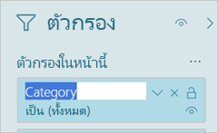

# <a name="work-with-filters-in-power-bi-reports"></a>ทำงานกับตัวกรองในรายงาน Power BI

[!INCLUDE [applies-to](../includes/applies-to.md)] [!INCLUDE [yes-desktop](../includes/yes-desktop.md)] [!INCLUDE [yes-service](../includes/yes-service.md)]

ตัวกรองใน Power BI มีฟังก์ชันการทำงานใหม่และการออกแบบใหม่ เมื่อคุณเข้าร่วมประสบการณ์การใช้งานตัวกรองใหม่ คุณสามารถจัดรูปแบบบานหน้าต่างตัวกรองให้มีลักษณะเหมือนกับส่วนเหลือของรายงาน คุณสามารถล็อก และแม้แต่ซ่อนตัวกรอง เมื่อคุณออกแบบรายงานของคุณ คุณจะไม่เห็นบานหน้าต่างตัวกรองเก่าในพื้นที่การแสดงภาพ คุณสามารถกำเนินการแก้ไขตัวกรองและการจัดรูปแบบในบานหน้าต่างตัวกรองเดียว 


ในฐานะผู้ออกแบบรายงาน นี่คืองานบางอย่างที่คุณสามารถทำได้ในบานหน้าต่างตัวกรองใหม่:

- เพิ่มและลบเขตข้อมูลที่จะกรอง 
- เปลี่ยนสถานะตัวกรอง
- จัดรูปแบบ และกำหนดค่าบานหน้าต่างตัวกรองเพื่อให้เป็นส่วนหนึ่งของรายงานของคุณ
- กำหนดว่าบานหน้าต่างตัวกรองถูกเปิด หรือถูกยุบอยู่ตามค่าเริ่มต้นเมื่อลูกค้าเปิดรายงานขึ้น
- ซ่อนบานบานหน้าต่างตัวกรองทั้งหมดหรือตัวกรองเฉพาะที่คุณต้องการให้ผู้ใช้รายงานเพื่อดู
- ตัวควบคุมที่คั่นหน้าคู่มองเห็น เปิด และยุบสถานะของบานบานหน้าต่างตัวกรองใหม่
- ล็อกตัวกรองที่คุณต้องการให้ผู้บริโภคเมื่อต้องแก้ไข

ด้วยประสบการณ์ตัวกรองใหม่ ผู้ใช้รายงานยังสามารถโฮเวอร์เหนือภาพใดๆ เพื่อดูรายการแบบอ่านอย่างเดียวของตัวกรองหรือตัวแบ่งส่วนข้อมูลที่มีผลต่อภาพนั้น


## <a name="turn-on-the-new-filter-experience"></a>ลองใช้งานตัวกรองใหม่ 

การใช้งานตัวกรองใหม่ถูกเปิดใช้งานตามค่าเริ่มต้นสำหรับรายงานใหม่ คุณสามารถเปิดใช้งานประสบการณ์ใหม่สำหรับรายงานที่มีอยู่ใน Power BI Desktop หรือบริการของ Power BI

### <a name="turn-on-new-filters-for-an-existing-report-in-power-bi-desktop"></a>เปิดใช้งานตัวกรองใหม่สำหรับรายงานที่มีอยู่ใน Power BI Desktop

1. ใน Power BI Desktop ในรายงานที่มีอยู่ ให้เลือก**แฟ้ม** > **ตัวเลือกและการตั้งค่า** > **ตัวเลือก**
2. ในบานหน้าต่างนำทาง ภายใต้**ไฟล์ปัจจุบัน** ให้เลือก**การตั้งค่ารายงาน**
3. ด้านล่าง **ประสบการณ์การกรอง** ให้เลือก **เปิดใช้งานบานหน้าต่างตัวกรองที่อัปเดตแล้ว และแสดงตัวกรองในส่วนหัวของภาพสำหรับรายงานนี้**

### <a name="turn-on-new-filters-for-an-existing-report-in-the-service"></a>เปิดใช้งานตัวกรองใหม่สำหรับรายงานที่มีอยู่ในบริการ

หากคุณเปิดใช้งาน**รูปลักษณ์ใหม่**ในบริการของ Power BI  ประสบการณ์การใช้ตัวกรองใหม่จะเปิดทำงานโดยอัตโนมัติ อ่านข้อมูลเพิ่มเติมเกี่ยวกับ [รูปลักษณ์ใหม่ในบริการของ Power BI](../consumer/service-new-look.md)

ถ้าคุณยังไม่ได้เปิดใช้งานรูปลักษณ์ใหม่ คุณยังคงสามารถดูประสบการณ์การใช้งานตัวกรองใหม่ได้โดยปฏิบัติตามขั้นตอนเหล่านี้

1. ในบริการของ Power BI ให้เปิดรายการเนื้อหาสำหรับพื้นที่ทำงาน
2. ค้นหารายงานที่คุณต้องการเปิดใช้งาน และเลือก **ตัวเลือกเพิ่มเติม (...)** จากนั้นเลือก **การตั้งค่า** สำหรับรายงานนั้น

    

3. ด้านล่าง **ประสบการณ์การกรอง** ให้เลือก **เปิดใช้งานบานหน้าต่างตัวกรองที่อัปเดตแล้ว และแสดงตัวกรองในส่วนหัวของภาพสำหรับรายงานนี้**

    

## <a name="view-filters-for-a-visual-in-reading-mode"></a>ดูตัวกรองสำหรับภาพในโหมดการอ่าน

ในโหมดการอ่าน ลากเมาส์ไปยังตัวกรองไอคอนสำหรับภาพเพื่อดูรายการตัวกรองแบบป็อปอัพกับตัวกรองทั้งหมด ตัวแบ่งส่วนข้อมูล และอื่นๆ ที่มีผลต่อภาพนั้น การจัดรูปแบบรายการตัวกรองแบบป็อปอัพจะเหมือนกับการจัดรูปแบบในบานหน้าต่างตัวกรอง 


นี่คือชนิดตัวกรองที่มุมมองนี้แสดง: 
- ตัวกรองพื้นฐาน
- ตัวแบ่งส่วนข้อมูล
- ไฮไลต์เชื่อมโยง 
- กรองข้าม
- ตัวกรองขั้นสูง
- ตัวกรอง Top N
- ตัวกรองวันที่ที่เกี่ยวข้อง
- ตัวแบ่งส่วนข้อมูลซิงค์
- ตัวกรอง รวม/ไม่รวม
- ตัวกรองที่ส่งผ่าน URL

## <a name="build-the-new-filters-pane"></a>สร้างบานหน้าต่างตัวกรองใหม่

หลังจากที่คุณเปิดใช้งานบานหน้าต่างตัวกรองใหม่ คุณจะเห็นบานหน้าต่างทางด้านขวาของหน้ารายงาน จัดรูปแบบตามค่าเริ่มต้นที่ยึดตามการตั้งค่ารายงานปัจจุบันของคุณ ใช้บานหน้าต่างตัวกรองใหม่เพื่อกำหนดค่าว่าจะรวมตัวกรองใด และอัปเดตตัวกรองเดิมที่มีอยู่ในบานหน้าต่างใหม่ บานหน้าต่างตัวกรองใหม่แสดงให้คุณเห็นผู้ใช้รายงานของคุณเมื่อคุณเผยแพร่รายงานของคุณ 

1. ตามค่าเริ่มต้น ผู้บริโภครายงานของคุณสามารถดูบานหน้าต่างตัวกรอง หากไม่ต้องการให้มองเห็น ให้เลือกไอคอนรูปตาที่อยูถัดจาก **ตัวกรอง**

    

2. เมื่อต้องเริ่มสร้างบานหน้าต่างตัวกรองของคุณใหม่ ลากเขตข้อมูลที่สนใจไปยังบานหน้าต่างตัวกรองใหม่ เช่น ภาพ หน้า หรือตัวกรองระดับรายงาน

เมื่อคุณเพิ่มภาพลงในพื้นที่รายงาน Power BI เพิ่มตัวกรองไปยังบานหน้าต่างตัวกรองสำหรับแต่ละเขตข้อมูลในภาพโดยอัตโนมัติ 

## <a name="hide-the-filters-pane-while-editing"></a>ซ่อนบานหน้าต่างตัวกรองขณะที่แก้ไข

Power BI Desktop มรชุดแถบเครื่องมือใหม่ในตัวอย่าง บนแท็บ **มุมมอง** ปุ่มสลับ**ตัวกรอง**ช่วยให้คุณสามารถแสดงหรือซ่อนบานหน้าต่างตัวกรองได้ คุณลักษณะนี้มีประโยชน์ เมื่อคุณไม่ได้ใช้บานหน้าต่างตัวกรองและต้องการพื้นที่เพิ่มเติมบนหน้าจอ นอกจากนี้ยังจัดเรียงบานหน้าต่างตัวกรองให้สอดคล้องกับบานหน้าต่างอื่น ๆ ที่คุณสามารถเปิดและปิดได้ เช่น บานหน้าต่างบุ๊กมาร์กและการเลือก 


การตั้งค่านี้จะซ่อนบานหน้าต่างตัวกรองใน Power BI Desktop เท่านั้น หากคุณต้องการซ่อนบานหน้าต่างตัวกรองสำหรับผู้ใช้ปลายทาง ให้คุณเลือกไอคอน **ตา** ซึ่งอยู่ถัดจาก**ตัวกรอง**

 

## <a name="lock-or-hide-filters"></a>ล็อกหรือซ่อนตัวกรอง

คุณสามารถล็อกหรือซ่อนตัวกรองของแต่ละการ์ด ถ้าคุณล็อกตัวกรอง ผู้บริโภครายงานของคุณสามารถดู แต่ไม่สามารถเปลี่ยนแปลง หากคุณซ่อน พวกเขาไม่สามารถมองเห็นได้ ซ่อนตัวกรองการ์ดจะมีประโยชน์หากถ้าคุณต้องการซ่อนตัวกรองล้างข้อมูลที่แยกค่า null หรือค่าที่ไม่คาดคิด 

- ในบานหน้าต่างตัวกรองใหม่ เลือก หรือยกเลิก **การล็อกตัวกรอง** หรือ **ซ่อนไอคอนตัวกรอง** ในการ์ดตัวกรอง

   

เมื่อคุณเปิดและปิดการตั้งค่าเหล่านี้ในบานหน้าต่างตัวกรองใหม่ คุณจะเห็นการเปลี่ยนแปลงมีผลในรายงาน ตัวกรองที่ซ่อนอยู่จะไม่แสดงในรายการตัวกรองแบบป็อปอัพสำหรับภาพ

คุณยังสามารถกำหนดค่าสถานะบานหน้าต่างตัวกรองใหม่ให้เป็นโฟลว์พร้อมกับบุ๊กมาร์กรายงานของคุณ สถานะบานหน้าต่างเปิด ปิด และมองเห็นเป็นบุ๊กมาร์กทั้งหมด
 
## <a name="format-the-new-filters-pane"></a>จัดรูปแบบบานหน้าต่างตัวกรองใหม่

ส่วนที่สำคัญของการใช้งานใหม่นี้คือ คุณสามารถจัดรูปบานหน้าต่างตัวกรองเพื่อให้ตรงกับลักษณะที่แสดงของรายงานของคุณ คุณสามารถจัดรูปแบบบานหน้าต่างตัวกรองที่แตกต่างกันสำหรับแต่ละหน้าในรายงาน นี่คือองค์ประกอบที่คุณสามารถจัดรูปแบบได้: 

- สีพื้นหลัง
- ความโปร่งใสของพื้นหลัง
- เส้นขอบ: เปิดหรือปิด
- สีขอบ
- ชื่อและแบบอักษรหัวข้อ สี และขนาดข้อความ

คุณยังสามารถจัดรูปแบบองค์ประกอบเหล่านี้สำหรับการ์ดตัวกรอง ขึ้นอยู่กับการนำไปใช้ (ตั้งค่าเป็นอย่างอื่น) หรือพร้อมใช้งาน (ลบ): 

- สีพื้นหลัง
- ความโปร่งใสของพื้นหลัง
- เส้นขอบ: เปิดหรือปิด
- สีขอบ
- แบบอักษร์ สี และขนาดข้อความ
- สีของกล่องข้อมูลป้อนเข้า

### <a name="format-the-filters-pane-and-cards"></a>จัดรูปแบบบานหน้าต่างตัวกรองและการ์ด

1. ในรายงาน คลิกรายงานเอง หรือพื้นหลัง (*รูปพื้นหลัง*), จากนั้นในการ**แสดงภาพ**บานหน้าต่าง เลือก**รูปแบบ** 
    คุณจะเห็นตัวเลือกการจัดรูปแบบหน้ารายงาน รูปพื้น หลัง และยังบานหน้าต่างตัวกรอง และการ์ดตัวกรอง

1. ขยาย**บานหน้าต่างตัวกรอง**เพื่อตั้งค่าสีสำหรับพื้นหลัง ไอคอน และเส้นขอบด้านซ้ายเพื่อเสริมหน้ารายงาน

    

1. ขยาย**การ์ดตัวกรอง**เพื่อตั้งค่าสีและเส้นขอบเป็น**พร้อมใช้งาน**และ**ใช้งานได้** หากคุณสร้างการ์ดที่พร้อมใช้งาน และใช้สีที่ต่างกัน จะเห็นได้ชัดว่าใช้ตัวกรองใหนสามารภใช้ได้ 
  
    

## <a name="theming-for-filters-pane"></a>การกำหนดธีมสำหรับบานหน้าต่างตัวกรอง
ตอนนี้คุณสามารถปรับเปลี่ยนการตั้งค่าเริ่มต้นของบานหน้าต่างตัวกรองด้วยไฟล์ธีมได้ นี่คือส่วนย่อยธีมตัวอย่างเพื่อให้คุณเริ่มต้นใช้:

 
```
"outspacePane": [{ 

"backgroundColor": {"solid": {"color": "#0000ff"}}, 

"foregroundColor": {"solid": {"color": "#00ff00"}}, 

"transparency": 50, 

"titleSize": 35, 

"headerSize": 8, 

"fontFamily": "Georgia", 

"border": true, 

"borderColor": {"solid": {"color": "#ff0000"}} 

}], 

"filterCard": [ 

{ 

"$id": "Applied", 

"transparency": 0, 

"backgroundColor": {"solid": {"color": "#ff0000"}}, 

"foregroundColor": {"solid": {"color": "#45f442"}}, 

"textSize": 30, 

"fontFamily": "Arial", 

"border": true, 

"borderColor": {"solid": {"color": "#ffffff"}}, 

"inputBoxColor": {"solid": {"color": "#C8C8C8"}} 

}, 

{ 

"$id": "Available", 

"transparency": 40, 

"backgroundColor": {"solid": {"color": "#00ff00"}}, 

"foregroundColor": {"solid": {"color": "#ffffff"}}, 

"textSize": 10, 

"fontFamily": "Times New Roman", 

"border": true, 

"borderColor": {"solid": {"color": "#123456"}}, 

"inputBoxColor": {"solid": {"color": "#777777"}} 

}] 
```

## <a name="sort-the-filters-pane"></a>จัดเรียงบานหน้าต่างตัวกรอง

ฟังก์ชันการเรียงลำดับแบบกำหนดเองเป็นส่วนหนึ่งของประสบการณ์การใช้งานบานหน้าต่างตัวกรองใหม่ ผู้สร้างรายงานสามารถลาก แล้วปล่อยตัวกรองเพื่อจัดเรียงตามลำดับ


ลำดับการจัดเรียงค่าเริ่มต้นเป็นการจัดเรียงตามลำดับตัวอักษรสำหรับตัวกรอง หากต้องการเริ่มโหมดเรียงลำดับแบบกำหนดเอง เพียงแค่ลากตัวกรองใดๆ ไปยังตำแหน่งใหม่ คุณสามารถเรียงลำดับตัวกรองภายในระดับที่สอดคล้องกันเท่านั้น - เช่น ตัวกรองระดับภาพ ระดับหน้า หรือ ระดับรายงาน

## <a name="improved-filters-pane-accessibility"></a>การเข้าถึงบานหน้าต่างตัวกรองที่ปรับปรุงแล้ว

เราได้ปรับปรุงการนำทางแป้นพิมพ์สำหรับบานหน้าต่างตัวกรองใหม่ คุณสามารถดูทุกส่วนของบานหน้าต่างตัวกรอง และใช้ปุ่มบริบทบนแป้นพิมพ์ของคุณหรือกด Shift + F10 เพื่อเปิดเมนูบริบท


## <a name="rename-filters"></a>เปลี่ยนชื่อตัวกรอง
เมื่อคุณกำลังแก้ไขบานหน้าต่างตัวกรอง คุณสามารถดับเบิลคลิกที่ชื่อเรื่องเพื่อทำการแก้ไข การเปลี่ยนชื่อจะเป็นประโยชน์ถ้าคุณต้องการอัปเดตบัตรตัวกรองเพื่อทำให้ผู้ใช้ของคุณเข้าใจได้ง่ายขึ้น อย่าลืมว่าการเปลี่ยนเชื่อการ์ดตัวกรอง *ไม่ได้* เป็นการเปลี่ยนชื่อแสดงของเขตข้อมูลในรายการเขตข้อมูล การทำเช่นนี้เป็นเพียงการเปลี่ยนแปลงชื่อแสดงที่ใช้ในบัตรตัวกรอง



## <a name="filters-pane-search"></a>การค้นหาบานหน้าต่างตัวกรอง

คุณลักษณะการค้นหาบานหน้าต่างตัวกรองช่วยให้คุณสามารถค้นหาผ่านการ์ดตัวกรองของคุณตามหัวข้อได้ คุณลักษณะนี้จะเป็นประโยชน์ หากคุณมีการ์ดตัวกรองที่แตกต่างกันหลายใบในบานหน้าต่างตัวกรองของคุณ และต้องการความช่วยเหลือในการค้นหาสิ่งต่าง ๆ ที่น่าสนใจ


คุณยังสามารถจัดรูปแบบกล่องค้นหา เช่นเดียวกับที่คุณสามารถจัดรูปแบบองค์ประกอบอื่น ๆ ของบานหน้าต่างตัวกรอง


ในขณะที่คุณลักษณะการค้นหาบานหน้าต่างตัวกรองนี้จะเปิดใช้งานตามค่าเริ่มต้น แต่คุณยังสามารถเลือกที่จะเปิดหรือปิดได้โดยการเลือก **เปิดใช้งานการค้นหาบานหน้าต่างตัวกรอง** ในการตั้งค่ารายงานของกล่องโต้ตอบตัวเลือก


## <a name="restrict-changes-to-filter-type"></a>จำกัดการเปลี่ยนแปลงสำหรับชนิดตัวกรอง

ภายในหัวข้อประสบการณ์ใช้งานการกรองของการตั้งค่ารายงาน คุณมีตัวเลือกในการควบคุมว่าผู้ใช้สามารถเปลี่ยนชนิดตัวกรองได้หรือไม่


## <a name="considerations-and-limitations"></a>ข้อควรพิจารณาและข้อจำกัด

การเผยแพร่ไปยังเว็บไม่แสดงบานหน้าต่างตัวกรอง ถ้าคุณกำลังวางแผนที่จะเผยแพร่รายงานไปยังเว็บ ให้พิจารณาเพิ่มตัวแบ่งส่วนข้อมูลสำหรับการกรอง

## <a name="next-steps"></a>ขั้นตอนถัดไป

ลองใช้งานตัวกรองใหม่ ส่งคำติชมของคุณของคุณเกี่ยวกับคุณสมบัตินี้ และสิ่งที่เราสามารถปรับปรุงได้ ใน [ไซต์ Power BI Ideas](https://ideas.powerbi.com/forums/265200-power-bi) 

- [วิธีการใช้ตัวกรองรายงาน](../consumer/end-user-report-filter.md)
- [ตัวกรองและการทำไฮไลท์ในรายงาน](power-bi-reports-filters-and-highlighting.md)
- [ตัวกรองประเภทต่างๆ ใน Power BI](power-bi-report-filter-types.md)

มีคำถามเพิ่มเติมหรือไม่ [ลองไปที่ชุมชน Power BI](https://community.powerbi.com/)
