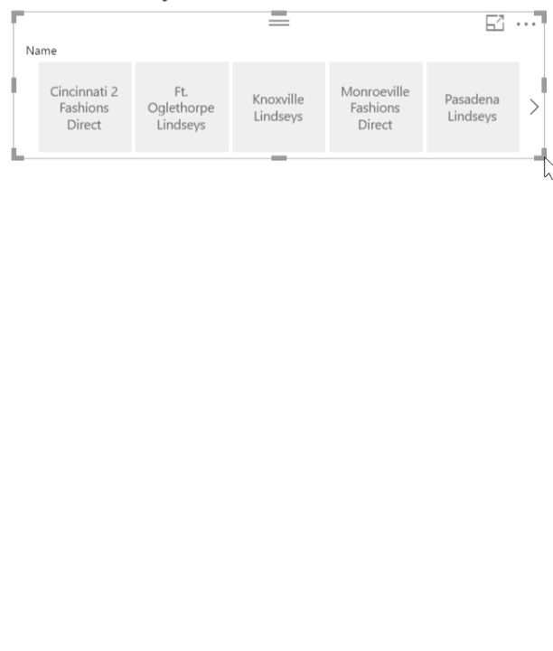
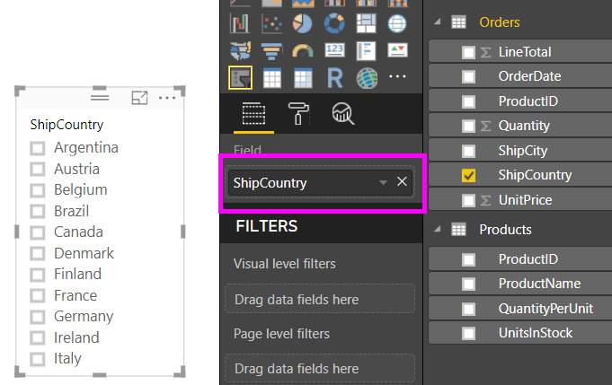
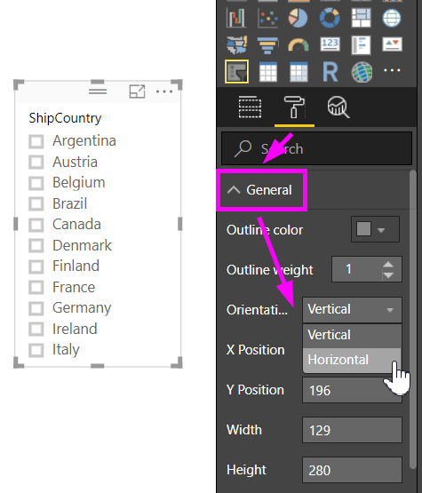
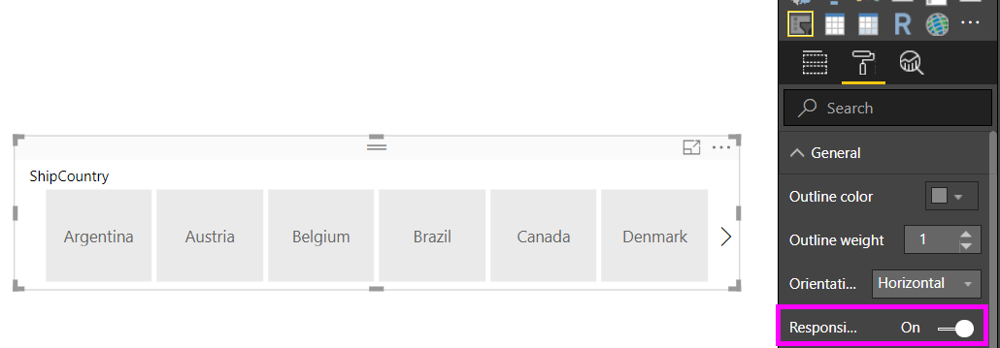
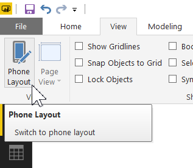
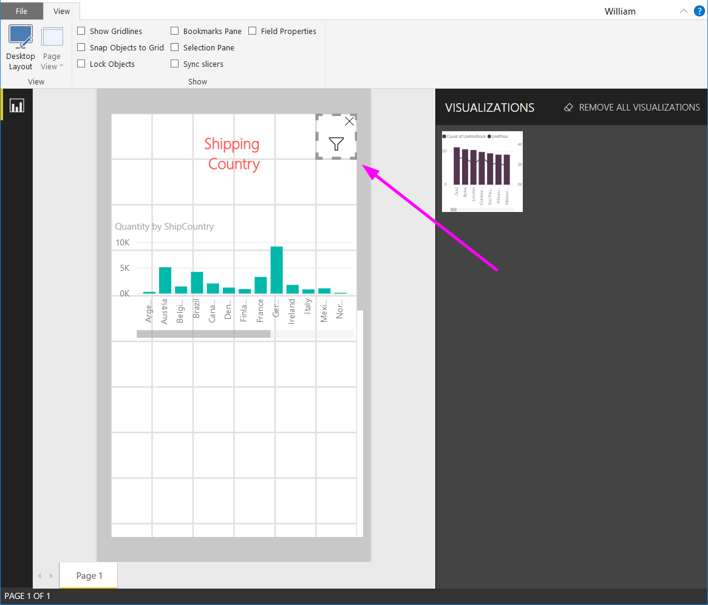

# สร้างตัวแบ่งส่วนข้อมูล คุณสามารถปรับขนาดใน Power BI ได้

[!INCLUDE [applies-to](../includes/applies-to.md)] [!INCLUDE [yes-desktop](../includes/yes-desktop.md)] [!INCLUDE [yes-service](../includes/yes-service.md)]

ตัวแบ่งส่วนข้อมูลแบบตอบสนองปรับขนาดให้พอดีกับพื้นที่บนรายงานของคุณ ตัวแบ่งส่วนข้อมูลแบบตอบสนอง คุณสามารถปรับขนาดให้มีหลายรูปร่างและขนาดที่แตกต่างกัน จากแนวนอนเป็นแนวตั้ง และค่าในตัวแบ่งส่วนข้อมูลได้จัดเรียงใหม่ด้วยตนเองเหมือนที่คุณทำอีกด้วย ใน Power BI Desktop และใน Power BI service คุณสามารถสร้างให้ตัวแบ่งส่วนข้อมูลแนวนอน และตัวแบ่งส่วนข้อมูลแบบตอบสนองตามวัน/ช่วงเวลา ตัวแบ่งส่วนข้อมูลตามวัน/ช่วงเวลา ยังได้ปรับปรุงพื้นที่สัมผัส ซึ่งง่ายต่อการเปลี่ยนแปลงด้วยปลายนิ้ว คุณสามารถทำให้ตัวแบ่งส่วนข้อมูลแบบตอบสนองเป็นขนาดเล็กหรือใหญ่ตามที่คุณต้อง แล้วพวกมันยังปรับขนาดโดยอัตโนมัติให้พอดีกับรายงาน ใน Power BI service และในแอป mobile Power BI 

## สร้างตัวแบ่งส่วนข้อมูล

ขั้นตอนแรกในการสร้างตัวแบ่งส่วนข้อมูลแบบไดนามิกคือสร้างตัวแบ่งส่วนข้อมูลพื้นฐาน 

1. เลือกไอคอน**ตัวแบ่งส่วนข้อมูล**ในบานหน้าต่าง**แสดงภาพ**
2. ลากเขตข้อมูลที่คุณต้องการไปยังตัวกรองบน**เขตข้อมูล**

    

## แปลงเป็นตัวแบ่งส่วนข้อมูลแนวนอน

1. ด้วยตัวแบ่งส่วนข้อมูลที่เลือกไว้ ในบานหน้าต่าง**แสดงภาพ** ให้เลือกแท็บ**รูปแบบ**
2. ขยายส่วน**ทั่วไป** แล้วสำหรับ**วางแนว** ให้เลือก**แนวนอน**

     

1.  คุณอาจจะต้องการทำให้กว้างขึ้น เพื่อแสดงค่าเพิ่มเติม

     

## ทำให้เป็นแบบตอบสนอง และทดลองใช้มัน

ขั้นตอนนี้เป็นเรื่องง่าย 

1. ที่ใต้**การจัดแนว**ในส่วน**ทั่วไป**ของแท็บ**รูปแบบ** สไลด์ค่า**ตอบสนอง**ไปยัง**เปิด**  

    

1. ในตอนนี้ คุณสามารถเล่นกับมัน ลากตรงมุมเพื่อทำให้สั้น สูง ความกว้างและแคบ ถ้าคุณปรับให้มีขนาดเล็กพอ จะกลายเป็นเพียงไอคอนตัวกรอง

    

## เพิ่มลงในเค้าโครงรายงานโทรศัพท์

ใน Power BI Desktop คุณสามารถสร้างเค้าโครงโทรศัพท์สำหรับแต่ละหน้าของรายงาน ถ้าหน้ามีเค้าโครงโทรศัพท์ จะแสดงบนโทรศัพท์มือถือในมุมมองแนวตั้ง ไม่เช่นนั้น คุณจำเป็นต้องดูในมุมมองแนวนอน 

1. ที่เมนู**มุมมอง** ให้เลือก**เค้าโครงโทรศัพท์**

     
    
1. ลากภาพทั้งหมดที่คุณต้องการในรายงานโทรศัพท์ลงในตาราง เมื่อคุณลากตัวแบ่งส่วนข้อมูลแบบตอบสนอง มันทำให้ได้ขนาดที่คุณต้องการ ในกรณีนี้ เป็นเพียงไอคอนตัวกรอง

    

อ่านเพิ่มเติมเกี่ยวกับการสร้าง[รายงานที่ปรับให้เหมาะสมสำหรับแอปอุปกรณ์เคลื่อนที่ Power BI](desktop-create-phone-report.md)

## สร้างตัวแบ่งส่วนข้อมูลแบบตอบสนองต่แเวลาหรือช่วงเวลา

คุณสามารถทำตามขั้นตอนเดียวกันเพื่อสร้างตัวแบ่งส่วนข้อมูลแบบตอบสนองต่อเวลาหรือช่วงเวลา หลังจากที่คุณตั้งค่า**การตอบสนอง**เป็น**เปิด** คุณจะสังเกตเห็นบางอย่าง

- ภาพได้ปรับลำดับของกล่องป้อนข้อมูลให้เหมาะสมโดยขึ้นอยู่กับขนาดที่อนุญาตให้ใช้บนพื้นที่ 
- แสดงองค์ประกอบข้อมูลที่ถูกปรับให้เหมาะสม เพื่อทำให้ตัวแบ่งส่วนข้อมูลใช้งานได้มากที่สุด ขึ้นอยู่กับขนาดที่อนุญาตบนพื้นที่ 
- แถบที่จับทรงกลมใหม่บนแถบเลื่อนที่ปรับการโต้ตอบแบบสัมผัสให้เหมาะสม 
- เมื่อรูปภาพเปลี่ยนขนาดจนเล็กเกินไปที่จะเป็นประโยชน์ จะกลายเป็นไอคอนที่แสดงชนิดภาพแทน เพื่อใช้งาน ก็แค่แตะครั้งสองครั้งเพื่อเปิดในโหมดโฟกัส ซึ่งช่วยประหยัดเนื้อที่อันมีค่าบนหน้ารายงานโดยไม่สูญเสียความสามารถการทำงาน

## ขั้นตอนถัดไป

- [ตัวแบ่งส่วนข้อมูลในบริการ Power BI](../visuals/power-bi-visualization-slicers.md)
- มีคำถามเพิ่มเติมหรือไม่ [ลองถามชุมชน Power BI](https://community.powerbi.com/)