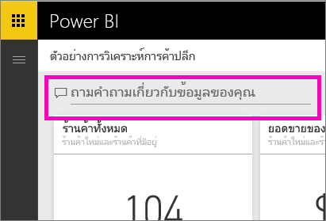
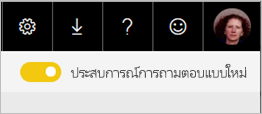
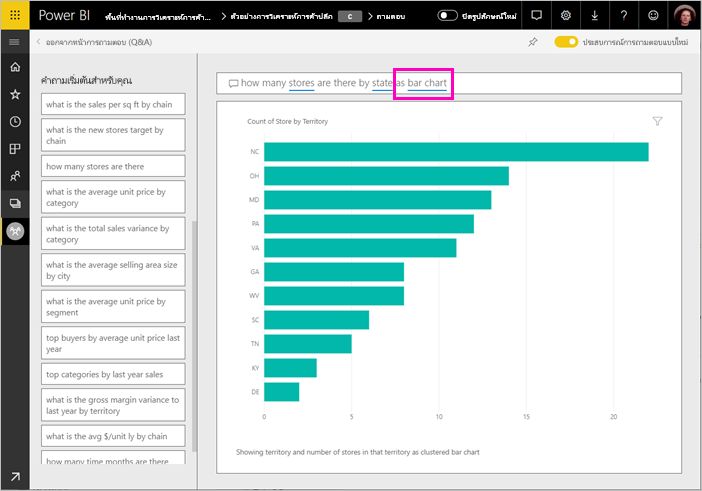
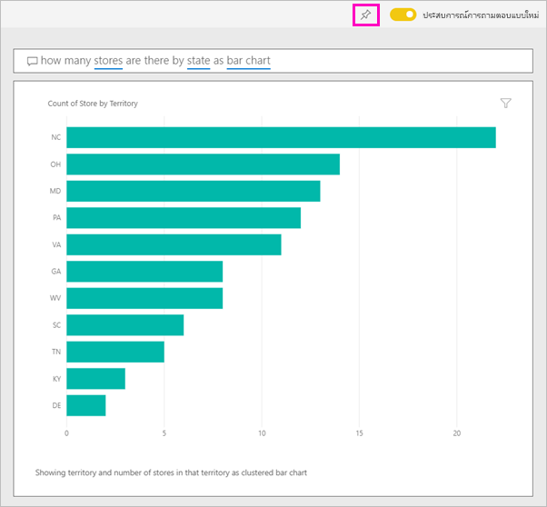

# ใช้ Power BI Q&A เพื่อสำรวจข้อมูลของคุณและสร้างวิชวล

ในบางครั้ง วิธีที่เร็วที่สุดในการให้ได้คำตอบจากข้อมูลของคุณคือ การถามคำถามโดยใช้ภาษาธรรมชาติ คุณลักษณะถามตอบ (Q&A) ใน Power BI ช่วยให้คุณสามารถสำรวจข้อมูลของคุณด้วยคำพูดของคุณเอง  ส่วนแรกของบทความนี้แสดงวิธีการใช้ถามตอบ (Q&A) ในแดชบอร์ดในบริการ Power BI ส่วนที่สองแสดงสิ่งที่คุณสามารถทำได้ด้วยถามตอบ (Q&A) เมื่อสร้างรายงานในบริการ Power BI หรือไม่ก็ Power BI Desktop สำหรับพื้นหลังเพิ่มเติม ดูบทความ [ถามตอบ (Q&A) สำหรับผู้บริโภค](../consumer/end-user-q-and-a.md) 

[Q&A ในแอป Power BI สำหรับอุปกรณ์เคลื่อนที่ ](../consumer/mobile/mobile-apps-ios-qna.md)และ[ Q&A ที่มี Power BI Embedded](../developer/embedded/qanda.md) ครอบคลุมในบทความต่างหาก 

ระบบถามตอบ (Q&A) เป็นระบบแบบโต้ตอบ แถมยังสนุกด้วย บ่อยครั้งที่คำถามหนึ่งนำไปสู่อีกคำถามหนึ่งเนื่องจากการแสดงผลข้อมูลด้วยภาพแสดงให้เห็นเส้นทางที่น่าสนใจในการติดตาม ดู Amanda สาธิตการใช้ถามตอบ เพื่อสร้างการแสดงภาพ เจาะลึกลงในวิชวลเหล่านั้น และปักหมุดวิชวลไปยังแดชบอร์ด

<iframe width="560" height="315" src="https://www.youtube.com/embed/qMf7OLJfCz8?list=PL1N57mwBHtN0JFoKSR0n-tBkUJHeMP2cP" frameborder="0" allowfullscreen></iframe>

## ส่วนที่ 1: ใช้ Q&A บนแดชบอร์ดในบริการของ Power BI

ในบริการของ Power BI (app.powerbi.com) แดชบอร์ดประกอบด้วย ไทล์ที่ปักหมุดจากชุดข้อมูลหนึ่งหรือหลายชุด ดังนั้นคุณสามารถถามคำถามเกี่ยวกับข้อมูลที่มีอยู่ในชุดข้อมูลใดๆ เหล่านั้น เพื่อดูว่ารายงานและชุดข้อมูลใดถูกใช้ในการสร้างแดชบอร์ด เลือก **ดูรายการที่เกี่ยวข้อง** จากแถบเมนู

กล่องคำถามของถามตอบ (Q&A) อยู่ที่มุมบนซ้ายของแดชบอร์ดคุณ และที่คุณพิมพ์คำถามของคุณโดยใช้ภาษาธรรมชาติ ไม่เห็นกล่องถามตอบ (Q&A) ใช่หรือไม่? โปรดดู [ข้อควรพิจารณาและการแก้ไขปัญหา](../consumer/end-user-q-and-a.md#considerations-and-troubleshooting) ในบทความ **ถามตอบ (Q&A) สำหรับผู้บริโภค**  ถามตอบ (Q&A) เข้าใจคำที่คุณพิมพ์เข้าไป และหาว่าที่ไหน (ชุดข้อมูลไหน) เพื่อค้นหาคำตอบ ถามตอบยังช่วยคุณสร้างคำถาม ด้วยการทำให้ข้อความสมบูรณ์โดยอัตโนมัติ การเปลี่ยนข้อความในคำถาม และการช่วยเหลืออื่น ๆ ทางข้อความหรือภาพ

คำตอบของคำถามคุณ จะแสดงเป็นการแสดงภาพแบบโต้ตอบ และจะปรับปรุงตามเมื่อคุณปรับเปลี่ยนคำถาม

1. เปิดแดชบอร์ด แล้ววางเคอร์เซอร์ของคุณในกล่องคำถาม ในมุมขวาบน ให้เลือก **ประสบการณ์การใช้งานถามตอบ (Q&A) แบบใหม่**

    

1. ถึงแม้ว่าคุณยังไม่เริ่มพิมพ์ ถามตอบจะแสดงหน้าจอใหม่ ด้วยคำแนะนำเพื่อช่วยคุณสร้างคำถามของคุณ คุณเห็นวลีและคำถามทั้งหมดที่มีชื่อของตารางในชุดข้อมูลเบื้องต้น และอาจเห็นรายการคำถามทั้งหมด ถ้าเจ้าของชุดข้อมูลสร้าง[คำถามที่น่าสนใจ](service-q-and-a-create-featured-questions.md)ไว้แล้ว

   

   คุณสามารถเลือกหนึ่งในคำถามเหล่านี้เป็นจุดเริ่มต้น และปรับแต่งคำถามต่อไปเพื่อค้นหาคำตอบเฉพาะ หรือใช้ชื่อตารางเพื่อช่วยคุณในการใช้ถ้อยคำสำหรับการตั้งคำถามใหม่

2. เลือกจากรายการคำถาม หรือเริ่มพิมพ์คำถามของคุณเอง แล้วเลือกจากคำแนะนำในรายการดรอปดาวน์

   

3. ในขณะที่คุณพิมพ์คำถาม ถามตอบ (Q&A) จะเลือกการแสดงผลข้อมูลด้วยภาพที่ดีที่สุดเพื่อแสดงคำถามของคุณ

   

4. การแสดงผลข้อมูลด้วยภาพจะเปลี่ยนแปลงแบบไดนามิกเมื่อคุณปรับเปลี่ยนคำถาม

   

1. เมื่อคุณพิมพ์คำถาม Power BI จะค้นหาคำตอบที่ดีที่สุด โดยใช้ชุดข้อมูลใด ๆ ที่มีไทล์อยู่บนแดชบอร์ดนั้น  ถ้าไทล์ทั้งหมดมาจาก*ชุดข้อมูล A* คำตอบของคุณจะมาจาก*ชุดข้อมูล A*  ถ้ามีไทล์จากทั้ง*ชุดข้อมูล A* และ*ชุดข้อมูล B* ถามตอบ (Q&A) จะค้นหาคำตอบที่ดีที่สุดจากชุดข้อมูลทั้ง 2 นั้น

   > [!TIP]
   > ดังนั้นโปรดระวัง ถ้าคุณมีไทล์หนึ่งจาก*ชุดข้อมูล A* และคุณเอาออกจากแดชบอร์ดของคุณ ถามตอบจะไม่สามารถเข้าถึง*ชุดข้อมูล A* ได้อีก
   >

5. เมื่อคุณพอใจกับผลลัพธ์ ให้ปักหมุดการแสดงผลข้อมูลด้วยภาพไปยังแดชบอร์ด โดยการเลือกไอคอนรูปเข็มหมุดในมุมบนขวา ถ้าแดชบอร์ดถูกแชร์ให้กับคุณ หรือเป็นส่วนหนึ่งของแอป คุณจะไม่สามารถปักหมุดได้

   

## ส่วนที่ 2: ใช้ Q&A ในรายงาน ในบริการของ Power BI หรือ Power BI Desktop

ใช้ถามตอบ เพื่อสำรวจชุดข้อมูลของคุณ และเพิ่มการแสดงภาพไปยังรายงาน และแดชบอร์ด รายงานจะมาจากชุดข้อมูลเดียว และอาจเป็นรายงานเปล่า หรือประกอบด้วยหน้าต่าง ๆ ที่เต็มไปด้วยการแสดงภาพ แต่เพียงเพราะว่ารายงานว่างเปล่า ไม่ได้หมายความว่าไม่มีข้อมูลใด ๆ ที่คุณสามารถสำรวจได้ - ชุดข้อมูลเชื่อมโยงกับรายงาน และกำลังรอให้คุณสำรวจ และสร้างการแสดงภาพ  เพื่อดูว่าชุดข้อมูลไหนใช้สร้างรายงาน เปิดรายงานในมุมมองการอ่านในบริการของ Power BI แล้วเลือก**ดูรายการที่เกี่ยวข้อง**จากแถบเมนู

หากต้องการใช้ถามตอบ (Q&A) ในรายงาน คุณต้องมีสิทธิ์ในการแก้ไขสำหรับ รายงานและชุดข้อมูลพื้นฐาน ในบทความ [ถามตอบ (Q&A) สำหรับผู้บริโภค](../consumer/end-user-q-and-a.md) เราอ้างถึงสิ่งนี้ว่าเป็นสถานการณ์จำลองของ*ผู้สร้าง* หากคุณ*กำลังใช้งาน*รายงานที่แบ่งปันกับคุณแทน ถามตอบ (Q&A) จะไม่สามารถใช้งานได้

1. เปิดรายงานในมุมมองการแก้ไข (บริการ Power BI) หรือมุมมองรายงาน (Power BI Desktop) และเลือก **ถามคำถาม** จากแถบเมนู

    **Power BI Desktop**    
    

    **บริการ**    
    

2. กล่องคำถามถามตอบ จะแสดงบนพื้นที่รายงานของคุณ ในตัวอย่างด้านล่าง กล่องคำถามแสดงอยู่เหนือการแสดงภาพอื่น ซึ่งยอมรับได้ แต่จะเป็นการดีกว่าถ้าเพิ่มหน้าเปล่าลงในรายงานก่อนที่ถามคำถาม

    

3. วางเคอร์เซอร์ของคุณในกล่องคำถาม ขณะที่คุณพิมพ์ ถามตอบจะแสดงคำแนะนำ เพื่อช่วยคุณสร้างคำถามของคุณ

   

4. ขณะที่คุณพิมพ์คำถาม ถามตอบจะเลือก[การแสดงภาพ](../visuals/power-bi-visualization-types-for-reports-and-q-and-a.md)ที่ดีที่สุด เพื่อแสดงคำตอบของคุณ และการแสดงภาพจะเปลี่ยนตาม ขณะที่คุณปรับเปลี่ยนคำถาม

   

5. เมื่อคุณมีการแสดงภาพที่คุณชอบ เลือก ENTER เพื่อบันทึกการแสดงภาพลงรายงาน เลือก**ไฟล์ > บันทึก**

6. โต้ตอบกับการแสดงภาพใหม่ ไม่สำคัญว่าคุณได้สร้างการแสดงภาพด้วยวิธีไหน -- ทั้งหมดจะมีการโต้ตอบ จัดรูปแบบ และคุณลักษณะที่เหมือนกัน

   

   ถ้าคุณได้สร้างการแสดงภาพในบริการของ Power BI คุณสามารถ[ปักหมุดไปยังแดชบอร์ด](service-dashboard-pin-tile-from-q-and-a.md)ได้

## บอกการถามตอบว่าต้องใช้การแสดงภาพแบบใด
ด้วยถามตอบ ไม่เพียงแต่คุณสามารถขอให้ข้อมูลคุณพูดออกมาด้วยตัวเอง คุณสามารถบอกวิธีที่ Power BI จะแสดงคำตอบได้ เพียงแค่เพิ่ม "as a <visualization type>" ตรงท้ายคำถามของคุณ  ตัวอย่างเช่น "show inventory volume by plant as a map" และ "show total inventory as a card"  ลองทำด้วยตัวเองดู

## ข้อควรพิจารณาและการแก้ไขปัญหา
- ถ้าคุณได้เชื่อมต่อชุดข้อมูลโดยใช้การเชื่อมต่อสด หรือใช้เกตเวย์ ถามตอบจะต้อง[เปิดใช้งานสำหรับชุดข้อมูลนั้น](service-q-and-a-direct-query.md)

- คุณได้เปิดรายงาน และไม่เห็นตัวเลือกการถามตอบ ถ้าคุณกำลังใช้บริการของ Power BI ตรวจสอบทำให้แน่ใจว่า รายงานเปิดในมุมมองการแก้ไข ถ้าคุณไม่สามารถเปิดรายงานในมุมมองการแก้ไข นั่นหมายความว่า คุณไม่มีสิทธิ์ในการแก้ไขรายงานนั้น และคุณไม่สามารถใช้ถามตอบ (Q&A) กับรายงานเฉพาะนั้นได้

## ขั้นตอนถัดไป

- [การถามตอบสำหรับผู้ใช้](../consumer/end-user-q-and-a.md)   
- [เคล็ดลับการถามคำถามในถามตอบ (Q&A)](../consumer/end-user-q-and-a-tips.md)   
- [เตรียมเวิร์กบุ๊กสำหรับการถามตอบ](service-prepare-data-for-q-and-a.md)  
- [เตรียมชุดข้อมูลภายในองค์กรสำหรับถามตอบ (Q&A)](service-q-and-a-direct-query.md)   
- [ปักหมุดไทล์ไปยังแดชบอร์ดจากถามตอบ (Q&A)](service-dashboard-pin-tile-from-q-and-a.md)
