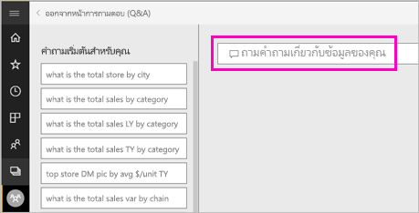
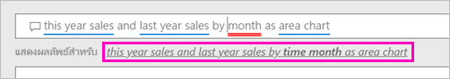
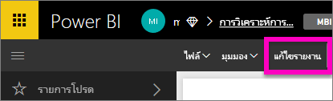
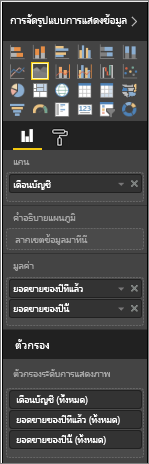

# สร้างวิชวลด้วย Power BI Q&A

ในบางครั้ง วิธีที่เร็วที่สุดในการให้ได้คำตอบจากข้อมูลของคุณคือ การถามคำถามโดยใช้ภาษาธรรมชาติ  ในบทความนี้ เราจะมาดูวิธีการที่แตกต่างกันสองวิธีในการสร้างการแสดงผลข้อมูลด้วยภาพชนิดเดียวกัน: วิธีแรก ถามคำถามกับถามตอบ (Q&A) และวิธีที่สอง สร้างในรายงาน เราใช้บริการ Power BI เพื่อสร้างวิชวลในรายงาน แต่กระบวนการเกือบจะเหมือนกันทั้งหมดกับการใช้ Power BI Desktop

ในการทำตาม คุณต้องใช้รายงานที่คุณสามารถแก้ไขได้ ดังนั้นเราจะใช้หนึ่งในตัวอย่างที่พร้อมใช้งานกับ Power BI

## สร้างการแสดงผลด้วยภาพด้วยการถามตอบ

เราจะทำอย่างไรในการสร้างแผนภูมิเส้นนี้โดยใช้ถามตอบ (Q&A)?

1. จากพื้นที่ทำงานของ Power BI เลือก**รับข้อมูล** \> **ตัวอย่าง** \> **ตัวอย่างการวิเคราะห์ร้านค้าปลีก**  >  **เชื่อมต่อ**

1. เปิดแดชบอร์ดตัวอย่างการวิเคราะห์ร้านค้าปลีก และวางเคอร์เซอร์ของคุณในกล่องถามตอบ (Q&A) **ถามคำถามเกี่ยวกับข้อมูลของคุณ**

    

2. ในกล่องถามตอบ (Q&A) ให้พิมพ์บางสิ่งบางอย่างเช่นคำถามนี้:
   
    **ยอดขายในปีนี้และยอดขายในปีที่แล้วตามเดือนโดยแสดงเป็นแผนภูมิพื้นที่**
   
    ขณะที่คุณพิมพ์คำถามของคุณ การถามตอบจะเลือกการแสดงภาพที่ดีที่สุดเพื่อแสดงคำตอบของคุณ และการแสดงภาพจะเปลี่ยนแปลงอย่างต่อเนื่องขณะที่คุณเปลี่ยนคำถามของคุณ นอกจากนี้ การถามตอบยังช่วยให้คุณสามารถจัดรูปแบบคำถามของคุณตามคำแนะนำ การกรอกข้อมูลอัตโนมัติ และการแก้ไขการสะกด ถามตอบ (Q&A) แนะนำให้ใช้การเปลี่ยนแปลงถ้อยคำเล็กน้อย: "ยอดขายในปีนี้และยอดขายในปีที่แล้วตาม*เดือนเวลา*โดยแสดงเป็นแผนภูมิพื้นที่"  

    

4. เลือกประโยคเพื่อยอมรับคำแนะนำ 
   
   เมื่อคุณพิมพ์คำถามของคุณเสร็จแล้ว ผลลัพธ์จะแสดงเป็นแผนภูมิเดียวกับที่คุณเห็นในแดชบอร์ด
   
   

4. เมื่อต้องการปักหมุดแผนภูมิไปยังแดชบอร์ด เลือกไอคอนปักหมุด  ที่มุมขวาบน

## สร้างวิชวลในตัวแก้ไขรายงาน

1. นำทางกลับไปยังแดชบอร์ดตัวอย่างการวิเคราะห์ร้านค้าปลีก
   
2. แดชบอร์ดประกอบด้วยไทล์แผนภูมิพื้นที่เดียวกันสำหรับ "ยอดขายของปีที่แล้วและยอดขายของปีนี้"  เลือกไทล์นี้ อย่าเลือกไทล์ที่คุณสร้างขึ้นด้วยถามตอบ (Q&A) การเลือกจะเปิดถามตอบ (Q&A) ไทล์แผนภูมิพื้นที่ดั้งเดิมถูกสร้างขึ้นในรายงาน ดังนั้นรายงานจะเปิดไปยังหน้าที่ประกอบด้วยการแสดงภาพนี้

    

1. เปิดรายงานในมุมมองการแก้ไขโดยการเลือก**แก้ไขรายงาน**  ถ้าคุณไม่ได้เป็นเจ้าของรายงาน คุณจะไม่มีตัวเลือกในการเปิดรายงานในมุมมองแก้ไข
   
    
4. เลือกแผนภูมิพื้นที่และตรวจทานการตั้งค่าในพื้นที่**เขตข้อมูล**  ผู้สร้างรายงานสร้างแผนภูมินี้โดยการเลือกทั้งสามค่านี้ (**ยอดขายปีที่แล้ว** และ **ยอดขายในปีนี้ > ค่า** จากตาราง **ยอดขาย** และ **เดือนทางบัญชี** จากตาราง **เวลา**) และจัดระเบียบพวกเขาในพื้นที่ **แกน** และ **ค่า**
   
    

    คุณเห็นพวกเขาจบลงด้วยวิชวลที่เหมือนกัน การสร้างแบบนี้ไม่ซับซ้อนเกินไป แต่การสร้างด้วยถามตอบ (Q&A) นั้นง่ายกว่า!

## ขั้นตอนถัดไป

- [ใช้การถามตอบในแดชบอร์ดและรายงาน](power-bi-tutorial-q-and-a.md)  
- [การถามตอบสำหรับผู้ใช้](../consumer/end-user-q-and-a.md)
- [ทำให้ข้อมูลของคุณทำงานได้ดีกับการถามตอบใน Power BI](service-prepare-data-for-q-and-a.md)

มีคำถามเพิ่มเติมหรือไม่ [ลองไปที่ชุมชน Power BI](https://community.powerbi.com/)
