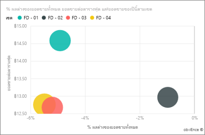

# ตัวอย่างการวิเคราะห์ด้านการขายปลีก - Power BI: ชมการแนะนำ

ชุดเนื้อหาตัวอย่างการวิเคราะห์การขายปลีกประกอบด้วยแดชบอร์ด รายงาน และชุดข้อมูลที่วิเคราะห์ข้อมูลการขายปลีกของสินค้าที่ขายในหลายร้านค้าและเขต The metrics compare this year's performance to last year's for sales, units, gross margin, and variance, as well as new-store analysis. 

ตัวอย่างนี้เป็นส่วนหนึ่งของชุดตัวอย่าง ที่แสดงให้เห็นวิธีการที่คุณสามารถใช้ Power BI กับข้อมูล รายงาน และแดชบอร์ดที่เกี่ยวข้องกับธุรกิจ ซึ่งสร้างขึ้นโดย [obviEnce](http://www.obvience.com/) ด้วยข้อมูลจริงที่ไม่มีการระบุชื่อ ข้อมูลมีให้ใช้งานหลายรูปแบบ: ชุดเนื้อหา ไฟล์ Power BI Desktop .pbix หรือเวิร์กบุ๊ก Excel ดู [ตัวอย่างสำหรับ Power BI](sample-datasets.md) 

บทช่วยสอนนี้จะสำรวจชุดเนื้อหาของตัวอย่างการวิเคราะห์การขายปลีกในบริการของ Power BI เนื่องจากประสบการณ์การใช้รายงานจะคล้ายคลึงกันใน Power BI Desktop ดังนั้นคุณสามารถใช้ Power BI Desktop กับไฟล์ .pbix ตัวอย่างใน Power BI Desktop ได้ 

คุณไม่จำเป็นต้องมีสิทธิการใช้งาน Power BI ในการสำรวจตัวอย่างใน Power BI Desktop ถ้าคุณไม่มีสิทธิการใช้งาน Power BI Pro คุณสามารถบันทึกตัวอย่างไปยังพื้นที่ทำงานของฉันในบริการของ Power BI ได้ 

## รับตัวอย่าง

 ก่อนที่คุณสามารถใช้ตัวอย่าง คุณต้องดาวน์โหลดในรูปแบบ[ชุดเนื้อหา](#get-the-content-pack-for-this-sample)[ไฟล์ .pbix](#get-the-pbix-file-for-this-sample) หรือ[เวิร์กบุ๊ก Excel](#get-the-excel-workbook-for-this-sample)

### รับชุดเนื้อหาสำหรับตัวอย่างนี้

1. เปิดบริการ Power BI (app.powerbi.com) ลงชื่อเข้าใช้ และเปิดพื้นที่ทำงานที่คุณต้องการบันทึกตัวอย่าง 

    ถ้าคุณไม่มีสิทธิการใช้งาน Power BI Pro คุณสามารถบันทึกตัวอย่างไปยังพื้นที่ทำงานของฉัน

2. ที่มุมด้านล่างซ้าย เลือก**รับข้อมูล**

    
3. บนหน้า **รับข้อมูล** ที่ปรากฏขึ้น เลือก **ตัวอย่าง**
   
4. เลือก**ตัวอย่างการวิเคราะห์ด้านการขายปลีก** และเลือก**เชื่อมต่อ**  
  
   
   
5. Power BI นำเข้าชุดเนื้อหา จากนั้นเพิ่มแดชบอร์ด รายงาน และชุดข้อมูลใหม่ไปยังพื้นที่ทำงานปัจจุบันของคุณ
   
   
  
### รับไฟล์ .pbix สำหรับตัวอย่างนี้

อีกทางเลือกหนึ่งคือ คุณสามารถดาวน์โหลดตัวอย่างการวิเคราะห์การขายปลีกเป็น[ไฟล์ .pbix](https://download.microsoft.com/download/9/6/D/96DDC2FF-2568-491D-AAFA-AFDD6F763AE3/Retail%20Analysis%20Sample%20PBIX.pbix) ซึ่งได้รับการออกแบบมาสำหรับใช้กับ Power BI Desktop 

### รับเวิร์กบุ๊ก Excel สำหรับตัวอย่างนี้

ถ้าคุณต้องการดูแหล่งข้อมูลสำหรับตัวอย่างนี้ ตัวอย่างนี้ยังมีให้ในรูปแบบ[เวิร์กบุ๊ก Excel](https://go.microsoft.com/fwlink/?LinkId=529778) เวิร์กบุ๊กประกอบด้วยแผ่นงาน Power View ที่คุณสามารถดู และปรับเปลี่ยน หากต้องการดูข้อมูลดิบ ให้เปิดใช้งาน add-in การวิเคราะห์ข้อมูล แล้วจากนั้นเลือก**Power Pivot > จัดการ** หากต้องการเปิดใช้งาน Power View และ Power Pivot add-in โปรดดู [สำรวจตัวอย่าง Excel ใน Excel ](sample-datasets.md#explore-excel-samples-inside-excel)สำหรับรายละเอียด

## เริ่มต้นที่แดชบอร์ดและเปิดรายงาน

1. ในพื้นที่ทำงานที่คุณบันทึกตัวอย่าง เปิดแท็บ **แดชบอร์ด** จาก นั้นค้นหาแดชบอร์ด**ตัวอย่างการวิเคราะห์การขายปลีก** และเลือก 
2. บนแดชบอร์ด เลือกไทล์ **รวมร้านค้าใหม่ & ร้านค้าที่มีอยู่**ไทล์ ซึ่งเปิดขึ้นในหน้า **ภาพรวมยอดขายของร้านค้า**ในรายงานตัวอย่างการวิเคราะห์การขายปลีก 

     

   บนหน้ารายงานนี้ คุณจะเห็นว่าเรามีร้านค้าทั้งหมด 104 แห่ง ซึ่ง 10 ร้านเป็นร้านใหม เรามีสองเชนธุรกิจ นั่นคือ Fashions Direct และ Lindseys ร้านค้า Fashions Direct มีขนาดใหญ่กว่าเมื่อดูโดยเฉลี่ยแล้ว
3. ในแผนภูมิวงกลม**ยอดขายของปีนี้ตามห่วงโซ่** เลือก**Fashions Direct**

     

   สังเกตผลลัพธ์ในแผนภูมิฟอง **% ผลต่างของยอดขายรวม**:

     

   เขต **FD-01** มี **ยอดขายเฉลี่ยต่อตารางฟุตสูงสุด** ส่วน FD-02 มี **ค่าความแปรปรวนของยอดขายรวม**ต่ำสุด เมื่อเปรียบเทียบกับปีที่แล้ว FD-03 และ FD-04 มีผลประกอบการโดยรวมแย่ที่สุด
4. เลือกแต่ละฟองหรือแผนภูมิอื่น ๆ เพื่อดูการไฮไลท์ข้าม ซึ่งเผยให้เห็นผลกระทบของการเลือกของคุณ
5. เลือก**ตัวอย่างการวิเคราะห์การขายปลีก** จากบานหน้าต่างนำทางด้านบนเพื่อกลับไปยังแดชบอร์ด

   
6. บนแดชบอร์ด เลือกไทล์ **ร้านค้าที่มีอยู่และร้านค้าใหม่ของปีนี้** ซึ่งมีค่าเท่ากับการพิมพ์*ยอดขายของปีนี้*ในกล่องคำถามถามตอบ

   

   ผลลัพธ์การถามตอบจะปรากฏขึ้น:

   

## ตรวจทานไทล์ที่สร้างขึ้นด้วย Power BI ถามตอบ
เรามาดูแบบเฉพาะเจาะจงมากขึ้นกัน

1. เปลี่ยนคำถามเป็น_ยอดขายของปีนี้**ตามเขต**_ สังเกตผลลัพธ์: ระบบถามตอบจะใส่คำตอบในแผนภูมิแท่งและแนะนำวลีอื่น ๆ โดยอัตโนมัติ:

   
2. ตอนนี้เปลี่ยนคำถามเป็น_ยอดขายของปีนี้**แยกตามเขตพื้นที่และเชนธุรกิจ**_

   โปรดสังเกตวิธีการที่ Power BI ตอบคำถามขณะที่คุณพิมพ์และแสดงแผนภูมิที่เหมาะสม
3. ลองใช้คำถามเพิ่มเติมและดูประเภทของผลลัพธ์ที่คุณได้
4. เมื่อคุณพร้อมแล้ว ให้ย้อนกลับไปยังแดชบอร์ด

## เจาะลึกลงในข้อมูลนั้น
ตอนนี้เรามาสำรวจในระดับที่ละเอียดยิ่งขึ้นโดยดูที่การดำเนินการของแต่ละเขต

1. บนแดชบอร์ด เลือกไทล์ **ยอดขายของปีนี้ ยอดขายของปีที่แล้ว** ซึ่งเปิดหน้า**ยอดขายรายเดือนของเขต**ของรายงาน

   

   ในแผนภูมิ **% ผลต่างของยอดขายรวมตามเดือนงบประมาณ** สังเกตว่ามีการแปรผันอย่างมากเกี่ยวกับ % ผลต่างเมื่อเปรียบเทียบกับปีที่แล้ว กับมกราคม เมษายน และกรกฎาคม ซึ่งเป็นเดือนที่มีผลประกอบการไม่ดี

   

   มาดูว่าเราสามารถดูรายละเอียดได้หรือไม่ว่าปัญหามาจากที่ใด
2. ในแผนภูมิฟอง เลือกแบบฟอง **020-Mens**

     

   สังเกตว่าแม้สินค้าในหมวดสินค้าผู้ชายไม่ได้รับผลกระทบอย่างร้ายแรงในเดือนเมษายนตามผลประกอบการธุรกิจโดยรวม แต่เดือนมกราคมและกรกฎาคมยังคงเป็นเดือนที่มีปัญหา
1. เลือกแบบฟอง **010-Womens**

   

   คุณจะสังเกตเห็นว่าสินค้าในหมวดสินค้าผู้หญิงนั้นมีผลประกอบการแย่กว่าผลประกอบการโดยรวมในทุกเดือน และแย่กว่ามากในเกือบทุกเดือนเมื่อเทียบกับปีก่อนหน้านี้
1. เลือกแผนภูมิฟองอีกครั้งเพื่อล้างตัวกรอง

## ลองใช้ตัวแบ่งส่วนข้อมูล
มาดูว่าในบางเขตมีผลประกอบการเป็นอย่างไรบ้าง

1. เลือก **Allan Guinot** ในตัวแบ่งส่วนข้อมูล**ผู้จัดการเขต**ด้านบนซ้าย

   

   โปรดทราบว่าเขตของ Allan มีผลประกอบการที่ดีกว่าที่อื่นในเดือนมีนาคมและเดือนมิถุนายน เทียบกับปีที่แล้ว
2. เมื่อยังคงเลือก **Allan Guinot** ให้เลือกแบบฟอง **Womens-10** ในแผนภูมิฟอง

   

   Notice that for the Womens-10 category, Allan's district didn't meet last year's volume.
3. สำรวจผู้จัดการเขตอื่นและสินค้าหมวดอื่น ข้อมูลเชิงลึกอื่น ๆ ที่คุณสามารถค้นหาได้ มีอะไรบ้าง?
4. เมื่อคุณพร้อมแล้ว ให้ย้อนกลับไปยังแดชบอร์ด

## ข้อมูลระบุเกี่ยวกับการเพิ่มยอดขายปีนี้
ส่วนสุดท้ายที่เราต้องการสำรวจคือการเติบโตของเรา โดยการสำรวจร้านค้าใหม่ ๆ ที่เปิดขึ้นในปีนี้

1. เลือกไทล์ **ร้านค้าที่เปิดในปีนี้ตามเดือนเปิด, เชนธุรกิจ** ซึ่งเปิดหน้า**การวิเคราะห์ร้านค้าใหม่**ของรายงาน

   

   มีร้านค้าของ Fashions Direct เปิดขึ้นในปีนี้มากกว่าร้านค้าของ Lindseys โดยเราจะเห็นได้ชัดเจนจากไทล์
2. สำรวจแผนภูมิ **ยอดขายต่อตารางฟุตแยกตามชื่อ**:

   

    โปรดสังเกตความแตกต่างในยอดขาย/ตารางฟุตโดยเฉลี่ยทั่วทั้งร้านค้าใหม่
3. เลือกรายการคำอธิบายแผนภูมิ **Fashions Direct** ในแผนภูมิด้านบนขวา **จำนวนร้านค้าที่เปิดตามเดือนที่เปิดและเชนธุรกิจ** โปรดสังเกตว่าแม้แต่ธุรกิจเชนเดียวกัน ร้านค้าที่ดีที่สุด (Winchester Fashions Direct) มีผลประกอบการดีกว่าร้านค้าที่มีผลประกอบการแย่อย่างมีนัยสำคัญ (Cincinnati 2 Fashions Direct) โดยมีผลประกอบการ $21.22 เทียบกับ $12.86 ตามลำดับ

   
4. เลือก**Winchester Fashions Direct**ในตัวแบ่งส่วนข้อมูล**ชื่อ** และสังเกตแผนภูมิเส้น มีการรายงานตัวเลขยอดขายแรกในเดือนกุมภาพันธ์
5. เลือก **Cincinnati 2 Fashions Direct** ในตัวแบ่งส่วนข้อมูล และสังเกตในแผนภูมิเส้นว่าร้านค้านี้เปิดในเดือนมิถุนายน และดูเหมือนว่าเป็นร้านที่มีผลประกอบการแย่ที่สุด
6. สำรวจโดยการเลือกแถบ เส้นและฟองอื่น ๆ ตลอดทั้งแผนภูมิและดูข้อมูลเชิงลึกที่คุณสามารถค้นหาได้

## ขั้นตอนถัดไป: เชื่อมต่อไปยังข้อมูลของคุณ
สภาพแวดล้อมนี้มีความปลอดภัยให้ดำเนินการต่าง ๆ ได้ เนื่องจากคุณสามารถเลือกที่จะไม่บันทึกการเปลี่ยนแปลงของคุณ ถ้าคุณบันทึก คุณสามารถเลือก **รับข้อมูล** สำหรับสำเนาชุดใหม่ของตัวอย่างนี้ได้เสมอ

เราหวังว่าการแนะนำนี้ได้แสดงให้เห็นว่าแดชบอร์ด Q&A และรายงาน Power BI สามารถให้ข้อมูลเชิงลึกในข้อมูลตัวอย่าง ตอนนี้ถึงตาคุณแล้ว ลองเชื่อมต่อกับข้อมูลของคุณเอง ด้วย Power BI คุณสามารถเชื่อมต่อกับแหล่งข้อมูลที่หลากหลาย เมื่อต้องการเรียนรู้เพิ่มเติม ดู[เริ่มต้นใช้งานบริการ Power BI](../fundamentals/service-get-started.md)
