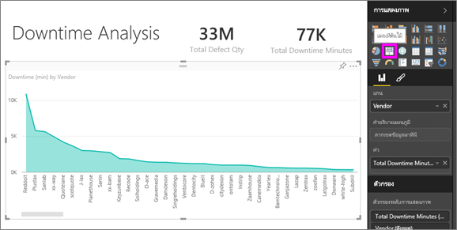
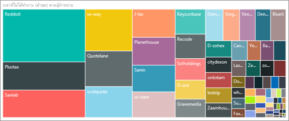
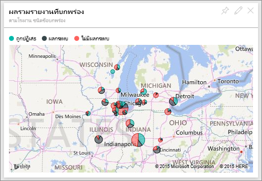
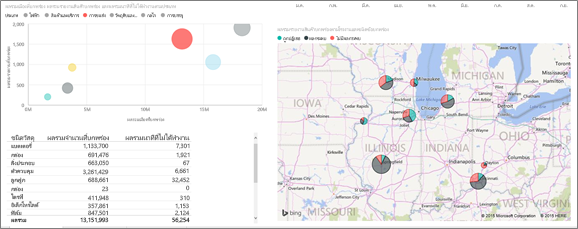
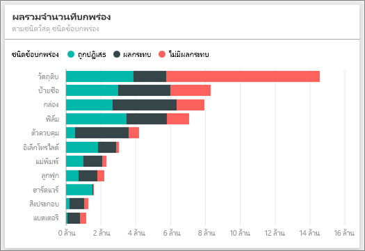
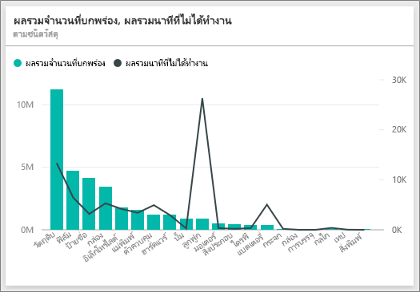
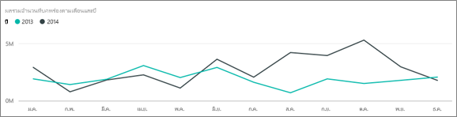
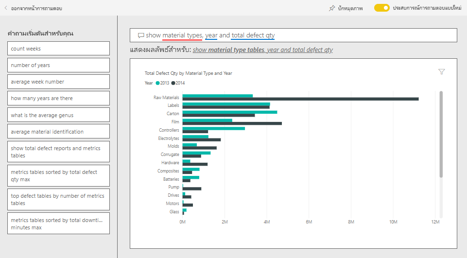
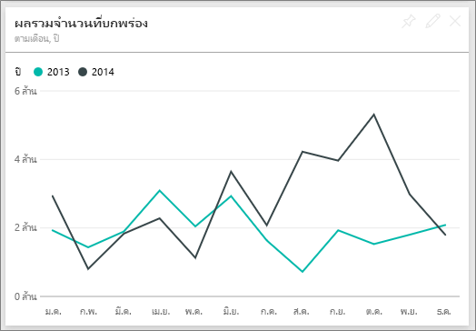
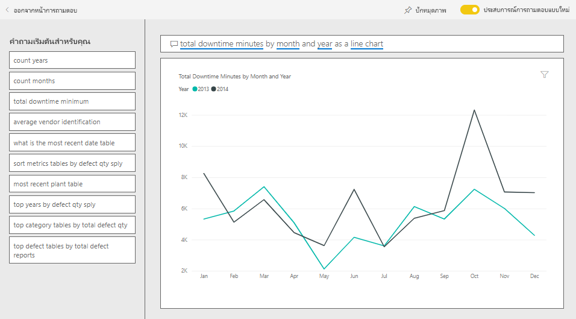

# ตัวอย่างการวิเคราะห์คุณภาพผู้จัดหาสินค้าสำหรับ Power BI: ชมการแนะนำ

แดชบอร์ดตัวอย่างสำหรับอุตสาหกรรมนี้และรายงานเบื้องต้นเน้นไปที่หนึ่งในความท้าทายของห่วงโซ่อุปทานทั่วไป: การวิเคราะห์คุณภาพผู้จัดหาสินค้า การวิเคราะห์นี้ใช้เมตริกหลักสองอย่าง: ผลรวมจำนวนที่บกพร่องและผลรวมเวลาที่ไม่ได้ทำงานที่เกิดขึ้นจากข้อบกพร่องเหล่านี้ 

ตัวอย่างนี้มีสองวัตถุประสงค์หลัก:

* ทำความเข้าใจว่า ใครเป็นผู้จัดหาสินค้าที่มีคุณภาพดีที่สุดและแย่ที่สุด
* ระบุโรงงานไหนสามารถค้นพบและปฏิเสธวัสดุที่มีข้อบกพร่องได้ดีกว่า เพื่อลดเวลาที่ต้องหยุดทำงาน

ตัวอย่างนี้เป็นส่วนหนึ่งของชุดตัวอย่าง ที่แสดงให้เห็นวิธีการที่คุณสามารถใช้ Power BI กับข้อมูล รายงาน และแดชบอร์ดที่เกี่ยวข้องกับธุรกิจ ซึ่งสร้างขึ้นโดย [obviEnce](http://www.obvience.com/) ด้วยข้อมูลจริงที่ไม่มีการระบุชื่อ ข้อมูลมีให้ใช้งานหลายรูปแบบ: ชุดเนื้อหา ไฟล์ Power BI Desktop .pbix หรือเวิร์กบุ๊ก Excel ดู [ตัวอย่างสำหรับ Power BI](sample-datasets.md) 

บทช่วยสอนนี้จะสำรวจชุดเนื้อหาของตัวอย่างการวิเคราะห์คุณภาพผู้จัดหาสินค้าในบริการของ Power BI เนื่องจากประสบการณ์การใช้รายงานจะคล้ายคลึงกันใน Power BI Desktop ดังนั้นคุณสามารถใช้ Power BI Desktop กับไฟล์ .pbix ตัวอย่างใน Power BI Desktop ได้ 

คุณไม่จำเป็นต้องมีสิทธิการใช้งาน Power BI ในการสำรวจตัวอย่างใน Power BI Desktop ถ้าคุณไม่มีสิทธิการใช้งาน Power BI Pro คุณสามารถบันทึกตัวอย่างไปยังพื้นที่ทำงานของฉันในบริการของ Power BI ได้ 

## รับตัวอย่าง

ก่อนที่คุณสามารถใช้ตัวอย่าง คุณต้องดาวน์โหลดในรูปแบบ[ชุดเนื้อหา](#get-the-content-pack-for-this-sample)[ไฟล์ .pbix](#get-the-pbix-file-for-this-sample) หรือ[เวิร์กบุ๊ก Excel](#get-the-excel-workbook-for-this-sample)

### รับชุดเนื้อหาสำหรับตัวอย่างนี้

1. เปิดบริการ Power BI (app.powerbi.com) ลงชื่อเข้าใช้ และเปิดพื้นที่ทำงานที่คุณต้องการบันทึกตัวอย่าง

   ถ้าคุณไม่มีสิทธิการใช้งาน Power BI Pro คุณสามารถบันทึกตัวอย่างไปยังพื้นที่ทำงานของฉัน

2. ที่มุมด้านล่างซ้าย เลือก**รับข้อมูล**
   
   
3. บนหน้า **รับข้อมูล** ที่ปรากฏขึ้น เลือก **ตัวอย่าง**
   
4. เลือก**ตัวอย่างการวิเคราะห์คุณภาพผู้จัดหาสินค้า** แล้วเลือก**เชื่อมต่อ**  
   
   

5. Power BI นำเข้าชุดเนื้อหา จากนั้นเพิ่มแดชบอร์ด รายงาน และชุดข้อมูลใหม่ไปยังพื้นที่ทำงานปัจจุบันของคุณ
   
   
  
### รับไฟล์ .pbix สำหรับตัวอย่างนี้

อีกทางเลือกหนึ่งคือ คุณสามารถดาวน์โหลดตัวอย่างการวิเคราะห์คุณภาพผู้จัดหาสินค้าเป็น [ไฟล์ .pbix](https://download.microsoft.com/download/8/C/6/8C661638-C102-4C04-992E-9EA56A5D319B/Supplier-Quality-Analysis-Sample-PBIX.pbix) ซึ่งถูกออกแบบมาสำหรับใช้กับ Power BI Desktop

### รับเวิร์กบุ๊ก Excel สำหรับตัวอย่างนี้

ถ้าคุณต้องการดูแหล่งข้อมูลสำหรับตัวอย่างนี้ ตัวอย่างนี้ยังมีให้ในรูปแบบ[เวิร์กบุ๊ก Excel](https://go.microsoft.com/fwlink/?LinkId=529779) เวิร์กบุ๊กประกอบด้วยแผ่นงาน Power View ที่คุณสามารถดู และปรับเปลี่ยน หากต้องการดูข้อมูลดิบ ให้เปิดใช้งาน add-in การวิเคราะห์ข้อมูล แล้วจากนั้นเลือก**Power Pivot > จัดการ** หากต้องการเปิดใช้งาน Power View และ Power Pivot add-in โปรดดู [สำรวจตัวอย่าง Excel ใน Excel ](sample-datasets.md#explore-excel-samples-inside-excel)สำหรับรายละเอียด

## เวลาหยุดทำงานที่เกิดจากวัสดุที่มีข้อบกพร่อง
เรามาวิเคราะห์เวลาหยุดทำงานที่เกิดจากวัสดุที่มีข้อบกพร่อง และดูว่าผู้จัดหาสินค้ารายไหนที่เป็นผู้รับผิดชอบ  

1. บนแดชบอร์ด เลือก**จำนวนข้อบกพร่องรวม** หรือไทล์**เวลาหยุดทำงานรวม เป็นนาที**

     

   รายงานตัวอย่างการวิเคราะห์คุณภาพผู้จัดหาสินค้าจะเปิดไปยังหน้า **วิเคราะห์เวลาหยุดทำงาน**

   โปรดสังเกตว่าเรามีชิ้นส่วนที่บกพร่อง 33 ล้านชิ้น ทำให้เวลาในการหยุดทำงานทั้งหมดเท่ากับ 77,000 นาที แม้ว่าวัสดุบางชนิดจะมีชิ้นส่วนที่บกพร่องน้อยลง แต่ก็อาจทำให้เกิดความล่าช้า ซึ่งส่งผลให้มีปัญหาในการหยุดทำงานมากขึ้น เรามาสำรวจวัสดุเหล่านี้บนหน้ารายงาน  
2. หากเราดูที่เส้น**เวลาหยุดทำงานรวม เป็นนาที** ในแผนภูมิผสม**ข้อบกพร่องและเวลาหยุดทำงาน (นาที) ตามชนิดของวัสดุ** เราจะเห็นว่าวัสดุที่เป็นลอนก่อให้เกิดการหยุดทำงานสูงที่สุด  
3. เลือกคอลัมน์**เป็นลอน**เพื่อดูว่าโรงงานไหนได้รับผลกระทบมากที่สุดจากข้อบกพร่องนี้ และผู้จัดหาสินค้ารายไหนที่เป็นผู้ที่รับผิดชอบ  

     
4. ในแผนที่ **การหยุดทำงาน (นาที) ตามโรงงาน** ให้เลือกโรงงานแต่ละแห่งเพื่อดูว่าผู้จัดหาสินค้าหรือวัสดุไหนที่รับผิดชอบต่อการหยุดทำงานในโรงงานนั้น

### ผู้จัดหาสินค้ารายไหนเป็นผู้จัดหาที่แย่ที่สุด
 เราต้องการค้นหาผู้จัดหาสินค้าแปดรายที่แย่ที่สุด และหาว่า มีกี่เปอร์เซ็นต์ของเวลาหยุดทำงานทั้งหมดที่ของพวกเขาเป็นผู้รับผิดชอบ เราสามารถทำได้โดยการเปลี่ยนแผนภูมิพื้นที่**เวลาหยุดทำงาน (นาที) ตามผู้จัดหาสินค้า** ให้เป็นแผนที่ต้นไม้  

1. ในหน้า **การวิเคราะห์การหยุดทำงาน** ของรายงาน ให้เลือก**แก้ไขรายงาน**ในมุมบนซ้าย  
2. เลือกแผนภูมิพื้นที่**เวลาหยุดทำงาน (นาที) ตามผู้จัดหาสินค้า** และในบานหน้าต่างการ**แสดงภาพข้อมูล** เลือกไอคอน **แผนที่ต้นไม้**  

     

    แผนที่ต้นไม้จะกำหนดเขตข้อมูล**ผู้จัดหาสินค้า** สำหรับ**จัดกลุ่ม**ให้โดยอัตโนมัติ  

      

   จากแผนที่ต้นไม้นี้ เราสามารถเห็นผู้จัดหาที่แย่ที่สุดแปดราย เป็นรูปสี่เหลี่ยมแปดรูป บนด้านซ้ายของแผนที่ต้นไม้ นอกจากนี้เรายังสามารถเห็นว่า พวกเขาทำให้เกิดการหยุดทำงานประมาณ 50% ของจำนวนนาทีทั้งหมด  
3. เลือก **ตัวอย่างการวิเคราะห์คุณภาพผู้จัดหาสินค้า**ในบานหน้าต่างนำทางด้านบนเพื่อย้อนกลับไปยังแดชบอร์ด

### เปรียบเทียบโรงงานต่าง ๆ
ในตอนนี้เรามาสำรวจกันว่า โรงงานไหนสามารถจัดการกับวัสดุที่มีข้อบกพร่องได้ดีกว่า และส่งผลให้เกิดการหยุดทำงานน้อยกว่า  

1. บนแดชบอร์ด เลือกไทล์แผนที่**รายงานข้อบกพร่องรวมโดยแยกตามโรงงาน, ชนิดข้อบกพร่อง**      

     

   รายงานจะเปิดขึ้นไปยังหน้า **การวิเคราะห์คุณภาพผู้จัดหาสินค้า**  

2. ในคำอธิบายของ**รายงานข้อบกพร่องรวมโดยแยกตามโรงงานและชนิดข้อบกพร่อง** ให้เลือกวงกลม **ผลกระทบ**  

      

    โปรดสังเกตว่าในแผนภูมิแบบฟองที่ซึ่ง **โลจิสติกส์** เป็นประเภทที่ยุ่งยากที่สุด โดยมีจำนวนมากที่สุดในแง่ของปริมาณข้อบกพร่องทั้งหมด รายงานข้อบกพร่อง และนาทีการหยุดทำงาน
 เรามาสำรวจประเภทนี้เพิ่มเติมกัน  
3. เลือกฟอง**ลอจิสติกส์**ในแผนภูมิฟอง และสังเกตโรงงานในเมืองสปริงฟิลด์ รัฐอิลลินอยส์ และเนเปอร์วิลล์ รัฐอิลลินอยส์ ดูเหมือนว่าเนเปอร์วิลล์จะจัดการกับข้อบกพร่องได้ดีกว่า เนื่องจากมีจำนวนที่ถูกปฏิเสธมากและผลกระทบน้อย เมื่อเทียบกับผลกระทบจำนวนมากของสปริงฟิลด์  

     
4. เลือก **ตัวอย่างการวิเคราะห์คุณภาพผู้จัดหาสินค้า**ในบานหน้าต่างนำทางด้านบนเพื่อย้อนกลับไปยังแดชบอร์ด

## วัสดุชนิดไหนที่จัดการได้ดีที่สุด
วัสดุที่ได้รับการจัดการดีที่สุด คือวัสดุที่มีเวลาหยุดทำงานต่ำที่สุดหรือไม่มีเลย โดยไม่ขึ้นกับปริมาณวัสดุที่มีข้อบกพร่อง

1. ในแดชบอร์ด ลองดูที่ไทล์**จำนวนข้อบกพร่องรวม ตามชนิดของวัสดุ, ชนิดของข้อบกพร่อง**

   

   โปรดสังเกตว่าแม้ว่า **วัตถุดิบ** ประเภทวัสดุมีข้อบกพร่องทั้งหมดจำนวนมาก แต่ข้อบกพร่องเหล่านั้นส่วนใหญ่จะถูกปฏิเสธหรือไม่มีผลกระทบ

   เรามาตรวจสอบเพื่อยืนยันว่า ชนิดของวัสดุนี้ไม่ก่อให้เกิดการหยุดทำงานมากนัก แม้ว่าจะมีจำนวนข้อบกพร่องที่สูง

2. ในแดชบอร์ด ดูที่ไทล์**จำนวนข้อพร่องรวม เวลาหยุดทำงานรวมเป็นนาที ตามชนิดของวัสดุ**

   

   เห็นได้ว่าการจัดการวัตถุดิบทำได้ดี: ถึงแม้ว่ามีจำนวนข้อบกพร่องมากกว่า แต่จำนวนนาทีรวมที่หยุดทำงานต่ำกว่า

### เปรียบเทียบข้อบกพร่องกับเวลาหยุดทำงาน ตามปี
1. เลือกไทล์แผนที่**รายงานความบกพร่องรวม ตามโรงงาน, ชนิดข้อบกพร่อง** เพื่อเปิดรายงานไปยังหน้า **การวิเคราะห์คุณภาพผู้จัดหาสินค้า**
2. ในแผนภูมิ **จำนวนข้อบกพร่องรวมแบ่งตามเดือนและปี**  ให้สังเกตว่าปริมาณข้อบกพร่องในปี 2014 สูงกว่ากว่าในปี 2013  

      
3. ข้อบกพร่องที่มากกว่า ลงผลให้เกิดเวลาหยุดทำงานที่มากขึ้นหรือไม่ ถามคำถามในกล่อง Q&A เพื่อค้นหาคำตอบ  
4. เลือก **ตัวอย่างการวิเคราะห์คุณภาพผู้จัดหาสินค้า**ในบานหน้าต่างนำทางด้านบนเพื่อย้อนกลับไปยังแดชบอร์ด  
5. เนื่องจากเราทราบว่าวัตถุดิบมีจำนวนข้อบกพร่องสูงสุด ให้พิมพ์ในกล่องคำถาม: *แสดงประเภทวัสดุ ปี และจำนวนข้อบกพร่องรวม*  

    มีข้อบกพร่องที่เกิดจากวัตถุดิบในปี 2014 มากกว่าของปี 2013  

      
6. ถัดไป เปลี่ยนคำถามเป็น: _แสดงชนิดของวัสดุ ปี และ**เวลาหยุดทำงานทั้งหมดเป็นนาที**_  

   

   ขอให้สังเกตว่าเวลาหยุดทำงานเนื่องจากวัตถุดิบของปี 2013 และปี 2014 มีค่าใกล้เคียงกัน ถึงแม้ว่าจะมีข้อบกพร่องจากวัตถุดิบในปี 2014 มากกว่ามาก ซึ่งปรากฏว่าข้อบกพร่องของวัตถุดิบในปี 2014 ไม่ได้ทำให้เกิดการหยุดทำงานเนื่องจากวัตถุดิบในปี 2014 มากขึ้น

### เปรียบเทียบข้อบกพร่องกับเวลาหยุดทำงาน เทียบเดือนต่อเดือน
มาดูอีกหนึ่งไทล์แดชบอร์ด ซึ่งเกี่ยวข้องกับจำนวนข้อบกพร่องรวม  

1. เลือก **ออกจาก Q&A** ในมุมบนซ้ายเพื่อกลับไปยังแดชบอร์ด  

    ดูรายละเอียดเพิ่มเติมในไทล์ **ปริมาณข้อบกพร่องรวม ตามเดือน ปี** พบว่า ครึ่งปีแรกของปี 2014 มีจำนวนข้อบกพร่องที่คล้ายกับของปี 2013 แต่ในครึ่งปีหลังของปี 2014 จำนวนข้อบกพร่องเพิ่มขึ้นอย่างมาก  

      

    เรามาดูกันว่า การเพิ่มจำนวนของข้อบกพร่องนี้ ส่งผลให้เกิดเวลาหยุดทำงานเป็นนาทีในระดับที่เท่ากันหรือไม่  
2. ในกล่องคำถาม พิมพ์ *เวลาหยุดทำงานรวมเป็นนาที ตามเดือนและปี เป็นแผนภูมิเส้น*  

   

   นอกเหนือจากการเพิ่มขึ้นของเวลาหยุดทำงานอย่างก้าวกระโดดในเดือนมิถุนายนและตุลาคม จำนวนข้อบกพร่องไม่ได้ส่งผลให้เกิดเวลาหยุดทำงานเพิ่มขึ้นอย่างมีนัยสำคัญ ผลลัพธ์นี้แสดงให้เห็นว่าเราจัดการกับข้อบกพร่องนี้ได้ดีทีเดียว  
3. เมื่อต้องการปักหมุดแผนภูมินี้ไปยังแดชบอร์ด เลือกไอคอนปักหมุด  เหนือกล่องคำถาม  
4. เพื่อจะสำรวจเดือนที่มีค่าแตกต่างจากเดือนอื่นมาก ลองดูจำนวนนาทีในเดือนตุลาคม ตามชนิดของวัสดุ ตำแหน่งโรงงาน ประเภท และอื่นๆ โดยการถามคำถามเช่น *เวลาหยุดทำงานรวมเป็นนาที ในเดือนตุลาคม ตามโรงงาน* 
5. เลือก **ออกจาก Q&A** ในมุมบนซ้ายเพื่อกลับไปยังแดชบอร์ด

## ขั้นตอนถัดไป: เชื่อมต่อไปยังข้อมูลของคุณ
สภาพแวดล้อมนี้มีความปลอดภัยให้ดำเนินการต่าง ๆ ได้ เนื่องจากคุณสามารถเลือกที่จะไม่บันทึกการเปลี่ยนแปลงของคุณ ถ้าคุณบันทึก คุณสามารถเลือก **รับข้อมูล** สำหรับสำเนาชุดใหม่ของตัวอย่างนี้ได้เสมอ

เราหวังว่าการแนะนำนี้ได้แสดงให้เห็นว่าแดชบอร์ด Q&A และรายงาน Power BI สามารถให้ข้อมูลเชิงลึกในข้อมูลตัวอย่าง ตอนนี้ถึงตาคุณแล้ว ลองเชื่อมต่อกับข้อมูลของคุณเอง ด้วย Power BI คุณสามารถเชื่อมต่อกับแหล่งข้อมูลที่หลากหลาย เมื่อต้องการเรียนรู้เพิ่มเติม ดู[เริ่มต้นใช้งานบริการ Power BI](../fundamentals/service-get-started.md)
