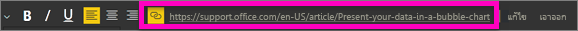
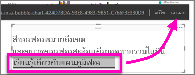

# เพิ่มการเชื่อมโยงหลายมิติไปยังกล่องข้อความในรายงาน
คุณสามารถเพิ่มกล่องข้อความไปยังรายงานใน Power BI Desktop หรือบริการของ Power BI คุณสามารถปักหมุดกล่องข้อความจากรายงานไปยังแดชบอร์ด หรือเพิ่มลงในแดชบอร์ดได้โดยตรง ไม่ว่ากล่องข้อความจะอยู่ที่ไหนคุณสามารถเพิ่มการเชื่อมโยงหลายมิติไปยังกล่องข้อความได้เสมอ บทความนี้แสดงวิธีการเพิ่มการเชื่อมโยงหลายมิติไปยังกล่องข้อความในรายงาน 

ดู วิล ทอมป์สัน สร้างกล่องข้อความและเพิ่มการเชื่อมโยงหลายมิติไปยังกล่องข้อความ 

<iframe width="560" height="315" src="https://www.youtube.com/embed/_3q6VEBhGew#t=0m55s" frameborder="0" allowfullscreen></iframe>

สำหรับข้อมูลเกี่ยวกับการเชื่อมโยงหลายมิติในตารางและเมทริกซ์ของ Power BI โปรดดู [เพิ่มการเชื่อมโยงหลายมิติไปยังตาราง](power-bi-hyperlinks-in-tables.md) สำหรับข้อมูลเกี่ยวกับการเพิ่มกล่องข้อความลงในแดชบอร์ดของคุณ โปรดดู [เพิ่มรูปภาพ วิดีโอ และอื่นๆ ไปยังแดชบอร์ดของคุณ](service-dashboard-add-widget.md) 

## เมื่อต้องเพิ่มการเชื่อมโยงหลายมิติไปยังกล่องข้อความ
1. เปิดรายงาน [สร้างกล่องข้อความ](power-bi-reports-add-text-and-shapes.md) แล้วเพิ่มข้อความบางอย่าง 
2. เลือกข้อความที่มีอยู่ หรือเพิ่มข้อความใหม่ เพื่อใช้เป็นการเชื่อมโยงหลายมิติ 

   เมนูกล่องข้อความจะปรากฏขึ้น
   
   
3. เลือกไอคอนการเชื่อมโยงหลายมิติ  บนเมนูกล่องข้อความ

   เขตข้อมูลการเชื่อมโยงหลายมิติจะปรากฏบนเมนูกล่องข้อความ

4. พิมพ์หรือวาง URL ลงในเขตข้อมูลการเชื่อมโยงหลายมิติ แล้วเลือก**เสร็จสิ้น**
   
   
5. ทดสอบลิงก์:  

   ก. วางเคอร์เซอร์ของคุณที่ใดก็ได้ในการเชื่อมโยงหลายมิติอันใหม่ในกล่องข้อความเพื่อแสดง URL ในเขตข้อมูลการเชื่อมโยงหลายมิติ  
     
      
   
      

   b. เลือก URL ในเขตข้อมูลการเชื่อมโยงหลายมิติที่จะเปิดหน้าเพจในหน้าต่างเบราว์เซอร์ใหม่

## หากต้องการนำการเชื่อมโยงหลายมิติออก
1. ในกล่องข้อความ ให้เลือกการเชื่อมโยงหลายมิติเพื่อไฮไลต์การเชื่อมโยงดังกล่าว
   
     
2. เลือก **นำออก** จากเมนูกล่องข้อความ 

   Power BI Desktop จะนำการเชื่อมโยงหลายมิติออก แต่ปล่อยข้อความทิ้งไว้

## ขั้นตอนถัดไป
[กล่องข้อความและรูปร่างในรายงาน Power BI](power-bi-reports-add-text-and-shapes.md)

มีคำถามเพิ่มเติมหรือไม่ [ลองไปที่ชุมชน Power BI](https://community.powerbi.com/)

