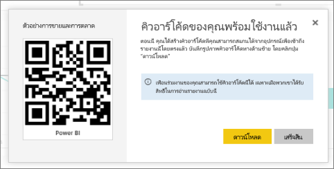

# สร้างคิวอาร์โค้ด ให้แก่รายงานที่ใช้ในแอปสำหรับอุปกรณ์เคลื่อนที่ของ Power BI
คิวอาร์โค้ดใน Power BI สามารถเชื่อมต่อทุกอย่างในโลกแห่งความจริง เข้ากับข้อมูลที่เกี่ยวข้องกับ BI่ได้โดยตรง &#151; โดยที่ไม่จำเป็นต้องใช้การค้นหา

คุณสามารถสร้างคิวอาร์โค้ดในบริการ Power BI ให้แก่รายงานทุกชนิด แม้แต่รายงานคุณไม่สามารถแก้ไขได้ จากนั้น คุณใส่คิวอาร์โค้ดในตำแหน่งหลัก ตัวอย่างเช่น คุณสามารถวางลงในอีเมล หรือพิมพ์ออกมาและวางในตำแหน่งที่เจาะจง 

เพื่อนร่วมงานที่คุณแชร์รายงานด้วยจะสามารถสแกนคิวอาร์โค้ดเพื่อเข้าถึงรายงาน ได้จาก[อุปกรณ์เคลื่อนที่ของพวกเขา](../consumer/mobile/mobile-apps-qr-code.md) พวกเขาสามารถใช้ที่สแกนคิวอาร์โค้ดที่อยู่ในแอป Power BI หรือที่สแกนคิวอาร์โค้ดอื่น ๆ ที่ติดตั้งบนอุปกรณ์ของพวกเขา พวกเขายังสามารถ[สแกนคิวอาร์โค้ดด้วย Power BI สำหรับแอปความเป็นจริงผสม](../consumer/mobile/mobile-mixed-reality-app.md#scan-a-report-qr-code-in-holographic-view)ได้อีกด้วย

## สร้างคิวอาร์โค้ดสำหรับรายงาน
1. เปิดรายงานใน Power BI
2. เลือก **ตัวเลือกเพิ่มเติม** (...) ที่มุมขวาบน แล้วเลือก**สร้างคิวอาร์โค้ด** 
   
    
3. กล่องโต้ตอบที่มีคิวอาร์โค้ดจะปรากฏขึ้น 
   
    
4. จากที่นี่ คุณสามารถสแกนคิวอาร์โค้ด หรือดาวน์โหลด และบันทึกเพื่อให้คุณสามารถ: 
   
   * เพิ่มคิวอาร์โค้ดลงในอีเมลหรือเอกสารอื่น ๆ หรือ 
   * พิมพคิวอาร์โค้ดและวางในตำแหน่งที่เจาะจง 

## พิมพ์คิวอาร์โค้ด
Power BI สร้างคิวอาร์โค้ด เป็นไฟล์ JPG พร้อมที่จะพิมพ์ 

1. เลือก**ดาวน์โหลด**แล้ว เปิดไฟล์ JPG บนคอมพิวเตอร์ที่เชื่อมต่อกับเครื่องพิมพ์  
   
   ไฟล์ JPG จะมีชื่อเหมือนกันเป็นไทล ตัวอย่างเช่น “Sale and Marketing Sample.jpg”
   
1. พิมพ์ไฟล์ที่ขนาด 100 เปอร์เซ็นต์ หรือ “ขนาดตามจริง”  
2. ตัดคิวอาร์โค้ดโดยรอบตามของของแผ่นงาน และใช้กาวติดไว้ตรงบริเวณที่เกี่ยวข้องกับรายงานนั้น ๆ 

## ขั้นตอนถัดไป
* [เชื่อมต่อกับข้อมูล Power BI จากโลกแห่งความจริง](../consumer/mobile/mobile-apps-data-in-real-world-context.md)ด้วยแอปสำหรับอุปกรณ์เคลื่อนที่
* [สแกนคิวอาร์โค้ดของ Power BI จากอุปกรณ์เคลื่อนที่ของคุณ](../consumer/mobile/mobile-apps-qr-code.md)
* [สร้างคิวอาร์โค้ด สำหรับไทล์](service-create-qr-code-for-tile.md)
* มีคำถามหรือไม่? [ลองถามชุมชน Power BI](https://community.powerbi.com/)
