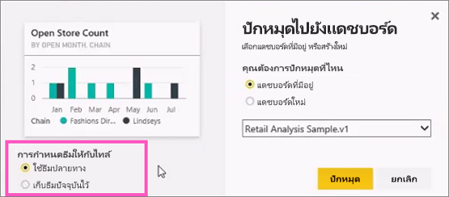
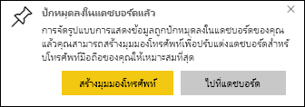

# ปักหมุดไทล์ไปยังแดชบอร์ด Power BI จากรายงาน

วิธีหนึ่งในการเพิ่ม[ไทล์แดชบอร์ด](../consumer/end-user-tiles.md)ใหม นั้นมาจากภายใน [รายงาน Power BI](../consumer/end-user-reports.md) เมื่อคุณเลือกหนึ่งในไทล์เหล่านี้ ไทล์จะเปิดขึ้นในรายงาน

หน้ารายงานทั้งหมดสามารถปักหมุดไปยังแดชบอร์ด ซึ่งเรียกว่าการปักหมุดไทล์ *สด* ที่เรียกกันว่าไทล์สดเนื่องจากคุณสามารถโต้ตอบกับไทล์บนแดชบอร์ดได้ การเปลี่ยนแปลงที่ทำในรายงานจะซิงค์กับแดชบอร์ดโดยอัตโนมัติ ซึ่งแตกต่างกับไทล์การแสดงข้อมูลด้วยภาพแต่ละรายการ สำหรับข้อมูลเพิ่มเติม ให้ดู[ปักหมุดหน้ารายงานทั้งหน้า](#pin-an-entire-report-page)

คุณไม่สามารถปักหมุดไทล์ จากรายงานที่มีการแชร์กับคุณ หรือจาก Power BI Desktop 

> [!TIP]
> เนื่องจากการแสดงข้อมูลด้วยภาพบางรายการมีการใช้ภาพพื้นหลัง การปักหมุดอาจไม่ทำงานหากภาพพื้นหลังมีขนาดใหญ่เกินไป ลองลดขนาดรูปภาพ หรือโดยใช้การบีบอัดรูปภาพ  
> 
> 

## ปักหมุดไทล์จากรายงาน
ดู Amanda สร้างแดชบอร์ดโดยการปักหมุดภาพและรูปภาพจากรายงาน Power BI
    

<iframe width="560" height="315" src="https://www.youtube.com/embed/lJKgWnvl6bQ" frameborder="0" allowfullscreen></iframe>

ในตอนนี้ ให้สร้างแดชบอร์ดของคุณเองโดยใช้หนึ่งในตัวอย่างรายงาน Power BI

1. ในรายงาน ให้วางเคอร์เซอร์เหนือการแสดงข้อมูลด้วยภาพที่คุณต้องการปักหมุด แล้วเลือกไอคอนเข็มหมุด  Power BI เปิดขึ้นในหน้าจอ**ปักหมุดลงในแดชบอร์ด**
   
     
2. เลือกว่า คุณต้องการปักหมุดไปยังแดชบอร์ดที่มีอยู่ หรือสร้างแดชบอร์ดใหม่
   
   * **แดชบอร์ดที่มีอยู่**: ให้เลือกชื่อของแดชบอร์ดจากรายการแบบดึงลง แดชบอร์ดที่แชร์กับคุณจะไม่ปรากฏขึ้นที่นี่
   * **แดชบอร์ดใหม่**: ป้อนชื่อของแดชบอร์ดใหม่
3. ในบางกรณี รายการที่คุณปักหมุดอาจจะมี *ธีม* ที่ถูกนำไปใช้อยู่แล้ว ตัวอย่างเช่น ภาพปักหมุดจากสมุดงาน Excel ถ้าเป็นเช่นนั้น เลือกชุดรูปแบบที่จะใช้กับไทล์
4. เลือก**หมุด**
   
   ข้อความว่าสำเร็จแล้ว (ใกล้กับมุมบนขวา) ช่วยให้คุณทราบว่าได้เพิ่มการแสดงข้อมูลด้วยภาพเป็นไทล์ลงในแดชบอร์ดของคุณแล้ว
   
   
5. จากบานหน้าต่างนำทาง ให้เลือกแดชบอร์ดที่มีไทล์ใหม่ [แก้ไขการแสดงไทล์และลักษณะการทำงาน](service-dashboard-edit-tile.md)หรือเลือกไทล์เพื่อกลับไปยังรายงาน

## ปักหมุดทั้งหน้ารายงาน
อีกหนึ่งตัวเลือกก็คือ การปักหมุดหน้ารายงานทั้งหมดไปยังแดชบอร์ด ซึ่งเป็นวิธีง่าย ๆ ในการปักหมุดการแสดงข้อมูลด้วยภาพมากกว่าหนึ่งรายการในแต่ละครั้ง เมื่อคุณปักหมุดหน้ารายงานทั้งหน้า ไทล์จะเป็นแบบ*สด* นั่นก็คือ คุณสามารถโต้ตอบกับไทล์บนแดชบอร์ดได้ การเปลี่ยนแปลงที่คุณทำกับการแสดงข้อมูลลด้วยภาพในตัวแก้ไขรายงาน เช่นการเพิ่มตัวกรองหรือการเปลี่ยนแปลงเขตข้อมูลที่ใช้ในแผนภูมิ จะปรากฏในไทล์แดชบอร์ดด้วยเช่นกัน  

สำหรับข้อมูลเพิ่มเติม ให้ดู[ปักหมุดหน้ารายงานทั้งหน้า](service-dashboard-pin-live-tile-from-report.md)

## ขั้นตอนถัดไป
- [แดชบอร์ดสำหรับผู้บริโภคบริการของ Power BI](../consumer/end-user-dashboards.md)
- [ไทล์แดชบอร์ดใน Power BI](../consumer/end-user-tiles.md)
- [รายงานใน Power BI](../consumer/end-user-reports.md)
- [การรีเฟรชข้อมูลใน Power BI](../connect-data/refresh-data.md)
- [แนวคิดพื้นฐานสำหรับนักออกแบบในบริการ Power BI](../fundamentals/service-basic-concepts.md)

มีคำถามเพิ่มเติมหรือไม่ [ลองไปที่ชุมชน Power BI](https://community.powerbi.com/)
