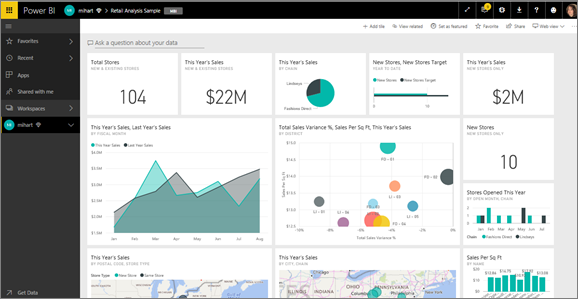
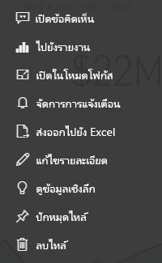

# แนะนำไทล์แดชบอร์ดสำหรับนักออกแบบ Power BI

ไทล์เป็นสแนปช็อตของข้อมูลของคุณที่ปักหมุดไปยังแดชบอร์ด คุณสามารถสร้างไทล์จากรายงาน ชุดข้อมูล แดชบอร์ด กล่องคำถาม Q&A, Excel และรายงาน SQL Server Reporting Services (SSRS) และอื่น ๆ ได้  ภาพถ่ายหน้าจอนี้แสดงไทล์ต่าง ๆ มากมายที่ปักหมุดไปยังแดชบอร์ดหนึ่ง

แดชบอร์ดและไทล์แดชบอร์ดเป็นคุณลักษณะของบริการ Power BI ไม่ใช่ของ Power BI Desktop คุณไม่สามารถสร้างแดชบอร์ดบนอุปกรณ์มือถือได้ แต่คุณสามารถ [ดูและแชร์]../consumer/mobile/mobile-apps-view-dashboard.md) รายการเหล่านั้นได้ที่นั่น

นอกจากการปักหมุดไทล์แล้ว คุณยังสามารถสร้างไทล์แบบเดี่ยวได้โดยตรงบนแดชบอร์ดโดยใช้ตัวควบคุม [เพิ่มไทล์](service-dashboard-add-widget.md) ไทล์แบบเดี่ยวรวมถึง: กล่องข้อความ รูปภาพ วิดีโอ ข้อมูลสตรีมมิ่ง และเนื้อหาบนเว็บ

ต้องการความช่วยเหลือในการทำความเข้าใจเกี่ยวกับบล็อกที่ประกอบเป็น Power BI หรือไม่ ดู[แนวคิดพื้นฐานสำหรับนักออกแบบในบริการของ Power BI](../fundamentals/service-basic-concepts.md)

> [!NOTE]
> ถ้าการแสดงภาพต้นฉบับที่ใช้เพื่อสร้างไทล์เปลี่ยนแปลง ไทล์ดังกล่าวจะไม่เปลี่ยนแปลงไปด้วย  ตัวอย่างเช่น ถ้าคุณปักหมุดแผนภูมิเส้นจากรายงาน จากนั้นคุณเปลี่ยนแผนภูมิเส้นเป็นแผนภูมิแท่ง ไทล์แดชบอร์ดจะยังคงแสดงแผนภูมิเส้น รีเฟรชข้อมูลแต่การชนิดแสดงภาพไม่เปลี่ยน
> 
> 

## ปักหมุดไทล์
มีหลายวิธีในการเพิ่ม (PIN) ไทล์หนึ่ง ๆ ไปยังแดชบอร์ดหนึ่ง คุณสามารถปักหมุดไทล์จาก:

* [การถามตอบสำหรับ Power BI](service-dashboard-pin-tile-from-q-and-a.md)
* [รายงาน](service-dashboard-pin-tile-from-report.md)
* [แดชบอร์ดอื่น](service-pin-tile-to-another-dashboard.md)
* [สมุดงาน Excel บน OneDrive for Business](service-dashboard-pin-tile-from-excel.md)
* [Quick Insights (ข้อมูลเชิงลึกด่วน)](service-insights.md)
* [รายงานที่มีการแบ่งหน้าภายในองค์กรในเซิร์ฟเวอร์รายงาน Power BI หรือ SQL Server Reporting Services](https://docs.microsoft.com/sql/reporting-services/pin-reporting-services-items-to-power-bi-dashboards)

คุณสามารถสร้างไทล์แบบเดี่ยวสำหรับรูปภาพ กล่องข้อความ วิดีโอ ข้อมูลสตรีมมิ่ง และเนื้อหาบนเว็บได้โดยตรงบนแดชบอร์ดโดยใช้ตัวควบคุม [เพิ่มไทล์](service-dashboard-add-widget.md)

  

## โต้ตอบกับไทล์บนแดชบอร์ด
หลังจากที่คุณได้เพิ่มไทล์ลงในแดชบอร์ดแล้ว คุณสามารถย้ายและปรับขนาดหรือเปลี่ยนลักษณะที่ปรากฏและลักษณะการทำงานได้

### ย้ายและปรับขนาดไทล์
หยิบไทล์และ[ย้ายไปรอบ ๆ ในแดชบอร์ด](service-dashboard-edit-tile.md) เลื่อนและเลือกด้ามจับเพื่อปรับขนาดไทล์

### เลื่อนเหนือไทล์เพื่อเปลี่ยนลักษณะปรากฏและลักษณะการทำงาน
1. เลื่อนเหนือไทล์เพื่อแสดงจุดไข่ปลา
   
    
2. เลือกจุดไข่ปลาเพื่อเปิดเมนูการดำเนินการของไทล์
   
    
   
    จากตรงนี้คุณสามารถ:
   
     * [เพิ่มความคิดเห็นในแดชบอร์ด](../consumer/end-user-comment.md)
     * [เปิดรายงานที่ใช้เพื่อสร้างไทล์นี้](../consumer/end-user-reports.md)  
     * [ดูในโหมดโฟกัส](../consumer/end-user-focus.md)   
     * [ส่งออกข้อมูลที่ใช้ในไทล์](../visuals/power-bi-visualization-export-data.md)
     * [แก้ไขชื่อเรื่องและคำบรรยายและเพิ่มไฮเปอร์ลิงก์](service-dashboard-edit-tile.md) 
     * [เรียกใช้ข้อมูลเชิงลึก](service-insights.md) 
     * [ปักหมุดไทล์ไปยังแดชบอร์ดอื่น](service-pin-tile-to-another-dashboard.md)
     * [ลบไทล์](service-dashboard-edit-tile.md)

3. เมื่อต้องปิดเมนูการดำเนินการ เลือกพื้นที่ว่างในแดชบอร์ด

### เลือกไทล์
เมื่อคุณเลือกไทล์หนึ่ง สิ่งที่จะเกิดขึ้นถัดไปขึ้นอยู่กับวิธีการที่คุณสร้างไทล์ มิฉะนั้น การเลือกไทล์จะนำคุณไปยังรายงาน เวิร์กบุ๊ก Excel Online รายงาน Reporting Services ที่อยู่ภายในองค์กร หรือคำถาม Q&A ที่ถูกใช้เพื่อสร้างไทล์ดังกล่าว หากมี[ลิงก์แบบกำหนดเอง](service-dashboard-edit-tile.md) การเลือกไทล์จะนำคุณไปที่ลิงก์นั้น

> [!NOTE]
> ข้อยกเว้นคือไทล์วิดีโอที่สร้างขึ้นโดยตรงบนแดชบอร์ดโดยใช้ **เพิ่มไทล์** การเลือกไทล์วิดีโอ (ที่สร้างขึ้นด้วยวิธีนี้) ทำให้วิดีโอสามารถเล่นได้บนแดชบอร์ดดังกล่าวโดยตรง   
> 
> 

## ข้อควรพิจารณาและการแก้ไขปัญหา

* ถ้ามีการบันทึกรายงานที่ใช้เพื่อสร้างการแสดงภาพไม่ได้รับการบันทึก การเลือกไทล์จะไม่ก่อให้เกิดการดำเนินการใด ๆ
* ถ้าไทล์ถูกสร้างขึ้นจากเวิร์กบุ๊กใน Excel Online คุณต้องมีสิทธิ์การอ่านสำหรับเวิร์กบุ๊กนั้นเป็นอย่างน้อย มิฉะนั้น การเลือกไทล์จะไม่เปิดเวิร์กบุ๊กใน Excel Online
* สมมติว่าคุณสร้างไทล์โดยตรงบนแดชบอร์ดโดยใช้ **เพิ่มไทล์** และตั้งค่าไฮเปอร์ลิงก์แบบกำหนดเองสำหรับไทล์นั้น ถ้าเป็นเช่นนั้น เมื่อคุณเลือกชื่อเรื่อง คำบรรยาย หรือไทล์ จะเปิด URL นั้น มิฉะนั้นตามค่าเริ่มต้น เมื่อคุณเลือกไทล์ที่ถูกสร้างขึ้นโดยตรงบนแดชบอร์ดสำหรับรูปภาพหนึ่ง โค้ดของเว็บ หรือกล่องข้อความ จะไม่ก่อให้เกิดการดำเนินการใด
* ไทล์สามารถสร้างได้จากรายงานที่มีการแบ่งหน้าภายในองค์กรในเซิร์ฟเวอร์รายงาน Power BI หรือ SQL Server Reporting Services ถ้าคุณไม่มีสิทธิ์ในการเข้าถึงรายงานภายในองค์กร การเลือกไทล์จะนำคุณไปยังหน้าที่ระบุว่าคุณไม่มีสิทธิ์เข้าถึง (rsAccessDenied)
* สมมติว่าคุณเลือกไทล์ที่สร้างจากรายงานที่มีการแบ่งหน้าภายในองค์กรในเซิร์ฟเวอร์รายงาน Power BI หรือ SQL Server Reporting Services ถ้าคุณไม่สามารถเข้าถึงเครือข่ายที่มีเซิร์ฟเวอร์รายงานนั้นอยู่ การเลือกไทล์ที่สร้างขึ้นจากรายงานที่มีการแบ่งหน้าจะนำคุณไปยังหน้าที่บ่งชี้ว่าไม่สามารถค้นหาเซิร์ฟเวอร์ (HTTP 404) ได้ อุปกรณ์ของคุณจำเป็นต้องมีสิทธิ์เข้าถึงเครือข่ายไปยังเซิร์ฟเวอร์รายงานเพื่อดูรายงานดังกล่าว
* ถ้าการแสดงภาพต้นฉบับที่ใช้เพื่อสร้างไทล์เปลี่ยนแปลง ไทล์ดังกล่าวจะไม่เปลี่ยนแปลงไปด้วย ตัวอย่างเช่น ถ้าคุณปักหมุดแผนภูมิเส้นจากรายงาน จากนั้นคุณเปลี่ยนแผนภูมิเส้นเป็นแผนภูมิแท่ง ไทล์แดชบอร์ดจะยังคงแสดงแผนภูมิเส้น ข้อมูลจะรีเฟรชแต่ชนิดการแสดงภาพไม่รีเฟรช

## ขั้นตอนถัดไป
- [สร้างการ์ด (ไทล์ตัวเลขขนาดใหญ่) สำหรับแดชบอร์ดของคุณ](../visuals/power-bi-visualization-card.md)
- [บทนำแดชบอร์ดสำหรับนักออกแบบ Power BI](service-dashboards.md)  
- [การรีเฟรชข้อมูลใน Power BI](../connect-data/refresh-data.md)
- [แนวคิดพื้นฐานสำหรับนักออกแบบในบริการ Power BI](../fundamentals/service-basic-concepts.md)
- [การรวมไทล์ Power BI ลงในเอกสาร Office](https://powerbi.microsoft.com/blog/integrating-power-bi-tiles-into-office-documents/)
- [ปักหมุดรายการ Reporting Services ไปยังแดชบอร์ด Power BI](https://msdn.microsoft.com/library/mt604784.aspx)

มีคำถามเพิ่มเติมหรือไม่ [ลองไปที่ชุมชน Power BI](https://community.powerbi.com/)
