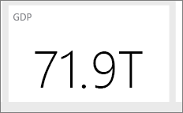

# เคล็ดลับสำหรับการออกแบบแดชบอร์ด Power BI ที่ยอดเยี่ยม
หลังจากที่คุณสร้างแดชบอร์ด และเพิ่มไทล์บางตัวเข้าไป ให้คิดเกี่ยวกับวิธีการทำให้แดชบอร์ดของคุณไม่เพียงแค่สวยงามเท่านั้น แต่ยังทำงาน โดยทั่วไปหมายถึงการทำข้อมูลที่สำคัญมากสุดให้ออกมาโดดเด่น และทำให้สะอาด และเป็นระเบียบ

> [!TIP]
> ชอบแดชบอร์ดนี้ไหม? คุณสามารถดาวน์โหลดแดชบอร์ดและรายงานที่เกี่ยวข้องจาก AppSource ไปที่ **รับข้อมูล** > **บริการ** ค้นหา **ตัวอย่างของ Microsoft - การขายและการตลาด**  > **รับทันที**

ต่อไปนี้คือเคล็ดลับบางอย่างสำหรับแดชบอร์ด

## วิดีโอแนวทางปฏิบัติที่ดีที่สุดสำหรับการออกแบบแดชบอร์ด

รับชมวิดีโอนี้เรื่อง [แนวทางปฏิบัติที่ดีที่สุดสำหรับการออกแบบแดชบอร์ดใน Power BI](https://www.youtube.com/watch?v=-tdkUYrzrio) สำหรับเคล็ดลับการออกแบบจาก Marco Russo ของ SQLBI.com

## ให้พิจารณาผู้ชมรายงาน
อะไรคือตัววัดหลักที่จะช่วยให้พวกเขาทำการตัดสินใจ วิธการใช้แดชบอร์ด สิ่งที่ได้เรียนรู้หรือสมมติฐานทางวัฒนธรรมบริโภคนิยมอะไรส่งผลต่อตัวเลือกการออกแบบ ข้อมูลใดที่ผู้ชมของคุณต้องทำให้สำเร็จ

ให้จำไว้ว่า แดชบอร์ดคือภาพรวมหรือสถานที่เดียวที่สามารถตรวจสอบสถานะปัจจุบันของธุรกิจได้ แดชบอร์ดจะยึดตามรายงานและชุดข้อมูลพื้นฐาน และรายการเหล่านั้นมักจะมีรายละเอียดมากมาย ผู้อ่านของคุณสามารถเจาะลึกเข้ารายงานจากแดชบอร์ดของคุณได้ ดังนั้นอย่าใส่รายละเอียดในแดชบอร์ด เว้นแต่ว่านั่นคือสิ่งที่ผู้อ่านของคุณจำเป็นต้องตรวจสอบ

แดชบอร์จะถูกแสดงอย่างไร ถ้าแดชบอร์ดอยู่บนจอภาพขนาดใหญ่ คุณสามารถใส่เนื้อหาเพิ่มเติมได้ แต่ถ้าผู้อ่านดูบนแท็บเล็ตของพวกเขา แดชบอร์ดที่มีไทล์น้อยกว่าจะช่วยให้อ่านได้ง่ายขึ้น

## บอกเล่าเรื่องราวบนหน้าจอเดียว
เนื่องจากแดชบอร์ดที่มีไว้เพื่อแสดงข้อมูลที่สำคัญอย่างรวดเร็ว หากมีไทล์ทั้งหมดบนหนึ่งหน้าจอจะดีที่สุด คุณสามารถหลีกเลี่ยงแถบเลื่อนบนแดชบอร์ดของคุณได้ไหม

มีแดชบอร์ดเกินไปอีกหรือไม่  ลบข้อมูลที่จำเป็นทั้งหมด แต่อ่านและตีความได้อย่างง่ายดาย

## ทำให้ใช้โหมดเต็มหน้าจอ
เมื่อนำเสนอแดชบอร์ด ให้แสดงในโหมด[เต็มหน้าจอ](../consumer/end-user-focus.md) โดยไม่มีสิ่งอื่นรบกวน

## เน้นข้อมูลที่สำคัญมากสุด
ถ้าข้อความและการแสดงภาพบนแดชบอร์ดของคุณจะมีขนาดเท่ากันทั้งหมด ผู้อ่านของคุณจะหาสิ่งสำคัญมากที่สุดยาก ตัวอย่างเช่น แสดงภาพการ์ดเป็นวิธีดีในการแสดงหมายเลขสำคัญให้เป็นที่รู้จัก  

แต่เช็คแน่ใจว่าคุณการให้บริบท  

อ่านเกี่ยวกับ[การสร้างไทล์ที่มีเพียงตัวเลขตัวเดียว](../visuals/power-bi-visualization-card.md)

## วางข้อมูลที่สำคัญมากสุด
คนส่วนใหญ่อ่านจากบนลงล่าง ดังนั้นให้ใส่รายละเอียดที่มุมบนซ้ายและแสดงรายละเอียดเพิ่มเติมเมื่อคุณย้ายในทิศทางที่ผู้ชมใช้อ่าน (จากซ้ายไปขวา บนลงล่าง)

## ใช้การแสดงข้อมูลด้วยภาพที่เหมาะสมสำหรับข้อมูล
หลีกเลี่ยงการแสดงภาพต่างๆ เพื่อให้มีความหลากหลาย  การแสดงภาพควรลงสีรูปภาพ และให้ "อ่าน" และแปลได้ง่าย  สำหรับข้อมูลและภาพบางอย่าง ภาพกราฟิกง่าย ๆ ก็เพียงพอ แต่อาจเรียกข้อมูลอื่นๆ เพื่อแสดงภาพที่ซับซ้อนมากขึ้น โปรดทำให้แน่ใจว่าได้ใช้ชื่อและป้ายชื่อและการกำหนดเองแบบอื่นๆ เพื่อช่วยผู้อ่าน  

* ระวังการใช้ภาพวิชวลที่ดูสวยงามแต่ยากต่อการอ่าน เช่น แผนภูมิสามมิติ 
* ซึ่งอาจเป็นเรื่องน่าผิดหวังที่ต้องทราบว่าแผนภูมิวงกลม แผนภูมิโดนัท แผนภูมิหน้าปัด และชนิดแผนภูมิวงกลมอื่นๆ ไม่ใช่แนวปฏิบัติที่ดีที่สุดสำหรับการแสดงภาพข้อมูล แผนภูมิวงกลมนั้นดีที่สุดถ้าพวกมีน้อยกว่าแปดประเภท เนื่องจากมนุษย์ไม่สามารถเปรียบเทียบค่าที่อยู่เคียงข้างกัน ดังนั้นจึงยากที่จะเปรียบเทียบค่าในแผนภูมิวงกลมมากกว่าในแผนภูมิแท่งและคอลัมน์ แผนภูมิวงกลมนั้นเหมาะสำหรับการดูความสัมพันธ์จากส่วนย่อยไปส่วนทั้งหมด มากกว่าการเปรียบเทียบส่วนได้ แผนภูมหน้าปัดนั้นยอดเยี่ยมสำหรับการแสดงสถานะปัจจุบันในบริบทของเป้าหมาย
* ทำให้มาตราส่วนแผนภูมิบนแกน การเรียงลำดับมิติแผนภูมิ และสีที่ใช้สำหรับค่ามิติภายในแผนภูมิสอดคล้องกัน
* ให้ตรวจสอบการเข้ารหัสข้อมูลเชิงปริมาณอย่างดี ไม่เกินสามหรือสี่ตัวเลขเมื่อแสดงตัวเลข แสดงหน่วยวัดหนึ่งหรือสองตัวเลขที่ด้านซ้ายจากจุดทศนิยมและมาตราส่วนสำหรับหลักพันหรือล้านนั่นคือ 3.4 ล้านไม่ใช่ 3,400,000
* แย่าผสมระดับของความแม่นยำกับเวลา ตรวจสอบให้แน่ใจว่ากรอบเวลานั้นความเข้าใจดีแล้ว อย่ามีแผนภูมิหนึ่งอันที่มีเดือนล่าสุดถัดจากแผนภูมิที่ถูกกรองจากเดือนเฉพาะเดิอนหนึ่งของปี
* อย่าผสมผสานหน่วยวัดขนาดใหญ่และขนาดเล็กในมาตราส่วนเดียวกัน เช่น บนแผนภูมิเส้นหรือแผนภูมิแท่ง ตัวอย่างเช่น หน่วยวัดหนึ่งอาจเป็นหลักล้านและอีกหน่วยวัดหนึ่งเป็นหลักพัน ด้วยมาตราส่วนขนาดใหญ่ ดังนั้นจึงเป็นการยากที่จะเห็นความแตกต่างของหน่วยวัดที่เป็นหลักพัน ถ้าคุณต้องการผสม ให้เลือกภาพที่อนุญาตให้ใช้แกนที่สอง
* อย่ากระจายป้ายชื่อข้อมูลที่ไม่จำเป็นในแผนภูมิของคุณ โดยปกติแล้ว ผู้อ่านสามารถเข้าใจค่าในแผนภูมิแท่งได้โดยไม่ต้องแสดงจำนวนที่แท้จริง
* ให้ความสนใจกับวิธีการชำระเงิน[แผนภูมิจะถูกเรียงลำดับ](../consumer/end-user-change-sort.md) ถ้าคุณต้องการดึงดูดความสนใจไปยังหมายเลขสูงสุดหรือต่ำสุด ให้เรียงลำดับตามหน่วยวัด ถ้าคุณต้องการให้บุคคลสามารถค้นหาหมวดหมู่เฉพาะที่ต้องการท่ามกลางหมวดหมู่อื่นมากมายได้อย่างรวดเร็ว ให้เรียงลำดับตามแกน  

สำหรับคำแนะนำเพิ่มเติมของการแสดงภาพแบบเฉพาะ ให้ดู[ชนิดการแสดงภาพใน Power BI](../visuals/power-bi-visualization-types-for-reports-and-q-and-a.md)  

## เรียนรู้เพิ่มเติมเกี่ยวกับการออกแบบแดชบอร์ด
เพื่อทำความเข้าใจศิลปะของการออกแบบแดชบอร์ดดีเยี่ยม ให้พิจารณาการเรียนรู้หลักการ Gestalt พื้นฐานของการได้รับรู้ถึงภาพและวิธีการติดต่อสื่อสารข้อมูลที่สามารถดำเนินการได้ในบริบทอย่างชัดเจน โชคดี ที่มีของแหล่งข้อมูลมากมายให้คุณสามารถค้นหาได้ รวมถึงข้อมูลภายในบล็อกของเราด้วย หนังสือที่เราชื่นชอบรวมถึง

* *Information Dashboard Design* โดย Stephen Few  
* *Show Me the Numbers* โดย Stephen Few  
* *Now You See It* โดย Stephen Few  
* *Envisioning Information* โดย Edward Tufte  
* *Advanced Presentations* Design โดย Andrew Abela   

## ขั้นตอนถัดไป
[สร้างแดชบอร์ดจากรายงาน](service-dashboard-create.md)  
[แนวคิดพื้นฐานสำหรับนักออกแบบในบริการของ Power BI](../fundamentals/service-basic-concepts.md)  
มีคำถามเพิ่มเติมหรือไม่ [ลองไปที่ชุมชน Power BI](https://community.powerbi.com/)
